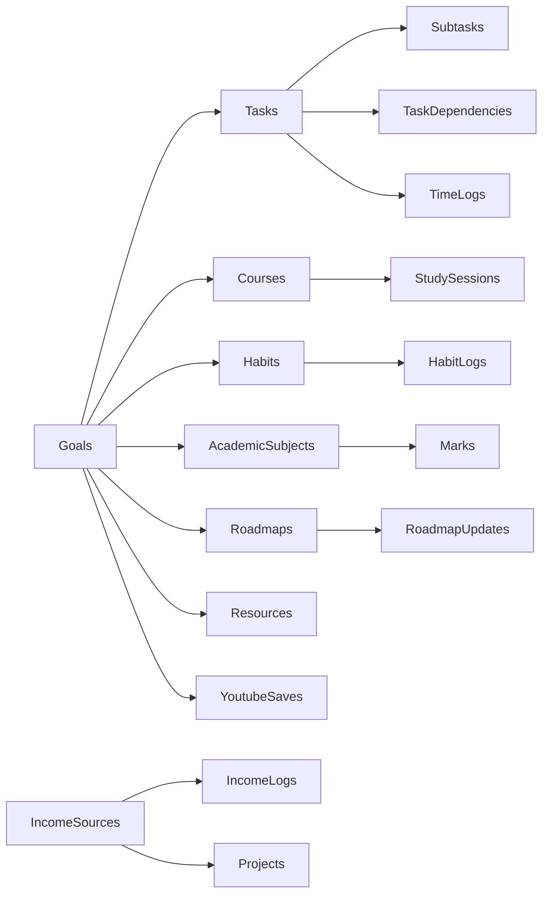

# Entity Relationship Diagram — Second Brain OS

## Document Control

| Field | Value |
|---|---|
| **Document ID** | ENG-ERD-001 |
| **Version** | 1.0.0 |
| **Status** | Approved |
| **Date** | 2026-07-10 |
| **Classification** | Internal |
| **Owner** | Developer |
| **Supersedes** | ERD section in `15_Database.md` |
| **Related Docs** | [Schema.md](Schema.md), [Constraints.md](Constraints.md) |

---

## 1. Executive Summary

This document provides the complete entity relationship diagram (ERD) for the Second Brain OS database — 27 tables across 15 functional modules. All tables enforce user-level data isolation via `user_id` foreign keys referencing `auth.users`. The database is hosted on Supabase PostgreSQL 15 with Row Level Security (RLS) enabled on every user-owned table.

**Key numbers:** 27 tables, 18+ user-owned entities, ~60 foreign key relationships, ~100KB estimated weekly growth per user.

---

## 2. Purpose

Define and visualize all table relationships, cardinalities, foreign key chains, and data flow paths to serve as the single source of truth for schema understanding, query authoring, and migration planning.

---

## 3. Scope

**In scope:** All 27 tables in the `public` schema of the Second Brain OS Supabase project.

**Out of scope:** Supabase internal schemas (`auth`, `storage`, `realtime`), extraneous extensions (`pg_cron`, `pg_net`), temporary tables.

---

## 4. Business Context

The database powers a personal AI productivity system for BTech CSE students. Each module maps to a real-world domain: task management, course tracking, goal planning, habit formation, sleep monitoring, income tracking, project management, idea pipeline, resource library, opportunity radar, time tracking, AI chat, memory consolidation, academic performance, and journaling.

---

## 5. Complete Entity Relationship Diagram

```mermaid
erDiagram
    %% ============================================================
    %% CORE — auth.users is the root identity
    %% ============================================================
    auth_users ||--o{ users_profile : "user_id"
    auth_users ||--o{ tasks : "user_id"
    auth_users ||--o{ courses : "user_id"
    auth_users ||--o{ youtube_saves : "user_id"
    auth_users ||--o{ resources : "user_id"
    auth_users ||--o{ ideas : "user_id"
    auth_users ||--o{ goals : "user_id"
    auth_users ||--o{ roadmaps : "user_id"
    auth_users ||--o{ roadmap_updates : "user_id"
    auth_users ||--o{ opportunities : "user_id"
    auth_users ||--o{ income_sources : "user_id"
    auth_users ||--o{ income_logs : "user_id"
    auth_users ||--o{ projects : "user_id"
    auth_users ||--o{ academic_subjects : "user_id"
    auth_users ||--o{ habits : "user_id"
    auth_users ||--o{ habit_logs : "user_id"
    auth_users ||--o{ sleep_logs : "user_id"
    auth_users ||--o{ time_logs : "user_id"
    auth_users ||--o{ chat_messages : "user_id"
    auth_users ||--o{ aria_memory : "user_id"
    auth_users ||--o{ daily_briefings : "user_id"
    auth_users ||--o{ weekly_reviews : "user_id"
    auth_users ||--o{ study_sessions : "user_id"
    auth_users ||--o{ daily_logs : "user_id"

    %% ============================================================
    %% MODULE RELATIONSHIPS — Task System
    %% ============================================================
    tasks ||--o{ subtasks : "task_id"
    tasks ||--o{ task_dependencies : "task_id"
    tasks ||--o{ time_logs : "task_id"
    tasks }o--|| goals : "goal_id"
    tasks }o--|| projects : "project_id"

    %% ============================================================
    %% MODULE RELATIONSHIPS — Goal System
    %% ============================================================
    goals ||--o{ roadmaps : "linked_roadmap_id"
    goals ||--o{ courses : "related_goal_id"
    goals ||--o{ habits : "linked_goal_id"
    goals ||--o{ academic_subjects : "related_goal_id"
    goals ||--o{ youtube_saves : "related_goal_id"
    goals ||--o{ resources : "related_goal_id"

    %% ============================================================
    %% MODULE RELATIONSHIPS — Roadmap System
    %% ============================================================
    roadmaps ||--o{ roadmap_updates : "roadmap_id"

    %% ============================================================
    %% MODULE RELATIONSHIPS — Income System
    %% ============================================================
    income_sources ||--o{ income_logs : "source_id"
    income_sources ||--o{ projects : "related_income_source_id"

    %% ============================================================
    %% MODULE RELATIONSHIPS — Academic System
    %% ============================================================
    academic_subjects ||--o{ marks : "subject_id"

    %% ============================================================
    %% MODULE RELATIONSHIPS — Habit System
    %% ============================================================
    habits ||--o{ habit_logs : "habit_id"

    %% ============================================================
    %% MODULE RELATIONSHIPS — Course System
    %% ============================================================
    courses ||--o{ study_sessions : "course_id"

    %% ============================================================
    %% USER OWNED ENTITY DEFINITIONS (columns summarized)
    %% ============================================================
    auth_users {
        uuid id PK
        text email
        text encrypted_password
    }

    users_profile {
        uuid id PK
        uuid user_id FK "unique"
        text name
        text email
        text college
        text branch
        jsonb skills
        jsonb daily_routine
        time bedtime
        time wake_time
        timestamptz created_at
    }

    tasks {
        uuid id PK
        uuid user_id FK
        text title "not null"
        text status "enum"
        text priority "enum"
        uuid goal_id FK
        uuid project_id FK
        int missed_count
        timestamptz due_date
        timestamptz created_at
    }

    subtasks {
        uuid id PK
        uuid task_id FK "not null"
        text title
        boolean is_completed
    }

    task_dependencies {
        uuid id PK
        uuid task_id FK
        uuid depends_on_id FK
    }

    courses {
        uuid id PK
        uuid user_id FK
        text title
        text platform "enum"
        text status "enum"
        int progress_percent
        timestamptz deadline
        uuid related_goal_id FK
    }

    youtube_saves {
        uuid id PK
        uuid user_id FK
        text url
        text title
        text ai_summary
        text status "enum"
        date watch_by_date
    }

    resources {
        uuid id PK
        uuid user_id FK
        text title
        text resource_type "enum"
        text[] tags
        text ai_summary
    }

    ideas {
        uuid id PK
        uuid user_id FK
        text title
        text idea_type "enum"
        jsonb ai_analysis
        text status "enum"
    }

    goals {
        uuid id PK
        uuid user_id FK
        text title
        text roadmap_type "enum"
        text status "enum"
        int progress_percent
        timestamptz target_date
        uuid linked_roadmap_id FK
    }

    roadmaps {
        uuid id PK
        uuid user_id FK
        text title
        text roadmap_type "enum"
        text status "enum"
        jsonb nodes
        jsonb edges
        int hours_per_day
        int days_per_week
    }

    roadmap_updates {
        uuid id PK
        uuid roadmap_id FK
        uuid user_id FK
        text node_label
        text update_type "enum"
        text status "enum"
    }

    opportunities {
        uuid id PK
        uuid user_id FK
        text title
        text opportunity_type "enum"
        text[] skills_required
        int match_score
        text status "enum"
    }

    income_sources {
        uuid id PK
        uuid user_id FK
        text name
        text source_type "enum"
        decimal monthly_amount
        decimal hours_per_week
        text status "enum"
    }

    income_logs {
        uuid id PK
        uuid user_id FK
        uuid source_id FK
        decimal amount
        date date
    }

    projects {
        uuid id PK
        uuid user_id FK
        text title
        text phase "enum"
        text status "enum"
        text next_action
        text blocker
        uuid related_income_source_id FK
    }

    academic_subjects {
        uuid id PK
        uuid user_id FK
        text name
        text code
        int credits
        text semester
        decimal marks_scored
        boolean at_risk_flag
    }

    marks {
        uuid id PK
        uuid subject_id FK
        text exam_type "enum"
        float marks_obtained
        float max_marks
    }

    habits {
        uuid id PK
        uuid user_id FK
        text title
        text frequency "enum"
        int current_streak
        uuid linked_goal_id FK
        text status "enum"
    }

    habit_logs {
        uuid id PK
        uuid habit_id FK
        date date
        boolean completed
    }

    sleep_logs {
        uuid id PK
        uuid user_id FK
        timestamptz sleep_start
        timestamptz sleep_end
        int quality_rating
        int sleep_score
        date date
    }

    time_logs {
        uuid id PK
        uuid user_id FK
        uuid task_id FK
        timestamptz started_at
        timestamptz ended_at
        int duration_seconds
        boolean is_pomodoro
        boolean is_deep_work
    }

    chat_messages {
        uuid id PK
        uuid user_id FK
        text role "enum"
        text content
        jsonb metadata
    }

    aria_memory {
        uuid id PK
        uuid user_id FK
        text memory_type "enum"
        text content
        float confidence
    }

    daily_briefings {
        uuid id PK
        uuid user_id FK
        date date
        jsonb briefing_content
        boolean was_read
    }

    weekly_reviews {
        uuid id PK
        uuid user_id FK
        date week_start
        text review_content
        int tasks_completed
        decimal income_logged
    }

    study_sessions {
        uuid id PK
        uuid user_id FK
        uuid course_id FK
        text subject
        timestamptz started_at
        int duration_minutes
        jsonb review_due_dates
    }

    daily_logs {
        uuid id PK
        uuid user_id FK
        date date
        text entry
    }

    audit_logs {
        uuid event_id PK
        uuid user_id FK
        text action
        text category
        text resource_type
        jsonb old_value
        jsonb new_value
        jsonb metadata
        inet ip_address
        text checksum
        timestamptz timestamp
    }
```



---

## 6. Foreign Key Chain Analysis

### 6.1 Direct User References

Every user-owned table has a direct `user_id` FK to `auth.users(id)` with `ON DELETE CASCADE`. This ensures account deletion cascades cleanly.

**Exception tables (no direct user_id):**

| Table | Access Path | Parent Table |
|---|---|---|
| `subtasks` | `task_id` → `tasks` → `user_id` | `tasks` |
| `task_dependencies` | `task_id` → `tasks` → `user_id` | `tasks` |
| `marks` | `subject_id` → `academic_subjects` → `user_id` | `academic_subjects` |
| `habit_logs` | `habit_id` → `habits` → `user_id` | `habits` |
| `roadmap_updates` | `roadmap_id` → `roadmaps` → `user_id` | `roadmaps` |
| `income_logs` | `source_id` → `income_sources` → `user_id` | `income_sources` |

### 6.2 Cross-Module Foreign Key Chains



### 6.3 Cardinality Summary

| Relationship | Cardinality | Meaning |
|---|---|---|
| `auth.users` → user-owned tables | 1:N | One user, many records per module |
| `tasks` → `subtasks` | 1:N | One task, many subtasks |
| `tasks` → `task_dependencies` | 1:N | One task, many dependency edges |
| `tasks` → `time_logs` | 1:N | One task, many time sessions |
| `goals` → `tasks` | 1:N | One goal can have many tasks |
| `goals` → `roadmaps` | 1:1 | One goal linked to one roadmap |
| `roadmaps` → `roadmap_updates` | 1:N | One roadmap, many AI-detected updates |
| `income_sources` → `income_logs` | 1:N | One source, many income entries |
| `income_sources` → `projects` | 1:N | One source can fund many projects |
| `habits` → `habit_logs` | 1:N | One habit, many daily logs |
| `courses` → `study_sessions` | 1:N | One course, many study sessions |
| `academic_subjects` → `marks` | 1:N | One subject, many exam marks |

---

## 7. Delete Cascade Behavior

| Parent Delete Action | Child Tables | Impact |
|---|---|---|
| `auth.users` CASCADE | All user-owned tables | Account deletion wipes all data |
| `tasks` CASCADE | `subtasks`, `task_dependencies` | Deleting a task removes its subtasks and dependency edges |
| `tasks` SET NULL | `time_logs` | Deleting a task preserves time logs (orphaned) |
| `goals` SET NULL | `tasks`, `courses`, `habits`, `youtube_saves`, `resources`, `academic_subjects` | Deleting a goal nullifies the reference in related tables |
| `roadmaps` CASCADE | `roadmap_updates` | Deleting a roadmap removes all its updates |
| `roadmaps` SET NULL | `goals` | Deleting a roadmap nullifies `linked_roadmap_id` on goals |
| `income_sources` CASCADE | `income_logs` | Deleting a source removes all its income entries |
| `income_sources` SET NULL | `projects` | Deleting a source preserves the project |
| `courses` SET NULL | `study_sessions` | Study sessions survive course deletion |
| `habits` CASCADE | `habit_logs` | Deleting a habit removes all its logs |
| `academic_subjects` CASCADE | `marks` | Deleting a subject removes all marks |

---

## 8. Realtime Publication Membership

Tables subscribing to `supabase_realtime` publication for live UI updates:

```sql
ALTER PUBLICATION supabase_realtime ADD TABLE tasks;
ALTER PUBLICATION supabase_realtime ADD TABLE chat_messages;
ALTER PUBLICATION supabase_realtime ADD TABLE opportunities;
ALTER PUBLICATION supabase_realtime ADD TABLE daily_briefings;
ALTER PUBLICATION supabase_realtime ADD TABLE goals;
ALTER PUBLICATION supabase_realtime ADD TABLE sleep_logs;
ALTER PUBLICATION supabase_realtime ADD TABLE time_logs;
ALTER PUBLICATION supabase_realtime ADD TABLE habits;
```

---

## 9. Table Relationship Validation

| Validation Rule | Check | Enforcement |
|---|---|---|
| All FKs reference existing parent PKs | Referential integrity | PostgreSQL FK constraints |
| No orphaned `user_id` references | Every `user_id` maps to existing `auth.users` | FK + RLS enforcement |
| Cascade completeness | No dangling references after parent delete | ON DELETE CASCADE / SET NULL |
| Unique constraints honored | No duplicate logical keys | `UNIQUE` constraints per table |
| Circular dependency check | No cyclical FK chains | Schema design audit |

---

## 10. Entity Count Estimates (Per User, Per Year)

| Entity | Est. Rows/Year | Growth Pattern |
|---|---|---|
| `tasks` | ~5,000 | Daily creation, completion, archiving |
| `subtasks` | ~3,000 | 1-3 per task |
| `courses` | ~200 | Semester-based |
| `goals` | ~100 | Quarterly |
| `roadmaps` | ~20 | Per major goal |
| `habits` | ~100 | Stable |
| `habit_logs` | ~10,000 | Daily per habit |
| `sleep_logs` | ~1,500 | Daily |
| `chat_messages` | ~50,000 | Daily chat interactions |
| `time_logs` | ~10,000 | Daily sessions |
| `income_logs` | ~500 | Weekly |
| `projects` | ~100 | Quarterly |
| `opportunities` | ~500 | Weekly scans |
| `resources` | ~1,000 | Weekly |
| Total | ~82,000 | ~225/day |

---

## 11. References

| Reference | Location |
|---|---|
| Full column definitions | [Schema.md](Schema.md) |
| Constraint definitions | [Constraints.md](Constraints.md) |
| Index strategy | [Indexes.md](Indexes.md) |
| RLS policy documentation | [Policies.md](Policies.md) |
| Original database doc | [15_Database.md](15_Database.md) |
| Data governance framework | [16_DataGovernance.md](16_DataGovernance.md) |
