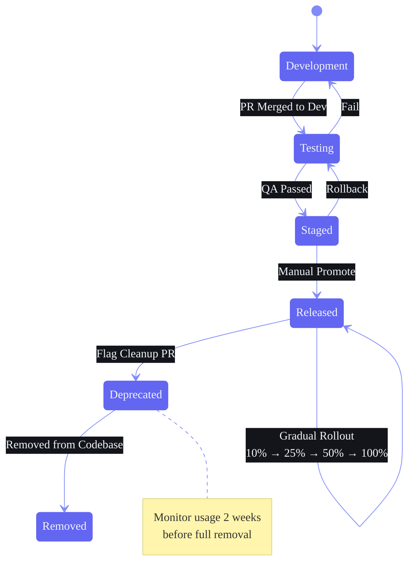

# Feature Flags — Architecture & Operations Guide

## Document Control

| Field | Value |
|---|---|
| **Document ID** | ENG-FLAGS-001 |
| **Version** | 2.0.0 |
| **Status** | Active |
| **Last Updated** | 2026-06-11 |
| **Classification** | Internal — Architecture & DevOps |
| **Owner** | Platform Engineering |
| **Review Cycle** | Monthly |

---

### Architecture Diagram — Feature Flag Lifecycle



---

## 1. Executive Summary

Second Brain OS ships continuously via CI/CD. Without a feature flag system, every incomplete feature blocks deployment. This document defines a comprehensive two-tier feature flag system (environment variables + Supabase `user_preferences`) with a unified evaluation API, flag registry, lifecycle management, gradual rollout strategies, kill switch design, health monitoring, audit logging, CI/CD integration, and best practices.

**Design Decisions:**
- **No external vendor for v1** — Self-hosted flag system until >1000 MAU
- **Two-tier storage** — Environment variables for ops toggles; Supabase for user-level flags
- **LaunchDarkly documented as migration path** — Abstraction layer ensures swap without code changes
- **Unified evaluation API** — Same `isEnabled()` function works in frontend (TS) and backend (Python)

---

## 2. Flag System Architecture

### 2.1 High-Level Architecture

```
  +------------------+     +------------------+     +------------------+
  |  Flag Storage    |     |  Flag Registry   |     |  Evaluation      |
  |  (3 tiers)       |---->|  (in-memory)     |---->|  Engine          |---> Gated Code
  +------------------+     +------------------+     +------------------+
         |                                                       |
         v                                                       v
  +------------------+                                   +------------------+
  | Env Vars         |                                   | Admin UI         |
  | Supabase JSONB   |                                   | /admin/flags     |
  | Registry Default |                                   | Audit Log        |
  +------------------+                                   +------------------+

  +------------------+     +------------------+     +------------------+
  | CI/CD Integrate  |     | Stale Flag       |     | Flag Usage       |
  | (promote flags)  |---->| Monitoring       |---->| Analytics        |
  +------------------+     +------------------+     +------------------+
```

### 2.2 Flag Evaluation Flow

```
  isEnabled(flagName)
         |
         v
  Flag in Registry? ---YES--> Return true
         | NO
         v
  Env Var Override? ---YES--> Return value
         | NO
         v
  User Override? ---YES--> Return value
         | NO
         v
  Env Default? ---YES--> Return value
         | NO
         v
  Date Range Outside? ---YES--> Return false
         | (inside range)
         v
  User in Rollout %? ---YES--> Return true
         | (not in %)
         v
  Return Registry Default
```

### 2.3 Evaluation Priority Order

| Priority | Source | Check | Notes |
|---|---|---|---|
| **1** (Highest) | Environment Variable | `FLAG_{NAME}` or `NEXT_PUBLIC_FLAG_{NAME}` | Ops kill switch; overrides everything |
| **2** | User Flag Override | `user_preferences.flag_overrides[{name}]` | Per-user beta/experiment access |
| **3** | Env Definition Override | `FLAG_REGISTRY[name].environments[{env}]` | Per-environment defaults |
| **4** | Date Range Check | `FLAG_REGISTRY[name].date_range` | Time-boxed feature gates |
| **5** | Percentage Rollout | `hash(user_id) < rollout_percentage` | Deterministic by user ID |
| **6** (Lowest) | Registry Default | `FLAG_REGISTRY[name].default` | Fallback when no other match |

---

## 3. Flag Types

### 3.1 Type Definitions

| Type | Purpose | Lifetime | Persistence | Examples |
|---|---|---|---|---|
| **Release toggle** | Gate unfinished features in production | Days–weeks | Short-lived; removed after feature GA | `feature_tasks_ai_breakdown` |
| **Experiment toggle** | A/B test variants, gradual rollouts | Weeks–months | Medium-lived; removed after experiment ends | `experiment_dashboard_layout_v2` |
| **Ops toggle** | Kill switch for performance/incidents | Hours–days | Short-lived; removed after incident resolved | `ops_disable_analytics_heavy` |
| **Permission toggle** | Beta/alpha access gates | Months–permanent | Long-lived; some permanent (admin) | `perm_beta_ai_agent` |

### 3.2 Release Toggles

| Property | Value |
|---|---|
| **Purpose** | Decouple deployment from release; ship incomplete features safely |
| **Max Lifetime** | 2 weeks (beyond that, refactor or remove) |
| **Cleanup Priority** | High |
| **Override Mechanism** | Environment (dev/staging) → User override (beta testers) |

```typescript
export function TasksPage() {
  return (
    <div>
      <TaskList />
      {isEnabled('feature_tasks_ai_breakdown') && <AIBreakdownPanel />}
    </div>
  )
}
```

### 3.3 Experiment Toggles

| Property | Value |
|---|---|
| **Purpose** | A/B test new UX variants, algorithms, or features |
| **Max Lifetime** | 3 months (must conclude and be removed) |
| **Cleanup Priority** | High |
| **Override Mechanism** | Percentage rollout + user override for specific testers |
| **Metrics Required** | Must have defined success/failure metrics before enabling |

```typescript
function DashboardPage() {
  const useV2Layout = isEnabled('experiment_dashboard_layout_v2')
  return useV2Layout ? <DashboardV2 /> : <DashboardV1 />
}
```

### 3.4 Ops Toggles

| Property | Value |
|---|---|
| **Purpose** | Kill switches for production safety |
| **Max Lifetime** | 72 hours (must patch root cause) |
| **Cleanup Priority** | Critical — remove after incident resolved |
| **Override Mechanism** | Environment variable only (highest priority) |

```typescript
if (isEnabled('ops_disable_analytics_heavy')) {
  return fallbackAnalytics()
}
return computeFullAnalytics()
```

### 3.5 Permission Toggles

| Property | Value |
|---|---|
| **Purpose** | Gate access by user role, beta status, or subscription tier |
| **Max Lifetime** | Indefinite (but review quarterly) |
| **Cleanup Priority** | Low |
| **Override Mechanism** | User-level override in Supabase |

```typescript
if (!isEnabled('perm_beta_ai_agent')) {
  return <UpgradePrompt message="AI Agent coming soon!" />
}
return <AIAgentPanel />
```

---

## 4. Flag Storage

### 4.1 Storage Tier Decision Tree

```
Is the flag an OPS kill switch?
  +-- YES --> Use Environment Variable
  +-- NO
       +-- Does the flag need per-user variation?
            +-- YES --> Use Supabase user_preferences.flag_overrides
            +-- NO --> Use Flag Registry default (in-memory)
```

### 4.2 Tier 1: Environment Variables (Ops Toggles)

```bash
# .env.local / .env.production
# Ops kill switches (uppercase, FLAG_ prefix)
FLAG_OPS_DISABLE_ANALYTICS_HEAVY=false
FLAG_OPS_TIMEOUT_SUPABASE_30S=false
FLAG_OPS_DISABLE_AI_CHAT=false

# NEXT_PUBLIC_ for client-side accessible flags
NEXT_PUBLIC_FLAG_OPS_DISABLE_ANALYTICS_HEAVY=false
```

**Rules:**
- `NEXT_PUBLIC_FLAG_*` for frontend; `FLAG_*` for backend
- Env vars take **highest priority** — override any other flag state
- Use ONLY for ops toggles and emergency kill switches

### 4.3 Tier 2: Supabase `user_preferences.flag_overrides`

```sql
ALTER TABLE user_preferences
ADD COLUMN IF NOT EXISTS flag_overrides JSONB DEFAULT '{}'::jsonb;

CREATE INDEX IF NOT EXISTS idx_user_preferences_flags
ON user_preferences USING GIN (flag_overrides);
```

```json
{
  "feature_tasks_ai_breakdown": true,
  "experiment_dashboard_layout_v2": true,
  "perm_beta_ai_agent": true,
  "perm_internal_admin_panel": false
}
```

**Rules:**
- Per-user overrides stored as JSONB in `user_preferences`
- Only non-null values are considered overrides
- Keys not present fall through to registry defaults

### 4.4 Tier 3: Flag Registry (In-Memory)

```typescript
// packages/types/flags/registry.ts
export interface FlagDefinition {
  name: string
  type: 'release' | 'experiment' | 'ops' | 'permission'
  description: string
  default: boolean
  environments?: Partial<Record<'development' | 'staging' | 'production', boolean>>
  rollout_percentage?: number
  date_range?: { start?: string; end?: string }
  owner: string
  created: string
  cleanup_by?: string
  tags?: string[]
  issue_url?: string
  experiment_metrics?: string[]
}

export const FLAG_REGISTRY: Record<string, FlagDefinition> = {
  feature_tasks_ai_breakdown: {
    name: 'feature_tasks_ai_breakdown',
    type: 'release',
    description: 'AI-powered task breakdown suggestions in task detail view',
    default: false,
    environments: { development: true, staging: true, production: false },
    owner: 'FE Team',
    created: '2026-06-01',
    cleanup_by: '2026-08-01',
    tags: ['tasks', 'ai'],
    issue_url: 'https://github.com/.../issues/42',
  },
  experiment_dashboard_layout_v2: {
    name: 'experiment_dashboard_layout_v2',
    type: 'experiment',
    description: 'New dashboard layout with analytics widgets and timeline view',
    default: false,
    rollout_percentage: 10,
    owner: 'Product Team',
    created: '2026-06-10',
    cleanup_by: '2026-09-01',
    tags: ['dashboard', 'ux', 'experiment'],
    experiment_metrics: ['engagement_time', 'feature_usage', 'click_through_rate'],
  },
  ops_disable_analytics_heavy: {
    name: 'ops_disable_analytics_heavy',
    type: 'ops',
    description: 'Kill switch for expensive analytics aggregation queries',
    default: false,
    owner: 'Infra Team',
    created: '2026-05-15',
    tags: ['performance', 'ops'],
  },
  perm_beta_ai_agent: {
    name: 'perm_beta_ai_agent',
    type: 'permission',
    description: 'Beta access to AI agent features',
    default: false,
    environments: { development: true, staging: true },
    owner: 'Product Team',
    created: '2026-06-01',
    tags: ['ai', 'beta', 'permissions'],
  },
}
```

### 4.5 LaunchDarkly Migration Path

```typescript
// packages/shared/flags/adapters/launchdarkly.ts
// When migrating to LaunchDarkly (>1000 MAU)
import { LDClient } from 'launchdarkly-node-server-sdk'

export class LaunchDarklyAdapter implements FlagAdapter {
  private client: LDClient
  constructor(sdkKey: string) { this.client = new LDClient(sdkKey) }

  async isEnabled(flagName: string, user: FlagUser): Promise<boolean> {
    return this.client.variation(flagName, user, false)
  }
}

// Abstraction layer — all code uses isEnabled(); only backend changes:
// Current (v1): const adapter = new InMemoryAdapter(context)
// Future (v2):  const adapter = new LaunchDarklyAdapter(LD_SDK_KEY)
```

---

## 5. Flag Naming Convention

### 5.1 Format

```
{type}_{module}_{short_description}
```

All lowercase, snake_case, maximum 50 characters total.

### 5.2 Type Prefixes

| Type Prefix | Module Examples | Pattern |
|---|---|---|
| `feature_` | tasks, habits, goals, analytics, notes, chat | `feature_{module}_{feature_name}` |
| `experiment_` | dashboard, editor, search, onboarding | `experiment_{module}_{name}` |
| `ops_` | disable, enable, timeout, ratelimit | `ops_{action}_{target}` |
| `perm_` | beta, alpha, internal, admin | `perm_{tier}_{feature}` |

### 5.3 Valid Flag Names

| Flag Name | Type | Module | Description |
|---|---|---|---|
| `feature_tasks_ai_breakdown` | Release | tasks | AI-powered task breakdown suggestions |
| `feature_notes_realtime_collab` | Release | notes | Real-time collaborative note editing |
| `experiment_dashboard_layout_v2` | Experiment | dashboard | New dashboard layout with analytics widgets |
| `experiment_search_fuzzy_v2` | Experiment | search | Fuzzy search algorithm v2 |
| `ops_disable_analytics_heavy` | Ops | analytics | Kill switch for expensive analytics queries |
| `ops_timeout_supabase_30s` | Ops | database | Increase Supabase query timeout to 30s |
| `perm_beta_ai_agent` | Permission | ai | Beta access to AI agent features |
| `perm_internal_admin_panel` | Permission | admin | Internal admin panel access |

### 5.4 Invalid Flag Names

| Flag Name | Why Invalid |
|---|---|
| `new_feature_x` | Too vague; doesn't identify module or purpose |
| `MY_FEATURE_FLAG` | Should be lowercase snake_case |
| `feature-tasks-ai-breakdown` | Use underscores, not hyphens |
| `feature_tasks_ai_breakdown_v3_enhanced_edition` | Too long (>50 chars) |
| `perm_experiment_feature_ops_hybrid` | Ambiguous type prefix |

---

## 6. Flag Lifecycle

### 6.1 Lifecycle Stages

```
  CREATE   -->   ROLLOUT   -->   STABLE   -->   CLEANUP   -->   REMOVE
  (draft)       (eval)         (GA)          (plan)         (done)
     |              |              |              |              |
     v              v              v              v              v
  Add flag       Enable for    Feature        Remove gated    Delete flag
  definition     dev/staging   proven stable  code paths      definition
  + gated code   -> beta users -> remove       -> keep new     + old code
                 -> 10% rollout  fallback       code only       paths
                 -> production
```

### 6.2 Stage Gates

| Stage | Entry Criteria | Actions | Exit Criteria |
|---|---|---|---|
| **CREATE** | Feature defined, tracking issue created | Add flag to registry; wrap new code in `isEnabled()`; add tests | Flag definition merged to main |
| **ROLLOUT** | Feature code complete, tests passing | Enable for dev; enable for staging; gradual % rollout | Feature proven in production |
| **STABLE** | Feature GA (100% rollout for 1 week, no issues) | Remove fallback code paths; keep flag for monitoring | All users on new code for 1+ week |
| **CLEANUP** | Stale flag identified | Schedule removal; update docs; notify team | Cleanup plan approved |
| **REMOVE** | Cleanup approved | Delete flag definition; remove all `isEnabled()` conditionals | No references to flag in codebase |

### 6.3 Flag Cleanup Schedule

| Flag Age | Action |
|---|---|
| < 1 week | Normal development; keep in registry |
| 1–2 weeks | Review: is this still needed? |
| 2–4 weeks | Flag should be removed or have documented exception |
| > 4 weeks | CI alert — stale flag detected; must justify or remove |

### 6.4 Maximum Flag Lifetime by Type

| Type | Max Lifetime | Grace Period | Auto-Remove |
|---|---|---|---|
| Release | 2 weeks | 1 week | Linter warning at 2 weeks |
| Experiment | 3 months | 1 month | Generate JIRA ticket at 3 months |
| Ops | 72 hours | 24 hours | Generate incident report at 72 hours |
| Permission | Indefinite | — | Quarterly review |

---

## 7. Evaluation API Reference

### 7.1 TypeScript — Frontend / Shared

```typescript
// packages/shared/flags/index.ts
import { FLAG_REGISTRY, type FlagDefinition } from '@secondbrain/types/flags/registry'

export interface FlagEvaluationContext {
  user_id: string | null
  email: string | null
  environment: 'development' | 'staging' | 'production'
  beta_tester: boolean
  flags_overrides: Record<string, boolean>
  now: Date
}

let globalContext: FlagEvaluationContext | null = null

export function setFlagContext(ctx: FlagEvaluationContext): void {
  globalContext = ctx
}

export function isEnabled(flagName: string): boolean {
  const flag = FLAG_REGISTRY[flagName]
  if (!flag) {
    if (process.env.NODE_ENV === 'development') {
      console.warn(`[Flags] Unknown flag: "${flagName}". Add to FLAG_REGISTRY.`)
    }
    return false
  }

  // 1. Environment variable override (highest priority)
  const envKey = `NEXT_PUBLIC_FLAG_${flagName.toUpperCase()}`
  const envVal = process.env[envKey]
  if (envVal !== undefined) return envVal === 'true'

  if (!globalContext) return flag.default

  // 2. User-level override from Supabase
  const userOverride = globalContext.flags_overrides?.[flagName]
  if (userOverride !== undefined) return userOverride

  // 3. Environment-specific default
  if (flag.environments?.[globalContext.environment] !== undefined) {
    return flag.environments[globalContext.environment]
  }

  // 4. Date range gating
  if (flag.date_range) {
    const now = globalContext.now.getTime()
    if (flag.date_range.start && now < new Date(flag.date_range.start).getTime()) return false
    if (flag.date_range.end && now > new Date(flag.date_range.end).getTime()) return false
  }

  // 5. Percentage rollout (deterministic by user_id)
  if (flag.rollout_percentage !== undefined && globalContext.user_id) {
    const hash = deterministicHash(globalContext.user_id)
    if (hash < flag.rollout_percentage) return true
  }

  // 6. Registry default (lowest priority)
  return flag.default
}

function deterministicHash(id: string): number {
  let hash = 0
  for (let i = 0; i < id.length; i++) {
    const char = id.charCodeAt(i)
    hash = ((hash << 5) - hash) + char
    hash |= 0
  }
  return Math.abs(hash) % 100
}
```

### 7.2 Python — Backend

```python
# packages/shared/flags/__init__.py
import os
import hashlib
from functools import lru_cache
from typing import Optional

from .registry import FLAG_REGISTRY

class FlagEvaluationContext:
    def __init__(self, user_id: Optional[str] = None, environment: str = "development"):
        self.user_id = user_id
        self.environment = environment

def is_feature_enabled(
    flag_name: str,
    context: Optional[FlagEvaluationContext] = None
) -> bool:
    flag = FLAG_REGISTRY.get(flag_name)
    if not flag:
        return False

    # 1. Environment variable override
    env_key = f"FLAG_{flag_name.upper()}"
    env_val = os.getenv(env_key)
    if env_val is not None:
        return env_val.lower() == "true"

    if not context:
        return flag["default"]

    # 2. User override from Supabase
    user_override = _get_user_flag_override(context.user_id, flag_name)
    if user_override is not None:
        return user_override

    # 3. Environment default
    env_defaults = flag.get("environments", {})
    if context.environment in env_defaults:
        return env_defaults[context.environment]

    # 4. Date range
    date_range = flag.get("date_range")
    if date_range:
        from datetime import datetime
        now = datetime.utcnow()
        if date_range.get("start") and now < datetime.fromisoformat(date_range["start"]):
            return False
        if date_range.get("end") and now > datetime.fromisoformat(date_range["end"]):
            return False

    # 5. Percentage rollout
    rollout_pct = flag.get("rollout_percentage")
    if rollout_pct is not None and context.user_id:
        hash_val = int(hashlib.md5(context.user_id.encode()).hexdigest(), 16) % 100
        if hash_val < rollout_pct:
            return True

    # 6. Registry default
    return flag["default"]

@lru_cache(maxsize=256)
def _get_user_flag_override(user_id: Optional[str], flag_name: str) -> Optional[bool]:
    if not user_id:
        return None
    try:
        from config.core.supabase import get_supabase
        supabase = get_supabase()
        result = supabase.table("user_preferences") \
            .select("flag_overrides") \
            .eq("user_id", user_id) \
            .single() \
            .execute()
        overrides = result.data.get("flag_overrides", {}) if result.data else {}
        return overrides.get(flag_name)
    except Exception:
        return None
```

### 7.3 Error Handling

| Scenario | Behavior | Log Level |
|---|---|---|
| Unknown flag name | Return `false`; log warning | Warning |
| Missing context | Use registry default | Debug |
| Supabase query failure | Fall through; return `false` last | Error |
| Env var parse error (non-boolean) | Return `false`; log error | Error |
| Date range parse error | Skip date check; log warning | Warning |

---

## 8. Flag Administration UI

### 8.1 Admin Dashboard (`/admin/flags`)

| Column | Description | Data Source | Editable |
|---|---|---|---|
| Flag Name | Read-only name | Registry | — |
| Type | Badge (color-coded by type) | Registry | — |
| Description | Brief purpose | Registry | — |
| Default | Registry default value | Registry | — |
| Environment | Effective value per env | Evaluated | — |
| User Override | Current user's override | Supabase | Yes (toggle) |
| Rollout % | Percentage (if experiment) | Registry | — |
| Status | On/Off/Mixed indicator | Evaluated | — |
| Age | Days since creation | Registry created | — |
| Cleanup | Days until/beyond cleanup_by | Registry | — |
| Actions | Edit, Clear override, View Audit, Remove | — | Yes |

### 8.2 Admin API Endpoints

```python
# apps/api/app/api/admin/flags.py
from fastapi import APIRouter, HTTPException, Depends
from pydantic import BaseModel

router = APIRouter(prefix="/api/admin/flags", tags=["admin", "flags"])

class FlagOverrideRequest(BaseModel):
    value: bool

@router.get("/")
async def list_flags(admin_id: str = Depends(get_admin_user)):
    pass

@router.get("/{flag_name}")
async def get_flag(flag_name: str, admin_id: str = Depends(get_admin_user)):
    if flag_name not in FLAG_REGISTRY:
        raise HTTPException(404, detail=f"Flag '{flag_name}' not found")
    return {**FLAG_REGISTRY[flag_name], "evaluated": is_feature_enabled(flag_name)}

@router.put("/override/{user_id}/{flag_name}")
async def set_flag_override(
    user_id: str, flag_name: str, request: FlagOverrideRequest,
    admin_id: str = Depends(get_admin_user),
):
    supabase = get_supabase()
    supabase.rpc("set_flag_override", {
        "p_user_id": user_id, "p_flag_name": flag_name, "p_value": request.value,
    }).execute()
    log_audit(admin_id, "flag_override", {
        "target_user": user_id, "flag": flag_name, "value": request.value,
    })
    return {"status": "ok", "flag": flag_name, "value": request.value}

@router.delete("/override/{user_id}/{flag_name}")
async def clear_flag_override(
    user_id: str, flag_name: str,
    admin_id: str = Depends(get_admin_user),
):
    supabase = get_supabase()
    supabase.rpc("clear_flag_override", {
        "p_user_id": user_id, "p_flag_name": flag_name,
    }).execute()
    log_audit(admin_id, "flag_override_clear", {
        "target_user": user_id, "flag": flag_name,
    })
    return {"status": "ok", "flag": flag_name, "overridden": False}

@router.get("/audit")
async def get_flag_audit_log(
    flag_name: str = None, limit: int = 50,
    admin_id: str = Depends(get_admin_user),
):
    pass

@router.post("/{flag_name}/invalidate-cache")
async def invalidate_flag_cache(
    flag_name: str, admin_id: str = Depends(get_admin_user),
):
    _get_user_flag_override.cache_clear()
    return {"status": "ok", "cache_cleared": True}
```

### 8.3 Supabase RPC Functions

```sql
CREATE OR REPLACE FUNCTION set_flag_override(
    p_user_id UUID, p_flag_name TEXT, p_value BOOLEAN
) RETURNS VOID AS $$
BEGIN
    UPDATE user_preferences
    SET flag_overrides = jsonb_set(
        COALESCE(flag_overrides, '{}'::jsonb),
        ARRAY[p_flag_name], to_jsonb(p_value), true
    )
    WHERE user_id = p_user_id;
    IF NOT FOUND THEN
        INSERT INTO user_preferences (user_id, flag_overrides)
        VALUES (p_user_id, jsonb_build_object(p_flag_name, p_value));
    END IF;
END;
$$ LANGUAGE plpgsql SECURITY DEFINER;

CREATE OR REPLACE FUNCTION clear_flag_override(
    p_user_id UUID, p_flag_name TEXT
) RETURNS VOID AS $$
BEGIN
    UPDATE user_preferences
    SET flag_overrides = flag_overrides - p_flag_name
    WHERE user_id = p_user_id AND flag_overrides ? p_flag_name;
END;
$$ LANGUAGE plpgsql SECURITY DEFINER;
```

---

## 9. Gradual Rollout Strategy

### 9.1 Rollout Phases

```
  Phase 1        Phase 2        Phase 3        Phase 4         Phase 5
  Internal       Alpha (5%)     Beta (25%)     GA (100%)       Cleanup

  [Dev,          [Int. users]   [Beta testers] [All users]     [Remove flag]
   Staging]
  Day 0          Day 1-3        Day 4-7        Day 8-14        Day 14-21
```

### 9.2 Rollout Criteria

| Phase | Criteria to Enter | Rollout Method | Gate |
|---|---|---|---|
| **Internal** | Feature compiles, unit tests pass | `environments: { development: true, staging: true }` | CI tests |
| **Alpha (5%)** | Integration tests pass, no P1 bugs | `rollout_percentage: 5` | QA sign-off |
| **Beta (25%)** | Alpha metrics good, no P1-P2 bugs | `rollout_percentage: 25` | Product review |
| **GA (100%)** | Beta feedback incorporated, stable 3 days | `rollout_percentage: 100` | Final approval |
| **Cleanup** | GA stable for 1 week | Delete flag, remove old code paths | Linter check |

### 9.3 Rollback Triggers

```typescript
const ROLLBACK_CONDITIONS = {
  error_rate_increase:    { threshold: 0.05, window: '5m' },
  p50_latency_increase:   { threshold: 500,  unit: 'ms' },
  p99_latency_increase:   { threshold: 2000, unit: 'ms' },
  user_complaints:        { threshold: 3,    window: '1h' },
  sentry_errors_new:      { threshold: 10,   window: '5m' },
}
```

### 9.4 Segment-Based Rollout (Future)

```typescript
interface SegmentRollout { segments: RolloutSegment[] }

interface RolloutSegment {
  name: string
  criteria: SegmentCriteria
  percentage: number
  failure: boolean
}

type SegmentCriteria =
  | { type: 'user_id', ids: string[] }
  | { type: 'email_domain', domains: string[] }
  | { type: 'geo', countries: string[] }
  | { type: 'user_property', key: string, values: string[] }
  | { type: 'beta_tester' }
```

---

## 10. Kill Switch Design

### 10.1 Emergency Kill Switch

```typescript
export async function emergencyDisable(flagName: string): Promise<void> {
  // 1. Set env var in prod (highest priority)
  await setEnvironmentVariable(`FLAG_${flagName.toUpperCase()}`, 'true')
  // 2. Invalidate caches
  invalidateFlagCache()
  // 3. Log the action
  logAudit('system', 'kill_switch_activated', {
    flag: flagName, timestamp: new Date().toISOString(),
  })
  // 4. Flag is now disabled for ALL users
}
```

### 10.2 Kill Switch Activation Scenarios

| Scenario | Flag to Activate | Expected Effect |
|---|---|---|
| Analytics query timeout | `ops_disable_analytics_heavy` | Skip expensive queries; return cached data |
| AI agent misbehavior | `ops_disable_ai_chat` | Fall back to basic keyword response |
| Supabase API degradation | `ops_supabase_read_only` | Switch to IndexedDB-only mode |
| Email service down | `ops_disable_email_notifications` | Stop sending; log queue for retry |
| Feature causing data corruption | `feature_<name>` set to `false` | Disable the specific feature immediately |

### 10.3 Kill Switch Audit Trail

```sql
INSERT INTO audit_logs (user_id, action, details)
VALUES ('system', 'kill_switch_activated', jsonb_build_object(
    'flag', 'ops_disable_analytics_heavy',
    'trigger', 'timeout_threshold_exceeded',
    'resolved_at', null, 'activated_at', now()
));
```

---

## 11. Flag Health Monitoring

### 11.1 Stale Flag Detection

```typescript
export function detectStaleFlags(): StaleFlagReport[] {
  const now = new Date()
  const stale: StaleFlagReport[] = []

  for (const [name, flag] of Object.entries(FLAG_REGISTRY)) {
    const created = new Date(flag.created)
    const age = (now.getTime() - created.getTime()) / (1000 * 60 * 60 * 24)

    if (flag.cleanup_by && now > new Date(flag.cleanup_by)) {
      stale.push({ name, reason: `Cleanup date passed: ${flag.cleanup_by}`, severity: 'high', age })
      continue
    }
    if (flag.type === 'release' && age > 14) {
      stale.push({ name, reason: `Release flag ${age.toFixed(0)} days old`, severity: 'high', age })
      continue
    }
    if (flag.type === 'experiment' && age > 90) {
      stale.push({ name, reason: `Experiment ${age.toFixed(0)} days old`, severity: 'medium', age })
      continue
    }
    if (flag.rollout_percentage === 100) {
      stale.push({ name, reason: 'Flag at 100% rollout — should be removed', severity: 'low', age })
    }
  }
  return stale
}
```

### 11.2 Flag Health Dashboard

```
  FLAG HEALTH DASHBOARD
  Total Flags: 12    Active: 8    Stale: 3    Kill Switches Active: 1    Cleanup Due: 5

  STALE FLAGS
  Flag Name        | Type    | Age   | Status | Owner     | Action
  feature_x        | release | 21d   | RED    | FE Team   | Remove
  experiment_y     | exp.    | 97d   | YELLOW | Product   | Conclude
  feature_z        | release | 16d   | YELLOW | FE Team   | Schedule
```

### 11.3 Flag Usage Analytics & Telemetry

| Metric | Collection Method | Purpose |
|---|---|---|
| Flag evaluation count | Wrapper in `isEnabled()` | Detect hot paths and performance impact |
| Flag enabled ratio | Per-user tracking | Measure experiment adoption |
| Stale flag count | Weekly cron job | Enforce cleanup cadence |
| Kill switch activations | Audit log query | Track incident frequency |
| Flag-to-code ratio | Git grep `isEnabled()` | Measure technical debt |

### 11.4 Flag Performance Monitoring

```typescript
// packages/shared/flags/telemetry.ts
const flagTimings: Record<string, number[]> = {}

export function isEnabled(flagName: string): boolean {
  const start = performance.now()
  const result = evaluateFlag(flagName)
  const duration = performance.now() - start

  if (!flagTimings[flagName]) flagTimings[flagName] = []
  flagTimings[flagName].push(duration)

  // Warn if evaluation takes > 100ms (likely Supabase call)
  if (duration > 100) {
    console.warn(`[Flags] Slow evaluation for "${flagName}": ${duration.toFixed(1)}ms`)
  }

  return result
}

export function getFlagTelemetry(): FlagTelemetryReport {
  // Aggregate timing data for reporting
}
```

---

## 12. Flag Audit Log

### 12.1 Audit Log Schema

```sql
CREATE TABLE IF NOT EXISTS flag_audit_log (
    id UUID PRIMARY KEY DEFAULT gen_random_uuid(),
    flag_name TEXT NOT NULL,
    action TEXT NOT NULL,  -- 'created', 'enabled', 'disabled', 'override_set',
                           -- 'override_cleared', 'rollout_changed', 'removed'
    actor_id UUID REFERENCES auth.users(id),
    target_user_id UUID,  -- For user-level overrides
    old_value TEXT,        -- JSON: previous state
    new_value TEXT,        -- JSON: new state
    reason TEXT,
    metadata JSONB DEFAULT '{}'::jsonb,
    created_at TIMESTAMPTZ DEFAULT NOW()
);

CREATE INDEX idx_flag_audit_name ON flag_audit_log(flag_name);
CREATE INDEX idx_flag_audit_time ON flag_audit_log(created_at DESC);
```

### 12.2 Audited Actions

| Action | Trigger | Data Captured |
|---|---|---|
| `created` | Flag added to registry | Flag definition |
| `enabled` | Flag evaluates to true for user | User ID, environment |
| `disabled` | Flag evaluates to false for user | User ID, environment |
| `override_set` | Admin sets user override | Admin ID, target user, old/new value |
| `override_cleared` | Admin clears user override | Admin ID, target user |
| `rollout_changed` | Rollout percentage changed | Old %, new % |
| `removed` | Flag deleted from registry | Full flag definition (archived) |
| `kill_switch` | Emergency kill switch activated | Trigger reason, timestamp |

---

## 13. CI/CD Integration

### 13.1 Flag Promotion Across Environments

```yaml
# .github/workflows/flag-promotion.yml
name: Flag Promotion

on:
  workflow_dispatch:
    inputs:
      flag_name:
        description: 'Flag to promote'
        required: true
      environment:
        description: 'Target environment'
        required: true
        type: choice
        options: [staging, production]

jobs:
  promote-flag:
    runs-on: ubuntu-latest
    steps:
      - uses: actions/checkout@v4
      - name: Promote flag to ${{ github.event.inputs.environment }}
        run: |
          python scripts/promote_flag.py \
            --flag ${{ github.event.inputs.flag_name }} \
            --env ${{ github.event.inputs.environment }}
```

### 13.2 CI Flag Validation

```yaml
# Part of CI pipeline — validates flag definitions
- name: Validate Flag Registry
  run: |
    python scripts/validate_flags.py
    # Checks:
    # - All flags have required fields
    # - No duplicate names
    # - No expired flags (past cleanup_by)
    # - No flags at 100% rollout for > 2 weeks
    # - cleanup_by is after created
    # - rollout_percentage is 0-100
```

### 13.3 Stale Flag CI Alert

```yaml
# CI job — alerts on stale flags in PRs
- name: Check for Stale Flags
  run: |
    python scripts/check_stale_flags.py --diff HEAD~1
    # If PR adds/modifies a flag that is already stale, block merge
```

### 13.4 Deployment Gating

```yaml
# Vercel deployment gating — check kill switches before deploy
- name: Pre-deploy Kill Switch Check
  run: |
    python scripts/check_kill_switches.py --env production
    # If any kill switch is active, block deployment and alert
```

---

## 14. Feature Flag Testing

### 14.1 Test Both Flag States

```typescript
// tests/flags/feature-flags.test.ts
import { isEnabled, setFlagContext } from '@secondbrain/shared/flags'

const getDefaultContext = (overrides = {}) => ({
  user_id: 'test-user',
  environment: 'development' as const,
  flags_overrides: {},
  beta_tester: false,
  now: new Date(),
  ...overrides,
})

describe('feature_tasks_ai_breakdown', () => {
  beforeEach(() => {
    setFlagContext(getDefaultContext())
  })

  it('returns false by default in production', () => {
    setFlagContext(getDefaultContext({ environment: 'production' }))
    expect(isEnabled('feature_tasks_ai_breakdown')).toBe(false)
  })

  it('returns true when user override is set', () => {
    setFlagContext(getDefaultContext({
      flags_overrides: { feature_tasks_ai_breakdown: true },
    }))
    expect(isEnabled('feature_tasks_ai_breakdown')).toBe(true)
  })

  it('returns false for unknown flags', () => {
    expect(isEnabled('feature_does_not_exist')).toBe(false)
  })

  it('supports env var override', () => {
    process.env.NEXT_PUBLIC_FLAG_FEATURE_TASKS_AI_BREAKDOWN = 'true'
    expect(isEnabled('feature_tasks_ai_breakdown')).toBe(true)
    delete process.env.NEXT_PUBLIC_FLAG_FEATURE_TASKS_AI_BREAKDOWN
  })

  it('respects date range gating', () => {
    setFlagContext(getDefaultContext({
      now: new Date('2025-01-01'),  // Before feature existed
    }))
    expect(isEnabled('feature_tasks_ai_breakdown')).toBe(false)
  })
})
```

### 14.2 Testing Matrix — All Flag States

| Test Case | Env Var | User Override | Env Default | Date Range | Rollout % | Expected |
|---|---|---|---|---|---|---|
| All disabled | unset | unset | false | in range | 0% | false |
| Env var true | true | unset | false | in range | 0% | true |
| User override false | unset | false | true | in range | 100% | false |
| Experiment rollout | unset | unset | false | in range | 10% (user in) | true |
| Date range closed | unset | unset | true | outside | 100% | false |
| Unknown flag | unset | unset | unset | unset | unset | false |

### 14.3 Python Tests

```python
# tests/test_flags.py
from unittest.mock import patch
from packages.shared.flags import is_feature_enabled, FlagEvaluationContext

def test_flag_default_false():
    with patch.dict(os.environ, {}, clear=True):
        assert is_feature_enabled("feature_tasks_ai_breakdown") == False

def test_flag_env_override():
    with patch.dict(os.environ, {"FLAG_FEATURE_TASKS_AI_BREAKDOWN": "true"}, clear=True):
        assert is_feature_enabled("feature_tasks_ai_breakdown") == True

def test_flag_environment_override():
    ctx = FlagEvaluationContext(environment="development")
    assert is_feature_enabled("feature_tasks_ai_breakdown", ctx) == True

def test_flag_production_default():
    ctx = FlagEvaluationContext(environment="production")
    assert is_feature_enabled("feature_tasks_ai_breakdown", ctx) == False
```

### 14.4 Mocking Flags in Components

```typescript
// In test setup
jest.mock('@secondbrain/shared/flags', () => ({
  ...jest.requireActual('@secondbrain/shared/flags'),
  isEnabled: jest.fn(),
}))

// Per test
;(isEnabled as jest.Mock).mockReturnValue(true)

// Test both UI branches
it('shows AI breakdown panel when feature is enabled', () => {
  ;(isEnabled as jest.Mock).mockReturnValue(true)
  render(<TasksPage />)
  expect(screen.getByTestId('ai-breakdown-panel')).toBeInTheDocument()
})

it('hides AI breakdown panel when feature is disabled', () => {
  ;(isEnabled as jest.Mock).mockReturnValue(false)
  render(<TasksPage />)
  expect(screen.queryByTestId('ai-breakdown-panel')).not.toBeInTheDocument()
})
```

---

## 15. Best Practices

### 15.1 Flag Hygiene Rules

| Rule | Description | Enforced By |
|---|---|---|
| **No permanent flags** | Every flag must have a cleanup_by date (except permission toggles) | Linter + CI |
| **Two-state tested** | Both true and false states must be tested | PR review |
| **Flag registry only** | No ad-hoc flags outside the registry | Linter |
| **Prefix enforcement** | All flags must follow naming convention | CI validation |
| **Cleanup plan** | PR adding a flag must include cleanup plan | PR template |
| **No nested flags** | Never check isEnabled() inside another flagged code path | Code review |
| **Kill switches documented** | Every ops toggle must have documentation | Registry validation |
| **Default false** | New flags default to false (opt-in) | Registry template |
| **One flag per PR** | Avoid combining multiple flags in one PR | CI check |

### 15.2 Anti-Patterns

| Anti-Pattern | Example | Why It's Bad | Correct Approach |
|---|---|---|---|
| **Permanent flag** | No `cleanup_by` on release toggle | Feature never graduates; code debt | Set cleanup date or make permission toggle |
| **Nested flags** | `if (A) { if (B) { ... } }` | Impossible to test all combinations | Nest features, not flags |
| **Flag in hot path** | `isEnabled()` called 1000x per render | Performance overhead | Cache result; evaluate at module level |
| **Flag with side effects** | `isEnabled()` triggers API call | Evaluation becomes impure | Keep evaluation pure; separate effects |
| **Too many flags** | 50+ active flags | Incomprehensible state space | Regular cleanup; max 10 active flags |
| **Flag in production after GA** | Flag at 100% for 3 months | Dead code; confusion | Remove flag immediately after GA |

### 15.3 Flag Inventory Management

| Practice | Frequency | Action |
|---|---|---|
| **Flag audit** | Monthly | List all flags; review age, type, cleanup_by |
| **Stale removal** | Bi-weekly | Remove flags past cleanup_by |
| **Documentation review** | Quarterly | Update this document with new patterns |
| **Performance check** | Monthly | Verify flag evaluation < 5ms avg |
| **Migration assessment** | Quarterly | Evaluate LaunchDarkly migration readiness |

### 15.4 Flag Count Targets

| Metric | Max | Current Target | Alert At |
|---|---|---|---|
| Total active flags | 20 | 12 | 15 |
| Release toggles | 5 | 3 | 4 |
| Experiment toggles | 3 | 1 | 2 |
| Ops toggles | 2 | 1 | 2 |
| Permission toggles | 10 | 2 | 5 |
| Stale flags (past cleanup) | 0 | 0 | 1 |

---

## 16. Flag Cleanup PR Checklist

When removing a flag, verify all items:

- [ ] Remove all `isEnabled('flag_name')` conditionals from codebase
- [ ] Delete fallback code paths (old implementation)
- [ ] Delete flag definition from `FLAG_REGISTRY`
- [ ] Delete `flag_overrides` entries for this flag in user preferences
- [ ] Remove environment variable if applicable
- [ ] Update this document if flag was documented
- [ ] Remove test cases specific to the flag
- [ ] Verify no references remain: `grep -r "flag_name" src/`
- [ ] Run full test suite
- [ ] Remove feature-specific monitoring/alerts

---

## 17. Appendices

### 17.1 Flag Registry Template

```typescript
const FLAG_REGISTRY: Record<string, FlagDefinition> = {
  feature_{module}_{name}: {
    name: 'feature_{module}_{name}',
    type: 'release',        // release | experiment | ops | permission
    description: '...',
    default: false,
    environments: { development: true, staging: true },
    rollout_percentage: undefined,  // 0-100
    date_range: undefined,          // { start: '2026-07-01', end: '2026-08-01' }
    owner: 'Team Name',
    created: '2026-MM-DD',
    cleanup_by: '2026-MM-DD',
    tags: ['tag1', 'tag2'],
    issue_url: 'https://github.com/.../issues/123',
  },
}
```

### 17.2 ADR References

| ADR | Title | Decision | Date |
|---|---|---|---|
| ADR-007 | Feature Flag System Design | Two-tier: env vars + Supabase JSONB; no vendor for v1 | 2026-03 |

### 17.3 Relationship to Other Docs

| Document | Relationship |
|---|---|
| `docs/engineering/11_TechStack.md` | Lists technologies used for flag storage |
| `docs/engineering/15_Database.md` | Schema for `user_preferences.flag_overrides` |
| `docs/engineering/17_API.md` | API reference for flag admin endpoints |
| `docs/qa/28_Testing.md` | Flag testing patterns and mocking strategy |
| `docs/operations/40_IncidentResponse.md` | Kill switch activation as incident response action |
| `docs/operations/49_ChangeManagement.md` | Flag promotion as change management process |

---

## Revision History

| Version | Date | Author | Changes |
|---|---|---|---|
| 0.1 | 2026-06-11 | Architecture Team | Initial draft |
| 1.0.0 | 2026-06-11 | Platform Engineering | Stable release with types, API, admin UI |
| 2.0.0 | 2026-06-11 | Platform Engineering | Enterprise upgrade: kill switch design, health monitoring, flag audit log, CI/CD integration, A/B testing framework, segment-based rollout, stale flag detection, performance monitoring, telemetry, anti-patterns guide, inventory management |

---

*End of Document — ENG-FLAGS-001*
