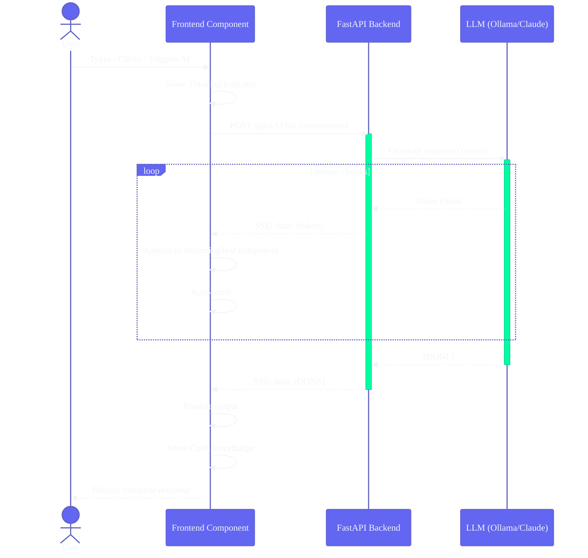
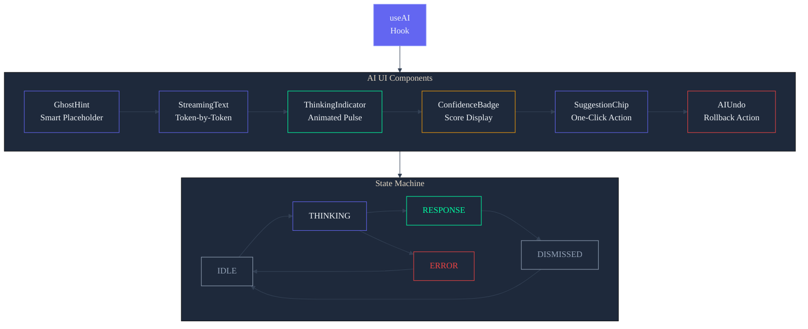

# Frontend AI/UX Patterns — Second Brain OS

| Field | Value |
|---|---|
| Document ID | ENG-FAI-001 |
| Version | 1.0.0 |
| Status | Active |
| Last Updated | 2026-06-12 |
| Applies To | `apps/web/components/` — AI-powered UI component patterns |

---

## Table of Contents

1. [Overview](#1-overview)
2. [Ghost Hint](#2-ghost-hint)
3. [Streaming Text](#3-streaming-text)
4. [Thinking Indicator](#4-thinking-indicator)
5. [Confidence Badge](#5-confidence-badge)
6. [Suggestion Chip](#6-suggestion-chip)
7. [AI Action Undo](#7-ai-action-undo)

---

## AI Streaming Response Flow



## AI UX Component Architecture



---

## 1. Overview

### 1.1 Design Principles

| Principle | Description |
|---|---|
| **Never block** | AI responses are always optional enhancements, never required for core functionality |
| **Show process** | Users should always see when AI is thinking, not be left wondering |
| **Degrade gracefully** | Every AI component has a fallback when the AI is unavailable |
| **Respect attention** | AI UI elements are subtle, non-intrusive, and dismissible |
| **Be trustworthy** | Show confidence scores, let users verify sources, offer undo |

### 1.2 Component States

Every AI component implements this state machine:

```
IDLE → THINKING → RESPONSE → DISMISSED
  │        │
  └── ERROR ──┘ (fallback to algorithmic response or hide)
```

---

## 2. Ghost Hint

### 2.1 Purpose

Shows an AI-suggested value as a subtle hint in an empty input field — like a placeholder but smarter. The hint appears as semi-transparent text that the user can accept (Tab) or ignore (keep typing).

### 2.2 Visual Specification

```
+-------------------------------------------------------------------+
| [Icon] Create a task about...                          [Tab to accept] |
|        design system proposal  ←── Ghost hint (opacity 40%)      |
+-------------------------------------------------------------------+
```

| State | Appearance | Opacity |
|---|---|---|
| Idle (no hint) | Normal placeholder | 100% placeholder |
| Hint visible | Ghost text after cursor | 40% opacity |
| Accepting hint | Hint converts to input value | 100% |
| Dismissing hint | Hint fades out as user types | 40% → 0% |
| Error | No hint (fallback to placeholder) | — |

### 2.3 Implementation

```typescript
interface GhostHintProps {
  value: string
  onChange: (value: string) => void
  hint: string
  onAccept?: () => void
  placeholder?: string
  disabled?: boolean
}

export function GhostHintInput({
  value,
  onChange,
  hint,
  onAccept,
  placeholder = 'Type here...',
  disabled = false,
}: GhostHintProps) {
  const [showHint, setShowHint] = useState(true)
  const inputRef = useRef<HTMLInputElement>(null)

  // Show hint only when input is empty and hint exists
  const shouldShowHint = showHint && !value && hint && !disabled

  const handleKeyDown = (e: React.KeyboardEvent) => {
    if (e.key === 'Tab' && shouldShowHint) {
      e.preventDefault()
      onChange(hint)
      setShowHint(false)
      onAccept?.()
    }
  }

  const handleChange = (e: React.ChangeEvent<HTMLInputElement>) => {
    onChange(e.target.value)
    if (e.target.value) setShowHint(false)
  }

  return (
    <div className="relative">
      <input
        ref={inputRef}
        type="text"
        value={value}
        onChange={handleChange}
        onKeyDown={handleKeyDown}
        onFocus={() => hint && setShowHint(true)}
        placeholder={placeholder}
        disabled={disabled}
        className="input w-full"
      />
      {shouldShowHint && (
        <div className="absolute inset-0 flex items-center pointer-events-none">
          {/* Ghost hint text */}
          <span className="pl-4 text-text-primary/40 truncate select-none" aria-hidden="true">
            {hint}
          </span>
          {/* Accept hint badge */}
          <span className="absolute right-3 text-[10px] text-text-tertiary bg-background-elevated px-1.5 py-0.5 rounded">
            Tab â­¾
          </span>
        </div>
      )}
    </div>
  )
}
```

### 2.4 Usage

```tsx
// Task title with AI suggestion
<GhostHintInput
  value={title}
  onChange={setTitle}
  hint="Complete DSA assignment - due tomorrow"
  onAccept={() => trackEvent('ghost_hint_accepted')}
  placeholder="What needs to be done?"
/>

// Course name suggestion
<GhostHintInput
  value={courseName}
  onChange={setCourseName}
  hint="Operating Systems (BTech CSE)"
/>
```

### 2.5 States Diagram

```
┌──────────┐  Typing starts  ┌────────────┐  Accept Tab  ┌───────────┐
│  IDLE    │ ──────────────► │ HINT SHOWN │ ────────────► │ ACCEPTED  │
│ (empty)  │                 │ (40%)      │               │ (100%)    │
└──────────┘                └─────┬───────┘               └───────────┘
                                  │                            │
                            User types                    Hint accepted
                                  â–¼                            â–¼
                          ┌──────────────┐           ┌─────────────────┐
                          │ HINT HIDDEN  │           │ NORMAL INPUT    │
                          │ (typing)     │           │ (editable)      │
                          └──────────────┘           └─────────────────┘
```

---

## 3. Streaming Text

### 3.1 Purpose

Reveals AI-generated text character by character (or word by word) to simulate real-time generation. Used for chat responses, briefing summaries, and AI-generated content.

### 3.2 Visual Specification

```
Streaming (in progress):
+----------------------------------------------------------------------+
| Here are your top 3 tasks for todayâ–Š                                  |
|                                                                       |
| 1️⃣ Complete DSA assignment (due 5 PM)                                |
| 2️⃣▊ <-- cursor still advancing                                       |
+----------------------------------------------------------------------+

Complete:
+----------------------------------------------------------------------+
| Here are your top 3 tasks for today:                                  |
|                                                                       |
| 1️⃣ Complete DSA assignment (due 5 PM)                                |
| 2️⃣ Review ML project proposal                                        |
| 3️⃣ Read Ch. 8 of System Design                                       |
|                                                                       |
| ────────────────────────────────────────────────────────               |
| Generated in 1.2s · [Copy] [Regenerate]                               |
+----------------------------------------------------------------------+
```

### 3.3 Implementation

```typescript
interface StreamingTextProps {
  content: string
  speed?: number           // ms per character (default: 15)
  onComplete?: () => void
  className?: string
  showCursor?: boolean
}

export function StreamingText({
  content,
  speed = 15,
  onComplete,
  className = '',
  showCursor = true,
}: StreamingTextProps) {
  const [displayed, setDisplayed] = useState('')
  const [isComplete, setIsComplete] = useState(false)
  const indexRef = useRef(0)

  useEffect(() => {
    if (!content) return

    indexRef.current = 0
    setDisplayed('')
    setIsComplete(false)

    const interval = setInterval(() => {
      if (indexRef.current < content.length) {
        setDisplayed(content.slice(0, indexRef.current + 1))
        indexRef.current++
      } else {
        clearInterval(interval)
        setIsComplete(true)
        onComplete?.()
      }
    }, speed)

    return () => clearInterval(interval)
  }, [content, speed, onComplete])

  if (!content && isComplete) return null

  return (
    <div className={className}>
      <span>{displayed}</span>
      {showCursor && !isComplete && (
        <span className="inline-block w-0.5 h-4 bg-accent-primary animate-pulse ml-0.5 align-middle" />
      )}
    </div>
  )
}
```

### 3.4 Usage

```tsx
// Chat message (streaming)
<StreamingText
  content={assistantResponse}
  speed={10}
  onComplete={() => playNotificationSound()}
/>

// Briefing summary
<StreamingText
  content={briefing.summary}
  speed={20}
  className="text-text-primary"
/>
```

### 3.5 Edge Cases

| Scenario | Behavior |
|---|---|
| Empty content | Render nothing |
| Content changes mid-stream | Reset and start streaming new content |
| User navigates away | Clean up interval, stop streaming |
| Very long content (>5000 chars) | Increase speed dynamically (adaptive) |
| Screen reader | Use `aria-live="polite"` on container |

---

## 4. Thinking Indicator

### 4.1 Purpose

Shows the user that the AI is actively processing their request. Used during: chat message generation, briefing creation, automation triggers, AI form suggestions.

### 4.2 Visual Specification

```
Variant 1: Pulse (default)
+----------------------------------------------------------------------+
|  ● ● ●   ARIA is thinking...                                        |
|  (pulsing glow animation)                                            |
+----------------------------------------------------------------------+

Variant 2: Dots
+----------------------------------------------------------------------+
|  . . .                                                                |
|  (bouncing animated dots)                                            |
+----------------------------------------------------------------------+

Variant 3: Typing
+----------------------------------------------------------------------+
|  ⬜⬜⬜   ARIA is typing___________________________________         |
|  (3 animated squares flashing in sequence)                            |
+----------------------------------------------------------------------+
```

### 4.3 Implementation

```typescript
interface ThinkingIndicatorProps {
  variant?: 'pulse' | 'dots' | 'typing'
  label?: string
  size?: 'sm' | 'default' | 'lg'
}

export function ThinkingIndicator({
  variant = 'pulse',
  label = 'ARIA is thinking',
  size = 'default',
}: ThinkingIndicatorProps) {
  return (
    <div className="flex items-center gap-3" role="status" aria-live="polite" aria-label={label}>
      {/* Pulse variant */}
      {variant === 'pulse' && (
        <div className="flex gap-1.5">
          {[1, 2, 3].map((i) => (
            <div
              key={i}
              className={clsx(
                'rounded-full bg-accent-primary',
                'animate-pulse',
                size === 'sm' ? 'w-1.5 h-1.5' : size === 'lg' ? 'w-3 h-3' : 'w-2 h-2',
                i === 1 && 'animation-delay-0',
                i === 2 && 'animation-delay-200',
                i === 3 && 'animation-delay-400'
              )}
            />
          ))}
        </div>
      )}

      {/* Dots variant */}
      {variant === 'dots' && (
        <div className="flex gap-1">
          {[0, 1, 2].map((i) => (
            <span
              key={i}
              className="text-accent-primary font-bold animate-bounce"
              style={{ animationDelay: `${i * 0.15}s` }}
            >
              .
            </span>
          ))}
        </div>
      )}

      {/* Typing variant */}
      {variant === 'typing' && (
        <div className="flex items-center gap-1">
          {[0, 1, 2].map((i) => (
            <div
              key={i}
              className={clsx(
                'bg-accent-primary/60 rounded-sm',
                'animate-pulse',
                size === 'sm' ? 'w-1.5 h-3' : 'w-2 h-4',
                i === 1 && 'animation-delay-300'
              )}
            />
          ))}
        </div>
      )}

      {/* Label */}
      <span className={clsx(
        'text-text-tertiary animate-pulse',
        size === 'sm' ? 'text-xs' : size === 'lg' ? 'text-base' : 'text-sm'
      )}>
        {label}
      </span>
    </div>
  )
}
```

### 4.4 Usage

```tsx
// Chat page — while waiting for AI response
{isStreaming && <ThinkingIndicator variant="pulse" label="ARIA is responding..." />}

// Briefing generation
{isGenerating && <ThinkingIndicator variant="dots" label="Generating briefing..." />}

// Inline suggestion
{isLoadingSuggestion && <ThinkingIndicator variant="typing" size="sm" />}
```

### 4.5 Variant Selection Guide

| Context | Variant | Why |
|---|---|---|
| Chat response | `pulse` | Standard, familiar indicator |
| Background task | `dots` | Less intrusive, suggests processing |
| Inline/Form | `typing` | Mimics human typing, contextual |
| Sidebar/minimal | `pulse` (sm) | Space-constrained |

---

## 5. Confidence Badge

### 5.1 Purpose

Shows the AI's confidence level in its suggestion or prediction. Used for: opportunity match scores, task priority suggestions, course recommendations, habit nudges.

### 5.2 Visual Specification

```
+----------------------------------------------------+
| Score: 92%                                         |
| ┃━━━━━━━━━━━━━━━━━━━━━━━━━━━━━━━━━━━━━━╌╌╌╌╌╌╌╌┤  |  ← Progress bar
| ┃━━━━━━━━━━━━━━━━━━━━━━━━━━━━━━╌╌╌╌╌╌╌╌╌╌╌╌╌╌╌┤  |  ← Fill = confidence
|  ● ── High confidence                             |
+----------------------------------------------------+

Variant: Badge only
+--------------------------------------+
| [🔲 High] [● Medium] [○ Low]       |
+--------------------------------------+
```

### 5.3 Implementation

```typescript
interface ConfidenceBadgeProps {
  score: number           // 0-100
  label?: string
  showScore?: boolean
  variant?: 'badge' | 'bar' | 'dot'
  size?: 'sm' | 'default'
}

const getConfidenceLevel = (score: number) => {
  if (score >= 80) return { level: 'High', color: 'text-accent-success', bg: 'bg-accent-success/10', bar: 'bg-accent-success' }
  if (score >= 50) return { level: 'Medium', color: 'text-accent-warning', bg: 'bg-accent-warning/10', bar: 'bg-accent-warning' }
  return { level: 'Low', color: 'text-accent-error', bg: 'bg-accent-error/10', bar: 'bg-accent-error' }
}

export function ConfidenceBadge({
  score,
  label,
  showScore = true,
  variant = 'badge',
  size = 'default',
}: ConfidenceBadgeProps) {
  const { level, color, bg, bar } = getConfidenceLevel(score)

  // Badge variant
  if (variant === 'badge') {
    return (
      <span className={clsx(
        'inline-flex items-center gap-1.5 px-2.5 py-1 rounded-md text-xs font-medium',
        bg, color
      )}>
        <span className={clsx(
          'w-1.5 h-1.5 rounded-full',
          level === 'High' && 'bg-accent-success',
          level === 'Medium' && 'bg-accent-warning',
          level === 'Low' && 'bg-accent-error'
        )} />
        {level}
        {showScore && <span className="opacity-70">({score}%)</span>}
      </span>
    )
  }

  // Bar variant
  if (variant === 'bar') {
    return (
      <div className="space-y-1">
        <div className="flex items-center justify-between text-xs">
          <span className={clsx('font-medium', color)}>{label || 'Confidence'}</span>
          <span className="text-text-tertiary">{score}%</span>
        </div>
        <div className="h-1.5 bg-background-elevated rounded-full overflow-hidden">
          <div
            className={clsx('h-full rounded-full transition-all duration-500', bar)}
            style={{ width: `${score}%` }}
          />
        </div>
      </div>
    )
  }

  // Dot variant
  return (
    <span className={clsx('inline-flex items-center gap-1.5', size === 'sm' ? 'text-xs' : 'text-sm')}>
      <span className={clsx(
        'rounded-full',
        size === 'sm' ? 'w-2 h-2' : 'w-2.5 h-2.5',
        level === 'High' && 'bg-accent-success',
        level === 'Medium' && 'bg-accent-warning',
        level === 'Low' && 'bg-accent-error'
      )} />
      <span className={color}>{level}</span>
    </span>
  )
}
```

### 5.4 Usage

```tsx
// Opportunity match
<ConfidenceBadge score={opportunity.match_score} variant="badge" />

// Task priority suggestion
<ConfidenceBadge score={82} variant="bar" label="Suggested Priority: High" />

// Inline confidence indicator
<ConfidenceBadge score={45} variant="dot" size="sm" />
```

### 5.5 Threshold Guide

| Score Range | Level | Visual | Icon | Action |
|---|---|---|---|---|
| 80-100 | High | Green (#22C55E) | Full circle | Auto-apply, no confirmation needed |
| 50-79 | Medium | Amber (#F59E0B) | Half circle | Suggest but require confirmation |
| 0-49 | Low | Red (#EF4444) | Empty circle | Show as optional hint only |

---

## 6. Suggestion Chip

### 6.1 Purpose

Inline clickable suggestions that the user can tap to fill form fields quickly. Used for: task title suggestions, course recommendations, habit ideas, tags, categories.

### 6.2 Visual Specification

```
+----------------------------------------------------------------------+
| Suggestions:                                                         |
|                                                                      |
| [Complete DSA assignment]  [Review ML project]  [Read Ch. 8]        |
|                                                                      |
| Click a suggestion to auto-fill the form field above.                |
+----------------------------------------------------------------------+

Selected state:
+----------------------------------------------------------------------+
| [Complete DSA assignment]  ● [Review ML project]  [Read Ch. 8]     |
|                                                                      |
| "Review ML project proposal" ← auto-filled in input                  |
+----------------------------------------------------------------------+
```

### 6.3 Implementation

```typescript
interface SuggestionChipProps {
  suggestions: string[]
  onSelect: (suggestion: string) => void
  selected?: string
  loading?: boolean
  label?: string
}

export function SuggestionChip({
  suggestions,
  onSelect,
  selected,
  loading = false,
  label = 'Suggestions',
}: SuggestionChipProps) {
  if (loading) {
    return (
      <div className="space-y-2">
        <p className="text-xs text-text-tertiary">{label}</p>
        <div className="flex gap-2 flex-wrap">
          {[1, 2, 3].map((i) => (
            <div key={i} className="h-8 w-32 rounded-lg bg-background-elevated animate-pulse" />
          ))}
        </div>
      </div>
    )
  }

  if (suggestions.length === 0) return null

  return (
    <div className="space-y-2">
      <p className="text-xs text-text-tertiary">{label}</p>
      <div className="flex gap-2 flex-wrap">
        {suggestions.map((suggestion) => (
          <button
            key={suggestion}
            onClick={() => onSelect(suggestion)}
            className={clsx(
              'px-3 py-1.5 rounded-lg text-sm font-medium transition-all duration-200',
              'border',
              selected === suggestion
                ? 'bg-accent-primary/10 border-accent-primary/30 text-accent-primary'
                : 'bg-background-elevated border-border-default text-text-secondary hover:border-accent-primary/30 hover:text-text-primary'
            )}
          >
            {suggestion}
          </button>
        ))}
      </div>
    </div>
  )
}
```

### 6.4 Usage

```tsx
// Task title suggestions
<SuggestionChip
  suggestions={['Complete DSA assignment', 'Review ML project', 'Read Ch. 8']}
  onSelect={(s) => setTitle(s)}
  selected={title}
  label="Based on your goals"
/>

// Tag suggestions
<SuggestionChip
  suggestions={['react', 'typescript', 'system-design']}
  onSelect={(tag) => addTag(tag)}
  label="AI-recommended tags"
/>
```

---

## 7. AI Action Undo

### 7.1 Purpose

Allows users to reverse an AI action within a configurable time window. Used for: AI-triggered task completion, AI-generated content acceptance, AI-suggested changes.

### 7.2 Visual Specification

```
Action performed:
+----------------------------------------------------------------------+
| ✅ Task "Review PR #42" marked as complete                            |
|                                                                      |
| [↩ Undo]  (5s remaining) ────────▒▒▒▒▒▒▒▒▒▒░░░░░░ 60%               |
|                                                                      |
| └── Toast notification, fixed bottom-right, z-1060                   |
+----------------------------------------------------------------------+

After undo:
+----------------------------------------------------------------------+
| ↩ Task restored to "pending"                                         |
+----------------------------------------------------------------------+

Timeout:
+----------------------------------------------------------------------+
| ✅ Change saved                                                      |
+----------------------------------------------------------------------+
```

### 7.3 Implementation

```typescript
interface UndoAction {
  id: string
  type: 'delete' | 'complete' | 'update' | 'generate'
  entity: { table: string; id: string; previousData: any }
  timestamp: number
  expiry: number  // Date.now() + duration
}

interface AIActionUndoProps {
  action: UndoAction
  onUndo: (action: UndoAction) => Promise<void>
  onExpire?: (action: UndoAction) => void
  duration?: number  // ms (default: 5000)
}

export function AIActionUndo({
  action,
  onUndo,
  onExpire,
  duration = 5000,
}: AIActionUndoProps) {
  const [timeLeft, setTimeLeft] = useState(duration)
  const [isUndoing, setIsUndoing] = useState(false)
  const [undone, setUndone] = useState(false)

  useEffect(() => {
    const start = Date.now()
    const interval = setInterval(() => {
      const elapsed = Date.now() - start
      const remaining = Math.max(0, duration - elapsed)
      setTimeLeft(remaining)

      if (remaining <= 0) {
        clearInterval(interval)
        onExpire?.(action)
      }
    }, 100)

    return () => clearInterval(interval)
  }, [duration, action, onExpire])

  const handleUndo = async () => {
    setIsUndoing(true)
    try {
      await onUndo(action)
      setUndone(true)
    } catch (err) {
      toast.error('Failed to undo action')
    } finally {
      setIsUndoing(false)
    }
  }

  if (undone) return null

  const progress = (timeLeft / duration) * 100
  const actionLabels = {
    delete: 'deleted',
    complete: 'marked as complete',
    update: 'updated',
    generate: 'generated',
  }

  return (
    <motion.div
      initial={{ opacity: 0, y: 20 }}
      animate={{ opacity: 1, y: 0 }}
      exit={{ opacity: 0, y: -20 }}
      className="fixed bottom-4 right-4 z-toast max-w-sm"
    >
      <div className="bg-background-elevated border border-border-default rounded-xl p-4 shadow-2xl backdrop-blur-xl">
        <div className="flex items-start gap-3">
          <div className="flex-1">
            <p className="text-sm text-text-primary">
              {action.entity.previousData?.title || 'Item'} {actionLabels[action.type]}
            </p>
            <button
              onClick={handleUndo}
              disabled={isUndoing}
              className="mt-2 text-sm font-medium text-accent-primary hover:text-accent-primaryHover disabled:opacity-50"
            >
              {isUndoing ? 'Undoing...' : '↩ Undo'}
            </button>
          </div>
          <span className="text-xs text-text-tertiary shrink-0">
            {(timeLeft / 1000).toFixed(1)}s
          </span>
        </div>
        {/* Progress bar */}
        <div className="mt-2 h-0.5 bg-background-card rounded-full overflow-hidden">
          <div
            className="h-full bg-accent-primary/50 transition-all duration-100"
            style={{ width: `${progress}%` }}
          />
        </div>
      </div>
    </motion.div>
  )
}
```

### 7.4 Undo Store

```typescript
// lib/undoStore.ts
import { create } from 'zustand'

interface UndoStore {
  stack: UndoAction[]
  push: (action: UndoAction) => void
  pop: () => UndoAction | undefined
  remove: (id: string) => void
  clearExpired: () => void
}

export const useUndoStore = create<UndoStore>((set, get) => ({
  stack: [],
  push: (action) => set({ stack: [...get().stack, action] }),
  pop: () => {
    const action = get().stack.pop()
    set({ stack: [...get().stack] })
    return action
  },
  remove: (id) => set({ stack: get().stack.filter(a => a.id !== id) }),
  clearExpired: () => {
    const now = Date.now()
    set({ stack: get().stack.filter(a => a.expiry > now) })
  },
}))
```

### 7.5 Usage

```tsx
// After AI completes a task
const handleAITaskComplete = async (taskId: string) => {
  const task = tasks.find(t => t.id === taskId)
  const previousData = { ...task }

  await completeTask(taskId)

  const undoAction: UndoAction = {
    id: crypto.randomUUID(),
    type: 'complete',
    entity: { table: 'tasks', id: taskId, previousData },
    timestamp: Date.now(),
    expiry: Date.now() + 5000,
  }

  useUndoStore.getState().push(undoAction)
}
```

---

## Revision History

| Version | Date | Author | Changes |
|---|---|---|---|
| 1.0.0 | 2026-06-12 | Developer | Initial AI UX patterns documentation |
