# Frontend Component Library — Second Brain OS

| Field | Value |
|---|---|
| Document ID | FE-COMP-001 |
| Version | 1.0.0 |
| Status | Active |
| Last Updated | 2026-06-12 |
| Applies To | `apps/web/components/` — All shared UI components |

---

## Table of Contents

1. [Component Inventory](#1-component-inventory)
2. [Button System](#2-button-system)
3. [Card System](#3-card-system)
4. [Input System](#4-input-system)
5. [Modal System](#5-modal-system)
6. [Navigation Components](#6-navigation-components)
7. [Data Display Components](#7-data-display-components)
8. [Feedback Components](#8-feedback-components)
9. [AI Components](#9-ai-components)
10. [Animation & Layout Components](#10-animation--layout-components)

---

## 1. Component Inventory

### 1.1 All Components (40+)

```
apps/web/components/
├── ui/                          # Atomic UI primitives
│   ├── Button.tsx               # 4 variants, 3 sizes, 6 states
│   ├── Card.tsx                  # 6 variants, 4 sizes, 7 states
│   ├── Input.tsx                 # 9 types, 7 states
│   ├── Select.tsx                # Native select, 7 states
│   ├── Textarea.tsx              # Auto-resize, 7 states
│   ├── Label.tsx                 # Form labels
│   ├── ErrorMessage.tsx          # Form validation errors
│   ├── Checkbox.tsx              # Custom styled checkbox
│   ├── Toggle.tsx                # Boolean toggle
│   ├── Badge.tsx                 # Status/label badges
│   ├── Tag.tsx                   # Filterable tags
│   ├── Avatar.tsx                # User avatars
│   ├── Spinner.tsx               # Loading spinners
│   ├── Skeleton.tsx              # Content placeholders
│   ├── Progress.tsx              # Progress bars
│   ├── Tooltip.tsx               # Hover tooltips
│   ├── Icon.tsx                  # Icon wrapper
│   └── Divider.tsx               # Section dividers
│
├── Navbar.tsx                    # Top navigation (64px, fixed)
├── Sidebar.tsx                   # Side navigation (240px, fixed)
├── Modal.tsx                     # Accessible modal with Framer Motion
├── Toast.tsx                     # Toast notifications
├── EmptyState.tsx                # Empty state placeholder
├── ErrorBoundary.tsx             # Component-level error boundary
├── DataTable.tsx                 # Sortable, filterable table
├── KanbanBoard.tsx               # Drag-and-drop columns
├── RoadmapEditor.tsx             # React Flow canvas
├── Heatmap.tsx                   # GitHub-style activity grid
├── MessageList.tsx               # Chat message thread
├── CommandPalette.tsx            # Cmd+K global search
├── StatsCard.tsx                 # Dashboard statistic card
├── FilterTabs.tsx                # Status filter tabs
├── Pagination.tsx                # Page navigation
├── Breadcrumbs.tsx               # Hierarchical nav trail
├── FloatingActionButton.tsx      # Quick capture button
├── Calendar.tsx                  # Month/week/day views
├── ActivityFeed.tsx              # Chronological events
├── ThreeBackground.tsx           # Three.js cyberpunk background
└── UI.tsx                        # Legacy exports
```

### 1.2 Atomic Design Mapping

```typescript
ATOMS (18)
Button | Card | Input | Select | Textarea | Label | ErrorMessage
Checkbox | Toggle | Badge | Tag | Avatar | Spinner | Skeleton
Progress | Tooltip | Icon | Divider

MOLECULES (12)
StatsCard | FilterTabs | Pagination | Breadcrumbs | FormField
ButtonGroup | TabBar | SearchBar | DropdownMenu | ToastNotification
ProgressWithLabel | InputGroup

ORGANISMS (10)
DataTable | KanbanBoard | RoadmapEditor | Heatmap | MessageList
CommandPalette | Calendar | ActivityFeed | Navbar | Sidebar

PAGES (17)
Dashboard | Tasks | Courses | Goals | Habits | Sleep | Income
Projects | Ideas | Resources | Opportunities | Academics | YouTube
Time | Chat | Automation | Login
```

---

## Component Hierarchy (Atomic Design)

```mermaid
%%{init: {'theme': 'base', 'themeVariables': { 'background': '#0A0B0F', 'primaryColor': '#6366F1', 'secondaryColor': '#00FFA3', 'tertiaryColor': '#1E293B', 'primaryTextColor': '#F1F5F9', 'secondaryTextColor': '#94A3B8', 'lineColor': '#334155', 'fontFamily': 'DM Sans' }}}%%
graph TD
    subgraph Atoms["Atoms (18 Primitives)"]
        direction LR
        A1["Button<br/>4 variants × 3 sizes"]
        A2["Card<br/>6 variants"]
        A3["Input<br/>9 types"]
        A4["Badge / Tag / Avatar / Icon"]
        A5["Spinner / Skeleton / Progress / Tooltip"]
        A6["Checkbox / Toggle / Select / Textarea"]
        A7["Label / Divider / ErrorMessage"]
    end

    subgraph Molecules["Molecules (12 Composites)"]
        direction LR
        M1["StatsCard / FilterTabs"]
        M2["Pagination / Breadcrumbs"]
        M3["FormField / ButtonGroup"]
        M4["TabBar / SearchBar"]
        M5["DropdownMenu / ToastNotification"]
        M6["ProgressWithLabel / InputGroup"]
    end

    subgraph Organisms["Organisms (10 Complex)"]
        direction LR
        O1["DataTable / KanbanBoard"]
        O2["RoadmapEditor / Heatmap"]
        O3["MessageList / CommandPalette"]
        O4["Calendar / ActivityFeed"]
        O5["Navbar / Sidebar"]
    end

    subgraph Pages["Pages (17 Screens)"]
        direction LR
        P1["Dashboard / Tasks / Courses"]
        P2["Goals / Habits / Sleep"]
        P3["Income / Projects / Ideas"]
        P4["Resources / Opportunities / Chat"]
        P5["Automation / Academics / YouTube"]
        P6["Time / Login"]
    end

    Atoms --> Molecules
    Molecules --> Organisms
    Organisms --> Pages

    style Atoms fill:#0A0B0F,stroke:#6366F1,color:#6366F1
    style Molecules fill:#0A0B0F,stroke:#818CF8,color:#818CF8
    style Organisms fill:#0A0B0F,stroke:#00FFA3,color:#00FFA3
    style Pages fill:#0A0B0F,stroke:#F59E0B,color:#F59E0B
```



---

## 2. Button System

### 2.1 API Reference

```typescript
interface ButtonProps {
  variant?: 'primary' | 'secondary' | 'ghost' | 'danger'
  size?: 'sm' | 'default' | 'lg'
  icon?: React.ReactNode
  iconPosition?: 'left' | 'right'
  loading?: boolean
  disabled?: boolean
  fullWidth?: boolean
  type?: 'button' | 'submit' | 'reset'
  onClick?: () => void
  children: React.ReactNode
}
```

### 2.2 Variant Matrix

| Variant | Background | Text | Border | Shadow | Use Case |
|---|---|---|---|---|---|
| `primary` | `accent-primary (#6366F1)` | white | none | `shadow-glow-sm` | Primary CTA (1 per view) |
| `secondary` | `bg-elevated (#1A1D28)` | `text-primary` | 1px `border-default` | none | Alternative action |
| `ghost` | transparent | `text-secondary` | none | none | Tertiary action |
| `danger` | `accent-error (#EF4444)` | white | none | red glow | Destructive action |

### 2.3 Size Matrix

| Size | Height | Padding | Font | Icon Size |
|---|---|---|---|---|
| `sm` | 36px (h-9) | px-4 py-2 | 14px (sm) | 16px |
| `default` | 44px (h-11) | px-5 py-3 | 16px (base) | 20px |
| `lg` | 52px (h-13) | px-6 py-4 | 18px (lg) | 24px |

### 2.4 State Matrix

| State | Visual | Transition |
|---|---|---|
| Default | Normal | — |
| Hover | Background darkens 10%, shadow intensifies | 150ms ease-out |
| Active | `scale(0.97)` | 50ms |
| Disabled | `opacity-50`, `cursor-not-allowed` | Instant |
| Loading | Spinner replaces icon, button disabled | Instant |
| Focus | `ring-2 ring-accent-primary ring-offset-2` | 100ms |

### 2.5 Accessibility

| Attribute | Value |
|---|---|
| `role` | `button` |
| `aria-label` | Required if icon-only |
| `aria-disabled` | `{disabled}` |
| `aria-busy` | `{loading}` |
| Keyboard | `Enter` / `Space` to activate |
| Focus | Visible focus ring |

### 2.6 Full Implementation

```typescript
export function Button({
  variant = 'primary',
  size = 'default',
  icon,
  iconPosition = 'left',
  loading = false,
  disabled = false,
  fullWidth = false,
  type = 'button',
  onClick,
  children,
}: ButtonProps) {
  const baseStyles = 'inline-flex items-center justify-center font-medium rounded-xl transition-all duration-150 focus:outline-none focus:ring-2 focus:ring-accent-primary focus:ring-offset-2 focus:ring-offset-background'

  const variants = {
    primary: 'bg-accent-primary text-white hover:bg-accent-primaryHover active:scale-[0.97] shadow-glow-sm disabled:opacity-50',
    secondary: 'bg-background-elevated text-text-primary border border-border-default hover:bg-card-hover active:scale-[0.97] disabled:opacity-50',
    ghost: 'text-text-secondary hover:text-text-primary hover:bg-background-elevated active:scale-[0.97] disabled:opacity-50',
    danger: 'bg-accent-error text-white hover:bg-accent-errorHover active:scale-[0.97] disabled:opacity-50',
  }

  const sizes = {
    sm: 'h-9 px-4 py-2 text-sm gap-1.5',
    default: 'h-11 px-5 py-3 text-base gap-2',
    lg: 'h-13 px-6 py-4 text-lg gap-2.5',
  }

  return (
    <button
      type={type}
      disabled={disabled || loading}
      onClick={onClick}
      aria-disabled={disabled || loading}
      aria-busy={loading}
      className={clsx(baseStyles, variants[variant], sizes[size], fullWidth && 'w-full')}
    >
      {loading ? (
        <Loader2 size={size === 'sm' ? 16 : size === 'lg' ? 24 : 20} className="animate-spin" />
      ) : (
        icon && iconPosition === 'left' && icon
      )}
      {children}
      {!loading && icon && iconPosition === 'right' && icon}
    </button>
  )
}
```

### 2.7 Usage Examples

```tsx
// Primary CTA
<Button variant="primary" size="default" onClick={handleCreate}>
  <Plus size={20} />
  Add Task
</Button>

// Secondary with icon
<Button variant="secondary" size="sm" icon={<Filter size={16} />}>
  Filter
</Button>

// Ghost icon button
<Button variant="ghost" size="sm" aria-label="Edit task">
  <Edit2 size={16} />
</Button>

// Danger with loading
<Button variant="danger" loading={isDeleting}>
  Delete Task
</Button>

// Full-width submit
<Button variant="primary" fullWidth type="submit" loading={isSubmitting}>
  Save Changes
</Button>
```

---

## 3. Card System

### 3.1 API Reference

```typescript
interface CardProps {
  variant?: 'default' | 'interactive' | 'highlighted' | 'compact' | 'glass' | 'bento'
  padding?: 'sm' | 'default' | 'compact' | 'lg'
  header?: { title: string; subtitle?: string; actions?: React.ReactNode }
  footer?: { actions?: React.ReactNode; meta?: React.ReactNode }
  onClick?: () => void
  loading?: boolean
  error?: boolean
  disabled?: boolean
  className?: string
  children: React.ReactNode
}
```

### 3.2 Variant Matrix

| Variant | Border | Background | Shadow | Hover |
|---|---|---|---|---|
| `default` | 1px `border-default` | `bg-card (#12141C)` | `shadow-sm` | None |
| `interactive` | 1px `border-default` | `bg-card` | `shadow-sm` | `translateY(-3px)`, glow |
| `highlighted` | 1px `accent-primary` | `bg-card` | `shadow-glow-sm` | None |
| `compact` | 1px `border-subtle` | `bg-card` | None | None |
| `glass` | 1px `rgba(255,255,255,0.08)` | `rgba(18,20,28,0.8)` | `shadow-lg` with blur | None |
| `bento` | 1px `border-default` | `bg-card` | `shadow-sm` | `translateY(-3px)` |

### 3.3 Padding Matrix

| Size | Padding |
|---|---|
| `sm` | p-3 (12px) |
| `compact` | p-4 (16px) |
| `default` | p-5 (20px) |
| `lg` | p-6 (24px) |

### 3.4 State Matrix

| State | Visual |
|---|---|
| Default | Normal |
| Hover (interactive) | `translateY(-3px)`, enhanced glow |
| Active (click) | `scale(0.99)` |
| Selected | accent-primary left border |
| Loading | Skeleton placeholder |
| Error | Red border + error icon |
| Disabled | `opacity-60` |

### 3.5 Full Implementation

```typescript
export function Card({
  variant = 'default',
  padding = 'default',
  header,
  footer,
  onClick,
  loading = false,
  error = false,
  disabled = false,
  className = '',
  children,
}: CardProps) {
  const baseStyles = 'rounded-xl border transition-all duration-200'

  const variants = {
    default: 'bg-background-card border-border-default shadow-sm',
    interactive: 'bg-background-card border-border-default shadow-sm hover:-translate-y-0.5 hover:shadow-glow-sm hover:border-accent-primary/30 cursor-pointer',
    highlighted: 'bg-background-card border-accent-primary shadow-glow-sm',
    compact: 'bg-background-card border-border-subtle',
    glass: 'bg-background-card/80 backdrop-blur-xl border-glass-medium shadow-lg',
    bento: 'bg-background-card border-border-default shadow-sm hover:-translate-y-0.5 hover:shadow-glow-sm',
  }

  const paddings = {
    sm: 'p-3',
    compact: 'p-4',
    default: 'p-5',
    lg: 'p-6',
  }

  if (loading) {
    return <CardSkeleton variant={variant} padding={padding} />
  }

  return (
    <div
      className={clsx(baseStyles, variants[variant], paddings[padding], error && 'border-accent-error', disabled && 'opacity-60 pointer-events-none', className)}
      onClick={disabled ? undefined : onClick}
      role={onClick ? 'button' : undefined}
      tabIndex={onClick ? 0 : undefined}
      onKeyDown={onClick ? (e) => e.key === 'Enter' && onClick() : undefined}
    >
      {header && (
        <div className="flex items-center justify-between mb-4">
          <div>
            <h3 className="font-display font-semibold text-text-primary">{header.title}</h3>
            {header.subtitle && <p className="text-sm text-text-secondary">{header.subtitle}</p>}
          </div>
          {header.actions && <div className="flex items-center gap-2">{header.actions}</div>}
        </div>
      )}
      {children}
      {footer && (
        <div className="flex items-center justify-between pt-4 mt-4 border-t border-border-default">
          {footer.actions && <div className="flex gap-2">{footer.actions}</div>}
          {footer.meta && <div className="text-xs text-text-tertiary">{footer.meta}</div>}
        </div>
      )}
    </div>
  )
}
```

### 3.6 Usage Examples

```tsx
// Default card
<Card>
  <p>Content goes here</p>
</Card>

// Interactive card with header
<Card
  variant="interactive"
  header={{ title: 'Weekly Tasks', subtitle: '5 pending', actions: <Button variant="ghost" size="sm">View All</Button> }}
>
  <TaskList />
</Card>

// Stats card (compact)
<Card variant="compact" padding="compact">
  <p className="text-xs text-text-tertiary uppercase tracking-wider">Total Tasks</p>
  <p className="text-3xl font-display font-bold text-text-primary">24</p>
</Card>

// Glass modal
<Card variant="glass" padding="lg">
  <h2 className="text-xl font-display font-semibold">Settings</h2>
  <SettingsForm />
</Card>
```

---

## 4. Input System

### 4.1 Input API Reference

```typescript
interface InputProps extends React.InputHTMLAttributes<HTMLInputElement> {
  error?: boolean
  leadingIcon?: React.ReactNode
  trailingIcon?: React.ReactNode
  onClear?: () => void
}
```

### 4.2 State Matrix

| State | Background | Border | Text |
|---|---|---|---|
| Default | `bg-input (#0D0F14)` | 1px `border-default (#2A2E3F)` | `text-primary` |
| Focus | `bg-input` | 1px `accent-primary` + ring-1 | `text-primary` |
| Hover | `bg-input` | 1px `border-accent (#334155)` | `text-primary` |
| Error | `bg-input` | 1px `accent-error` | `text-primary` |
| Disabled | `bg-card` | 1px `border-subtle` | `text-disabled` |
| Read-only | `bg-card` | 1px `border-subtle` | `text-secondary` |

### 4.3 Full Implementation

```typescript
export const Input = forwardRef<HTMLInputElement, InputProps>(
  ({ error, leadingIcon, trailingIcon, onClear, className = '', ...props }, ref) => {
    return (
      <div className="relative">
        {leadingIcon && (
          <div className="absolute left-3 top-1/2 -translate-y-1/2 text-text-tertiary pointer-events-none">
            {leadingIcon}
          </div>
        )}
        <input
          ref={ref}
          className={clsx(
            'w-full h-11 px-4 bg-background-input text-text-primary placeholder:text-text-tertiary',
            'border rounded-xl transition-all duration-150',
            'focus:outline-none focus:ring-1 focus:ring-accent-primary focus:border-accent-primary',
            error
              ? 'border-accent-error focus:ring-accent-error focus:border-accent-error'
              : 'border-border-default hover:border-border-accent',
            'disabled:bg-background-card disabled:text-text-disabled disabled:cursor-not-allowed',
            leadingIcon && 'pl-10',
            (trailingIcon || onClear) && 'pr-10',
            className
          )}
          aria-invalid={error ? 'true' : undefined}
          {...props}
        />
        {(trailingIcon || onClear) && (
          <div className="absolute right-3 top-1/2 -translate-y-1/2 text-text-tertiary">
            {onClear ? (
              <button onClick={onClear} className="hover:text-text-primary" aria-label="Clear input">
                <X size={16} />
              </button>
            ) : trailingIcon}
          </div>
        )}
      </div>
    )
  }
)
Input.displayName = 'Input'
```

### 4.4 Usage Examples

```tsx
// Basic input
<Input placeholder="What needs to be done?" />

// With error
<Input error value="" placeholder="Task name" aria-invalid="true" />

// With icon
<Input leadingIcon={<Search size={18} />} placeholder="Search tasks..." />

// With clear button
<Input value={search} onClear={() => setSearch('')} placeholder="Search..." />

// Password
<Input type="password" placeholder="Enter password" />

// Number
<Input type="number" min={5} max={480} step={5} />
```

---

## 5. Modal System

### 5.1 API Reference

```typescript
interface ModalProps {
  open: boolean
  onClose: () => void
  variant?: 'alert' | 'confirmation' | 'form' | 'large' | 'slide-in'
  title: string
  subtitle?: string
  size?: 'sm' | 'md' | 'lg' | 'xl' | 'full'
  closeOnBackdropClick?: boolean
  closeOnEscape?: boolean
  preventScroll?: boolean
  footer?: React.ReactNode
  children: React.ReactNode
}
```

### 5.2 Variant Matrix

| Variant | Width | Animation | Backdrop |
|---|---|---|---|
| `alert` | `max-w-sm (384px)` | Scale 0.9→1 | `bg-black/50 backdrop-blur-sm` |
| `confirmation` | `max-w-md (448px)` | Scale 0.9→1 | `bg-black/50 backdrop-blur-sm` |
| `form` | `max-w-lg (512px)` | Scale 0.9→1 | `bg-black/50 backdrop-blur-sm` |
| `large` | `max-w-2xl (672px)` | Scale 0.9→1 | `bg-black/50 backdrop-blur-sm` |
| `slide-in` | `w-96 (384px)` | Slide from right | `bg-black/30` |

### 5.3 Full Implementation

```typescript
export function Modal({
  open,
  onClose,
  variant = 'form',
  title,
  subtitle,
  size = 'md',
  closeOnBackdropClick = true,
  closeOnEscape = true,
  preventScroll = true,
  footer,
  children,
}: ModalProps) {
  // Focus trap ref
  const modalRef = useRef<HTMLDivElement>(null)
  const previousFocusRef = useRef<HTMLElement | null>(null)

  // Lock body scroll
  useEffect(() => {
    if (open && preventScroll) {
      previousFocusRef.current = document.activeElement as HTMLElement
      document.body.style.overflow = 'hidden'
    }
    return () => {
      document.body.style.overflow = ''
      previousFocusRef.current?.focus()
    }
  }, [open, preventScroll])

  // Escape to close
  useEffect(() => {
    if (!closeOnEscape || !open) return
    const handler = (e: KeyboardEvent) => {
      if (e.key === 'Escape') onClose()
    }
    window.addEventListener('keydown', handler)
    return () => window.removeEventListener('keydown', handler)
  }, [closeOnEscape, open, onClose])

  // Focus trap
  useEffect(() => {
    if (!open) return
    const timer = setTimeout(() => {
      modalRef.current?.focus()
    }, 50)
    return () => clearTimeout(timer)
  }, [open])

  const sizeClasses = {
    sm: 'max-w-sm',
    md: 'max-w-md',
    lg: 'max-w-lg',
    xl: 'max-w-2xl',
    full: 'max-w-full min-h-screen m-0 rounded-none',
  }

  if (!open) return null

  return (
    <AnimatePresence>
      {open && (
        <motion.div
          initial={{ opacity: 0 }}
          animate={{ opacity: 1 }}
          exit={{ opacity: 0 }}
          transition={{ duration: 0.2 }}
          className="fixed inset-0 z-modal flex items-center justify-center p-4"
          onClick={closeOnBackdropClick ? onClose : undefined}
        >
          {/* Backdrop */}
          <div className="absolute inset-0 bg-black/50 backdrop-blur-sm" />

          {/* Modal */}
          <motion.div
            ref={modalRef}
            role="dialog"
            aria-modal="true"
            aria-labelledby="modal-title"
            tabIndex={-1}
            initial={{ scale: 0.95, opacity: 0 }}
            animate={{ scale: 1, opacity: 1 }}
            exit={{ scale: 0.95, opacity: 0 }}
            transition={{ duration: 0.2 }}
            onClick={(e) => e.stopPropagation()}
            className={clsx(
              'relative w-full bg-background-card border border-border-default rounded-2xl shadow-2xl',
              sizeClasses[size],
              variant === 'slide-in' && 'ml-auto h-full max-w-sm rounded-none'
            )}
          >
            {/* Header */}
            <div className="flex items-start justify-between p-6 pb-4">
              <div>
                <h2 id="modal-title" className="text-xl font-display font-semibold text-text-primary">
                  {title}
                </h2>
                {subtitle && <p className="text-sm text-text-secondary mt-1">{subtitle}</p>}
              </div>
              <button
                onClick={onClose}
                className="p-2 hover:bg-background-elevated rounded-lg touch-target"
                aria-label="Close modal"
              >
                <X size={20} className="text-text-tertiary" />
              </button>
            </div>

            {/* Body */}
            <div className="px-6 pb-4 max-h-[60vh] overflow-y-auto">
              {children}
            </div>

            {/* Footer */}
            {footer && (
              <div className="px-6 py-4 border-t border-border-default">
                {footer}
              </div>
            )}
          </motion.div>
        </motion.div>
      )}
    </AnimatePresence>
  )
}
```

### 5.4 Usage Examples

```tsx
// Create form modal
<Modal open={showCreate} onClose={() => setShowCreate(false)} title="Create New Task" size="lg">
  <TaskForm onSubmit={handleCreate} onCancel={() => setShowCreate(false)} />
</Modal>

// Confirmation dialog
<Modal
  open={showDelete}
  onClose={() => setShowDelete(false)}
  variant="confirmation"
  title="Delete Task?"
  subtitle="This action can be undone for 5 seconds."
  footer={
    <div className="flex gap-3">
      <Button variant="secondary" onClick={() => setShowDelete(false)}>Cancel</Button>
      <Button variant="danger" onClick={handleDelete}>Delete</Button>
    </div>
  }
>
  <p className="text-text-secondary">Are you sure you want to delete "{task.title}"?</p>
</Modal>

// Slide-in settings
<Modal open={showSettings} onClose={() => setShowSettings(false)} variant="slide-in" title="Settings">
  <SettingsPanel />
</Modal>
```

---

## 6. Navigation Components

### 6.1 Sidebar

```typescript
interface SidebarProps {
  collapsed?: boolean
  onToggle?: () => void
  items: NavItem[]
}

interface NavItem {
  id: string
  label: string
  icon: React.ElementType
  href: string
  badge?: number
  category: string
}
```

| Property | Value |
|---|---|
| Width | w-60 (240px), fixed left, full height |
| Background | bg-card (#12141C) |
| Border-right | 1px solid border-default |
| Z-index | z-sidebar (30) |
| Item height | 44px (h-11) |
| Icon size | 20x20px |
| Font | DM Sans, base (16px), medium |

| Nav State | Background | Text | Icon |
|---|---|---|---|
| Default | transparent | text-secondary | text-secondary |
| Hover | bg-elevated | text-primary | text-secondary |
| Active | accent-primary/10 | accent-primary | accent-primary |
| Disabled | transparent | text-disabled | text-disabled |

**16 navigation items grouped by category:**
```
Core:          Dashboard, Tasks
Academic:      Courses, Goals, Academics
Wellness:      Habits, Sleep
Finance:       Income
Work:          Projects, Ideas, Resources, YouTube
Career:        Opportunities
Productivity:  Time, Automation
AI:            Chat
```

### 6.2 Navbar

| Property | Value |
|---|---|
| Height | h-16 (64px), fixed top |
| Background | bg-card, bottom border |
| Z-index | z-navbar (40) |
| Left | Breadcrumb |
| Right | Search + Notifications + Avatar |

### 6.3 Breadcrumbs

```typescript
interface BreadcrumbItem {
  label: string
  href?: string
}

interface BreadcrumbsProps {
  items: BreadcrumbItem[]
}
```

### 6.4 FilterTabs

```typescript
interface FilterTabsProps<T extends string> {
  tabs: { label: string; value: T; count?: number }[]
  active: T
  onChange: (value: T) => void
}

// Usage
<FilterTabs
  tabs={[
    { label: 'All', value: 'all', count: tasks.length },
    { label: 'Pending', value: 'pending', count: pending.length },
    { label: 'Done', value: 'completed', count: completed.length },
  ]}
  active={filter}
  onChange={setFilter}
/>
```

### 6.5 Pagination

```typescript
interface PaginationProps {
  currentPage: number
  totalPages: number
  onPageChange: (page: number) => void
  siblingCount?: number
}
```

---

## 7. Data Display Components

### 7.1 StatsCard

```typescript
interface StatsCardProps {
  label: string
  value: string | number
  icon: React.ElementType
  trend?: { value: number; direction: 'up' | 'down' }
  color?: string
  onClick?: () => void
}

// Usage
<StatsCard
  label="Tasks Done"
  value={completedCount}
  icon={CheckCircle}
  trend={{ value: 12, direction: 'up' }}
  color="accent-success"
/>
```

### 7.2 DataTable (Phase 2)

```typescript
interface Column<T> {
  key: string
  header: string
  sortable?: boolean
  filterable?: boolean
  render: (item: T) => React.ReactNode
}

interface DataTableProps<T> {
  columns: Column<T>[]
  data: T[]
  onSort?: (key: string, direction: 'asc' | 'desc') => void
  onRowClick?: (item: T) => void
  loading?: boolean
  emptyState?: React.ReactNode
}
```

### 7.3 EmptyState

```typescript
interface EmptyStateProps {
  icon: React.ElementType
  title: string
  description?: string
  action?: { label: string; onClick: () => void }
}

// Usage
<EmptyState
  icon={ListTodo}
  title="No tasks yet"
  description="Start by adding your first task"
  action={{ label: 'Create Task', onClick: () => setShowAddModal(true) }}
/>
```

### 7.4 Skeleton

```typescript
interface SkeletonProps {
  className?: string
  variant?: 'text' | 'circular' | 'rectangular' | 'card'
  width?: string | number
  height?: string | number
}

// Usage
<Skeleton variant="card" className="h-24" />
<Skeleton variant="text" className="w-48" />
<Skeleton variant="circular" className="w-10 h-10" />
```

---

## 8. Feedback Components

### 8.1 Toast

```typescript
interface ToastProps {
  variant: 'success' | 'error' | 'warning' | 'info' | 'undo'
  title: string
  description?: string
  action?: { label: string; onClick: () => void }
  duration?: number
  onDismiss: () => void
}
```

| Variant | Background | Border-left | Icon | Duration |
|---|---|---|---|---|
| `success` | `#065F46 / 90%` | `#10B981` | CheckCircle | 4s |
| `error` | `#7F1D1D / 90%` | `#EF4444` | AlertCircle | 6s |
| `warning` | `#78350F / 90%` | `#F59E0B` | AlertTriangle | 5s |
| `info` | `#1E3A5F / 90%` | `#3B82F6` | Info | 4s |
| `undo` | `#1E293B / 95%` | `#6366F1` | Undo2 | 5s |

### 8.2 Badge

```typescript
interface BadgeProps {
  variant?: 'primary' | 'success' | 'warning' | 'error' | 'info' | 'neon'
  size?: 'sm' | 'default'
  children: React.ReactNode
}
```

### 8.3 Tooltip

```typescript
interface TooltipProps {
  content: string
  position?: 'top' | 'bottom' | 'left' | 'right'
  delay?: number
  children: React.ReactNode
}
```

### 8.4 Progress

```typescript
interface ProgressProps {
  value: number // 0-100
  variant?: 'default' | 'success' | 'warning' | 'error'
  size?: 'sm' | 'default' | 'lg'
  showLabel?: boolean
  label?: string
}
```

### 8.5 Spinner

```typescript
interface SpinnerProps {
  size?: 'sm' | 'default' | 'lg'
  className?: string
}
```

---

## 9. AI Components

### 9.1 StreamingText

```typescript
interface StreamingTextProps {
  content: string
  speed?: number  // ms per character
  onComplete?: () => void
  className?: string
}
```

### 9.2 ThinkingIndicator

```typescript
interface ThinkingIndicatorProps {
  variant?: 'pulse' | 'dots' | 'typing'
  label?: string
}
```

### 9.3 ConfidenceBadge

```typescript
interface ConfidenceBadgeProps {
  score: number  // 0-100
  label?: string
}
```

Refer to `FrontendAIUXPatterns.md` for full implementation specs of all 6 AI components.

---

## 10. Animation & Layout Components

### 10.1 PageTransition

```typescript
// Wraps each module page with Framer Motion animation
export function PageTransition({ children }: { children: React.ReactNode }) {
  return (
    <motion.div
      initial={{ opacity: 0, y: 10 }}
      animate={{ opacity: 1, y: 0 }}
      exit={{ opacity: 0, y: -10 }}
      transition={{ duration: 0.3, ease: 'easeOut' }}
    >
      {children}
    </motion.div>
  )
}
```

### 10.2 StaggerChildren

```typescript
// For staggered reveal of list items
export function StaggerContainer({ children, delay = 0.05 }: { children: React.ReactNode; delay?: number }) {
  return (
    <motion.div
      initial="hidden"
      animate="visible"
      variants={{
        hidden: {},
        visible: { transition: { staggerChildren: delay } },
      }}
    >
      {children}
    </motion.div>
  )
}

export function StaggerItem({ children }: { children: React.ReactNode }) {
  return (
    <motion.div
      variants={{
        hidden: { opacity: 0, y: 20 },
        visible: { opacity: 1, y: 0 },
      }}
    >
      {children}
    </motion.div>
  )
}

// Usage
<StaggerContainer>
  {items.map((item) => (
    <StaggerItem key={item.id}>
      <ItemCard item={item} />
    </StaggerItem>
  ))}
</StaggerContainer>
```

---

## Revision History

| Version | Date | Author | Changes |
|---|---|---|---|
| 1.0.0 | 2026-06-12 | Developer | Initial component library API documentation |
