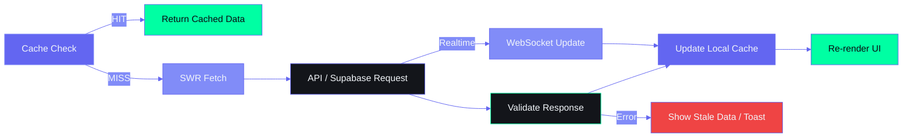

# Frontend Data Fetching & API Integration — Second Brain OS

| Field | Value |
|---|---|
| Document ID | ENG-FDF-001 |
| Version | 1.0.0 |
| Status | Active |
| Last Updated | 2026-06-12 |
| Applies To | `apps/web/` — All data fetching patterns |

---

## Table of Contents

1. [Data Sources Overview](#1-data-sources-overview)
2. [Fetch Wrapper Architecture](#2-fetch-wrapper-architecture)
3. [Supabase Direct Access](#3-supabase-direct-access)
4. [FastAPI Backend Integration](#4-fastapi-backend-integration)
5. [AI & Streaming Endpoints](#5-ai--streaming-endpoints)
6. [Error Handling Strategy](#6-error-handling-strategy)
7. [Pagination & Infinite Scroll](#7-pagination--infinite-scroll)
8. [Caching Strategy](#8-caching-strategy)
9. [Loading States](#9-loading-states)
10. [Supabase Realtime Subscriptions](#10-supabase-realtime-subscriptions)

---

## Data Fetching Strategy Flow



## 1. Data Sources Overview

### 1.1 Source Matrix

| Source | Protocol | Base URL | Auth | Use Case |
|---|---|---|---|---|
| **Supabase** (primary) | HTTPS + WebSocket | `https://*.supabase.co` | `anon_key` + JWT | All CRUD operations, realtime subscriptions |
| **FastAPI Backend** | REST (HTTPS) | `http://localhost:8000` or Railway URL | JWT Bearer | Chat, Automation triggers, AI endpoints |
| **Claude API** (via backend) | REST (proxied) | Backend → `api.anthropic.com` | Backend-managed | AI fallback when Ollama unavailable |
| **Ollama** (local) | REST (via backend) | `http://localhost:11434` (server-side) | None (localhost) | Default AI provider |

### 1.2 Decision Flow

```
Component needs data
        │
        â–¼
  Is this a database table? (tasks, courses, goals...)
  ├── YES → Use Supabase SDK directly (Zustand store)
  │        └── Needs realtime? → Add useRealtime subscription
  │
  └── NO  → Is it an AI/automation operation?
              ├── YES → Call FastAPI backend /api/chat or /api/automation/*
              └── NO  → Is it a third-party API?
                          ├── YES → Call via backend proxy
                          └── NO  → Call FastAPI custom endpoint
```

### 1.3 Connection Architecture

```
┌─────────────────────────────────────────────────────────────────────────┐
│                        FRONTEND (Browser)                               │
│                                                                          │
│  ┌─────────────────────┐  ┌──────────────┐  ┌──────────────────────┐   │
│  │ Zustand Store       │  │ React Query  │  │ Fetch Wrapper        │   │
│  │ (CRUD cache)        │  │ (Phase 2)    │  │ (chat, automation)   │   │
│  └─────────┬───────────┘  └──────┬───────┘  └──────────┬───────────┘   │
│            │                    │                       │               │
│            ▼                    ▼                       ▼               │
│  ┌─────────────────────────────────────────────────────────────┐       │
│  │                    Supabase Client (Browser)                  │       │
│  │  • anon_key for auth                                         │       │
│  │  • JWT access_token for RLS                                  │       │
│  │  • Real-time WebSocket subscriptions                         │       │
│  └─────────────────────────┬───────────────────────────────────┘       │
│                            │                                           │
└────────────────────────────┼───────────────────────────────────────────┘
                             │
              ┌──────────────┼──────────────┐
              â–¼              â–¼              â–¼
┌──────────────────┐  ┌──────────┐  ┌──────────────┐
│   Supabase       │  │ FastAPI  │  │   Direct      │
│   PostgreSQL     │  │ Backend  │  │   Services    │
│   (Primary DB)   │  │ (REST)   │  │   (Ollama,    │
│                  │  │          │  │    Claude)    │
└──────────────────┘  └──────────┘  └──────────────┘
```

---

## 2. Fetch Wrapper Architecture

### 2.1 Base Fetch Wrapper

```typescript
// lib/api-client.ts
const API_BASE_URL = process.env.NEXT_PUBLIC_API_URL || 'http://localhost:8000'

interface FetchOptions extends RequestInit {
  auth?: boolean
}

async function apiClient<T>(endpoint: string, options: FetchOptions = {}): Promise<T> {
  const { auth = true, ...fetchOptions } = options

  const headers: Record<string, string> = {
    'Content-Type': 'application/json',
    ...(fetchOptions.headers as Record<string, string>),
  }

  if (auth) {
    const { data: { session } } = await supabase.auth.getSession()
    if (session?.access_token) {
      headers['Authorization'] = `Bearer ${session.access_token}`
    }
  }

  const response = await fetch(`${API_BASE_URL}${endpoint}`, {
    ...fetchOptions,
    headers,
  })

  if (!response.ok) {
    const error = await response.json().catch(() => ({ detail: response.statusText }))
    throw new ApiError(response.status, error.detail || 'Request failed')
  }

  return response.json()
}

class ApiError extends Error {
  constructor(public status: number, message: string) {
    super(message)
    this.name = 'ApiError'
  }
}
```

### 2.2 Typed API Functions

```typescript
// lib/api/chat.ts
export const chatApi = {
  send: (message: string) =>
    apiClient<ChatResponse>('/api/chat', {
      method: 'POST',
      body: JSON.stringify({ message }),
    }),

  stream: (message: string) =>
    fetch(`${API_BASE_URL}/api/chat/stream`, {
      method: 'POST',
      headers: {
        'Content-Type': 'application/json',
        'Authorization': `Bearer ${accessToken}`,
      },
      body: JSON.stringify({ message }),
    }),
}

// lib/api/automation.ts
export const automationApi = {
  triggerBriefing: () =>
    apiClient<{ message: string }>('/api/automation/trigger/briefing', { method: 'POST' }),
  triggerRadar: () =>
    apiClient<{ message: string }>('/api/automation/trigger/radar', { method: 'POST' }),
  triggerWeeklyReview: () =>
    apiClient<{ message: string }>('/api/automation/trigger/weekly-review', { method: 'POST' }),
}
```

---

## 3. Supabase Direct Access

### 3.1 Client Setup

```typescript
// lib/supabase.ts
import { createBrowserClient } from '@supabase/ssr'

export const supabase = createBrowserClient(
  process.env.NEXT_PUBLIC_SUPABASE_URL!,
  process.env.NEXT_PUBLIC_SUPABASE_ANON_KEY!
)
```

### 3.2 Standard CRUD Pattern (Zustand)

```typescript
// lib/taskStore.ts — Supabase CRUD inside Zustand
fetchTasks: async () => {
  set({ loading: true, error: null })
  try {
    const { data, error } = await supabase
      .from('tasks')
      .select('*')
      .eq('user_id', userId)   // Always filter by user
      .order('created_at', { ascending: false })

    if (error) throw error
    set({ tasks: data || [], loading: false })
  } catch (error: any) {
    set({ error: error.message, loading: false })
  }
},

addTask: async (task) => {
  set({ loading: true, error: null })
  try {
    const { data, error } = await supabase
      .from('tasks')
      .insert({ ...task, user_id: userId })
      .select()
      .single()

    if (error) throw error
    set({ tasks: [data, ...get().tasks], loading: false })
    return data
  } catch (error: any) {
    set({ error: error.message, loading: false })
    throw error
  }
},
```

### 3.3 Query Patterns Reference

| Operation | Supabase Syntax | Return |
|---|---|---|
| List all (filtered by user) | `.select('*').eq('user_id', userId)` | `T[]` |
| Get single | `.select('*').eq('id', id).single()` | `T` |
| Create | `.insert(data).select().single()` | `T` |
| Update | `.update(updates).eq('id', id).select().single()` | `T` |
| Delete | `.delete().eq('id', id)` | void |
| Count | `.select('*', { count: 'exact', head: true }).eq('user_id', userId)` | number |
| Search (text) | `.textSearch('title', query)` | `T[]` |
| Filter (range) | `.gte('due_date', today).lte('due_date', weekEnd)` | `T[]` |
| Order | `.order('created_at', { ascending: false })` | `T[]` |
| Paginate | `.range(page * limit, (page + 1) * limit - 1)` | `T[]` |

### 3.4 RLS Compliance

```typescript
// ALWAYS filter by user_id (RLS is backup, not primary protection)
const { data, error } = await supabase
  .from('tasks')
  .select('*')
  .eq('user_id', userId)  // Explicit filter — NEVER omit this
```

---

## 4. FastAPI Backend Integration

### 4.1 Endpoint Catalog

| Endpoint | Method | Purpose | Request | Response |
|---|---|---|---|---|
| `/api/chat` | POST | Send message to ARIA | `{ message: string }` | `{ response: string, action_taken?: string }` |
| `/api/chat/stream` | POST | Streaming AI response | `{ message: string }` | `ReadableStream` (SSE) |
| `/api/automation/trigger/briefing` | POST | Trigger daily briefing | `{}` | `{ message: string }` |
| `/api/automation/trigger/radar` | POST | Scan opportunities | `{}` | `{ message: string, count: number }` |
| `/api/automation/trigger/weekly-review` | POST | Generate weekly review | `{}` | `{ message: string }` |

### 4.2 Chat API Call (Non-Streaming)

```typescript
export async function sendChatMessage(message: string): Promise<ChatResponse> {
  const { data: { session } } = await supabase.auth.getSession()
  if (!session?.access_token) throw new Error('Not authenticated')

  const res = await fetch('http://localhost:8000/api/chat', {
    method: 'POST',
    headers: {
      'Content-Type': 'application/json',
      'Authorization': `Bearer ${session.access_token}`,
    },
    body: JSON.stringify({ message }),
  })

  if (!res.ok) {
    const err = await res.json().catch(() => ({ detail: 'Chat failed' }))
    throw new Error(err.detail)
  }

  return res.json()
}
```

### 4.3 Streaming Chat (SSE)

```typescript
export async function streamChatMessage(
  message: string,
  onChunk: (text: string) => void,
  onComplete: (fullText: string) => void,
  onError: (error: Error) => void
) {
  try {
    const { data: { session } } = await supabase.auth.getSession()
    if (!session?.access_token) throw new Error('Not authenticated')

    const response = await fetch('http://localhost:8000/api/chat/stream', {
      method: 'POST',
      headers: {
        'Content-Type': 'application/json',
        'Authorization': `Bearer ${session.access_token}`,
      },
      body: JSON.stringify({ message }),
    })

    if (!response.ok) throw new Error('Stream request failed')

    const reader = response.body?.getReader()
    const decoder = new TextDecoder()
    let fullText = ''

    if (!reader) throw new Error('No reader available')

    while (true) {
      const { done, value } = await reader.read()
      if (done) break

      const chunk = decoder.decode(value, { stream: true })
      fullText += chunk
      onChunk(fullText)
    }

    onComplete(fullText)
  } catch (err: any) {
    onError(err)
  }
}
```

---

## 5. AI & Streaming Endpoints

### 5.1 Streaming State Machine

```
IDLE → User sends message
  │
  â–¼
CONNECTING → POST to /api/chat/stream
  │
  ├── Error → ERROR state → Show error, retry button
  │
  └── Success → STREAMING
        │
        â–¼
    Read chunks from ReadableStream
    Update UI on each chunk
        │
        ├── Stream ends → COMPLETE → Persist message, show final
        │
        └── Error mid-stream → PARTIAL → Show partial, retry
```

### 5.2 Chat UI State Types

```typescript
type ChatState = 'idle' | 'connecting' | 'streaming' | 'complete' | 'error'

interface ChatMessage {
  id: string
  role: 'user' | 'assistant'
  content: string
  created_at: string
  state?: ChatState
}

// Component state
const [messages, setMessages] = useState<ChatMessage[]>([])
const [input, setInput] = useState('')
const [streamingContent, setStreamingContent] = useState('')
const [chatState, setChatState] = useState<ChatState>('idle')
```

---

## 6. Error Handling Strategy

### 6.1 Error Hierarchy

```typescript
class AppError extends Error {
  constructor(
    message: string,
    public code: string,
    public status?: number,
    public recoverable: boolean = true
  ) {
    super(message)
    this.name = 'AppError'
  }
}

class NetworkError extends AppError {
  constructor() {
    super('Connection lost. Please check your internet.', 'NETWORK_ERROR', 0, true)
    this.name = 'NetworkError'
  }
}

class AuthError extends AppError {
  constructor() {
    super('Session expired. Please sign in again.', 'AUTH_ERROR', 401, true)
    this.name = 'AuthError'
  }
}

class RateLimitError extends AppError {
  constructor(retryAfter: number) {
    super(`Too many requests. Try again in ${retryAfter}s.`, 'RATE_LIMIT', 429, true)
    this.name = 'RateLimitError'
  }
}
```

### 6.2 Error Handling Pattern

```typescript
async function fetchWithErrorHandling<T>(
  fetcher: () => Promise<T>,
  options: {
    onError?: (error: AppError) => void
    retry?: boolean
    retryCount?: number
  } = {}
): Promise<T | null> {
  const { onError, retry = true, retryCount = 2 } = options

  for (let attempt = 0; attempt <= retryCount; attempt++) {
    try {
      return await fetcher()
    } catch (error: any) {
      // Network error → retry after delay
      if (error.message?.includes('fetch') || error.message?.includes('NetworkError')) {
        if (attempt < retryCount) {
          await new Promise(r => setTimeout(r, 1000 * Math.pow(2, attempt))) // Exponential backoff
          continue
        }
        const appError = new NetworkError()
        onError?.(appError)
        throw appError
      }

      // Auth error → redirect to login
      if (error.status === 401 || error.code === 'PGRST301') {
        const appError = new AuthError()
        onError?.(appError)
        router.push('/login')
        throw appError
      }

      // Rate limit → show retry countdown
      if (error.status === 429) {
        const retryAfter = parseInt(error.headers?.get('retry-after') || '60')
        const appError = new RateLimitError(retryAfter)
        onError?.(appError)
        throw appError
      }

      // Generic error
      const appError = new AppError(
        error.message || 'Something went wrong',
        'UNKNOWN',
        error.status
      )
      onError?.(appError)
      throw appError
    }
  }

  return null
}
```

### 6.3 Error-to-UI Mapping

| Error Code | User Message | UI Treatment | Recovery |
|---|---|---|---|
| `NETWORK_ERROR` | "Connection lost. Check your internet." | Toast + inline banner | Auto-retry, manual retry |
| `AUTH_ERROR` | "Session expired. Sign in again." | Toast + redirect | Redirect to /login |
| `RATE_LIMIT` | "Too fast! Wait X seconds." | Toast with countdown | Auto-retry after countdown |
| `PGRST301` (RLS) | "Access denied." | Inline error | Refresh page |
| `23505` (unique) | Per-field: "Already exists" | Inline field error | Change value |
| `23503` (FK) | Per-field: "Reference not found" | Inline field error | Change selection |
| `42P01` (table) | "System error. Contact support." | Error page | Refresh, contact |
| 500 | "Server error. Try again." | Toast + inline | Manual retry |

---

## 7. Pagination & Infinite Scroll

### 7.1 Offset Pagination

```typescript
// lib/hooks/usePagination.ts
interface PaginationState {
  data: any[]
  page: number
  hasMore: boolean
  loading: boolean
  error: string | null
}

function usePaginatedQuery(table: string, pageSize: number = 20) {
  const [state, setState] = useState<PaginationState>({
    data: [],
    page: 0,
    hasMore: true,
    loading: false,
    error: null,
  })

  const fetchPage = async (pageNum: number) => {
    setState(s => ({ ...s, loading: true, error: null }))
    try {
      const from = pageNum * pageSize
      const to = from + pageSize - 1

      const { data, error } = await supabase
        .from(table)
        .select('*')
        .eq('user_id', userId)
        .order('created_at', { ascending: false })
        .range(from, to)

      if (error) throw error

      setState(s => ({
        data: pageNum === 0 ? data : [...s.data, ...data],
        page: pageNum,
        hasMore: data.length === pageSize,
        loading: false,
        error: null,
      }))
    } catch (err: any) {
      setState(s => ({ ...s, loading: false, error: err.message }))
    }
  }

  const loadMore = () => fetchPage(state.page + 1)
  const refresh = () => fetchPage(0)

  return { ...state, loadMore, refresh }
}
```

### 7.2 Scroll-Based Pagination

```typescript
// Infinite scroll hook
function useInfiniteScroll(loadMore: () => void, hasMore: boolean, loading: boolean) {
  const observerRef = useRef<IntersectionObserver | null>(null)
  const sentinelRef = useRef<HTMLDivElement>(null)

  useEffect(() => {
    if (!sentinelRef.current || !hasMore) return

    observerRef.current = new IntersectionObserver(
      (entries) => {
        if (entries[0].isIntersecting && !loading) {
          loadMore()
        }
      },
      { threshold: 0.1 }
    )

    observerRef.current.observe(sentinelRef.current)
    return () => observerRef.current?.disconnect()
  }, [hasMore, loading, loadMore])

  return sentinelRef
}

// Usage
function TaskList() {
  const { data, hasMore, loading, loadMore } = usePaginatedQuery('tasks', 20)
  const sentinelRef = useInfiniteScroll(loadMore, hasMore, loading)

  return (
    <div>
      {data.map(task => <TaskCard key={task.id} task={task} />)}
      {loading && <Skeleton className="h-20" />}
      {hasMore && <div ref={sentinelRef} />}
      {!hasMore && <p className="text-center text-text-tertiary py-4">All tasks loaded</p>}
    </div>
  )
}
```

---

## 8. Caching Strategy

### 8.1 Cache Layers

| Layer | Tool | Scope | TTL |
|---|---|---|---|
| **Server** (Supabase) | PostgreSQL | All user data | Permanent |
| **Client memory** | Zustand store | Current module data | Session |
| **HTTP cache** | Browser | Static assets | 1 year (immutable) |
| **localStorage** | Zustand persist | User preferences | Permanent |
| **React Query** (future) | TanStack Query | API responses | 30s stale, 5min cache |

### 8.2 Stale-While-Revalidate Pattern (React Query)

```typescript
// Future: React Query integration
const queryClient = new QueryClient({
  defaultOptions: {
    queries: {
      staleTime: 30_000,       // 30s before re-fetch
      gcTime: 5 * 60_000,      // 5min in garbage collection
      refetchOnWindowFocus: true,
      retry: 2,
    },
  },
})

// Tasks query
function useTasks(userId: string) {
  return useQuery({
    queryKey: ['tasks', userId],
    queryFn: async () => {
      const { data, error } = await supabase
        .from('tasks')
        .select('*')
        .eq('user_id', userId)
      if (error) throw error
      return data
    },
    enabled: !!userId,
  })
}

// Invalidate on mutation
function useCreateTask() {
  const queryClient = useQueryClient()
  return useMutation({
    mutationFn: async (task) => {
      const { data, error } = await supabase.from('tasks').insert(task).select().single()
      if (error) throw error
      return data
    },
    onSuccess: () => {
      queryClient.invalidateQueries({ queryKey: ['tasks'] })
    },
  })
}
```

---

## 9. Loading States

### 9.1 State Machine Per Data Fetch

```
┌─────────────────────────────────────────────────────────────┐
│                     FETCH STATE MACHINE                       │
│                                                              │
│  ┌───────┐    fetch    ┌─────────┐   success   ┌────────┐  │
│  │ IDLE  │ ──────────► │ LOADING │ ──────────► │  DATA  │  │
│  └───────┘            └─────────┘             └────────┘  │
│                           │                                  │
│                        error                                 │
│                           ▼                                  │
│                       ┌───────┐   retry    ┌─────────┐      │
│                       │ ERROR │ ─────────► │ LOADING │      │
│                       └───────┘            └─────────┘      │
│                                                              │
│  DATA state can also go back to LOADING (refresh/poll)       │
└─────────────────────────────────────────────────────────────┘
```

### 9.2 Standardized Hook Pattern

```typescript
interface AsyncState<T> {
  data: T[]
  loading: boolean
  error: string | null
  refresh: () => Promise<void>
}

function useModuleFetch<T>(
  table: string,
  options?: { fetchOnMount?: boolean }
): AsyncState<T> {
  const [data, setData] = useState<T[]>([])
  const [loading, setLoading] = useState(true)
  const [error, setError] = useState<string | null>(null)

  const fetch = useCallback(async () => {
    setLoading(true)
    setError(null)
    try {
      const result = await supabase.from(table).select('*').eq('user_id', userId)
      if (result.error) throw result.error
      setData(result.data || [])
    } catch (err: any) {
      setError(err.message)
    } finally {
      setLoading(false)
    }
  }, [table, userId])

  useEffect(() => {
    if (options?.fetchOnMount !== false) fetch()
  }, [fetch])

  return { data, loading, error, refresh: fetch }
}

// UI Pattern
function ModulePage() {
  const { data, loading, error, refresh } = useModuleFetch('tasks')

  if (loading) return <LoadingSkeleton />
  if (error) return <ErrorState message={error} onRetry={refresh} />
  if (data.length === 0) return <EmptyState title="No items" />

  return <DataList items={data} />
}
```

---

## 10. Supabase Realtime Subscriptions

### 10.1 Subscription Hook

```typescript
// hooks/useRealtime.ts
interface UseRealtimeOptions {
  table: string
  userId: string
  onInsert?: (payload: any) => void
  onUpdate?: (payload: any) => void
  onDelete?: (payload: any) => void
}

export function useRealtime({ table, userId, onInsert, onUpdate, onDelete }: UseRealtimeOptions) {
  useEffect(() => {
    const channel = supabase
      .channel(`${table}_changes_${userId}`)
      .on(
        'postgres_changes',
        { event: 'INSERT', schema: 'public', table, filter: `user_id=eq.${userId}` },
        (payload) => onInsert?.(payload.new)
      )
      .on(
        'postgres_changes',
        { event: 'UPDATE', schema: 'public', table, filter: `user_id=eq.${userId}` },
        (payload) => onUpdate?.(payload.new)
      )
      .on(
        'postgres_changes',
        { event: 'DELETE', schema: 'public', table, filter: `user_id=eq.${userId}` },
        (payload) => onDelete?.(payload.old)
      )
      .subscribe()

    return () => { supabase.removeChannel(channel) }
  }, [table, userId, onInsert, onUpdate, onDelete])
}

// Usage in task store
useRealtime({
  table: 'tasks',
  userId,
  onInsert: (task) => set({ tasks: [task, ...get().tasks] }),
  onUpdate: (task) => set({ tasks: get().tasks.map(t => t.id === task.id ? task : t) }),
  onDelete: (task) => set({ tasks: get().tasks.filter(t => t.id !== task.id) }),
})
```

### 10.2 Subscription Strategy Per Module

| Module | Realtime Needed? | Events | Rationale |
|---|---|---|---|
| Tasks | ✅ | INSERT, UPDATE, DELETE | Multi-device sync, collaboration |
| Courses | ✅ | INSERT, UPDATE, DELETE | Progress tracking across devices |
| Goals | ✅ | UPDATE only | Milestone completion sync |
| Habits | ✅ | INSERT, UPDATE | Daily check-ins from mobile |
| Sleep | ❌ | None (snapshot on load) | Single-device, infrequent |
| Income | ❌ | None (snapshot on load) | Financial data, infrequent changes |
| Chat | ✅ | INSERT | New messages from AI or other sessions |

---

## Revision History

| Version | Date | Author | Changes |
|---|---|---|---|
| 1.0.0 | 2026-06-12 | Developer | Initial data fetching architecture documentation |
