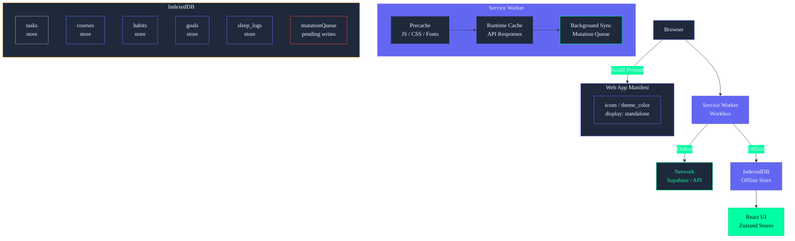

# Frontend Offline & PWA Architecture

## Document Control

| Field | Value |
|---|---|
| Document ID | ENG-FOP-001 |
| Version | 1.0.0 |
| Status | Draft |
| Last Updated | 2026-06-13 |
| Classification | Internal — Engineering |
| Target Audience | Frontend Developers |
| Dependencies | ADR-007, OfflineFirstArchitecture.md |

---

## 1. Executive Summary

ARIA OS currently has **zero PWA/offline functionality**. The application requires a persistent internet connection — all data is fetched live from Supabase or the FastAPI backend, all state is held in memory (Zustand + `useState`), and there is no service worker, no IndexedDB cache, and no offline fallback.

**What exists today:**
- `@serwist/next` (`^5.6.0`) is installed in `package.json` but **not configured** in `next.config.js`
- `manifest: '/manifest.json'` is referenced in root `layout.tsx` metadata but the file **does not exist** in `public/`
- ADR-007 ("PWA over Native Mobile") is **Proposed** status — the architectural decision to go PWA is documented but not enacted
- `docs/engineering/OfflineFirstArchitecture.md` is a **Draft v0.1** with 702 lines of planned architecture — comprehensive but unimplemented

**This document provides:**
1. The implementation blueprint for converting ARIA OS to an offline-capable PWA
2. Service worker design with `@serwist/next` + Workbox
3. Mutation queue and conflict resolution strategy
4. IndexedDB schema for offline data cache
5. Install prompt and update flow
6. Implementation roadmap with measurable milestones

---

## 2. Architecture Overview

### 2.1 Target Architecture

```
Browser
├─ Service Worker (Workbox)
│   ├─ Precache: JS/CSS bundles, fonts, icons
│   ├─ Runtime cache: Supabase API responses, /api/chat
│   └─ Background Sync: queued mutations
├─ IndexedDB (idb library)
│   ├─ stores: tasks, courses, habits, goals, etc.
│   └─ mutationQueue: pending CREATE/UPDATE/DELETE
├─ Web App Manifest
│   ├─ icons, theme_color, display: standalone
│   └─ start_url, scope
└─ Install Prompt (beforeinstallprompt)
    └─ Custom "Install ARIA OS" UI
```

### 2.2 Data Flow States

| State | Network | Cache | Behavior |
|---|---|---|---|
| Online | Connected | Warm | Read from IndexedDB, write through to Supabase + cache |
| Slow | Throttled | Warm | Serve from IndexedDB with background revalidation |
| Offline | Disconnected | Available | Serve from IndexedDB, queue mutations in IndexedDB |
| First Visit | Connected | Empty | Fetch from Supabase, populate IndexedDB |
| Fresh Install | Connected | Empty | Fetch all data on first load, cache progressively |

---

## Service Worker & Offline Cache Architecture



---

## 3. Service Worker Implementation

### 3.1 @serwist/next Configuration

```javascript
// next.config.js
const withPWA = require('@serwist/next')({
  dest: 'public',
  register: true,
  skipWaiting: true,
  disable: process.env.NODE_ENV === 'development',
  runtimeCaching: [
    {
      urlPattern: /^https?:\/\/.*supabase\.co\/rest\/v1\/.*/i,
      handler: 'NetworkFirst',
      options: {
        cacheName: 'supabase-api',
        expiration: { maxEntries: 100, maxAgeSeconds: 60 * 60 * 24 },
        networkTimeoutSeconds: 5,
        backgroundSync: { name: 'supabase-sync' },
      },
    },
    {
      urlPattern: /^https?:\/\/api\.secondbrain-os\.com\/.*/i,
      handler: 'NetworkFirst',
      options: {
        cacheName: 'backend-api',
        expiration: { maxEntries: 50, maxAgeSeconds: 60 * 60 },
        networkTimeoutSeconds: 5,
      },
    },
    {
      urlPattern: /\.(?:png|jpg|jpeg|svg|gif|webp)$/i,
      handler: 'CacheFirst',
      options: {
        cacheName: 'images',
        expiration: { maxEntries: 50, maxAgeSeconds: 60 * 60 * 24 * 30 },
      },
    },
    {
      urlPattern: /^https?:\/\/fonts\.googleapis\.com\/.*/i,
      handler: 'StaleWhileRevalidate',
      options: {
        cacheName: 'google-fonts',
        expiration: { maxEntries: 10, maxAgeSeconds: 60 * 60 * 24 * 365 },
      },
    },
  ],
})

/** @type {import('next').NextConfig} */
const nextConfig = {
  reactStrictMode: true,
  images: {
    domains: ['localhost', 'supabase.co', 'img.youtube.com'],
  },
}

module.exports = withPWA(nextConfig)
```

### 3.2 Custom Service Worker Logic

```javascript
// public/sw.js — auto-generated by @serwist/next, with custom additions

// Workbox runtime is injected by @serwist/next
// Custom message handler for update flow
self.addEventListener('message', (event) => {
  if (event.data === 'SKIP_WAITING') {
    self.skipWaiting()
  }
})

// Background sync for queued mutations
self.addEventListener('sync', (event) => {
  if (event.tag === 'supabase-sync') {
    event.waitUntil(processMutationQueue())
  }
})

async function processMutationQueue() {
  // Open IndexedDB, read pending mutations, replay them
  const db = await openIndexedDB()
  const tx = db.transaction('mutationQueue', 'readonly')
  const store = tx.objectStore('mutationQueue')
  const mutations = await store.getAll()

  for (const mutation of mutations) {
    try {
      await fetch(mutation.url, {
        method: mutation.method,
        headers: { 'Content-Type': 'application/json' },
        body: JSON.stringify(mutation.body),
      })
      // Remove from queue on success
      await deleteMutation(mutation.id)
    } catch (err) {
      console.error('[SW] Mutation failed, will retry:', mutation.id, err)
      // Leave in queue for next sync event
    }
  }
}
```

### 3.3 Precache Strategy

| Asset Type | Strategy | Cache Name | Max Age |
|---|---|---|---|
| JS/CSS bundles | Precache (install) | precache | Permanent |
| App shell HTML | Precache (install) | precache | Permanent |
| Font files (Google) | CacheFirst | google-fonts | 1 year |
| Supabase API responses | NetworkFirst | supabase-api | 24 hours |
| Backend API responses | NetworkFirst | backend-api | 1 hour |
| Images | CacheFirst | images | 30 days |

---

## 4. Web App Manifest

### 4.1 manifest.json

```json
{
  "name": "ARIA OS — Your Second Brain",
  "short_name": "ARIA OS",
  "description": "Personal AI productivity system for BTech CSE students",
  "start_url": "/dashboard",
  "scope": "/",
  "display": "standalone",
  "orientation": "portrait-primary",
  "background_color": "#0A0B0F",
  "theme_color": "#6366F1",
  "categories": ["productivity", "education", "ai"],
  "lang": "en-US",
  "icons": [
    { "src": "/icons/icon-192x192.png", "sizes": "192x192", "type": "image/png", "purpose": "any maskable" },
    { "src": "/icons/icon-384x384.png", "sizes": "384x384", "type": "image/png", "purpose": "any maskable" },
    { "src": "/icons/icon-512x512.png", "sizes": "512x512", "type": "image/png", "purpose": "any maskable" },
    { "src": "/icons/icon-1024x1024.png", "sizes": "1024x1024", "type": "image/png", "purpose": "maskable" }
  ],
  "screenshots": [
    { "src": "/screenshots/dashboard.png", "sizes": "1280x720", "type": "image/png", "form_factor": "wide" },
    { "src": "/screenshots/tasks.png", "sizes": "1280x720", "type": "image/png", "form_factor": "wide" }
  ],
  "related_applications": [],
  "prefer_related_applications": false
}
```

### 4.2 Required Icons

| Size | Purpose | Source |
|---|---|---|
| 192x192 | Splash screen, task switcher | `/public/icons/icon-192x192.png` |
| 384x384 | High-res display | `/public/icons/icon-384x384.png` |
| 512x512 | Install banner | `/public/icons/icon-512x512.png` |
| 1024x1024 | Maskable (adaptive icon support) | `/public/icons/icon-1024x1024.png` |

All icons derived from the ARIA OS brand mark (neon brain/circuit motif) on `#0A0B0F` background.

---

## 5. Offline Data Layer

### 5.1 IndexedDB Schema

```typescript
// lib/db.ts — IndexedDB wrapper using idb library
import { openDB, IDBPDatabase } from 'idb'

interface OfflineDB {
  'tasks': OfflineStore<Task>
  'courses': OfflineStore<Course>
  'habits': OfflineStore<Habit>
  'habit_logs': OfflineStore<HabitLog>
  'goals': OfflineStore<Goal>
  'sleep_logs': OfflineStore<SleepLog>
  'income_entries': OfflineStore<IncomeEntry>
  'projects': OfflineStore<Project>
  'ideas': OfflineStore<Idea>
  'resources': OfflineStore<Resource>
  'opportunities': OfflineStore<Opportunity>
  'time_entries': OfflineStore<TimeEntry>
  'chat_messages': OfflineStore<ChatMessage>
  'daily_briefings': OfflineStore<Briefing>
  'weekly_reviews': OfflineStore<Review>
  'user_preferences': OfflineStore<UserPrefs>
  'mutationQueue': {
    keyPath: 'id'
    indexes: { 'by-table': 'table', 'by-created': 'createdAt' }
  }
}

interface OfflineStore<T> {
  keyPath: 'id'
  indexes: { 'by-user': 'user_id', 'by-updated': 'updated_at' }
  value: OfflineEntry<T>
}

interface OfflineEntry<T> {
  id: string
  user_id: string
  data: T           // Full entity data
  syncedAt: number  // Last sync timestamp
  dirty: boolean    // Locally modified but not pushed
  deleted: boolean  // Soft delete pending sync
}

interface Mutation {
  id: string
  table: string
  method: 'POST' | 'PUT' | 'DELETE'
  url: string
  body?: any
  createdAt: number
  retries: number
}
```

### 5.2 Database Initialization

```typescript
// lib/db.ts
const DB_NAME = 'aria-os-offline'
const DB_VERSION = 1

export async function getDB(): Promise<IDBPDatabase<OfflineDB>> {
  return openDB<OfflineDB>(DB_NAME, DB_VERSION, {
    upgrade(db) {
      // Create store for every data table
      const tables = [
        'tasks', 'courses', 'habits', 'habit_logs', 'goals',
        'sleep_logs', 'income_entries', 'projects', 'ideas',
        'resources', 'opportunities', 'time_entries', 'chat_messages',
        'daily_briefings', 'weekly_reviews', 'user_preferences',
      ]

      for (const table of tables) {
        if (!db.objectStoreNames.contains(table)) {
          const store = db.createObjectStore(table, { keyPath: 'id' })
          store.createIndex('by-user', 'user_id', { unique: false })
          store.createIndex('by-updated', 'syncedAt', { unique: false })
        }
      }

      // Mutation queue (separate store)
      if (!db.objectStoreNames.contains('mutationQueue')) {
        const queue = db.createObjectStore('mutationQueue', {
          keyPath: 'id',
          autoIncrement: true,
        })
        queue.createIndex('by-table', 'table', { unique: false })
        queue.createIndex('by-created', 'createdAt', { unique: false })
      }
    },
  })
}
```

### 5.3 CRUD Wrapper with Offline Fallback

```typescript
// lib/offline.ts — drop-in replacement for direct Supabase queries
import { getDB } from './db'
import { supabase } from './supabase'

export async function offlineQuery<T>(
  table: string,
  userId: string,
  query: () => Promise<{ data: T[] | null; error: any }>
): Promise<T[]> {
  // 1. Try network first
  if (navigator.onLine) {
    try {
      const { data, error } = await query()
      if (!error && data) {
        // 2. Cache result in IndexedDB
        await cacheResponse(table, userId, data)
        return data
      }
    } catch (e) {
      console.warn(`[Offline] Network query failed for ${table}, falling back to cache`)
    }
  }

  // 3. Fallback to local cache
  const db = await getDB()
  const tx = db.transaction(table, 'readonly')
  const store = tx.objectStore(table)
  const index = store.index('by-user')
  const cached = await index.getAll(userId)

  return cached
    .filter(entry => !entry.deleted)
    .map(entry => entry.data) as T[]
}

async function cacheResponse<T>(table: string, userId: string, data: T[]): Promise<void> {
  const db = await getDB()
  const tx = db.transaction(table, 'readwrite')
  const store = tx.objectStore(table)

  // Clear existing entries for this user
  const index = store.index('by-user')
  const existing = await index.getAllKeys(userId)
  for (const key of existing) {
    await store.delete(key)
  }

  // Insert fresh data
  for (const item of data) {
    await store.put({
      id: (item as any).id,
      user_id: userId,
      data: item,
      syncedAt: Date.now(),
      dirty: false,
      deleted: false,
    })
  }

  await tx.done
}
```

---

## 6. Mutation Queue & Conflict Resolution

### 6.1 Queue Implementation

When the user performs a write operation while offline, the mutation is queued in IndexedDB instead of being sent to Supabase:

```typescript
// lib/mutationQueue.ts
interface QueuedMutation {
  table: string
  method: 'POST' | 'PUT' | 'DELETE'
  url: string
  headers: Record<string, string>
  body?: any
  createdAt: number
  idempotencyKey: string
}

export async function enqueueMutation(mutation: Omit<QueuedMutation, 'createdAt' | 'idempotencyKey'>): Promise<void> {
  const db = await getDB()
  const tx = db.transaction('mutationQueue', 'readwrite')
  const store = tx.objectStore('mutationQueue')

  await store.add({
    ...mutation,
    createdAt: Date.now(),
    idempotencyKey: crypto.randomUUID(),
  })

  // Register background sync if supported
  if ('serviceWorker' in navigator && 'SyncManager' in window) {
    const registration = await navigator.serviceWorker.ready
    await registration.sync.register('supabase-sync')
  }

  await tx.done
}
```

### 6.2 Conflict Resolution Strategy

| Scenario | Strategy | Implementation |
|---|---|---|
| Same field, offline edit wins | Last-Write-Wins (LWW) | Compare `updated_at` timestamps |
| Deleted while offline | Deleted-entity tombstone | Skip mutation, remove from local cache |
| Constraint violation | Discard with notification | Show toast: "Could not save [item] — it may have been deleted" |
| Concurrent edit on server | Optimistic with server override | Apply server state, show diff notification |
| Duplicate creation | Idempotency key dedup | Check `idempotencyKey` before insert |

```typescript
// Conflict resolver
async function resolveConflict(
  table: string,
  localData: any,
  serverData: any
): Promise<any> {
  const localTime = new Date(localData.updated_at || 0).getTime()
  const serverTime = new Date(serverData.updated_at || 0).getTime()

  if (localTime > serverTime) {
    // Local is newer — push to server
    await supabase.from(table).update(localData).eq('id', localData.id)
    return localData
  }

  // Server is newer — pull to local
  await updateLocalCache(table, serverData)
  return serverData
}
```

### 6.3 Queue Replay on Reconnect

```typescript
// hooks/useOnlineSync.ts
import { useEffect } from 'react'
import { getDB } from '@/lib/db'

export function useOnlineSync() {
  useEffect(() => {
    const handleOnline = async () => {
      console.log('[OnlineSync] Connection restored — replaying mutation queue')
      await replayMutationQueue()
      await refreshAllCaches()
    }

    window.addEventListener('online', handleOnline)
    return () => window.removeEventListener('online', handleOnline)
  }, [])
}

async function replayMutationQueue() {
  const db = await getDB()
  const tx = db.transaction('mutationQueue', 'readonly')
  const store = tx.objectStore('mutationQueue')
  const mutations = await store.getAll()

  // Sort by creation order
  mutations.sort((a, b) => a.createdAt - b.createdAt)

  for (const mutation of mutations) {
    try {
      const response = await fetch(mutation.url, {
        method: mutation.method,
        headers: { ...mutation.headers, 'x-idempotency-key': mutation.idempotencyKey },
        body: mutation.body ? JSON.stringify(mutation.body) : undefined,
      })

      if (response.ok || response.status === 409) {
        // Success or conflict resolved — remove from queue
        const deleteTx = db.transaction('mutationQueue', 'readwrite')
        await deleteTx.objectStore('mutationQueue').delete(mutation.id)
      } else {
        console.error('[OnlineSync] Mutation failed:', mutation.id, response.status)
      }
    } catch (err) {
      console.error('[OnlineSync] Network error during replay:', err)
      // Will retry on next online event
    }
  }
}
```

---

## 7. Install Prompt

### 7.1 Custom Install UI

```typescript
// hooks/usePWAInstall.ts
import { useState, useEffect } from 'react'

interface BeforeInstallPromptEvent extends Event {
  prompt: () => Promise<void>
  userChoice: Promise<{ outcome: 'accepted' | 'dismissed' }>
}

export function usePWAInstall() {
  const [deferredPrompt, setDeferredPrompt] = useState<BeforeInstallPromptEvent | null>(null)
  const [isInstallable, setIsInstallable] = useState(false)
  const [isInstalled, setIsInstalled] = useState(false)

  useEffect(() => {
    // Check if already installed
    if (window.matchMedia('(display-mode: standalone)').matches) {
      setIsInstalled(true)
      return
    }

    const handler = (e: Event) => {
      e.preventDefault()
      setDeferredPrompt(e as BeforeInstallPromptEvent)
      setIsInstallable(true)
    }

    window.addEventListener('beforeinstallprompt', handler)
    window.addEventListener('appinstalled', () => {
      setIsInstalled(true)
      setDeferredPrompt(null)
      setIsInstallable(false)
    })

    return () => window.removeEventListener('beforeinstallprompt', handler)
  }, [])

  const install = async () => {
    if (!deferredPrompt) return
    deferredPrompt.prompt()
    const { outcome } = await deferredPrompt.userChoice
    if (outcome === 'accepted') setIsInstalled(true)
    setDeferredPrompt(null)
    setIsInstallable(false)
  }

  return { isInstallable, isInstalled, install }
}
```

### 7.2 Install Banner Component

```typescript
// components/InstallBanner.tsx
'use client'

import { usePWAInstall } from '@/hooks/usePWAInstall'
import { Download, X } from 'lucide-react'
import { motion, AnimatePresence } from 'framer-motion'

export function InstallBanner() {
  const { isInstallable, install } = usePWAInstall()
  const [dismissed, setDismissed] = useState(false)

  return (
    <AnimatePresence>
      {isInstallable && !dismissed && (
        <motion.div
          initial={{ y: 100, opacity: 0 }}
          animate={{ y: 0, opacity: 1 }}
          exit={{ y: 100, opacity: 0 }}
          className="fixed bottom-4 left-4 right-4 md:left-auto md:right-4 md:w-96
                     bg-background-card border border-border-default rounded-xl p-4 z-50
                     shadow-lg backdrop-blur-xl"
        >
          <div className="flex items-start gap-3">
            <div className="w-10 h-10 rounded-lg bg-accent-primary/10 flex items-center justify-center flex-shrink-0">
              <Download className="w-5 h-5 text-accent-primary" />
            </div>
            <div className="flex-1 min-w-0">
              <h4 className="font-display text-sm font-semibold text-text-primary">
                Install ARIA OS
              </h4>
              <p className="text-xs text-text-secondary mt-1">
                Install as an app for offline access and a native-like experience.
              </p>
              <button
                onClick={install}
                className="btn btn-primary text-xs mt-3 px-4 py-1.5"
              >
                Install
              </button>
            </div>
            <button
              onClick={() => setDismissed(true)}
              className="p-1 hover:bg-background-card-hover rounded transition-colors"
            >
              <X className="w-4 h-4 text-text-secondary" />
            </button>
          </div>
        </motion.div>
      )}
    </AnimatePresence>
  )
}
```

---

## 8. Offline Indicators

### 8.1 Connection Status Hook

```typescript
// hooks/useOnlineStatus.ts
import { useState, useEffect } from 'react'

export function useOnlineStatus() {
  const [isOnline, setIsOnline] = useState(true)
  const [wasOffline, setWasOffline] = useState(false)

  useEffect(() => {
    const handleOnline = () => {
      setIsOnline(true)
      setWasOffline(true)
      // Reset the "was offline" flag after a delay
      setTimeout(() => setWasOffline(false), 5000)
    }
    const handleOffline = () => setIsOnline(false)

    setIsOnline(navigator.onLine)
    window.addEventListener('online', handleOnline)
    window.addEventListener('offline', handleOffline)

    return () => {
      window.removeEventListener('online', handleOnline)
      window.removeEventListener('offline', handleOffline)
    }
  }, [])

  return { isOnline, wasOffline }
}
```

### 8.2 Offline Banner Component

```typescript
// components/OfflineBanner.tsx
import { useOnlineStatus } from '@/hooks/useOnlineStatus'
import { WifiOff } from 'lucide-react'
import { motion, AnimatePresence } from 'framer-motion'

export function OfflineBanner() {
  const { isOnline, wasOffline } = useOnlineStatus()

  return (
    <AnimatePresence>
      {!isOnline && (
        <motion.div
          initial={{ y: -40, opacity: 0 }}
          animate={{ y: 0, opacity: 1 }}
          exit={{ y: -40, opacity: 0 }}
          className="fixed top-0 left-0 right-0 z-50 bg-accent-warning/90 backdrop-blur-sm
                     text-white text-center text-sm py-2 flex items-center justify-center gap-2"
        >
          <WifiOff className="w-4 h-4" />
          You're offline. Changes will sync when you reconnect.
        </motion.div>
      )}
      {isOnline && wasOffline && (
        <motion.div
          initial={{ y: -40, opacity: 0 }}
          animate={{ y: 0, opacity: 0 }}
          exit={{ y: -40, opacity: 0 }}
          className="fixed top-0 left-0 right-0 z-50 bg-accent-neon/90 backdrop-blur-sm
                     text-black text-center text-sm py-2"
        >
          Back online — syncing your changes...
        </motion.div>
      )}
    </AnimatePresence>
  )
}
```

---

## 9. Update Flow

### 9.1 Service Worker Update Notification

```typescript
// hooks/useSWUpdate.ts
import { useEffect, useState } from 'react'

export function useSWUpdate() {
  const [waitingWorker, setWaitingWorker] = useState<ServiceWorker | null>(null)
  const [hasUpdate, setHasUpdate] = useState(false)

  useEffect(() => {
    if ('serviceWorker' in navigator) {
      navigator.serviceWorker.ready.then(reg => {
        reg.addEventListener('updatefound', () => {
          const newWorker = reg.installing
          if (newWorker) {
            newWorker.addEventListener('statechange', () => {
              if (newWorker.state === 'installed' && navigator.serviceWorker.controller) {
                setWaitingWorker(newWorker)
                setHasUpdate(true)
              }
            })
          }
        })
      })
    }
  }, [])

  const applyUpdate = () => {
    waitingWorker?.postMessage('SKIP_WAITING')
    setHasUpdate(false)
    window.location.reload()
  }

  return { hasUpdate, applyUpdate }
}
```

### 9.2 Update Notification Component

```typescript
// components/UpdateNotification.tsx
import { useSWUpdate } from '@/hooks/useSWUpdate'
import { RefreshCw } from 'lucide-react'

export function UpdateNotification() {
  const { hasUpdate, applyUpdate } = useSWUpdate()

  if (!hasUpdate) return null

  return (
    <div className="fixed bottom-4 right-4 z-50 bg-background-card border border-accent-primary
                    rounded-xl p-4 shadow-lg max-w-sm">
      <div className="flex items-center gap-3">
        <RefreshCw className="w-5 h-5 text-accent-primary animate-spin-slow" />
        <div className="flex-1">
          <p className="text-sm text-text-primary font-medium">
            A new version is available
          </p>
          <p className="text-xs text-text-secondary mt-0.5">
            Update to get the latest features and fixes.
          </p>
        </div>
        <button onClick={applyUpdate} className="btn btn-primary text-xs px-3 py-1.5">
          Update
        </button>
      </div>
    </div>
  )
}
```

---

## 10. Offline-Capable Data for Each Module

| Module | Offline Read | Offline Create | Offline Edit | Offline Delete | Priority |
|---|---|---|---|---|---|
| Tasks | ✅ Full cache | ✅ Queued | ✅ Queued | ✅ Queued | P0 |
| Courses | ✅ Full cache | ✅ Queued | ✅ Queued | ✅ Queued | P0 |
| Habits | ✅ Full cache | ✅ Queued | ✅ Queued | ✅ Queued | P0 |
| Habit Logs | ✅ Last 90 days | ✅ Queued | ❌ No edit | ❌ No delete | P0 |
| Goals | ✅ Full cache | ✅ Queued | ✅ Queued | ✅ Queued | P0 |
| Sleep Logs | ✅ Last 90 days | ✅ Queued | ❌ No edit | ❌ No delete | P1 |
| Income | ✅ Full cache | ✅ Queued | ✅ Queued | ✅ Queued | P1 |
| Projects | ✅ Full cache | ✅ Queued | ✅ Queued | ✅ Queued | P1 |
| Ideas | ✅ Full cache | ✅ Queued | ✅ Queued | ✅ Queued | P0 |
| Resources | ✅ Full cache | ✅ Queued | ✅ Queued | ✅ Queued | P1 |
| Opportunities | ✅ Full cache | ❌ Cron-generated | ❌ Cron-generated | ✅ Queued | P1 |
| Time Entries | ✅ Last 90 days | ✅ Queued | ❌ No edit | ❌ No delete | P1 |
| Chat Messages | ✅ Last 100 messages | ✅ Queued | ❌ No edit | ❌ No delete | P1 |
| Daily Briefings | ✅ Last 30 days | ❌ Cron-generated | ❌ No edit | ❌ No delete | P2 |
| Weekly Reviews | ✅ Last 12 weeks | ❌ Cron-generated | ❌ No edit | ❌ No delete | P2 |

---

## 11. Implementation Roadmap

### Phase 1: Foundation (Week 1)
| Task | Effort | Dependencies |
|---|---|---|
| Generate PWA icons (192, 384, 512, 1024) | 1h | Brand assets |
| Create `public/manifest.json` | 30min | Icons |
| Configure `@serwist/next` in `next.config.js` | 1h | None |
| Verify Lighthouse PWA audit passes | 1h | Above |
| Create `OfflineBanner` component | 1h | None |

### Phase 2: Offline Data Layer (Week 2)
| Task | Effort | Dependencies |
|---|---|---|
| Implement IndexedDB schema + `getDB()` | 3h | None |
| Create `offlineQuery()` wrapper | 4h | IndexedDB |
| Create `mutationQueue.ts` | 3h | IndexedDB |
| Create `useOnlineSync` hook | 2h | Mutation queue |
| Migrate tasks page to offline-capable queries | 3h | offlineQuery |

### Phase 3: PWA Features (Week 3)
| Task | Effort | Dependencies |
|---|---|---|
| Implement `usePWAInstall` hook | 1h | None |
| Create `InstallBanner` component | 2h | usePWAInstall |
| Implement `useSWUpdate` + update banner | 2h | @serwist/next |
| Background sync in service worker | 4h | mutationQueue |
| Conflict resolution logic | 4h | Background sync |

### Phase 4: Module Migration (Week 4)
| Task | Effort | Dependencies |
|---|---|---|
| Migrate courses, habits, goals to offline | 4h | offlineQuery |
| Migrate ideas, projects, resources | 4h | offlineQuery |
| Migrate sleep, income, time | 4h | offlineQuery |
| Migrate chat messages | 3h | offlineQuery |
| Migrate dashboard (aggregation) | 3h | All above |

### Phase 5: Polish (Week 5)
| Task | Effort | Dependencies |
|---|---|---|
| E2E tests for offline scenarios | 6h | All migrations |
| Performance benchmarking | 3h | All migrations |
| Accessibility audit for PWA flows | 3h | All components |
| Lighthouse audit target: 90+ PWA score | 2h | All above |

---

## 12. Offline-First UI Patterns

### 12.1 Mutation Status Badge

```typescript
// components/SyncStatusBadge.tsx
interface SyncStatusBadgeProps {
  dirty: boolean
  syncedAt: number | null
}

export function SyncStatusBadge({ dirty, syncedAt }: SyncStatusBadgeProps) {
  if (dirty) {
    return (
      <span className="inline-flex items-center gap-1 text-xs text-accent-warning">
        <span className="w-1.5 h-1.5 rounded-full bg-accent-warning animate-pulse" />
        Pending sync
      </span>
    )
  }

  if (syncedAt) {
    const ago = formatDistanceToNow(syncedAt, { addSuffix: true })
    return (
      <span className="inline-flex items-center gap-1 text-xs text-accent-success">
        <span className="w-1.5 h-1.5 rounded-full bg-accent-success" />
        Synced {ago}
      </span>
    )
  }

  return null
}
```

### 12.2 Offline Toast Feedback

```typescript
// When mutation is queued offline
toast.info('Saved offline. Will sync when connection returns.', {
  icon: <WifiOff className="w-4 h-4 text-accent-warning" />,
  duration: 3000,
})

// When sync completes
toast.success('All changes synced.', {
  icon: <Check className="w-4 h-4 text-accent-success" />,
  duration: 2000,
})
```

---

## 13. Testing Strategy

### 13.1 Offline Testing Scenarios

| Test | Method | Expected Behavior |
|---|---|---|
| Full offline navigation | DevTools → Network → Offline | All loaded pages render from cache |
| Create while offline | Create task while offline | Mutation queued, item appears in list with "Pending sync" badge |
| Edit while offline | Edit course while offline | Local update applied, mutation queued |
| Delete while offline | Delete goal while offline | Item removed from UI, deletion queued |
| Reconnect sync | Go online after offline mutations | Queue replayed in order, conflicts resolved |
| First visit (no cache) | Clear site data, visit offline | Offline fallback page shown |
| Service worker update | Deploy new SW | Update notification appears |
| Install flow | Trigger beforeinstallprompt | Install banner appears, install succeeds |

### 13.2 Automated Test Patterns

```typescript
// tests/offline/mutationQueue.test.ts
import { enqueueMutation } from '@/lib/mutationQueue'
import { getDB } from '@/lib/db'

describe('Mutation Queue', () => {
  beforeEach(async () => {
    const db = await getDB()
    const tx = db.transaction('mutationQueue', 'readwrite')
    await tx.objectStore('mutationQueue').clear()
  })

  it('queues a mutation when offline', async () => {
    await enqueueMutation({
      table: 'tasks',
      method: 'POST',
      url: '/rest/v1/tasks',
      body: { title: 'Test', user_id: 'user-1' },
    })

    const db = await getDB()
    const tx = db.transaction('mutationQueue', 'readonly')
    const all = await tx.objectStore('mutationQueue').getAll()
    expect(all).toHaveLength(1)
    expect(all[0].table).toBe('tasks')
  })
})
```

---

## 14. Performance Considerations

| Concern | Strategy |
|---|---|
| IndexedDB read latency | Batch reads in transactions, avoid per-item reads |
| Cache staleness | NetworkFirst strategy with 24h max age |
| Storage quota | Monitor via `navigator.storage.estimate()`, prune entries > 90 days old |
| SW memory | Keep precache under 5MB, avoid caching large payloads |
| First load performance | Precache only critical assets; lazy-cache API responses |
| Background sync battery | Sync only when on power or battery > 30% |

```typescript
// Storage quota monitor
async function checkStorageQuota(): Promise<{ usage: number; quota: number; percentUsed: number }> {
  if (!navigator.storage?.estimate) {
    return { usage: 0, quota: Infinity, percentUsed: 0 }
  }
  const estimate = await navigator.storage.estimate()
  const usage = estimate.usage ?? 0
  const quota = estimate.quota ?? 0
  return {
    usage,
    quota,
    percentUsed: quota > 0 ? (usage / quota) * 100 : 0,
  }
}
```

---

## 15. Security Considerations

| Concern | Mitigation |
|---|---|
| Cached auth tokens | Store only in HTTP-only cookies (Supabase handles this); never cache tokens in IndexedDB |
| Sensitive data in cache | All offline data is the user's own data; no PII beyond what they entered |
| SW scope hijacking | `scope: '/'` in manifest limits SW control to app origin |
| Mutation replay attacks | Cached mutations are replayed with user's Supabase session cookie |
| Cache poisoning | NetworkFirst strategy verifies server response before caching |

---

## 16. Revision History

| Version | Date | Author | Changes |
|---|---|---|---|
| 1.0.0 | 2026-06-13 | Developer | Initial document — PWA architecture, offline data layer, mutation queue, implementation roadmap |
