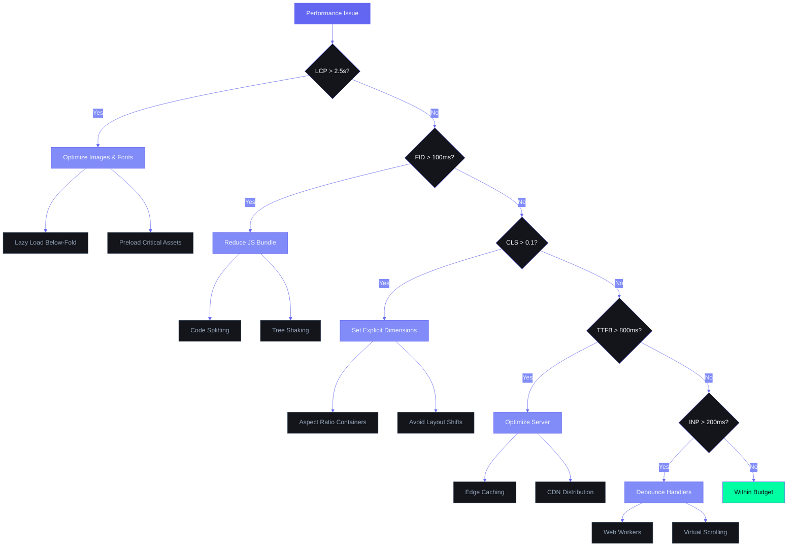

# Frontend Performance Guide — Second Brain OS

| Field | Value |
|---|---|
| Document ID | ENG-FPF-001 |
| Version | 1.0.0 |
| Status | Active |
| Last Updated | 2026-06-12 |
| Applies To | `apps/web/` — Frontend performance optimization |

---

## Table of Contents

1. [Performance Budgets](#1-performance-budgets)
2. [Bundle Optimization](#2-bundle-optimization)
3. [Code Splitting Strategy](#3-code-splitting-strategy)
4. [Rendering Optimization](#4-rendering-optimization)
5. [Image & Asset Optimization](#5-image--asset-optimization)
6. [Font Loading Strategy](#6-font-loading-strategy)
7. [Network Optimization](#7-network-optimization)
8. [React Performance Patterns](#8-react-performance-patterns)
9. [Virtual Scrolling](#9-virtual-scrolling)
10. [Measuring & Monitoring](#10-measuring--monitoring)

---

## 1. Performance Budgets

### 1.1 Core Web Vitals Targets

| Metric | Target | P95 Limit | Measurement |
|---|---|---|---|
| Largest Contentful Paint (LCP) | < 2.0s | < 3.0s | Lighthouse / Web Vitals |
| First Input Delay (FID) | < 50ms | < 100ms | Web Vitals / RUM |
| Cumulative Layout Shift (CLS) | < 0.05 | < 0.1 | Lighthouse / Web Vitals |
| Interaction to Next Paint (INP) | < 100ms | < 200ms | Web Vitals |
| Time to First Byte (TTFB) | < 400ms | < 800ms | Lighthouse / RUM |
| First Contentful Paint (FCP) | < 1.2s | < 2.0s | Lighthouse |

### 1.2 Bundle Budgets

| Bundle | Current | Target | Limit |
|---|---|---|---|
| Initial JS (first load) | ~75KB | < 100KB | < 120KB |
| Initial CSS | ~22KB | < 25KB | < 30KB |
| Route-level JS (per page) | ~15KB | < 20KB | < 30KB |
| Third-party total | ~45KB | < 50KB | < 60KB |
| Total gzipped (all routes) | ~200KB | < 250KB | < 300KB |

### 1.3 Lighthouse Score Targets

| Category | Target | Minimum |
|---|---|---|
| Performance | 95+ | 90 |
| Accessibility | 100 | 95 |
| Best Practices | 100 | 95 |
| SEO | 100 | 95 |
| PWA | 100 | 90 |

---

## Performance Optimization Decision Tree



## 2. Bundle Optimization

### 2.1 Bundle Composition (Estimated)

```
Route: /tasks (client component)
├── react / react-dom       ~38KB (shared, cached)
├── next/dynamic             ~2KB (shared)
├── framer-motion           ~28KB (shared across client pages)
├── lucide-react            ~3KB (tree-shaken)
├── @supabase/supabase-js   ~7KB (shared)
├── zustand                 ~1KB (shared)
├── clsx                    ~0.2KB
└── App code (tasks page)   ~15KB
Total:                       ~75KB
```

### 2.2 Bundle Analysis

```bash
# Run bundle analyzer
npm install @next/bundle-analyzer

# Build with analysis
ANALYZE=true npm run build

# Opens browser with interactive treemap showing:
# - Each chunk's composition
# - Module sizes (minified + gzipped)
# - Duplicate dependencies
# - Unused exports
```

### 2.3 Common Bundling Issues to Watch

| Issue | Detection | Solution |
|---|---|---|
| Duplicate React | Bundle analyzer → 2+ React copies | Check peer dep mismatches |
| Full library import | Importing from wrong path | `import { Button } from 'lucide-react'` not `import * as` |
| Massive date lib | moment.js detected | Use `date-fns` (tree-shakable) |
| Unused polyfills | Bundle shows core-js | Use `@babel/preset-env` with targets |
| CSS-in-JS runtime | styled-components in bundle | Tailwind (zero runtime) |

---

## 3. Code Splitting Strategy

### 3.1 Route-Level Splitting (Built-in)

Next.js 14 App Router automatically code-splits per route. Each module page loads independently:

```
/ → Landing page (shared shell + page)
/login → Auth page (separate bundle)
/dashboard → Dashboard bundle
/tasks → Tasks bundle (includes shared + page-specific)
```

### 3.2 Dynamic Imports (Component-Level)

```typescript
import dynamic from 'next/dynamic'

// Heavy 3D background — load only on dashboard
const ThreeBackground = dynamic(() => import('@/components/ThreeBackground'), {
  ssr: false,
  loading: () => <div className="fixed inset-0 bg-background-page" />,
})

// Modal — load only when user clicks "Add Task"
const AddTaskModal = dynamic(() => import('@/components/AddTaskModal'), {
  loading: () => <div className="w-full h-96 animate-pulse bg-background-elevated rounded-xl" />,
})

// Roadmap canvas — load only when user navigates to roadmap tab
const RoadmapEditor = dynamic(() => import('@/components/RoadmapEditor'), {
  ssr: false,
  loading: () => <RoadmapSkeleton />,
})
```

### 3.3 Dynamic Import Decision Matrix

| Component | Trigger | Strategy | Estimated Size |
|---|---|---|---|
| `ThreeBackground` | Dashboard mount | `dynamic(ssr: false)` | ~15KB |
| `AddTaskModal` | Button click | `dynamic()` | ~8KB |
| `EditTaskModal` | Edit button click | `dynamic()` | ~8KB |
| `RoadmapEditor` | Tab switch | `dynamic(ssr: false)` | ~12KB |
| `ChatStream` | Chat page mount | `dynamic(ssr: false)` | ~6KB |
| `DataTable` | List view toggle | `dynamic()` | ~10KB |
| `KanbanBoard` | Kanban view toggle | `dynamic()` | ~14KB |
| `Heatmap` | Stats tab switch | `dynamic(ssr: false)` | ~8KB |
| `CommandPalette` | Cmd+K shortcut | `dynamic(ssr: false)` | ~7KB |
| `Calendar` | Calendar view | `dynamic()` | ~11KB |

### 3.4 Named Export Dynamic Import

```typescript
// For components with named exports
const { BarChart } = dynamic(() => import('recharts'), {
  ssr: false,
  loading: () => <ChartSkeleton />,
})

// Alternative: wrap in a module
// lib/dynamic-recharts.ts
export { BarChart, LineChart, PieChart } from 'recharts'

// Usage
const { BarChart } = dynamic(() => import('@/lib/dynamic-recharts'), { ssr: false })
```

---

## 4. Rendering Optimization

### 4.1 SSR / CSR Strategy (Per Page)

| Page | Strategy | Rationale |
|---|---|---|
| `/` (Landing) | SSR | SEO-critical |
| `/login` | Static shell + CSR | No SEO needed |
| `/dashboard` | SSR + client islands | Initial data on server |
| All module pages | CSR | User-specific data, heavy interactivity |

### 4.2 React.memo Usage

```typescript
// ✅ Apply to: list items, card components, pure presentational components
const TaskCard = React.memo(function TaskCard({ task }: { task: Task }) {
  return (
    <Card variant="interactive" className="group">
      <div className="flex items-start gap-3">
        <div className={clsx('w-1.5 h-12 rounded-full', priorityColors[task.priority])} />
        <div className="flex-1">
          <h3 className="font-medium text-text-primary">{task.title}</h3>
          <p className="text-sm text-text-tertiary">{task.category}</p>
        </div>
      </div>
    </Card>
  )
}, (prevProps, nextProps) => {
  // Custom comparison: only re-render if task ID or status changes
  return prevProps.task.id === nextProps.task.id
      && prevProps.task.status === nextProps.task.status
      && prevProps.task.title === nextProps.task.title
})

// ❌ Don't memo: components with children/JSX as props
// ❌ Don't memo: components that change on every render anyway
// ✅ Do memo: list items (50+ items), dashboard stat cards
```

### 4.3 useMemo and useCallback Guidelines

```typescript
// ✅ useMemo for expensive computations
const sortedTasks = useMemo(() => {
  return [...tasks].sort((a, b) =>
    new Date(b.created_at).getTime() - new Date(a.created_at).getTime()
  )
}, [tasks])

const tasksByCategory = useMemo(() => {
  return tasks.reduce((acc, task) => {
    acc[task.category] = (acc[task.category] || 0) + 1
    return acc
  }, {} as Record<string, number>)
}, [tasks])

// ✅ useCallback for stable function references passed to child components
const handleComplete = useCallback((taskId: string) => {
  completeTask(taskId)
}, [completeTask])

// ❌ Don't oversubscribe: only use when there's a measured performance issue
// ❌ Don't use for simple arithmetic or boolean logic
```

### 4.4 Selector Optimization (Zustand)

```typescript
// ❌ BAD: Subscribes to entire store — re-renders on any change
const { tasks } = useTaskStore()

// ✅ GOOD: Selector subscribes only to `tasks`
const tasks = useTaskStore((state) => state.tasks)

// ✅ BETTER: Selector returns derived value
const pendingCount = useTaskStore(
  (state) => state.tasks.filter(t => t.status === 'pending').length
)

// ✅ BEST: Shallow equality for multiple values
import { shallow } from 'zustand/shallow'
const { tasks, loading } = useTaskStore(
  (state) => ({ tasks: state.tasks, loading: state.loading }),
  shallow
)
```

---

## 5. Image & Asset Optimization

### 5.1 Image Optimization with `<Image>`

```typescript
import Image from 'next/image'

// ✅ ALWAYS use Next.js Image for optimization
<Image
  src="/icons/logo.png"
  alt="ARIA OS Logo"
  width={192}
  height={192}
  priority              // Above-the-fold images
  quality={85}
  placeholder="blur"    // Blur-up placeholder
  blurDataURL="data:image/webp;base64,..."
/>

// ✅ Use remote images with hostname config
// next.config.js
module.exports = {
  images: {
    remotePatterns: [
      { protocol: 'https', hostname: '*.supabase.co' },
      { protocol: 'https', hostname: 'avatars.githubusercontent.com' },
      { protocol: 'https', hostname: 'img.youtube.com' },
    ],
  },
}
```

### 5.2 Image Loading Strategy

| Position | Loading Attribute | Priority | Format |
|---|---|---|---|
| Above-fold (hero, logo) | `priority` | High | WebP |
| Below-fold (cards) | `loading="lazy"` | Low | WebP |
| Thumbnails | `loading="lazy"` | Low | WebP |
| Icons/SVGs | Inline or `<svg>` | Immediate | SVG |
| Backgrounds | CSS `background-image` | As needed | WebP |

### 5.3 Asset Compression

| Asset Type | Format | Compression | Cache Header |
|---|---|---|---|
| Images | WebP (lossy 85%) | sharp (built-in) | `public, max-age=31536000, immutable` |
| Icons | SVG (minified) | SVGO | `public, max-age=31536000, immutable` |
| Fonts | WOFF2 | Built-in | `public, max-age=31536000, immutable` |
| JS/CSS | Gzip/Brotli | Vercel/Railway CDN | `public, max-age=31536000, immutable` |

---

## 6. Font Loading Strategy

### 6.1 Optimized Font Loading

```typescript
// app/layout.tsx
import { Syne, DM_Sans, JetBrains_Mono } from 'next/font/google'

// Display: Syne — headings (limited weight range)
const syne = Syne({
  subsets: ['latin'],
  variable: '--font-syne',
  display: 'swap',           // FOUT instead of invisible text
  preload: true,              // Preload critical font
  weight: ['400', '600', '700'],
})

// Body: DM Sans — most text
const dmSans = DM_Sans({
  subsets: ['latin'],
  variable: '--font-dm-sans',
  display: 'swap',
  preload: true,
})

// Mono: JetBrains Mono — code, stats, timestamps
const jetbrainsMono = JetBrains_Mono({
  subsets: ['latin'],
  variable: '--font-jetbrains',
  display: 'swap',
  preload: false,             // Not critical — loads on demand
})
```

### 6.2 Font Fallback Strategy

```css
/* In globals.css — define fallback fonts matching metrics */
:root {
  --font-syne: 'Syne', system-ui, sans-serif;
  --font-dm-sans: 'DM Sans', system-ui, sans-serif;
  --font-jetbrains: 'JetBrains Mono', 'Courier New', monospace;
}
```

---

## 7. Network Optimization

### 7.1 Request Batching

```typescript
// ❌ BAD: Multiple sequential requests
const tasks = await fetchTasks()
const courses = await fetchCourses()
const goals = await fetchGoals()

// ✅ GOOD: Parallel requests
const [tasks, courses, goals] = await Promise.all([
  fetchTasks(),
  fetchCourses(),
  fetchGoals(),
])
```

### 7.2 Data Prefetching

```typescript
// Prefetch data before user navigates (on hover)
import { useRouter } from 'next/navigation'

function NavItem({ href, label }: { href: string; label: string }) {
  const router = useRouter()

  return (
    <Link
      href={href}
      onMouseEnter={() => router.prefetch(href)}
      onFocus={() => router.prefetch(href)}
    >
      {label}
    </Link>
  )
}
```

### 7.3 Debounced Search

```typescript
import { useDebouncedCallback } from 'use-debounce'

function TaskSearch() {
  const [query, setQuery] = useState('')

  const debouncedSearch = useDebouncedCallback((value: string) => {
    // Trigger search API call
    fetchSearchResults(value)
  }, 300)  // 300ms delay

  return (
    <input
      type="search"
      value={query}
      onChange={(e) => {
        setQuery(e.target.value)
        debouncedSearch(e.target.value)
      }}
      placeholder="Search tasks..."
    />
  )
}
```

---

## 8. React Performance Patterns

### 8.1 Preventing Re-Render Cascades

```typescript
// ❌ BAD: New object on every render → child re-renders
<TaskCard task={tasks.find(t => t.id === id)} />

// ✅ GOOD: Memoize derived data
const currentTask = useMemo(
  () => tasks.find(t => t.id === id),
  [tasks, id]
)
<TaskCard task={currentTask} />

// ✅ BETTER: React.memo on child component prevents re-render when props haven't changed
const TaskCard = React.memo(function TaskCard({ task }: { task: Task }) {
  return <div>{/* ... */}</div>
})
```

### 8.2 State Colocation

```typescript
// ❌ BAD: State in parent causes all children to re-render
function TasksPage() {
  const [filter, setFilter] = useState('all')
  return (
    <div>
      <FilterTabs onChange={setFilter} />
      <TaskList filter={filter} />   {/* Re-renders on filter change */}
      <StatsWidget />                 {/* ALSO re-renders on filter change! */}
    </div>
  )
}

// ✅ GOOD: Push state down to only the component that needs it
function TasksPage() {
  return (
    <div>
      <TaskListWithFilter />   {/* Filter state lives here */}
      <StatsWidget />           {/* Never re-renders on filter change */}
    </div>
  )
}
```

### 8.3 Context Splitting

```typescript
// ❌ BAD: Single context causes all consumers to re-render
const AppContext = createContext({ user: null, tasks: [], theme: 'dark' })

// ✅ GOOD: Split by update frequency
const UserContext = createContext<SupabaseUser | null>(null)
const TaskContext = createContext<Task[]>([])
const ThemeContext = createContext<'dark' | 'cyberpunk'>('cyberpunk')
```

---

## 9. Virtual Scrolling

### 9.1 When to Virtualize

| List Length | Approach | When to Use |
|---|---|---|
| < 50 items | Normal rendering | Default |
| 50-200 items | `React.memo` + `useMemo` | Cache rendering |
| 200+ items | Virtual scrolling | Always |

### 9.2 Implementation (Phase 2)

```typescript
// Using react-window or @tanstack/react-virtual
import { useVirtualizer } from '@tanstack/react-virtual'

function VirtualTaskList({ tasks }: { tasks: Task[] }) {
  const parentRef = useRef<HTMLDivElement>(null)

  const virtualizer = useVirtualizer({
    count: tasks.length,
    getScrollElement: () => parentRef.current,
    estimateSize: () => 80,  // Estimated row height
    overscan: 5,              // Render 5 extra rows above/below viewport
  })

  return (
    <div ref={parentRef} className="h-[600px] overflow-auto">
      <div style={{ height: `${virtualizer.getTotalSize()}px` }}>
        {virtualizer.getVirtualItems().map((virtualItem) => (
          <div
            key={virtualItem.key}
            style={{
              position: 'absolute',
              top: 0,
              transform: `translateY(${virtualItem.start}px)`,
              width: '100%',
            }}
          >
            <TaskCard task={tasks[virtualItem.index]} />
          </div>
        ))}
      </div>
    </div>
  )
}
```

---

## 10. Measuring & Monitoring

### 10.1 Lighthouse CI (Automated)

```yaml
# .github/workflows/lighthouse.yml
name: Lighthouse CI
on: [push]
jobs:
  lighthouse:
    runs-on: ubuntu-latest
    steps:
      - uses: actions/checkout@v3
      - uses: actions/setup-node@v3
      - run: npm ci
      - run: npm run build
      - run: npx @lhci/cli@0.12.x autorun
```

### 10.2 Web Vitals Tracking

```typescript
// lib/web-vitals.ts
'use client'

import { onCLS, onFCP, onLCP, onTTFB } from 'web-vitals'

export function reportWebVitals() {
  onCLS(console.log)       // Cumulative Layout Shift
  onFCP(console.log)       // First Contentful Paint
  onLCP(console.log)       // Largest Contentful Paint
  onTTFB(console.log)      // Time to First Byte
}
```

### 10.3 Performance Checklist

| Technique | Applied? | Impact |
|---|---|---|
| Route-level code splitting | ✅ Built-in (App Router) | High |
| Dynamic imports for heavy components | ✅ Implemented | Medium |
| React.memo on list items | ✅ Task cards | Medium |
| Zustand selector optimization | ✅ Used across stores | Medium |
| Image optimization via `<Image>` | ✅ Configured | High |
| Font optimization with `display:swap` | ✅ Syne + DM Sans | Medium |
| Bundle analyzer run | Quarterly | — |
| Virtual scrolling (200+ items) | Phase 2 | Medium |
| Streaming SSR with Suspense | Phase 2 | Medium |
| React Query caching | Phase 2 | Medium |
| Service worker caching | Phase 2 | Medium |

---

## Revision History

| Version | Date | Author | Changes |
|---|---|---|---|
| 1.0.0 | 2026-06-12 | Developer | Initial frontend performance guide |
