# Frontend Routing & Navigation Architecture

## Document Control

| Field | Value |
|---|---|
| Document ID | ENG-FRN-001 |
| Version | 1.0.0 |
| Status | Active |
| Last Updated | 2026-06-13 |
| Classification | Internal — Engineering |
| Target Audience | Frontend Developers |

---

## 1. Executive Summary

ARIA OS uses **Next.js 14 App Router** with 18 client-side route pages, a route-group layout for dashboard chrome, and per-page client-side auth guards. There is **no server-side middleware** and **no server-side route protection** — every page independently verifies authentication via the `useAuth` hook. The `(dashboard)` route group layout (Sidebar + Navbar) exists but is **orphaned** — no pages are nested inside the route group, so the shared navigation chrome is **not rendered** on any page.

This document inventories every route, documents the auth guard pattern, catalogues navigation components, and provides a roadmap for fixing the orphaned layout, adding middleware, and implementing loading/error boundaries.

---

## 2. Route Inventory

### 2.1 Complete Route Table

| # | Route | Page File | Type | Auth Required | Data Source | Store |
|---|---|---|---|---|---|---|
| 1 | `/` | `app/page.tsx` | Landing/Redirect | No | None | None |
| 2 | `/login` | `app/login/page.tsx` | Login | No (public) | Supabase OAuth | `useUserStore` |
| 3 | `/dashboard` | `app/dashboard/page.tsx` | Dashboard | Yes | `useTaskStore` | Zustand (tasks) |
| 4 | `/tasks` | `app/tasks/page.tsx` | CRUD List | Yes | `useTaskStore` | Zustand (tasks) |
| 5 | `/courses` | `app/courses/page.tsx` | CRUD List | Yes | Supabase direct | Local `useState` |
| 6 | `/habits` | `app/habits/page.tsx` | CRUD List | Yes | Supabase direct | Local `useState` |
| 7 | `/goals` | `app/goals/page.tsx` | CRUD List | Yes | Supabase direct | Local `useState` |
| 8 | `/ideas` | `app/ideas/page.tsx` | CRUD List | Yes | — | — |
| 9 | `/income` | `app/income/page.tsx` | CRUD List | Yes | — | — |
| 10 | `/projects` | `app/projects/page.tsx` | CRUD List | Yes | — | — |
| 11 | `/resources` | `app/resources/page.tsx` | CRUD List | Yes | — | — |
| 12 | `/opportunities` | `app/opportunities/page.tsx` | CRUD List | Yes | — | — |
| 13 | `/sleep` | `app/sleep/page.tsx` | CRUD List | Yes | Supabase direct | Local `useState` |
| 14 | `/time` | `app/time/page.tsx` | CRUD List | Yes | — | — |
| 15 | `/chat` | `app/chat/page.tsx` | Chat Interface | Yes | Supabase + `/api/chat` | Local `useState` |
| 16 | `/automation` | `app/automation/page.tsx` | Config | Yes | — | — |
| 17 | `/youtube` | `app/youtube/page.tsx` | Media List | Yes | — | — |
| 18 | `/academics` | `app/academics/page.tsx` | Academic Tracker | Yes | — | — |

### 2.2 Route Group Structure

```
app/
├── page.tsx                     # / — root route
├── layout.tsx                   # Root layout (fonts + metadata only)
├── globals.css                  # Global styles
├── (dashboard)/                 # Route group (ORPHANED)
│   └── layout.tsx               #   Sidebar + Navbar wrapper (never used)
├── login/
│   └── page.tsx                 # /login
├── dashboard/
│   └── page.tsx                 # /dashboard
├── tasks/
│   └── page.tsx                 # /tasks
├── courses/
│   └── page.tsx                 # /courses
├── habits/
│   └── page.tsx                 # /habits
├── goals/
│   └── page.tsx                 # /goals
├── ideas/
│   └── page.tsx                 # /ideas
├── income/
│   └── page.tsx                 # /income
├── projects/
│   └── page.tsx                 # /projects
├── resources/
│   └── page.tsx                 # /resources
├── opportunities/
│   └── page.tsx                 # /opportunities
├── sleep/
│   └── page.tsx                 # /sleep
├── time/
│   └── page.tsx                 # /time
├── chat/
│   └── page.tsx                 # /chat
├── automation/
│   └── page.tsx                 # /automation
├── youtube/
│   └── page.tsx                 # /youtube
├── academics/
│   └── page.tsx                 # /academics
├── components/                  # Empty directory
├── hooks/                       # Empty directory
├── lib/                         # Empty directory
├── styles/                      # Empty directory
└── types/                       # Empty directory
```

## Route Hierarchy & Auth Guards

```mermaid
%%{
  init: {
    'theme': 'base',
    'themeVariables': {
      'background': '#0A0B0F',
      'primaryColor': '#6366F1',
      'secondaryColor': '#818CF8',
      'tertiaryColor': '#13151A',
      'primaryTextColor': '#F1F5F9',
      'lineColor': '#6366F1',
      'primaryBorderColor': '#6366F1',
      'secondaryBorderColor': '#818CF8',
      'tertiaryBorderColor': '#00FFA3'
    }
  }
}%%
graph TD
    ROOT["/ (Root Layout)"] --> LANDING["/ Landing Page"]
    ROOT --> LOGIN["/login Auth Page"]
    ROOT --> DASH["(dashboard) Route Group"]

    DASH --> LAYOUT["Dashboard Layout<br/>Sidebar + Navbar"]
    LAYOUT --> AG["Auth Guard: useAuth"]

    AG --> DASHBOARD["/dashboard"]
    AG --> TASKS["/tasks"]
    AG --> COURSES["/courses"]
    AG --> HABITS["/habits"]
    AG --> GOALS["/goals"]
    AG --> IDEAS["/ideas"]
    AG --> INCOME["/income"]
    AG --> PROJECTS["/projects"]
    AG --> RESOURCES["/resources"]
    AG --> OPPORTUNITIES["/opportunities"]
    AG --> SLEEP["/sleep"]
    AG --> TIME["/time"]
    AG --> CHAT["/chat"]
    AG --> AUTOMATION["/automation"]
    AG --> YOUTUBE["/youtube"]
    AG --> ACADEMICS["/academics"]

    LOGIN -.->|"redirect"| DASHBOARD
    DASHBOARD -.->|"logout"| LOGIN

    style ROOT fill:#6366F1,color:#F1F5F9
    style LANDING fill:#00FFA3,color:#0A0B0F
    style LOGIN fill:#818CF8,color:#F1F5F9
    style DASH fill:#13151A,color:#F1F5F9,stroke:#6366F1
    style LAYOUT fill:#13151A,color:#F1F5F9,stroke:#818CF8
    style AG fill:#6366F1,color:#F1F5F9
    style DASHBOARD fill:#00FFA3,color:#0A0B0F
    style TASKS fill:#818CF8,color:#F1F5F9
    style COURSES fill:#818CF8,color:#F1F5F9
    style HABITS fill:#818CF8,color:#F1F5F9
    style GOALS fill:#818CF8,color:#F1F5F9
    style IDEAS fill:#818CF8,color:#F1F5F9
    style INCOME fill:#818CF8,color:#F1F5F9
    style PROJECTS fill:#818CF8,color:#F1F5F9
    style RESOURCES fill:#818CF8,color:#F1F5F9
    style OPPORTUNITIES fill:#818CF8,color:#F1F5F9
    style SLEEP fill:#818CF8,color:#F1F5F9
    style TIME fill:#818CF8,color:#F1F5F9
    style CHAT fill:#818CF8,color:#F1F5F9
    style AUTOMATION fill:#818CF8,color:#F1F5F9
    style YOUTUBE fill:#818CF8,color:#F1F5F9
    style ACADEMICS fill:#818CF8,color:#F1F5F9
```



**Critical issue:** The `(dashboard)` route group layout imports and renders `Sidebar` and `Navbar`, but all dashboard pages live **outside** the route group at the root of `app/`. This means:
- The Sidebar is **never rendered** on any page
- The Navbar is **never rendered** on any page
- Each page renders as a full-viewport standalone with no chrome

This is a known architectural debt item. See Section 7 for remediation.

---

## 3. Auth Guard Pattern

### 3.1 Current Implementation

Every protected page follows this pattern:

```typescript
'use client'

import { useEffect, useState } from 'react'
import { useRouter } from 'next/navigation'
import { useAuth } from '@/hooks/useAuth'

export default function SomeModulePage() {
  const { user, loading: authLoading } = useAuth()
  const router = useRouter()
  const [mounted, setMounted] = useState(false)

  // 1. Mount guard
  useEffect(() => { setMounted(true) }, [])

  // 2. Auth redirect
  useEffect(() => {
    if (mounted && !authLoading && !user) {
      router.push('/login')
    }
  }, [mounted, authLoading, user, router])

  // 3. Render guard
  if (!mounted || authLoading || !user) {
    return (
      <div className="flex items-center justify-center min-h-screen bg-background-page">
        <div className="animate-pulse-glow rounded-full h-16 w-16 border-2 border-accent-primary" />
      </div>
    )
  }

  // 4. Page content
  return <div>...</div>
}
```

### 3.2 Auth Hook (`useAuth`)

```typescript
// hooks/useAuth.ts
import { useEffect, useState } from 'react'
import { supabase } from '@/lib/supabase'
import { User } from '@supabase/supabase-js'

export function useAuth() {
  const [user, setUser] = useState<User | null>(null)
  const [loading, setLoading] = useState(true)

  useEffect(() => {
    // Check existing session
    supabase.auth.getSession().then(({ data: { session } }) => {
      setUser(session?.user ?? null)
      setLoading(false)
    })

    // Listen for auth state changes
    const { data: { subscription } } = supabase.auth.onAuthStateChange((_event, session) => {
      setUser(session?.user ?? null)
      setLoading(false)
    })

    return () => subscription.unsubscribe()
  }, [])

  return { user, loading }
}
```

### 3.3 Auth Flow Diagram

```
User visits /
  ├─ useAuth() checks getSession()
  ├─ Session found → redirect to /dashboard
  └─ No session → redirect to /login

User visits /login
  ├─ Clicks "Continue with Google"
  ├─ supabase.auth.signInWithOAuth({ provider: 'google' })
  └─ OAuth callback → redirect to /dashboard

User visits any protected route (/tasks, /courses, etc.)
  ├─ Page mounts → useAuth() runs
  ├─ Session found → render content
  └─ No session → router.push('/login')

User clicks "Sign Out" (Navbar dropdown)
  ├─ supabase.auth.signOut()
  └─ router.push('/')
```

### 3.4 Limitations of Per-Page Auth

| Issue | Impact |
|---|---|
| Auth flash on every navigation | Each page re-checks `getSession()` on mount — causes brief spinner before content |
| No server-side protection | Routes are publicly accessible at the network level; only client-side redirect prevents rendering |
| No middleware redirect | Cannot redirect before the page bundle downloads — wasted bandwidth |
| Duplicated logic | 18 copies of the same auth guard boilerplate |
| No token refresh handling | `autoRefreshToken: true` is set on the Supabase client, but there is no centralized refresh-failure handling |

---

## 4. Navigation Components

### 4.1 Sidebar (`components/Sidebar.tsx`)

Fixed left sidebar (240px) with 16 navigation items. Highlights active route via `usePathname()`.

**Route items:**

| Icon | Label | Route |
|---|---|---|
| `LayoutDashboard` | Dashboard | `/dashboard` |
| `CheckSquare` | Tasks | `/tasks` |
| `BookOpen` | Courses | `/courses` |
| `Youtube` | YouTube | `/youtube` |
| `FileText` | Resources | `/resources` |
| `Lightbulb` | Ideas | `/ideas` |
| `Target` | Goals | `/goals` |
| `Radar` | Opportunities | `/opportunities` |
| `Wallet` | Income | `/income` |
| `FolderKanban` | Projects | `/projects` |
| `GraduationCap` | Academics | `/academics` |
| `Moon` | Habits | `/habits` |
| `Moon` | Sleep | `/sleep` |
| `Clock` | Time | `/time` |
| `MessageCircle` | Chat | `/chat` |
| `Zap` | Automation | `/automation` |

**Current status:** Sidebar is imported by `(dashboard)/layout.tsx` but **never rendered** because no routes are inside that route group.

### 4.2 Navbar (`components/Navbar.tsx`)

Fixed top bar with:
- Search input (placeholder: "Search tasks, goals, ideas...")
- Notification bell button
- User dropdown with "Sign Out" button

Positioned: `top-0 right-0 left-60 z-40` (accounts for Sidebar width).

**Current status:** Same orphaned state as Sidebar.

### 4.3 Navigation Patterns

| Pattern | Usage | Location |
|---|---|---|
| `next/link` | Sidebar nav items | `Sidebar.tsx` |
| `useRouter().push()` | Programmatic redirects (auth, forms) | All page files |
| `usePathname()` | Active route detection | `Sidebar.tsx` |
| `window.location.href` | OAuth redirect | `userStore.ts` |
| Client-side link clicks | In-page navigation (task details, chat) | Page files |

---

## 5. Loading & Error Boundaries

### 5.1 Current State

| File Type | Exists? | Count |
|---|---|---|
| `loading.tsx` | No | 0 |
| `error.tsx` | No | 0 |
| `not-found.tsx` | No | 0 |
| `global-error.tsx` | No | 0 |

Every page manages its own loading state inline via `useState` + conditional rendering. There are no streaming SSR boundaries, no Suspense boundaries, and no granular error boundaries. A single uncaught error on any page takes down the entire page.

### 5.2 Inline Loading Pattern

```typescript
// Common on every page
const [loading, setLoading] = useState(true)

// Spinner shown during auth check + data fetch
if (loading) {
  return (
    <div className="flex items-center justify-center min-h-screen bg-background-page">
      <div className="flex flex-col items-center gap-4">
        <div className="animate-pulse-glow rounded-full h-16 w-16 border-2 border-accent-primary flex items-center justify-center">
          <div className="h-8 w-8 border-2 border-accent-neon rounded-full animate-spin" />
        </div>
        <p className="text-text-secondary text-sm">Loading...</p>
      </div>
    </div>
  )
}
```

### 5.3 Empty State Pattern

```typescript
if (items.length === 0) {
  return (
    <div className="card p-12 text-center">
      <div className="text-4xl mb-4">📋</div>
      <h3 className="card-title">No items yet</h3>
      <p className="text-text-secondary mt-2">Get started by creating your first item.</p>
      <button className="btn btn-primary mt-6" onClick={handleAdd}>
        Create First Item
      </button>
    </div>
  )
}
```

*Note: The empty state uses emoji icons consistently across pages. When implementing the design system, replace with `lucide-react` icons.*

---

## 6. Data Flow Per Route

| Route | Fetch Timing | Cache Strategy | Refetch Trigger |
|---|---|---|---|
| `/dashboard` | On mount (from taskStore) | In-memory (Zustand) | onFocus (via taskStore) |
| `/tasks` | On mount + manual refresh | In-memory (Zustand) | CRUD operations |
| `/courses` | On mount | Local state | Manual refresh |
| `/habits` | On mount | Local state | Manual refresh |
| `/goals` | On mount | Local state | Manual refresh |
| `/sleep` | On mount | Local state | Manual refresh |
| `/chat` | On mount + user input | Local state | Every message send |
| All others | On mount (pattern) | Local state | Manual refresh |

### 6.1 Route Data Source Decision Tree

```
Does the module need real-time cross-page consistency?
├─ YES → Use Zustand store (tasks, user)
│   └─ Example: taskStore.ts
└─ NO → Use local useState + direct Supabase
    └─ Example: courses, habits, goals, sleep, chat
```

---

## 7. Route Group Architecture Remediation

### 7.1 The Orphaned Dashboard Layout

The `(dashboard)` route group layout currently does NOT wrap any pages. The recommended fix is to **move all dashboard pages inside the route group**:

```
app/
├── page.tsx                     # / — unchanged
├── layout.tsx                   # Root layout — unchanged
├── login/
│   └── page.tsx                 # /login — unchanged
├── (dashboard)/                 # Route group — FIX: add pages here
│   ├── layout.tsx               #   Sidebar + Navbar (already exists)
│   ├── dashboard/
│   │   └── page.tsx             #   /dashboard
│   ├── tasks/
│   │   └── page.tsx             #   /tasks
│   ├── courses/
│   │   └── page.tsx             #   /courses
│   └── ... (all other protected pages)
└── (public)/                    # NEW route group for public routes
    ├── login/
    │   └── page.tsx             #   /login
    └── ...
```

This is a **structural-only change** — no page logic needs modification. The URL paths remain identical (`/tasks`, `/courses`, etc.) because route groups don't affect URL segments.

### 7.2 Layout Nesting Model

```
<html>                                    # RootLayout
  <body>
    <AuthProvider>                        # Future: centralized auth context
      {(public)}                          # Public route group
        <LoginPage />                    # /login
        <LandingPage />                  # /
      {(dashboard)}                      # Dashboard route group
        <Sidebar />                      # Persistent left nav
        <Navbar />                       # Persistent top bar
        <main>
          <Breadcrumbs />                # Future: breadcrumb component
          {children}                     # Page content
        </main>
      </(dashboard)>
    </AuthProvider>
  </body>
</html>
```

---

## 8. Middleware Architecture

### 8.1 Current State

There is **no middleware** (`apps/web/middleware.ts` does not exist). Route protection is entirely client-side per-page.

### 8.2 Recommended Middleware Implementation

```typescript
// middleware.ts — at root of apps/web/
import { NextResponse } from 'next/server'
import type { NextRequest } from 'next/server'
import { createMiddlewareClient } from '@supabase/ssr'

const publicRoutes = ['/', '/login']
const protectedRoutes = [
  '/dashboard', '/tasks', '/courses', '/habits', '/goals',
  '/ideas', '/income', '/projects', '/resources', '/opportunities',
  '/sleep', '/time', '/chat', '/automation', '/youtube', '/academics',
]

export async function middleware(request: NextRequest) {
  const { pathname } = request.nextUrl

  // Allow public routes
  if (publicRoutes.includes(pathname)) {
    return NextResponse.next()
  }

  // Check auth for protected routes
  if (protectedRoutes.some(route => pathname.startsWith(route))) {
    const res = NextResponse.next()
    const supabase = createMiddlewareClient({ req: request, res })
    const { data: { session } } = await supabase.auth.getSession()

    if (!session) {
      const redirectUrl = new URL('/login', request.url)
      redirectUrl.searchParams.set('redirectTo', pathname)
      return NextResponse.redirect(redirectUrl)
    }
  }

  return NextResponse.next()
}

export const config = {
  matcher: ['/((?!_next/static|_next/image|favicon.ico|manifest.json|sw.js).*)'],
}
```

**Benefits over per-page auth:**
- Server-side redirect before page bundle downloads
- Centralized session check (one place to maintain)
- Redirect-to-original-page after login (via `redirectTo` query param)
- No auth flash on page loads

---

## 9. Breadcrumb Strategy

### 9.1 Current State

No breadcrumb component exists.

### 9.2 Recommended Implementation

```typescript
// components/Breadcrumbs.tsx
'use client'

import { usePathname } from 'next/navigation'
import Link from 'next/link'
import { ChevronRight } from 'lucide-react'

const routeLabels: Record<string, string> = {
  dashboard: 'Dashboard',
  tasks: 'Tasks',
  courses: 'Courses',
  habits: 'Habits',
  goals: 'Goals',
  ideas: 'Ideas',
  income: 'Income',
  projects: 'Projects',
  resources: 'Resources',
  opportunities: 'Opportunities',
  sleep: 'Sleep',
  time: 'Time',
  chat: 'Chat',
  automation: 'Automation',
  youtube: 'YouTube',
  academics: 'Academics',
}

export function Breadcrumbs() {
  const pathname = usePathname()
  const segments = pathname.split('/').filter(Boolean)

  if (segments.length <= 1) return null

  return (
    <nav className="flex items-center gap-2 text-sm text-text-secondary mb-4">
      <Link href="/dashboard" className="hover:text-accent-primary transition-colors">
        Dashboard
      </Link>
      {segments.map((segment, index) => {
        const href = '/' + segments.slice(0, index + 1).join('/')
        const label = routeLabels[segment] || segment.charAt(0).toUpperCase() + segment.slice(1)
        const isLast = index === segments.length - 1

        return (
          <span key={href} className="flex items-center gap-2">
            <ChevronRight className="w-3 h-3" />
            {isLast ? (
              <span className="text-text-primary font-medium">{label}</span>
            ) : (
              <Link href={href} className="hover:text-accent-primary transition-colors">
                {label}
              </Link>
            )}
          </span>
        )
      })}
    </nav>
  )
}
```

---

## 10. Route Performance Considerations

| Concern | Current State | Recommendation |
|---|---|---|
| Bundle size per page | All pages are `'use client'` with full bundle | Convert non-interactive parts to Server Components |
| Prefetching | Next.js auto-prefetches visible links in Sidebar | Default behavior is correct |
| Route transition | No page transitions | Apply Framer Motion `animatePresence` on layout |
| Parallel routes | Not used | Consider for chat + task sidebar |
| Intercepting routes | Not used | Consider for modal-based task editing |
| Static generation | None — all pages dynamic | Landing page `/` could be static |

---

## 11. Route Change Lifecycle

```
User clicks link in Sidebar
  ├─ Next.js prefetches route (if visible)
  ├─ Client-side transition (no full reload)
  ├─ Page component mounts
  ├─ useAuth() checks session state
  │   ├─ No session → router.push('/login')
  │   └─ Session exists → continue
  ├─ UseEffect runs → fetch data
  ├─ Loading spinner shown
  ├─ Data arrives → render content
  └─ Component stays mounted until navigation
```

---

## 12. Revision History

| Version | Date | Author | Changes |
|---|---|---|---|
| 1.0.0 | 2026-06-13 | Developer | Initial document — route inventory, auth pattern, navigation components, orphaned layout remediation plan |
