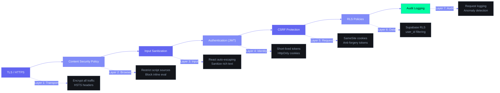

# Frontend Security Guide — Second Brain OS

| Field | Value |
|---|---|
| Document ID | ENG-FSC-001 |
| Version | 1.0.0 |
| Status | Active |
| Last Updated | 2026-06-12 |
| Applies To | `apps/web/` — Frontend security patterns |

---

## Table of Contents

1. [Security Principles](#1-security-principles)
2. [Content Security Policy](#2-content-security-policy)
3. [XSS Prevention](#3-xss-prevention)
4. [CSRF Protection](#4-csrf-protection)
5. [Authentication Token Management](#5-authentication-token-management)
6. [Environment Variable Safety](#6-environment-variable-safety)
7. [Dependency Security](#7-dependency-security)
8. [Secure Data Handling](#8-secure-data-handling)
9. [HTTP Security Headers](#9-http-security-headers)
10. [Security Checklist](#10-security-checklist)

---

## 1. Security Principles

### 1.1 Frontend Security Boundaries

```
┌──────────────────────────────────────────────────────────────────┐
│                      BROWSER (Untrusted)                         │
│                                                                   │
│  ❌ Never trust user input                                        │
│  ❌ Never expose secrets (API keys, JWT secrets)                  │
│  ❌ Never store sensitive data in plain text                      │
│  ✅ Validate ALL input client-side AND server-side                │
│  ✅ Sanitize output for XSS prevention                            │
│  ✅ Use CSP as defense-in-depth                                   │
└─────────────────────────────────────────────────────────┬────────┘
                                                          │
                                                          â–¼
┌──────────────────────────────────────────────────────────────────┐
│                   SUPABASE / BACKEND (Trusted)                    │
│                                                                   │
│  ✅ RLS policies enforce row-level access                         │
│  ✅ Server validates all mutations                                │
│  ✅ Secrets stored server-side only                              │
└──────────────────────────────────────────────────────────────────┘
```

### 1.2 Threat Model (Frontend-Specific)

| Threat | Impact | Likelihood | Mitigation |
|---|---|---|---|
| XSS via user input | Data theft, session hijack | Medium | React auto-escaping, CSP, sanitize rich text |
| CSRF via malicious site | Unauthorized actions | Low | Supabase JWT in headers, SameSite cookies |
| Token theft via XSS | Full account access | Low | HttpOnly cookies, short-lived tokens |
| Data exposure via console | Privacy leak | Medium | Never log tokens, strip sensitive data |
| Dependency vulnerabilities | Varies | Medium | `npm audit` in CI, lockfile, Dependabot |
| Man-in-the-middle | Data interception | Low | HTTPS everywhere, HSTS |
| localStorage XSS | Preference manipulation | Medium | Never store tokens in localStorage |

---

## Frontend Security Layers



## 2. Content Security Policy

### 2.1 Current CSP Directives

```javascript
// next.config.js
const cspDirectives = [
  "default-src 'self'",
  // Scripts: need 'unsafe-eval' for three.js, 'unsafe-inline' for Next.js
  "script-src 'self' 'unsafe-eval' 'unsafe-inline'",
  // Styles: Tailwind + Framer Motion inject inline styles
  "style-src 'self' 'unsafe-inline'",
  // Images: Supabase storage, GitHub avatars, YouTube thumbnails
  "img-src 'self' data: blob: https://*.supabase.co https://avatars.githubusercontent.com https://img.youtube.com",
  // Fonts: self-hosted + Google Fonts fallback
  "font-src 'self' data: https://fonts.gstatic.com",
  // Connections: Supabase (REST + WebSocket), Backend, Anthropic API
  "connect-src 'self' https://*.supabase.co wss://*.supabase.co http://localhost:8000 https://api.anthropic.com",
  // Frames: Supabase Auth UI
  "frame-src 'self' https://*.supabase.co",
  // Media: self-hosted
  "media-src 'self'",
  // Workers: service worker
  "worker-src 'self'",
  // Base URL restriction
  "base-uri 'self'",
  // Form submissions: self only
  "form-action 'self'",
]

module.exports = {
  async headers() {
    return [
      {
        source: '/(.*)',
        headers: [
          { key: 'Content-Security-Policy', value: cspDirectives.join('; ') },
        ],
      },
    ]
  },
}
```

### 2.2 CSP Testing

```bash
# Enable reporting-only mode during development
"Content-Security-Policy-Report-Only": "..."
# Monitor violations via browser console or reporting endpoint

# Use CSP Evaluator
# https://csp-evaluator.withgoogle.com/
```

---

## 3. XSS Prevention

### 3.1 React's Built-in Protection

```typescript
// ✅ SAFE: React auto-escapes JSX expressions
<div>{userInput}</div>
// Result: <div>&lt;script&gt;alert('xss')&lt;/script&gt;</div>

// ✅ SAFE: Props/attributes are escaped

// Even if userInput = "javascript:alert(1)", React renders as string, not executed
```

### 3.2 Danger Zones

```typescript
// ❌ CRITICAL: dangerouslySetInnerHTML
function Unsafe({ html }: { html: string }) {
  return <div dangerouslySetInnerHTML={{ __html: html }} />
}

// ✅ SAFE ALTERNATIVE: Use DOMPurify for rich text
import DOMPurify from 'isomorphic-dompurify'

function SafeRichText({ html }: { html: string }) {
  const sanitized = DOMPurify.sanitize(html, {
    ALLOWED_TAGS: ['b', 'i', 'em', 'strong', 'a', 'ul', 'ol', 'li', 'p', 'br'],
    ALLOWED_ATTR: ['href', 'target', 'rel'],
  })
  return <div dangerouslySetInnerHTML={{ __html: sanitized }} />
}

// ❌ CRITICAL: href with user-controlled input
<a href={userInput}>Click</a>
// userInput could be "javascript:alert(1)"

// ✅ SAFE: Validate URL scheme
function safeUrl(url: string) {
  try {
    const parsed = new URL(url)
    return ['http:', 'https:', 'mailto:'].includes(parsed.protocol)
  } catch {
    return false
  }
}
{userInput && safeUrl(userInput) && <a href={userInput}>Link</a>}
```

### 3.3 Input Sanitization Rules

| Input Type | Sanitization | Method |
|---|---|---|
| Text content | None needed | React auto-escapes |
| URLs | Validate protocol | `new URL()` check |
| HTML (rich text) | Strip dangerous tags | `DOMPurify.sanitize()` |
| SVG | Strip scripts | DOMPurify or avoid |
| JSON | Parse safely | `JSON.parse()` with try/catch |
| File names | Strip path separators | `.replace(/[\/\\]/g, '')` |

### 3.4 Trusted Types (Future)

```typescript
// Phase 2: Enable Trusted Types for additional XSS protection
// next.config.js
headers: [
  {
    key: 'Content-Security-Policy',
    value: "require-trusted-types-for 'script'",
  },
]
```

---

## 4. CSRF Protection

### 4.1 How Supabase Handles CSRF

```
Browser Request:
├── Cookie: sb-session (HttpOnly, SameSite=Lax)
├── Header: apikey (anon_key)
└── Header: Authorization: Bearer <access_token>

Supabase validates:
1. Session cookie signature
2. Access token matches session
3. RLS policy for requested table
```

### 4.2 CSRF Prevention Rules

```typescript
// ✅ ALWAYS: Include auth headers in API calls
const { data, error } = await supabase.from('tasks').select('*')
// Supabase SDK automatically includes anon_key + access_token

// ✅ ALWAYS: Use POST/DELETE/PUT for mutations (not GET)
// ✅ NEVER: Use URL query params for mutations
// Example of what NOT to do:
// GET /api/tasks/delete?id=1  ← CSRF-vulnerable!
```

### 4.3 SameSite Cookie Configuration

```typescript
// Supabase SSR client handles this automatically
// The session cookie uses SameSite=Lax by default
export const supabase = createBrowserClient(
  process.env.NEXT_PUBLIC_SUPABASE_URL!,
  process.env.NEXT_PUBLIC_SUPABASE_ANON_KEY!
)
```

---

## 5. Authentication Token Management

### 5.1 Token Lifecycle

```
User logs in via Google OAuth
        │
        â–¼
Supabase returns:
├── access_token (JWT, 1 hour expiry)
├── refresh_token (long-lived)
└── provider_token (Google, for APIs)
        │
        â–¼
Stored in:
├── access_token → Supabase Auth state (in-memory)
├── refresh_token → HttpOnly cookie (sb-session)
└── provider_token → In-memory (not persisted)
        │
        â–¼
On expiry:
├── Supabase auto-refreshes using refresh_token
├── New access_token issued transparently
└── No user interaction needed
```

### 5.2 Token Safety Rules

```typescript
// ✅ SAFE: Supabase SDK auto-attaches token
const { data } = await supabase.from('tasks').select('*')

// ✅ SAFE: Get token for backend API calls
const { data: { session } } = await supabase.auth.getSession()
const token = session?.access_token

// ❌ CRITICAL: NEVER store in localStorage
localStorage.setItem('auth_token', token)  // ← XSS-vulnerable!

// ❌ CRITICAL: NEVER log tokens
console.log(token)  // ← Would expose in production logs

// ✅ SAFE: Use token only in Authorization header
headers: {
  'Authorization': `Bearer ${session.access_token}`,
}
```

### 5.3 Session Refresh Handling

```typescript
// hooks/useAuth.ts — handles session lifecycle
export function useAuth() {
  const [user, setUser] = useState<SupabaseUser | null>(null)
  const [loading, setLoading] = useState(true)

  useEffect(() => {
    // Check existing session (auto-refreshes if needed)
    supabase.auth.getSession().then(({ data: { session } }) => {
      setUser(session?.user ?? null)
      setLoading(false)
    })

    // Listen for auth changes (sign in/out, token refresh)
    const { data: { subscription } } = supabase.auth.onAuthStateChange(
      (_event, session) => {
        setUser(session?.user ?? null)
        setLoading(false)
      }
    )

    return () => subscription.unsubscribe()
  }, [])
}
```

---

## 6. Environment Variable Safety

### 6.1 Public vs Private Variables

```bash
# .env.local (gitignored — NEVER COMMIT)
# Public variables (NEXT_PUBLIC_ prefix → exposed to browser)
NEXT_PUBLIC_SUPABASE_URL=https://your-project.supabase.co
NEXT_PUBLIC_SUPABASE_ANON_KEY=eyJhbGciOiJ...  # Public anon key
NEXT_PUBLIC_API_URL=http://localhost:8000
NEXT_PUBLIC_DEVTOOLS=true

# Private variables (no prefix → server-side only, NEVER in browser)
SUPABASE_SERVICE_KEY=eyJhbGciOiJ...  # Secret service key — NEVER expose
CLAUDE_API_KEY=sk-ant-...              # Secret — server-side only
JWT_SECRET=your-jwt-secret             # Secret — server-side only
```

### 6.2 Environment Variable Rules

```typescript
// ✅ SAFE: Public variable (available in browser)
const supabaseUrl = process.env.NEXT_PUBLIC_SUPABASE_URL!

// ❌ CRITICAL: Private variable in client component
// This will be `undefined` in the browser!
const apiKey = process.env.SUPABASE_SERVICE_KEY

// ✅ SAFE: Private variables only in:
// 1. Server Components (app/page.tsx without 'use client')
// 2. API routes (app/api/*/route.ts)
// 3. next.config.js
// 4. middleware.ts

// ✅ SAFE: Server Component accessing private vars
export default async function ServerPage() {
  const apiKey = process.env.SUPABASE_SERVICE_KEY  // Safe — only runs on server
  // ...
}
```

---

## 7. Dependency Security

### 7.1 Audit Configuration

```yaml
# .github/dependabot.yml
version: 2
updates:
  - package-ecosystem: "npm"
    directory: "/apps/web"
    schedule:
      interval: "weekly"
    open-pull-requests-limit: 10
    labels:
      - "dependencies"
      - "security"
    # Group non-breaking updates
    groups:
      react:
        patterns: ["react*", "react-dom*"]
      next:
        patterns: ["next*"]
```

### 7.2 npm Audit in CI

```bash
# Run in CI — fail on high/critical vulnerabilities
npm audit --audit-level=high

# Review and resolve
npm audit fix           # Auto-fix non-breaking
npm audit fix --force   # Force fix (may break semver)
npm ls <package>        # Check dependency tree
```

### 7.3 Lockfile Security

```bash
# ALWAYS commit package-lock.json
# It locks exact versions, preventing supply chain attacks

# Verify integrity on install
npm ci  # Clean install using lockfile (CI only)

# Check for malicious packages
npx @socketsecurity/cli scan
```

### 7.4 Known Safe Versions

| Package | Min Safe Version | Notes |
|---|---|---|
| `next` | 14.2.0+ | CVE-2024-34351 fixed in 14.2.0 |
| `next-auth` / Supabase | Latest | Auth handled by Supabase SDK |
| `zod` | 3.22+ | Validation library |
| `framer-motion` | 10.18+ | Animation lib, no known critical CVEs |
| `@supabase/supabase-js` | 2.39+ | API client, auto-updated |

---

## 8. Secure Data Handling

### 8.1 What NOT to Log

```typescript
// ❌ CRITICAL: Never log these
console.log(session.access_token)       // JWT tokens
console.log(user.email)                 // PII
console.log(error.response?.data)       // Raw API errors (may contain tokens)
console.log(config.supabaseServiceKey)  // API keys
console.log(localStorage.getItem('draft_task'))  // User data in logs

// ✅ SAFE: Log these instead
console.log('[Auth] User signed in')
console.log('[Tasks] Fetch completed:', data?.length, 'items')
console.log('[Error] Task creation failed:', error.code)
```

### 8.2 localStorage Safety

```typescript
// ✅ SAFE to store in localStorage:
// - UI preferences (theme, sidebar state)
// - Form drafts (temporary, no sensitive data)
// - Non-sensitive cache

// ❌ NEVER store in localStorage:
// - Auth tokens or sessions
// - API keys
// - PII (emails, phone numbers)
// - Financial data (raw amounts)

// Zustand persist middleware — only persist non-sensitive data
export const usePreferences = create(
  persist(
    (set) => ({
      theme: 'cyberpunk',       // ✅ Safe
      sidebarCollapsed: false,  // ✅ Safe
      defaultTaskFilter: 'all', // ✅ Safe
    }),
    {
      name: 'aria-preferences',
      partialize: (state) => ({
        // Only persist safe fields
        theme: state.theme,
        sidebarCollapsed: state.sidebarCollapsed,
      }),
    }
  )
)
```

### 8.3 User Data Display Rules

```typescript
// Display rules for user data
function UserProfile({ user }: { user: User }) {
  return (
    <div>
      <Avatar src={user.avatar_url} />  {/* ✅ Display safely */}
      <h2>{user.name}</h2>              {/* ✅ React-escaped */}
      {/* {user.email} */}               {/* ⚠️ Display only if necessary */}
      {/* NEVER display: session tokens, API keys, raw database IDs */}
    </div>
  )
}
```

---

## 9. HTTP Security Headers

### 9.1 Complete Header Configuration

```javascript
// next.config.js
const securityHeaders = [
  // Prevent MIME type sniffing
  { key: 'X-Content-Type-Options', value: 'nosniff' },

  // Prevent clickjacking
  { key: 'X-Frame-Options', value: 'SAMEORIGIN' },

  // Enable XSS filter (legacy browsers)
  { key: 'X-XSS-Protection', value: '1; mode=block' },

  // HSTS — force HTTPS
  { key: 'Strict-Transport-Security', value: 'max-age=63072000; includeSubDomains; preload' },

  // Referrer policy
  { key: 'Referrer-Policy', value: 'strict-origin-when-cross-origin' },

  // Permissions policy — restrict browser features
  { key: 'Permissions-Policy', value: [
    'camera=()',
    'microphone=()',
    'geolocation=()',
    'interest-cohort=()',
  ].join(', ') },

  // Content Security Policy (see Section 2)
  { key: 'Content-Security-Policy', value: cspDirectives.join('; ') },
]

module.exports = {
  async headers() {
    return [
      { source: '/(.*)', headers: securityHeaders },
      // Cache static assets aggressively
      {
        source: '/:all*(svg|png|jpg|jpeg|webp|woff|woff2)',
        headers: [
          { key: 'Cache-Control', value: 'public, max-age=31536000, immutable' },
        ],
      },
    ]
  },
}
```

### 9.2 Header Validation

```bash
# Test headers using curl
curl -I https://your-app.vercel.app

# Expected response headers:
# Strict-Transport-Security: max-age=63072000; includeSubDomains; preload
# X-Content-Type-Options: nosniff
# X-Frame-Options: SAMEORIGIN
# Content-Security-Policy: default-src 'self'; ...
# Referrer-Policy: strict-origin-when-cross-origin

# Use securityheaders.com for full audit
```

---

## 10. Security Checklist

### 10.1 Pre-Deployment Checklist

- [ ] CSP headers configured and tested
- [ ] All secrets in environment variables (not in code)
- [ ] No `NEXT_PUBLIC_` prefix on private variables
- [ ] `npm audit` passes (no high/critical vulnerabilities)
- [ ] No console.log of tokens or PII
- [ ] localStorage only stores non-sensitive data
- [ ] All forms use Supabase SDK (auto-CSRF protection)
- [ ] `dangerouslySetInnerHTML` not used without `DOMPurify`
- [ ] HTTPS enabled (Vercel/Railway defaults)
- [ ] HSTS configured

### 10.2 CI Security Gates

```yaml
# .github/workflows/ci.yml — security job
security:
  runs-on: ubuntu-latest
  steps:
    - uses: actions/checkout@v3
    - uses: actions/setup-node@v3
    - run: npm ci
    - run: npm audit --audit-level=high
    - run: npx eslint-plugin-security .
```

### 10.3 Incident Response (Security)

| Issue | Detection | Response |
|---|---|---|
| Token leak | Logs / user report | Revoke tokens via Supabase Dashboard |
| XSS vulnerability | CSP report / audit | Patch + deploy hotfix |
| Dependency CVE | Dependabot / npm audit | Update package, review usage |
| Suspicious activity | Supabase Audit Logs | Review logs, contact support |

---

## Revision History

| Version | Date | Author | Changes |
|---|---|---|---|
| 1.0.0 | 2026-06-12 | Developer | Initial frontend security guide |
