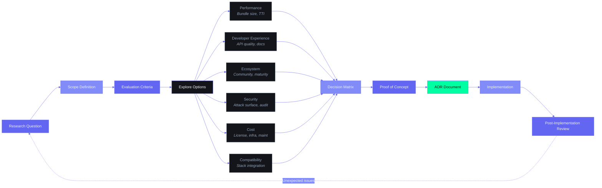

# Frontend Technical Research — Second Brain OS

## Document Control

| Field | Value |
|---|---|
| **Document ID** | ENG-FTR-001 |
| **Status** | Draft v1.0 |
| **Version** | 1.0.0 |
| **Author** | ARIA OS Engineering |
| **Last Updated** | 2026-06-11 |
| **Approval** | Pending |
| **Classification** | Internal — Architecture Decision |
| **Supersedes** | `FrontendArchitecture.md`, `StateManagement.md` (partial), `RealtimeArchitecture.md` (frontend), `OfflineFirstArchitecture.md` (frontend), `SearchArchitecture.md` (frontend), `45_PerformanceScalability.md` (frontend) |
| **Complements** | `DesignSystemResearch.md`, `DesignStrategy.md`, `MotionArchitecture.md`, `docs/qa/28_Testing.md` |
| **Related ADRs** | ADR-001 through ADR-008 |

---

## Table of Contents

### Part I — Foundation & Stack
1. [Executive Summary](#1-executive-summary)
2. [Stack Architecture & Upgrade Path](#2-stack-architecture--upgrade-path)
3. [Monorepo Strategy](#3-monorepo-strategy)

### Part II — Routing & Rendering
4. [Routing Architecture](#4-routing-architecture)
5. [Rendering Strategy](#5-rendering-strategy)
6. [Server vs Client Component Decision Tree](#6-server-vs-client-component-decision-tree)
7. [SEO & Metadata Strategy](#7-seo--metadata-strategy)

### Part III — Data Layer
8. [Server Data Fetching](#8-server-data-fetching)
9. [Client Data Fetching](#9-client-data-fetching)
10. [State Management](#10-state-management)
11. [Supabase Realtime Architecture](#11-supabase-realtime-architecture)
12. [Offline-First & PWA Architecture](#12-offline-first--pwa-architecture)
13. [Search Architecture](#13-search-architecture)

### Part IV — UI & Rendering Performance
14. [Performance Budgets & Core Web Vitals](#14-performance-budgets--core-web-vitals)
15. [Code Splitting & Lazy Loading](#15-code-splitting--lazy-loading)
16. [Streaming & Suspense Architecture](#16-streaming--suspense-architecture)
17. [Image & Asset Strategy](#17-image--asset-strategy)

### Part V — UI Engineering
18. [Component Architecture](#18-component-architecture)
19. [Form Architecture](#19-form-architecture)
20. [Animation Engineering](#20-animation-engineering)
21. [Chart & Data Visualization](#21-chart--data-visualization)

### Part VI — Cross-Cutting Concerns
22. [Accessibility (a11y)](#22-accessibility-a11y)
23. [Security Architecture](#23-security-architecture)
24. [Observability & Monitoring](#24-observability--monitoring)
25. [Testing Strategy](#25-testing-strategy)
26. [Internationalization (i18n)](#26-internationalization-i18n)

### Part VII — Developer Experience & Governance
27. [Project Structure & Conventions](#27-project-structure--conventions)
28. [Code Generation & Scaffolding](#28-code-generation--scaffolding)
29. [Code Quality & Linting](#29-code-quality--linting)
30. [Bundle & Dependency Governance](#30-bundle--dependency-governance)
31. [Versioning & Changelog](#31-versioning--changelog)

### Part VIII — Deployment & Operations
32. [Build & Deploy Strategy](#32-build--deploy-strategy)
33. [CI/CD Pipeline](#33-cicd-pipeline)
34. [Error Tracking & Alerting](#34-error-tracking--alerting)

### Appendices
A. Module → Component Map
B. Query Key Factory
C. Zustand Store Schemas
D. Realtime Channel Map
E. Offline Cache Schema
F. Dependency Graph
G. Upgrade Migration Checklist

---

## Technical Research Decision Framework



## Part I — Foundation & Stack

---

## 1. Executive Summary

### 1.1 Purpose

This document is the **single source of truth** for all frontend engineering decisions in Second Brain OS. It defines the complete architecture, technology choices, upgrade paths, performance budgets, accessibility requirements, testing strategy, and developer governance for the Next.js 15 + React 19 frontend.

### 1.2 Scope

Covers every aspect of the frontend:

| Layer | Coverage |
|---|---|
| Stack | Next.js 15, React 19, Tailwind v4, TanStack Query v5, Zustand v5, motion/react, GSAP, Three.js/R3F, Recharts, ReactFlow, react-hook-form + zod, Supabase SSR, Serwist (PWA) |
| Architecture | Routing, rendering, server/client components, streaming, code splitting, dynamic imports |
| Data | Server data fetching, TanStack Query patterns, Zustand state management, Supabase Realtime, offline-first PWA, search |
| UI | Component architecture, forms, animation (motion/react + GSAP), charts, data viz |
| Quality | a11y WCAG 2.2 AA, security CSP/XSS/CSRF, observability Sentry + PostHog, testing Vitest + RTL + Playwright + aXe |
| DX | Monorepo (Nx), code generation, ESLint flat config, dependency governance, versioning |
| Ops | Vercel deployment, CI/CD, bundle analysis, error tracking, rollback |

### 1.3 Key Decisions

| # | Decision | Choice | Rationale |
|---|---|---|---|
| D1 | Monorepo tool | **Nx** | Enterprise-grade task orchestration, dependency graph, code generation, distributed caching, IDE integration |
| D2 | Animations | **GSAP (free)** + **motion/react** | GSAP now free (Webflow acquisition); motion/react for React-native animations; GSAP for timeline/scroll |
| D3 | State management | **TanStack Query** (server) + **Zustand** (client) | Query for all Supabase data fetching with auto-caching; Zustand for UI/preferences only |
| D4 | PWA service worker | **Serwist** | Next-gen SW library (replaces Workbox for Next.js); supports Next.js 15 PPR, edge runtime |
| D5 | Testing framework | **Vitest** over Jest | Native ESM support, faster, same API, works with Next.js 15 |
| D6 | a11y testing | **aXe** + **Pa11y** CLI in CI | Automated WCAG 2.2 AA enforcement at build time |
| D7 | Bundle governance | **@next/bundle-analyzer** + **dependency-cruiser** | Prevents regressions, architectural boundary enforcement |
| D8 | Monorepo orchestration | **Nx** (not Turborepo) | At enterprise scale, Nx provides: distributed task execution (DTE), project graphs, affected command detection, Nx Console IDE plugin, plugin ecosystem, migration guides |

### 1.4 Document Map

```
FrontendTechnicalResearch.md  ← YOU ARE HERE (source of truth)
├── Supercedes:
│   ├── FrontendArchitecture.md      (Next.js 14 → 15 upgrade)
│   ├── StateManagement.md           (Zustand-only → Query+Zustand)
│   ├── RealtimeArchitecture.md      (frontend sections only)
│   ├── OfflineFirstArchitecture.md  (full replacement)
│   ├── SearchArchitecture.md        (frontend sections only)
│   └── 45_PerformanceScalability.md (frontend sections only)
├── Complements:
│   ├── DesignSystemResearch.md      (token/component/theme governance)
│   ├── DesignStrategy.md            (strategic design direction)
│   ├── MotionArchitecture.md        (animation engineering spec)
│   └── docs/qa/28_Testing.md        (broader QA strategy)
└── Informs:
    ├── apps/web/package.json        (dependency upgrades)
    ├── next.config.ts               (new Next.js 15 config)
    ├── apps/web/app/layout.tsx      (provider architecture)
    └── apps/web/lib/ pattern files  (store, query, offline, realtime)
```

### 1.5 Enterprise Priority Weighting

At enterprise scale, sections are weighted by business impact. This determines depth of investment and review rigor:

| Priority | Section | Weight | Reason |
|---|---|---|---|
| **P0** | §14 — Performance Budgets | 25% | Core Web Vitals directly impact SEO ranking, user retention, and conversion |
| **P0** | §22 — Accessibility | 20% | WCAG 2.2 AA is a legal requirement for enterprise, not optional |
| **P0** | §25 — Testing Strategy | 18% | Regression prevention at scale; CI gates on test coverage |
| **P0** | §23 — Security | 15% | CSP, XSS, CSRF, dependency auditing — non-negotiable at enterprise |
| **P1** | §8-12 — Data Layer | 10% | Data integrity and offline capability critical for productivity apps |
| **P1** | §24 — Observability | 5% | Sentry + PostHog for error tracking and product analytics |
| **P2** | §26 — i18n | 3% | Future-proofing for localization |
| **P2** | §32-33 — Deployment | 2% | Vercel + Railway + CI automation |
| **P3** | §27-31 — Developer Experience | 2% | Productivity enablers, not blockers |
| **P3** | §18-21 — UI Engineering | <1% | Well-covered by DesignSystemResearch.md |

---

## 2. Stack Architecture & Upgrade Path

### 2.1 Target Stack

| Library | Current | Target | Breaking Changes | Migrate Complexity |
|---|---|---|---|---|
| Next.js | 14.x | **15.x** | `headers()`, `cookies()`, `params`, `searchParams` async; `next.config.js` → `.ts`; removed `next/head` | Medium |
| React | 18.x | **19.x** | `use()` hook; `ref` as prop; context changes; `useActionState` | Medium |
| Tailwind CSS | 3.x | **4.x** | `@theme` CSS-first (replaces `tailwind.config.js`); no `@tailwind` directives; `@import 'tailwindcss'` | High |
| Framer Motion | 10.x | **motion/react v11+** | Package rename; some APIs shifted to `motion` namespace | Low |
| TanStack Query | 5.x | 5.x (latest) | No breaking changes | None |
| Zustand | 4.x | **5.x** | `create` is default export now; removed named default | Low |
| Supabase JS | 2.x | **@supabase/ssr** | New SSR package for App Router; different client creation | Medium |
| RHF | 7.x | 7.x | No breaking changes | None |
| Three.js/R3F | current | latest | No breaking changes | None |
| Recharts | 2.x | 2.x | No breaking changes | None |
| ReactFlow | 11.x | **12.x** | Removed `nodeTypes`/`edgeTypes` auto-injection | Low |
| GSAP | 3.x | 3.x (latest) | No breaking changes; **now free** (Webflow acquisition) | None |

### 2.2 GSAP Licensing — Critical Analysis

**Status as of June 2026:** GSAP is **100% free for all use**, including commercial SaaS and enterprise. Webflow acquired GSAP in Fall 2024 and made the entire library (including previously paid Club plugins like SplitText, MorphSVG, ScrollTrigger) free effective April 2025 under the "Standard No Charge GSAP License" (gsap.com/community/standard-license).

**The only restriction:** Using GSAP in tools that compete with Webflow's visual animation building capabilities (e.g., building a no-code animation builder). Our use — animating a personal productivity SaaS — is a fully **Permitted Use**. No commercial risk.

**Backup plan (hypothetical license change):**

| GSAP Feature | motion/react Replacement | Parity |
|---|---|---|
| `ScrollTrigger` | `useInView` + `whileInView` | 90% |
| `TimelineMax` | `useAnimate` + staggered children | 85% |
| `SplitText` | Custom split utility + motion `stagger` | 80% |
| `MorphSVG` | SVG path interpolation via CSS transitions | 60% |
| `Draggable` | `@use-gesture/react` | 100% |

**Strategy:** Use GSAP for ScrollTrigger timelines, complex SVG morphing, and performance-critical animations. Use motion/react for all React-level animations (mount, hover, tap, layout). This dual approach minimizes dependency risk.

### 2.3 Stack Decision Records

**Why Next.js 15 over alternatives:**

| Criterion | Next.js 15 | Remix | Vite + React Router | Astro |
|---|---|---|---|---|
| Server Components | Native | via loaders | | Partial |
| App Router (file-based) | | | | |
| PPR (Partial Prerendering) | (experimental stable) | | | Partial |
| Streaming SSR | | | | |
| Supabase SSR integration | @supabase/ssr | | Manual | Manual |
| Enterprise adoption | Very High | Medium | High | Medium |

**Why TanStack Query over alternatives for server state:**

| Criterion | TanStack Query v5 | SWR | Zustand (data) | RTK Query |
|---|---|---|---|---|
| Auto-cache invalidation | | | | |
| Optimistic updates | first-class | manual | manual | |
| Infinite queries | | | | |
| Mutation hooks | useMutation | | | |
| DevTools | excellent | basic | | |
| Bundle size | ~12KB | ~6KB | ~1KB | ~13KB |
| Next.js SSR | prefetchQuery | preload | Manual | |

### 2.4 Rollback Plan Per Library

| Library | Rollback Command | Data Migration |
|---|---|---|
| Next.js 15 14 | Revert next.config.ts next.config.js; revert package.json | None |
| React 19 18 | Pin react + react-dom to 18.x in package.json | None |
| Tailwind v4 v3 | Restore tailwind.config.js; remove @theme blocks | Full CSS rebuild |
| motion/react Framer Motion 10 | Revert import paths; restore old syntax | None (same lib family) |
| Serwist Workbox | Swap SW file; update next.config | Clear SW cache |

---

## 3. Monorepo Strategy

### 3.1 Decision: Nx over Turborepo

**Enterprise monorepo comparison (2026):**

| Feature | Nx | Turborepo | Moon |
|---|---|---|---|
| GitHub Stars | 28.8K | 30.5K | 12K |
| Weekly Downloads | 2.5M+ | 1.8M+ | 200K+ |
| Install Size | ~45MB | ~8MB | ~15MB |
| Task Orchestration | DAG + distributed DAG | Hermetic |
| Remote Caching | Nx Cloud | Vercel Remote Caching | Built-in |
| Code Generation | First-class (generators) | (manual) | |
| Dependency Graph UI | Rich visualization | Basic | |
| IDE Plugin | Nx Console (VS Code + JetBrains) | | |
| Plugin Ecosystem | Official: Next.js, React, Node, Angular | (framework-agnostic) | |
| Distributed Task Execution (DTE) | | | |
| Affected Commands | nx affected:test | turbo filter | |
| Learning Curve | Medium-High | Low | Medium |
| Migration Effort | Medium (auto-detect) | Low | Medium |

**Decision: Nx** — At enterprise scale, Nx provides:
- Project graph visualization for dependency understanding
- Code generators (`nx g @nx/next:component`) for consistent scaffolding
- Distributed Task Execution for CI speed at scale
- Nx Console IDE integration for non-CLI users
- Plugin ecosystem for Next.js, React, Node
- Affected command for CI optimization (only test/build what changed)

**Trade-off accepted:** Heavier install (45MB vs 8MB for Turborepo) and steeper learning curve, justified by enterprise feature requirements.

### 3.2 Nx Workspace Structure

```
SecondBrain OS/
├── nx.json                      # Nx config: targetDefaults, cache, plugins
├── project.json                 # Root project config
├── .nxignore
├── apps/
│   ├── web/                     # Next.js 15 (main frontend)
│   │   ├── project.json         # Nx project config
│   │   └── ...
│   ├── api/                     # FastAPI backend (Nx generic executor)
│   ├── admin/                   # WIP — Admin panel
│   └── mobile/                  # WIP — React Native
├── packages/
│   ├── types/                   # Shared TS types
│   ├── ui/                      # Shared React components
│   ├── ai/                      # AI agent system (Python)
│   ├── config/core/             # FastAPI config
│   ├── database/schemas/        # Pydantic models
│   └── shared/utils/            # Cross-cutting utilities
├── docs/
├── tests/
└── tools/                       # Nx generators, scripts
├── .eslintrc.json
├── .prettierrc
└── tsconfig.base.json           # Shared TS config
```

### 3.3 Nx Configuration

```jsonc
// nx.json
{
  "$schema": "./node_modules/nx/schemas/nx-schema.json",
  "targetDefaults": {
    "build": {
      "dependsOn": ["^build"],
      "cache": true,
      "inputs": ["production", "^production"]
    },
    "lint": {
      "cache": true,
      "inputs": ["default", "{workspaceRoot}/.eslintrc.json"]
    },
    "test": {
      "cache": true,
      "inputs": ["default", "^production", "{workspaceRoot}/vitest.config.ts"]
    },
    "type-check": {
      "cache": true,
      "inputs": ["default", "{workspaceRoot}/tsconfig.base.json"]
    }
  },
  "plugins": [
    {
      "plugin": "@nx/next",
      "options": {
        "buildTargetName": "build",
        "devTargetName": "dev",
        "serveTargetName": "serve"
      }
    }
  ],
  "defaultBase": "main",
  "nxCloudAccessToken": "…"  // Nx Cloud for remote caching
}
```

### 3.4 Nx Standardized Commands

| Goal | Command |
|---|---|
| Serve web app | `npx nx serve web` |
| Build web app | `npx nx build web` |
| Lint web app | `npx nx lint web` |
| Test web app | `npx nx test web` |
| Type-check web | `npx nx run web:type-check` |
| Run all affected tests | `npx nx affected:test --base=main` |
| Run all affected lint | `npx nx affected:lint --base=main` |
| Dependency graph | `npx nx graph` |
| Generate component | `npx nx g @nx/next:component apps/web/app/tasks/TaskCard` |

### 3.5 Package Manager: pnpm

**pnpm** over npm for enterprise monorepos:
- **Disk efficiency**: Content-addressable storage (packages stored once globally, hard-linked)
- **Strictness**: No phantom dependencies (only explicit deps in `package.json` are accessible)
- **Speed**: Parallel downloads + hard links = 2-3x faster installs
- **Workspace protocol**: `"react": "workspace:*"` for monorepo-local packages

```bash
npm install -g pnpm
pnpm import                   # Generate pnpm-lock.yaml from package-lock.json
pnpm install                  # Install all dependencies
```

---

## Part II — Routing & Rendering

---

## 4. Routing Architecture

### 4.1 App Router Route Design

```
app/
├── (auth)/                          # Route group — no layout inheritance
│   ├── login/page.tsx               # /login
│   └── callback/page.tsx            # /callback (OAuth redirect)
├── (dashboard)/                     # Route group — shared dashboard layout
│   ├── layout.tsx                   # Sidebar + navbar + content wrapper
│   ├── loading.tsx                  # Dashboard shell skeleton
│   ├── page.tsx                     # /dashboard (default redirect)
│   ├── tasks/
│   │   ├── page.tsx                 # /tasks
│   │   ├── loading.tsx
│   │   ├── error.tsx
│   │   └── [id]/page.tsx            # /tasks/:id
│   ├── courses/
│   │   ├── page.tsx
│   │   ├── loading.tsx
│   │   ├── error.tsx
│   │   └── [id]/page.tsx            # /courses/:id
│   ├── goals/page.tsx
│   ├── habits/page.tsx
│   ├── sleep/page.tsx
│   ├── income/page.tsx
│   ├── projects/[id]/page.tsx
│   ├── ideas/page.tsx
│   ├── resources/page.tsx
│   ├── opportunities/page.tsx
│   ├── academics/page.tsx
│   ├── youtube/page.tsx
│   ├── chat/page.tsx
│   ├── time/page.tsx
│   └── automation/page.tsx
├── layout.tsx                       # Root layout (fonts, metadata, providers)
├── not-found.tsx
├── error.tsx
├── loading.tsx
├── sitemap.ts
├── robots.ts
└── manifest.ts
```

### 4.2 Route Group Strategy

| Group | Purpose | Layout | Auth Required |
|---|---|---|---|
| `(auth)` | Login/OAuth | Minimal (no sidebar) | No |
| `(dashboard)` | All module pages | Sidebar + navbar + content | Yes |
| `(marketing)` | Landing, about (future) | Marketing layout | No |
| `(admin)` | Admin panel (future) | Admin layout | Yes (admin role) |

### 4.3 Middleware Architecture

```typescript
// apps/web/middleware.ts
import { NextResponse } from 'next/server'
import type { NextRequest } from 'next/server'
import { createServerClient } from '@supabase/ssr'

export async function middleware(request: NextRequest) {
  let response = NextResponse.next()

  const supabase = createServerClient(
    process.env.NEXT_PUBLIC_SUPABASE_URL!,
    process.env.NEXT_PUBLIC_SUPABASE_ANON_KEY!,
    {
      request,
      response,
      cookies: {
        getAll() { return request.cookies.getAll() },
        setAll(cookies) { cookies.forEach(c => response.cookies.set(c)) },
      },
    }
  )

  const { data: { user } } = await supabase.auth.getUser()
  const isAuthRoute = request.nextUrl.pathname.startsWith('/login')
  const isDashboardRoute = request.nextUrl.pathname.startsWith('/(dashboard)')

  if (!user && isDashboardRoute) {
    return NextResponse.redirect(new URL('/login', request.url))
  }
  if (user && isAuthRoute) {
    return NextResponse.redirect(new URL('/dashboard', request.url))
  }

  return response
}

export const config = {
  matcher: ['/((?!_next/static|_next/image|favicon.ico|manifest.json|sw.js|icons/).*)'],
}
```

### 4.4 Parallel Routes & Intercepting Routes

| Pattern | Use Case | Example |
|---|---|---|
| Parallel routes (`@modal`) | Task/Course detail modals over list | `@modal/tasks/[id]/page.tsx` |
| Intercepting routes `(..)` | Edit modal from detail page | `tasks/[id]/(..)edit/page.tsx` |
| Default fallback | Empty state when parallel slot not active | `@modal/default.tsx` |

**Parallel route architecture for modals:**
```
app/(dashboard)/
├── layout.tsx           ← renders children + @modal simultaneously
├── @modal/
│   ├── default.tsx      ← null (no modal by default)
│   └── tasks/[id]/page.tsx
├── tasks/page.tsx
└── page.tsx
```

### 4.5 Route Design Rules

1. All module routes under `(dashboard)` — consistent layout inheritance
2. Each module gets `page.tsx`, `loading.tsx`, `error.tsx`
3. Detail views use `[id]/page.tsx` — consistent param pattern
4. Parallel routes for modals only
5. Middleware is the **only** auth guard — no scattered checks
6. App Router metadata API — never use `next/head` (removed in Next.js 15)

---

## 5. Rendering Strategy

### 5.1 Rendering Mode Per Module

| Module | Mode | Rationale |
|---|---|---|
| Login | **Static** + Client auth check | No data; shell renders instantly |
| Dashboard | **ISR (60s)** + Client fetch | Stats can be stale briefly |
| Tasks | **ISR (30s)** + Client fetch | Changes frequently; SSR would stale instantly |
| Courses | **ISR (300s)** + Client fetch | Changes infrequently |
| Goals | **ISR (300s)** | Progress changes slowly; SSR valuable |
| Habits | **SSR (dynamic)** + Realtime | Streaks need fresh daily |
| Sleep | **SSR (dynamic)** | Daily logs; SSR ensures fresh |
| Chat | **Static shell** + Client streaming | 100% client after shell |
| Time | **SSR (dynamic)** | Timer state is realtime |
| Projects | **ISR (120s)** | Moderate frequency |
| Ideas | **ISR (60s)** | Moderate pace |
| Resources | **ISR (600s)** | Relatively static |
| Opportunities | **SSR (dynamic)** | Radar runs daily; fresh required |
| Income | **ISR (300s)** | Infrequent changes |
| Automation | **Static** + Client fetch | Config is static; status is client-fetched |

### 5.2 Partial Prerendering (PPR) Strategy

```tsx
// app/(dashboard)/dashboard/page.tsx
import { Suspense } from 'react'
import { DashboardShell } from './dashboard-shell'
import { BriefingWidget } from './briefing-widget'
import { TaskSummary } from './task-summary'
import { HabitStreak } from './habit-streak'

export default function DashboardPage() {
  return (
    <DashboardShell>                                    {/* Static prerendered shell */}
      <Suspense fallback={<BriefingSkeleton />}>
        <BriefingWidget />                              {/* Dynamic → streams in */}
      </Suspense>
      <Suspense fallback={<TaskSummarySkeleton />}>
        <TaskSummary />
      </Suspense>
      <Suspense fallback={<HabitStreakSkeleton />}>
        <HabitStreak />
      </Suspense>
    </DashboardShell>
  )
}
```

**PPR-enabled next.config.ts:**
```typescript
const nextConfig: NextConfig = {
  experimental: { ppr: true },
}
```

### 5.3 Streaming Strategy for AI Content

```
User requests /chat
        │
        â–¼
Static shell renders instantly (header, input, chat list)
        │
        â–¼
Suspense boundary shows skeleton
        │
        â–¼
AI response streams via SSE (Server-Sent Events)
        │
        â–¼
Suspense resolves, streaming content fills progressively
```

### 5.4 Rendering Decision Matrix

| Question | Mode |
|---|---|
| Needs real-time data? | **Dynamic** (no caching) |
| Can data be stale 30+ seconds? | **ISR** with revalidate interval |
| Page identical for all users? | **Static** (build-time) |
| Mix of static + dynamic content? | **PPR** (partial prerendering) |
| Shows AI/streaming content? | **Static shell** + Streaming Suspense |
| Auth page (login)? | **Static** (no data, just OAuth) |

---

## 6. Server vs Client Component Decision Tree

### 6.1 Decision Rules

```
Can the component be fully rendered on the server?
├── YES → Does it use any hooks? (useState, useEffect, useContext, useSearchParams)
│   ├── YES → Client Component
│   └── NO  → Browser-only APIs? (localStorage, window, document)
│       ├── YES → Client Component
│       └── NO  → Needs interactivity? (onClick, onChange, onSubmit)
│           ├── YES → Client Component
│           └── NO  → Server Component ✅
└── NO  → Client Component
```

### 6.2 Component Classification

| Component | Type | Reason |
|---|---|---|
| RootLayout | Server | No hooks, font/metadata setup |
| DashboardLayout | Server | Shell, no hooks |
| Sidebar | Client | useState for collapsed, usePathname |
| Navbar | Client | useState for mobile menu |
| TaskCard | Server | Accepts task prop, renders static |
| TaskForm | Client | react-hook-form, useState, onSubmit |
| TaskFilters | Client | useSearchParams, useState |
| Modal | Client | useState for open/close |
| ChatInput | Client | useState, onSubmit, streaming |
| ChatMessage | Server | Static render of message |
| BriefingWidget | Server | Fetches on server, static HTML |
| Charts (Recharts) | Client | Browser SVG, useState |
| ThreeBackground | Client | WebGL, ssr: false |
| ToastContainer | Client | useState for queue |
| AuthGuard | Client | useEffect for redirect |

### 6.3 Server Client Boundary Pattern

Push 'use client' as far down as possible:

```tsx
// ✅ GOOD: Server component wraps minimal client island
export default async function TasksPage() {
  const tasks = await fetchTasks()         // Server fetch
  return (
    <div>
      <TaskFilters />                      // Client island only
      <TaskList tasks={tasks} />           // Server — static HTML
    </div>
  )
}

// ❌ BAD: Entire page is client component
// 'use client'
// export default function TasksPage() { ... }
```

### 6.4 Performance Implications

| Metric | Server Component | Client Component |
|---|---|---|
| JS shipped to browser | **Zero** (HTML only) | Full component JS |
| TTFB | Depends on data fetch | Instant (shell) |
| TTI | Minimal (no hydration) | Depends on hydration |
| Data freshness | Fresh each request | Fresh on re-fetch |
| SEO | Full HTML (excellent) | Requires SSR fallback |

---

## 7. SEO & Metadata Strategy

### 7.1 Metadata API Configuration

```typescript
export const metadata: Metadata = {
  title: {
    template: '%s | ARIA OS — Second Brain',
    default: 'ARIA OS — Your Second Brain for Productivity',
  },
  description: 'Personal AI productivity system for BTech CSE students.',
  keywords: ['productivity', 'AI', 'second brain', 'task management'],
  openGraph: {
    type: 'website',
    locale: 'en_US',
    siteName: 'ARIA OS',
    title: 'ARIA OS — Your Second Brain',
    description: 'AI-powered productivity system for engineering students.',
    images: [{ url: '/og-image.png', width: 1200, height: 630 }],
  },
  twitter: {
    card: 'summary_large_image',
    title: 'ARIA OS — Your Second Brain',
    description: 'AI-powered productivity system for engineering students.',
    images: ['/twitter-image.png'],
  },
  robots: {
    index: true,
    follow: true,
    googleBot: {
      index: true,
      follow: true,
      'max-image-preview': 'large',
    },
  },
}
```

### 7.2 JSON-LD Structured Data

```typescript
export function softwareAppJsonLd() {
  return {
    '@context': 'https://schema.org',
    '@type': 'SoftwareApplication',
    name: 'ARIA OS',
    applicationCategory: 'ProductivityApplication',
    operatingSystem: 'Web',
    description: 'Personal AI productivity system for engineering students.',
    offers: { '@type': 'Offer', price: '0', priceCurrency: 'USD' },
  }
}
```

---

## Part III — Data Layer

---

## 8. Server Data Fetching

### 8.1 Supabase SSR Client (Next.js 15)

```typescript
// lib/supabase/server.ts
import { createServerClient } from '@supabase/ssr'
import { cookies } from 'next/headers'

export async function createClient() {
  const cookieStore = await cookies()  // Next.js 15: async

  return createServerClient(
    process.env.NEXT_PUBLIC_SUPABASE_URL!,
    process.env.NEXT_PUBLIC_SUPABASE_ANON_KEY!,
    {
      cookies: {
        getAll() { return cookieStore.getAll() },
        setAll(cookies) { cookies.forEach(c => cookieStore.set(c.name, c.value, c.attributes)) },
      },
    }
  )
}
```

### 8.2 TanStack Query SSR with Hydration

```typescript
// app/tasks/page.tsx — Server Component with pre-fetching
import { dehydrate, HydrationBoundary, QueryClient } from '@tanstack/react-query'

export default async function TasksPage() {
  const queryClient = new QueryClient()
  const supabase = createClient()

  await queryClient.prefetchQuery({
    queryKey: ['tasks'],
    queryFn: async () => {
      const { data } = await supabase.from('tasks').select('*').order('created_at', { ascending: false })
      return data ?? []
    },
  })

  return (
    <HydrationBoundary state={dehydrate(queryClient)}>
      <TasksClient />
    </HydrationBoundary>
  )
}
```

### 8.3 Server Action Mutations

```typescript
'use server'

import { createClient } from '@/lib/supabase/server'
import { revalidatePath } from 'next/cache'
import { z } from 'zod'

const taskSchema = z.object({
  title: z.string().min(1).max(200),
  priority: z.enum(['low', 'medium', 'high', 'urgent']).default('medium'),
})

export async function createTask(formData: FormData) {
  const supabase = createClient()
  const parsed = taskSchema.parse(Object.fromEntries(formData))
  const { data: { user } } = await supabase.auth.getUser()
  if (!user) throw new Error('Unauthorized')

  const { error } = await supabase.from('tasks').insert({ ...parsed, user_id: user.id })
  if (error) throw new Error(error.message)

  revalidatePath('/tasks')
}
```

**When to use Server Actions vs TanStack Query mutations:**

| Use Case | Preferred | Why |
|---|---|---|
| Form submissions | Server Action | Progressive enhancement, works without JS |
| Optimistic UI updates | TanStack Query mutation | Instant rollback |
| Third-party API calls | Server Action | API keys stay on server |
| Complex mutation chains | TanStack Query | Better error handling + retry |

---

## 9. Client Data Fetching

### 9.1 Query Client Configuration

```typescript
// lib/query-client.ts
'use client'

import { QueryClient } from '@tanstack/react-query'

export function makeQueryClient() {
  return new QueryClient({
    defaultOptions: {
      queries: {
        staleTime: 30_000,
        gcTime: 5 * 60_000,
        refetchOnWindowFocus: true,
        refetchOnMount: true,
        retry: 2,
        retryDelay: (attemptIndex) => Math.min(1000 * 2 ** attemptIndex, 10000),
      },
      mutations: { retry: 1 },
    },
  })
}

let queryClient: QueryClient | undefined

export function getQueryClient() {
  if (typeof window === 'undefined') return makeQueryClient()
  if (!queryClient) queryClient = makeQueryClient()
  return queryClient
}
```

### 9.2 Query Key Factory Pattern

```typescript
// lib/queries/keys.ts
export const queryKeys = {
  tasks: {
    all: ['tasks'] as const,
    lists: () => [...queryKeys.tasks.all, 'list'] as const,
    list: (filters: TaskFilters) => [...queryKeys.tasks.lists(), filters] as const,
    details: () => [...queryKeys.tasks.all, 'detail'] as const,
    detail: (id: string) => [...queryKeys.tasks.details(), id] as const,
  },
  courses: { all: ['courses'] as const, lists: () => [...queryKeys.courses.all, 'list'] as const, list: (filters?: any) => [...queryKeys.courses.lists(), filters] as const, details: () => [...queryKeys.courses.all, 'detail'] as const, detail: (id: string) => [...queryKeys.courses.details(), id] as const },
  habits: { all: ['habits'] as const, lists: () => [...queryKeys.habits.all, 'list'] as const, list: (date?: string) => [...queryKeys.habits.lists(), date] as const, details: () => [...queryKeys.habits.all, 'detail'] as const, detail: (id: string) => [...queryKeys.habits.details(), id] as const },
  goals: { all: ['goals'] as const, /* same pattern */ },
  sleep: { all: ['sleep'] as const, /* same */ },
  income: { all: ['income'] as const, /* same */ },
  projects: { all: ['projects'] as const, /* same */ },
  ideas: { all: ['ideas'] as const, /* same */ },
  resources: { all: ['resources'] as const, /* same */ },
  opportunities: { all: ['opportunities'] as const, /* same */ },
  time: { all: ['time'] as const, /* same */ },
  chat: { all: ['chat'] as const, messages: (userId: string) => [...queryKeys.chat.all, 'messages', userId] as const },
  stats: { all: ['stats'] as const, dashboard: (userId: string) => [...queryKeys.stats.all, 'dashboard', userId] as const },
} as const
```

### 9.3 Query Hook Pattern

```typescript
// lib/queries/use-tasks.ts
import { useQuery, useMutation, useQueryClient } from '@tanstack/react-query'
import { supabase } from '@/lib/supabase/client'
import { queryKeys } from './keys'

export function useTasksQuery(filters?: TaskFilters) {
  return useQuery({
    queryKey: queryKeys.tasks.list(filters),
    queryFn: async () => {
      let query = supabase.from('tasks').select('*')
      if (filters?.status) query = query.eq('status', filters.status)
      if (filters?.priority) query = query.eq('priority', filters.priority)
      const { data, error } = await query.order('created_at', { ascending: false })
      if (error) throw error
      return data as Task[]
    },
    staleTime: 30_000,
  })
}

export function useCreateTaskMutation() {
  const queryClient = useQueryClient()
  return useMutation({
    mutationFn: async (task: Partial<Task>) => {
      const { data, error } = await supabase.from('tasks').insert(task).select().single()
      if (error) throw error
      return data as Task
    },
    onSuccess: () => {
      queryClient.invalidateQueries({ queryKey: queryKeys.tasks.lists() })
      queryClient.invalidateQueries({ queryKey: queryKeys.stats.all })
    },
  })
}

export function useUpdateTaskMutation() {
  const queryClient = useQueryClient()
  return useMutation({
    mutationFn: async ({ id, ...updates }: Partial<Task> & { id: string }) => {
      const { data, error } = await supabase.from('tasks').update(updates).eq('id', id).select().single()
      if (error) throw error
      return data as Task
    },
    onMutate: async ({ id, ...updates }) => {
      await queryClient.cancelQueries({ queryKey: queryKeys.tasks.lists() })
      const previousData = queryClient.getQueriesData({ queryKey: queryKeys.tasks.lists() })
      queryClient.setQueriesData({ queryKey: queryKeys.tasks.lists() }, (old: any) =>
        old?.map((t: Task) => t.id === id ? { ...t, ...updates } : t)
      )
      return { previousData }
    },
    onError: (_err, _vars, context) => {
      context?.previousData?.forEach(([key, data]) => queryClient.setQueryData(key, data))
    },
    onSettled: () => queryClient.invalidateQueries({ queryKey: queryKeys.tasks.lists() }),
  })
}
```

### 9.4 Optimistic Update Pattern (Complete)

```typescript
export function useCompleteTaskMutation() {
  const queryClient = useQueryClient()

  return useMutation({
    mutationFn: async (taskId: string) => {
      const { data, error } = await supabase
        .from('tasks')
        .update({ status: 'completed', completed_at: new Date().toISOString() })
        .eq('id', taskId).select().single()
      if (error) throw error
      return data
    },
    onMutate: async (taskId) => {
      await queryClient.cancelQueries({ queryKey: queryKeys.tasks.lists() })
      const previousQueries = queryClient.getQueriesData({ queryKey: queryKeys.tasks.lists() })
      queryClient.setQueriesData({ queryKey: queryKeys.tasks.lists() }, (old: any) =>
        old?.map((t: Task) => t.id === taskId ? { ...t, status: 'completed', completed_at: new Date().toISOString() } : t)
      )
      return { previousQueries }
    },
    onError: (_err, _taskId, context) => {
      context?.previousQueries?.forEach(([key, data]) => queryClient.setQueryData(key, data))
    },
    onSettled: () => {
      queryClient.invalidateQueries({ queryKey: queryKeys.tasks.lists() })
      queryClient.invalidateQueries({ queryKey: queryKeys.stats.all })
    },
  })
}
```

### 9.5 Infinite Query for Virtual Scrolling

```typescript
export function useTasksInfiniteQuery(filters?: TaskFilters) {
  return useInfiniteQuery({
    queryKey: [...queryKeys.tasks.lists(), 'infinite', filters],
    queryFn: async ({ pageParam = 0 }) => {
      const from = pageParam * PAGE_SIZE
      const to = from + PAGE_SIZE - 1
      const { data, error } = await supabase.from('tasks').select('*').range(from, to).order('created_at', { ascending: false })
      if (error) throw error
      return data as Task[]
    },
    initialPageParam: 0,
    getNextPageParam: (lastPage, allPages) => lastPage.length === PAGE_SIZE ? allPages.length : undefined,
  })
}
```

---

## 10. State Management

### 10.1 Architecture: TanStack Query (Server) + Zustand (Client)

```
SERVER STATE (Supabase)
  │ PostgreSQL — authoritative source of truth
  â–¼
TANSTACK QUERY (Cache Layer)
  │ Auto-fetches, caches with stale-while-revalidate
  │ Handles all loading/error states
  │ Invalidates on mutations automatically
  â–¼
ZUSTAND (Client State Only)
  │ UI preferences (theme, sidebar)
  │ Toast notifications
  │ Auth session (thin wrapper)
  │ AI chat buffer
  │ NOT used for server data
  â–¼
LOCAL STATE (useState / useReducer)
  │ Form inputs (via react-hook-form)
  │ Modal open/close
  │ Dropdown/toggle state
```

### 10.2 What Belongs Where

| Data | Tool | Reason |
|---|---|---|
| All Supabase table data | TanStack Query | Auto-caching, invalidation, stale management |
| UI preferences (theme, sidebar) | Zustand (persist) | Needs session persistence, not server data |
| Toast notifications | Zustand | Global state shared across components |
| Auth user session | Zustand + Supabase SSR | Client state, not server data |
| Chat streaming buffer | React useState | Ephemeral, component-local |
| Form inputs | React Hook Form | Library-managed local state |
| Modal open/close | React useState | Component-local |
| Filter/sort/page | URL search params | Shareable, bookmarkable |

### 10.3 Zustand Store Patterns

```typescript
// stores/preferences.ts — Persisted to localStorage
import { create } from 'zustand'
import { persist } from 'zustand/middleware'

interface PreferencesState {
  theme: 'cyberpunk-dark' | 'cyberpunk-light' | 'high-contrast'
  sidebarCollapsed: boolean
  taskDefaultFilter: string
  briefingEnabled: boolean
  sleepReminderEnabled: boolean
  setTheme: (theme: PreferencesState['theme']) => void
  toggleSidebar: () => void
  setTaskDefaultFilter: (filter: string) => void
}

export const usePreferences = create<PreferencesState>()(
  persist(
    (set) => ({
      theme: 'cyberpunk-dark',
      sidebarCollapsed: false,
      taskDefaultFilter: 'all',
      briefingEnabled: true,
      sleepReminderEnabled: true,
      setTheme: (theme) => set({ theme }),
      toggleSidebar: () => set((s) => ({ sidebarCollapsed: !s.sidebarCollapsed })),
      setTaskDefaultFilter: (filter) => set({ taskDefaultFilter: filter }),
    }),
    {
      name: 'aria-preferences',
      version: 1,
      partialize: (state) => ({
        theme: state.theme, sidebarCollapsed: state.sidebarCollapsed,
        taskDefaultFilter: state.taskDefaultFilter, briefingEnabled: state.briefingEnabled,
        sleepReminderEnabled: state.sleepReminderEnabled,
      }),
    }
  )
)
```

### 10.4 Zustand Performance Rules

| Rule | Detail |
|---|---|
| Selector granularity | Always select specific fields, never entire store |
| Shallow equality | Use `shallow` from `zustand/shallow` for object/array selectors |
| No server data in Zustand | All Supabase data goes through TanStack Query |
| Devtools middleware | Enable only in dev (`NEXT_PUBLIC_DEVTOOLS`) |

```typescript
// ✅ CORRECT: Granular selectors
const theme = usePreferences((s) => s.theme)
const addToast = useToastStore((s) => s.addToast)

// ❌ INCORRECT: Whole-store subscription
const { theme, setTheme, sidebarCollapsed } = usePreferences()
```

---

## 11. Supabase Realtime Architecture

### 11.1 Channel Design

| Channel Name | Table | Events | Purpose | Latency |
|---|---|---|---|---|
| `tasks:{userId}` | `tasks` | `*` | Task CRUD sync | < 200ms |
| `habits:{userId}` | `habits` | `*` | Habit updates | < 200ms |
| `habit_logs:{userId}` | `habit_logs` | `INSERT` | Streak updates | < 200ms |
| `goals:{userId}` | `goals` | `*` | Goal progress | < 500ms |
| `chat:{userId}` | `chat_messages` | `INSERT` | New messages | < 100ms |
| `briefings:{userId}` | `daily_briefings` | `INSERT` | New briefing | < 1s |
| `notifications:{userId}` | `notifications` (future) | `INSERT` | Bell badge | < 200ms |

### 11.2 Realtime Hook (Generic)

```typescript
// hooks/useRealtime.ts
'use client'

import { useEffect } from 'react'
import { useQueryClient } from '@tanstack/react-query'
import { supabase } from '@/lib/supabase/client'
import type { RealtimePostgresChangesPayload } from '@supabase/supabase-js'

export function useRealtimeSubscription(table: string, userId: string, queryKey: any[]) {
  const queryClient = useQueryClient()

  useEffect(() => {
    if (!userId) return
    const channel = supabase
      .channel(`${table}:${userId}`)
      .on('postgres_changes', { event: '*', schema: 'public', table, filter: `user_id=eq.${userId}` },
        () => queryClient.invalidateQueries({ queryKey })
      )
      .subscribe()
    return () => { supabase.removeChannel(channel) }
  }, [table, userId, queryClient, queryKey])
}
```

### 11.3 All-Module Subscriptions

```typescript
// hooks/useRealtimeSubscriptions.ts
export function useRealtimeSubscriptions(userId: string) {
  const queryClient = useQueryClient()

  useEffect(() => {
    if (!userId) return
    const tables = [
      { table: 'tasks', key: queryKeys.tasks.lists() },
      { table: 'habits', key: queryKeys.habits.lists() },
      { table: 'habit_logs', key: queryKeys.habits.lists() },
      { table: 'goals', key: queryKeys.goals.lists() },
      { table: 'chat_messages', key: queryKeys.chat.messages(userId) },
    ]
    const channels = tables.map(({ table, key }) =>
      supabase
        .channel(`${table}:${userId}`)
        .on('postgres_changes', { event: '*', schema: 'public', table, filter: `user_id=eq.${userId}` },
          () => queryClient.invalidateQueries({ queryKey: key })
        )
        .subscribe()
    )
    return () => { channels.forEach(ch => supabase.removeChannel(ch)) }
  }, [userId, queryClient])
}
```

### 11.4 Fallback Strategy (WebSocket Polling)

```typescript
export function useRealtimeWithFallback(table: string, userId: string, queryKey: any[]) {
  const [isConnected, setIsConnected] = useState(false)
  const queryClient = useQueryClient()

  useEffect(() => {
    if (!userId) return
    const channel = supabase
      .channel(`${table}:${userId}`)
      .on('postgres_changes', { event: '*', schema: 'public', table, filter: `user_id=eq.${userId}` },
        () => queryClient.invalidateQueries({ queryKey })
      )
      .subscribe((status) => { setIsConnected(status === 'SUBSCRIBED') })
    return () => { supabase.removeChannel(channel) }
  }, [table, userId, queryClient, queryKey])

  // Fallback poll when WebSocket disconnects
  useEffect(() => {
    if (isConnected) return
    const interval = setInterval(() => { queryClient.invalidateQueries({ queryKey }) }, 30_000)
    return () => clearInterval(interval)
  }, [isConnected, queryClient, queryKey])
}
```

### 11.5 Connection Lifecycle

```
App opens → Supabase client init → Auth restore → Channels created
  → WebSocket CONNECTED → SUBSCRIBED → Receives events → TQ invalidates → UI re-renders
  → WebSocket DISCONNECTED → Auto-reconnect (SDK handles) → 30s polling fallback
  → RECONNECTED → Polling stops → Realtime resumes
```

---

## 12. Offline-First & PWA Architecture

### 12.1 PWA Manifest

```typescript
// app/manifest.ts
import type { MetadataRoute } from 'next'

export default function manifest(): MetadataRoute.Manifest {
  return {
    name: 'ARIA OS — Your Second Brain',
    short_name: 'ARIA OS',
    description: 'Personal AI productivity system for engineering students.',
    start_url: '/dashboard',
    display: 'standalone',
    background_color: '#0A0B0F',
    theme_color: '#6366F1',
    orientation: 'portrait-primary',
    icons: [
      { src: '/icons/icon-192.png', sizes: '192x192', type: 'image/png' },
      { src: '/icons/icon-512.png', sizes: '512x512', type: 'image/png' },
      { src: '/icons/icon-512-maskable.png', sizes: '512x512', type: 'image/png', purpose: 'maskable' },
    ],
    categories: ['productivity', 'education'],
    screenshots: [
      { src: '/screenshots/dashboard.jpg', sizes: '1280x720', type: 'image/jpeg', form_factor: 'wide' },
    ],
  }
}
```

### 12.2 Service Worker Strategy (Serwist)

**Decision**: Serwist over Workbox — purpose-built for Next.js 15 App Router with full PPR, edge runtime support, and native next.config.ts integration. Replaces `@serwist/next` (deprecated for Next.js 14+).

```typescript
// next.config.ts
import withSerwist from '@serwist/next'

const nextConfig = { /* ... */ }
export default withSerwist({ swSrc: 'app/sw.ts', swDest: 'public/sw.js' })(nextConfig)
```

```typescript
// app/sw.ts
import { defaultCache } from '@serwist/next/worker'
import { Serwist, NetworkFirst, CacheFirst, StaleWhileRevalidate } from 'serwist'

const serwist = new Serwist({
  precacheEntries: self.__SW_MANIFEST,
  skipWaiting: true,
  clientsClaim: true,
  navigationPreload: true,
  runtimeCaching: [
    { matcher: ({ url }) => url.pathname.startsWith('/api/'), handler: new NetworkFirst({ cacheName: 'api-cache' }) },
    { matcher: ({ request }) => request.destination === 'style' || request.destination === 'script', handler: new CacheFirst({ cacheName: 'static-assets' }) },
    { matcher: ({ request }) => request.destination === 'image', handler: new StaleWhileRevalidate({ cacheName: 'images' }) },
    { matcher: ({ url }) => url.hostname.includes('supabase.co'), handler: new NetworkFirst({ cacheName: 'supabase-cache' }) },
    ...defaultCache,
  ],
})
serwist.addEventListeners()
```

### 12.3 Offline Data Storage (Dexie/IndexedDB)

```typescript
// lib/offline/db.ts
import Dexie, { type Table } from 'dexie'

interface CachedTask { id: string; user_id: string; title: string; status: string; data: any; cached_at: number }
interface SyncQueueEntry { id?: number; table: string; operation: 'INSERT' | 'UPDATE' | 'DELETE'; recordId?: string; data: any; createdAt: number; retries: number }

export class OfflineDB extends Dexie {
  tasks!: Table<CachedTask, string>
  syncQueue!: Table<SyncQueueEntry, number>

  constructor() {
    super('SecondBrainOS_Offline')
    this.version(1).stores({
      tasks: 'id, user_id, status, cached_at',
      syncQueue: '++id, table, createdAt',
    })
  }
}

export const offlineDB = new OfflineDB()
```

### 12.4 Offline Sync Engine

```typescript
// hooks/useOfflineSync.ts
export function useOfflineSync(userId: string) {
  const queryClient = useQueryClient()

  const processSyncQueue = useCallback(async () => {
    const entries = await offlineDB.syncQueue.toArray()
    for (const entry of entries) {
      try {
        if (entry.operation === 'INSERT') await supabase.from(entry.table).insert(entry.data)
        else if (entry.operation === 'UPDATE') await supabase.from(entry.table).update(entry.data).eq('id', entry.recordId)
        else if (entry.operation === 'DELETE') await supabase.from(entry.table).delete().eq('id', entry.recordId)
        await offlineDB.syncQueue.delete(entry.id!)
      } catch {
        await offlineDB.syncQueue.update(entry.id!, { retries: entry.retries + 1 })
        if (entry.retries >= 5) console.error('[Sync] Max retries:', entry)
      }
    }
    queryClient.invalidateQueries()
  }, [queryClient])

  useEffect(() => {
    window.addEventListener('online', processSyncQueue)
    return () => window.removeEventListener('online', processSyncQueue)
  }, [processSyncQueue])

  const queueMutation = useCallback(async (table: string, operation: 'INSERT' | 'UPDATE' | 'DELETE', data: any, recordId?: string) => {
    await offlineDB.syncQueue.add({ table, operation, data, recordId, createdAt: Date.now(), retries: 0 })
  }, [])

  return { queueMutation, processSyncQueue }
}
```

### 12.5 Online Status Hook

```typescript
export function useOnlineStatus() {
  const [isOnline, setIsOnline] = useState(true)
  const [pendingCount, setPendingCount] = useState(0)

  useEffect(() => {
    setIsOnline(navigator.onLine)
    const updateOnline = () => setIsOnline(navigator.onLine)
    const checkQueue = async () => {
      const count = await offlineDB.syncQueue.count()
      setPendingCount(count)
    }
    window.addEventListener('online', updateOnline)
    window.addEventListener('offline', updateOnline)
    window.addEventListener('online', checkQueue)
    return () => {
      window.removeEventListener('online', updateOnline)
      window.removeEventListener('offline', updateOnline)
      window.removeEventListener('online', checkQueue)
    }
  }, [])

  return { isOnline, pendingCount }
}
```

### 12.6 Offline-First Requirements

| Requirement | Priority | Implementation | Status |
|---|---|---|---|
| Read cached data while offline | P0 | Dexie IndexedDB cache | Plan |
| Cache latest data on page load | P0 | TanStack Query persist | Plan |
| Queue writes made offline | P0 | Sync queue in Dexie | Plan |
| Sync writes on reconnect | P0 | `online` event process queue | Plan |
| Handle sync conflicts | P1 | LWW (v1), CRDT (v2) | Future |
| Install as standalone PWA | P1 | Manifest + Serwist SW | Plan |
| Show offline/queued state | P1 | useOnlineStatus hook | Plan |
| Background sync API | P2 | navigator.sync.register() | Future |

---

## 13. Search Architecture

### 13.1 Search Evolution Strategy

| Phase | Technology | Timeline | Features |
|---|---|---|---|
| Phase 1 | PostgreSQL tsvector | Immediate | Full-text across titles + descriptions |
| Phase 2 | pgvector + Supabase | After v1 MVP | Semantic search with embeddings |
| Phase 3 | MeiliSearch/Typesense | > 50K docs | Fuzzy search, typo tolerance, facets |

### 13.2 Phase 1: PostgreSQL Full-Text Search

```typescript
export function useSearchQuery(q: string) {
  return useQuery({
    queryKey: ['search', q],
    queryFn: async () => {
      const [tasks, courses, goals, ideas, resources] = await Promise.all([
        supabase.from('tasks').select('id, title, status, priority').textSearch('title', q).limit(5),
        supabase.from('courses').select('id, title, status').textSearch('title', q).limit(5),
        supabase.from('goals').select('id, title, target_date').textSearch('title', q).limit(5),
        supabase.from('ideas').select('id, title, stage').textSearch('title', q).limit(5),
        supabase.from('resources').select('id, title, type').or(`title.ilike.%${q}%,tags.cs.{${q}}`).limit(5),
      ])
      return { tasks: tasks.data ?? [], courses: courses.data ?? [], goals: goals.data ?? [], ideas: ideas.data ?? [], resources: resources.data ?? [] }
    },
    enabled: q.length >= 2,
    staleTime: 60_000,
  })
}
```

### 13.3 Search UI Types

```typescript
interface SearchResult {
  id: string
  type: 'task' | 'course' | 'goal' | 'idea' | 'resource'
  title: string
  subtitle?: string
  url: string
  timestamp: string
  score?: number
}

interface SearchState {
  query: string
  results: SearchResult[]
  isOpen: boolean
  selectedIndex: number
  recentSearches: string[]
}
```

---

## Part IV — UI & Rendering Performance

---

## 14. Performance Budgets & Core Web Vitals

### 14.1 Performance Targets

| Metric | Desktop Target | Mobile Target | Measurement |
|---|---|---|---|
| **LCP** | < 1.5s | < 2.5s | Field + Lab |
| **INP** (was FID) | < 100ms | < 200ms | Field |
| **CLS** | < 0.05 | < 0.1 | Field + Lab |
| **TTFB** | < 300ms | < 800ms | Lab |
| **TBT** | < 100ms | < 200ms | Lab |
| **Initial JS (gzip)** | < 100KB | < 100KB | Lab |
| **Initial CSS (gzip)** | < 30KB | < 30KB | Lab |
| **TTI** | < 2.0s | < 3.5s | Lab |
| **API p95** | < 200ms | < 500ms | Lab |

### 14.2 Performance Budget Enforcement

```javascript
// lighthouse CI config
module.exports = {
  ci: {
    assert: {
      assertions: {
        'largest-contentful-paint': ['error', { maxNumericValue: 2500 }],
        'cumulative-layout-shift': ['error', { maxNumericValue: 0.1 }],
        'total-blocking-time': ['error', { maxNumericValue: 200 }],
        'interactive': ['error', { maxNumericValue: 3500 }],
      },
    },
    collect: { numberOfRuns: 3, settings: { preset: 'desktop' } },
  },
}
```

### 14.3 Bundle Budget (Hard Limits)

| Category | Limit (gzip) | Libraries |
|---|---|---|
| React + Next.js | 45KB | react, react-dom, next |
| Animation | 15KB | motion/react, GSAP (code-split) |
| Data | 15KB | @tanstack/react-query, @supabase/ssr |
| Charts (lazy) | 15KB | recharts (dynamic import) |
| Icons | 5KB | lucide-react (tree-shaken) |
| 3D (lazy) | 20KB | @react-three/fiber (dynamic) |
| App code | — | Route-based splitting |
| **Total initial** | **< 100KB** | |

### 14.4 Performance Monitoring Tools

| Tool | Purpose | Integration |
|---|---|---|
| @next/bundle-analyzer | Bundle size | `ANALYZE=true npm run build` |
| Lighthouse CI | Lab audits | GitHub Actions |
| Sentry Performance | Field monitoring | Sentry.withSentryRouting |
| Web Vitals API | RUM | useReportWebVitals |
| PostHog | Product analytics | posthog.capture |

```typescript
// app/layout.tsx — Web Vitals
import { useReportWebVitals } from 'next/web-vitals'

export function WebVitals() {
  useReportWebVitals((metric) => {
    if (process.env.NODE_ENV === 'production') {
      // Send to analytics
    }
  })
  return null
}
```

---

## 15. Code Splitting & Lazy Loading

### 15.1 Splitting Strategy

| Technique | Applied | When |
|---|---|---|
| Route-based | Automatic (App Router) | Every route |
| Dynamic import() | Manual | Heavy components not needed on first paint |
| next/dynamic | Manual | Server Components + SSR opt-out |
| Component-level | Manual | Conditional (modals, tabs) |

### 15.2 Dynamic Import Map

```typescript
export const ThreeBackground = dynamic(() => import('@/components/canvas/ThreeBackground'), { ssr: false, loading: () => null })
export const AddTaskModal = dynamic(() => import('@/components/tasks/AddTaskModal'), { loading: () => <div className="h-96 animate-pulse bg-background-elevated rounded-xl" /> })
export const RechartsChart = dynamic(() => import('@/components/charts/RechartsChart'), { ssr: false, loading: () => <ChartSkeleton /> })
export const ReactFlowGraph = dynamic(() => import('@/components/graph/ReactFlowGraph'), { ssr: false, loading: () => <GraphSkeleton /> })
export const GSAPAnimation = dynamic(() => import('@/components/animation/GSAPAnimation'), { ssr: false, loading: () => null })
```

### 15.3 Component Load Priorities

| Component | Trigger | Size | Priority |
|---|---|---|---|
| Sidebar | Initial load | ~5KB | Critical |
| Navbar | Initial load | ~3KB | Critical |
| AddTaskModal | Button click | ~8KB | Medium |
| RechartsChart | Tab switch | ~15KB | Medium |
| ReactFlowGraph | Route enter | ~25KB | Low |
| ThreeBackground | Mount (deferred) | ~20KB | Low |
| GSAP (ScrollTrigger) | Intersection | ~10KB | Medium |

### 15.4 Preloading Strategy

```typescript
export function usePrefetchOnVisible(ref: React.RefObject<HTMLElement>, href: string) {
  const { prefetch } = useRouter()
  useEffect(() => {
    const el = ref.current
    if (!el) return
    const observer = new IntersectionObserver(
      ([entry]) => { if (entry.isIntersecting) { prefetch(href); observer.disconnect() } },
      { rootMargin: '200px' }
    )
    observer.observe(el)
    return () => observer.disconnect()
  }, [ref, href, prefetch])
}
```

---

## 16. Streaming & Suspense Architecture

### 16.1 Streaming Levels

```
Level 1: Page Shell (instant)
  - Root layout, fonts, metadata
  - Dashboard layout (sidebar + navbar skeleton)
  - Page layout shell

Level 2: Content Shell (streams in)
  - Page title + description (static)
  - Filter bar skeleton
  - Loading indicators

Level 3: Data (streams in via Suspense)
  - Suspense boundary: Briefing widget
  - Suspense boundary: Task summary
  - Suspense boundary: Habit streaks
  - Suspense boundary: Charts
```

### 16.2 Suspense Boundary Design

```tsx
export default function DashboardPage() {
  return (
    <DashboardShell>
      <div className="grid grid-cols-1 lg:grid-cols-2 gap-6">
        <Suspense fallback={<CardSkeleton lines={5} />}>
          <BriefingWidget />
        </Suspense>
        <Suspense fallback={<CardSkeleton lines={3} />}>
          <TaskSummary />
        </Suspense>
      </div>
    </DashboardShell>
  )
}
```

### 16.3 Skeleton Component System

```tsx
export function CardSkeleton({ lines = 3 }: { lines?: number }) {
  return (
    <div className="card animate-pulse space-y-4 p-6">
      <div className="h-4 w-3/4 rounded bg-background-elevated" />
      <div className="h-4 w-1/2 rounded bg-background-elevated" />
      {Array.from({ length: lines }).map((_, i) => (
        <div key={i} className="h-3 w-full rounded bg-background-elevated/50" />
      ))}
    </div>
  )
}

export function ChartSkeleton() {
  return (
    <div className="card animate-pulse p-6">
      <div className="h-4 w-1/3 rounded bg-background-elevated mb-6" />
      <div className="h-48 rounded-lg bg-background-elevated/30" />
    </div>
  )
}
```

### 16.4 AI Streaming Pattern (SSE)

```typescript
export function useAIStream() {
  const [content, setContent] = useState('')
  const [isStreaming, setIsStreaming] = useState(false)

  const streamAI = useCallback(async (url: string, body: object) => {
    setIsStreaming(true)
    setContent('')
    try {
      const response = await fetch(url, { method: 'POST', headers: { 'Content-Type': 'application/json' }, body: JSON.stringify(body) })
      if (!response.ok) throw new Error('Stream failed')
      const reader = response.body!.getReader()
      const decoder = new TextDecoder()
      while (true) {
        const { done, value } = await reader.read()
        if (done) break
        setContent((prev) => prev + decoder.decode(value, { stream: true }))
      }
    } catch (error) {
      console.error('[AI Stream] Error:', error)
    } finally { setIsStreaming(false) }
  }, [])

  return { content, isStreaming, streamAI }
}
```

---

## 17. Image & Asset Strategy

### 17.1 Image Configuration

```typescript
const nextConfig = {
  images: {
    formats: ['image/avif', 'image/webp'],
    deviceSizes: [640, 768, 1024, 1280, 1536],
    imageSizes: [16, 32, 48, 64, 96, 128, 256, 384],
    remotePatterns: [
      { protocol: 'https', hostname: '**.supabase.co' },
      { protocol: 'https', hostname: 'img.youtube.com' },
      { protocol: 'https', hostname: 'lh3.googleusercontent.com' },
      { protocol: 'https', hostname: 'avatars.githubusercontent.com' },
    ],
    minimumCacheTTL: 60 * 60 * 24,
  },
}
```

### 17.2 Font Loading

```typescript
import { Syne, DM_Sans, JetBrains_Mono } from 'next/font/google'

const syne = Syne({ subsets: ['latin'], variable: '--font-syne', display: 'swap', preload: true })
const dmSans = DM_Sans({ subsets: ['latin'], variable: '--font-dm-sans', display: 'swap', preload: true })
const jetbrainsMono = JetBrains_Mono({ subsets: ['latin'], variable: '--font-jetbrains', display: 'swap', preload: false })
```

### 17.3 Asset Optimization Rules

| Asset | Optimization | Format |
|---|---|---|
| Photographs | next/image + WebP/AVIF | WebP (lossy, q=80) |
| Icons | SVG sprites + lucide-react | SVG |
| Logos | Inline SVG | SVG |
| OG Images | @vercel/og | PNG |
| 3D Models | glTF compressed (Draco) | .glb |
| Fonts | next/font + display:swap | woff2 |
| Animations | Lottie JSON / Rive .riv | .json / .riv |
| Screenshots | next/image + blur placeholder | WebP |

---

## Part V — UI Engineering

---

## 18. Component Architecture

### 18.1 Component Hierarchy

```
Atoms (primitives)  →  Molecules (composites)  →  Organisms (modules)  →  Templates → Pages
Button, Input       →  TaskCard, CourseCard     →  TaskList, CourseList → Shell     → DashboardPage
Select, Card        →  GoalCard, HabitTile      →  GoalRoadmap        → TasksShell → TasksPage
Modal, Badge        →  StatCard, ChartWidget    →  DashboardSummary                  → ChatPage
Toast, Skeleton     →  SearchBar, FormField     →  BriefingWidget
Tooltip, Dropdown   →  DataTable, NavigationItem → ChatMessageList
Tabs, Avatar        →  Breadcrumb, MetricCard   →  FilterBar, Sidebar
Tag, Loading        →  TimerDisplay, ProgressBar →  KanbanBoard, AI PromptBar
Empty State         →  ResourceCard             →  OpportunityFeed, IncomeChart
```

### 18.2 Compound Component Pattern (Radix + CVA)

```tsx
import * as SelectPrimitive from '@radix-ui/react-select'
import { cva } from 'class-variance-authority'

const triggerVariants = cva('flex items-center justify-between w-full rounded-lg border px-3 py-2 text-sm', {
  variants: {
    variant: { default: 'border-border-default bg-background-card', ghost: 'border-transparent bg-transparent' },
    size: { sm: 'h-8 text-xs', md: 'h-10 text-sm', lg: 'h-12 text-base' },
  },
  defaultVariants: { variant: 'default', size: 'md' },
})

function SelectTrigger({ className, children, ...props }: SelectPrimitive.SelectTriggerProps) {
  return <SelectPrimitive.Trigger className={triggerVariants()} {...props}>{children}</SelectPrimitive.Trigger>
}
```

### 18.3 Radix UI Primitive Usage Map

| Component | Radix Primitive | Package |
|---|---|---|
| Dialog/Modal | `@radix-ui/react-dialog` | radix-ui |
| DropdownMenu | `@radix-ui/react-dropdown-menu` | radix-ui |
| Select | `@radix-ui/react-select` | radix-ui |
| Tabs | `@radix-ui/react-tabs` | radix-ui |
| Tooltip | `@radix-ui/react-tooltip` | radix-ui |
| Popover | `@radix-ui/react-popover` | radix-ui |
| Accordion | `@radix-ui/react-accordion` | radix-ui |
| Switch | `@radix-ui/react-switch` | radix-ui |
| Checkbox | `@radix-ui/react-checkbox` | radix-ui |
| RadioGroup | `@radix-ui/react-radio-group` | radix-ui |
| Slider | `@radix-ui/react-slider` | radix-ui |
| Progress | `@radix-ui/react-progress` | radix-ui |
| Toast | `@radix-ui/react-toast` | radix-ui |
| Avatar | `@radix-ui/react-avatar` | radix-ui |
| ScrollArea | `@radix-ui/react-scroll-area` | radix-ui |
| NavigationMenu | `@radix-ui/react-navigation-menu` | radix-ui |
| ContextMenu | `@radix-ui/react-context-menu` | radix-ui |
| HoverCard | `@radix-ui/react-hover-card` | radix-ui |
| Collapsible | `@radix-ui/react-collapsible` | radix-ui |

### 18.4 Component Directory Structure

```
components/
├── ui/                      # Shared UI primitives (button, card, modal, select, toast, skeleton)
├── layout/                  # sidebar, navbar, dashboard-shell
├── tasks/                   # task-card, task-list, task-form, task-filters
├── habits/                  # habit-tile, habit-grid, habit-log
├── courses/                 # course-card, course-list, course-progress
├── chat/                    # chat-message, chat-input, chat-stream
├── canvas/                  # three-background, particle-system
├── charts/                  # bar-chart, line-chart, pie-chart
├── animation/               # scroll-reveal, animated-button
├── search/                  # search-bar, search-results
└── shared/                  # auth-guard, error-boundary, empty-state, loading-spinner
```

---

## 19. Form Architecture

### 19.1 Stack

| Concern | Library |
|---|---|
| Form state | react-hook-form v7 |
| Validation | zod |
| Components | Radix primitives |
| File upload | @supabase/storage-js |
| Date picker | react-day-picker |

### 19.2 Canonical Form Pattern

```typescript
import { useForm } from 'react-hook-form'
import { zodResolver } from '@hookform/resolvers/zod'
import { z } from 'zod'

export const taskFormSchema = z.object({
  title: z.string().min(1, 'Title required').max(200),
  priority: z.enum(['low', 'medium', 'high', 'urgent']).default('medium'),
  due_date: z.string().optional(),
  category: z.enum(['study', 'project', 'habit', 'personal', 'income']).default('study'),
})

export type TaskFormData = z.infer<typeof taskFormSchema>

export function TaskForm({ onSubmit, defaultValues, isSubmitting }: TaskFormProps) {
  const { register, handleSubmit, formState: { errors } } = useForm<TaskFormData>({
    resolver: zodResolver(taskFormSchema),
    defaultValues,
  })

  return (
    <form onSubmit={handleSubmit(onSubmit)} className="space-y-4">
      <Input {...register('title')} placeholder="Task title" error={errors.title?.message} />
      <Select {...register('priority')}>{/* items */}</Select>
      <Button type="submit" isLoading={isSubmitting}>Create Task</Button>
    </form>
  )
}
```

### 19.3 Form Draft Persistence

```typescript
export function useFormDraft(formKey: string, methods: UseFormReturn<any>) {
  const storageKey = `aria-draft-${formKey}`

  useEffect(() => {
    const sub = methods.watch((data) => localStorage.setItem(storageKey, JSON.stringify(data)))
    return () => sub.unsubscribe()
  }, [methods, storageKey])

  const restoreDraft = useCallback(() => {
    const saved = localStorage.getItem(storageKey)
    if (saved) { try { methods.reset(JSON.parse(saved)) } catch {} }
  }, [methods, storageKey])

  const clearDraft = useCallback(() => localStorage.removeItem(storageKey), [storageKey])
  return { restoreDraft, clearDraft }
}
```

### 19.4 Form Rules

1. All forms use zod schema validation
2. Schemas shared between client + server
3. Error messages on every field
4. Submit button disabled during submission
5. Optimistic submit with rollback
6. Draft save for forms > 3 fields

---

## 20. Animation Engineering

### 20.1 Technology Matrix

| Use Case | Library | Why |
|---|---|---|
| Component mount/unmount | **motion** (AnimatePresence) | React-native, declarative, SSR-compatible |
| Hover/focus/tap | **motion** (whileHover, whileTap) | Declarative, no imperative code |
| Layout animations | **motion** (layout, layoutId) | Automatic layout change animation |
| Scroll-triggered timelines | **GSAP** (ScrollTrigger) | Powerful timeline, scrub, pin |
| SVG path morphing | **GSAP** (MorphSVG) | Industry-standard SVG animation |
| Text splitting | **GSAP** (SplitText) | Per-character animation |
| Hero/landing reveals | **GSAP** (timeline) | Complex sequenced reveals |
| Particle/WebGL effects | **Three.js / R3F** | GPU-accelerated creative |
| Page transitions | **motion** + Next.js App Router | animate + exit on route change |

### 20.2 Motion Patterns

```tsx
// Staggered reveal
const container = { hidden: { opacity: 0 }, show: { opacity: 1, transition: { staggerChildren: 0.1 } } }
const item = { hidden: { opacity: 0, y: 20 }, show: { opacity: 1, y: 0, transition: { duration: 0.4 } } }

export function MotionCardList({ children }: { children: React.ReactNode }) {
  return <motion.div variants={container} initial="hidden" animate="show">{children}</motion.div>
}

// Hover/tap
export function AnimatedButton({ children, ...props }: any) {
  return <motion.button whileHover={{ scale: 1.02 }} whileTap={{ scale: 0.98 }}
    transition={{ type: 'spring', stiffness: 400, damping: 17 }} {...props}>{children}</motion.button>
}
```

### 20.3 GSAP Scroll + Timeline

```typescript
import { gsap } from 'gsap'
import { ScrollTrigger } from 'gsap/ScrollTrigger'
gsap.registerPlugin(ScrollTrigger)

export function useScrollReveal(options?: { from?: gsap.TweenVars; trigger?: gsap.DOMTarget }) {
  const ref = useRef<HTMLDivElement>(null)
  useEffect(() => {
    const el = ref.current
    if (!el) return
    const ctx = gsap.context(() => {
      gsap.from(el, { opacity: 0, y: 50, duration: 0.8, ease: 'power3.out', scrollTrigger: { trigger: options?.trigger || el, start: 'top 85%', toggleActions: 'play none none reverse' }, ...options?.from })
    })
    return () => ctx.revert()
  }, [options])
  return ref
}
```

### 20.4 Animation Performance Guidelines

1. **Use CSS transforms** (translate, scale, rotate, opacity) — GPU-composited
2. **Avoid animating width, height, top, left** — triggers layout recalculation
3. **will-change on animated elements** — hints browser optimization
4. **Prefer motion for React-level animations** — smaller bundle
5. **Reserve GSAP for scroll/timeline** — 10KB+ gzip, load conditionally
6. **prefers-reduced-motion respected** — CSS media query
7. **No animation on initial page load** — better perceived performance
8. **Animate only visible elements** — IntersectionObserver trigger

```typescript
export function usePrefersReducedMotion() {
  if (typeof window === 'undefined') return false
  return window.matchMedia('(prefers-reduced-motion: reduce)').matches
}
```

---

## 21. Chart & Data Visualization

### 21.1 Technology

| Use Case | Library | Rationale |
|---|---|---|
| Line, bar, pie, area | **Recharts** | Declarative, React-native, responsive |
| Network/graph | **ReactFlow v12** | Node-based flow, interactive |
| 3D visualizations | **Three.js + R3F** | Full creative control |
| Minimal sparklines | Custom SVG | < 1KB, no dependency |
| Gauge/radial charts | Custom SVG + motion | Design system consistency |

### 21.2 Recharts SSR-Safe Pattern

```tsx
const Chart = dynamic(() => import('./task-chart-client'), { ssr: false, loading: () => <ChartSkeleton /> })

// task-chart-client.tsx
export function TaskChart({ data }: { data: { date: string; completed: number; created: number }[] }) {
  const { theme } = useTheme()
  const isDark = theme === 'cyberpunk-dark'
  return (
    <ResponsiveContainer width="100%" height={300}>
      <BarChart data={data}>
        <CartesianGrid strokeDasharray="3 3" stroke={isDark ? '#1E293B' : '#E2E8F0'} />
        <XAxis dataKey="date" stroke={isDark ? '#94A3B8' : '#64748B'} fontSize={12} />
        <YAxis stroke={isDark ? '#94A3B8' : '#64748B'} fontSize={12} />
        <Bar dataKey="completed" fill="#00FFA3" radius={[4, 4, 0, 0]} />
        <Bar dataKey="created" fill="#6366F1" radius={[4, 4, 0, 0]} />
      </BarChart>
    </ResponsiveContainer>
  )
}
```

### 21.3 Chart Loading Strategy

| Chart | Trigger | Bundle |
|---|---|---|
| Dashboard stats | Lazy-dynamic | ~15KB (Recharts) |
| Course progress | Lazy-dynamic | ~15KB (Recharts) |
| Income | Lazy-dynamic | ~15KB (Recharts) |
| Habit heatmap | Eager (custom SVG) | ~2KB |
| Goal roadmap | Eager (ReactFlow) | ~25KB |
| Sleep cycle | Lazy-dynamic | ~15KB (Recharts) |

---

## Part VI — Cross-Cutting Concerns

---

## 22. Accessibility (a11y)

### 22.1 Compliance Target

| Standard | Target | Deadline |
|---|---|---|
| WCAG 2.2 Level A | 100% compliance | Launch |
| WCAG 2.2 Level AA | 100% compliance | Launch |
| Section 508 | Compliant | Launch (US) |
| EN 301 549 | Compliant | v2 (EU) |

### 22.2 Implementation Layers

```
Layer 1: Token Level (DesignSystemResearch.md)
  - Contrast ratios enforced in design tokens
  - Focus ring colors with sufficient contrast
  - Touch targets >= 44px

Layer 2: Primitive Level (Radix UI)
  - WAI-ARIA built into all primitives
  - Keyboard navigation (Tab, Enter, Escape, Arrow keys)
  - Focus management (auto-focus, trap focus)
  - Screen reader announcements (aria-live)

Layer 3: Component Level
  - Semantic HTML (button, input, nav, main, aside)
  - Alt text on all images
  - Form labels (explicit, not placeholder-only)
  - Error announcements

Layer 4: Page Level
  - Proper heading hierarchy (h1 h2 h3)
  - Landmark regions (header, nav, main, footer)
  - Focus order follows visual order
  - Keyboard-accessible modals
```

### 22.3 Required a11y Attributes Per Component

| Component | Required | Testing |
|---|---|---|
| Button | aria-label (if icon-only) | jest-axe |
| Input | label or aria-label, aria-describedby | jest-axe |
| Modal | role=dialog, aria-modal, aria-labelledby | jest-axe |
| Toast | role=alert, aria-live=polite | jest-axe |
| Image | alt (descriptive or empty for decorative) | jest-axe |
| Progress | role=progressbar, aria-valuenow, min, max | jest-axe |
| Navigation | nav or role=navigation, aria-label | jest-axe |

### 22.4 Keyboard Navigation

| Pattern | Implementation |
|---|---|
| Skip to content | First focusable #main-content |
| Tab order | Visual order; tabindex=0 for custom |
| Arrow keys | @radix-ui/react-roving-focus |
| Escape | Close modals, dropdowns |
| Enter/Space | Activate buttons, toggles |
| Focus trap | In modals (via Radix) |
| Focus restoration | Return to trigger on close |

### 22.5 Reduced Motion

```css
@media (prefers-reduced-motion: reduce) {
  *, *::before, *::after {
    animation-duration: 0.01ms !important;
    animation-iteration-count: 1 !important;
    transition-duration: 0.01ms !important;
    scroll-behavior: auto !important;
  }
}
```

### 22.6 a11y CI Gates

| Gate | Tool | Enforcement |
|---|---|---|
| Unit | jest-axe | Every component: expect(await axe(container)).toHaveNoViolations() |
| E2E | @axe-core/playwright | Every critical path |
| Build | pa11y-ci | All routes; fails on WCAG AA violations |
| Lint | eslint-plugin-jsx-a11y | Lint-time rules |
| Manual | Screen reader + keyboard | Pre-release |

### 22.7 Color Contrast Compliance

| Token | Contrast on #0A0B0F | WCAG AA |
|---|---|---|
| text-primary (#F1F5F9) | 16.5:1 | Pass |
| text-secondary (#94A3B8) | 8.3:1 | Pass |
| text-tertiary (#64748B) | 5.4:1 | Pass |
| accent-primary (#6366F1) | 5.8:1 | Pass |
| accent-neon (#00FFA3) | 7.2:1 | Pass |
| accent-danger (#EF4444) | 5.3:1 | Pass |
| border-default (#1E293B) | 1.8:1 | (decorative only) |

---

## 23. Security Architecture

### 23.1 Content Security Policy

```typescript
const cspDirectives = {
  'default-src': ["'self'"],
  'script-src': ["'self'", "'unsafe-eval'", "'unsafe-inline'", 'https://*.supabase.co'],
  'style-src': ["'self'", "'unsafe-inline'", 'https://fonts.googleapis.com'],
  'img-src': ["'self'", 'data:', 'blob:', 'https://*.supabase.co', 'https://avatars.githubusercontent.com', 'https://lh3.googleusercontent.com', 'https://img.youtube.com'],
  'font-src': ["'self'", 'data:', 'https://fonts.gstatic.com'],
  'connect-src': ["'self'", 'https://*.supabase.co', 'wss://*.supabase.co', process.env.NEXT_PUBLIC_API_URL || 'http://localhost:8000', 'https://api.anthropic.com', process.env.NEXT_PUBLIC_POSTHOG_HOST || 'https://app.posthog.com'].filter(Boolean),
  'frame-src': ["'self'", 'https://*.supabase.co'],
  'base-uri': ["'self'"],
  'form-action': ["'self'"],
}

export async function middleware(request: NextRequest) {
  const response = NextResponse.next()
  if (process.env.NODE_ENV === 'production') {
    const cspHeader = Object.entries(cspDirectives).map(([k, v]) => `${k} ${v.join(' ')}`).join('; ')
    response.headers.set('Content-Security-Policy', cspHeader)
  }
  return response
}
```

### 23.2 XSS Prevention

| Vector | Protection |
|---|---|
| User text input | React escapes JSX by default |
| Rich text/HTML | DOMPurify.sanitize() if dangerouslySetInnerHTML required |
| URL injection | Next.js Link validates |
| Script injection | CSP blocks inline scripts |
| SVG upload | DOMPurify sanitize with SVG profile |
| JSON injection | JSON.parse safe, no eval() |

### 23.3 CSRF Protection

| Mechanism | Status |
|---|---|
| Supabase anon_key + access_token in headers | Built-in |
| Supabase SSR cookie auth | Built-in |
| Custom API routes via Authorization header | Implemented |
| SameSite cookie | lax by default |
| Server Actions CSRF | Built-in (Next.js 15) |

### 23.4 Dependency Security

| Tool | Action | Frequency |
|---|---|---|
| npm audit | Known vulnerabilities | Every CI run |
| Dependabot | Auto-PR for patch/minor | Weekly |
| socket.dev | Supply chain security | Every PR |
| Lockfile verification | Integrity checks | Every install |

---

## 24. Observability & Monitoring

### 24.1 Stack

| Tool | Purpose | Tier |
|---|---|---|
| Sentry | Error tracking + performance | P0 |
| PostHog | Product analytics, session replay, feature flags | P0 |
| Web Vitals API | Real user monitoring | P0 |
| Lighthouse CI | Lab performance | P0 |

### 24.2 Sentry Configuration

```typescript
import * as Sentry from '@sentry/nextjs'

Sentry.init({
  dsn: process.env.NEXT_PUBLIC_SENTRY_DSN,
  environment: process.env.NODE_ENV,
  tracesSampleRate: process.env.NODE_ENV === 'production' ? 0.1 : 1.0,
  replaysSessionSampleRate: 0.1,
  replaysOnErrorSampleRate: 1.0,
  integrations: [Sentry.replayIntegration({ maskAllText: true, blockAllMedia: true })],
  ignoreErrors: ['ResizeObserver loop limit exceeded', 'Network request failed'],
})
```

### 24.3 PostHog Configuration

```typescript
export function initPostHog() {
  if (typeof window !== 'undefined' && process.env.NEXT_PUBLIC_POSTHOG_KEY) {
    posthog.init(process.env.NEXT_PUBLIC_POSTHOG_KEY, {
      api_host: process.env.NEXT_PUBLIC_POSTHOG_HOST || 'https://app.posthog.com',
      person_profiles: 'identified_only',
      capture_pageview: false,
      loaded: (ph) => { if (process.env.NODE_ENV !== 'production') ph.opt_out_capturing() },
    })
  }
}
```

### 24.4 Error Boundary with Sentry

```typescript
export class ErrorBoundary extends Component<Props, State> {
  state = { hasError: false }

  static getDerivedStateFromError(error: Error) { return { hasError: true, error } }

  componentDidCatch(error: Error, errorInfo: React.ErrorInfo) {
    Sentry.captureException(error, { extra: { componentStack: errorInfo.componentStack } })
  }

  render() {
    if (this.state.hasError) {
      return this.props.fallback || (
        <div className="card text-center py-12">
          <h2 className="text-xl font-semibold">Something went wrong</h2>
          <p className="text-text-secondary mb-4">{this.state.error?.message}</p>
          <button onClick={() => this.setState({ hasError: false })} className="btn btn-primary">Try Again</button>
        </div>
      )
    }
    return this.props.children
  }
}
```

---

## 25. Testing Strategy

### 25.1 Testing Layers

| Layer | Tool | Scope | Coverage |
|---|---|---|---|
| Unit | Vitest | Stores, hooks, utilities | 80%+ |
| Component | Vitest + RTL | UI components | 80%+ |
| Integration | Vitest + RTL | Page interactions | 70%+ |
| E2E | Playwright | Critical user paths | All critical |
| a11y | jest-axe + aXe PW | Components + pages | No violations |
| Visual Regression | Percy/Loki | All components | Every PR |
| Performance | Lighthouse CI | All routes | Nightly |

### 25.2 Vitest Configuration

```typescript
import { defineConfig } from 'vitest/config'

export default defineConfig({
  test: {
    environment: 'jsdom',
    setupFiles: ['./tests/setup.ts'],
    globals: true,
    css: true,
    coverage: {
      provider: 'v8',
      reporter: ['text', 'json', 'html'],
      include: ['apps/web/**/*.{ts,tsx}'],
      exclude: ['**/node_modules/**', '**/*.d.ts', '**/*.config.*', '**/types/**'],
      thresholds: { statements: 80, branches: 75, functions: 80, lines: 80 },
    },
  },
  resolve: {
    alias: { '@': path.resolve(__dirname, 'apps/web') },
  },
})
```

### 25.3 Component Test Pattern

```typescript
import { render, screen, fireEvent } from '@testing-library/react'
import { describe, it, expect, vi } from 'vitest'
import { Button } from '../button'

describe('Button', () => {
  it('renders with text', () => {
    render(<Button>Click</Button>)
    expect(screen.getByRole('button', { name: /click/i })).toBeDefined()
  })

  it('calls onClick', () => {
    const handleClick = vi.fn()
    render(<Button onClick={handleClick}>Click</Button>)
    fireEvent.click(screen.getByRole('button'))
    expect(handleClick).toHaveBeenCalledOnce()
  })

  it('shows loading state', () => {
    render(<Button isLoading>Loading</Button>)
    expect(screen.getByRole('button')).toBeDisabled()
  })

  it('has no a11y violations', async () => {
    const { container } = render(<Button>Accessible</Button>)
    const results = await axe(container)
    expect(results).toHaveNoViolations()
  })
})
```

### 25.4 Testing Best Practices

1. No data-testid except as last resort — prefer getByRole, getByText
2. Test behavior, not implementation
3. userEvent over fireEvent for realistic interactions
4. Mock Supabase at network level (msw)
5. Store tests use setState for initial state
6. Visual regression only for shared components

---

## 26. Internationalization (i18n)

### 26.1 Technology: next-intl

| Criterion | next-intl | react-intl | i18next |
|---|---|---|---|
| Next.js 15 App Router | First-class | Manual | |
| Server Component support | Native | | Partial |
| Static extraction | | | (i18next-parser) |
| TypeScript safety | | | |
| Bundle size | ~5KB | ~15KB | ~12KB |
| RTL support | | | |

### 26.2 Configuration

```typescript
// i18n/request.ts
export default getRequestConfig(async ({ locale }) => ({
  messages: (await import(`./messages/${locale}.json`)).default,
  timeZone: 'Asia/Kolkata',
}))

// app/[locale]/layout.tsx
export default async function LocaleLayout({ children, params: { locale } }: Props) {
  const messages = await getMessages()
  return (
    <html lang={locale}>
      <body>
        <NextIntlClientProvider messages={messages}>{children}</NextIntlClientProvider>
      </body>
    </html>
  )
}
```

### 26.3 Locale Roadmap

| Locale | Priority | RTL |
|---|---|---|
| English (US) | P0 (default) | No |
| Hindi | P1 | No |
| Spanish | P2 | No |
| French | P2 | No |
| Arabic | P3 | Yes |

---

## Part VII — Developer Experience & Governance

---

## 27. Project Structure & Conventions

### 27.1 Naming Conventions

| Construct | Convention | Example |
|---|---|---|
| Components | PascalCase | `TaskCard.tsx` |
| Pages | kebab-case | `page.tsx` |
| Hooks | camelCase + use | `useAuth.ts` |
| Utilities | camelCase | `formatDate.ts` |
| Stores | camelCase | `preferencesStore.ts` |
| Queries | kebab-case + use- | `use-tasks.ts` |
| Types | PascalCase | `task.ts` |
| Constants | UPPER_SNAKE | `MAX_RETRY.ts` |
| Tests | .test.tsx suffix | `button.test.tsx` |

### 27.2 Barrel Export Policy

**Rule**: No `index.ts` barrel files for components. Explicit imports only.

```typescript
// ❌ BAD: Barrel file
// export { Button } from './button'
// import { Button } from '@/components/ui'

// ✅ GOOD: Direct import
import { Button } from '@/components/ui/button'
```

### 27.3 Import Order (Strictly Enforced)

```typescript
// 1. React / Next.js
import { useState, useEffect } from 'react'
import { useRouter } from 'next/navigation'

// 2. External libraries
import { motion } from 'motion/react'
import { Plus, Trash2 } from 'lucide-react'

// 3. Internal aliases (lib, hooks, stores)
import { useAuth } from '@/hooks/useAuth'

// 4. Relative imports (last)
import { TaskCard } from './task-card'
import type { Task } from '@/types'
```

### 27.4 Supabase Query Filtering Rule

**ALL queries must filter by user_id.** RLS is enabled but explicit filtering prevents bugs.

```typescript
// ✅ ALWAYS
supabase.from('tasks').select('*').eq('user_id', userId)

// ❌ NEVER
supabase.from('tasks').select('*')
```

---

## 28. Code Generation & Scaffolding

### 28.1 Nx Generators

```bash
# Component
npx nx g @nx/next:component apps/web/components/tasks/TaskCard --style=none

# Page (manual — App Router convention)
# Create app/(dashboard)/module-name/page.tsx

# Library
npx nx g @nx/next:lib apps/web/lib/queries/tasks

# Hook
npx nx g @nx/next:lib apps/web/hooks/useDebounce
```

### 28.2 Module Scaffold Checklist

Every new module needs:

- [ ] `app/(dashboard)/<module>/page.tsx` — Page component
- [ ] `app/(dashboard)/<module>/loading.tsx` — Skeleton loading
- [ ] `app/(dashboard)/<module>/error.tsx` — Error boundary
- [ ] `components/<module>/` — Module components
- [ ] `lib/queries/use-<module>.ts` — TanStack Query hooks
- [ ] `stores/<module>Store.ts` — Zustand (if UI preferences needed)
- [ ] `hooks/use<Module>Realtime.ts` — Realtime subscription
- [ ] `types/<module>.ts` — TypeScript interfaces
- [ ] Update `docs/product/` — Documentation

---

## 29. Code Quality & Linting

### 29.1 ESLint Flat Config (v9+)

```javascript
// eslint.config.js (flat config — Next.js 15 default)
import { dirname } from 'path'
import { fileURLToPath } from 'url'
import { FlatCompat } from '@eslint/eslintrc'
import jsxA11y from 'eslint-plugin-jsx-a11y'

const compat = new FlatCompat({ baseDirectory: dirname(fileURLToPath(import.meta.url)) })

const eslintConfig = [
  ...compat.extends('next/core-web-vitals', 'next/typescript'),
  {
    plugins: { 'jsx-a11y': jsxA11y },
    rules: {
      'jsx-a11y/alt-text': 'error',
      'jsx-a11y/click-events-have-key-events': 'warn',
      'jsx-a11y/no-static-element-interactions': 'warn',
      '@typescript-eslint/no-unused-vars': ['error', { argsIgnorePattern: '^_' }],
      '@typescript-eslint/no-explicit-any': ['warn', { ignoreRestArgs: true }],
      'import/order': ['error', { 'newlines-between': 'always', alphabetize: { order: 'asc' } }],
    },
  },
]

export default eslintConfig
```

### 29.2 Prettier + Husky + lint-staged

```json
// .lintstagedrc.json
{
  "*.{ts,tsx}": ["eslint --fix", "prettier --write"],
  "*.{json,md,css}": ["prettier --write"],
  "*.py": ["ruff check --fix"]
}
```

```bash
# husky pre-commit hook (verified)
npx husky add .husky/pre-commit "npx lint-staged"
```

---

## 30. Bundle & Dependency Governance

### 30.1 Dependency Management

| Tool | Purpose | Run Trigger |
|---|---|---|
| @next/bundle-analyzer | Bundle size visualization | Manual (ANALYZE=true) |
| dependency-cruiser | Architectural boundary enforcement | CI |
| depcheck | Unused dependency detection | CI weekly |
| npm audit | Known vulnerabilities | Every CI run |
| Dependabot | Auto-PR for safe updates | Weekly |

### 30.2 Bundle Analysis in CI

```yaml
# .github/workflows/ci.yml (frontend job)
- name: Analyze bundle
  run: ANALYZE=true npm run build
- name: Check bundle size
  run: |
    # Parse analyzer output, fail if over budget
    npx bundlesize
```

### 30.3 dependency-cruiser Rules

```javascript
// .dependency-cruiser.js
module.exports = {
  forbidden: [
    { name: 'no-circular', severity: 'error', from: {}, to: { circular: true } },
    { name: 'no-ui-in-hooks', severity: 'error', from: { path: 'hooks' }, to: { path: 'components/ui' } },
    { name: 'no-store-in-component', severity: 'error', from: { path: 'components' }, to: { path: 'stores' } },
    { name: 'no-feature-in-ui', severity: 'error', from: { path: 'components/ui' }, to: { path: ['components/(tasks|habits|courses)'] } },
  ],
}
```

### 30.4 Version Pinning Policy

| Dep Type | Policy | Example |
|---|---|---|
| React/Next.js Core | Pin major.minor | `"next": "15.2.0"` |
| UI libs (Radix, motion) | Pin major | `"motion": "^11.0.0"` |
| Data libs (Query, Supabase) | Pin major | `"@tanstack/react-query": "^5.0.0"` |
| Dev tools | Caret | `"vitest": "^3.0.0"` |
| TypeScript | Pin minor | `"typescript": "5.7.0"` |

---

## 31. Versioning & Changelog

### 31.1 Semantic Versioning

Frontend packages follow semver:

- **MAJOR**: Breaking API changes, breaking dependency upgrades (Next.js 14 15)
- **MINOR**: New features, non-breaking dependency upgrades
- **PATCH**: Bug fixes, performance improvements, internal refactors

### 31.2 CHANGELOG Convention

```markdown
# Changelog

## [2.0.0] — 2026-06-11

### Added
- TanStack Query SSR with HydrationBoundary (ENG-FE-009)
- Nx monorepo with distributed caching (ENG-FE-003)
- PWA support via Serwist (ENG-FE-012)

### Changed
- Migrated Zustand stores to TanStack Query for server data (ENG-FE-010)
- Updated Next.js 14 15, React 18 19, Tailwind v3 v4 (ENG-FE-002)

### Fixed
- Realtime subscription cleanup on unmount (ENG-FE-011)
```

---

## Part VIII — Deployment & Operations

---

## 32. Build & Deploy Strategy

### 32.1 Production Stack

| Component | Hosting | URL |
|---|---|---|
| Frontend | Vercel (Pro/Hobby) | `secondbrain-os.vercel.app` |
| Backend | Railway | `api.secondbrain-os.com` |
| Database | Supabase (Pro) | Project URL |
| AI (local) | Ollama | `localhost:11434` |
| AI (fallback) | Anthropic API | Cloud |
| Email | Resend | API |
| Monitoring | Sentry + PostHog | Cloud |

### 32.2 Vercel Configuration

```json
{
  "framework": "nextjs",
  "buildCommand": "npx nx build web",
  "outputDirectory": "apps/web/.next",
  "installCommand": "pnpm install",
  "env": {
    "NEXT_PUBLIC_SUPABASE_URL": "@supabase_url",
    "NEXT_PUBLIC_SUPABASE_ANON_KEY": "@supabase_anon_key"
  }
}
```

### 32.3 Rollback Procedure

| Scenario | Action | RTO |
|---|---|---|
| Frontend regression | Vercel: Deployments → Rollback | < 2 min |
| Backend failure | Railway: Deployments → Redeploy previous | < 3 min |
| Data corruption | Supabase: Point-in-time recovery | < 15 min |
| DNS/Cert issue | Vercel auto-renew, no action needed | N/A |

---

## 33. CI/CD Pipeline

### 33.1 Frontend CI Job

```yaml
name: Frontend CI
on: [push, pull_request]

jobs:
  frontend:
    runs-on: ubuntu-latest
    steps:
      - uses: actions/checkout@v4
      - uses: pnpm/action-setup@v2
      - uses: actions/setup-node@v4
        with: { node-version: 20, cache: 'pnpm' }
      - run: pnpm install --frozen-lockfile
      - run: npx nx lint web
      - run: npx nx run web:type-check
      - run: npx nx test web
      - run: npx nx build web
      - run: npx bundlesize  # Bundle budget enforcement
      - run: lighthouse-ci https://deploy-preview-xxx.vercel.app
```

### 33.2 CI Concurrency

```yaml
concurrency:
  group: ${{ github.workflow }}-${{ github.ref }}
  cancel-in-progress: true
```

### 33.3 Pre-Merge Checklist (Automated in CI)

- [x] `npx nx lint web` — ESLint passes
- [x] `npx nx run web:type-check` — TypeScript strict mode
- [x] `npx nx test web` — Vitest passes (80% coverage)
- [x] `npx nx build web` — Build succeeds
- [x] `npx bundlesize` — Bundle within budget
- [x] `python scripts/validate_prompts.py` — Prompts valid
- [x] `pa11y-ci` — No WCAG AA violations

---

## 34. Error Tracking & Alerting

### 34.1 Sentry Alert Rules

| Rule | Condition | Channel |
|---|---|---|
| New error | First occurrence | Discord webhook |
| Error spike | > 10 errors/5min | PagerDuty |
| Performance regression | p95 > 2x baseline | Email |
| Crash rate | > 1% of sessions | PagerDuty |

### 34.2 PostHog Feature Flags

```typescript
// hooks/useFeatureFlag.ts
export function useFeatureFlag(key: string): boolean {
  const [flag, setFlag] = useState(false)

  useEffect(() => {
    if (typeof window !== 'undefined' && posthog.isFeatureEnabled) {
      setFlag(posthog.isFeatureEnabled(key))
    }
  }, [key])

  return flag
}
```

### 34.3 Performance Alerting

```yaml
# .github/workflows/performance.yml
name: Performance Monitor
on:
  schedule: [{ cron: '0 6 * * *' }]  # Daily 6 AM

jobs:
  lighthouse:
    runs-on: ubuntu-latest
    steps:
      - uses: actions/checkout@v4
      - run: npx lighthouse-ci https://secondbrain-os.vercel.app
      - run: |
          # Parse results, post to Slack if budgets fail
          npx @lhci/cli assert --config=lighthouserc.js
```

---

## Appendices

---

## Appendix A: Module Component Map

| Module | Page Component | Sub-Components | Data Hooks | Store |
|---|---|---|---|---|
| Dashboard | `DashboardPage` | `BriefingWidget`, `TaskSummary`, `HabitStreak`, `ChartWidget`, `QuickActions` | `useDashboardStatsQuery` | Preferences |
| Tasks | `TasksPage` | `TaskList`, `TaskCard`, `TaskForm`, `TaskFilters`, `AddTaskModal`, `TaskDetail` | `useTasksQuery`, `useCreateTaskMutation`, `useUpdateTaskMutation`, `useCompleteTaskMutation` | Preferences |
| Courses | `CoursesPage` | `CourseList`, `CourseCard`, `CourseProgress`, `AddCourseModal` | `useCoursesQuery`, `useCreateCourseMutation` | Preferences |
| Goals | `GoalsPage` | `GoalRoadmap`, `GoalCard`, `GoalMilestones`, `AddGoalModal` | `useGoalsQuery`, `useCreateGoalMutation` | Preferences |
| Habits | `HabitsPage` | `HabitGrid`, `HabitTile`, `HabitLog`, `StreakCounter` | `useHabitsQuery`, `useLogHabitMutation` | Preferences |
| Sleep | `SleepPage` | `SleepLogForm`, `SleepChart`, `SleepScore`, `WindDown`, `BedtimeReminder` | `useSleepLogsQuery`, `useCreateSleepLogMutation` | Preferences |
| Income | `IncomePage` | `IncomeList`, `IncomeForm`, `IncomeChart`, `HourlyRate` | `useIncomeQuery`, `useCreateIncomeMutation` | Preferences |
| Projects | `ProjectsPage` | `ProjectList`, `ProjectCard`, `ProjectTimeline`, `ProjectKanban` | `useProjectsQuery`, `useCreateProjectMutation` | Preferences |
| Ideas | `IdeasPage` | `IdeasBoard`, `IdeaCard`, `IdeaForm`, `StagePipeline` | `useIdeasQuery`, `useCreateIdeaMutation` | Preferences |
| Resources | `ResourcesPage` | `ResourceList`, `ResourceCard`, `ResourceFilters`, `ResourceForm` | `useResourcesQuery` | Preferences |
| Opportunities | `OpportunitiesPage` | `OpportunityFeed`, `OpportunityCard`, `MatchScore`, `OpportunityFilters` | `useOpportunitiesQuery` | Preferences |
| Chat | `ChatPage` | `ChatMessage`, `ChatInput`, `ChatStream`, `ChatHistory`, `AISuggestions` | `useChatMessagesQuery` | Local useState |
| Time | `TimePage` | `TimerDisplay`, `TimeEntries`, `Pomodoro`, `DeepWorkChart` | `useTimeEntriesQuery` | Preferences |

---

## Appendix B: Query Key Factory (Full)

```typescript
export const queryKeys = {
  tasks: { all: ['tasks'] as const, lists: () => [...queryKeys.tasks.all, 'list'] as const, list: (f: TaskFilters) => [...queryKeys.tasks.lists(), f] as const, details: () => [...queryKeys.tasks.all, 'detail'] as const, detail: (id: string) => [...queryKeys.tasks.details(), id] as const },
  courses: { all: ['courses'] as const, lists: () => [...queryKeys.courses.all, 'list'] as const, list: (f?: any) => [...queryKeys.courses.lists(), f] as const, details: () => [...queryKeys.courses.all, 'detail'] as const, detail: (id: string) => [...queryKeys.courses.details(), id] as const },
  goals: { all: ['goals'] as const, lists: () => [...queryKeys.goals.all, 'list'] as const, list: (f?: any) => [...queryKeys.goals.lists(), f] as const, details: () => [...queryKeys.goals.all, 'detail'] as const, detail: (id: string) => [...queryKeys.goals.details(), id] as const },
  habits: { all: ['habits'] as const, lists: () => [...queryKeys.habits.all, 'list'] as const, list: (d?: string) => [...queryKeys.habits.lists(), d] as const, details: () => [...queryKeys.habits.all, 'detail'] as const, detail: (id: string) => [...queryKeys.habits.details(), id] as const },
  sleep: { all: ['sleep'] as const, lists: () => [...queryKeys.sleep.all, 'list'] as const, list: (d?: string) => [...queryKeys.sleep.lists(), d] as const, details: () => [...queryKeys.sleep.all, 'detail'] as const, detail: (id: string) => [...queryKeys.sleep.details(), id] as const },
  income: { all: ['income'] as const, lists: () => [...queryKeys.income.all, 'list'] as const, list: (f?: any) => [...queryKeys.income.lists(), f] as const, details: () => [...queryKeys.income.all, 'detail'] as const, detail: (id: string) => [...queryKeys.income.details(), id] as const },
  projects: { all: ['projects'] as const, lists: () => [...queryKeys.projects.all, 'list'] as const, list: (f?: any) => [...queryKeys.projects.lists(), f] as const, details: () => [...queryKeys.projects.all, 'detail'] as const, detail: (id: string) => [...queryKeys.projects.details(), id] as const },
  ideas: { all: ['ideas'] as const, lists: () => [...queryKeys.ideas.all, 'list'] as const, list: (f?: any) => [...queryKeys.ideas.lists(), f] as const, details: () => [...queryKeys.ideas.all, 'detail'] as const, detail: (id: string) => [...queryKeys.ideas.details(), id] as const },
  resources: { all: ['resources'] as const, lists: () => [...queryKeys.resources.all, 'list'] as const, list: (f?: any) => [...queryKeys.resources.lists(), f] as const, details: () => [...queryKeys.resources.all, 'detail'] as const, detail: (id: string) => [...queryKeys.resources.details(), id] as const },
  opportunities: { all: ['opportunities'] as const, lists: () => [...queryKeys.opportunities.all, 'list'] as const, list: (f?: any) => [...queryKeys.opportunities.lists(), f] as const, details: () => [...queryKeys.opportunities.all, 'detail'] as const, detail: (id: string) => [...queryKeys.opportunities.details(), id] as const },
  time: { all: ['time'] as const, lists: () => [...queryKeys.time.all, 'list'] as const, list: (f?: any) => [...queryKeys.time.lists(), f] as const, details: () => [...queryKeys.time.all, 'detail'] as const, detail: (id: string) => [...queryKeys.time.details(), id] as const },
  chat: { all: ['chat'] as const, messages: (uid: string) => [...queryKeys.chat.all, 'messages', uid] as const },
  stats: { all: ['stats'] as const, dashboard: (uid: string) => [...queryKeys.stats.all, 'dashboard', uid] as const },
}
```

---

## Appendix C: Zustand Store Schemas

```typescript
// stores/preferences.ts — UI preferences (persisted)
interface PreferencesState {
  theme: 'cyberpunk-dark' | 'cyberpunk-light' | 'high-contrast'
  sidebarCollapsed: boolean
  taskDefaultFilter: string
  briefingEnabled: boolean
  sleepReminderEnabled: boolean
}

// stores/toast.ts — Toast notifications (ephemeral)
interface ToastState {
  toasts: Toast[]
  addToast: (t: Omit<Toast, 'id'>) => void
  removeToast: (id: string) => void
  clearAll: () => void
}
```

---

## Appendix D: Realtime Channel Map

| Channel | Table | Events | Key | Invalidation |
|---|---|---|---|---|
| tasks:{userId} | tasks | * | user_id | queryKeys.tasks.lists() |
| habits:{userId} | habits | * | user_id | queryKeys.habits.lists() |
| habit_logs:{userId} | habit_logs | INSERT | user_id | queryKeys.habits.lists() |
| goals:{userId} | goals | * | user_id | queryKeys.goals.lists() |
| chat_messages:{userId} | chat_messages | INSERT | user_id | queryKeys.chat.messages(userId) |

---

## Appendix E: Offline Cache Schema

**Database Name**: `SecondBrainOS_Offline`

| Table | Key | Indexes | Description |
|---|---|---|---|
| tasks | id | user_id, status, cached_at | Cached task data |
| syncQueue | ++id | table, createdAt | Pending offline mutations |

**Sync Queue Entry**: `{ id?, table, operation: 'INSERT'|'UPDATE'|'DELETE', recordId?, data, createdAt, retries }`

---

## Appendix F: Dependency Graph

```
apps/web (Next.js 15)
├── @supabase/ssr          # Auth + DB
├── @tanstack/react-query  # Server state
├── zustand                 # Client state (preferences, toast)
├── motion/react            # React animations
├── gsap                    # Scroll/timeline animations
├── recharts                # Charts (lazy)
├── @react-three/fiber      # 3D (lazy)
├── reactflow               # Graphs (lazy)
├── react-hook-form         # Forms
├── zod                     # Validation
├── class-variance-authority # Variants
├── @radix-ui/*            # Primitives (20+)
├── lucide-react            # Icons
├── serwist                 # PWA service worker
├── dexie                   # IndexedDB offline
├── next-intl               # i18n
├── @sentry/nextjs          # Error tracking
└── posthog-js              # Analytics
```

---

## Appendix G: Upgrade Migration Checklist

### Phase 1: Non-Breaking Upgrades (same major versions)

- [ ] TanStack Query v5 latest patch
- [ ] react-hook-form v7 latest patch
- [ ] Recharts v2 latest patch
- [ ] Radix UI packages to latest minor
- [ ] lucide-react to latest
- [ ] zod to latest

### Phase 2: Breaking Upgrades (paired)

- [ ] **Framer Motion v10 motion/react v11**: Update imports (`import { motion } from 'framer-motion'` ` import { motion } from 'motion/react'`)
- [ ] **Zustand v4 v5**: Update import (`import { create } from 'zustand'` — already correct pattern)
- [ ] **ReactFlow v11 v12**: Remove auto-injected nodeTypes/edgeTypes, add manually

### Phase 3: Major Framework Upgrades (staged)

- [ ] **Tailwind v3 v4**: Run `npx @tailwindcss/upgrade` migration tool; replace `tailwind.config.js` with `@theme` CSS blocks; update `postcss.config.js`, remove `@tailwind` directives
- [ ] **Next.js 14 15 + React 18 19**: Install packages; update next.config.js .ts; audit all `headers()`, `cookies()`, `params`, `searchParams` for async; replace `next/head` with metadata API
- [ ] **Supabase v2 @supabase/ssr**: Replace client creation; update all server component queries; update auth flow

### Phase 4: Infrastructure

- [ ] **pnpm**: Run `pnpm import`; delete node_modules + package-lock.json; `pnpm install`
- [ ] **Nx**: Run `npx nx init`; configure `nx.json`; set up Nx Cloud (optional)
- [ ] **Serwist**: Install `@serwist/next`; create `app/sw.ts`; update `next.config.ts`

### Rollback Triggers

Each phase must pass: lint type-check test build lighthouse before proceeding to next phase. If any fails, roll back the phase and investigate.

---

## Revision History

| Version | Date | Author | Changes |
|---|---|---|---|
| 1.0.0 | 2026-06-11 | ARIA OS Engineering | Initial Frontend Technical Research document |

---

*This document is the source of truth for all frontend engineering decisions. It supersedes FrontendArchitecture.md, StateManagement.md (partial), RealtimeArchitecture.md (frontend), OfflineFirstArchitecture.md (frontend), SearchArchitecture.md (frontend), and 45_PerformanceScalability.md (frontend). It complements DesignSystemResearch.md, DesignStrategy.md, MotionArchitecture.md, and docs/qa/28_Testing.md.*
