# Frontend Testing Strategy — Second Brain OS

| Field | Value |
|---|---|
| Document ID | ENG-FTS-001 |
| Version | 1.0.0 |
| Status | Active |
| Last Updated | 2026-06-12 |
| Applies To | `apps/web/` — All frontend test files |

---

## Table of Contents

1. [Testing Layers](#1-testing-layers)
2. [Setup & Configuration](#2-setup--configuration)
3. [Unit Tests: Stores](#3-unit-tests-stores)
4. [Unit Tests: Hooks](#4-unit-tests-hooks)
5. [Component Tests](#5-component-tests)
6. [Integration Tests: Pages](#6-integration-tests-pages)
7. [E2E Tests: Cypress](#7-e2e-tests-cypress)
8. [Accessibility Tests](#8-accessibility-tests)
9. [Mocking Strategy](#9-mocking-strategy)
10. [Coverage Targets](#10-coverage-targets)

---

## 1. Testing Layers

### 1.1 Test Pyramid

```
         ╱╲
        ╱  ╲          E2E (Cypress) — 5%
       ╱    ╲         Critical user flows
      ╱──────╲
     ╱        ╲      Integration (Jest + RTL) — 25%
    ╱          ╲     Page interactions, form flows
   ╱────────────╲
  ╱              ╲   Unit (Jest) — 50%
 ╱                ╲  Stores, hooks, utilities, schemas
╱──────────────────╲
╱   Component (Jest + RTL) — 20%  ╲
╱   Individual components, states  ╲
```

### 1.2 Technology Stack

| Layer | Tool | Version | Runner |
|---|---|---|---|
| Unit tests | Jest | ^29 | `npx jest` |
| Component tests | Jest + React Testing Library | ^14 | `npx jest` |
| Integration tests | Jest + RTL + MSW | ^2 | `npx jest` |
| E2E tests | Cypress | ^13 | `npx cypress run` |
| A11y tests | jest-axe | ^8 | `npx jest --testPathPattern=a11y` |
| Coverage | Jest built-in (istanbul) | — | `npx jest --coverage` |

### 1.3 File Structure

```
apps/web/
├── __tests__/
│   ├── stores/
│   │   ├── taskStore.test.ts
│   │   └── userStore.test.ts
│   ├── hooks/
│   │   ├── useAuth.test.ts
│   │   └── useRealtime.test.ts
│   ├── components/
│   │   ├── Button.test.tsx
│   │   ├── Card.test.tsx
│   │   ├── Modal.test.tsx
│   │   └── FormField.test.tsx
│   ├── integration/
│   │   ├── tasks-page.test.tsx
│   │   └── chat-flow.test.tsx
│   └── a11y/
│       ├── Button.a11y.test.tsx
│       └── Modal.a11y.test.tsx
├── cypress/
│   ├── e2e/
│   │   ├── auth.cy.ts
│   │   ├── tasks.cy.ts
│   │   └── dashboard.cy.ts
│   ├── support/
│   │   └── commands.ts
│   └── tsconfig.json
└── jest.config.ts
```

## Test Pyramid

```mermaid
%%{
  init: {
    'theme': 'base',
    'themeVariables': {
      'background': '#0A0B0F',
      'primaryColor': '#6366F1',
      'secondaryColor': '#818CF8',
      'tertiaryColor': '#13151A',
      'primaryTextColor': '#F1F5F9',
      'lineColor': '#6366F1',
      'primaryBorderColor': '#6366F1',
      'secondaryBorderColor': '#818CF8',
      'tertiaryBorderColor': '#00FFA3'
    }
  }
}%%
graph BT
    E2E["E2E Tests<br/><i>Cypress — 5%</i>"] --> INT["Integration Tests<br/><i>Jest + RTL — 20%</i>"]
    INT --> COMP["Component Tests<br/><i>Jest + RTL — 25%</i>"]
    COMP --> UNIT["Unit Tests<br/><i>Jest — 40%</i>"]
    UNIT --> STATIC["Static Analysis<br/><i>TypeScript + ESLint — 10%</i>"]

    E2E -.->|"Critical user flows<br/>auth, tasks, chat"| D1
    INT -.->|"Page interactions<br/>form flows"| D2
    COMP -.->|"Individual components<br/>loading, error, empty"| D3
    UNIT -.->|"Stores, hooks<br/>utilities, schemas"| D4
    STATIC -.->|"Type checking<br/>lint rules, formatting"| D5

    style E2E fill:#6366F1,color:#F1F5F9
    style INT fill:#818CF8,color:#F1F5F9
    style COMP fill:#6366F1,color:#F1F5F9
    style UNIT fill:#818CF8,color:#F1F5F9
    style STATIC fill:#00FFA3,color:#0A0B0F
    style D1 fill:#13151A,color:#94A3B8,stroke:#334155
    style D2 fill:#13151A,color:#94A3B8,stroke:#334155
    style D3 fill:#13151A,color:#94A3B8,stroke:#334155
    style D4 fill:#13151A,color:#94A3B8,stroke:#334155
    style D5 fill:#13151A,color:#94A3B8,stroke:#334155
```



---

## 2. Setup & Configuration

### 2.1 Jest Configuration

```typescript
// jest.config.ts
import type { Config } from 'jest'
import nextJest from 'next/jest'

const createJestConfig = nextJest({ dir: './' })

const config: Config = {
  testEnvironment: 'jsdom',
  setupFilesAfterSetup: ['<rootDir>/jest.setup.ts'],
  moduleNameMapper: {
    '^@/components/(.*)$': '<rootDir>/components/$1',
    '^@/lib/(.*)$': '<rootDir>/lib/$1',
    '^@/hooks/(.*)$': '<rootDir>/hooks/$1',
    '^@/types/(.*)$': '<rootDir>/types/$1',
  },
  collectCoverageFrom: [
    'components/**/*.{ts,tsx}',
    'lib/**/*.{ts,tsx}',
    'hooks/**/*.{ts,tsx}',
    '!**/*.d.ts',
    '!**/*.stories.{ts,tsx}',
  ],
  coverageThreshold: {
    global: {
      statements: 70,
      branches: 60,
      functions: 70,
      lines: 70,
    },
  },
}

export default createJestConfig(config)
```

### 2.2 Setup File

```typescript
// jest.setup.ts
import '@testing-library/jest-dom'
import { TextDecoder, TextEncoder } from 'util'

// Polyfill for Supabase
global.TextEncoder = TextEncoder
global.TextDecoder = TextDecoder as any

// Mock ResizeObserver
global.ResizeObserver = class {
  observe() {}
  unobserve() {}
  disconnect() {}
}

// Mock IntersectionObserver
global.IntersectionObserver = class {
  root = null
  rootMargin = ''
  thresholds = []
  observe() {}
  unobserve() {}
  disconnect() {}
  takeRecords() { return [] }
}

// Suppress console errors in tests
jest.spyOn(console, 'error').mockImplementation(() => {})
```

### 2.3 NPM Scripts

```json
{
  "scripts": {
    "test": "jest",
    "test:watch": "jest --watch",
    "test:coverage": "jest --coverage",
    "test:ci": "jest --ci --coverage --maxWorkers=2",
    "test:a11y": "jest --testPathPattern=a11y",
    "cypress:open": "cypress open",
    "cypress:run": "cypress run"
  }
}
```

---

## 3. Unit Tests: Stores

### 3.1 Task Store Test

```typescript
// __tests__/stores/taskStore.test.ts
import { useTaskStore } from '@/lib/taskStore'
import { supabase } from '@/lib/supabase'

// Mock Supabase client
jest.mock('@/lib/supabase', () => ({
  supabase: {
    from: jest.fn(() => ({
      select: jest.fn().mockReturnThis(),
      insert: jest.fn().mockReturnThis(),
      update: jest.fn().mockReturnThis(),
      delete: jest.fn().mockReturnThis(),
      eq: jest.fn().mockReturnThis(),
      order: jest.fn().mockReturnThis(),
      single: jest.fn(),
      range: jest.fn().mockReturnThis(),
    })),
  },
}))

describe('TaskStore', () => {
  const mockTask = {
    id: '1',
    user_id: 'user1',
    title: 'Test task',
    priority: 'high',
    category: 'study',
    status: 'pending',
    created_at: '2026-01-01T00:00:00Z',
  }

  beforeEach(() => {
    useTaskStore.setState({ tasks: [], loading: false, error: null })
    jest.clearAllMocks()
  })

  it('initializes with empty state', () => {
    const state = useTaskStore.getState()
    expect(state.tasks).toEqual([])
    expect(state.loading).toBe(false)
    expect(state.error).toBeNull()
  })

  it('sets loading state on fetch', () => {
    useTaskStore.getState().fetchTasks()
    expect(useTaskStore.getState().loading).toBe(true)
  })

  it('populates tasks on successful fetch', async () => {
    const mockSelect = jest.fn().mockReturnThis()
    const mockOrder = jest.fn().mockResolvedValue({ data: [mockTask], error: null })

    ;(supabase.from as jest.Mock).mockReturnValue({
      select: mockSelect,
      order: mockOrder,
      eq: jest.fn().mockReturnThis(),
    })
    mockSelect.mockReturnValue({ order: mockOrder })

    // Re-mock to avoid chaining complexity
    ;(supabase.from as jest.Mock).mockImplementation(() => ({
      select: () => ({
        eq: () => ({
          order: () => Promise.resolve({ data: [mockTask], error: null }),
        }),
      }),
    }))

    await useTaskStore.getState().fetchTasks()

    const state = useTaskStore.getState()
    expect(state.tasks).toHaveLength(1)
    expect(state.tasks[0].title).toBe('Test task')
    expect(state.loading).toBe(false)
  })

  it('handles fetch error', async () => {
    ;(supabase.from as jest.Mock).mockImplementation(() => ({
      select: () => ({
        eq: () => ({
          order: () => Promise.resolve({ data: null, error: { message: 'Fetch failed' } }),
        }),
      }),
    }))

    await useTaskStore.getState().fetchTasks()

    const state = useTaskStore.getState()
    expect(state.error).toBe('Fetch failed')
    expect(state.loading).toBe(false)
    expect(state.tasks).toEqual([])
  })

  it('adds a task optimistically', async () => {
    ;(supabase.from as jest.Mock).mockImplementation(() => ({
      insert: () => ({
        select: () => ({
          single: () => Promise.resolve({ data: mockTask, error: null }),
        }),
      }),
    }))

    await useTaskStore.getState().addTask(mockTask)

    const state = useTaskStore.getState()
    expect(state.tasks).toHaveLength(1)
    expect(state.tasks[0]).toEqual(mockTask)
  })

  it('updates a task', async () => {
    useTaskStore.setState({ tasks: [mockTask] })

    const updatedTask = { ...mockTask, title: 'Updated task' }

    ;(supabase.from as jest.Mock).mockImplementation(() => ({
      update: () => ({
        eq: () => ({
          select: () => ({
            single: () => Promise.resolve({ data: updatedTask, error: null }),
          }),
        }),
      }),
    }))

    await useTaskStore.getState().updateTask('1', { title: 'Updated task' })

    const state = useTaskStore.getState()
    expect(state.tasks[0].title).toBe('Updated task')
  })

  it('deletes a task', async () => {
    useTaskStore.setState({ tasks: [mockTask] })

    ;(supabase.from as jest.Mock).mockImplementation(() => ({
      delete: () => ({
        eq: () => Promise.resolve({ error: null }),
      }),
    }))

    await useTaskStore.getState().deleteTask('1')

    const state = useTaskStore.getState()
    expect(state.tasks).toHaveLength(0)
  })

  it('completes a task', async () => {
    useTaskStore.setState({ tasks: [mockTask] })

    const completedTask = { ...mockTask, status: 'completed' as const }
    ;(supabase.from as jest.Mock).mockImplementation(() => ({
      update: () => ({
        eq: () => ({
          select: () => ({
            single: () => Promise.resolve({ data: completedTask, error: null }),
          }),
        }),
      }),
    }))

    await useTaskStore.getState().completeTask('1')

    const state = useTaskStore.getState()
    expect(state.tasks[0].status).toBe('completed')
  })
})
```

### 3.2 User Store Test

```typescript
describe('UserStore', () => {
  beforeEach(() => {
    useUserStore.setState({ user: null, loading: false, error: null })
  })

  it('starts with null user', () => {
    expect(useUserStore.getState().user).toBeNull()
  })

  it('handles sign out by clearing user', async () => {
    useUserStore.setState({ user: { id: '1', name: 'Test' } as any })

    ;(supabase.auth.signOut as jest.Mock).mockResolvedValue({ error: null })

    await useUserStore.getState().signOut()

    expect(useUserStore.getState().user).toBeNull()
  })
})
```

---

## 4. Unit Tests: Hooks

### 4.1 useAuth Hook Test

```typescript
// __tests__/hooks/useAuth.test.ts
import { renderHook, act, waitFor } from '@testing-library/react'
import { useAuth } from '@/hooks/useAuth'

jest.mock('@/lib/supabase', () => ({
  supabase: {
    auth: {
      getSession: jest.fn(),
      onAuthStateChange: jest.fn(() => ({
        data: { subscription: { unsubscribe: jest.fn() } },
      })),
    },
  },
}))

describe('useAuth', () => {
  it('returns loading initially', () => {
    const { result } = renderHook(() => useAuth())
    expect(result.current.loading).toBe(true)
  })

  it('returns user after session resolves', async () => {
    const mockUser = { id: '1', email: 'test@test.com' }

    ;(supabase.auth.getSession as jest.Mock).mockResolvedValue({
      data: { session: { user: mockUser } },
    })

    const { result } = renderHook(() => useAuth())

    await waitFor(() => {
      expect(result.current.loading).toBe(false)
    })

    expect(result.current.user).toEqual(mockUser)
  })

  it('returns null user when no session', async () => {
    ;(supabase.auth.getSession as jest.Mock).mockResolvedValue({
      data: { session: null },
    })

    const { result } = renderHook(() => useAuth())

    await waitFor(() => {
      expect(result.current.loading).toBe(false)
    })

    expect(result.current.user).toBeNull()
  })
})
```

---

## 5. Component Tests

### 5.1 Button Component

```typescript
// __tests__/components/Button.test.tsx
import { render, screen, fireEvent } from '@testing-library/react'
import { Button } from '@/components/Button'

describe('Button', () => {
  it('renders children text', () => {
    render(<Button>Click me</Button>)
    expect(screen.getByRole('button')).toHaveTextContent('Click me')
  })

  it('calls onClick handler', () => {
    const handleClick = jest.fn()
    render(<Button onClick={handleClick}>Click</Button>)
    fireEvent.click(screen.getByRole('button'))
    expect(handleClick).toHaveBeenCalledTimes(1)
  })

  it('shows loading state', () => {
    render(<Button loading>Save</Button>)
    const button = screen.getByRole('button')
    expect(button).toBeDisabled()
    expect(button).toHaveAttribute('aria-busy', 'true')
    expect(document.querySelector('.animate-spin')).toBeInTheDocument()
  })

  it('is disabled when disabled prop is true', () => {
    render(<Button disabled>Save</Button>)
    expect(screen.getByRole('button')).toBeDisabled()
  })

  it('applies variant classes', () => {
    const { rerender } = render(<Button variant="primary">Primary</Button>)
    expect(screen.getByRole('button')).toHaveClass('bg-accent-primary')

    rerender(<Button variant="danger">Danger</Button>)
    expect(screen.getByRole('button')).toHaveClass('bg-accent-error')
  })

  it('applies size classes', () => {
    const { rerender } = render(<Button size="sm">Small</Button>)
    expect(screen.getByRole('button')).toHaveClass('h-9')

    rerender(<Button size="lg">Large</Button>)
    expect(screen.getByRole('button')).toHaveClass('h-13')
  })

  it('renders icon on left by default', () => {
    render(<Button icon={<span data-testid="icon">*</span>}>With Icon</Button>)
    const button = screen.getByRole('button')
    expect(button.firstChild).toHaveAttribute('data-testid', 'icon')
  })

  it('is full width when fullWidth is true', () => {
    render(<Button fullWidth>Full</Button>)
    expect(screen.getByRole('button')).toHaveClass('w-full')
  })

  it('disables click when loading', () => {
    const handleClick = jest.fn()
    render(<Button loading onClick={handleClick}>Save</Button>)
    fireEvent.click(screen.getByRole('button'))
    expect(handleClick).not.toHaveBeenCalled()
  })
})
```

### 5.2 Card Component

```typescript
describe('Card', () => {
  it('renders children', () => {
    render(<Card>Content</Card>)
    expect(screen.getByText('Content')).toBeInTheDocument()
  })

  it('renders header', () => {
    render(<Card header={{ title: 'Card Title', subtitle: 'Subtitle' }}>Content</Card>)
    expect(screen.getByText('Card Title')).toBeInTheDocument()
    expect(screen.getByText('Subtitle')).toBeInTheDocument()
  })

  it('renders footer with actions', () => {
    render(<Card footer={{ actions: <button>Action</button> }}>Content</Card>)
    expect(screen.getByText('Action')).toBeInTheDocument()
  })

  it('is clickable when interactive', () => {
    const handleClick = jest.fn()
    render(<Card variant="interactive" onClick={handleClick}>Clickable</Card>)
    fireEvent.click(screen.getByRole('button'))
    expect(handleClick).toHaveBeenCalled()
  })

  it('shows skeleton when loading', () => {
    const { container } = render(<Card loading>Content</Card>)
    expect(container.querySelector('.animate-pulse')).toBeInTheDocument()
    expect(screen.queryByText('Content')).not.toBeInTheDocument()
  })
})
```

### 5.3 Modal Component

```typescript
describe('Modal', () => {
  it('renders when open', () => {
    render(<Modal open={true} onClose={jest.fn()} title="Test Modal">Content</Modal>)
    expect(screen.getByRole('dialog')).toBeInTheDocument()
    expect(screen.getByText('Test Modal')).toBeInTheDocument()
  })

  it('does not render when closed', () => {
    render(<Modal open={false} onClose={jest.fn()} title="Test Modal">Content</Modal>)
    expect(screen.queryByRole('dialog')).not.toBeInTheDocument()
  })

  it('calls onClose when escape is pressed', () => {
    const handleClose = jest.fn()
    render(<Modal open={true} onClose={handleClose} title="Test">Content</Modal>)
    fireEvent.keyDown(window, { key: 'Escape' })
    expect(handleClose).toHaveBeenCalled()
  })

  it('calls onClose when backdrop is clicked', () => {
    const handleClose = jest.fn()
    render(<Modal open={true} onClose={handleClose} title="Test">Content</Modal>)
    // Backdrop is the outer div
    fireEvent.click(screen.getByRole('dialog').parentElement!)
    expect(handleClose).toHaveBeenCalled()
  })

  it('does not close on backdrop click when disabled', () => {
    const handleClose = jest.fn()
    render(<Modal open={true} onClose={handleClose} closeOnBackdropClick={false} title="Test">Content</Modal>)
    fireEvent.click(screen.getByRole('dialog').parentElement!)
    expect(handleClose).not.toHaveBeenCalled()
  })

  it('locks body scroll when open', () => {
    render(<Modal open={true} onClose={jest.fn()} title="Test">Content</Modal>)
    expect(document.body.style.overflow).toBe('hidden')
  })

  it('renders footer when provided', () => {
    render(<Modal open={true} onClose={jest.fn()} title="Test" footer={<button>Save</button>}>Content</Modal>)
    expect(screen.getByText('Save')).toBeInTheDocument()
  })
})
```

---

## 6. Integration Tests: Pages

### 6.1 Tasks Page

```typescript
// __tests__/integration/tasks-page.test.tsx
import { render, screen, fireEvent, waitFor } from '@testing-library/react'
import userEvent from '@testing-library/user-event'
import TasksPage from '@/app/tasks/page'

// Mock auth
jest.mock('@/hooks/useAuth', () => ({
  useAuth: () => ({ user: { id: '1' }, loading: false }),
}))

// Mock task store
const mockTasks = [
  { id: '1', title: 'Task 1', priority: 'high', category: 'study', status: 'pending', created_at: '2026-01-01T00:00:00Z' },
  { id: '2', title: 'Task 2', priority: 'medium', category: 'personal', status: 'completed', created_at: '2026-01-02T00:00:00Z' },
]

jest.mock('@/lib/taskStore', () => ({
  useTaskStore: jest.fn(() => ({
    tasks: mockTasks,
    loading: false,
    error: null,
    fetchTasks: jest.fn(),
    addTask: jest.fn().mockResolvedValue({}),
    updateTask: jest.fn().mockResolvedValue({}),
    deleteTask: jest.fn().mockResolvedValue({}),
    completeTask: jest.fn().mockResolvedValue({}),
  })),
}))

describe('Tasks Page — Integration', () => {
  it('renders the page with task list', async () => {
    render(<TasksPage />)
    expect(screen.getByText('Tasks')).toBeInTheDocument()
    expect(screen.getByText('Task 1')).toBeInTheDocument()
    expect(screen.getByText('Task 2')).toBeInTheDocument()
  })

  it('displays stats counts', () => {
    render(<TasksPage />)
    expect(screen.getByText('1')).toBeInTheDocument() // At least one stat shows count
  })

  it('opens add task modal', async () => {
    render(<TasksPage />)
    fireEvent.click(screen.getByText('Add Task'))
    await waitFor(() => {
      expect(screen.getByRole('dialog')).toBeInTheDocument()
    })
  })

  it('filters tasks by status', () => {
    render(<TasksPage />)
    fireEvent.click(screen.getByText('Done'))
    expect(screen.getByText('Task 2')).toBeInTheDocument()
    expect(screen.queryByText('Task 1')).not.toBeInTheDocument()
  })

  it('completes a task', async () => {
    const mockCompleteTask = jest.fn()
    jest.spyOn(useTaskStore, 'useTaskStore').mockImplementation(() => ({
      tasks: mockTasks,
      loading: false,
      error: null,
      fetchTasks: jest.fn(),
      addTask: jest.fn(),
      updateTask: jest.fn(),
      deleteTask: jest.fn(),
      completeTask: mockCompleteTask,
    }))

    render(<TasksPage />)
    const completeButtons = screen.getAllByLabelText('Complete task')
    fireEvent.click(completeButtons[0])

    await waitFor(() => {
      expect(mockCompleteTask).toHaveBeenCalledWith('1')
    })
  })
})
```

### 6.2 Form Submission Flow

```typescript
describe('Tasks Page — Create Task Flow', () => {
  it('creates a task through the modal', async () => {
    const mockAddTask = jest.fn().mockResolvedValue({})
    jest.spyOn(useTaskStore, 'useTaskStore').mockImplementation(() => ({
      tasks: mockTasks,
      loading: false,
      error: null,
      fetchTasks: jest.fn(),
      addTask: mockAddTask,
      updateTask: jest.fn(),
      deleteTask: jest.fn(),
      completeTask: jest.fn(),
    }))

    render(<TasksPage />)
    fireEvent.click(screen.getByText('Add Task'))
    await screen.findByRole('dialog')

    await userEvent.type(screen.getByLabelText(/title/i), 'New integration task')
    await userEvent.selectOptions(screen.getByLabelText(/priority/i), 'high')
    fireEvent.click(screen.getByText('Create Task'))

    await waitFor(() => {
      expect(mockAddTask).toHaveBeenCalledWith(
        expect.objectContaining({
          title: 'New integration task',
          priority: 'high',
          status: 'pending',
        })
      )
    })
  })
})
```

---

## 7. E2E Tests: Cypress

### 7.1 Authentication Flow

```typescript
// cypress/e2e/auth.cy.ts
describe('Authentication', () => {
  it('redirects unauthenticated user to login', () => {
    cy.visit('/tasks')
    cy.url().should('include', '/login')
  })

  it('shows login page with Google button', () => {
    cy.visit('/login')
    cy.contains('Sign in with Google').should('be.visible')
  })

  it('redirects authenticated user away from login', () => {
    cy.login() // Custom command
    cy.visit('/login')
    cy.url().should('include', '/dashboard')
  })
})
```

### 7.2 Tasks CRUD Flow

```typescript
// cypress/e2e/tasks.cy.ts
describe('Tasks CRUD', () => {
  beforeEach(() => {
    cy.login()
    cy.visit('/tasks')
  })

  it('displays tasks list', () => {
    cy.contains('Tasks').should('be.visible')
  })

  it('creates a new task', () => {
    cy.contains('Add Task').click()
    cy.get('#task-title').type('Cypress test task')
    cy.get('#task-priority').select('high')
    cy.contains('Create Task').click()
    cy.contains('Cypress test task').should('be.visible')
  })

  it('completes a task', () => {
    cy.get('[aria-label="Complete task"]').first().click()
    cy.contains('completed').should('exist') // Or check for line-through class
  })

  it('deletes a task', () => {
    cy.get('[aria-label="Delete task"]').first().click()
    // Check undo toast appears
    cy.contains('Undo').should('be.visible')
  })

  it('filters tasks', () => {
    cy.contains('To Do').click()
    cy.get('[aria-label="Complete task"]').should('exist')
  })
})
```

### 7.3 Custom Commands

```typescript
// cypress/support/commands.ts
Cypress.Commands.add('login', () => {
  // Use Supabase auth session injection
  cy.session('user', () => {
    cy.visit('/login')
    cy.contains('Sign in with Google').click()
    // Handle OAuth redirect (test environment uses mock)
    cy.origin('https://accounts.google.com', () => {
      cy.get('input[type="email"]').type(Cypress.env('TEST_EMAIL'))
      cy.get('input[type="password"]').type(Cypress.env('TEST_PASSWORD'))
      cy.contains('Next').click()
    })
  })
})

Cypress.Commands.add('createTask', (title: string) => {
  cy.contains('Add Task').click()
  cy.get('#task-title').type(title)
  cy.contains('Create Task').click()
})
```

---

## 8. Accessibility Tests

### 8.1 jest-axe Setup

```typescript
// __tests__/a11y/Button.a11y.test.tsx
import { render } from '@testing-library/react'
import { axe, toHaveNoViolations } from 'jest-axe'
import { Button } from '@/components/Button'

expect.extend(toHaveNoViolations)

describe('Button Accessibility', () => {
  it('has no violations for default button', async () => {
    const { container } = render(<Button>Click me</Button>)
    const results = await axe(container)
    expect(results).toHaveNoViolations()
  })

  it('has no violations for icon-only button with aria-label', async () => {
    const { container } = render(
      <Button aria-label="Edit task" variant="ghost">
        <Edit2 size={16} />
      </Button>
    )
    const results = await axe(container)
    expect(results).toHaveNoViolations()
  })

  it('has no violations for disabled button', async () => {
    const { container } = render(<Button disabled>Disabled</Button>)
    const results = await axe(container)
    expect(results).toHaveNoViolations()
  })
})
```

### 8.2 Accessibility Check Patterns

| Check | Tool | When |
|---|---|---|
| Color contrast | axe-core | Every component |
| ARIA labels | axe-core | Every component |
| Keyboard navigation | Manual Tab test | Every PR |
| Screen reader | VoiceOver / NVDA | Every feature |
| Focus management | Manual + RTL | Modal, forms |
| Reduced motion | CSS media query | Page-level |

---

## 9. Mocking Strategy

### 9.1 Mock Categories

| What | How | Where |
|---|---|---|
| Supabase client | `jest.mock('@/lib/supabase')` | `jest.setup.ts` or per-test |
| Zustand stores | `jest.spyOn()` or mock import | Per-test file |
| Next.js router | `jest.mock('next/navigation')` | Component tests with routing |
| Framer Motion | `jest.mock('framer-motion')` | Component tests |
| Auth state | Mock `useAuth` hook | Page integration tests |
| API responses | `jest.fn().mockResolvedValue()` | Data fetching tests |
| IntersectionObserver | Global mock | `jest.setup.ts` |
| ResizeObserver | Global mock | `jest.setup.ts` |

### 9.2 Supabase Mock Factory

```typescript
// test-utils/supabase-mock.ts
export function createSupabaseMock() {
  const mockQuery = {
    select: jest.fn().mockReturnThis(),
    insert: jest.fn().mockReturnThis(),
    update: jest.fn().mockReturnThis(),
    delete: jest.fn().mockReturnThis(),
    eq: jest.fn().mockReturnThis(),
    order: jest.fn().mockReturnThis(),
    single: jest.fn().mockReturnThis(),
    range: jest.fn().mockReturnThis(),
    textSearch: jest.fn().mockReturnThis(),
    gte: jest.fn().mockReturnThis(),
    lte: jest.fn().mockReturnThis(),
  }

  return {
    from: jest.fn(() => mockQuery),
    auth: {
      getSession: jest.fn(),
      onAuthStateChange: jest.fn(() => ({
        data: { subscription: { unsubscribe: jest.fn() } },
      })),
      signInWithOAuth: jest.fn(),
      signOut: jest.fn(),
    },
    channel: jest.fn(() => ({
      on: jest.fn().mockReturnThis(),
      subscribe: jest.fn(),
    })),
    removeChannel: jest.fn(),
  }
}
```

### 9.3 Store Mock Factory

```typescript
// test-utils/store-mock.ts
export function createTaskStoreMock(overrides = {}) {
  return {
    tasks: [],
    loading: false,
    error: null,
    fetchTasks: jest.fn(),
    addTask: jest.fn(),
    updateTask: jest.fn(),
    deleteTask: jest.fn(),
    completeTask: jest.fn(),
    ...overrides,
  }
}
```

---

## 10. Coverage Targets

### 10.1 Global Targets

| Metric | Target | Current |
|---|---|---|
| Statements | 70% | — |
| Branches | 60% | — |
| Functions | 70% | — |
| Lines | 70% | — |

### 10.2 Per-Module Targets

| Module | Target | Critical Paths |
|---|---|---|
| Components | 80% | Button, Card, Modal, Input, FormField |
| Stores | 90% | CRUD operations, error handling |
| Hooks | 80% | Auth flow, Realtime subscriptions |
| Schemas | 95% | Validation rules, edge cases |
| Pages (integration) | 70% | Create, read, update, delete flows |
| A11y (axe-core) | 0 violations | All components pass |

### 10.3 Running Coverage

```bash
# Full coverage report
npx jest --coverage

# Watch mode with focus
npx jest --watch --coverage

# CI mode (stricter)
npx jest --ci --coverage --maxWorkers=2

# Open HTML report
npx serve coverage/lcov-report/
```

---

## Revision History

| Version | Date | Author | Changes |
|---|---|---|---|
| 1.0.0 | 2026-06-12 | Developer | Initial frontend testing strategy documentation |
