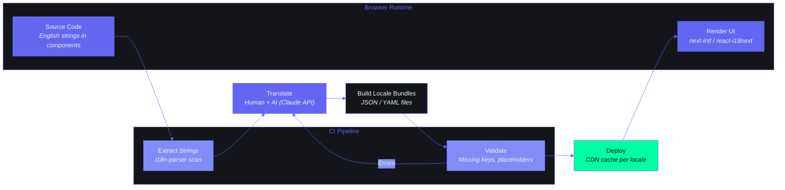

# Internationalization (i18n)

---

## Document Control

| Field | Detail |
|---|---|
| **Document ID** | ENG-I18N-001 |
| **Version** | 1.0 |
| **Status** | Draft |
| **Author** | AI Agent System |
| **Date** | 2024-01-01 |
| **Last Reviewed** | 2025-12-15 |
| **Review Cycle** | Quarterly |
| **Approved By** | — |

---

## 1. Executive Summary

Second Brain OS is currently English-only across both the **Next.js 14** frontend and the **FastAPI** backend. As the product targets Indian university students (BTech CSE) with potential expansion into broader markets, internationalization (i18n) is a strategic investment. The immediate priority is **Hindi (HI)** support for the Indian user base, with a framework that accommodates additional languages in the future.

This document defines the i18n architecture, locale support plan, translation management workflow, number/date formatting, RTL considerations, content strategy, testing approach, and the translation pipeline.

---

## 2. Current State

### 2.1 Language Status

| Aspect | Current State |
|---|---|
| **Frontend UI** | All UI strings hardcoded in English across React components |
| **Backend Messages** | English-only error messages, email templates, push notification text |
| **AI Content** | Generated in English (prompts and responses) |
| **User Data** | Stored in original language (English or user's language) |
| **Locale Detection** | Not implemented — assumes `en-US` |
| **Number/Date Format** | US-centric (`MM/DD/YYYY`, 12h clock) |
| **RTL Support** | Not considered |

### 2.2 Where Strings Live Today

| Location | Examples | Count (approx) |
|---|---|---|
| React components JSX | Buttons, labels, headings, tooltips | ~400 strings |
| Zustand stores | Default state labels, filter names | ~20 strings |
| Form validation | Error messages, required field warnings | ~50 strings |
| Backend Pydantic models | Validation error messages | ~30 strings |
| FastAPI route handlers | HTTP exception messages | ~40 strings |
| Email templates | Notification, briefing, review emails | ~10 templates |
| Push notification messages | Reminder, alert, prompt texts | ~15 messages |
| AI system prompts | Briefing, radar, review generation prompts | ~6 prompts |

### 2.3 Technical Debt

- No translation file structure exists
- No locale routing (`/en/tasks`, `/hi/tasks`)
- No `Intl` usage for numbers or dates
- Backend error messages are bare strings with no key system

---

## i18n Pipeline



## 3. Locale Support Plan

### 3.1 Locale Roadmap

| Phase | Locale | Region | Target Date | Scope |
|---|---|---|---|---|
| Phase 1 | `en` | Global (default) | Now | All UI + backend |
| Phase 2 | `hi` | India | Q1 2025 | All UI + email + push |
| Phase 3 | `bn` (Bengali) | India (West Bengal) | Q2 2025 | UI only (partial) |
| Phase 4 | `te` (Telugu), `ta` (Tamil) | India (South) | Q3 2025 | UI only (partial) |
| Phase 5 | `ar` (Arabic), `zh` (Chinese) | Middle East, Asia | Future | Full stack |

### 3.2 Locale Prioritization Criteria

| Factor | Weight | Reasoning |
|---|---|---|
| User base size | 40% | Hindi has largest Indian university audience |
| Content complexity | 25% | Hindi has adequate NLP/LLM support |
| Technical complexity | 15% | Hindi uses Devanagari (no RTL) |
| Business value | 20% | Aligns with Indian govt. digital push |

### 3.3 Locale Codes (BCP 47)

```typescript
export type Locale = "en" | "hi" | "bn" | "te" | "ta" | "ar" | "zh"

export const LOCALE_META: Record<Locale, {
  name: string
  nativeName: string
  dir: "ltr" | "rtl"
  dateFormat: string
  timeFormat: string
  numberGroupSeparator: string
  numberDecimalSeparator: string
  firstDayOfWeek: 0 | 1  // 0=Sunday, 1=Monday
}> = {
  en: { name: "English", nativeName: "English", dir: "ltr", dateFormat: "MM/DD/YYYY", timeFormat: "h:mm A", numberGroupSeparator: ",", numberDecimalSeparator: ".", firstDayOfWeek: 0 },
  hi: { name: "Hindi", nativeName: "हिन्दी", dir: "ltr", dateFormat: "DD/MM/YYYY", timeFormat: "HH:mm", numberGroupSeparator: ",", numberDecimalSeparator: ".", firstDayOfWeek: 1 },
  bn: { name: "Bengali", nativeName: "বাংলা", dir: "ltr", dateFormat: "DD/MM/YYYY", timeFormat: "HH:mm", numberGroupSeparator: ",", numberDecimalSeparator: ".", firstDayOfWeek: 1 },
  te: { name: "Telugu", nativeName: "తెలుగు", dir: "ltr", dateFormat: "DD/MM/YYYY", timeFormat: "HH:mm", numberGroupSeparator: ",", numberDecimalSeparator: ".", firstDayOfWeek: 0 },
  ta: { name: "Tamil", nativeName: "தமிழ்", dir: "ltr", dateFormat: "DD/MM/YYYY", timeFormat: "HH:mm", numberGroupSeparator: ",", numberDecimalSeparator: ".", firstDayOfWeek: 0 },
  ar: { name: "Arabic", nativeName: "العربية", dir: "rtl", dateFormat: "DD/MM/YYYY", timeFormat: "HH:mm", numberGroupSeparator: ",", numberDecimalSeparator: ".", firstDayOfWeek: 1 },
  zh: { name: "Chinese", nativeName: "中文", dir: "ltr", dateFormat: "YYYY/MM/DD", timeFormat: "HH:mm", numberGroupSeparator: ",", numberDecimalSeparator: ".", firstDayOfWeek: 1 },
}
```

---

## 4. i18n Architecture

### 4.1 Frontend: next-intl

**Recommendation:** `next-intl` (over `react-i18next`) for native Next.js 14 App Router integration.

| Feature | next-intl | react-i18next |
|---|---|---|
| App Router support | Native (`generateStaticParams`) | Manual setup |
| Server Components | Supported | Not supported |
| Client Components | Supported | Supported |
| File-based routing per locale | Built-in | Manual |
| Message extraction | Manual | Manual |
| Bundle size | ~8KB gzip | ~12KB gzip |

### 4.2 Frontend Architecture

```
apps/web/
├── messages/
│   ├── en.json              # English translations
│   ├── hi.json              # Hindi translations
│   ├── bn.json              # Bengali translations
│   └── ...
├── i18n.ts                  # next-intl configuration
├── middleware.ts            # Locale detection + redirect
├── app/
│   ├── [locale]/            # Dynamic locale segment
│   │   ├── layout.tsx       # Locale-aware layout
│   │   ├── page.tsx         # Home page
│   │   ├── tasks/
│   │   ├── goals/
│   │   └── ...
│   └── not-found.tsx        # 404 page
└── components/
    └── language-switcher.tsx # Locale toggle UI
```

### 4.3 Configuration: i18n.ts

```typescript
// apps/web/i18n.ts
import { getRequestConfig } from "next-intl/server"

export const locales = ["en", "hi", "bn"] as const
export type Locale = (typeof locales)[number]
export const defaultLocale: Locale = "en"

export default getRequestConfig(async ({ requestLocale }) => {
  let locale = await requestLocale
  if (!locale || !locales.includes(locale as Locale)) {
    locale = defaultLocale
  }

  return {
    locale,
    messages: (await import(`./messages/${locale}.json`)).default,
    timeZone: "Asia/Kolkata",
    now: new Date(),
  }
})
```

### 4.4 Middleware: Locale Detection

```typescript
// apps/web/middleware.ts
import createMiddleware from "next-intl/middleware"
import { locales, defaultLocale } from "./i18n"

export default createMiddleware({
  locales,
  defaultLocale,
  localeDetection: true,       // Detect from Accept-Language header
  localePrefix: "always",      // /en/tasks, /hi/tasks
})

export const config = {
  matcher: ["/((?!api|_next|_vercel|static|favicon.ico).*)"],
}

// Locale detection priority:
// 1. Cookie (user preference)
// 2. URL path (/hi/tasks)
// 3. Accept-Language header
// 4. Default locale (en)
```

### 4.5 Backend: gettext / Python

For the **FastAPI** backend, use Python's `gettext` module for static strings and error messages:

```python
# apps/api/app/i18n/__init__.py
import gettext
from pathlib import Path

LOCALE_DIR = Path(__file__).parent / "locales"
SUPPORTED_LOCALES = ["en", "hi", "bn"]

translations: dict[str, gettext.NullTranslations] = {}

for locale in SUPPORTED_LOCALES:
    try:
        translations[locale] = gettext.translation(
            "messages", localedir=LOCALE_DIR, languages=[locale]
        )
    except FileNotFoundError:
        translations[locale] = gettext.NullTranslations()


def get_translator(locale: str = "en"):
    return translations.get(locale, translations["en"]).gettext
```

**Directory structure:**

```
apps/api/app/i18n/
├── locales/
│   ├── en/
│   │   └── LC_MESSAGES/
│   │       ├── messages.po
│   │       └── messages.mo
│   ├── hi/
│   │   └── LC_MESSAGES/
│   │       ├── messages.po
│   │       └── messages.mo
│   └── ...
├── __init__.py
└── extract_messages.py    # Script to extract strings from code
```

### 4.6 Backend Usage in Error Messages

```python
# apps/api/app/i18n/dependencies.py
from fastapi import Request
from . import get_translator

async def gettext(request: Request):
    locale = request.headers.get("Accept-Language", "en").split(",")[0][:2]
    if locale not in SUPPORTED_LOCALES:
        locale = "en"
    return get_translator(locale)


# apps/api/app/api/tasks.py
@app.get("/api/tasks/{task_id}")
async def get_task(task_id: str, _ = Depends(gettext)):
    task = await fetch_task(task_id)
    if not task:
        raise HTTPException(
            status_code=404,
            detail=_("Task not found")   # ← translated at runtime
        )
    return task
```

---

## 5. Translation Management

### 5.1 Translation File Format (ICU Message Syntax)

```json
// apps/web/messages/en.json
{
  "nav": {
    "dashboard": "Dashboard",
    "tasks": "Tasks",
    "goals": "Goals",
    "ideas": "Ideas",
    "habits": "Habits",
    "radar": "Opportunity Radar",
    "settings": "Settings"
  },
  "tasks": {
    "title": "Tasks",
    "create": "Create Task",
    "edit": "Edit Task",
    "delete": "Delete Task",
    "status_pending": "Pending",
    "status_in_progress": "In Progress",
    "status_completed": "Completed",
    "due_date": "Due Date",
    "no_tasks": "No tasks yet. Create your first task!",
    "confirm_delete": "Are you sure you want to delete \"{taskTitle}\"?",
    "completed_count": "{count, plural, =0 {No tasks completed} one {# task completed} other {# tasks completed}}"
  },
  "common": {
    "save": "Save",
    "cancel": "Cancel",
    "loading": "Loading...",
    "error": "Something went wrong. Please try again.",
    "retry": "Retry",
    "search": "Search...",
    "no_results": "No results found for \"{query}\"."
  },
  "notifications": {
    "briefing_ready": "Your daily briefing is ready!",
    "habits_reminder": "Don't forget to check in your habits for today!",
    "sleep_prompt": "Time to log your sleep. How was your day?",
    "weekly_review_ready": "Your weekly review is ready!"
  },
  "auth": {
    "login": "Log In",
    "signup": "Sign Up",
    "logout": "Log Out",
    "email": "Email",
    "password": "Password",
    "welcome_back": "Welcome back, {name}!",
    "error_invalid_credentials": "Invalid email or password."
  }
}
```

```json
// apps/web/messages/hi.json
{
  "nav": {
    "dashboard": "डैशबोर्ड",
    "tasks": "कार्य",
    "goals": "लक्ष्य",
    "ideas": "विचार",
    "habits": "आदतें",
    "radar": "अवसर रडार",
    "settings": "सेटिंग्स"
  },
  "tasks": {
    "title": "कार्य",
    "create": "कार्य बनाएं",
    "edit": "कार्य संपादित करें",
    "delete": "कार्य हटाएं",
    "status_pending": "लंबित",
    "status_in_progress": "प्रगति पर",
    "status_completed": "पूर्ण",
    "due_date": "नियत तारीख",
    "no_tasks": "अभी तक कोई कार्य नहीं। अपना पहला कार्य बनाएं!",
    "confirm_delete": "क्या आप वाकई \"{taskTitle}\" हटाना चाहते हैं?",
    "completed_count": "{count, plural, =0 {कोई कार्य पूर्ण नहीं} one {# कार्य पूर्ण} other {# कार्य पूर्ण}}"
  },
  "common": {
    "save": "सहेजें",
    "cancel": "रद्द करें",
    "loading": "लोड हो रहा है...",
    "error": "कुछ गलत हो गया। कृपया पुनः प्रयास करें।",
    "retry": "पुनः प्रयास करें",
    "search": "खोजें...",
    "no_results": "\"{query}\" के लिए कोई परिणाम नहीं मिला।"
  },
  "notifications": {
    "briefing_ready": "आपका दैनिक ब्रीफिंग तैयार है!",
    "habits_reminder": "आज अपनी आदतों की जांच करना न भूलें!",
    "sleep_prompt": "नींद लॉग करने का समय। आपका दिन कैसा रहा?",
    "weekly_review_ready": "आपकी साप्ताहिक समीक्षा तैयार है!"
  },
  "auth": {
    "login": "लॉग इन",
    "signup": "साइन अप",
    "logout": "लॉग आउट",
    "email": "ईमेल",
    "password": "पासवर्ड",
    "welcome_back": "वापसी पर स्वागत है, {name}!",
    "error_invalid_credentials": "गलत ईमेल या पासवर्ड।"
  }
}
```

### 5.2 Usage in React Components

```tsx
// apps/web/components/tasks/task-card.tsx
import { useTranslations } from "next-intl"

interface TaskCardProps {
  task: Task
  onDelete: (id: string) => void
}

export function TaskCard({ task, onDelete }: TaskCardProps) {
  const t = useTranslations("tasks")
  const c = useTranslations("common")

  return (
    <div className="card p-4">
      <h3 className="text-lg font-semibold">{task.title}</h3>
      <span className="badge">{t(`status_${task.status}`)}</span>
      <p className="text-sm text-text-secondary">
        {t("due_date")}: {formatDate(task.dueDate)}
      </p>
      <button
        className="btn btn-danger"
        onClick={() => onDelete(task.id)}
        aria-label={t("delete")}
      >
        {t("delete")}
      </button>
    </div>
  )
}
```

### 5.3 Server Component Usage

```tsx
// apps/web/app/[locale]/tasks/page.tsx
import { getTranslations } from "next-intl/server"

export default async function TasksPage() {
  const t = await getTranslations("tasks")

  return (
    <div>
      <h1>{t("title")}</h1>
      <p>{t("no_tasks")}</p>
    </div>
  )
}

export function generateStaticParams() {
  return [{ locale: "en" }, { locale: "hi" }, { locale: "bn" }]
}
```

### 5.4 Key Naming Convention

| Pattern | Example |
|---|---|
| `section.key` | `tasks.title` |
| `section.subsection.key` | `tasks.form.title_label` |
| `section.key_variant` | `tasks.status_pending` |
| `common.key` | `common.save` |
| `error.section.key` | `error.tasks.not_found` |
| `notification.key` | `notifications.briefing_ready` |

### 5.5 Translation File Size Budget

| Locale | Phase | Estimated Strings | File Size |
|---|---|---|---|
| `en` | Base | ~500 | ~15KB |
| `hi` | Phase 2 | ~500 | ~18KB (Devanagari) |
| `bn` | Phase 3 | ~500 | ~18KB (Bengali script) |
| `full` | Complete | ~1500 | ~45KB per locale |

---

## 6. Number, Date, Currency Formatting

### 6.1 Intl-Based Formatting

React components use the native `Intl` API (or `next-intl` wrappers):

```tsx
// apps/web/lib/format.ts
import { useLocale } from "next-intl"

export function useFormat() {
  const locale = useLocale()

  const formatNumber = (num: number, options?: Intl.NumberFormatOptions) =>
    new Intl.NumberFormat(locale, options).format(num)

  const formatDate = (date: Date, options?: Intl.DateTimeFormatOptions) =>
    new Intl.DateTimeFormat(locale, {
      dateStyle: "medium",
      timeZone: "Asia/Kolkata",
      ...options,
    }).format(date)

  const formatCurrency = (amount: number, currency = "INR") =>
    new Intl.NumberFormat(locale, {
      style: "currency",
      currency,
    }).format(amount)

  const formatRelative = (date: Date) => {
    const rtf = new Intl.RelativeTimeFormat(locale, { numeric: "auto" })
    const diff = date.getTime() - Date.now()
    const hours = Math.round(diff / (1000 * 60 * 60))
    if (Math.abs(hours) < 24) return rtf.format(hours, "hour")
    const days = Math.round(diff / (1000 * 60 * 60 * 24))
    return rtf.format(days, "day")
  }

  return { formatNumber, formatDate, formatCurrency, formatRelative }
}
```

### 6.2 Format Examples by Locale

| Format | `en` | `hi` | `bn` |
|---|---|---|---|
| **Number** | `1,234.56` | `१,२३४.५६` | `১,২৩৪.৫৬` |
| **Date** | `Jan 15, 2024` | `15 जनवरी 2024` | `১৫ জানুয়ারি ২০২৪` |
| **Currency (INR)** | `₹1,234.56` | `₹१,२३४.५६` | `₹১,২৩৪.৫৬` |
| **Time** | `2:30 PM` | `14:30` | `14:30` |
| **Relative** | `2 hours ago` | `2 घंटे पहले` | `২ ঘন্টা আগে` |

### 6.3 Backend Date Formatting

```python
# apps/api/app/i18n/format.py
from babel.dates import format_date, format_time, format_datetime
from babel.numbers import format_number, format_currency
from datetime import datetime

LOCALE_MAP = {
    "en": "en_IN",
    "hi": "hi_IN",
    "bn": "bn_IN",
}

def format_date_for_locale(dt: datetime, locale: str = "en", format: str = "medium"):
    return format_date(dt, format=format, locale=LOCALE_MAP.get(locale, "en_IN"))

def format_currency_for_locale(amount: float, currency: str = "INR", locale: str = "en"):
    return format_currency(amount, currency, locale=LOCALE_MAP.get(locale, "en_IN"))
```

---

## 7. RTL Support

### 7.1 When RTL Is Needed

| Language | Script | Direction | Support Needed |
|---|---|---|---|
| Arabic (`ar`) | Arabic | RTL | Full |
| Urdu (`ur`) | Perso-Arabic | RTL | Full |
| Persian (`fa`) | Perso-Arabic | RTL | Full |
| Hebrew (`he`) | Hebrew | RTL | Full |

None of the Phase 1-4 locales require RTL. RTL support is a future consideration.

### 7.2 CSS Logical Properties (For RTL Readiness)

```css
/* ❌ Physical properties — break in RTL */
.element {
  margin-left: 16px;
  padding-right: 8px;
  border-left: 1px solid;
  text-align: left;
}

/* ✅ Logical properties — auto-flip in RTL */
.element {
  margin-inline-start: 16px;
  padding-inline-end: 8px;
  border-inline-start: 1px solid;
  text-align: start;
}
```

### 7.3 Tailwind RTL Utilities

```tsx
// tailwind.config.js — using logical properties via plugins or custom utilities
module.exports = {
  theme: {
    extend: {
      margin: {
        "inline-start": "margin-inline-start",
        "inline-end": "margin-inline-end",
      },
    },
  },
}

// Usage
<div className="ms-4 pe-2 text-start">
```

### 7.4 HTML dir Attribute

```tsx
// apps/web/app/[locale]/layout.tsx
import { NextIntlClientProvider } from "next-intl"
import { locales, type Locale } from "@/i18n"

const DIR_MAP: Record<Locale, "ltr" | "rtl"> = {
  en: "ltr", hi: "ltr", bn: "ltr",
  te: "ltr", ta: "ltr",
  ar: "rtl", zh: "ltr",
}

export default function LocaleLayout({
  children,
  params: { locale },
}: {
  children: React.ReactNode
  params: { locale: Locale }
}) {
  return (
    <html lang={locale} dir={DIR_MAP[locale] || "ltr"}>
      <body>{children}</body>
    </html>
  )
}
```

---

## 8. Content Strategy

### 8.1 What Gets Translated

| Content Type | Translated? | Strategy |
|---|---|---|
| **UI labels, buttons, headings** | ✅ Yes | Key-based translation files |
| **Form validation messages** | ✅ Yes | Backend gettext + frontend keys |
| **Error messages (HTTP)** | ✅ Yes | Accept-Language header on API |
| **Email templates** | ✅ Yes | Template per locale |
| **Push notifications** | ✅ Yes | Localized on send |
| **Tooltips, help text** | ✅ Yes | Translation files |
| **User-generated data** (task titles, ideas) | ❌ No | Stored as-is |
| **AI-generated content** (briefings, reviews) | ❌ No | Generated per user preference |
| **System prompts** (AI instructions) | ❌ No | English only (model optimized) |
| **Logs, internal messages** | ❌ No | English (developer-facing) |

### 8.2 AI Content Language Policy

| AI Feature | Language | Rationale |
|---|---|---|
| Daily Briefing | User's preferred language | Generated with prompt: `"Respond in {locale}"` |
| Opportunity Radar | User's preferred language | Same approach |
| Weekly Review | User's preferred language | Same approach |
| Task Suggestions | User's preferred language | Same approach |
| System Prompts | English (fixed) | LLMs are English-optimized |

```python
# Generating AI content in user's language
async def generate_briefing(user_id: str, locale: str = "en"):
    user = await get_user(user_id)

    prompt = f"""You are a personal AI assistant. Generate a daily briefing in {locale}.
    The user's name is {user.name}.
    Today's tasks: {tasks}
    """

    response = await ai_client.generate(prompt)
    return response  # Response will be in {locale}
```

### 8.3 Language Switcher UI

```tsx
// apps/web/components/language-switcher.tsx
"use client"

import { useLocale } from "next-intl"
import { usePathname, useRouter } from "next-intl/client"
import { locales, type Locale } from "@/i18n"
import { Globe } from "lucide-react"

const LOCALE_NAMES: Record<Locale, string> = {
  en: "English",
  hi: "हिन्दी",
  bn: "বাংলা",
}

export function LanguageSwitcher() {
  const locale = useLocale()
  const router = useRouter()
  const pathname = usePathname()

  const switchLocale = (newLocale: Locale) => {
    router.replace(pathname, { locale: newLocale })
    // Cookies set automatically by next-intl middleware
  }

  return (
    <div className="relative group">
      <button className="flex items-center gap-2 px-3 py-2 rounded-lg hover:bg-background-hover">
        <Globe className="w-4 h-4" />
        <span>{LOCALE_NAMES[locale as Locale]}</span>
      </button>
      <div className="absolute right-0 mt-1 w-40 bg-background-card rounded-lg shadow-lg border border-border-color hidden group-hover:block">
        {locales.map((l) => (
          <button
            key={l}
            onClick={() => switchLocale(l as Locale)}
            className={`w-full text-left px-4 py-2 hover:bg-background-hover ${
              locale === l ? "text-accent-primary font-semibold" : ""
            }`}
          >
            {LOCALE_NAMES[l as Locale]}
          </button>
        ))}
      </div>
    </div>
  )
}
```

---

## 9. Translation Workflow

### 9.1 Pipeline

```
  ┌──────────┐   ┌──────────┐   ┌──────────┐   ┌──────────┐   ┌──────────┐
  │ Developer │──▶│ Extract  │──▶│Translator│──▶│  Review  │──▶│  Deploy  │
  │ adds key  │   │ strings  │   │ (human   │   │ (QA)     │   │ (CI/CD)  │
  │ in EN     │   │ (script) │   │  or AI)  │   │          │   │          │
  └──────────┘   └──────────┘   └──────────┘   └──────────┘   └──────────┘
```

### 9.2 Step-by-Step

| Step | Action | Tool | Responsible |
|---|---|---|---|
| 1 | Add translation key in code | `t("section.key")` | Developer |
| 2 | Add key-value to `en.json` | Manual edit | Developer |
| 3 | Run extraction script | `npm run i18n:extract` | CI / Developer |
| 4 | Translate to target locale | AI / human translator | Translator |
| 5 | Review translations | Translation review tool | Reviewer |
| 6 | Validate key coverage | `npm run i18n:check` | CI |
| 7 | Deploy | Standard CI/CD pipeline | Automated |

### 9.3 String Extraction Script

```bash
# apps/web/scripts/i18n-extract.sh
#!/bin/bash
# Extracts all t("...") and getTranslations("...") calls from source
# Outputs unused keys and missing translations

echo "Extracting i18n keys..."
grep -rohP '(?<=t\(")[^"]+' apps/web/app apps/web/components | sort -u > /tmp/en_keys_used.txt

echo "Checking missing keys in hi.json..."
jq -r 'paths(scalars) | join(".")' apps/web/messages/hi.json | sort > /tmp/hi_keys.txt
comm -23 /tmp/en_keys_used.txt /tmp/hi_keys.txt > /tmp/missing_hi.txt

if [ -s /tmp/missing_hi.txt ]; then
  echo "Missing Hindi translations:"
  cat /tmp/missing_hi.txt
fi
```

### 9.4 Translation Quality Checklist

| Check | Automated? | Description |
|---|---|---|
| All keys present | ✅ Yes | CI fails if keys missing |
| No placeholder mismatch | ✅ Yes | `{name}` exists in source and translation |
| No HTML injection | ✅ Yes | Escape HTML in translations |
| String length check | ⚠️ Manual | Translations not excessively longer than EN |
| UI layout check | ⚠️ Manual | Text overflow, button width |
| Context accuracy | ❌ Human | Meaning preserved |

---

## 10. Testing i18n

### 10.1 Locale Switching Test

```typescript
// apps/web/__tests__/i18n/locale-switching.test.tsx
import { render, screen, fireEvent } from "@testing-library/react"
import { LanguageSwitcher } from "@/components/language-switcher"

describe("Language Switcher", () => {
  it("switches from English to Hindi", async () => {
    render(<LanguageSwitcher />)
    const button = screen.getByRole("button", { name: /english/i })
    fireEvent.click(button)
    const hindiOption = screen.getByText("हिन्दी")
    fireEvent.click(hindiOption)
    // Verify cookie/URL changed
    expect(document.cookie).toContain("NEXT_LOCALE=hi")
  })
})
```

### 10.2 Missing Key Detection (CI)

```bash
# CI job — fails if translations are missing
node scripts/i18n-check.mjs
```

```javascript
// scripts/i18n-check.mjs
import { readFileSync, readdirSync } from "fs"
import { join } from "path"

const messagesDir = join(process.cwd(), "messages")
const enMessages = JSON.parse(readFileSync(join(messagesDir, "en.json"), "utf-8"))

const getKeys = (obj, prefix = "") =>
  Object.entries(obj).flatMap(([k, v]) =>
    typeof v === "object" ? getKeys(v, `${prefix}${k}.`) : `${prefix}${k}`
  )

const enKeys = new Set(getKeys(enMessages))
let hasError = false

readdirSync(messagesDir).forEach((file) => {
  if (file === "en.json") return
  const locale = file.replace(".json", "")
  const messages = JSON.parse(readFileSync(join(messagesDir, file), "utf-8"))
  const localeKeys = new Set(getKeys(messages))

  const missing = [...enKeys].filter((k) => !localeKeys.has(k))
  if (missing.length > 0) {
    console.error(`❌ ${locale}: Missing ${missing.length} keys:`, missing)
    hasError = true
  }

  const extra = [...localeKeys].filter((k) => !enKeys.has(k))
  if (extra.length > 0) {
    console.warn(`⚠️  ${locale}: ${extra.length} extra keys (may be unused):`, extra)
  }
})

if (hasError) process.exit(1)
```

### 10.3 UI Layout Tests

```typescript
// apps/web/__tests__/i18n/layout.test.tsx
describe("RTL Layout", () => {
  it.each([
    { locale: "en", dir: "ltr" },
    { locale: "hi", dir: "ltr" },
    { locale: "ar", dir: "rtl" },
  ])("sets dir=$dir for locale=$locale", ({ locale, dir }) => {
    render(<Page locale={locale} />)
    expect(document.documentElement.dir).toBe(dir)
  })
})
```

### 10.4 Test Matrix

| Test | Scope | Frequency |
|---|---|---|
| All keys present per locale | All locales | On each PR |
| ICU message syntax valid | All locales | On each PR |
| Placeholder mismatch | All locales | On each PR |
| UI regression per locale | EN, HI | On each deploy |
| RTL layout check | AR (if enabled) | On each deploy |
| Backend error messages | EN, HI | On each deploy |
| Email template rendering | EN, HI | On change |
| Push notification text | All locales | On change |

---

## 11. Appendices

### Appendix A: Translation File Format

```
apps/web/messages/
├── en.json      # English (source of truth)
├── hi.json      # Hindi
├── bn.json      # Bengali
├── te.json      # Telugu
├── ta.json      # Tamil
├── ar.json      # Arabic
└── zh.json      # Chinese

apps/api/app/i18n/locales/
├── en/
│   └── LC_MESSAGES/
│       ├── messages.po
│       └── messages.mo
├── hi/
│   └── LC_MESSAGES/
│       ├── messages.po
│       └── messages.mo
└── ...
```

```json
// JSON format rules:
// 1. Keys use dot notation flattened into nested objects
// 2. Values use ICU MessageFormat syntax
// 3. Nested objects group related keys
// 4. No HTML in values (use React components for markup)
// 5. Placeholders in {curly braces}
// 6. Plural forms use ICU select
```

### Appendix B: Locale Support Table

| Code | Language | Native Name | Phase | Script | Direction | Completeness Target |
|---|---|---|---|---|---|---|
| `en` | English | English | 1 | Latin | LTR | 100% |
| `hi` | Hindi | हिन्दी | 2 | Devanagari | LTR | 100% |
| `bn` | Bengali | বাংলা | 3 | Bengali | LTR | 80% (UI only) |
| `te` | Telugu | తెలుగు | 4 | Telugu | LTR | 60% |
| `ta` | Tamil | தமிழ் | 4 | Tamil | LTR | 60% |
| `ar` | Arabic | العربية | 5 | Arabic | RTL | 100% |
| `zh` | Chinese | 中文 | 5 | Han | LTR | 80% |

### Appendix C: Backend PO File Example

```
# apps/api/app/i18n/locales/hi/LC_MESSAGES/messages.po

msgid ""
msgstr ""
"Project-Id-Version: Second Brain OS 1.0\n"
"Language: hi_IN\n"
"Content-Type: text/plain; charset=UTF-8\n"
"Plural-Forms: nplurals=2; plural=(n!=1);\n"

msgid "Task not found"
msgstr "कार्य नहीं मिला"

msgid "Invalid email or password"
msgstr "गलत ईमेल या पासवर्ड"

msgid "You have {count} pending tasks"
msgid_plural "You have {count} pending task"
msgstr[0] "आपके पास {count} लंबित कार्य है"
msgstr[1] "आपके पास {count} लंबित कार्य हैं"
```

### Appendix D: Revision History

| Version | Date | Author | Changes |
|---|---|---|---|
| 1.0 | 2025-12-15 | AI Agent System | Initial draft |
| — | — | — | — |
| — | — | — | — |
