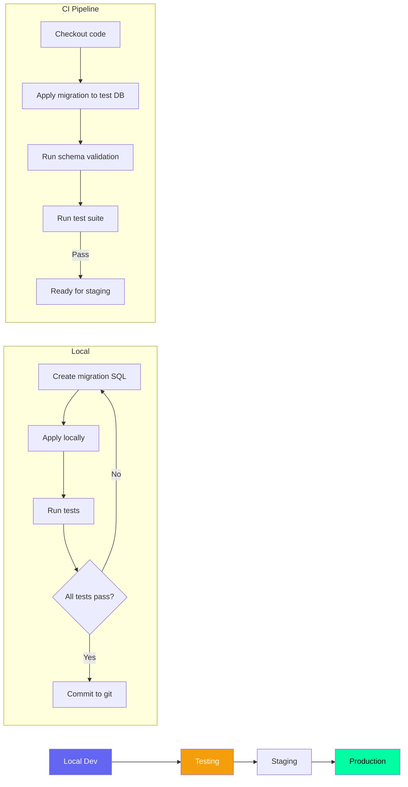

# Migration Strategy — Second Brain OS

## Document Control

| Field | Value |
|---|---|
| **Document ID** | ENG-MIG-011 |
| **Version** | 1.0.0 |
| **Status** | Approved |
| **Date** | 2026-07-10 |
| **Classification** | Internal |
| **Owner** | Developer |
| **Related Docs** | [BackupStrategy.md](BackupStrategy.md), [Schema.md](Schema.md), [CI.md](../devops/CI.md) |

---

## 1. Executive Summary

Database migrations are managed through the Supabase migration tool (CLI), with SQL files stored in version control alongside the application code. Migrations follow a strict naming convention and are tested locally before applying to staging and production environments.

---

## 2. Migration Naming Convention

```
YYYYMMDDHHMMSS_description.sql
```

Examples:
- `20260601000000_initial_schema.sql`
- `20260611000000_add_roadmaps_tables.sql`
- `20260620000000_add_notifications.sql`

**Rules:**
- Timestamp must be UTC and unique
- Description uses snake_case
- Maximum 50 characters for description
- No spaces or special characters

---

## 3. Migration Pipeline



---

## 4. Migration Commands

```bash
# Supabase CLI migration commands
supabase login                    # Authenticate
supabase link --project-ref xxx   # Link to Supabase project
supabase db diff                  # Generate diff migration
supabase db pull                  # Pull remote schema
supabase db push                  # Push local migrations to remote
supabase migration new add_tasks  # Create new migration file
supabase migration list           # List all migrations
supabase migration up             # Apply pending migrations
supabase migration down           # Rollback last migration (if reversible)
```

---

## 5. Migration File Template

```sql
-- 20260620000000_add_notifications.sql

-- UP: Add notifications table
CREATE TABLE IF NOT EXISTS notifications (
  id UUID PRIMARY KEY DEFAULT gen_random_uuid(),
  user_id UUID REFERENCES auth.users(id) ON DELETE CASCADE NOT NULL,
  title TEXT NOT NULL,
  body TEXT,
  type TEXT CHECK (type IN ('briefing', 'opportunity', 'nudge', 'reminder', 'system')),
  is_read BOOLEAN DEFAULT FALSE,
  read_at TIMESTAMPTZ,
  action_url TEXT,
  created_at TIMESTAMPTZ DEFAULT NOW()
);

CREATE INDEX idx_notifications_user_created ON notifications(user_id, created_at DESC);
ALTER TABLE notifications ENABLE ROW LEVEL SECURITY;
CREATE POLICY "users_own_data" ON notifications
  FOR ALL USING (auth.uid() = user_id)
  WITH CHECK (auth.uid() = user_id);

-- DOWN: Remove notifications table
-- DROP TABLE IF EXISTS notifications;
```

---

## 6. Migration Testing

```bash
# 1. Create migration in local Supabase
supabase migration new add_feature_x

# 2. Apply locally
supabase db push

# 3. Run schema validation
psql -d $LOCAL_DB_URL -c "
  SELECT table_name FROM information_schema.tables
  WHERE table_schema = 'public';
"

# 4. Run test suite
pytest tests/ -m "database" -v

# 5. Verify backward compatibility
# Check that all existing API routes still work
```

---

## 7. Environment Migration Strategy

| Environment | Database | Migration Method | Frequency |
|---|---|---|---|
| **Local dev** | Local Supabase (Docker) | `supabase db push` | Every change |
| **Testing (CI)** | Ephemeral test DB | `supabase db push` | Every push |
| **Staging** | Supabase staging project | Manual review + apply | Before each release |
| **Production** | Supabase production project | Manual review + apply | Release day |

---

## 8. Migration Best Practices

| Practice | Rule | Rationale |
|---|---|---|
| **Irreversible** | Always test down migration | Enables rollback |
| **Backup** | Backup before prod migration | Disaster recovery |
| **Small batches** | One logical change per migration | Easy to review/revert |
| **No data loss** | Avoid destructive operations | Use SET NULL not DROP COLUMN initially |
| **Lock-free** | Use CONCURRENTLY for index creation | Avoid table locks |
| **Validation** | Run ANALYZE after large changes | Update query planner stats |

**Example of safe destructive change:**

```sql
-- Phase 1: Mark column as deprecated (safe)
ALTER TABLE tasks ALTER COLUMN old_column SET DEFAULT NULL;
-- Wait 1 week, verify nothing breaks

-- Phase 2: Drop column (risky)
ALTER TABLE tasks DROP COLUMN old_column;
```

---

## 9. Migration Rollback

```sql
-- Option 1: Supabase migration down (if reversible)
supabase migration down

-- Option 2: Manual reverse SQL
-- Create rollback SQL at time of deployment

-- Option 3: Restore from backup
pg_restore -d $DATABASE_URL backup_before_migration.dump
```

---

## 10. Migration History Tracking

```sql
-- View migration history in Supabase
SELECT * FROM supabase_migrations.schema_migrations
ORDER BY version;
```

---

## 11. Related Documents

| Document | Description |
|---|---|
| [BackupStrategy.md](BackupStrategy.md) | Backup and restore procedures |
| [Schema.md](Schema.md) | Complete schema reference |
| [CI.md](../devops/CI.md) | CI pipeline for migrations |
