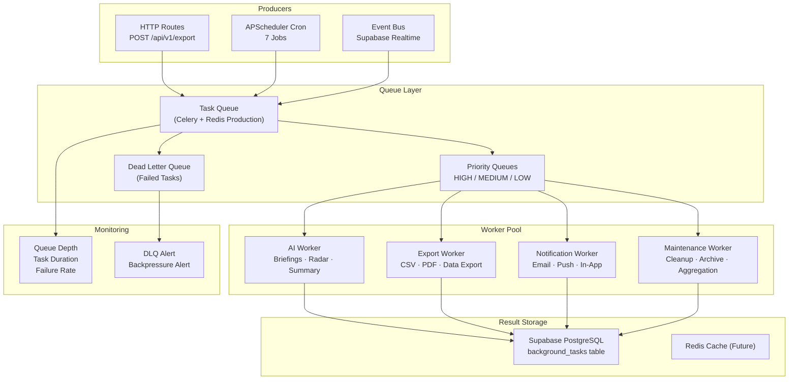
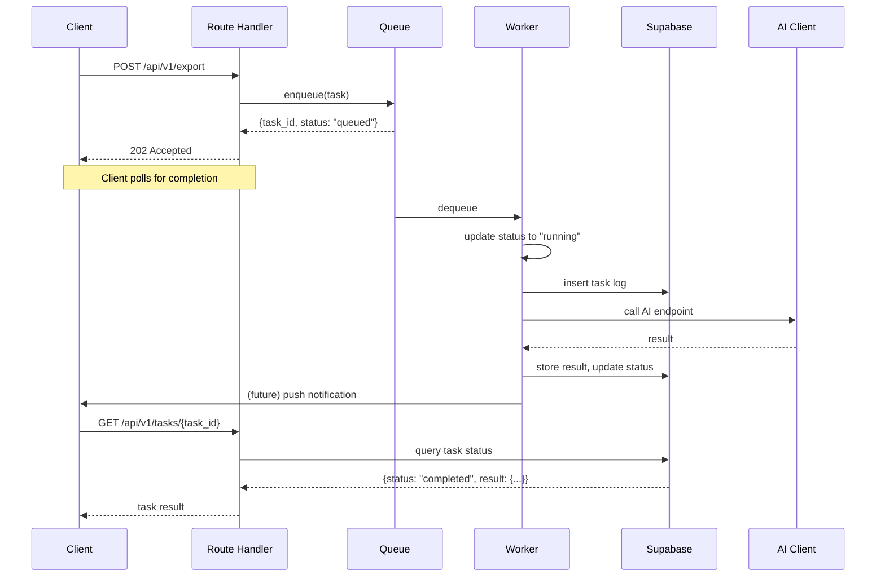

# Queue Architecture

## Document Control

| Field | Value |
|---|---|
| **Document ID** | ENG-QUE-006 |
| **Version** | 1.0.0 |
| **Status** | Approved |
| **Date** | 2026-07-10 |
| **Classification** | Internal |
| **Owner** | Developer |

---

## 1. Executive Summary

Second Brain OS currently processes all background work synchronously within the FastAPI request-response lifecycle or inside APScheduler cron job handlers. As the platform scales — with AI briefing generation, opportunity radar scanning, data exports, and model inference — synchronous processing creates latency bottlenecks and poor user experience. This document defines a **future queue architecture** with an incremental migration path: an in-memory queue using `asyncio` for the alpha phase, with a clear path to **Celery + Redis** for production-scale distributed processing.

---

## 2. Purpose

Define a queue architecture that enables async task processing, decouples request handling from expensive operations, provides task persistence and retry, and scales from single-process to distributed workers.

---

## 3. Scope

This document covers:
- Current synchronous execution model and its limitations
- Target queue architecture with worker pools
- Queue types (task queue, event bus, message queue)
- Queue storage options (in-memory, PostgreSQL, Redis)
- Worker pool design and concurrency model
- Backpressure handling and dead letter queues
- Task persistence, retry, and monitoring
- Migration path from synchronous to queue-based execution

Out of scope: Current cron job implementation (see [Schedulers.md](Schedulers.md), [CronJobs.md](CronJobs.md)), detailed Celery configuration (see [BackgroundWorkers.md](BackgroundWorkers.md)).

---

## 4. Business Context

Synchronous operations that block the request-response cycle:
- AI briefing generation: ~45s — route timeout risk
- Opportunity radar scan: ~120s — infeasible inline
- Data export (CSV/PDF): ~10-60s — user waits
- Course progress recalculation: ~5s — noticeable lag
- Weekly review generation: ~180s — blocks cron handler

These operations should be queued and processed asynchronously, returning immediate acknowledgment to the caller with a task ID for status polling.

---

## 5. Functional Specification

### 5.1 Current Synchronous Model

```
HTTP Request ──▶ FastAPI Route ──▶ Business Logic ──▶ AI Inference (2-10s) ──▶ Response
                                  └── All work must complete before response ──┘
```

**Problems:**
- No queue — tasks run immediately, blocking the event loop
- No task persistence — in-flight work lost on crash
- No priority system — AI generation competes with log writes
- No task retry with backoff — failures require manual re-trigger
- No execution history — cannot audit task completion or performance

### 5.2 Target Async Model

```
HTTP Request ──▶ FastAPI Route ──▶ Queue.enqueue(task) ──▶ { task_id, status: "queued" }
                                      │
                                      ▼
                                Worker Pool ──▶ Task A: AI inference
                                (3 workers)   ▶ Task B: DB write
                                              ▶ Task C: Email send
```

**Benefits:**
- Immediate response to client (task accepted, not completed)
- Priority-based execution (HIGH/MEDIUM/LOW queues)
- Retry with exponential backoff
- Task persistence across restarts
- Execution history for monitoring
- Horizontal scaling via additional workers

---

## 6. Non-Functional Requirements

| Requirement | Target | Measurement |
|---|---|---|
| Enqueue latency | < 10ms | Enqueue timing |
| Worker dequeue latency | < 5ms | Dequeue timing |
| Task persistence durability | At-least-once delivery | Task completion audit |
| Worker pool throughput | 10 tasks/minute per worker | Task completion rate |
| Queue depth before backpressure | 1000 tasks | Queue size gauge |
| Dead letter alert latency | < 1 minute | DLQ write → alert |

---

## 7. Architecture

### 7.1 Queue Architecture Diagram



### 7.2 Alpha Phase: In-Memory Queue

```python
import asyncio
from dataclasses import dataclass, field
from enum import Enum
from uuid import uuid4
from datetime import datetime

class TaskPriority(Enum):
    HIGH = 1
    MEDIUM = 2
    LOW = 3

class TaskStatus(Enum):
    QUEUED = "queued"
    RUNNING = "running"
    COMPLETED = "completed"
    FAILED = "failed"

@dataclass(order=True)
class QueueTask:
    priority: TaskPriority
    task_id: str = field(default_factory=lambda: str(uuid4()), compare=False)
    task_type: str = field(compare=False)
    payload: dict = field(default_factory=dict, compare=False)
    status: TaskStatus = TaskStatus.QUEUED
    created_at: datetime = field(default_factory=datetime.utcnow, compare=False)
    max_retries: int = 3
    retry_count: int = 0

class InMemoryQueue:
    def __init__(self):
        self._queue: asyncio.PriorityQueue[QueueTask] = asyncio.PriorityQueue()

    async def enqueue(self, task: QueueTask):
        await self._queue.put(task)

    async def dequeue(self) -> QueueTask:
        return await self._queue.get()

    def qsize(self) -> int:
        return self._queue.qsize()
```

### 7.3 Production Phase: Celery + Redis

```
FastAPI Routes (Producer) ──▶ Redis Broker ──▶ Celery Workers ──▶ Supabase
                                                  │
                                            Worker 1 │ 2 │ 3 │ 4
                                               AI  Export  Notif  Maintenance
```

**Key differences:**
| Feature | Alpha (In-Memory) | Production (Celery + Redis) |
|---|---|---|
| Persistence | None — lost on restart | Redis persistence |
| Scalability | Single process | Horizontal — n workers |
| Priority | `asyncio.PriorityQueue` | Multiple queues |
| Retry | Manual | Built-in with backoff |
| Monitoring | Logs only | Flower + Prometheus |

---

## 8. Diagrams

### 8.1 Task Execution Flow



---

## 9. Data Models

### 9.1 Task Schema (Supabase Table)

```sql
CREATE TABLE background_tasks (
    id            UUID PRIMARY KEY DEFAULT gen_random_uuid(),
    task_type     TEXT NOT NULL,
    payload       JSONB NOT NULL DEFAULT '{}',
    priority      INTEGER NOT NULL DEFAULT 2,
    status        TEXT NOT NULL DEFAULT 'queued',
    created_at    TIMESTAMPTZ NOT NULL DEFAULT NOW(),
    started_at    TIMESTAMPTZ,
    completed_at  TIMESTAMPTZ,
    max_retries   INTEGER NOT NULL DEFAULT 3,
    retry_count   INTEGER NOT NULL DEFAULT 0,
    result        JSONB,
    error         TEXT,
    worker_id     TEXT,
    user_id       UUID
);
```

### 9.2 Task Types

| `task_type` | Expected Duration | Max Retries | Priority |
|---|---|---|---|
| `generate_briefing` | ~45s | 2 | HIGH |
| `radar_scan` | ~120s | 2 | HIGH |
| `data_export` | ~60s | 3 | MEDIUM |
| `send_email` | ~5s | 3 | LOW |
| `ai_summary` | ~10s | 2 | HIGH |
| `data_cleanup` | ~30s | 2 | LOW |
| `weekly_review` | ~180s | 2 | MEDIUM |

---

## 10. APIs

### 10.1 Queue Management Endpoints

| Method | Endpoint | Description |
|---|---|---|
| `GET` | `/api/v1/admin/queue/stats` | Queue depth, worker status |
| `GET` | `/api/v1/admin/queue/dead-letter` | List dead letter queue |
| `POST` | `/api/v1/admin/queue/dead-letter/{id}/retry` | Re-queue dead letter task |

---

## 11. Security

| Concern | Implementation |
|---|---|
| Task tampering | Payload validated at worker execution |
| Unauthorized task submission | Auth required on all enqueue endpoints |
| Dead letter access | Admin-only endpoints |
| Worker identity | Worker ID verified in task execution |

---

## 12. Performance Targets

| Metric | Alpha Target | Production Target |
|---|---|---|
| Enqueue latency | < 10ms | < 5ms |
| Worker dequeue latency | < 5ms | < 2ms |
| Max queue throughput | 50 tasks/min | 500 tasks/min |
| Task persistence durability | None | At-least-once |
| Worker pool throughput | 10 tasks/min | 100 tasks/min |

---

## 13. Edge Cases

| Edge Case | Handling |
|---|---|
| Worker crash during task | Re-queue (ack_late in Celery) |
| Queue full / backpressure | Client receives 503 Service Unavailable |
| Duplicate task submission | Idempotency key on task payload |
| Task exceeds timeout | Force-fail, increment retry count |
| All workers busy | Tasks queue, processed FIFO by priority |

---

## 14. Failure Scenarios

| Scenario | Impact | Recovery |
|---|---|---|
| Redis broker down | Queue unavailable | Fall back to in-memory queue |
| Worker process crash | In-flight tasks lost | Celery acks_late re-queues |
| Disk full on result store | Task completion fails | Alert, retry with backoff |
| Poison pill task (always fails) | Blocks worker, consumes retries | Max retries → dead letter |

---

## 15. Risks & Mitigations

| Risk | Likelihood | Impact | Mitigation |
|---|---|---|---|
| Queue migration disrupts existing flows | Medium | High | Run in-memory and Celery queues in parallel during migration |
| Worker scaling costs | Low | Medium | Start with 2 workers, scale based on queue depth |
| Task duplication after crash | Medium | Low | Idempotent task handlers |
| Backpressure handling incomplete | Low | Medium | Implement circuit breaker on enqueue |

---

## 16. Acceptance Criteria

- [ ] In-memory queue implementation with priority support
- [ ] Worker pool with configurable concurrency (1-5 workers)
- [ ] Task status persistence in `background_tasks` table
- [ ] Retry with exponential backoff (max 3 attempts)
- [ ] Dead letter queue for exhausted retries
- [ ] Task polling endpoint (`GET /api/v1/tasks/{task_id}`)
- [ ] Queue depth and worker health metrics

---

## 17. Traceability

| Requirement ID | Source | Implementation |
|---|---|---|
| QUE-01 | PERF-002 (Async processing) | Queue-based task execution |
| QUE-02 | REL-001 (Task persistence) | `background_tasks` table |
| QUE-03 | REL-002 (Retry) | Exponential backoff retry |
| QUE-04 | OBS-002 (Task monitoring) | Queue depth + duration metrics |

---

## 18. Implementation Notes

1. Phase 1: In-memory queue within FastAPI process (alpha)
2. Phase 2: PostgreSQL-backed queue for persistence (beta)
3. Phase 3: Celery + Redis for distributed processing (production)
4. Task handlers must be idempotent for safe retry
5. Use `asyncio.create_task()` for in-memory worker pool
6. Task result polling: client stores `task_id`, polls `GET /api/v1/tasks/{task_id}`

---

## 19. Testing Strategy

| Test Type | Coverage | Tools |
|---|---|---|
| Queue unit tests | Enqueue/dequeue, priority ordering | pytest |
| Worker pool tests | Task execution, failure, retry | pytest + asyncio |
| Persistence tests | Task state in `background_tasks` table | pytest + Supabase mock |
| Backpressure tests | Queue full → 503 response | pytest + TestClient |

---

## 20. References

| Reference | Document |
|---|---|
| Background Workers | [BackgroundWorkers.md](BackgroundWorkers.md) |
| Scheduler Architecture | [Schedulers.md](Schedulers.md) |
| Cron Jobs | [CronJobs.md](CronJobs.md) |
| Caching Strategy | [CachingStrategy.md](CachingStrategy.md) |

---

## Revision History

| Version | Date | Author | Changes |
|---|---|---|---|
| 1.0.0 | 2026-07-10 | Developer | Initial queue architecture documentation |
