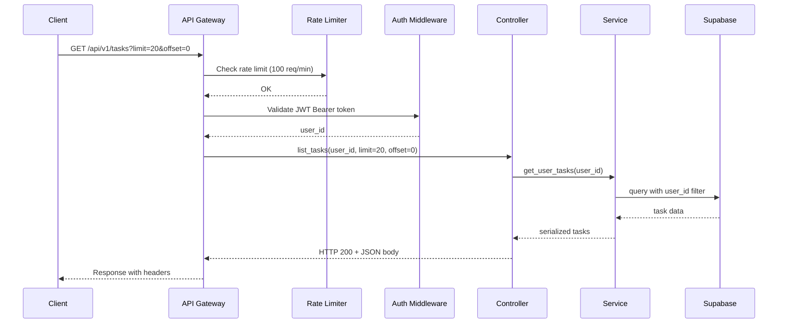

# REST API Conventions

## Document Control

| Field | Value |
|---|---|
| **Document ID** | ENG-RST-007 |
| **Version** | 1.0.0 |
| **Status** | Approved |
| **Date** | 2026-07-10 |
| **Classification** | Internal |
| **Owner** | Developer |

---

## 1. Executive Summary

Second Brain OS exposes a RESTful HTTP API under `/api/v1/` for all data operations. This document defines the REST conventions used across all 31+ routers: resource naming, HTTP method semantics, status code usage, pagination format, filtering/sorting conventions, response envelope format, and standardized error responses.

---

## 2. Purpose

Establish a consistent REST API contract across all modules so that frontend developers, API consumers, and AI agents can predict any endpoint's behavior from its URL pattern and HTTP method.

---

## 3. Scope

This document covers:
- Resource naming conventions (plural nouns, kebab-case)
- HTTP method usage (GET, POST, PUT, DELETE)
- Status code conventions (200, 201, 204, 400, 401, 403, 404, 409, 422, 429, 500)
- Pagination format (limit/offset)
- Filtering and sorting conventions
- Response envelope format
- Error response format with error codes
- Standard request/response headers

Out of scope: Controller implementation details (see [Controllers.md](Controllers.md)), rate limiting (see [RateLimiting.md](RateLimiting.md)), error code catalog (see [ErrorCodes.md](ErrorCodes.md)), versioning strategy (see [Versioning.md](Versioning.md)).

---

## 4. Business Context

All frontend pages, third-party integrations, and AI agents communicate with the backend through REST endpoints. Consistent conventions reduce cognitive load, simplify client-side code, and enable automatic API client generation from OpenAPI specs.

---

## 5. Functional Specification

### 5.1 Resource Naming

| Convention | Rule | Example |
|---|---|---|
| Plural nouns | Always use plural form | `/api/v1/tasks`, `/api/v1/courses` |
| Kebab-case | Hyphenate multi-word resources | `/api/v1/feature-flags`, `/api/v1/sleep-logs` |
| Sub-resources | Nest under parent with ID | `/api/v1/tasks/{id}/complete` |
| Actions | Use verbs for non-CRUD | `/api/v1/time/stop`, `/api/v1/chat` |
| Version prefix | Always `/api/v{1,2,...}/` | `/api/v1/tasks` |

### 5.2 HTTP Method Semantics

| Method | Semantics | Idempotent | Safe | Status Code |
|---|---|---|---|---|
| `GET` | Retrieve resource(s) | ✅ | ✅ | 200 |
| `POST` | Create resource or trigger action | ❌ | ❌ | 201 (create), 200 (action) |
| `PUT` | Full or partial update | ✅ | ❌ | 200 |
| `DELETE` | Remove resource | ✅ | ❌ | 204 (no body) |

### 5.3 Status Code Conventions

| Code | Meaning | When |
|---|---|---|
| 200 | Success | GET, PUT, POST (action) |
| 201 | Created | POST (create resource) |
| 204 | No Content | DELETE |
| 400 | Bad Request | Invalid input, business rule violation |
| 401 | Unauthorized | Missing or invalid auth token |
| 403 | Forbidden | Valid token, insufficient permissions |
| 404 | Not Found | Resource does not exist |
| 409 | Conflict | Duplicate resource, state conflict |
| 422 | Unprocessable Entity | Pydantic validation failure |
| 429 | Too Many Requests | Rate limit exceeded |
| 500 | Internal Server Error | Unhandled server error |

---

## 6. Non-Functional Requirements

| Requirement | Target | Measurement |
|---|---|---|
| API response time p95 | < 500ms | Request ID logging |
| Error response time | < 100ms | Error handler timing |
| Pagination overhead | < 10ms | Range query timing |
| Response size (list) | < 100KB | Response body size |

---

## 7. Architecture

### 7.1 API Request-Response Lifecycle



### 7.2 Pagination Format

```http
GET /api/v1/tasks?limit=20&offset=0 HTTP/1.1
```

```json
{
  "data": [ ... ],
  "pagination": {
    "limit": 20,
    "offset": 0,
    "total": 142,
    "next_offset": 20,
    "prev_offset": null
  }
}
```

| Parameter | Type | Default | Max | Description |
|---|---|---|---|---|
| `limit` | integer | 20 | 100 | Items per page |
| `offset` | integer | 0 | — | Number of items to skip |

### 7.3 Filtering and Sorting

**Filtering by field:**
```
GET /api/v1/tasks?status=pending&priority=high
GET /api/v1/courses?platform=udemy&status=active
```

**Sorting:**
```
GET /api/v1/tasks?sort=due_date&order=asc
GET /api/v1/tasks?sort=created_at&order=desc
```

| Parameter | Type | Default | Description |
|---|---|---|---|
| `sort` | string | `created_at` | Field to sort by |
| `order` | enum | `desc` | `asc` or `desc` |

---

## 8. Diagrams

### 8.1 Response Envelope Format

```json
// Standard success response (list)
{
  "data": [ ... ],
  "pagination": {
    "limit": 20,
    "offset": 0,
    "total": 142,
    "next_offset": 20,
    "prev_offset": null
  }
}

// Standard success response (single)
{
  "data": { ... }
}

// Standard error response
{
  "detail": "Human-readable error message",
  "error_code": "TASK_NOT_FOUND",
  "field_errors": [
    {
      "field": "title",
      "message": "String should have at least 1 character",
      "code": "string_min_length"
    }
  ],
  "request_id": "uuid-string",
  "timestamp": "2026-07-10T12:00:00Z"
}
```

### 8.2 Standard Response Headers

| Header | Description | Example |
|---|---|---|
| `Content-Type` | Response format | `application/json` |
| `X-Request-ID` | Request tracing ID | `req_abc123` |
| `X-RateLimit-Limit` | Rate limit quota | `100` |
| `X-RateLimit-Remaining` | Remaining requests | `87` |
| `X-RateLimit-Reset` | Reset timestamp (Unix) | `1720600000` |
| `Deprecation` | API version deprecation | `true` |
| `Sunset` | Deprecation date | `Sat, 01 Jan 2027 00:00:00 GMT` |

---

## 9. Data Models

| Type | Description |
|---|---|
| `PaginatedResponse[T]` | List response with pagination metadata |
| `SingleResponse[T]` | Single resource response |
| `ErrorResponse` | Standardized error envelope |
| `DeleteResponse` | 204 No Content (empty body) |

---

## 10. APIs

### 10.1 Endpoint Pattern Reference

| Pattern | Example | Status Code |
|---|---|---|
| `GET /{resources}` | `GET /api/v1/tasks` | 200 |
| `POST /{resources}` | `POST /api/v1/tasks` | 201 |
| `GET /{resources}/{id}` | `GET /api/v1/tasks/abc` | 200 |
| `PUT /{resources}/{id}` | `PUT /api/v1/tasks/abc` | 200 |
| `DELETE /{resources}/{id}` | `DELETE /api/v1/tasks/abc` | 204 |
| `POST /{resources}/{id}/{action}` | `POST /api/v1/tasks/abc/complete` | 200 |

---

## 11. Security

| Concern | Implementation |
|---|---|
| Authentication | `Authorization: Bearer <token>` header required |
| Authorization | All queries scoped by `user_id` |
| Data exposure | `response_model` filters response fields |
| Rate limiting | `X-RateLimit-*` headers inform clients |
| CORS | Whitelist origins only |

---

## 12. Performance Targets

| Metric | Target |
|---|---|
| List response (20 items) | < 200ms |
| Detail response | < 100ms |
| Create response | < 300ms |
| Update response | < 200ms |
| Delete response | < 200ms |

---

## 13. Edge Cases

| Edge Case | Handling |
|---|---|
| Empty result set | Return `{ "data": [], "pagination": { "total": 0 } }` |
| Negative offset | Clamp to 0 |
| Limit > max | Clamp to 100 |
| Invalid sort field | Default to `created_at` |
| Unknown filter field | Ignore (no error) |
| POST without body | 422 from Pydantic |

---

## 14. Failure Scenarios

| Scenario | HTTP Status | Response |
|---|---|---|
| Missing auth token | 401 | `{ "detail": "Not authenticated", "error_code": "AUTH_TOKEN_MISSING" }` |
| Resource not found | 404 | `{ "detail": "Task not found", "error_code": "TASK_NOT_FOUND" }` |
| Validation failure | 422 | `{ "detail": "Validation error", "field_errors": [...] }` |
| Rate limit exceeded | 429 | `{ "detail": "Rate limit exceeded", "error_code": "RATE_LIMIT_EXCEEDED" }` |

---

## 15. Risks & Mitigations

| Risk | Likelihood | Impact | Mitigation |
|---|---|---|---|
| Inconsistent status codes | Medium | Medium | Code review; CI enforces status codes |
| Pagination not implemented | Low | High | Template code includes pagination |
| Response envelope drift | Low | Low | Pydantic `response_model` enforces shape |

---

## 16. Acceptance Criteria

- [ ] All list endpoints support `limit` and `offset` pagination
- [ ] All endpoints return `X-Request-ID` header
- [ ] All error responses follow the standard envelope format
- [ ] All list endpoints wrap results in `{ "data": [...] }`
- [ ] POST create returns 201; POST action returns 200
- [ ] DELETE returns 204 with no body

---

## 17. Traceability

| Requirement ID | Source | Implementation |
|---|---|---|
| RST-01 | ADR-001 (API versioning) | `/api/v1/` prefix |
| RST-02 | ARCH-005 (RESTful design) | Plural nouns, HTTP method semantics |

---

## 18. Implementation Notes

1. Use `response_model` for automatic response serialization
2. Wrap list results in `{ "data": [...] }` envelope
3. Use `status_code` parameter for non-default status codes
4. Always include `X-Request-ID` in responses
5. Pagination params: `limit` (1-100) and `offset` (0+)

---

## 19. Testing Strategy

| Test Type | Coverage | Tools |
|---|---|---|
| Status code tests | Every endpoint returns correct status | pytest + TestClient |
| Pagination tests | limit/offset work correctly | Parametrized test |
| Error format tests | All errors match envelope | JSON schema validation |
| Header tests | X-Request-ID, X-RateLimit-* present | pytest |

---

## 20. References

| Reference | Document |
|---|---|
| Controller Layer | [Controllers.md](Controllers.md) |
| Error Codes | [ErrorCodes.md](ErrorCodes.md) |
| Rate Limiting | [RateLimiting.md](RateLimiting.md) |
| API Versioning | [Versioning.md](Versioning.md) |

---

## Revision History

| Version | Date | Author | Changes |
|---|---|---|---|
| 1.0.0 | 2026-07-10 | Developer | Initial REST conventions documentation |
