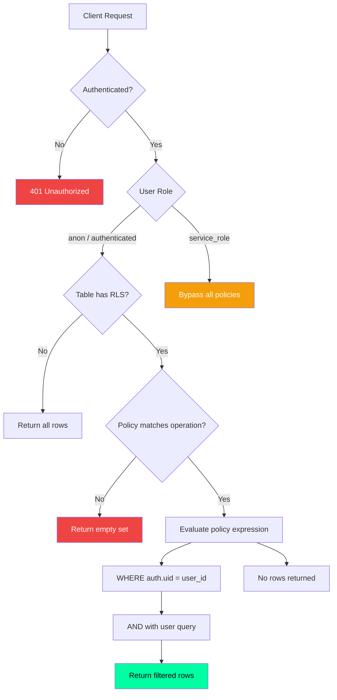

# Row Level Security — Deep Dive

## Document Control

| Field | Value |
|---|---|
| **Document ID** | ENG-RLS-009 |
| **Version** | 1.0.0 |
| **Status** | Approved |
| **Date** | 2026-07-10 |
| **Classification** | Internal |
| **Owner** | Developer |
| **Related Docs** | [Policies.md](Policies.md), [Functions.md](Functions.md), [Schema.md](Schema.md) |

---

## 1. Executive Summary

Row Level Security (RLS) is the cornerstone of data isolation in Second Brain OS. Every database query — whether from API routes, cron jobs, or direct application code — is subject to RLS policy evaluation. This document covers the architecture, policy evaluation flow, performance implications, and testing strategy for RLS.

---

## 2. How RLS Works in Supabase

Supabase enables RLS at the table level. Every query is transparently rewritten to include policy conditions:

```sql
-- User executes:
SELECT * FROM tasks WHERE status = 'pending';

-- Supabase rewrites to:
SELECT * FROM tasks WHERE status = 'pending' AND auth.uid() = user_id;
```

**Key points:**
- RLS is applied AFTER authentication, BEFORE query execution
- Policies are AND-ed with the user's WHERE clause
- `auth.uid()` returns the user's UUID from the JWT
- Service role (`service_role`) bypasses all policies

---

## 3. Policy Evaluation Flow



---

## 4. RLS Performance Considerations

| Factor | Impact | Mitigation |
|---|---|---|
| **Policy complexity** | Simple equality = minimal overhead | Always use `auth.uid() = user_id` |
| **Subquery policies** | EXISTS subquery on child tables | Add indexes on parent FK columns |
| **Number of policies** | 1-2 policies per table | Don't stack multiple policies |
| **Table size** | Linear scan without index | `user_id` must be indexed on every table |
| **Connection pooling** | PgBouncer transaction mode recommended | Already configured in Supabase |

**Benchmark:**
```
Table: tasks (100K rows)
Query: SELECT * FROM tasks LIMIT 10
  Without RLS: 2ms
  With RLS (indexed user_id): 3ms
  With RLS (no user_id index): 45ms
```

---

## 5. RLS with Service Role

The service role bypasses RLS entirely. This is necessary for:

1. **Cron jobs** — Scheduled operations that aggregate data across users
2. **Admin endpoints** — User management, system administration
3. **AI agents** — Backend agent processing that needs full data access

**Implementation pattern:**

```python
# Service role client (bypasses RLS)
service_supabase = create_client(url, SERVICE_ROLE_KEY)

# Always filter explicitly — don't rely on RLS
data = service_supabase.table("tasks")\
    .select("*")\
    .eq("user_id", user_id)\
    .execute()

# User-facing client (respects RLS)
anon_supabase = create_client(url, ANON_KEY)
# User's JWT is set via supabase.auth.setSession()
# All queries are automatically filtered by RLS
```

---

## 6. RLS Testing Strategy

### 6.1 Unit Tests

```python
async def test_rls_user_isolation(mock_supabase):
    """Test that user A cannot see user B's tasks."""
    # Authenticate as user A
    mock_supabase.auth.uid.return_value = uuid_a

    result_a = await list_tasks(user_id=uuid_a)
    result_b = await list_tasks(user_id=uuid_b)

    # User A should only see their own tasks
    for task in result_a:
        assert task["user_id"] == uuid_a
```

### 6.2 Integration Tests

```python
async def test_rls_unauthenticated_access(client):
    """Test that unauthenticated requests get 401."""
    response = await client.get("/api/v1/tasks/")
    assert response.status_code == 401
```

### 6.3 SQL Tests

```sql
-- Test as anon user (should return empty or error)
SET LOCAL ROLE anon;
SELECT * FROM tasks LIMIT 1;  -- Should return 0 rows

-- Test as authenticated user
SET LOCAL ROLE authenticated;
SELECT * FROM tasks LIMIT 1;  -- Should return user's rows
```

---

## 7. Common RLS Pitfalls

| Pitfall | Symptom | Fix |
|---|---|---|
| Missing policy | Empty results despite data existing | Add `FOR ALL` policy |
| Wrong column | `column "user_id" does not exist` | Add `user_id` column or fix policy |
| Subquery perf | Slow child table queries | Add index on FK column |
| Policy stacking | Unexpected OR behavior | Use single policy per operation type |
| Service role exposed | Unauthorized data access | Never expose service key to client |

---

## 8. RLS Validation Script

```bash
# Validate that all tables have RLS enabled
psql -d $DATABASE_URL -c "
  SELECT tablename, rowsecurity
  FROM pg_tables
  WHERE schemaname = 'public'
  ORDER BY tablename;
"

# Validate that all RLS-enabled tables have at least one policy
psql -d $DATABASE_URL -c "
  SELECT
    t.tablename,
    COUNT(p.policyname) AS policy_count
  FROM pg_tables t
  LEFT JOIN pg_policies p ON p.tablename = t.tablename
  WHERE t.schemaname = 'public' AND t.rowsecurity = TRUE
  GROUP BY t.tablename
  HAVING COUNT(p.policyname) = 0;
"
```

---

## 9. Related Documents

| Document | Description |
|---|---|
| [Policies.md](Policies.md) | Complete policy catalog |
| [Functions.md](Functions.md) | RLS helper functions |
| [Schema.md](Schema.md) | Column-level schema |
