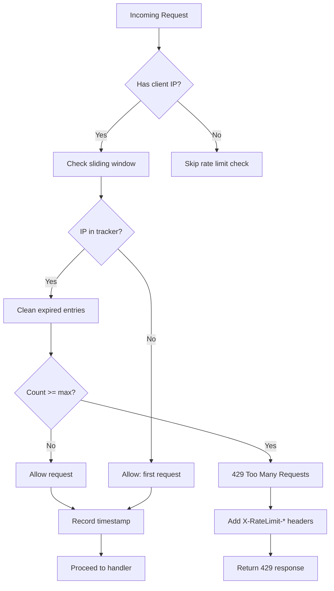

# Rate Limiting Strategy

## Document Control

| Field | Value |
|---|---|
| **Document ID** | ENG-RTL-010 |
| **Version** | 1.0.0 |
| **Status** | Approved |
| **Date** | 2026-07-10 |
| **Classification** | Internal |
| **Owner** | Developer |

---

## 1. Executive Summary

Second Brain OS implements rate limiting at multiple levels to protect backend resources, prevent abuse, and ensure fair usage across all API consumers. The primary mechanism is a sliding window in-memory rate limiter applied as FastAPI middleware, with per-endpoint overrides for expensive operations (AI chat, automation triggers). This document defines the rate limiting architecture, limit configurations, response headers, and bypass mechanisms for service-level access.

---

## 2. Purpose

Define a rate limiting strategy that protects the API from abuse and accidental overload while providing clear feedback to clients about their usage limits via standard headers.

---

## 3. Scope

This document covers:
- Current rate limiter implementation (sliding window, in-memory)
- Global rate limit (100 req/min per IP)
- Per-endpoint limits (chat: 30 req/min, AI: 10 req/min)
- Rate limit response headers (`X-RateLimit-*`)
- Rate limit exceeded response (429)
- Rate limit configuration via environment variables
- Rate limit bypass for service API keys
- Distributed rate limiting (future Redis migration)

Out of scope: Authentication (see [BackendArchitecture.md](BackendArchitecture.md)), error codes (see [ErrorCodes.md](ErrorCodes.md)).

---

## 4. Business Context

The API serves a single user currently, but rate limiting is essential for:
- Preventing runaway frontend loops from hammering endpoints
- Protecting AI endpoints (chat, briefing) from token budget exhaustion
- Defending against potential abuse if endpoints are exposed publicly
- Preparing for multi-user scaling

---

## 5. Functional Specification

### 5.1 Current Implementation

```python
# packages/shared/utils/rate_limiter.py
class RateLimiter(BaseHTTPMiddleware):
    """In-memory sliding window rate limiter."""

    def __init__(self, app, max_requests: int = 100, window_seconds: int = 60):
        super().__init__(app)
        self.max_requests = max_requests
        self.window_seconds = window_seconds
        self.requests: Dict[str, List[datetime]] = {}
        self._lock = asyncio.Lock()

    async def dispatch(self, request: Request, call_next):
        client_ip = request.client.host if request.client else "unknown"
        async with self._lock:
            now = datetime.utcnow()
            window_start = now - timedelta(seconds=self.window_seconds)
            if client_ip in self.requests:
                self.requests[client_ip] = [
                    t for t in self.requests[client_ip] if t > window_start
                ]
            else:
                self.requests[client_ip] = []
            if len(self.requests[client_ip]) >= self.max_requests:
                raise HTTPException(
                    status_code=429,
                    detail=f"Rate limit exceeded. Max {self.max_requests} req/{self.window_seconds}s",
                )
            self.requests[client_ip].append(now)
        return await call_next(request)
```

### 5.2 Rate Limit Configuration

| Limit | Scope | Window | Max Requests | Configured Via |
|---|---|---|---|---|
| Global | Per IP | 60s | 100 | `RATE_LIMIT_MAX` / `RATE_LIMIT_WINDOW` env vars |
| Chat | Per user | 60s | 30 | Hardcoded in chat router |
| AI endpoints | Per user | 60s | 10 | Hardcoded in automation router |
| Automation triggers | Per user | 300s (5 min) | 1 per endpoint | Per-endpoint limit |

---

## 6. Non-Functional Requirements

| Requirement | Target | Measurement |
|---|---|---|
| Rate limiter overhead | < 2ms per request | Middleware timing |
| Lock contention | < 1ms | Async lock wait time |
| Memory per active IP | ~1KB | IP request history |
| Maximum tracked IPs | 1000 | Configurable maxsize |
| Rate limit header accuracy | ±1 request | Counter precision |

---

## 7. Architecture

### 7.1 Rate Limiting Flow



### 7.2 Rate Limit Response Headers

Every response includes rate limit headers:

```http
HTTP/1.1 200 OK
X-RateLimit-Limit: 100
X-RateLimit-Remaining: 87
X-RateLimit-Reset: 1720600000
```

When rate limited:
```http
HTTP/1.1 429 Too Many Requests
X-RateLimit-Limit: 100
X-RateLimit-Remaining: 0
X-RateLimit-Reset: 1720600060
Retry-After: 42

{
  "detail": "Rate limit exceeded. Max 100 req/60s",
  "error_code": "RATE_LIMIT_EXCEEDED",
  "request_id": "req_abc123",
  "timestamp": "2026-07-10T12:00:00Z"
}
```

---

## 8. Diagrams

### 8.1 Per-Endpoint Limit Configuration

```python
# Per-endpoint rate limits (applied in route handlers)
ENDPOINT_LIMITS = {
    "/api/v1/chat":              {"max": 30, "window": 60},
    "/api/v1/automation/*":      {"max": 1,  "window": 300},
    "/api/v1/analytics":         {"max": 20, "window": 60},
    "/api/v1/predictions":       {"max": 10, "window": 60},
}
```

### 8.2 Service Key Bypass

```python
async def rate_limit_bypass(request: Request) -> bool:
    """Check if request carries a service API key that bypasses rate limiting."""
    api_key = request.headers.get("X-API-Key")
    if api_key and api_key == settings.service_api_key:
        return True
    return False
```

---

## 9. Data Models

| Type | Description |
|---|---|
| `RateLimitConfig` | `{ max_requests: int, window_seconds: int }` |
| `RateLimitState` | `{ client_ip: list[datetime] }` per limiter instance |

---

## 10. APIs

### 10.1 Rate Limit Configuration via Environment

| Variable | Default | Description |
|---|---|---|
| `RATE_LIMIT_MAX` | `100` | Max requests per window |
| `RATE_LIMIT_WINDOW` | `60` | Window in seconds |
| `SERVICE_API_KEY` | `None` | API key for bypass (optional) |

---

## 11. Security

| Concern | Implementation |
|---|---|
| IP spoofing | Use `request.client.host` (not `X-Forwarded-For` in dev) |
| Distributed attacks | Per-IP limits prevent single-source abuse |
| Service key exposure | Rotate keys; log usage |
| Rate limit bypass abuse | Audit log all bypassed requests |

---

## 12. Performance Targets

| Metric | Target |
|---|---|
| Rate limiter overhead per request | < 2ms |
| Sliding window cleanup | < 1ms per request |
| Memory per tracked IP | ~1KB |
| Lock wait time | < 1ms (async lock) |

---

## 13. Edge Cases

| Edge Case | Handling |
|---|---|
| Request without client IP | Skip rate limit (local dev) |
| Distributed denial of service | Per-IP limit limits blast radius |
| Burst of requests at window boundary | Sliding window allows natural bursts |
| Multiple services behind same IP | Per-IP limit may rate limit all services |
| Rate limit config change at runtime | Requires restart (env vars at startup) |

---

## 14. Failure Scenarios

| Scenario | Impact | Recovery |
|---|---|---|
| Rate limiter lock contention | Requests queued on async lock | Reduce lock scope; use atomic counter |
| Memory exhaustion from tracked IPs | OOM if thousands of IPs tracked | Implement maxsize eviction |
| Clock skew (distributed) | Window boundaries misaligned | Use monotonic clock |
| Rate limiter crash | Requests proceed unchecked | Fail-open (allow requests on error) |

---

## 15. Risks & Mitigations

| Risk | Likelihood | Impact | Mitigation |
|---|---|---|---|
| Single IP limit too restrictive for multi-service setup | Medium | Medium | Increase default limit; service key bypass |
| In-memory limiter lost on restart | Medium | Low | Acceptable for single-user; Redis for multi-user |
| Async lock contention under high load | Low | Medium | Switch to atomic operations (Redis, rate limiter library) |

---

## 16. Acceptance Criteria

- [ ] Global rate limit is applied as middleware to all endpoints
- [ ] Chat endpoint has stricter limit (30 req/min)
- [ ] Automation trigger endpoints have per-endpoint limits (1/5min)
- [ ] Rate limit headers present on all responses
- [ ] 429 response uses standard error envelope format
- [ ] Service API key bypass works and is logged
- [ ] Rate limit configuration is driven by environment variables

---

## 17. Traceability

| Requirement ID | Source | Implementation |
|---|---|---|
| RTL-01 | SEC-007 (Abuse prevention) | Sliding window rate limiter |
| RTL-02 | OBS-004 (Usage monitoring) | Rate limit headers |
| RTL-03 | PERF-003 (AI cost protection) | Stricter limits on AI endpoints |

---

## 18. Implementation Notes

1. Rate limiter is first in middleware stack (before CORS, before auth)
2. Per-endpoint limits implemented as decorator on specific route handlers
3. Service API key bypass uses `X-API-Key` header matching `SERVICE_API_KEY` env var
4. For distributed deployments, swap in-memory for Redis-based rate limiter
5. Rate limit headers are additive — middleware adds them to every response

---

## 19. Testing Strategy

| Test Type | Coverage | Tools |
|---|---|---|
| Rate limiter unit tests | Hit/miss, window expiry, cleanup | pytest |
| Middleware integration | Rate limit applied to all routes | TestClient |
| Header tests | `X-RateLimit-*` present on responses | pytest |
| Edge case tests | Boundary conditions, concurrent requests | pytest + asyncio |
| Bypass tests | Service key bypasses correctly | pytest |

---

## 20. References

| Reference | Document |
|---|---|
| REST API Conventions | [REST.md](REST.md) |
| Error Codes | [ErrorCodes.md](ErrorCodes.md) |
| Caching Strategy | [CachingStrategy.md](CachingStrategy.md) |

---

## Revision History

| Version | Date | Author | Changes |
|---|---|---|---|
| 1.0.0 | 2026-07-10 | Developer | Initial rate limiting documentation |
