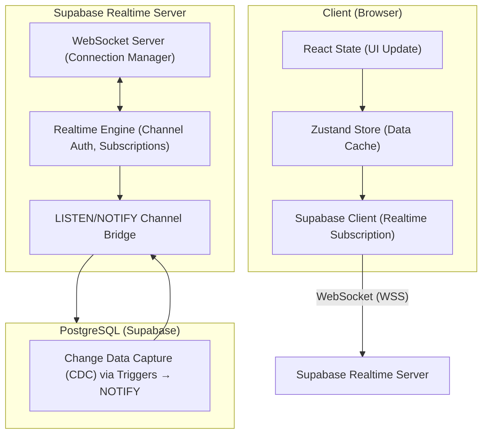
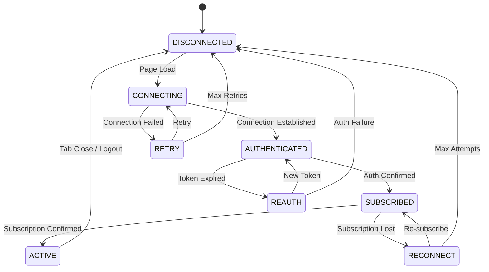
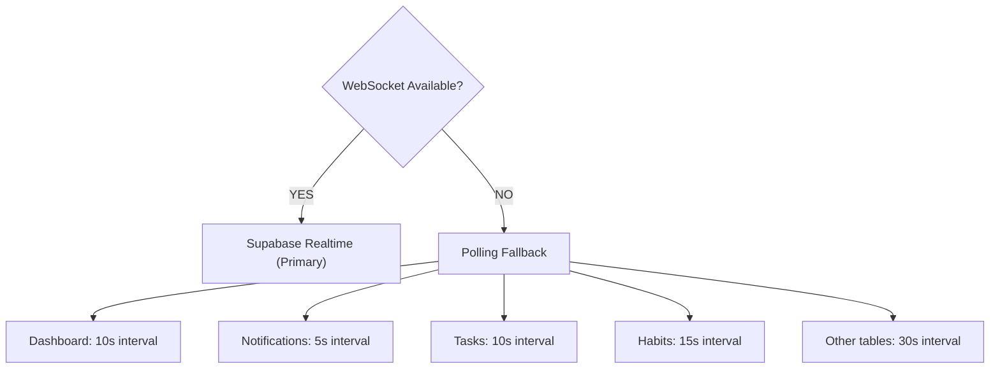

# Realtime Architecture

## Document Control

| Field | Value |
|---|---|
| **Document ID** | ENG-RT-001 |
| **Version** | 2.0.0 |
| **Status** | Approved |
| **Date** | 2026-07-10 |
| **Classification** | Internal |
| **Owner** | Developer |

---

## 1. Executive Summary

Second Brain OS uses **Supabase Realtime** (WebSocket-based, PostgreSQL-backed) for live UI updates across all modules. The realtime system delivers instant task status changes, habit completion updates, notification delivery, and dashboard aggregation pushes. This document defines the realtime data flow architecture, connection lifecycle, channel strategy, security model, fallback mechanisms, and performance considerations.

**Design principles:** Single source of truth (PostgreSQL changes propagate via Realtime), user isolation (every channel scoped to a single user), graceful degradation (WebSocket disconnection falls back to polling), and minimal latency (target < 200ms P99 broadcast-to-render).

---

## 2. Purpose

Define the realtime data flow architecture enabling responsive UI updates, instant notification delivery, and live dashboard aggregation using Supabase Realtime and WebSocket technology, with a polling fallback for connectivity issues.

---

## 3. Scope

This document covers:
- Supabase Realtime integration and configuration
- PostgreSQL LISTEN/NOTIFY change data capture
- Client-side subscription patterns for all 15 modules
- Connection lifecycle (connect, authenticate, subscribe, reconnect, disconnect)
- Channel naming conventions and allocation
- Security — RLS enforcement on Realtime channels
- Fallback strategy — polling with exponential backoff
- Performance — connection limits, message budgets, batching
- Monitoring and telemetry

Out of scope: REST API (see [REST.md](REST.md)), notification delivery (see notification docs).

---

## 4. Business Context

Second Brain OS serves a single user per session, with 15+ modules that benefit from live updates: task status changes should reflect immediately on the dashboard, habit completions should update streaks in real-time, notifications must arrive instantly, and the timer display needs second-by-second accuracy. Supabase Realtime provides WebSocket-based change data capture without additional infrastructure.

---

## 5. Functional Specification

### 5.1 Supported Tables for Realtime

| Table | Events | Filter | Purpose |
|---|---|---|---|
| `tasks` | INSERT, UPDATE, DELETE | `user_id` | Task CRUD sync |
| `habits` | INSERT, UPDATE, DELETE | `user_id` | Habit completion sync |
| `habit_logs` | INSERT | `user_id` | Streak live update |
| `goals` | UPDATE | `user_id` | Progress bar update |
| `courses` | INSERT, UPDATE | `user_id` | Course progress |
| `notifications` | INSERT, UPDATE | `user_id` | Instant notification delivery |
| `projects` | INSERT, UPDATE | `user_id` | Project board sync |
| `ideas` | INSERT, UPDATE | `user_id` | Idea board sync |
| `time_entries` | INSERT, UPDATE | `user_id` | Live timer tracking |
| `income` | INSERT, UPDATE | `user_id` | Dashboard balance update |
| `sleep_logs` | INSERT, UPDATE | `user_id` | Sleep tracker update |
| `resources` | INSERT, UPDATE | `user_id` | Resource list sync |
| `opportunities` | INSERT, UPDATE | `user_id` | Opportunity board sync |
| `dashboard_cache` | UPDATE | `user_id` | Aggregated dashboard data push |

### 5.2 Client-Side Subscription Pattern

```typescript
// lib/realtime.ts
export function subscribeToTable<T>(
  table: string,
  userId: string,
  onInsert: (record: T) => void,
  onUpdate: (record: T) => void,
  onDelete: (id: string) => void
) {
  return supabase
    .channel(`realtime:${table}:${userId}`)
    .on(
      'postgres_changes',
      {
        event: '*',
        schema: 'public',
        table,
        filter: `user_id=eq.${userId}`,
      },
      (payload) => {
        switch (payload.eventType) {
          case 'INSERT': onInsert(payload.new as T); break
          case 'UPDATE': onUpdate(payload.new as T); break
          case 'DELETE': onDelete(payload.old.id); break
        }
      }
    )
    .subscribe()
}
```

---

## 6. Non-Functional Requirements

| Requirement | Target | Measurement |
|---|---|---|
| Broadcast-to-render latency (P99) | < 200ms | Client telemetry |
| WebSocket connection success rate | > 99% | Client telemetry |
| Reconnection time (max) | < 30s | Exponential backoff timer |
| Fallback polling interval | 5-30s (per module) | Configurable |
| Max concurrent channels per client | 15 (one per module) | Channel registry |
| Message size limit | < 20KB (PostgreSQL NOTIFY limit) | Payload size check |

---

## 7. Architecture

### 7.1 Realtime Data Flow



### 7.2 Connection Lifecycle



---

## 8. Diagrams

### 8.1 Channel Strategy

| Channel Name | Events Source | Subscribers | Persistence |
|---|---|---|---|
| `realtime:tasks:{user_id}` | PostgreSQL trigger | 1 | RLS-filtered |
| `realtime:habits:{user_id}` | PostgreSQL trigger | 1 | RLS-filtered |
| `realtime:goals:{user_id}` | PostgreSQL trigger | 1 | RLS-filtered |
| `realtime:notifications:{user_id}` | Notification Service | 1 | RLS-filtered |
| `realtime:dashboard:{user_id}` | Backend-calculated | 1 | Ephemeral |

### 8.2 Fallback Hierarchy



---

## 9. Data Models

### 9.1 Realtime Trigger Template

```sql
CREATE OR REPLACE FUNCTION notify_realtime_change()
RETURNS TRIGGER AS $$
DECLARE
  payload TEXT;
BEGIN
  payload := json_build_object(
    'table', TG_TABLE_NAME,
    'schema', TG_TABLE_SCHEMA,
    'type', TG_OP,
    'record', CASE
      WHEN TG_OP = 'DELETE' THEN row_to_json(OLD)
      ELSE row_to_json(NEW)
    END,
    'old_record', CASE
      WHEN TG_OP = 'UPDATE' THEN row_to_json(OLD)
      ELSE NULL
    END
  )::TEXT;
  PERFORM pg_notify('realtime_changes', payload);
  RETURN NEW;
END;
$$ LANGUAGE plpgsql SECURITY DEFINER;
```

---

## 10. APIs

### 10.1 Realtime Health Endpoint

```typescript
// API route: /api/v1/realtime/health
export async function GET() {
  const { data, error } = await supabase.rpc('realtime_health_check')
  if (error) {
    return NextResponse.json({
      status: 'degraded', error: error.message,
      timestamp: new Date().toISOString(),
    }, { status: 503 })
  }
  return NextResponse.json({
    status: 'healthy',
    channels_active: data.channels_active,
    connections_total: data.connections_total,
    timestamp: new Date().toISOString(),
  })
}
```

---

## 11. Security

| Concern | Implementation |
|---|---|
| User isolation | Every channel filtered by `user_id` |
| RLS enforcement | Same policies apply to Realtime subscriptions |
| JWT authentication | Supabase client sends JWT on WebSocket connect |
| Publication control | Only required tables in `supabase_realtime` publication |
| No sensitive tables | Passwords, secrets excluded from publication |

---

## 12. Performance Targets

| Metric | Target |
|---|---|
| Broadcast-to-render latency (P99) | < 200ms |
| Connection establishment | < 1s |
| Reconnection (max) | < 30s |
| Average message size | < 2KB |
| Client-side throttle rate | 30fps (33ms) for high-frequency updates |
| Polling intervals | 5-30s depending on module |

---

## 13. Edge Cases

| Edge Case | Handling |
|---|---|
| WebSocket unavailable | Fall back to polling (see fallback hierarchy) |
| Token expires mid-session | Re-authenticate via `supabase.realtime.setAuth()` |
| Connection lost briefly | Exponential backoff reconnect (1s → 30s max) |
| High-frequency updates (dashboard) | Batch server-side, push single aggregate every 30s |
| Client tab in background | Reduce polling interval; pause non-critical subscriptions |
| Message exceeds NOTIFY limit (20KB) | Truncate large fields; batch oversized payloads |

---

## 14. Failure Scenarios

| Scenario | Impact | Recovery |
|---|---|---|
| WebSocket connection fails | Falls back to polling | Auto-reconnect when WebSocket available |
| Realtime server down | All channels fall back to polling | Reconnect attempt every 30s |
| RLS policy blocks subscription | No events received | Verify RLS policy covers Realtime |
| PostgreSQL trigger fails | No CDC events emitted | Check trigger function; fallback to polling |
| Client memory from many events | UI thrashing | Throttle to 30fps; batch updates |

---

## 15. Risks & Mitigations

| Risk | Likelihood | Impact | Mitigation |
|---|---|---|---|
| Realtime connection limit on Free tier (500) | Low (single user) | Low | Monitor connection count; upgrade to Pro if needed |
| Polling fallback increases DB load | Medium | Low | Longer intervals (10-30s) for non-critical modules |
| CDC trigger performance on high-write tables | Low | Medium | Batch aggregate pushes instead of per-row triggers |
| WebSocket reconnection storm | Low | Medium | Exponential backoff with jitter |

---

## 16. Acceptance Criteria

- [ ] All realtime-enabled tables have RLS policies using `auth.uid()`
- [ ] Client subscribes to relevant channels on page load
- [ ] Unsubscribe on page unmount to prevent stale listeners
- [ ] Polling fallback activates when WebSocket unavailable
- [ ] Reconnection uses exponential backoff (1s → 30s max)
- [ ] Telemetry captures connection success rate and broadcast latency
- [ ] Health endpoint returns channel and connection status

---

## 17. Traceability

| Requirement ID | Source | Implementation |
|---|---|---|
| RT-01 | UX-002 (Live updates) | Supabase Realtime subscriptions |
| RT-02 | SEC-002 (User isolation) | RLS on Realtime channels |
| RT-03 | REL-004 (Graceful degradation) | Polling fallback |
| RT-04 | OBS-003 (Observability) | Realtime telemetry + health endpoint |

---

## 18. Implementation Notes

1. Use `@supabase/supabase-js` for client-side subscriptions
2. Channel names follow `realtime:{module}:{user_id}` convention
3. Subscribe in `useEffect` with cleanup via `supabase.removeChannel()`
4. Dashboard aggregates pushed every 30s via `dashboard_cache` table
5. Polling fallback uses `gt('updated_at', lastFetch)` for incremental sync
6. On reconnection: flush accumulated polling changes, stop polling
7. Presence channels reserved for future multi-user features

---

## 19. Testing Strategy

| Test Type | Coverage | Tools |
|---|---|---|
| Subscription tests | Every table subscribes and receives events | Integration with Supabase local |
| Fallback tests | WebSocket disconnection → polling switch | Mock WebSocket close |
| Reconnection tests | Exponential backoff timing | Timer mocks |
| RLS isolation tests | User A cannot see User B's events | Integration test |
| Performance tests | Latency P50/P95/P99 under load | k6 or custom benchmark |

---

## 20. References

| Reference | Document |
|---|---|
| REST API Conventions | [REST.md](REST.md) |
| Caching Strategy | [CachingStrategy.md](CachingStrategy.md) |
| Security Architecture | [Security](../security/24_Security.md) |
| Supabase Realtime Docs | [supabase.com/docs/guides/realtime](https://supabase.com/docs/guides/realtime) |

---

## Revision History

| Version | Date | Author | Changes |
|---|---|---|---|
| 1.0.0 | 2026-06-11 | ARIA OS Engineering | Initial draft |
| 2.0.0 | 2026-07-10 | Developer | Added enterprise sections: NFRs, Performance Targets, Edge Cases, Failure Scenarios, Risks, Acceptance Criteria, Traceability, Testing Strategy, Implementation Notes, full 20-section template |
