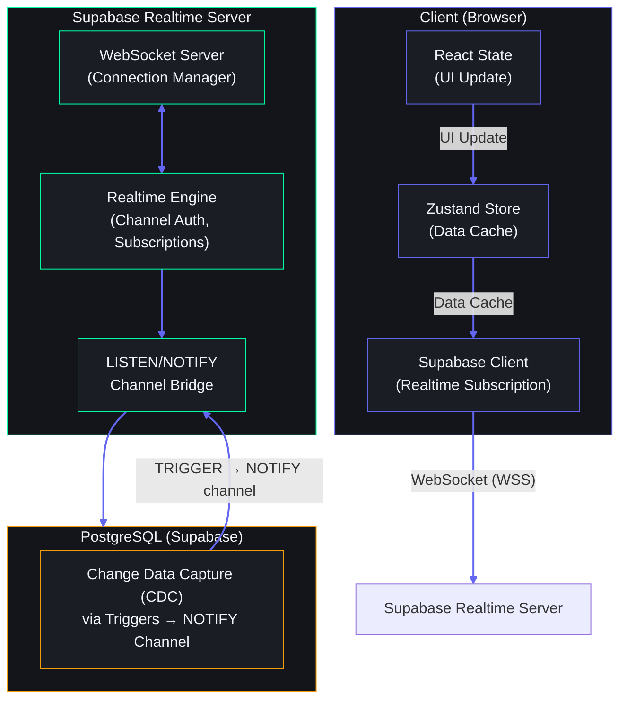
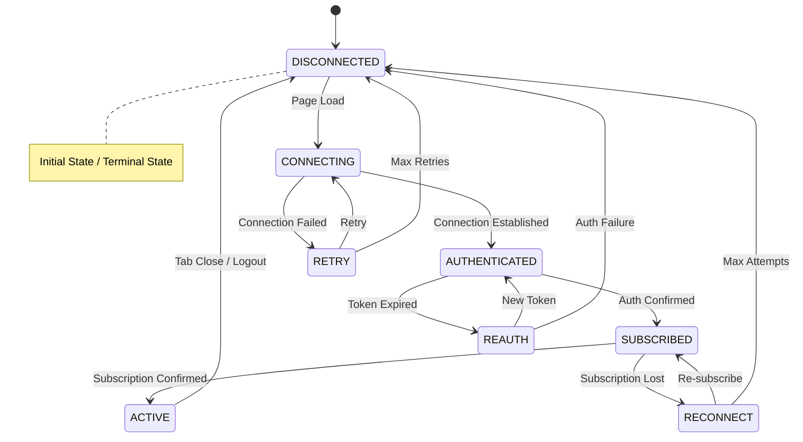
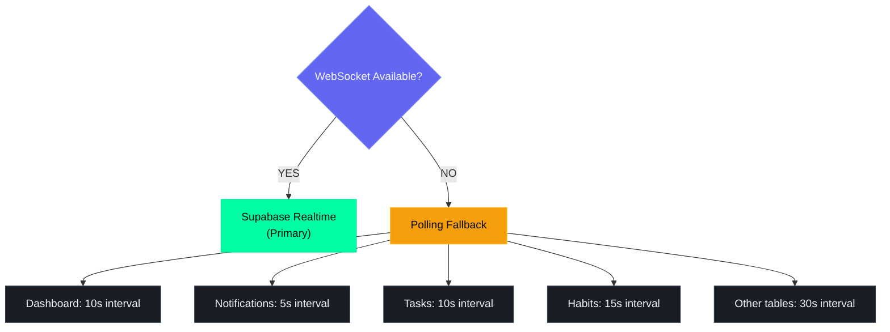

# Realtime Architecture

## Document Control

| Metadata | Value |
|---|---|
| **Document ID** | ENG-RT-001 |
| **Status** | Draft |
| **Version** | 1.0.0 |
| **Last Updated** | 2026-06-11 |
| **Author** | ARIA OS Engineering |
| **Approval** | Pending |
| **Related Docs** | ENG-NOTIF-001 (Notification System), ENG-SEARCH-001 (Search Architecture) |

---

## 1. Executive Summary

### 1.1 Purpose

Define the realtime data flow architecture for Second Brain OS, enabling responsive UI updates, collaborative awareness, and instant notification delivery using Supabase Realtime and WebSocket technology.

### 1.2 Scope

Covers all realtime data channels, connection lifecycle, security, fallback strategies, and performance considerations. Includes client-side subscription patterns for all 15 modules (tasks, habits, courses, goals, ideas, projects, resources, income, sleep logs, time entries, opportunities, chat, notifications, dashboard, settings).

### 1.3 Design Principles

- **Single Source of Truth**: Supabase PostgreSQL changes propagate to clients via Realtime — no dual-write or sync layer
- **User Isolation**: Every channel is scoped to a single user; no cross-user data leaks
- **Graceful Degradation**: WebSocket disconnection falls back to polling without data loss
- **Minimal Latency**: Target < 200ms P99 for broadcast-to-render

---

## 2. Realtime Requirements

### 2.1 Feature Requirements Matrix

| Feature | Update Frequency | Data Volume | Latency Target | Realtime Required |
|---|---|---|---|---|
| **Task Updates** | Moderate (10-20/hr) | Small | < 200ms | Yes — collaborative task editing |
| **Habit Completion** | High (10-50/day) | Small | < 500ms | Yes — instant streak updates |
| **Dashboard Stats** | Moderate | Medium | < 1s | Yes — live aggregation updates |
| **Notification Delivery** | Low-Moderate | Small | < 200ms | Yes — instant bell badge update |
| **Chat Messages** | Low (single user, future) | Small | < 100ms | Future — when multi-user chat added |
| **Goal Progress** | Low (few/update) | Small | < 1s | Yes — progress bar animation |
| **Ideas Board** | Low | Small | < 1s | Yes — instant board refresh |
| **Income/Expense** | Low | Small | < 1s | Optional — polling acceptable |
| **Course Progress** | Low | Small | < 2s | Optional — periodic refresh |
| **Time Entries** | Moderate (during study) | Small | < 500ms | Yes — live timer display |

### 2.2 Connectivity Assumptions

- Single user environment (alpha/beta)
- Standard consumer internet connection (WiFi, 4G/5G)
- Browser-based access (Chrome, Firefox, Edge — latest 2 versions)
- Occasional mobile usage (responsive PWA, future native)

---

## 3. Technology Options

### 3.1 Comparison

| Technology | Protocol | Persistence | Scalability | Complexity | Best For |
|---|---|---|---|---|---|
| **Supabase Realtime** | WebSocket (via PostgreSQL LISTEN/NOTIFY + WebSocket server) | Built-in (PostgreSQL) | Good (horizontal via replicas) | Low (managed) | **Primary choice** — aligns with existing Supabase stack |
| **Server-Sent Events (SSE)** | HTTP (EventSource) | None | Excellent | Very low | Unidirectional updates, simple push |
| **Raw WebSocket** | WebSocket (RFC 6455) | Custom | High | High | Bidirectional, custom protocols |
| **Polling** | HTTP GET | N/A | Poor (wasteful) | Trivial | Fallback only |

### 3.2 Decision

**Primary**: Supabase Realtime (WebSocket-based, PostgreSQL-backed)

**Rationale**:
- Existing Supabase integration — zero additional infrastructure
- RLS policies apply directly to Realtime subscriptions
- PostgreSQL LISTEN/NOTIFY provides reliable change data capture
- Client SDK (`@supabase/supabase-js`) handles reconnection, channel management
- No separate WebSocket server to deploy

**Fallback**: Polling with exponential backoff (when WebSocket unavailable)

---

## 4. Architecture

### 4.1 Data Flow



### 4.2 PostgreSQL LISTEN/NOTIFY Implementation

For tables requiring realtime updates, a dedicated trigger function broadcasts changes:

```sql
CREATE OR REPLACE FUNCTION notify_realtime_change()
RETURNS TRIGGER AS $$
DECLARE
  payload TEXT;
BEGIN
  payload := json_build_object(
    'table', TG_TABLE_NAME,
    'schema', TG_TABLE_SCHEMA,
    'type', TG_OP,
    'record', CASE
      WHEN TG_OP = 'DELETE' THEN row_to_json(OLD)
      ELSE row_to_json(NEW)
    END,
    'old_record', CASE
      WHEN TG_OP = 'UPDATE' THEN row_to_json(OLD)
      ELSE NULL
    END
  )::TEXT;

  PERFORM pg_notify('realtime_changes', payload);
  RETURN NEW;
END;
$$ LANGUAGE plpgsql SECURITY DEFINER;

-- Apply to tables
CREATE TRIGGER tasks_realtime_trigger
  AFTER INSERT OR UPDATE OR DELETE ON tasks
  FOR EACH ROW EXECUTE FUNCTION notify_realtime_change();
```

### 4.3 Client-Side Subscription Pattern

```typescript
// lib/realtime.ts
import { supabase } from '@/lib/supabase'

export function subscribeToTable<T>(
  table: string,
  userId: string,
  onInsert: (record: T) => void,
  onUpdate: (record: T) => void,
  onDelete: (id: string) => void
) {
  return supabase
    .channel(`realtime:${table}:${userId}`)
    .on(
      'postgres_changes',
      {
        event: '*',
        schema: 'public',
        table,
        filter: `user_id=eq.${userId}`,
      },
      (payload) => {
        switch (payload.eventType) {
          case 'INSERT':
            onInsert(payload.new as T)
            break
          case 'UPDATE':
            onUpdate(payload.new as T)
            break
          case 'DELETE':
            onDelete(payload.old.id)
            break
        }
      }
    )
    .subscribe()
}
```

### 4.4 Supported Tables for Realtime

| Table | Events | Filter | Purpose |
|---|---|---|---|
| `tasks` | INSERT, UPDATE, DELETE | `user_id` | Task CRUD sync |
| `habits` | INSERT, UPDATE, DELETE | `user_id` | Habit completion sync |
| `habit_logs` | INSERT | `user_id` | Streak live update |
| `goals` | UPDATE | `user_id` | Progress bar update |
| `courses` | INSERT, UPDATE | `user_id` | Course progress |
| `notifications` | INSERT, UPDATE | `user_id` | Instant notification delivery |
| `projects` | INSERT, UPDATE | `user_id` | Project board sync |
| `ideas` | INSERT, UPDATE | `user_id` | Idea board sync |
| `time_entries` | INSERT, UPDATE | `user_id` | Live timer tracking |
| `income` | INSERT, UPDATE | `user_id` | Dashboard balance update |
| `sleep_logs` | INSERT, UPDATE | `user_id` | Sleep tracker update |
| `resources` | INSERT, UPDATE | `user_id` | Resource list sync |
| `opportunities` | INSERT, UPDATE | `user_id` | Opportunity board sync |
| `dashboard_cache` | UPDATE | `user_id` | Aggregated dashboard data push |

---

## 5. Connection Lifecycle

### 5.1 Connection States



### 5.2 Lifecycle Events

| Event | Trigger | Action |
|---|---|---|
| **Connect** | Page load | Establish WebSocket to `wss://<project>.supabase.co/realtime/v1` |
| **Authenticate** | Connection established | Send JWT token for authentication |
| **Subscribe** | Auth confirmed | Subscribe to relevant channels (tables user has access to) |
| **Active** | Subscription confirmed | Start receiving realtime events |
| **Reconnect** | Connection lost | Exponential backoff reconnect (max 30s delay) |
| **Disconnect** | Tab close / logout | Unsubscribe all channels, close WebSocket |

### 5.3 Authentication

The Supabase client automatically sends the JWT access token when establishing the WebSocket connection. Realtime subscriptions respect the same RLS policies as REST queries:

```typescript
// No special auth needed — Supabase client handles it
const supabase = createClient(
  process.env.NEXT_PUBLIC_SUPABASE_URL!,
  process.env.NEXT_PUBLIC_SUPABASE_ANON_KEY!
)

// Subscriptions automatically use the current session's JWT
supabase.realtime.setAuth(accessToken)
```

### 5.4 Reconnection Strategy

```typescript
const channel = supabase
  .channel('tasks')
  .subscribe((status) => {
    switch (status) {
      case 'SUBSCRIBED':
        console.log('Connected to realtime channel')
        break
      case 'CHANNEL_ERROR':
        console.error('Channel error — will retry')
        break
      case 'TIMED_OUT':
        console.warn('Subscription timed out — falling back to polling')
        enablePollingFallback()
        break
      case 'CLOSED':
        console.log('Channel closed')
        break
    }
  })
```

| Attempt | Delay | Total Wait |
|---|---|---|
| 1 | 1s | 1s |
| 2 | 2s | 3s |
| 3 | 5s | 8s |
| 4 | 10s | 18s |
| 5 | 15s | 33s |
| 6+ | 30s | 30s (capped) |

---

## 6. Channel Strategy

### 6.1 Channel Naming Convention

```
realtime:{table}:{user_id}          -- Per-user per-table (primary)
realtime:notifications:{user_id}    -- Notification delivery (high priority)
realtime:dashboard:{user_id}        -- Dashboard aggregate updates
realtime:presence:{user_id}         -- User presence (single user, future multi)
```

### 6.2 Channel Allocation

| Channel Name | Events Source | Subscribers | Persistence |
|---|---|---|---|
| `realtime:tasks:{user_id}` | PostgreSQL trigger | 1 (single user) | RLS-filtered |
| `realtime:habits:{user_id}` | PostgreSQL trigger | 1 | RLS-filtered |
| `realtime:goals:{user_id}` | PostgreSQL trigger | 1 | RLS-filtered |
| `realtime:notifications:{user_id}` | Notification Service | 1 | RLS-filtered |
| `realtime:dashboard:{user_id}` | Backend-calculated | 1 | Ephemeral (computed) |
| `realtime:timer:{user_id}` | Frontend-emitted | 1 | Ephemeral |

### 6.3 Subscription Management

```typescript
// hooks/useRealtimeSubscription.ts
export function useRealtimeSubscription<T>(
  table: string,
  userId: string | undefined
) {
  const addItem = useStore((s) => s.addItem)
  const updateItem = useStore((s) => s.updateItem)
  const removeItem = useStore((s) => s.removeItem)

  useEffect(() => {
    if (!userId) return

    const channel = subscribeToTable<T>(
      table,
      userId,
      addItem,
      updateItem,
      removeItem
    )

    return () => {
      supabase.removeChannel(channel)
    }
  }, [table, userId])
}
```

### 6.4 Presence Channels (Future)

When multi-user features are added, presence channels will track online status:

```typescript
const presenceChannel = supabase.channel('room:1', {
  config: {
    presence: {
      key: userId,
    },
  },
})

presenceChannel
  .on('presence', { event: 'sync' }, () => {
    const state = presenceChannel.presenceState()
    console.log('Online users:', state)
  })
  .on('presence', { event: 'join' }, ({ key, newPresences }) => {
    console.log(`${key} joined`, newPresences)
  })
  .on('presence', { event: 'leave' }, ({ key, leftPresences }) => {
    console.log(`${key} left`, leftPresences)
  })
  .subscribe()
```

---

## 7. Realtime Security

### 7.1 RLS for Realtime

The same Row-Level Security policies that protect REST endpoints apply to Realtime subscriptions:

```sql
-- Enable Realtime on the table
ALTER PUBLICATION supabase_realtime ADD TABLE tasks;

-- RLS policy — users only see their own data
CREATE POLICY "Users can see own tasks"
  ON tasks FOR SELECT
  USING (auth.uid() = user_id);

-- Realtime subscribes to INSERT/UPDATE/DELETE — RLS filters the events
-- Supabase Realtime will NOT broadcast a change if the subscriber's
-- RLS policy filters out the row
```

### 7.2 User Isolation

```
User A connects:  supabase.channel('realtime:tasks:user_a')
User B connects:  supabase.channel('realtime:tasks:user_b')

User A's channel:  filter: user_id=eq.user_a  →  only User A's tasks
User B's channel:  filter: user_id=eq.user_b  →  only User B's tasks

No cross-user data leakage — Supabase enforces RLS at the WebSocket level
```

### 7.3 Security Checklist

- [ ] All realtime-enabled tables have RLS policies
- [ ] RLS policies use `auth.uid()` for user isolation
- [ ] Realtime publication only includes tables that need live updates
- [ ] `supabase_realtime` publication does NOT include sensitive tables (passwords, secrets)
- [ ] JWT expiry is checked at subscription time
- [ ] Subscription filters are server-enforced (not client-trustable)

---

## 8. Fallback Strategy

### 8.1 Polling Fallback

When WebSocket connection fails or times out:

```typescript
function createPollingFallback<T>(
  table: string,
  userId: string,
  interval: number = 5000
) {
  let timer: NodeJS.Timer
  let lastFetched: string

  return {
    start: () => {
      timer = setInterval(async () => {
        const { data } = await supabase
          .from(table)
          .select('*')
          .eq('user_id', userId)
          .gt('updated_at', lastFetched)
          .order('updated_at', { ascending: false })
          .limit(50)

        if (data?.length) {
          processUpdates(data)
          lastFetched = data[0].updated_at
        }
      }, interval)
    },
    stop: () => clearInterval(timer),
  }
}
```

### 8.2 Fallback Hierarchy



### 8.3 Detection & Recovery

```typescript
// Attempt WebSocket reconnect every 30 seconds
// On reconnection: flush accumulated polling changes, stop polling

supabase.realtime.on('connected', () => {
  stopPollingFallback()
  syncMissedChanges()  // fetch changes since last WebSocket activity
})
```

---

## 9. Performance

### 9.1 Connection Limits

| Resource | Limit | Notes |
|---|---|---|
| Supabase Realtime connections | 500 (Free tier) / 5000 (Pro) | Single user = 1 connection |
| Max channels per client | 200 | We use ~15 |
| Max subscriptions per channel | Unlimited | One table filter per channel |
| Max message size | 20KB | PostgreSQL NOTIFY payload limit |
| Max concurrent connections per IP | 100 | Supabase Realtime default |

### 9.2 Message Size Budget

Tables are designed to keep individual row sizes under 2KB to ensure fast Realtime transmission:

| Table | Avg Row Size | Max Row Size | Message Size |
|---|---|---|---|
| `tasks` | ~400 bytes | ~2KB | < 3KB (with JSON overhead) |
| `habits` | ~200 bytes | ~500 bytes | < 1KB |
| `habit_logs` | ~100 bytes | ~200 bytes | < 500 bytes |
| `notifications` | ~300 bytes | ~1KB | < 2KB |

### 9.3 Batching Strategy

For high-frequency updates (e.g., dashboard aggregates), batch changes server-side and push a single update:

```sql
-- Instead of 50 individual row notifications, compute aggregate
-- and push a single dashboard update every 30 seconds

CREATE OR REPLACE FUNCTION refresh_dashboard_cache(user_id UUID)
RETURNS VOID AS $$
BEGIN
  INSERT INTO dashboard_cache (user_id, data, updated_at)
  VALUES (
    user_id,
    jsonb_build_object(
      'tasks_completed', (SELECT COUNT(*) FROM tasks WHERE user_id = $1 AND status = 'completed' AND updated_at > NOW() - INTERVAL '24 hours'),
      'habit_streak', (SELECT MAX(streak) FROM habits WHERE user_id = $1),
      'active_timers', (SELECT COUNT(*) FROM time_entries WHERE user_id = $1 AND end_time IS NULL)
    ),
    NOW()
  )
  ON CONFLICT (user_id) DO UPDATE SET
    data = EXCLUDED.data,
    updated_at = NOW();
END;
$$ LANGUAGE plpgsql;
```

### 9.4 Client-Side Throttling

For UI components that receive high-frequency updates (e.g., progress bars, counters):

```typescript
// Throttle Zustand store updates to 30fps (33ms interval)
function useThrottledRealtime<T>(table: string, userId: string) {
  const throttledUpdate = useThrottle((data: T) => {
    store.setState(data)
  }, 33)

  useEffect(() => {
    const channel = supabase
      .channel(table)
      .on('postgres_changes', { event: '*', schema: 'public', table },
        (payload) => throttledUpdate(payload.new)
      )
      .subscribe()

    return () => supabase.removeChannel(channel)
  }, [table])
}
```

---

## 10. Monitoring

### 10.1 Metrics

| Metric | Source | Alert Threshold | Action |
|---|---|---|---|
| Realtime connection count | Supabase dashboard | > 80% of tier limit | Upgrade plan or optimize connections |
| Connection failure rate | Client telemetry | > 5% of connect attempts | Investigate network/CDN issues |
| Message delivery latency | Client measurement | P99 > 500ms | Check Realtime server health |
| Channel subscription failures | Client telemetry | > 2 in 5 minutes | Fall back to polling, alert ops |
| Reconnect success rate | Client telemetry | < 90% | Investigate connection handling |
| Average message size | Server-side logging | > 5KB | Review row sizes, consider batching |

### 10.2 Client-Side Telemetry

```typescript
// lib/realtime-telemetry.ts
export class RealtimeTelemetry {
  private latencies: number[] = []
  private failures: number = 0
  private connections: number = 0

  recordMessageLatency(sentAt: string, receivedAt: number) {
    const latency = receivedAt - new Date(sentAt).getTime()
    this.latencies.push(latency)
    if (this.latencies.length > 1000) this.latencies.shift()
  }

  recordConnectionStatus(status: string) {
    if (status === 'connected') this.connections++
    if (status === 'error') this.failures++
  }

  getMetrics() {
    return {
      p50_latency: percentile(this.latencies, 50),
      p95_latency: percentile(this.latencies, 95),
      p99_latency: percentile(this.latencies, 99),
      failure_rate: this.failures / this.connections,
      total_connections: this.connections,
    }
  }
}
```

### 10.3 Health Check Endpoint

```typescript
// API route: /api/realtime/health
export async function GET() {
  const supabase = createClient()
  const { data, error } = await supabase
    .rpc('realtime_health_check')

  if (error) {
    return NextResponse.json({
      status: 'degraded',
      error: error.message,
      timestamp: new Date().toISOString(),
    }, { status: 503 })
  }

  return NextResponse.json({
    status: 'healthy',
    channels_active: data.channels_active,
    connections_total: data.connections_total,
    timestamp: new Date().toISOString(),
  })
}
```

---

## 11. Future Considerations

### 11.1 Multi-User Scalability

**Current (Alpha):** 1 connection, ~15 channels, single user.

**Target (Production):** 1000+ concurrent connections across users.

| Scaling Dimension | Alpha Solution | Production Solution |
|---|---|---|
| **Connection limit** | Single user — always under 500 | Supabase Realtime add-ons or self-hosted Realtime |
| **Message volume** | ~100 msg/hour | Redis Pub/Sub to offload Realtime server |
| **Cross-user collaboration** | N/A | Shared channels with RLS for multi-user spaces |
| **Broadcast channels** | N/A | Room-based channels for shared projects |

### 11.2 Redis Pub/Sub Integration

For high-volume scenarios where PostgreSQL LISTEN/NOTIFY becomes a bottleneck:

```
PostgreSQL CDC → Redis Pub/Sub → Supabase Realtime → Client
```

Benefits: Decouples database write throughput from notification throughput. Redis handles higher message volumes (100K+/s) than PostgreSQL NOTIFY.

### 11.3 WebSocket Clustering

When deploying Supabase Realtime in a self-hosted multi-node configuration:

- Use sticky sessions or a shared Redis adapter for WebSocket state
- Each node handles a subset of connections
- Redis Pub/Sub broadcasts messages across nodes
- Horizontal scaling: add nodes as connection count grows

### 11.4 Potential Realtime Features

| Feature | Complexity | Value | Timeline |
|---|---|---|---|
| Presence indicators | Medium | High (multi-user excitement) | Post-alpha |
| Collaborative editing | High | Medium | Future |
| Live cursors | High | Low | Future |
| Real-time AI stream | Medium | High | Beta |
| Server-sent heartbeat | Low | Medium | Alpha improvement |
| Connection status indicator | Low | High | Alpha improvement |

---

## 12. Appendices

### 12.1 Channel Naming Convention Reference

```
Prefix:     realtime:
Scope:      {module}:{user_id}
Examples:
  realtime:tasks:550e8400-e29b-41d4-a716-446655440000
  realtime:habits:550e8400-e29b-41d4-a716-446655440000
  realtime:notifications:550e8400-e29b-41d4-a716-446655440000
  realtime:dashboard:550e8400-e29b-41d4-a716-446655440000
```

### 12.2 Trigger Template for Realtime

```sql
-- Apply to any table needing realtime:
-- CREATE TRIGGER {table}_realtime_trigger
--   AFTER INSERT OR UPDATE OR DELETE ON {table}
--   FOR EACH ROW EXECUTE FUNCTION notify_realtime_change();
```

### 12.3 Revision History

| Version | Date | Author | Changes |
|---|---|---|---|
| 1.0.0 | 2026-06-11 | ARIA OS Engineering | Initial draft |
