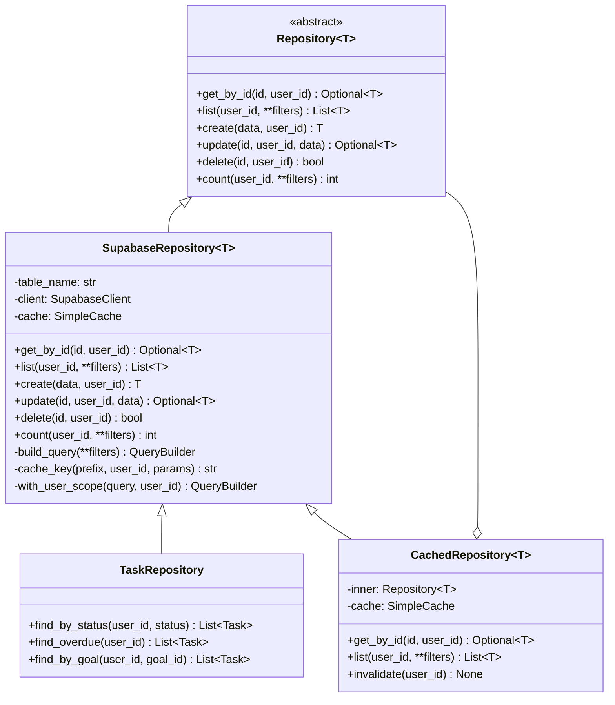
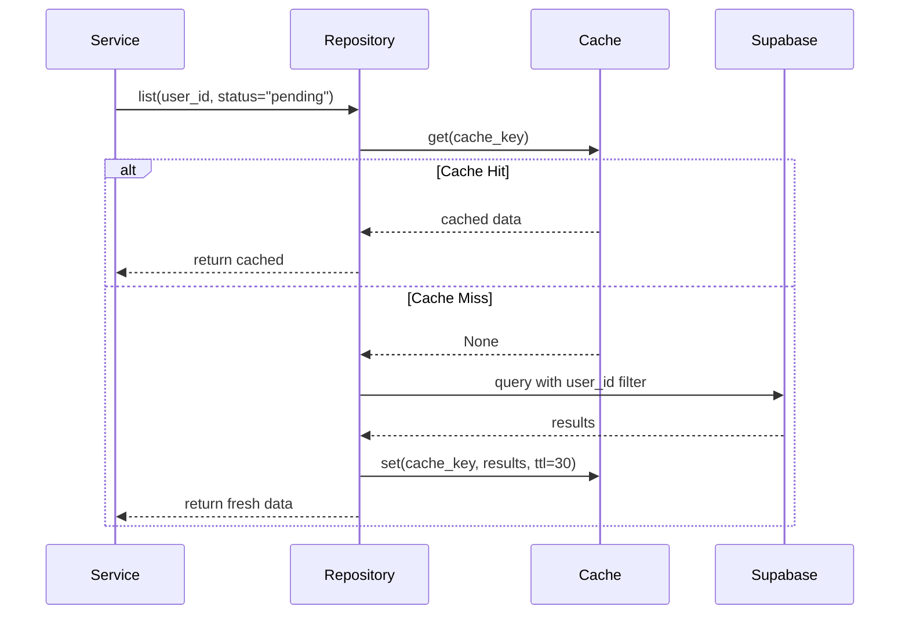

# Repository Layer Architecture

## Document Control

| Field | Value |
|---|---|
| **Document ID** | ENG-REP-002 |
| **Version** | 1.0.0 |
| **Status** | Approved |
| **Date** | 2026-07-10 |
| **Classification** | Internal |
| **Owner** | Developer |

---

## 1. Executive Summary

The repository layer abstracts all data access behind a consistent interface, isolating the service layer from the underlying Supabase PostgreSQL database. It implements the **Repository pattern** with typed query methods, pagination, filtering, caching integration, and mock-friendly interfaces for testing. This document defines the repository architecture, standard CRUD interface, query building conventions, transaction handling, and caching strategy across all 18+ database tables.

---

## 2. Purpose

Define a consistent, testable data access layer that decouples business logic from database technology, enables cache-aside integration, and provides predictable query semantics across all modules.

---

## 3. Scope

This document covers:
- Repository pattern implementation with Supabase Python SDK
- Standard CRUD interface for all entities
- Pagination (limit/offset), filtering, and sorting patterns
- Transaction management and batch operations
- Caching layer integration (cache-aside)
- Repository testing with mocked Supabase
- Naming conventions and code organization

Out of scope: Business logic (see [BusinessLogic.md](BusinessLogic.md)), controller routing (see [Controllers.md](Controllers.md)), caching strategy details (see [CachingStrategy.md](CachingStrategy.md)).

---

## 4. Business Context

Second Brain OS uses Supabase (PostgreSQL 15) with Row-Level Security for data isolation. All 18+ tables share the same access pattern: filtered by `user_id`, with standard CRUD operations. A consistent repository layer eliminates duplicate query code, enforces correct user_id scoping, and simplifies migration to alternative database backends in the future.

---

## 5. Functional Specification

### 5.1 Repository Interface

```python
from abc import ABC, abstractmethod
from typing import Generic, TypeVar, Optional
from dataclasses import dataclass

T = TypeVar("T")

class Repository(ABC, Generic[T]):
    @abstractmethod
    async def get_by_id(self, id: str, user_id: str) -> Optional[T]: ...

    @abstractmethod
    async def list(self, user_id: str, **filters) -> list[T]: ...

    @abstractmethod
    async def create(self, data: dict, user_id: str) -> T: ...

    @abstractmethod
    async def update(self, id: str, user_id: str, data: dict) -> Optional[T]: ...

    @abstractmethod
    async def delete(self, id: str, user_id: str) -> bool: ...

    @abstractmethod
    async def count(self, user_id: str, **filters) -> int: ...
```

### 5.2 Repository Responsibilities

| Responsibility | Description |
|---|---|
| Query building | Construct Supabase query chains safely |
| User scoping | Always append `.eq("user_id", user_id)` |
| Pagination | Apply `.range(offset, offset + limit - 1)` |
| Caching | Check/set cache via cache-aside pattern |
| Error translation | Convert Supabase errors to domain exceptions |
| Type mapping | Map raw dicts to Pydantic response models |

---

## 6. Non-Functional Requirements

| Requirement | Target | Measurement |
|---|---|---|
| Repository query overhead | < 5ms | Timing decorator |
| Cache hit rate at repo layer | > 70% | Cache metrics |
| Repository method unit test coverage | 100% | pytest + mocks |
| Maximum query execution time | < 200ms p95 | Supabase dashboard |
| Connection pool utilization | < 80% | Pool stats |

---

## 7. Architecture

### 7.1 Repository Class Diagram



### 7.2 Cache-Aside Read Flow



---

## 8. Diagrams

### 8.1 Repository Implementation

```python
# apps/api/app/repositories/base.py
from typing import Optional, Any
from supabase import Client
from packages.shared.utils.cache import SimpleCache

class SupabaseRepository(Generic[T]):
    def __init__(
        self,
        table_name: str,
        client: Client,
        cache: Optional[SimpleCache] = None,
    ):
        self._table = table_name
        self._client = client
        self._cache = cache

    def _with_user_scope(self, query, user_id: str):
        return query.eq("user_id", user_id)

    async def list(
        self,
        user_id: str,
        limit: int = 20,
        offset: int = 0,
        order_by: str = "created_at",
        order_dir: str = "desc",
        **filters,
    ) -> list[dict]:
        query = self._client.from_(self._table).select("*")
        query = self._with_user_scope(query, user_id)
        for key, value in filters.items():
            if value is not None:
                query = query.eq(key, value)
        query = query.order(order_by, desc=(order_dir == "desc"))
        query = query.range(offset, offset + limit - 1)
        result = query.execute()
        return result.data or []

    async def create(self, data: dict, user_id: str) -> dict:
        data["user_id"] = user_id
        result = self._client.from_(self._table).insert(data).execute()
        return result.data[0] if result.data else None

    async def get_by_id(self, id: str, user_id: str) -> Optional[dict]:
        query = self._client.from_(self._table).select("*")
        query = query.eq("id", id)
        query = self._with_user_scope(query, user_id)
        result = query.execute()
        return result.data[0] if result.data else None

    async def update(self, id: str, user_id: str, data: dict) -> Optional[dict]:
        query = self._client.from_(self._table).update(data)
        query = query.eq("id", id)
        query = self._with_user_scope(query, user_id)
        result = query.execute()
        return result.data[0] if result.data else None

    async def delete(self, id: str, user_id: str) -> bool:
        query = self._client.from_(self._table).delete()
        query = query.eq("id", id)
        query = self._with_user_scope(query, user_id)
        result = query.execute()
        return len(result.data or []) > 0

    async def count(self, user_id: str, **filters) -> int:
        query = self._client.from_(self._table).select("*", count="exact")
        query = self._with_user_scope(query, user_id)
        for key, value in filters.items():
            if value is not None:
                query = query.eq(key, value)
        result = query.execute()
        return result.count or 0
```

---

## 9. Data Models

### 9.1 Repository Method Signatures

| Method | Parameters | Returns | Cache TTL |
|---|---|---|---|
| `get_by_id` | `id, user_id` | `dict \| None` | 30s |
| `list` | `user_id, limit, offset, order_by, order_dir, **filters` | `list[dict]` | 30s |
| `create` | `data, user_id` | `dict` | Invalidate |
| `update` | `id, user_id, data` | `dict \| None` | Invalidate |
| `delete` | `id, user_id` | `bool` | Invalidate |
| `count` | `user_id, **filters` | `int` | 60s |

### 9.2 Naming Conventions

| Convention | Example |
|---|---|
| Table name snake_case | `task_repository` |
| Class name PascalCase | `TaskRepository` |
| Method name snake_case | `find_by_status` |
| Custom query methods | `find_overdue`, `find_by_goal` |

---

## 10. APIs

### 10.1 Repository Variants per Module

| Module | Repository | Custom Methods |
|---|---|---|
| Tasks | `TaskRepository` | `find_by_status`, `find_overdue`, `find_by_goal` |
| Courses | `CourseRepository` | `find_by_platform`, `find_active` |
| Habits | `HabitRepository` | `find_due_today`, `find_with_streaks` |
| Goals | `GoalRepository` | `find_active`, `find_by_roadmap_type` |
| Sleep | `SleepRepository` | `find_by_date_range` |
| Time | `TimeRepository` | `find_active_timer` |

### 10.2 Caching Decorator

```python
def cached(ttl: int = 30):
    """Decorator for repository methods to enable cache-aside."""
    def decorator(func):
        @wraps(func)
        async def wrapper(self, *args, **kwargs):
            if not self._cache:
                return await func(self, *args, **kwargs)
            key = self._cache_key(func.__name__, args, kwargs)
            cached = self._cache.get(key)
            if cached:
                return cached
            result = await func(self, *args, **kwargs)
            self._cache.set(key, result, ttl=ttl)
            return result
        return wrapper
    return decorator
```

---

## 11. Security

| Concern | Implementation |
|---|---|
| User isolation | `_with_user_scope()` on every query |
| SQL injection | Supabase SDK uses parameterized queries |
| Data exposure | Repositories return only requested fields |
| Cache isolation | Cache keys include `user_id` prefix |

---

## 12. Performance Targets

| Metric | Target |
|---|---|
| Repository method overhead | < 5ms |
| Cache lookup time | < 2ms |
| Serialization (dict → model) | < 10ms |
| Batch insert (100 rows) | < 500ms |
| Query with pagination | < 100ms |

---

## 13. Edge Cases

| Edge Case | Handling |
|---|---|
| Empty result set | Return empty list, not None |
| Missing user_id | Repositories require explicit user_id parameter |
| Concurrent cache invalidation | TTL-based expiry prevents stale reads |
| Supabase connection failure | Raise `RepositoryError`; caller retries |
| Invalid table name | Error at repository construction time |
| Filter with None value | Skip None filters (no `.eq("field", None)`) |

---

## 14. Failure Scenarios

| Scenario | Impact | Recovery |
|---|---|---|
| Supabase timeout | Repository raises `TimeoutError` | Circuit breaker at service layer |
| Cache eviction | Cache miss — query hits database | Automatic re-cache |
| Repository misconfiguration | Service fails at startup | Health check detects missing repos |
| Concurrent write conflict | Last write wins (Supabase default) | Future: optimistic locking with retry |

---

## 15. Risks & Mitigations

| Risk | Likelihood | Impact | Mitigation |
|---|---|---|---|
| Repository bypass (direct Supabase in controllers) | Medium | High | Code review enforces repository usage |
| Cache invalidation misses | Medium | Medium | TTL-based expiry as safety net |
| N+1 queries through repository | Low | Medium | Repository methods return complete data |
| Table schema drift | Medium | High | CI checks schema against repository models |

---

## 16. Acceptance Criteria

- [ ] Every table has a corresponding repository class
- [ ] All repository methods accept `user_id` parameter
- [ ] All queries filter by `user_id` internally
- [ ] Repositories are mockable (inherit from abstract base)
- [ ] Cache invalidation runs on every CUD operation
- [ ] Pagination is applied to all list queries
- [ ] Repository classes are registered in dependency injection

---

## 17. Traceability

| Requirement ID | Source | Implementation |
|---|---|---|
| REP-01 | ARCH-002 (Data abstraction) | Repository pattern wraps Supabase SDK |
| REP-02 | SEC-002 (User isolation) | `_with_user_scope()` on all queries |
| REP-03 | PERF-001 (Caching) | Cache-aside via `cached` decorator |
| REP-04 | TEST-002 (Mockability) | Abstract `Repository[T]` base class |

---

## 18. Implementation Notes

1. Repositories should never import service or controller modules
2. Use `SupabaseRepository` as the base for all entity-specific repositories
3. Cache keys follow `{namespace}:{table}:{user_id}:{method}:{params_hash}` format
4. Batch operations use `supabase.table().upsert()` or `supabase.table().insert(batch)`
5. Repository instances are created once and registered in the DI container
6. Always use `.execute()` at the end of query chains — never pass unexecuted queries

---

## 19. Testing Strategy

| Test Type | Coverage | Tools |
|---|---|---|
| Unit tests | 100% of repository methods | `pytest` + `unittest.mock` |
| Cache integration | Cache hit/miss/invalidate flows | Mock `SimpleCache` |
| Query building | Verify correct filter/pagination chains | Mock `SupabaseClient` |
| Error handling | Supabase error → `RepositoryError` | Mock error responses |

### Repository Test Example

```python
@pytest.mark.asyncio
async def test_repository_list_applies_user_filter():
    mock_client = AsyncMock(spec=SupabaseClient)
    repo = TaskRepository(table_name="tasks", client=mock_client)

    mock_client.from_.return_value.select.return_value \
        .eq.return_value.execute.return_value.data = [{"id": "1", "user_id": "u1"}]

    result = await repo.list(user_id="u1")

    mock_client.from_.assert_called_with("tasks")
    mock_client.from_().select().eq.assert_any_call("user_id", "u1")
    assert len(result) == 1

@pytest.mark.asyncio
async def test_repository_create_injects_user_id():
    mock_client = AsyncMock(spec=SupabaseClient)
    repo = TaskRepository(table_name="tasks", client=mock_client)

    await repo.create({"title": "Test"}, user_id="u1")

    insert_call = mock_client.from_.return_value.insert
    insert_call.assert_called_once()
    inserted_data = insert_call.call_args[0][0]
    assert inserted_data["user_id"] == "u1"
```

---

## 20. References

| Reference | Document |
|---|---|
| Caching Strategy | [CachingStrategy.md](CachingStrategy.md) |
| Controller Layer | [Controllers.md](Controllers.md) |
| Business Logic Layer | [BusinessLogic.md](BusinessLogic.md) |
| Validation Architecture | [Validation.md](Validation.md) |
| Database Schema (Supabase) | [Database Schema](../architecture/database-erd.md) |

---

## Revision History

| Version | Date | Author | Changes |
|---|---|---|---|
| 1.0.0 | 2026-07-10 | Developer | Initial repository layer architecture documentation |
