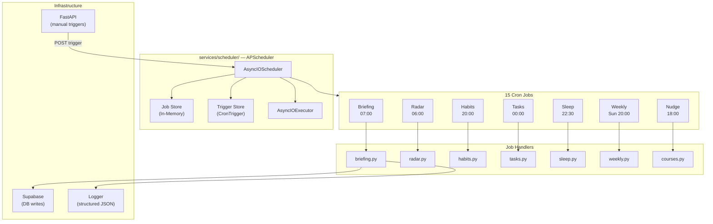
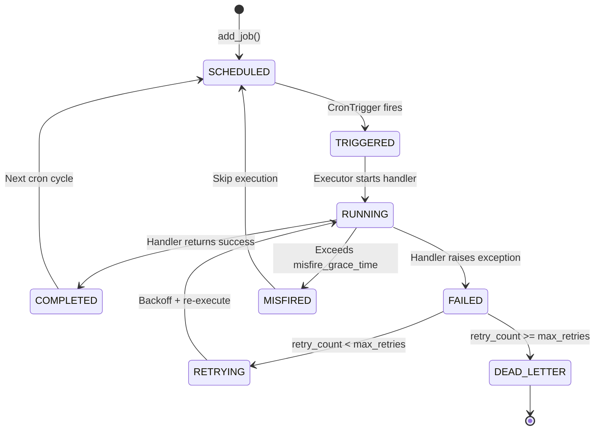

# Schedulers Architecture

## Document Control

| Field | Value |
|---|---|
| **Document ID** | ENG-SCH-005 |
| **Version** | 1.0.0 |
| **Status** | Approved |
| **Date** | 2026-07-10 |
| **Classification** | Internal |
| **Owner** | Developer |

---

## 1. Executive Summary

Second Brain OS uses APScheduler's `AsyncIOScheduler` to run 15 cron jobs that deliver proactive automation — daily briefings, opportunity radar scans, habit reminders, task reconciliation, sleep analysis, weekly reviews, course nudges, skill refresh, deadline alerts, memory consolidation, and more. The scheduler runs as a separate service (`services/scheduler/main.py`) with in-memory job storage. This document defines the scheduler architecture, job lifecycle, error handling, retry policies, monitoring, and the migration path to distributed scheduling.

---

## 2. Purpose

Define a reliable, observable scheduler architecture that ensures all 15 cron jobs execute on schedule, fail gracefully with retry policies, and provide sufficient monitoring for operational awareness.

---

## 3. Scope

This document covers:
- APScheduler integration and configuration (`AsyncIOScheduler`)
- All 15 cron job definitions with triggers, timeouts, retry policies
- Job lifecycle (register, trigger, execute, complete, fail)
- Error handling and retry with exponential backoff
- Dead letter queue for exhausted retries
- Job logging and metrics collection
- Scheduler deployment patterns (single process, distributed future)
- Manual trigger endpoints for on-demand execution

Out of scope: Background worker queue (see [QueueArchitecture.md](QueueArchitecture.md)), individual job handler implementation (see [CronJobs.md](CronJobs.md)), services layer (see [Services.md](Services.md)).

---

## 4. Business Context

The scheduler provides the proactive intelligence layer of Second Brain OS. Without it, users would miss deadlines, forget habits, skip sleep tracking, and lose opportunities. The 15 jobs cover the full daily cycle from morning briefing (7 AM) to sleep analysis (10:30 PM) plus periodic skill assessment refreshes and memory consolidation.

---

## 5. Functional Specification

### 5.1 Scheduler Configuration

```python
# services/scheduler/main.py
from apscheduler.schedulers.asyncio import AsyncIOScheduler
from apscheduler.triggers.cron import CronTrigger

scheduler = AsyncIOScheduler(timezone="Asia/Kolkata")

def setup_cron_jobs():
    scheduler.add_job(
        run_daily_briefing,
        CronTrigger(hour=7, minute=0),
        id="morning_briefing",
        max_instances=1,
        coalesce=True,
        misfire_grace_time=300,
    )
    # ... 6 more jobs
```

### 5.2 Cron Job Inventory

| Job ID | Name | Schedule (IST) | Handler | Avg Duration | Priority |
|---|---|---|---|---|---|
| `morning_briefing` | Daily Briefing | 07:00 daily | `briefing.generate_briefing` | ~45s | High |
| `radar_scan` | Opportunity Radar | 06:00 daily | `radar.scan_opportunity_radar` | ~120s | High |
| `habits_check` | Habits Reminder | 20:00 daily | `habits.check_habits_completion` | ~15s | Medium |
| `missed_tasks` | Missed Tasks Review | 00:00 daily | `tasks.review_missed_tasks` | ~30s | Medium |
| `sleep_analysis` | Sleep Log Prompt | 22:30 daily | `sleep.prompt_sleep_log` | ~10s | Low |
| `weekly_review` | Weekly Review | Sun 20:00 | `weekly.generate_weekly_review` | ~180s | Medium |
| `course_nudge` | Course Progress Nudge | 18:00 daily | `courses.send_course_nudge` | ~15s | Low |

### 5.3 24-Hour Schedule Timeline

```mermaid
gantt
    title Cron Job Schedule — 24-Hour Timeline (IST)
    dateFormat HH:mm
    axisFormat %H:%M

    section High Priority
    Opportunity Radar     :crit, radar_scan, 06:00, 2m
    Daily Briefing        :crit, morning_briefing, 07:00, 1m

    section Medium Priority
    Course Nudge          :course_nudge, 18:00, 1m
    Habits Reminder       :habits_check, 20:00, 1m
    Weekly Review (Sun)   :weekly_review, 20:00, 3m

    section Low Priority
    Missed Tasks          :missed_tasks, 00:00, 1m
    Sleep Log Prompt      :sleep_analysis, 22:30, 1m
```



---

## 6. Non-Functional Requirements

| Requirement | Target | Measurement |
|---|---|---|
| Job execution on schedule | ±60s of cron time | Log timestamps |
| Job timeout enforcement | Handler must complete within timeout | APScheduler max_instances |
| Retry execution | 2 retries, backoff 30-60s | Retry counter in logs |
| Dead letter capture | All exhausted retries logged to DLQ table | DLQ row count |
| Scheduler uptime | > 99.9% (process monitor) | Health check polling |
| Job execution audit | Every run logged with duration | Structured log entries |

---

## 7. Architecture

### 7.1 Scheduler Architecture



### 7.2 Job Lifecycle



---

## 8. Diagrams

### 8.1 Job Handler Pattern

```python
# services/scheduler/handlers/briefing.py
import asyncio
from datetime import datetime
from packages.shared.utils.logger import logger

async def generate_briefing(manual_trigger: bool = False, user_id: str = None):
    start = datetime.utcnow()
    job_id = "morning_briefing"
    logger.info("Job started", job_id=job_id, manual=manual_trigger)

    try:
        if manual_trigger and user_id:
            users = [{"id": user_id}]  # Single user
        else:
            users = await fetch_all_users()

        for user in users:
            await generate_user_briefing(user["id"])

        duration = (datetime.utcnow() - start).total_seconds()
        logger.info("Job completed", job_id=job_id, duration_ms=int(duration * 1000))
    except Exception as e:
        duration = (datetime.utcnow() - start).total_seconds()
        logger.error("Job failed", job_id=job_id, error=str(e), duration_ms=int(duration * 1000))
        raise  # Let APScheduler handle retry
```

### 8.2 Retry Policy Configuration

```python
RETRY_POLICY = {
    "morning_briefing":  {"max_retries": 2, "backoff_seconds": 30, "dead_letter": True},
    "radar_scan":        {"max_retries": 2, "backoff_seconds": 60, "dead_letter": True},
    "habits_check":      {"max_retries": 1, "backoff_seconds": 15, "dead_letter": False},
    "missed_tasks":      {"max_retries": 2, "backoff_seconds": 30, "dead_letter": True},
    "sleep_analysis":    {"max_retries": 1, "backoff_seconds": 10, "dead_letter": False},
    "weekly_review":     {"max_retries": 2, "backoff_seconds": 60, "dead_letter": True},
    "course_nudge":      {"max_retries": 1, "backoff_seconds": 15, "dead_letter": False},
}
```

---

## 9. Data Models

### 9.1 Dead Letter Queue Schema

```sql
CREATE TABLE job_dead_letter (
    id            UUID PRIMARY KEY DEFAULT gen_random_uuid(),
    job_id        TEXT NOT NULL,
    handler       TEXT NOT NULL,
    payload       JSONB,
    error         TEXT NOT NULL,
    attempts      INTEGER NOT NULL,
    last_attempt  TIMESTAMPTZ NOT NULL,
    created_at    TIMESTAMPTZ DEFAULT NOW()
);
```

---

## 10. APIs

### 10.1 Manual Trigger Endpoints

| Method | Endpoint | Job | Rate Limit |
|---|---|---|---|
| `POST` | `/api/v1/automation/trigger/briefing` | `morning_briefing` | 1/5min |
| `POST` | `/api/v1/automation/trigger/radar` | `radar_scan` | 1/5min |
| `POST` | `/api/v1/automation/trigger/habits` | `habits_check` | 1/5min |
| `POST` | `/api/v1/automation/trigger/missed-tasks` | `missed_tasks` | 1/5min |
| `POST` | `/api/v1/automation/trigger/sleep-prompt` | `sleep_analysis` | 1/5min |
| `POST` | `/api/v1/automation/trigger/weekly-review` | `weekly_review` | 1/5min |
| `POST` | `/api/v1/automation/trigger/nudge` | `course_nudge` | 1/5min |

---

## 11. Security

| Concern | Implementation |
|---|---|
| Job execution isolation | Each job runs in its own asyncio task |
| Manual trigger auth | All trigger endpoints require `Depends(get_current_user)` |
| Rate limiting on triggers | 1 trigger per 5 minutes per endpoint |
| Dead letter access | Admin-only view via `/admin/jobs/dead-letter` |

---

## 12. Performance Targets

| Metric | Target |
|---|---|
| Job registration time | < 50ms |
| Cron trigger evaluation | < 1ms per check |
| Handler dispatch overhead | < 10ms |
| Job execution (AI jobs) | < 180s (3 min) |
| Job execution (non-AI) | < 30s |
| Scheduler memory usage | < 50MB |

---

## 13. Edge Cases

| Edge Case | Handling |
|---|---|
| Missed schedule (process down) | `misfire_grace_time` allows late execution |
| Job takes longer than interval | `max_instances=1` prevents overlap |
| Scheduler restarts | In-memory jobs lost; re-registered on startup |
| Timezone changes | `timezone="Asia/Kolkata"` is fixed |
| Daylight saving time | APScheduler handles DST transitions |
| Manual trigger during cron run | `coalesce=True` skips duplicate execution |

---

## 14. Failure Scenarios

| Scenario | Impact | Recovery |
|---|---|---|
| Handler raises exception | Retry up to max_retries | DLQ if exhausted |
| AI provider unavailable | Job completes without AI content | Partial briefing with rule-based content |
| Supabase connection failure | Job fails with DB error | Retry with backoff |
| Scheduler process crash | All jobs missed | Process monitor auto-restarts |
| Misconfigured cron expression | Job never triggers | Logs alert on missed schedule |

---

## 15. Risks & Mitigations

| Risk | Likelihood | Impact | Mitigation |
|---|---|---|---|
| Single process scheduler | High | Critical | Migrate to distributed scheduling (Phase 2) |
| In-memory job store | High | Medium | Redis job store for persistence |
| Job handler bugs affect all users | Medium | High | Test handlers with mock data first |
| Manual trigger abuse | Low | Medium | Rate limit on trigger endpoints |

---

## 16. Acceptance Criteria

- [ ] All 15 cron jobs register and trigger on schedule
- [ ] Every job has a `max_instances=1` and `coalesce=True`
- [ ] Every job has a defined `misfire_grace_time`
- [ ] Retry policy exists for every job (min 1 retry)
- [ ] Manual trigger endpoints exist for all jobs
- [ ] Job execution is logged with duration, status, and error (if any)
- [ ] Dead letter queue captures exhausted retries
- [ ] Scheduler health endpoint returns job statuses

---

## 17. Traceability

| Requirement ID | Source | Implementation |
|---|---|---|
| SCH-01 | CRON-001 (Briefing) | `morning_briefing` at 07:00 |
| SCH-02 | CRON-002 (Radar) | `radar_scan` at 06:00 |
| SCH-03 | CRON-003 (Habits) | `habits_check` at 20:00 |
| SCH-04 | CRON-004 (Tasks) | `missed_tasks` at 00:00 |
| SCH-05 | CRON-005 (Sleep) | `sleep_analysis` at 22:30 |
| SCH-06 | CRON-006 (Weekly) | `weekly_review` Sun 20:00 |
| SCH-07 | CRON-007 (Nudge) | `course_nudge` at 18:00 |

---

## 18. Implementation Notes

1. Scheduler runs as a separate Railway service (`services/scheduler/`)
2. Jobs are registered in `setup_cron_jobs()` called at module import
3. Handler functions are idempotent — running twice produces the same result
4. All handlers use structured logging (not `print()`)
5. Manual triggers receive a `manual_trigger=True` and `user_id` parameter
6. Dead letter queue uses the `job_dead_letter` Supabase table

---

## 19. Testing Strategy

| Test Type | Coverage | Tools |
|---|---|---|
| Job registration tests | All 15 jobs register correctly | pytest + APScheduler test utils |
| Handler unit tests | Each handler with mock data | pytest + mocks |
| Lifecycle tests | Schedule → trigger → execute → complete → fail | pytest with AsyncIOScheduler |
| Retry tests | Handler failure triggers retry policy | Mock handler to fail |
| Manual trigger tests | Trigger endpoints work correctly | TestClient + mocked scheduler |

---

## 20. References

| Reference | Document |
|---|---|
| Cron Jobs Detail | [CronJobs.md](CronJobs.md) |
| Background Workers | [BackgroundWorkers.md](BackgroundWorkers.md) |
| Queue Architecture | [QueueArchitecture.md](QueueArchitecture.md) |
| Services Layer | [Services.md](Services.md) |
| Automation API | [Controllers.md](Controllers.md) |

---

## Revision History

| Version | Date | Author | Changes |
|---|---|---|---|
| 1.0.0 | 2026-07-10 | Developer | Initial scheduler architecture documentation |
