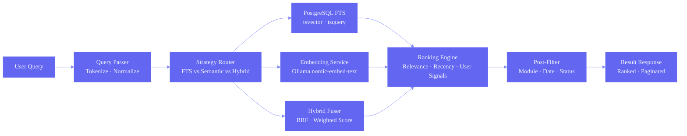
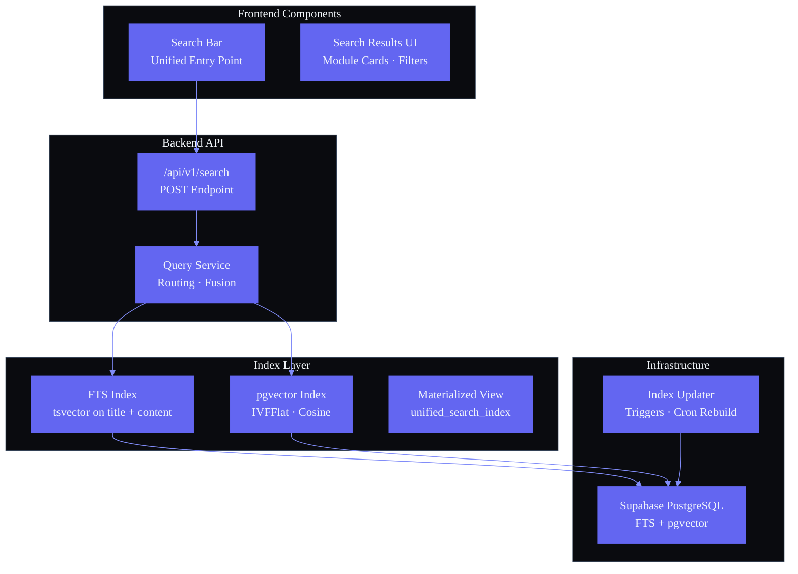

# Search Architecture

## Document Control

| Metadata | Value |
|---|---|
| **Document ID** | ENG-SEARCH-001 |
| **Status** | Draft |
| **Version** | 1.0.0 |
| **Last Updated** | 2026-06-11 |
| **Author** | ARIA OS Engineering |
| **Approval** | Pending |
| **Related Docs** | ENG-ARCH-004 (Microservices), ENG-RT-001 (Realtime Architecture) |

---

### Architecture Diagram — Search Query Pipeline



### Architecture Diagram — Search System Components



---

## 1. Executive Summary

### 1.1 Purpose

Define the search architecture for Second Brain OS, enabling unified full-text and semantic search across all user content (tasks, habits, courses, goals, ideas, projects, resources, opportunities, notes, and chat history).

### 1.2 Scope

Covers indexing strategy, query pipeline, ranking algorithm, search UI, and the incremental evolution from basic PostgreSQL full-text search to AI-powered semantic search.

### 1.3 Current State

Second Brain OS has **no search functionality**. Users must manually navigate modules to find content:

- Tasks: browsed by status/due-date filters
- Habits: viewed in daily/weekly grids
- Courses: listed with basic filtering
- Ideas: displayed in a board view
- Resources: listed with category filters
- Projects: viewed individually or in list

There is no cross-module search, no full-text search within modules, and no semantic/vector search.

### 1.4 Design Principles

- **Incremental Improvement**: Start with PostgreSQL full-text search (zero additional infrastructure), evolve to pgvector (semantic), then to dedicated search engine if needed
- **Single Source of Truth**: Search index is built from PostgreSQL; no dual-write complexity
- **Relevance-First**: Ranking prioritizes relevance, recency, user-specific signals
- **Single-User Optimization**: Scale for < 50K documents, single user -- no need for distributed search

---

## 2. Search Requirements

### 2.1 Functional Requirements

| Requirement | Priority | Description |
|---|---|---|
| **Cross-module search** | P0 | Search across all modules from a single search bar |
| **Full-text search** | P0 | Match words in titles, descriptions, notes, content |
| **Fuzzy matching** | P1 | Typo-tolerant search ("procrast" matches "procrastination") |
| **Ranked results** | P0 | Most relevant results first |
| **Module filters** | P1 | Filter results by module type (tasks, habits, courses, etc.) |
| **Date filters** | P2 | Filter by creation date, due date, completion date |
| **Status filters** | P2 | Filter by status (completed, pending, in-progress) |
| **Priority boost** | P1 | High-priority items ranked higher |
| **Recency boost** | P1 | Recently updated items ranked higher |
| **Search suggestions** | P2 | Autocomplete as user types (debounced, 300ms) |
| **Keyboard shortcuts** | P0 | Cmd+K / Ctrl+K to open search; Esc to close; arrows to navigate |
| **Highlight matches** | P1 | Highlight matching terms in results |

### 2.2 Non-Functional Requirements

| Requirement | Target |
|---|---|
| **Query latency** | < 200ms P95 |
| **Index freshness** | < 5 seconds (near real-time) |
| **Search result count** | All matching results across all modules |
| **Document capacity** | < 50,000 documents (scale for single user) |
| **Uptime** | 99.9% (dependent on PostgreSQL availability) |
| **Index storage** | < 500 MB (additional for pgvector embeddings) |

### 2.3 Document Types and Searchable Fields

| Module | Table | Searchable Fields | Estimated Documents |
|---|---|---|---|
| Tasks | `tasks` | title, description, notes, tags | < 5,000 |
| Habits | `habits` | title, description, notes | < 500 |
| Courses | `courses` | title, description, institution, notes | < 200 |
| Goals | `goals` | title, description, milestones | < 500 |
| Ideas | `ideas` | title, description, content | < 2,000 |
| Projects | `projects` | title, description, notes | < 500 |
| Resources | `resources` | title, url, description, notes | < 1,000 |
| Opportunities | `opportunities` | title, company, description, notes | < 500 |
| Income | `income` | description, category, notes | < 2,000 |
| Chat Messages | `chat_messages` | content | < 10,000 |
| Sleep Logs | `sleep_logs` | notes | < 1,000 |
| Time Entries | `time_entries` | description, tags | < 5,000 |

---

## 3. Solution Options

### 3.1 Comparison

| Solution | Full-Text | Semantic | Infrastructure | Complexity | Cost | Best For |
|---|---|---|---|---|---|---|
| **PostgreSQL Full-Text Search** (TSVECTOR) | Excellent | None | Zero (existing DB) | Low | Free | Alpha Phase |
| **Supabase Full-Text Search** | Good | None | Zero (managed) | Low | Free (Pro) | Same as above |
| **pgvector** (PostgreSQL extension) | Good | Good (via embeddings) | PostgreSQL + embedding model | Medium | Free (Pro) | Alpha/Beta - semantic search |
| **Meilisearch** | Excellent | Partial | Additional service | Medium | $29/mo (cloud) | Beta dedicated search |
| **Elasticsearch** | Best | Good (via ELSER) | Additional service | High | $$$ | Production scale |
| **Typesense** | Excellent | Partial | Additional service | Medium | $29/mo (cloud) | Meilisearch alternative |

### 3.2 Recommended Phased Approach

| Phase | Solution | Rationale |
|---|---|---|
| **Alpha (Current)** | PostgreSQL Full-Text Search (TSVECTOR) + Supabase FTS | Zero infrastructure; leverages existing PostgreSQL; sufficient for < 50K documents |
| **Beta** | Add pgvector for semantic search | AI-powered search with embeddings; still within PostgreSQL -- no new service |
| **Production** | Evaluate Meilisearch or Elasticsearch | If query volume exceeds 1000 QPS or hybrid search complexity increases |

---

## 4. Recommended Architecture (Alpha)

### 4.1 System Diagram

```
Client (Browser)
  SearchBar UI (Cmd+K modal)  -->  Result List (paginated)  -->  Filter/Sort Panel
                                        |
                              GET /api/search?q=...
                                        |
FastAPI Backend                         |
  Search Router (/api/search)           |
  Search Service (search.py)            |
  Query Pipeline (tokenize, rank, filter, paginate)
                                        |
PostgreSQL (Supabase)                   |
  search_documents (materialized view)  |
  Original Tables (tasks, habits, ...)  |
  pgvector embeddings (future)          |
```

### 4.2 Search Document Materialized View

```sql
CREATE MATERIALIZED VIEW search_documents AS
SELECT
  id::TEXT || '-task' AS search_id,
  id,
  'task' AS module,
  title,
  COALESCE(description, '') AS description,
  COALESCE(notes, '') AS notes,
  COALESCE(tags, ARRAY[]::TEXT[])::TEXT AS tags_text,
  user_id,
  created_at,
  updated_at,
  priority,
  status,
  due_date,
  'task'::TEXT AS doc_type,
  setweight(to_tsvector('english', COALESCE(title, '')), 'A') ||
  setweight(to_tsvector('english', COALESCE(array_to_string(tags, ' '), '')), 'B') ||
  setweight(to_tsvector('english', COALESCE(description, '')), 'C') ||
  setweight(to_tsvector('english', COALESCE(notes, '')), 'D') AS search_vector
FROM tasks

UNION ALL

SELECT
  id::TEXT || '-habit',
  id,
  'habit',
  title,
  COALESCE(description, ''),
  COALESCE(notes, ''),
  '' AS tags_text,
  user_id,
  created_at,
  updated_at,
  NULL::TEXT AS priority,
  'active' AS status,
  NULL::TIMESTAMPTZ AS due_date,
  'habit',
  setweight(to_tsvector('english', COALESCE(title, '')), 'A') ||
  setweight(to_tsvector('english', COALESCE(description, '')), 'C') ||
  setweight(to_tsvector('english', COALESCE(notes, '')), 'D')
FROM habits

UNION ALL

SELECT
  id::TEXT || '-course',
  id,
  'course',
  title,
  COALESCE(description, ''),
  COALESCE(notes, ''),
  COALESCE(institution, ''),
  user_id,
  created_at,
  updated_at,
  NULL::TEXT,
  status,
  NULL::TIMESTAMPTZ,
  'course',
  setweight(to_tsvector('english', COALESCE(title, '')), 'A') ||
  setweight(to_tsvector('english', COALESCE(description, '')), 'C') ||
  setweight(to_tsvector('english', COALESCE(notes, '')), 'D')
FROM courses

UNION ALL

SELECT
  id::TEXT || '-goal',
  id,
  'goal',
  title,
  COALESCE(description, ''),
  COALESCE(milestones::TEXT, ''),
  '' AS tags_text,
  user_id,
  created_at,
  updated_at,
  NULL::TEXT,
  status,
  NULL::TIMESTAMPTZ,
  'goal',
  setweight(to_tsvector('english', COALESCE(title, '')), 'A') ||
  setweight(to_tsvector('english', COALESCE(description, '')), 'C')
FROM goals

UNION ALL

SELECT
  id::TEXT || '-idea',
  id,
  'idea',
  title,
  COALESCE(description, ''),
  COALESCE(content, ''),
  '' AS tags_text,
  user_id,
  created_at,
  updated_at,
  NULL::TEXT,
  'active' AS status,
  NULL::TIMESTAMPTZ,
  'idea',
  setweight(to_tsvector('english', COALESCE(title, '')), 'A') ||
  setweight(to_tsvector('english', COALESCE(description, '')), 'C') ||
  setweight(to_tsvector('english', COALESCE(content, '')), 'D')
FROM ideas

UNION ALL

SELECT
  id::TEXT || '-project',
  id,
  'project',
  title,
  COALESCE(description, ''),
  COALESCE(notes, ''),
  '' AS tags_text,
  user_id,
  created_at,
  updated_at,
  NULL::TEXT,
  status,
  NULL::TIMESTAMPTZ,
  'project',
  setweight(to_tsvector('english', COALESCE(title, '')), 'A') ||
  setweight(to_tsvector('english', COALESCE(description, '')), 'C') ||
  setweight(to_tsvector('english', COALESCE(notes, '')), 'D')
FROM projects

UNION ALL

SELECT
  id::TEXT || '-resource',
  id,
  'resource',
  title,
  COALESCE(url, ''),
  COALESCE(description, '') || ' ' || COALESCE(notes, ''),
  '' AS tags_text,
  user_id,
  created_at,
  updated_at,
  NULL::TEXT,
  'active' AS status,
  NULL::TIMESTAMPTZ,
  'resource',
  setweight(to_tsvector('english', COALESCE(title, '')), 'A') ||
  setweight(to_tsvector('english', COALESCE(description, '')), 'C') ||
  setweight(to_tsvector('english', COALESCE(notes, '')), 'D')
FROM resources

UNION ALL

SELECT
  id::TEXT || '-opportunity',
  id,
  'opportunity',
  title,
  COALESCE(company, ''),
  COALESCE(description, '') || ' ' || COALESCE(notes, ''),
  '' AS tags_text,
  user_id,
  created_at,
  updated_at,
  NULL::TEXT,
  status,
  NULL::TIMESTAMPTZ,
  'opportunity',
  setweight(to_tsvector('english', COALESCE(title, '')), 'A') ||
  setweight(to_tsvector('english', COALESCE(company, '')), 'B') ||
  setweight(to_tsvector('english', COALESCE(description, '')), 'C') ||
  setweight(to_tsvector('english', COALESCE(notes, '')), 'D')
FROM opportunities

UNION ALL

SELECT
  id::TEXT || '-income',
  id,
  'income',
  COALESCE(category, 'Income'),
  COALESCE(description, ''),
  '' AS notes_text,
  '' AS tags_text,
  user_id,
  created_at,
  updated_at,
  NULL::TEXT,
  'active' AS status,
  NULL::TIMESTAMPTZ,
  'income',
  setweight(to_tsvector('english', COALESCE(description, '')), 'C') ||
  setweight(to_tsvector('english', COALESCE(category, '')), 'B')
FROM income

UNION ALL

SELECT
  id::TEXT || '-chat',
  id,
  'chat',
  LEFT(COALESCE(content, ''), 100) AS title,
  COALESCE(content, ''),
  '' AS notes_text,
  '' AS tags_text,
  user_id,
  created_at,
  updated_at,
  NULL::TEXT,
  'active' AS status,
  NULL::TIMESTAMPTZ,
  'chat',
  setweight(to_tsvector('english', COALESCE(content, '')), 'A')
FROM chat_messages
```

### 4.3 GIN Indexes

```sql
CREATE INDEX idx_search_documents_vector ON search_documents USING GIN(search_vector);
CREATE INDEX idx_search_documents_user ON search_documents(user_id);
CREATE INDEX idx_search_documents_module ON search_documents(module);
CREATE INDEX idx_search_documents_updated ON search_documents(updated_at DESC);
```

### 4.4 Refresh Strategy

```sql
-- Schedule: every 5 minutes via APScheduler
REFRESH MATERIALIZED VIEW CONCURRENTLY search_documents;

-- Trigger-based refresh (future enhancement):
CREATE OR REPLACE FUNCTION refresh_search_view()
RETURNS TRIGGER AS $$
BEGIN
  REFRESH MATERIALIZED VIEW CONCURRENTLY search_documents;
  RETURN NULL;
END;
$$ LANGUAGE plpgsql;
```

**Scheduler Job:** `services/scheduler/jobs/search_reindex.py` -- runs every 5 minutes via APScheduler.

---

## 5. Search Algorithm

### 5.1 Ranking Formula

```
score = (
    ts_rank(search_vector, query, 32) * 5.0 +    -- Relevance weight
    recency_score(updated_at) * 2.0 +             -- Recency weight
    priority_boost(priority) * 3.0 +              -- Priority weight
    module_boost(module) * 1.0                    -- Module weight
)
```

### 5.2 Scoring Components

| Factor | Weight | Calculation |
|---|---|---|
| **Relevance (ts_rank)** | 5.0 | PostgreSQL `ts_rank(search_vector, query, 32)` -- normalized 0-1 |
| **Recency** | 2.0 | `1.0 - (days_since_update / 365)` -- decays over 1 year |
| **Priority** | 3.0 | P0=1.0, P1=0.8, P2=0.5, P3=0.2, NULL=0 |
| **Module** | 1.0 | Tasks=1.0, Goals=0.9, Habits=0.8, Projects=0.8, Courses=0.7, Chat=0.7, Ideas=0.6, Resources=0.5, Opportunities=0.4, Income=0.3 |

### 5.3 Query Implementation

```python
from sqlalchemy import text

async def search_documents(
    user_id: str,
    query: str,
    module: Optional[str] = None,
    status: Optional[str] = None,
    limit: int = 20,
    offset: int = 0,
):
    sql = text("""
    SELECT
        search_id,
        id,
        module,
        title,
        description,
        ts_headline('english', title || ' ' || description,
            plainto_tsquery('english', :query),
            'StartSel=<mark>, StopSel=</mark>, MaxWords=50, MinWords=20'
        ) AS headline,
        ts_rank(search_vector, plainto_tsquery('english', :query), 32) AS relevance,
        EXTRACT(EPOCH FROM (NOW() - updated_at)) / 86400 AS days_since_update,
        CASE
            WHEN priority = 'critical' THEN 1.0
            WHEN priority = 'high' THEN 0.8
            WHEN priority = 'medium' THEN 0.5
            WHEN priority = 'low' THEN 0.2
            ELSE 0.0
        END AS priority_score,
        (
            ts_rank(search_vector, plainto_tsquery('english', :query), 32) * 5.0 +
            (1.0 - LEAST(EXTRACT(EPOCH FROM (NOW() - updated_at)) / 86400 / 365, 1.0)) * 2.0 +
            CASE
                WHEN priority = 'critical' THEN 3.0
                WHEN priority = 'high' THEN 2.4
                WHEN priority = 'medium' THEN 1.5
                WHEN priority = 'low' THEN 0.6
                ELSE 0.0
            END +
            CASE module
                WHEN 'task' THEN 1.0
                WHEN 'goal' THEN 0.9
                WHEN 'habit' THEN 0.8
                WHEN 'project' THEN 0.8
                WHEN 'course' THEN 0.7
                WHEN 'chat' THEN 0.7
                WHEN 'idea' THEN 0.6
                WHEN 'resource' THEN 0.5
                WHEN 'opportunity' THEN 0.4
                WHEN 'income' THEN 0.3
                ELSE 0.5
            END
        ) AS score
    FROM search_documents
    WHERE
        search_vector @@ plainto_tsquery('english', :query)
        AND user_id = :user_id
        AND (:module IS NULL OR module = :module)
        AND (:status IS NULL OR status = :status)
    ORDER BY score DESC
    LIMIT :limit OFFSET :offset
    """)
    # Execute with parameters via SQLAlchemy async session
```

---

## 6. Index Strategy

### 6.1 Complete Index Set

```sql
-- Primary search index (GIN on tsvector)
CREATE INDEX idx_search_documents_vector ON search_documents USING GIN(search_vector);

-- User isolation (critical for RLS performance)
CREATE INDEX idx_search_documents_user ON search_documents(user_id);

-- Module filtering
CREATE INDEX idx_search_documents_module ON search_documents(module);

-- Status filtering
CREATE INDEX idx_search_documents_status ON search_documents(status);

-- Recency sorting
CREATE INDEX idx_search_documents_updated ON search_documents(updated_at DESC);
```

### 6.2 Index Maintenance

```sql
-- Check index size
SELECT
  indexname,
  indexdef,
  pg_size_pretty(pg_relation_size(indexname::regclass)) AS size
FROM pg_indexes
WHERE tablename = 'search_documents';

-- Reindex (scheduled monthly via scheduler)
REINDEX INDEX idx_search_documents_vector;
REINDEX INDEX idx_search_documents_user;
```

### 6.3 Estimated Index Sizes (50K documents)

| Index | Estimated Size |
|---|---|
| `idx_search_documents_vector` (GIN) | ~50 MB |
| `idx_search_documents_user` | ~1 MB |
| `idx_search_documents_module` | ~500 KB |
| `idx_search_documents_updated` | ~2 MB |
| **Total** | **~53.5 MB** |

---

## 7. Query Pipeline

### 7.1 Pipeline Stages

```
User Input ("study math exam tomorrow")
        |
        v
[1. Query Parsing]    -- Remove stop words, normalize, extract entities
        |
        v
[2. Tokenization]     -- Split into tokens, handle special chars
        |
        v
[3. Query Build]      -- Build PostgreSQL tsquery (plainto_tsquery, phraseto_tsquery)
        |
        v
[4. Ranking]          -- Apply ranking formula (relevance + recency + priority + module)
        |
        v
[5. Filtering]        -- Apply module/status/date filters
        |
        v
[6. Pagination]       -- Limit/offset, total count
        |
        v
[7. Highlighting]     -- ts_headline for result display with <mark> tags
        |
        v
Response JSON
```

### 7.2 API Endpoint

```python
# apps/api/app/api/search.py
from fastapi import APIRouter, Query, Depends
from typing import Optional

router = APIRouter(prefix="/api/search", tags=["search"])

@router.get("")
async def search(
    q: str = Query(..., min_length=1, max_length=200),
    module: Optional[str] = Query(None),
    status: Optional[str] = Query(None),
    sort: str = Query("relevance"),
    limit: int = Query(20, ge=1, le=100),
    offset: int = Query(0, ge=0),
    user_id: str = Depends(get_current_user_id),
):
    results = await search_service.search(
        user_id=user_id,
        query=q,
        module=module,
        status=status,
        sort=sort,
        limit=limit,
        offset=offset,
    )
    return results
```

### 7.3 Response Format

```json
{
  "query": "study math exam tomorrow",
  "total_results": 12,
  "results": [
    {
      "search_id": "abc123-task",
      "id": "abc123",
      "module": "task",
      "title": "Study for Math Exam",
      "headline": "<mark>Study</mark> for Math <mark>Exam</mark> - Complete chapter 5 review",
      "relevance": 0.85,
      "priority_score": 0.8,
      "days_since_update": 1,
      "score": 7.2,
      "created_at": "2026-06-01T10:00:00Z",
      "updated_at": "2026-06-10T14:30:00Z",
      "action_url": "/tasks/abc123"
    }
  ],
  "facets": {
    "modules": [
      { "module": "task", "count": 8 },
      { "module": "course", "count": 3 },
      { "module": "resource", "count": 1 }
    ],
    "statuses": [
      { "status": "pending", "count": 5 },
      { "status": "completed", "count": 4 },
      { "status": "in_progress", "count": 3 }
    ]
  },
  "pagination": {
    "limit": 20,
    "offset": 0,
    "total": 12
  }
}
```

---

## 8. pgvector and Semantic Search (Beta Phase)

### 8.1 Schema Extension

```sql
-- Enable pgvector extension (Supabase Pro tier)
CREATE EXTENSION IF NOT EXISTS vector;

-- Embeddings storage table
CREATE TABLE document_embeddings (
  id            UUID PRIMARY KEY DEFAULT gen_random_uuid(),
  search_id     TEXT NOT NULL REFERENCES search_documents(search_id) ON DELETE CASCADE,
  user_id       UUID NOT NULL REFERENCES users(id) ON DELETE CASCADE,
  module        VARCHAR(32) NOT NULL,
  embedding     vector(768),     -- nomic-embed-text or mxbai-embed-large dimension
  chunk_index   INT DEFAULT 0,
  chunk_text    TEXT,
  created_at    TIMESTAMPTZ NOT NULL DEFAULT NOW(),
  updated_at    TIMESTAMPTZ NOT NULL DEFAULT NOW()
);

CREATE INDEX idx_doc_embeddings_user ON document_embeddings(user_id);
CREATE INDEX idx_doc_embeddings_search ON document_embeddings(search_id);
CREATE INDEX idx_doc_embeddings_vector ON document_embeddings
  USING ivfflat (embedding vector_cosine_ops)
  WITH (lists = 100);
```

### 8.2 Embedding Generation

```python
# services/ai/embeddings.py
import httpx
from typing import List

OLLAMA_EMBEDDING_URL = "http://localhost:11434/api/embed"
EMBEDDING_MODEL = "nomic-embed-text"  # 768d, lightweight, fast

async def generate_embeddings(texts: List[str]) -> List[List[float]]:
    async with httpx.AsyncClient(timeout=30) as client:
        response = await client.post(
            OLLAMA_EMBEDDING_URL,
            json={
                "model": EMBEDDING_MODEL,
                "input": texts,
            },
        )
        response.raise_for_status()
        data = response.json()
        return data["embeddings"]
```

### 8.3 Hybrid Search (Beta)

```python
async def hybrid_search(
    user_id: str,
    query: str,
    alpha: float = 0.5,   # weight between FTS (1-alpha) and semantic (alpha)
    limit: int = 20,
):
    # 1. Full-text search scores
    fts_results = await fulltext_search(user_id, query, limit=limit)

    # 2. Semantic search scores
    query_embedding = await generate_embeddings([query])
    semantic_results = await vector_search(user_id, query_embedding[0], limit=limit)

    # 3. Reciprocal Rank Fusion (RRF)
    all_ids = set(r["search_id"] for r in fts_results) | set(r["search_id"] for r in semantic_results)
    K = 60  # RRF constant

    hybrid_scores = {}
    for search_id in all_ids:
        rank_fts = next((i for i, r in enumerate(fts_results) if r["search_id"] == search_id), limit)
        rank_sem = next((i for i, r in enumerate(semantic_results) if r["search_id"] == search_id), limit)
        hybrid_scores[search_id] = (1 - alpha) * (1 / (K + rank_fts + 1)) + alpha * (1 / (K + rank_sem + 1))

    # Sort and return
    ranked = sorted(hybrid_scores.items(), key=lambda x: x[1], reverse=True)
    return [all_results[sid] for sid, _ in ranked[:limit]]
```

### 8.4 Batch Indexing Job

```python
# services/scheduler/jobs/embedding_reindex.py
async def reindex_embeddings():
    """
    Scheduled job: every hour, re-embeds documents modified in the last hour.
    Full reindex: weekly.
    """
    embeddings_service = EmbeddingService()
    modified_docs = await get_modified_documents(since="1 hour ago")
    for doc in modified_docs:
        await embeddings_service.embed_document(doc)
```

---

## 9. Search UI

### 9.1 Component Architecture

| Component | File | Description |
|---|---|---|
| `CommandPalette` | `apps/web/components/search/command-palette.tsx` | Full-screen Cmd+K modal overlay |
| `SearchInput` | `apps/web/components/search/search-input.tsx` | Input with debounce, clear button |
| `SearchResults` | `apps/web/components/search/search-results.tsx` | Virtualized result list |
| `SearchResultItem` | `apps/web/components/search/search-result-item.tsx` | Single result with icon, title, snippet, module badge |
| `SearchFilters` | `apps/web/components/search/search-filters.tsx` | Module/status/date filter chips |
| `SearchSuggestions` | `apps/web/components/search/search-suggestions.tsx` | Autocomplete suggestions dropdown |
| `SearchEmpty` | `apps/web/components/search/search-empty.tsx` | Empty state with suggestions |

### 9.2 Keyboard Shortcuts

| Shortcut | Action |
|---|---|
| `Cmd+K` / `Ctrl+K` | Open search modal |
| `Esc` | Close search modal / clear search |
| `Up` / `Down` | Navigate results |
| `Enter` | Open selected result |
| `Tab` / `Shift+Tab` | Navigate filter chips |
| `Cmd+Enter` | Open result in new tab |

### 9.3 Zustand Search State

```typescript
interface SearchState {
  isOpen: boolean;
  query: string;
  results: SearchResult[];
  suggestions: Suggestion[];
  selectedIndex: number;
  filters: SearchFilters;
  isSearching: boolean;
  error: string | null;

  open: () => void;
  close: () => void;
  setQuery: (q: string) => void;
  search: () => Promise<void>;
  setFilter: (key: keyof SearchFilters, value: string) => void;
  clearFilters: () => void;
  selectNext: () => void;
  selectPrev: () => void;
  navigateTo: (result: SearchResult) => void;
}
```

### 9.4 UI Mockup

```
+---------------------------------------------------------+
|  ARIA OS Search                              [Esc]      |
|  +---------------------------------------------------+  |
|  |  > Search tasks, habits, courses...               |  |
|  +---------------------------------------------------+  |
|                                                         |
|  Filters: [All] [Tasks] [Habits] [Courses] [Ideas]     |
|           [Completed] [Pending] [Last 7 days]           |
|                                                         |
|  Results (12)                                           |
|  +---------------------------------------------------+  |
|  | [Task] Study for Math Exam                         |  |
|  | Study for <mark>Math</mark> <mark>Exam</mark>     |  |
|  | Due in 2 days . High Priority   [Open]             |  |
|  +---------------------------------------------------+  |
|  | [Course] Mathematics 101                           |  |
|  | Final <mark>exam</mark> preparation materials      |  |
|  | 75% complete                        [Open]         |  |
|  +---------------------------------------------------+  |
|  | [Resource] Math Formula Sheet                      |  |
|  | Comprehensive formula sheet for <mark>exam</mark> |  |
|  | Added 3 days ago                    [Open]         |  |
|  +---------------------------------------------------+  |
+---------------------------------------------------------+
```

---

## 10. Performance

### 10.1 Performance Targets

| Metric | Target | Measurement |
|---|---|---|
| Query latency (P50) | < 50ms | Application tracing |
| Query latency (P95) | < 200ms | Application tracing |
| Reindex duration | < 30s (full), < 5s (incremental) | Scheduler job logs |
| Embedding generation | < 500ms per document | AI Service metrics |
| Index storage | < 100 MB | PostgreSQL table size |
| Concurrent queries | < 10 (single user) | Supabase connection pool |

### 10.2 Caching Strategy

```python
# apps/api/app/services/cache.py
from functools import lru_cache
from typing import Optional, Dict, Any
import time

class SearchCache:
    """In-memory cache for search results. TTL: 30 seconds."""

    def __init__(self, ttl: int = 30):
        self._cache: Dict[str, tuple[float, Any]] = {}
        self._ttl = ttl

    def get(self, key: str) -> Optional[Any]:
        if key in self._cache:
            timestamp, value = self._cache[key]
            if time.time() - timestamp < self._ttl:
                return value
            del self._cache[key]
        return None

    def set(self, key: str, value: Any):
        self._cache[key] = (time.time(), value)

    def invalidate(self, prefix: str = ""):
        if prefix:
            self._cache = {k: v for k, v in self._cache.items() if not k.startswith(prefix)}
        else:
            self._cache.clear()

search_cache = SearchCache(ttl=30)
```

### 10.3 Query Performance Optimization

```sql
-- EXPLAIN ANALYZE for query tuning
EXPLAIN ANALYZE
SELECT search_id, score
FROM search_documents
WHERE search_vector @@ plainto_tsquery('english', 'study math')
  AND user_id = '550e8400-e29b-41d4-a716-446655440000'
ORDER BY score DESC
LIMIT 20;

-- Expected plan: Bitmap Heap Scan on search_documents
--   Recheck Cond: (search_vector @@ plainto_tsquery('english', 'study math'))
--   Filter: (user_id = '...')
--   -> Bitmap Index Scan on idx_search_documents_vector
--      Index Cond: (search_vector @@ plainto_tsquery('english', 'study math'))
```

---

## 11. Future Considerations

### 11.1 Elasticsearch Migration Path

When PostgreSQL FTS becomes insufficient:

1. Deploy Elasticsearch 8.x (self-hosted or Elastic Cloud)
2. Run dual-write: PostgreSQL + Elasticsearch during migration
3. Use Logstash or custom ETL for initial bulk load
4. Switch reads to Elasticsearch, keep PostgreSQL as source of truth
5. Decommission PostgreSQL FTS indexes

**Trigger criteria for migration:**
- Document count > 100,000
- Query latency > 500ms P95
- Need for advanced NLP features (synonyms, stemming in 10+ languages)

### 11.2 Hybrid Search

Combining PostgreSQL FTS (keyword) with pgvector (semantic) via Reciprocal Rank Fusion (RRF):

```python
def rrf_hybrid(fts_scores: dict, vec_scores: dict, k: int = 60):
    """
    Reciprocal Rank Fusion combines multiple result sets.
    k is a constant (typically 60) that smooths the scores.
    """
    combined = {}
    for doc_id, score in fts_scores.items():
        combined[doc_id] = combined.get(doc_id, 0) + (1 / (k + score["rank"]))
    for doc_id, score in vec_scores.items():
        combined[doc_id] = combined.get(doc_id, 0) + (1 / (k + score["rank"]))
    return sorted(combined.items(), key=lambda x: x[1], reverse=True)
```

### 11.3 Personalized Search

Future enhancements for result personalization:

- **Click-through learning**: boost results that user frequently opens
- **Recency bias**: boost documents from modules the user recently engaged with
- **Time-of-day relevance**: prioritize study-related documents during study hours
- **Context-aware**: consider current module context when ranking

### 11.4 Roadmap

| Phase | Features | Timeline |
|---|---|---|
| Alpha v1 | PostgreSQL full-text search, Cmd+K, module filters | Q3 2026 |
| Alpha v2 | Search suggestions, keyboard navigation, result highlighting | Q4 2026 |
| Beta v1 | pgvector semantic search, hybrid RRF ranking | Q1 2027 |
| Beta v2 | Search analytics, personalized ranking, fuzzy matching | Q2 2027 |
| Production | Elasticsearch migration (if needed), multilingual search | Q3-Q4 2027 |

---

## 12. Appendices

### 12.1 Complete Index Creation SQL

```sql
-- Run this migration once
BEGIN;

-- 1. Create materialized view
CREATE MATERIALIZED VIEW IF NOT EXISTS search_documents AS
-- (see Section 4.2 for full query)
SELECT * FROM search_documents_initial LIMIT 0;

-- 2. Create indexes
CREATE INDEX IF NOT EXISTS idx_search_documents_vector
  ON search_documents USING GIN(search_vector);
CREATE INDEX IF NOT EXISTS idx_search_documents_user
  ON search_documents(user_id);
CREATE INDEX IF NOT EXISTS idx_search_documents_module
  ON search_documents(module);
CREATE INDEX IF NOT EXISTS idx_search_documents_status
  ON search_documents(status);
CREATE INDEX IF NOT EXISTS idx_search_documents_updated
  ON search_documents(updated_at DESC);

-- 3. Schedule refresh (via external scheduler)
-- REFRESH MATERIALIZED VIEW CONCURRENTLY search_documents;

COMMIT;
```

### 12.2 Python Service Stub

```python
# apps/api/app/services/search.py
from typing import Optional
from dataclasses import dataclass

@dataclass
class SearchResult:
    search_id: str
    id: str
    module: str
    title: str
    headline: str
    relevance: float
    score: float
    action_url: str

class SearchService:
    async def search(
        self,
        user_id: str,
        query: str,
        module: Optional[str] = None,
        status: Optional[str] = None,
        sort: str = "relevance",
        limit: int = 20,
        offset: int = 0,
    ) -> dict:
        # 1. Check cache
        cache_key = f"search:{user_id}:{query}:{module}:{status}:{limit}:{offset}"
        cached = search_cache.get(cache_key)
        if cached:
            return cached

        # 2. Execute FTS query (see Section 5.3)
        results = await self._execute_fts_query(user_id, query, module, status, sort, limit, offset)

        # 3. Cache results
        search_cache.set(cache_key, results)

        return results

    async def _execute_fts_query(self, user_id, query, module, status, sort, limit, offset):
        # SQL execution via SQLAlchemy
        pass

    async def reindex(self):
        """Trigger materialized view refresh."""
        await db.execute(text("REFRESH MATERIALIZED VIEW CONCURRENTLY search_documents"))
```

### 12.3 Revision History

| Version | Date | Author | Changes |
|---|---|---|---|
| 1.0.0 | 2026-06-11 | ARIA OS Engineering | Initial draft |
