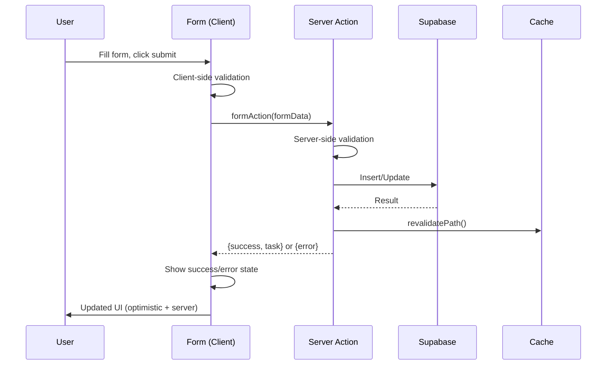
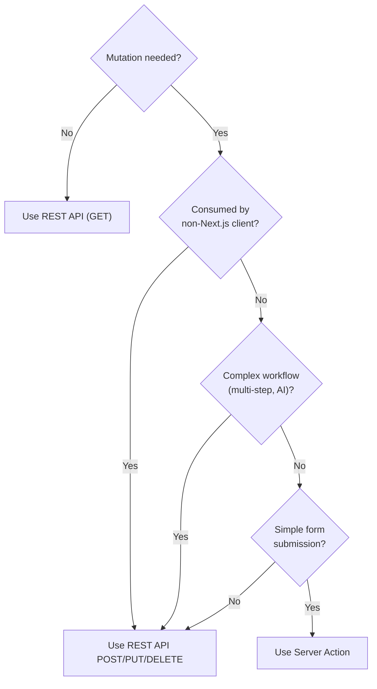

# Server Actions Integration

## Document Control

| Field | Value |
|---|---|
| **Document ID** | ENG-SRV-008 |
| **Version** | 1.0.0 |
| **Status** | Approved |
| **Date** | 2026-07-10 |
| **Classification** | Internal |
| **Owner** | Developer |

---

## 1. Executive Summary

Next.js Server Actions provide a pattern for mutating data directly from React components without building explicit API routes. For Second Brain OS, Server Actions supplement the REST API for form submissions and simple data mutations where the convenience of direct server calls outweighs the benefits of a dedicated API endpoint. This document defines when to use Server Actions vs REST API, the integration pattern with Supabase, error handling conventions, and security considerations.

---

## 2. Purpose

Establish a decision framework for Server Action usage, define integration patterns with Supabase and the existing REST API, and ensure Server Actions meet the same security, error handling, and observability standards as REST endpoints.

---

## 3. Scope

This document covers:
- Server Action vs REST API decision framework
- Server Action implementation pattern with Supabase
- Error handling, revalidation, and toast notifications
- Loading states and form submission UX
- Security considerations (auth, CSRF, data validation)
- Revalidation and cache invalidation patterns

Out of scope: REST API conventions (see [REST.md](REST.md)), controller layer (see [Controllers.md](Controllers.md)), frontend component patterns.

---

## 4. Business Context

Second Brain OS uses Next.js 14 with the App Router. Server Actions run on the server alongside the page, enabling direct database mutations without a separate API call. Use cases include: creating/updating tasks from modal forms, toggling habit completion, updating settings preferences, and submitting feedback — all operations that benefit from reduced latency and simpler client code.

---

## 5. Functional Specification

### 5.1 Server Action vs REST API Decision Framework

| Criterion | Use Server Action | Use REST API |
|---|---|---|
| Mutation scope | Single entity, simple form | Complex workflows, multi-step |
| Consumer | Same Next.js app only | External clients, mobile app, AI agents |
| Reuse | Single page/module | Multiple consumers |
| Error handling | Form-level errors | Standardized error codes |
| Rate limiting | Per-page | Per-endpoint |
| Audit trail | Basic | Structured (request ID, timing) |
| Complexity | Low (single function) | Medium (route + schema + tests) |

**Decision rule:** Use Server Actions for simple form submissions within the app. Use REST API for any operation that needs to be consumed by non-Next.js clients (mobile, AI, third-party).

### 5.2 Server Action Implementation

```typescript
// apps/web/app/tasks/actions.ts
'use server'

import { revalidatePath } from 'next/cache'
import { supabase } from '@/lib/supabase'

export async function createTask(formData: FormData) {
  const title = formData.get('title') as string
  const priority = formData.get('priority') as string
  const dueDate = formData.get('dueDate') as string

  // Server-side validation
  if (!title || title.length < 1 || title.length > 200) {
    return { error: 'Title must be 1-200 characters' }
  }

  try {
    const { data, error } = await supabase
      .from('tasks')
      .insert({
        title,
        priority: priority || 'medium',
        due_date: dueDate || null,
        user_id: (await getUser()).id,
        status: 'pending',
      })
      .select()
      .single()

    if (error) throw error

    revalidatePath('/tasks')
    return { success: true, task: data }
  } catch (err) {
    console.error('[ServerAction] createTask failed:', err)
    return { error: 'Failed to create task. Please try again.' }
  }
}
```

### 5.3 Client-Side Usage

```typescript
// apps/web/app/tasks/new-task-form.tsx
'use client'

import { useFormState } from 'react-dom'
import { createTask } from './actions'

const initialState = { error: null, success: false, task: null }

export function NewTaskForm() {
  const [state, formAction] = useFormState(createTask, initialState)

  return (
    <form action={formAction}>
      <input name="title" required minLength={1} maxLength={200} />
      <select name="priority">
        <option value="low">Low</option>
        <option value="medium">Medium</option>
        <option value="high">High</option>
      </select>
      <input name="dueDate" type="date" />
      <button type="submit" disabled={state.success}>
        {state.success ? 'Created!' : 'Create Task'}
      </button>
      {state.error && <p className="text-error">{state.error}</p>}
    </form>
  )
}
```

---

## 6. Non-Functional Requirements

| Requirement | Target | Measurement |
|---|---|---|
| Server Action execution time | < 200ms | Timing log |
| Form submission → UI update | < 500ms | User-perceived latency |
| Error response time from action | < 100ms | Error handler timing |
| Server Action code coverage | 100% | jest tests |

---

## 7. Architecture

### 7.1 Server Action Flow



### 7.2 Error Handling Pattern

```typescript
// app/<module>/actions.ts

export type ActionResult<T = unknown> = {
  success: boolean
  data?: T
  error?: string
  fieldErrors?: Record<string, string>
}

export async function updateHabitLog(
  prevState: ActionResult,
  formData: FormData
): Promise<ActionResult> {
  try {
    const habitId = formData.get('habitId') as string
    const completed = formData.get('completed') === 'true'

    if (!habitId) {
      return { success: false, error: 'Habit ID is required' }
    }

    const { error } = await supabase.from('habit_logs').upsert({
      habit_id: habitId,
      date: new Date().toISOString().split('T')[0],
      completed,
      user_id: (await auth()).user.id,
    })

    if (error) throw error

    revalidatePath('/habits')
    return { success: true }
  } catch (err) {
    return { success: false, error: 'Failed to update habit log' }
  }
}
```

---

## 8. Diagrams

### 8.1 Decision Flow



---

## 9. Data Models

Server Actions return a standard `ActionResult` type:

```typescript
type ActionResult<T = unknown> = {
  success: boolean
  data?: T
  error?: string
  fieldErrors?: Record<string, string>
  timestamp?: string
}
```

---

## 10. APIs

### 10.1 Server Action Inventory

| Action | Module | Method | Revalidation |
|---|---|---|---|
| `createTask` | Tasks | `insert` | `/tasks` |
| `updateTaskStatus` | Tasks | `update` | `/tasks` |
| `toggleHabitCompletion` | Habits | `upsert` | `/habits` |
| `updateCourseProgress` | Courses | `update` | `/courses` |
| `logSleepEntry` | Sleep | `insert` | `/sleep` |
| `updatePreferences` | Settings | `update` | `/settings` |

---

## 11. Security

| Concern | Implementation |
|---|---|
| Authentication | `auth()` check inside every Server Action |
| Authorization | User ID scoping on all queries |
| Input validation | Server-side validation (never trust client) |
| CSRF protection | Next.js Server Actions have built-in CSRF via `__nextActionId` |
| Rate limiting | Throttle via middleware or rate limit helper |
| Data exposure | Explicit `.select()` — no `select(*)` |

### 11.1 Server Action Auth Pattern

```typescript
export async function authenticatedAction(formData: FormData) {
  const { data: { session } } = await supabase.auth.getSession()

  if (!session?.user) {
    return { error: 'You must be logged in to perform this action' }
  }

  const userId = session.user.id
  // ... proceed with userId
}
```

---

## 12. Performance Targets

| Metric | Target |
|---|---|
| Server Action execution (simple) | < 100ms |
| Server Action execution (with DB write) | < 200ms |
| Revalidation trigger latency | < 50ms |
| Form submission → UI update | < 500ms |

---

## 13. Edge Cases

| Edge Case | Handling |
|---|---|
| Form submission before auth | Server Action returns auth error |
| Concurrent form submissions | Disable submit button; last-write-wins |
| Network failure | Return error; user retries |
| Stale client data after revalidation | `revalidatePath` triggers server re-render |
| File upload via Server Action | Use REST API with multipart upload instead |

---

## 14. Failure Scenarios

| Scenario | Impact | Recovery |
|---|---|---|
| Supabase write fails | `error` returned to form | Display error message |
| Auth session expired | `error` returned | Redirect to login |
| Validation fails | `fieldErrors` returned | Highlight invalid fields |
| Server Action throws | Next.js error boundary | Log + generic error message |

---

## 15. Risks & Mitigations

| Risk | Likelihood | Impact | Mitigation |
|---|---|---|---|
| Server Actions bypass REST API entirely | Medium | Medium | Decision framework enforces when to use each |
| Duplicate validation (frontend + server) | Low | Low | Server validates everything; frontend validates for UX |
| Server Action becomes too complex | Medium | High | Split into smaller actions; delegate to API for complex flows |

---

## 16. Acceptance Criteria

- [ ] Every Server Action has server-side input validation
- [ ] Every Server Action returns `ActionResult` type
- [ ] Every mutation calls `revalidatePath()` to refresh stale data
- [ ] Auth is checked inside every Server Action
- [ ] All user data is scoped by `user_id`
- [ ] Server Actions have corresponding unit tests

---

## 17. Traceability

| Requirement ID | Source | Implementation |
|---|---|---|
| SA-01 | UX-001 (Fast mutations) | Server Actions for form submissions |
| SA-02 | SEC-001 (Auth) | `auth()` check in every action |
| SA-03 | ARCH-006 (Convention clarity) | Decision framework for SA vs REST |

---

## 18. Implementation Notes

1. Server Actions are colocated with the page or module they serve
2. Use `useFormState` for form feedback (errors, success, loading)
3. Use `revalidatePath` with the full path pattern
4. Always use `'use server'` directive at module or action level
5. Prefer `use server` at the top of a separate `actions.ts` file
6. Never put sensitive business logic in Server Actions — use the REST API for that

---

## 19. Testing Strategy

| Test Type | Coverage | Tools |
|---|---|---|
| Unit tests | Every Server Action (success + error) | jest |
| Integration tests | Server Action → Supabase flow | jest + mocked supabase |
| Validation tests | Invalid input → error response | Parametrized tests |

---

## 20. References

| Reference | Document |
|---|---|
| REST API Conventions | [REST.md](REST.md) |
| Controller Layer | [Controllers.md](Controllers.md) |
| Validation Architecture | [Validation.md](Validation.md) |

---

## Revision History

| Version | Date | Author | Changes |
|---|---|---|---|
| 1.0.0 | 2026-07-10 | Developer | Initial Server Actions integration documentation |
