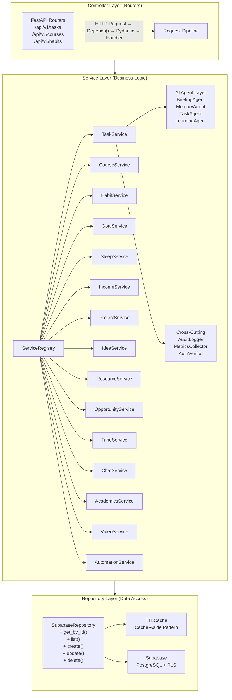
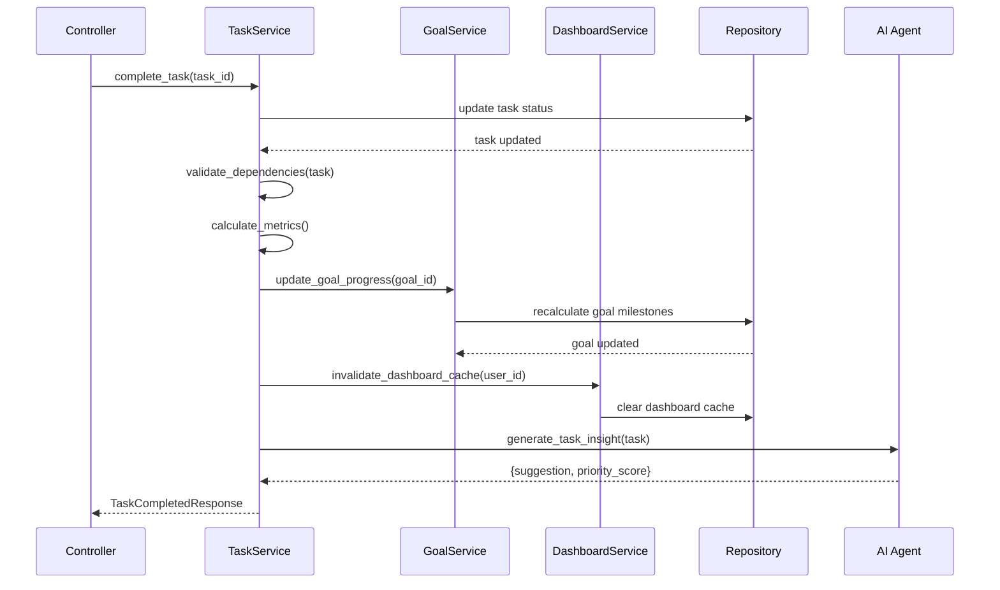
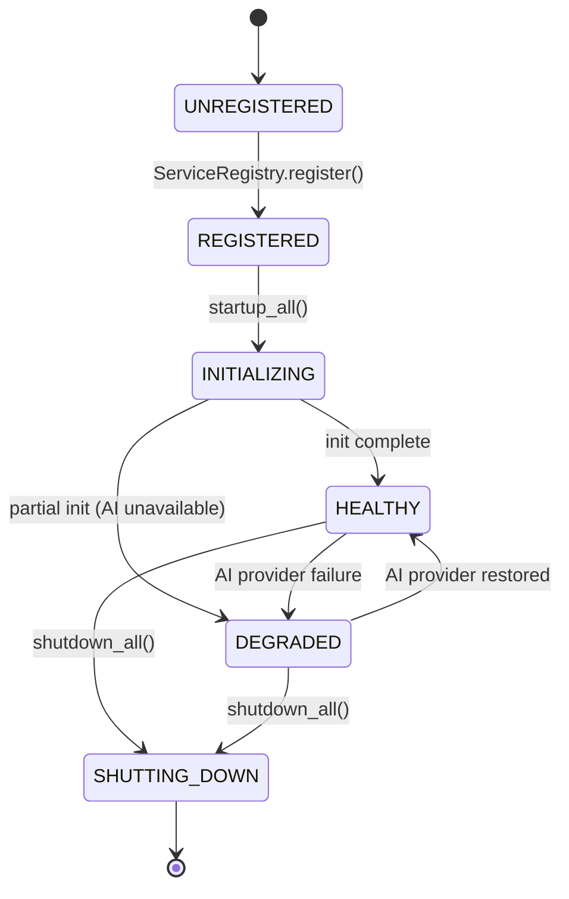
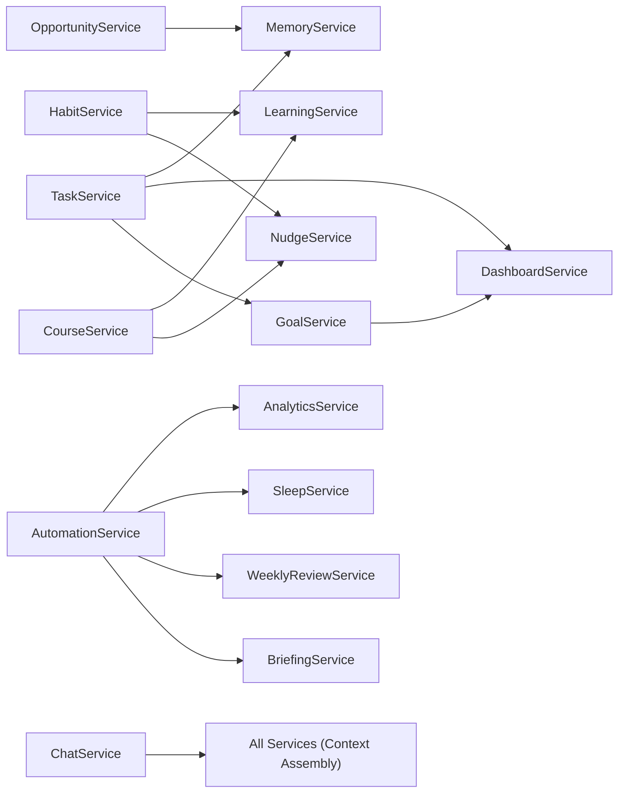

# Services Layer Architecture

## Document Control

| Field | Value |
|---|---|
| **Document ID** | ENG-SRV-001 |
| **Version** | 1.0.0 |
| **Status** | Approved |
| **Date** | 2026-07-10 |
| **Classification** | Internal |
| **Owner** | Developer |

---

## 1. Executive Summary

The services layer is the backbone of business logic in Second Brain OS, sitting between the controller (router) layer and the repository (data access) layer. It encapsulates domain rules, orchestrates multi-step workflows, coordinates AI agent interactions, and enforces cross-cutting concerns such as authorization, audit logging, and rate limiting. This document defines the service architecture, registry pattern, dependency injection model, lifecycle management, and communication patterns across all 15 functional modules and 11 AI agents (with 8 skill sub-agents).

---

## 2. Purpose

Define a consistent, testable, and maintainable service layer architecture that enforces separation of concerns, enables graceful degradation when AI providers are unavailable, and scales across 25+ modules without developer overhead.

---

## 3. Scope

This document covers:

- Service layer position in the three-tier architecture (Controller → Service → Repository)
- Service registry and dependency injection patterns
- Service lifecycle management (startup, shutdown, health)
- Cross-service communication and event-driven patterns
- Integration with AI agent system via `PromptLoader`
- Service testing strategy and mocking patterns
- Error handling and result type patterns

Out of scope: Controller routing (see [Controllers.md](Controllers.md)), data access (see [Repositories.md](Repositories.md)), scheduler jobs (see [Schedulers.md](Schedulers.md)).

---

## 4. Business Context

Second Brain OS has 15+ functional modules (tasks, courses, goals, habits, sleep, income, projects, ideas, resources, opportunities, time tracking, chat, automation, academics, videos) and 11 AI agent modules (briefing, memory, learning, opportunity, matching, task, weekly review, sleep, nudge, roadmap, skills — plus 8 skill sub-agents). Each module requires:

- **CRUD operations** with business rules (e.g., task completion cascades to goal progress)
- **AI integration** for intelligent features (e.g., AI-generated briefings, smart suggestions)
- **Graceful degradation** when AI is unavailable (algorithmic fallback)
- **Cross-module orchestration** (e.g., completing a task updates dashboard stats)
- **Audit trail** for compliance (SOC 2, GDPR)

The service layer must support all of these without becoming a monolithic bottleneck.

---

## 5. Functional Specification

### 5.1 Service Layer Responsibilities

| Responsibility | Description | Example |
|---|---|---|
| Business rule enforcement | Validate operations against domain rules | Task cannot be completed before its dependency |
| Workflow orchestration | Coordinate multi-step operations | Create task → update goal progress → notify dashboard |
| AI integration | Call AI agents via `PromptLoader` and `LLMClient` | Generate daily briefing → save to DB → notify user |
| Cross-cutting concerns | Logging, metrics, auth verification, audit | Log every business event with correlation ID |
| Error translation | Convert domain errors to API-friendly errors | `TaskNotDueError` → 400 with user message |
| Fallback logic | Provide algorithmic fallback when AI fails | Rule-based task prioritization when LLM unavailable |

### 5.2 Service Registry

All services are registered in a centralized `ServiceRegistry`:

```python
# packages/ai/service_registry.py
class ServiceRegistry:
    _services: dict[str, BaseService] = {}

    @classmethod
    def register(cls, service: BaseService):
        cls._services[service.name] = service

    @classmethod
    def get(cls, name: str) -> BaseService:
        service = cls._services.get(name)
        if not service:
            raise ServiceNotFoundError(f"Service '{name}' not registered")
        return service

    @classmethod
    def get_all(cls) -> list[BaseService]:
        return list(cls._services.values())

    @classmethod
    async def startup_all(cls):
        for service in cls._services.values():
            await service.startup()

    @classmethod
    async def shutdown_all(cls):
        for service in cls._services.values():
            await service.shutdown()
```

### 5.3 Service Interface

```python
# packages/ai/service_base.py
class BaseService(ABC):
    name: str
    version: str = "1.0.0"

    @abstractmethod
    async def startup(self):
        """Initialize connections, warm caches."""

    @abstractmethod
    async def shutdown(self):
        """Gracefully release resources."""

    @abstractmethod
    async def health(self) -> dict:
        """Return health status with dependencies."""

    async def execute_with_fallback(
        self,
        primary: Callable,
        fallback: Callable,
        *args, **kwargs
    ):
        """Execute primary with graceful degradation to fallback."""
        try:
            return await primary(*args, **kwargs)
        except (AIProviderError, CircuitBreakerOpenError):
            logger.warn(f"[{self.name}] AI unavailable, using fallback")
            return await fallback(*args, **kwargs)
```

---

## 6. Non-Functional Requirements

| Requirement | Target | Measurement |
|---|---|---|
| Service initialization time | < 500ms | Startup hook timing |
| Cross-service call latency | < 50ms (local) | Timing decorator |
| AI fallback activation time | < 100ms | Circuit breaker check |
| Service memory overhead | < 50 MB per service | `memory_profiler` |
| Concurrent service calls | < 100 req/s per service | Request counting |
| Service isolation | Fault in one service must not crash others | Try/catch boundaries |
| Service startup order | Declared dependencies resolved first | Topological sort |

---

## 7. Architecture

### 7.1 Three-Tier Layered Architecture



### 7.2 Service Communication



### 7.3 Dependency Injection Pattern

```python
# apps/api/app/dependencies.py
from fastapi import Depends
from packages.ai.service_registry import ServiceRegistry

def get_task_service() -> TaskService:
    return ServiceRegistry.get("task_service")

def get_goal_service() -> GoalService:
    return ServiceRegistry.get("goal_service")

# In controllers
@router.post("/{task_id}/complete")
async def complete_task(
    task_id: str,
    current_user = Depends(get_current_user),
    task_service: TaskService = Depends(get_task_service),
    goal_service: GoalService = Depends(get_goal_service),
):
    result = await task_service.complete_task(
        task_id=task_id,
        user_id=current_user.user.id,
        goal_service=goal_service,
    )
    return result
```

---

## 8. Diagrams

### 8.1 Service Lifecycle



### 8.2 Service Dependency Graph



---

## 9. Data Models

### 9.1 Service Result Type

```python
from dataclasses import dataclass
from typing import Generic, TypeVar, Optional

T = TypeVar("T")
E = TypeVar("E")

@dataclass
class ServiceResult(Generic[T, E]):
    success: bool
    data: Optional[T] = None
    error: Optional[E] = None
    error_code: Optional[str] = None
    request_id: Optional[str] = None

    @classmethod
    def ok(cls, data: T) -> "ServiceResult[T, E]":
        return cls(success=True, data=data)

    @classmethod
    def fail(cls, error: E, code: str = None) -> "ServiceResult[T, E]":
        return cls(success=False, error=error, error_code=code)

    def unwrap(self) -> T:
        if not self.success:
            raise ServiceError(str(self.error))
        return self.data
```

### 9.2 Service Registration Schema

```python
# Stored in database for runtime discovery
SERVICE_REGISTRY_SCHEMA = {
    "service_name": "task_service",
    "version": "1.0.0",
    "status": "healthy | degraded | offline",
    "dependencies": ["goal_service", "dashboard_service"],
    "ai_agents": ["task_agent", "memory_agent"],
    "health_endpoint": "/health/services/task_service",
    "metrics": {
        "request_count": 0,
        "error_count": 0,
        "avg_duration_ms": 0.0,
        "fallback_count": 0,
    }
}
```

---

## 10. APIs

Services expose their capabilities through the controller layer (see [Controllers.md](Controllers.md)). However, services also expose internal APIs for cross-service communication:

```python
class TaskService(BaseService):
    name = "task_service"

    async def complete_task(
        self,
        task_id: str,
        user_id: str,
        goal_service: Optional[GoalService] = None,
    ) -> ServiceResult[TaskResponse, str]:
        # 1. Validate task exists and belongs to user
        task = await self.repo.get_by_id(task_id, user_id)
        if not task:
            return ServiceResult.fail("Task not found", "TASK_NOT_FOUND")

        if task.status == "completed":
            return ServiceResult.fail("Task already completed", "TASK_ALREADY_COMPLETED")

        # 2. Check dependencies
        if task.dependency_id:
            dep = await self.repo.get_by_id(task.dependency_id, user_id)
            if dep and dep.status != "completed":
                return ServiceResult.fail(
                    f"Dependency task '{dep.title}' is not completed",
                    "DEPENDENCY_NOT_MET"
                )

        # 3. Execute
        result = await self.repo.update(task_id, {"status": "completed", "completed_at": datetime.utcnow()})

        # 4. Cross-service orchestration (fire and forget)
        if goal_service and task.goal_id:
            asyncio.create_task(
                goal_service.update_goal_progress(task.goal_id, user_id)
            )

        # 5. Return
        return ServiceResult.ok(result)
```

---

## 11. Security

| Concern | Implementation |
|---|---|
| Service-to-service auth | Internal calls pass correlation ID and user context via `RequestContext` |
| Input validation | All inputs validated at controller boundary (Pydantic) before reaching service |
| Authorization | Every service method checks `user_id` matches authenticated user |
| Audit trail | `AuditLogger` records every business event with before/after state |
| Rate limiting | Per-service rate limits via `RateLimiter` decorator |
| AI prompt injection | User input sanitized via `Sanitizer` before passing to LLM |

---

## 12. Performance Targets

| Metric | Target |
|---|---|
| Service method execution (no AI) | < 100ms p95 |
| Service method execution (with AI) | < 30s p95 |
| Cross-service call overhead | < 5ms |
| Service registry lookup | < 1ms |
| Cache hit rate at service layer | > 70% |
| AI fallback switch latency | < 50ms |

---

## 13. Edge Cases

| Edge Case | Handling |
|---|---|
| Circular service dependency | Topological sort at registration; `ServiceRegistry` detects and rejects cycles |
| AI provider timeout | Circuit breaker opens after 5 failures, 60s cooldown, fallback activated |
| Service not registered | `get_service()` raises `ServiceNotFoundError` → controller returns 500 |
| Concurrent modification | Optimistic locking via `updated_at` timestamp comparison |
| Service startup failure | `startup_all()` continues with remaining services, logs errors, marks as DEGRADED |
| Missing dependency service | Dependent methods check `is_healthy()` before calling |

---

## 14. Failure Scenarios

| Scenario | Impact | Recovery |
|---|---|---|
| AI provider down | Services fall back to algorithmic mode | Automatic when provider recovers |
| Supabase latency spike | Service calls slow down | Timeout + retry with backoff |
| Service throws unhandled exception | Individual request fails, service stays up | Error logged, circuit state unaffected |
| Memory exhaustion | ServiceRegistry OOM | Eviction policy on cache, restart on threshold |
| Dependency service unhealthy | Dependent services operate in degraded mode | Health check polling every 30s |

---

## 15. Risks & Mitigations

| Risk | Likelihood | Impact | Mitigation |
|---|---|---|---|
| Service layer becomes too thick | Medium | High | Enforce single-responsibility; split services by bounded context |
| Circular dependencies | Low | High | Static analysis in CI; `ServiceRegistry` rejects cycles at registration |
| AI fallback divergence | Medium | Medium | Verify fallback produces reasonable output; test both paths |
| Service startup order race | Low | Medium | Explicit dependency declaration + topological sort |
| Over-caching stale results | Low | Medium | TTL-based invalidation; write-through patterns |

---

## 16. Acceptance Criteria

- [ ] Every module has a corresponding service class registered in `ServiceRegistry`
- [ ] Services implement `BaseService` interface (startup, shutdown, health)
- [ ] Cross-service calls use `ServiceResult` type for consistent error handling
- [ ] AI integration uses `execute_with_fallback()` for graceful degradation
- [ ] Service dependencies are declared and validated at registration
- [ ] All services pass startup/shutdown lifecycle tests
- [ ] Service health endpoint returns status for all registered services
- [ ] Services are unit-testable with mocked repositories and AI clients

---

## 17. Traceability

| Requirement ID | Source | Service Implementation |
|---|---|---|
| SRV-01 | ADR-004 (In-process agents) | `TaskService.execute_with_fallback()` |
| SRV-02 | SEC-003 (Audit logging) | `AuditLogger` in all mutation methods |
| SRV-03 | PERF-001 (Cache-aside) | Cache check in repository layer |
| SRV-04 | AI-002 (Graceful degradation) | `execute_with_fallback` pattern |
| SRV-05 | ARCH-001 (Separation of concerns) | Three-tier: Controller → Service → Repository |

---

## 18. Implementation Notes

1. Services are registered in `packages/ai/__init__.py` during FastAPI startup
2. Use `@inject` decorator for dependency injection, not manual constructor wiring
3. All AI calls go through `LLMClient` with retry + circuit breaker
4. Cross-service calls should prefer async fire-and-forget for non-critical updates
5. Service methods return `ServiceResult` — controllers convert to HTTP responses
6. Services must never import router modules (no circular dependencies)
7. Cache `ServiceRegistry` singleton for O(1) lookup

---

## 19. Testing Strategy

| Test Type | Coverage | Tools |
|---|---|---|
| Unit tests | 100% of service methods | pytest + unittest.mock |
| Integration tests | Cross-service orchestration (top 5 flows) | pytest + mocked Supabase |
| AI fallback tests | Every method with AI fallback (both paths) | Mock LLMClient success/failure |
| Lifecycle tests | startup/shutdown for all services | pytest with `ServiceRegistry` |
| Performance tests | Service method latency benchmarks | pytest-benchmark |
| Chaos tests | Inject failures in dependencies, verify degradation | Custom fault-injection fixtures |

```python
# Example service test
@pytest.mark.asyncio
async def test_complete_task_cascades_to_goal():
    task_service = TaskService(repo=mock_repo)
    goal_service = GoalService(repo=mock_goal_repo)

    mock_repo.get_by_id.return_value = {"id": "1", "status": "pending", "goal_id": "g1"}
    mock_repo.update.return_value = {"id": "1", "status": "completed"}

    result = await task_service.complete_task(
        task_id="1", user_id="u1", goal_service=goal_service
    )

    assert result.success
    mock_goal_repo.update.assert_called_once_with("g1", ...)
```

---

## 20. References

| Reference | Document |
|---|---|
| Controller Layer | [Controllers.md](Controllers.md) |
| Repository Layer | [Repositories.md](Repositories.md) |
| Business Logic | [BusinessLogic.md](BusinessLogic.md) |
| Validation | [Validation.md](Validation.md) |
| AI Agent Architecture | [AI Architecture](../ai/20_Agent.md) |
| Prompt System | [PromptLoader](../../packages/ai/prompt_loader.py) |
| ADR-004 | [In-Process Agents](../engineering/adr/ADR-004-in-process-agents-over-microservices.md) |
| Caching Strategy | [CachingStrategy.md](CachingStrategy.md) |

---

## Revision History

| Version | Date | Author | Changes |
|---|---|---|---|
| 1.0.0 | 2026-07-10 | Developer | Initial service layer architecture documentation |
