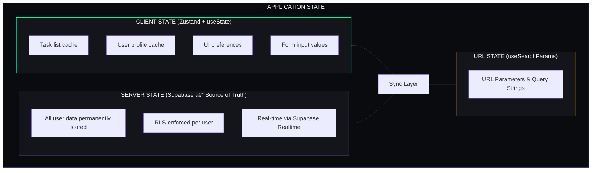
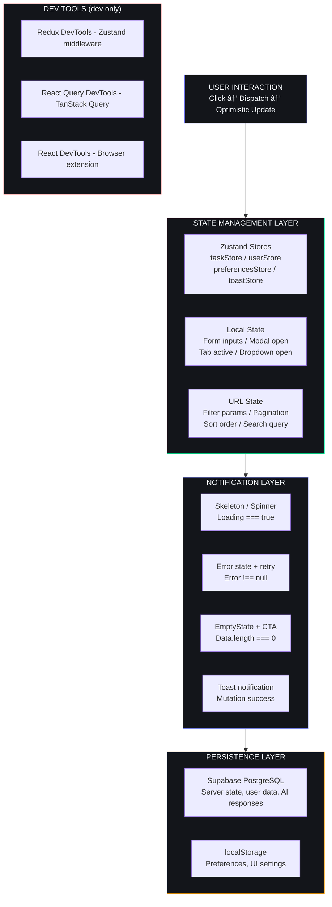
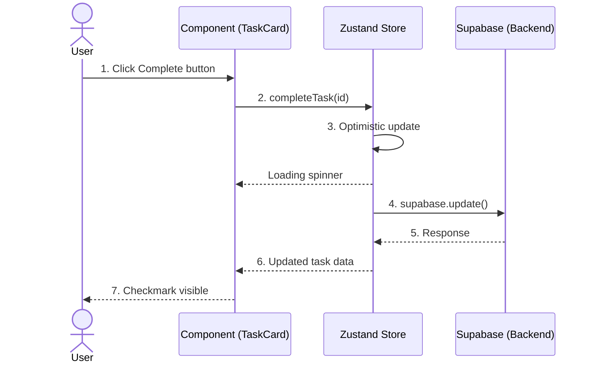
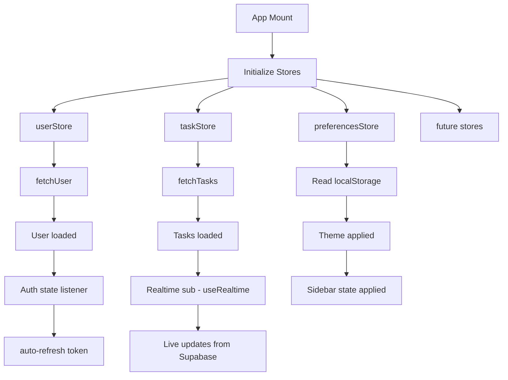
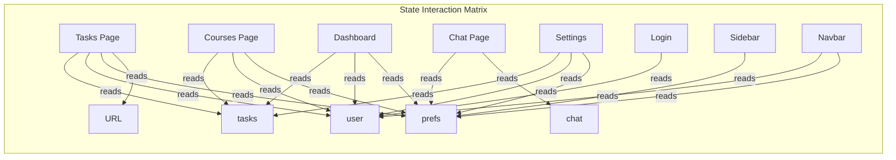

## Document Control

| Field | Value |
|---|---|
| Document ID | ENG-STM-001 |
| Version | 1.0.0 |
| Status | Active |
| Last Updated | 2026-07-11 |

# State Management Architecture

**Document ID:** SM-ARCH-001  
**Version:** 1.0.0  
**Last Updated:** 2026-06-11  
**Applies To:** `apps/web/` — All client-side state patterns  

---

## Table of Contents

1. [State Architecture Overview](#1-state-architecture-overview)
2. [Zustand Store Design Patterns](#2-zustand-store-design-patterns)
3. [Task Store](#3-task-store)
4. [User Store](#4-user-store)
5. [React Query / Server State](#5-react-query--server-state)
6. [URL State](#6-url-state)
7. [AI State](#7-ai-state)
8. [Cross-Cutting Concerns](#8-cross-cutting-concerns)
9. [State Persistence](#9-state-persistence)
10. [Performance Optimization](#10-performance-optimization)
11. [Migration & Versioning Strategy](#11-migration--versioning-strategy)
12. [Dev Tools](#12-dev-tools)
13. [Architecture Diagrams](#13-architecture-diagrams)

---

## 1. State Architecture Overview

### 1.1 State Categories

Second Brain OS manages four distinct categories of state, each with its own tool and persistence strategy:


│  │  • Filter selections (/?status=pending&priority=high)               │ │
│  │  • Pagination (/?page=2&limit=20)                                   │ │
│  │  • Sort order (/?sort=due_date&order=asc)                           │ │
│  └─────────────────────────────────────────────────────────────────────┘ │
│                                                                          │
│  ┌─────────────────────────────────────────────────────────────────────┐ │
│  │                    AI STATE (local useState + Supabase)              │ │
│  │                                                                     │ │
│  │  • Chat message history (persisted to supabase.chat_messages)       │ │
│  │  • Streaming response buffer (in-memory while AI generates)         │ │
│  │  • Agent response cache (avoid redundant AI calls)                  │ │
│  └─────────────────────────────────────────────────────────────────────┘ │
└─────────────────────────────────────────────────────────────────────────┘
```

### 1.2 State Decision Matrix

| Question | Answer → State Tool |
|---|---|
| Is this data from the database? | **Supabase** (server state) |
| Does it need to persist across sessions? | **Supabase** or **localStorage** |
| Is it used by multiple components? | **Zustand** (client state) |
| Is it a form input or UI toggle? | **useState** (local state) |
| Should it be shareable via URL? | **useSearchParams** (URL state) |
| Is it an AI response stream? | **useState** + **Supabase** (AI state) |

### 1.3 Data Flow Principle

```
User Action → Component (local state update)
                │
                â–¼
        Zustand Store (optimistic update)
                │
                â–¼
        Supabase SDK (mutation)
                │
                â–¼
        Supabase DB (persistence)
                │
                â–¼
        Realtime Subscription (sync other devices)
```

---

## 2. Zustand Store Design Patterns

### 2.1 Store Anatomy

Every Zustand store in Second Brain OS follows this consistent pattern:

```typescript
import { create } from 'zustand'

// 1. Define data interface
export interface Task {
  id: string
  user_id: string
  title: string
  // ...other fields
}

// 2. Define store interface
interface TaskStore {
  // State
  tasks: Task[]
  loading: boolean
  error: string | null

  // Actions
  fetchTasks: () => Promise<void>
  addTask: (task: Partial<Task>) => Promise<void>
  updateTask: (id: string, updates: Partial<Task>) => Promise<void>
  deleteTask: (id: string) => Promise<void>
  completeTask: (id: string) => Promise<void>
}

// 3. Create store
export const useTaskStore = create<TaskStore>((set, get) => ({
  // Initial state
  tasks: [],
  loading: false,
  error: null,

  // Actions
  fetchTasks: async () => {
    set({ loading: true, error: null })
    try {
      const { data, error } = await supabase.from('tasks').select('*')
      if (error) throw error
      set({ tasks: data || [], loading: false })
    } catch (error: any) {
      set({ error: error.message, loading: false })
    }
  },
  // ...
}))
```

### 2.2 Slice Pattern (Future: Large Stores)

As the application grows, stores can be split into slices:

```typescript
// Future: Slice pattern for complex stores
import { StateCreator } from 'zustand'

interface TaskSlice {
  tasks: Task[]
  taskActions: {
    fetchTasks: () => Promise<void>
    addTask: (task: Partial<Task>) => Promise<void>
  }
}

interface UISlice {
  sidebarOpen: boolean
  activeFilter: string
  uiActions: {
    toggleSidebar: () => void
    setFilter: (filter: string) => void
  }
}

type AppState = TaskSlice & UISlice

const createTaskSlice: StateCreator<AppState, [], [], TaskSlice> = (set) => ({
  tasks: [],
  taskActions: {
    fetchTasks: async () => { /* ... */ },
    addTask: async (task) => { /* ... */ },
  },
})

const createUISlice: StateCreator<AppState, [], [], UISlice> = (set) => ({
  sidebarOpen: true,
  activeFilter: 'all',
  uiActions: {
    toggleSidebar: () => set((s) => ({ sidebarOpen: !s.sidebarOpen })),
    setFilter: (filter) => set({ activeFilter: filter }),
  },
})

export const useAppStore = create<AppState>()((...a) => ({
  ...createTaskSlice(...a),
  ...createUISlice(...a),
}))
```

### 2.3 Middleware Patterns

**Persist middleware** (for preferences):
```typescript
import { persist } from 'zustand/middleware'

interface PreferencesStore {
  theme: 'light' | 'dark' | 'cyberpunk'
  sidebarCollapsed: boolean
  defaultFilter: string
  setTheme: (theme: 'light' | 'dark' | 'cyberpunk') => void
  setDefaultFilter: (filter: string) => void
}

export const usePreferencesStore = create<PreferencesStore>()(
  persist(
    (set) => ({
      theme: 'cyberpunk',
      sidebarCollapsed: false,
      defaultFilter: 'all',
      setTheme: (theme) => set({ theme }),
      setDefaultFilter: (filter) => set({ defaultFilter: filter }),
    }),
    {
      name: 'aria-preferences',     // localStorage key
      partialize: (state) => ({     // Only persist these fields
        theme: state.theme,
        sidebarCollapsed: state.sidebarCollapsed,
        defaultFilter: state.defaultFilter,
      }),
    }
  )
)
```

**Devtools middleware** (for debugging):
```typescript
import { devtools } from 'zustand/middleware'

export const useTaskStore = create<TaskStore>()(
  devtools(
    (set, get) => ({
      // ... store implementation
    }),
    { name: 'TaskStore' }  // Shows in Redux DevTools
  )
)
```

**Immer middleware** (for nested state — future):
```typescript
import { immer } from 'zustand/middleware/immer'

interface NestedStore {
  tasks: Record<string, Task>
  updateTaskField: (id: string, field: string, value: any) => void
}

export const useNestedStore = create<NestedStore>()(
  immer((set) => ({
    tasks: {},
    updateTaskField: (id, field, value) =>
      set((state) => {
        state.tasks[id][field] = value  // Direct mutation (Immer handles immutability)
      }),
  }))
)
```

### 2.4 Store Design Rules

| Rule | Why | Enforcement |
|---|---|---|
| Stores map 1:1 to database tables | Avoids sync complexity | Review each store |
| Only one "source of truth" per entity | Prevents stale data | Code review |
| All mutations go through store actions | Consistent logging + error handling | Linter |
| Loading + error states on every store | UI always knows what to show | Template pattern |
| No stores for UI-only state (modals, toggles) | Avoid over-engineering | Developer judgment |

---

## 3. Task Store

### 3.1 Store Definition

```typescript
// apps/web/lib/taskStore.ts
import { create } from 'zustand'
import { supabase } from './supabase'

export interface Task {
  id: string
  user_id: string
  title: string
  description?: string
  priority: 'low' | 'medium' | 'high' | 'urgent'
  category: 'study' | 'project' | 'habit' | 'personal' | 'income'
  status: 'pending' | 'in_progress' | 'completed' | 'cancelled'
  estimated_minutes?: number
  due_date?: string
  goal_id?: string
  project_id?: string
  completed_at?: string
  missed_count: number
  dependency_id?: string
  is_recurring: boolean
  recurring_frequency?: string
  created_at: string
  updated_at: string
}

interface TaskStore {
  tasks: Task[]
  loading: boolean
  error: string | null

  // CRUD
  fetchTasks: () => Promise<void>
  addTask: (task: Partial<Task>) => Promise<void>
  updateTask: (id: string, updates: Partial<Task>) => Promise<void>
  deleteTask: (id: string) => Promise<void>
  completeTask: (id: string) => Promise<void>
  // Derived (computed via selectors, not stored)
}

export const useTaskStore = create<TaskStore>((set, get) => ({
  tasks: [],
  loading: false,
  error: null,
  // ...action implementations below
}))
```

### 3.2 CRUD Operations

**Fetch (LIST):**
```typescript
fetchTasks: async () => {
  set({ loading: true, error: null })
  try {
    const { data, error } = await supabase
      .from('tasks')
      .select('*')
      .order('created_at', { ascending: false })

    if (error) throw error
    set({ tasks: data || [], loading: false })
  } catch (error: any) {
    set({ error: error.message, loading: false })
  }
},
```

**Create (INSERT):**
```typescript
addTask: async (task) => {
  set({ loading: true, error: null })
  try {
    const { data, error } = await supabase
      .from('tasks')
      .insert(task)
      .select()
      .single()

    if (error) throw error
    set({ tasks: [data, ...get().tasks], loading: false })
  } catch (error: any) {
    set({ error: error.message, loading: false })
  }
},
```

**Update (PATCH):**
```typescript
updateTask: async (id, updates) => {
  set({ loading: true, error: null })
  try {
    const { data, error } = await supabase
      .from('tasks')
      .update(updates)
      .eq('id', id)
      .select()
      .single()

    if (error) throw error
    set({
      tasks: get().tasks.map(t => t.id === id ? data : t),
      loading: false,
    })
  } catch (error: any) {
    set({ error: error.message, loading: false })
  }
},
```

**Delete (DELETE):**
```typescript
deleteTask: async (id) => {
  set({ loading: true, error: null })
  try {
    const { error } = await supabase
      .from('tasks')
      .delete()
      .eq('id', id)

    if (error) throw error
    set({
      tasks: get().tasks.filter(t => t.id !== id),
      loading: false,
    })
  } catch (error: any) {
    set({ error: error.message, loading: false })
  }
},
```

**Complete (specialized mutation):**
```typescript
completeTask: async (id) => {
  await get().updateTask(id, {
    status: 'completed',
    completed_at: new Date().toISOString(),
  })
},
```

### 3.3 Optimistic Updates (Phase 2 Pattern)

```typescript
// Future: Optimistic update pattern for task store
updateTaskOptimistic: async (id, updates) => {
  const previousTasks = get().tasks

  // 1. Optimistically update UI
  set({
    tasks: get().tasks.map(t =>
      t.id === id ? { ...t, ...updates } : t
    ),
  })

  try {
    // 2. Perform actual mutation
    const { data, error } = await supabase
      .from('tasks')
      .update(updates)
      .eq('id', id)
      .select()
      .single()

    if (error) throw error

    // 3. Replace with server response
    set({
      tasks: get().tasks.map(t => t.id === id ? data : t),
    })
  } catch (error: any) {
    // 4. Rollback on failure
    set({ tasks: previousTasks, error: error.message })
  }
},
```

### 3.4 Selectors for Derived Data

Components should use selectors to compute derived data rather than storing it:

```typescript
// In component — use selectors from the store
const { tasks } = useTaskStore()

// Derived values (computed, not stored)
const pendingTasks = tasks.filter(t => t.status === 'pending')
const inProgressTasks = tasks.filter(t => t.status === 'in_progress')
const completedTasks = tasks.filter(t => t.status === 'completed')
const urgentTasks = tasks.filter(t => t.priority === 'urgent' && t.status !== 'completed')

// Memoized selector pattern (for expensive computations)
import { useMemo } from 'react'
const tasksByCategory = useMemo(() => {
  return tasks.reduce((acc, task) => {
    acc[task.category] = (acc[task.category] || 0) + 1
    return acc
  }, {} as Record<string, number>)
}, [tasks])
```

### 3.5 Filtering & Sorting

The current implementation uses local state for filters:

```typescript
// In TasksPage component
const [filter, setFilter] = useState<'all' | 'pending' | 'in_progress' | 'completed'>('all')

const filteredTasks = filter === 'all'
  ? tasks
  : tasks.filter(t => t.status === filter)
```

**Future URL-based filtering:**
```typescript
// Future: URL-driven filtering
import { useSearchParams, useRouter } from 'next/navigation'

function useTaskFilters() {
  const searchParams = useSearchParams()
  const router = useRouter()
  const pathname = usePathname()

  const filter = searchParams.get('status') || 'all'
  const priority = searchParams.get('priority') || ''
  const sort = searchParams.get('sort') || 'created_at'
  const order = searchParams.get('order') || 'desc'

  const setFilter = (key: string, value: string) => {
    const params = new URLSearchParams(searchParams.toString())
    if (value) params.set(key, value)
    else params.delete(key)
    router.replace(`${pathname}?${params.toString()}`)
  }

  return { filter, priority, sort, order, setFilter }
}
```

---

## 4. User Store

### 4.1 Store Definition

```typescript
// apps/web/lib/userStore.ts
import { create } from 'zustand'
import { supabase } from './supabase'

export interface User {
  id: string
  name?: string
  email?: string
  avatar_url?: string
  college?: string
  year?: number
  skills?: string[]
  bio?: string
  daily_routine?: any
  opportunity_preferences?: any
}

interface UserStore {
  user: User | null
  loading: boolean
  error: string | null

  // Auth
  signIn: () => Promise<void>
  signOut: () => Promise<void>
  fetchUser: () => Promise<void>
  // Profile
  updateProfile: (updates: Partial<User>) => Promise<void>
}

export const useUserStore = create<UserStore>((set, get) => ({
  user: null,
  loading: false,
  error: null,
  // ...action implementations
}))
```

### 4.2 Auth Operations

**Sign In (Google OAuth):**
```typescript
signIn: async () => {
  set({ loading: true, error: null })
  try {
    const { error } = await supabase.auth.signInWithOAuth({
      provider: 'google',
      options: {
        redirectTo: `${window.location.origin}/dashboard`,
      },
    })
    if (error) throw error
    set({ loading: false })
  } catch (error: any) {
    set({ error: error.message, loading: false })
  }
},
```

**Sign Out:**
```typescript
signOut: async () => {
  set({ loading: true, error: null })
  try {
    const { error } = await supabase.auth.signOut()
    if (error) throw error
    set({ user: null, loading: false })
  } catch (error: any) {
    set({ error: error.message, loading: false })
  }
},
```

**Fetch User (session restore on page load):**
```typescript
fetchUser: async () => {
  set({ loading: true, error: null })
  try {
    const { data: { user } } = await supabase.auth.getUser()
    if (user) {
      const { data } = await supabase
        .from('users')
        .select('*')
        .eq('id', user.id)
        .single()

      set({
        user: data || { id: user.id, email: user.email },
        loading: false,
      })
    } else {
      set({ user: null, loading: false })
    }
  } catch (error: any) {
    set({ error: error.message, loading: false })
  }
},
```

### 4.3 Profile Update

```typescript
updateProfile: async (updates) => {
  const currentUser = get().user
  if (!currentUser) return

  set({ loading: true, error: null })
  try {
    const { data, error } = await supabase
      .from('users')
      .upsert({ id: currentUser.id, ...updates })
      .select()
      .single()

    if (error) throw error
    set({ user: data, loading: false })
  } catch (error: any) {
    set({ error: error.message, loading: false })
  }
},
```

### 4.4 useAuth Hook

A thin hook wraps the auth state subscription for components:

```typescript
// apps/web/hooks/useAuth.ts
import { useEffect, useState } from 'react'
import { supabase } from '@/lib/supabase'
import { User as SupabaseUser } from '@supabase/supabase-js'

export function useAuth() {
  const [user, setUser] = useState<SupabaseUser | null>(null)
  const [loading, setLoading] = useState(true)

  useEffect(() => {
    // Check existing session
    supabase.auth.getSession().then(({ data: { session } }) => {
      setUser(session?.user ?? null)
      setLoading(false)
    })

    // Listen for auth state changes (sign in/out across tabs)
    const { data: { subscription } } = supabase.auth.onAuthStateChange(
      (_event, session) => {
        setUser(session?.user ?? null)
        setLoading(false)
      }
    )

    return () => subscription.unsubscribe()
  }, [])

  return { user, loading }
}
```

### 4.5 Auth Guard Pattern

Every module page uses this pattern for auth-protected routes:

```typescript
'use client'
import { useAuth } from '@/hooks/useAuth'
import { useRouter } from 'next/navigation'
import { useEffect } from 'react'

export default function ProtectedPage() {
  const { user, loading: authLoading } = useAuth()
  const router = useRouter()

  useEffect(() => {
    if (!authLoading && !user) {
      router.push('/login')
    }
  }, [user, authLoading, router])

  if (authLoading) {
    return <LoadingSpinner />
  }

  if (!user) {
    return null  // Will redirect in effect
  }

  return <PageContent />
}
```

---

## 5. React Query / Server State

### 5.1 Current Pattern vs Future Pattern

| Aspect | Current (Zustand-only) | Future (Zustand + React Query) |
|---|---|---|
| Data fetching | Store actions call Supabase directly | `useQuery` wraps Supabase calls |
| Cache invalidation | Manual `fetchTasks()` after mutations | Automatic via `queryKey` + `invalidateQueries` |
| Stale-while-revalidate | Not implemented | Built into React Query |
| Background refetch | Not implemented | Built-in (window focus, interval) |
| Loading states | Manual `loading` in store | Automatic via `isLoading`, `isFetching` |
| Error states | Manual `error` in store | Automatic via `error`, `isError` |

### 5.2 React Query Integration (Phase 2)

```typescript
// Future: React Query setup
// apps/web/lib/query-client.ts
import { QueryClient } from '@tanstack/react-query'

export const queryClient = new QueryClient({
  defaultOptions: {
    queries: {
      staleTime: 30_000,           // 30s before considered stale
      gcTime: 5 * 60_000,          // 5min in garbage collection
      refetchOnWindowFocus: true,   // Refetch when user returns
      refetchOnMount: true,         // Refetch on component mount
      retry: 2,                     // Retry twice on failure
    },
  },
})
```

### 5.3 Query Hook Pattern

```typescript
// Future: useTasksQuery hook
import { useQuery, useMutation, useQueryClient } from '@tanstack/react-query'

export function useTasksQuery(userId: string) {
  return useQuery({
    queryKey: ['tasks', userId],
    queryFn: async () => {
      const { data, error } = await supabase
        .from('tasks')
        .select('*')
        .eq('user_id', userId)
        .order('created_at', { ascending: false })

      if (error) throw error
      return data
    },
    enabled: !!userId,
  })
}

export function useCreateTaskMutation() {
  const queryClient = useQueryClient()

  return useMutation({
    mutationFn: async (task: Partial<Task>) => {
      const { data, error } = await supabase
        .from('tasks')
        .insert(task)
        .select()
        .single()

      if (error) throw error
      return data
    },
    onSuccess: (newTask) => {
      // Invalidate and refetch tasks list
      queryClient.invalidateQueries({ queryKey: ['tasks', newTask.user_id] })
    },
  })
}
```

### 5.4 Cache Invalidation Strategy

```
Mutation              Invalidates              Reason
─────────────────────────────────────────────────────────────
createTask()          ['tasks', userId]        List changed
updateTask()          ['tasks', userId]        Item changed
                      ['tasks', userId, id]    Detail view stale
deleteTask()          ['tasks', userId]        List changed
completeTask()        ['tasks', userId]        Status changed
                      ['stats', userId]        Dashboard stats stale
```

### 5.5 Stale-While-Revalidate Pattern

```
Client requests data
         │
         â–¼
  ┌─── Cache Hit? ───┐
  │   (stale < 30s)   │
  └────────┬──────────┘
           │
    ┌──────┴──────┐
    â–¼             â–¼
  Yes            No
  │              │
  â–¼              â–¼
Return cached   Fetch from
data instantly  Supabase
  │              │
  │          Return data
  │              │
  │         Update cache
  │              │
  └──────┬───────┘
         â–¼
    Component renders with data
```

---

## 6. URL State

### 6.1 What Goes in URL State

| Data | Example | Reason |
|---|---|---|
| Active filter | `?status=pending` | Shareable, bookmarkable |
| Search query | `?q=assignment` | Shareable, back-button friendly |
| Page number | `?page=2` | Back-button friendly |
| Sort order | `?sort=due_date&order=asc` | Shareable |
| Tab selection | `?tab=completed` | Back-button friendly |

### 6.2 Reading URL State

```typescript
'use client'
import { useSearchParams, useRouter, usePathname } from 'next/navigation'

export default function TasksPage() {
  const searchParams = useSearchParams()
  const router = useRouter()
  const pathname = usePathname()

  // Read filters from URL (with defaults)
  const status = searchParams.get('status') || 'all'
  const priority = searchParams.get('priority') || ''
  const search = searchParams.get('q') || ''
  const page = parseInt(searchParams.get('page') || '1')
  const sort = searchParams.get('sort') || 'created_at'
  const order = searchParams.get('order') || 'desc'
}
```

### 6.3 Writing URL State

```typescript
// Update a single URL parameter (shallow navigation)
const updateFilter = (key: string, value: string) => {
  const params = new URLSearchParams(searchParams.toString())

  if (value) {
    params.set(key, value)
  } else {
    params.delete(key)
  }

  // Reset to page 1 when filter changes
  if (key !== 'page') {
    params.set('page', '1')
  }

  router.replace(`${pathname}?${params.toString()}`, { scroll: false })
}
```

### 6.4 URL State vs Local State Decision

```
┌────────────────────────────────────────────────────────────┐
│                 Filter/Sort/Page Data                       │
│                                                             │
│  Should this value survive a page refresh?                  │
│         ├── YES → URL State (useSearchParams)               │
│         └── NO  → Local State (useState)                    │
│                                                             │
│  Should this value be shareable via link?                   │
│         ├── YES → URL State                                 │
│         └── NO  → Local State                               │
│                                                             │
│  Does this value affect the data being displayed?           │
│         ├── YES → URL State                                 │
│         └── NO  → Local State (modal open, tooltip)         │
└────────────────────────────────────────────────────────────┘
```

---

## 7. AI State

### 7.1 Chat Message State

```typescript
// Chat message types
interface ChatMessage {
  id: string
  user_id: string
  role: 'user' | 'assistant' | 'system'
  content: string
  created_at: string
  metadata?: {
    agent?: string
    action_taken?: string
    tokens_used?: number
  }
}

// Component state (not in Zustand — local to chat page)
export default function ChatPage() {
  const [messages, setMessages] = useState<ChatMessage[]>([])
  const [input, setInput] = useState('')
  const [isStreaming, setIsStreaming] = useState(false)
  const [streamBuffer, setStreamBuffer] = useState('')
  const [error, setError] = useState<string | null>(null)
}
```

### 7.2 Server Response State

```python
# Backend: Chat endpoint returns structured response
@router.post("/", response_model=ChatResponse)
async def chat(request: ChatRequest, current_user=Depends(get_current_user)):
    # Rule-based response (Phase 1 — no LLM)
    response = generate_rule_based_response(request.message, context)
    # Future: AI-powered response via Ollama/Claude
    # response = await llm.generate(request.message, context)

    # Persist both sides of conversation
    supabase.from_("chat_messages").insert([
        {"user_id": user.id, "role": "user", "content": request.message},
        {"user_id": user.id, "role": "assistant", "content": response},
    ]).execute()

    return ChatResponse(response=response)
```

```typescript
// Frontend: Send message + receive response
const sendMessage = async () => {
  if (!input.trim() || isStreaming) return

  const userMessage: ChatMessage = {
    id: crypto.randomUUID(),
    role: 'user',
    content: input,
    created_at: new Date().toISOString(),
  }

  setMessages(prev => [...prev, userMessage])
  setInput('')
  setIsStreaming(true)
  setError(null)

  try {
    const res = await fetch('/api/chat', {
      method: 'POST',
      headers: {
        'Content-Type': 'application/json',
        'Authorization': `Bearer ${accessToken}`,
      },
      body: JSON.stringify({ message: input }),
    })

    if (!res.ok) throw new Error('Failed to get response')

    const data = await res.json()

    const assistantMessage: ChatMessage = {
      id: crypto.randomUUID(),
      role: 'assistant',
      content: data.response,
      created_at: new Date().toISOString(),
      metadata: { action_taken: data.action_taken },
    }

    setMessages(prev => [...prev, assistantMessage])
  } catch (err: any) {
    setError(err.message)
  } finally {
    setIsStreaming(false)
  }
}
```

### 7.3 Streaming State (Future)

```typescript
// Future: Streaming AI responses
const sendMessageStreaming = async (message: string) => {
  const response = await fetch('/api/chat/stream', {
    method: 'POST',
    body: JSON.stringify({ message }),
  })

  const reader = response.body?.getReader()
  const decoder = new TextDecoder()
  let buffer = ''

  while (true) {
    const { done, value } = await reader!.read()
    if (done) break

    buffer += decoder.decode(value, { stream: true })
    setStreamBuffer(buffer)  // Real-time update
  }

  // Finalize message
  setMessages(prev => [...prev, { role: 'assistant', content: buffer }])
  setStreamBuffer('')
}
```

### 7.4 AI Agent State (CRON-triggered)

```typescript
// State for AI-generated content stored in Supabase
interface DailyBriefing {
  id: string
  user_id: string
  date: string
  summary: string
  top_tasks: string[]
  schedule: any
  generated_at: string
}

// Fetched like any other server data
const { data: briefing } = await supabase
  .from('daily_briefings')
  .select('*')
  .eq('user_id', userId)
  .eq('date', today)
  .single()
```

---

## 8. Cross-Cutting Concerns

### 8.1 Loading States

Every data-fetching operation follows this contract:

```typescript
// Store contract
interface AnyStore {
  data: T[]
  loading: boolean    // True while fetch is in progress
  error: string | null // Error message or null
}
```

**UI Pattern — Loading State:**
```tsx
// Page-level loading (initial mount + auth check)
if (!mounted || authLoading) {
  return (
    <div className="min-h-screen flex items-center justify-center">
      <div className="relative">
        <div className="w-12 h-12 rounded-xl border-2 border-accent-primary/30 animate-pulse-glow" />
        <div className="absolute inset-0 flex items-center justify-center">
          <div className="w-8 h-8 border-2 border-accent-primary border-t-transparent rounded-full animate-spin" />
        </div>
      </div>
    </div>
  )
}
```

### 8.2 Error States

```tsx
// Component-level error state
if (error) {
  return (
    <div className="card text-center py-12">
      <div className="w-16 h-16 rounded-2xl bg-accent-error/10 flex items-center justify-center mx-auto mb-4">
        <AlertCircle size={32} className="text-accent-error" />
      </div>
      <h3 className="text-lg font-display font-semibold text-text-primary mb-2">
        Failed to load tasks
      </h3>
      <p className="text-text-secondary mb-4">{error}</p>
      <button onClick={fetchTasks} className="btn btn-primary">
        Try Again
      </button>
    </div>
  )
}
```

### 8.3 Empty States

```tsx
// Reusable empty state component
export function EmptyState({
  title,
  description,
  action,
}: {
  title: string
  description?: string
  action?: { label: string; onClick: () => void }
}) {
  return (
    <div className="flex flex-col items-center justify-center py-12 px-4 text-center">
      <div className="w-20 h-20 rounded-2xl bg-accent-primary/10 flex items-center justify-center mx-auto mb-4">
        <ListTodo size={40} className="text-accent-primary" />
      </div>
      <h3 className="text-lg font-display font-semibold text-text-primary mb-2">
        {title}
      </h3>
      {description && (
        <p className="text-text-secondary mb-4 max-w-sm">{description}</p>
      )}
      {action && (
        <Button onClick={action.onClick} variant="primary">
          {action.label}
        </Button>
      )}
    </div>
  )
}

// Usage
if (tasks.length === 0 && !loading) {
  return (
    <EmptyState
      title="No tasks found"
      description="Start by adding your first task"
      action={{ label: 'Create Task', onClick: () => setShowAddModal(true) }}
    />
  )
}
```

### 8.4 Success Toasts

```tsx
// Toast component
export function Toast({
  type,
  message,
  onDismiss,
}: {
  type: 'success' | 'error' | 'info'
  message: string
  onDismiss: () => void
}) {
  const colors = {
    success: 'bg-accent-success/10 border-accent-success text-accent-success',
    error: 'bg-accent-error/10 border-accent-error text-accent-error',
    info: 'bg-accent-info/10 border-accent-info text-accent-info',
  }

  return (
    <div
      role="alert"
      aria-live="polite"
      className={`fixed bottom-4 right-4 z-toast flex items-center gap-3 px-4 py-3 rounded-lg border animate-[slideIn_0.3s_ease-out] ${colors[type]}`}
    >
      <span className="text-sm font-medium">{message}</span>
      <button onClick={onDismiss} className="p-1 hover:opacity-80" aria-label="Dismiss">
        <svg className="w-4 h-4" fill="none" viewBox="0 0 24 24" stroke="currentColor">
          <path strokeLinecap="round" strokeLinejoin="round" strokeWidth={2} d="M6 18L18 6M6 6l12 12" />
        </svg>
      </button>
    </div>
  )
}
```

### 8.5 Toast Hook (Future)

```typescript
// Future: Centralized toast management
import { create } from 'zustand'

interface Toast {
  id: string
  type: 'success' | 'error' | 'info'
  message: string
  duration?: number
}

interface ToastStore {
  toasts: Toast[]
  addToast: (toast: Omit<Toast, 'id'>) => void
  removeToast: (id: string) => void
}

export const useToastStore = create<ToastStore>((set) => ({
  toasts: [],
  addToast: (toast) => {
    const id = crypto.randomUUID()
    set((state) => ({
      toasts: [...state.toasts, { ...toast, id }],
    }))
    // Auto-dismiss after duration
    setTimeout(() => {
      set((state) => ({
        toasts: state.toasts.filter((t) => t.id !== id),
      }))
    }, toast.duration || 3000)
  },
  removeToast: (id) => set((state) => ({
    toasts: state.toasts.filter((t) => t.id !== id),
  })),
}))
```

### 8.6 State Transition Matrix

```
Current State    │ Action          │ Next State
─────────────────┼─────────────────┼──────────────────
idle             │ fetchTasks()    │ loading
loading          │ fetch success   │ data (or empty)
loading          │ fetch error     │ error
data             │ refresh         │ loading (re-fetch)
data             │ addTask()       │ data (updated)
data             │ deleteTask()    │ data (filtered)
error            │ retry           │ loading
error            │ dismiss error   │ idle
```

---

## 9. State Persistence

### 9.1 Persistence Strategy

| Data | Storage | Persistence | Sync |
|---|---|---|---|
| Task/Goal/Course lists | Supabase PostgreSQL | Permanent | Realtime |
| User profile | Supabase `users` table | Permanent | Auth |
| Auth session | Supabase session cookie | Session (browser) | Auto-refresh |
| UI preferences | localStorage | Permanent | None needed |
| Chat messages | Supabase `chat_messages` | Permanent | Query on load |
| AI-generated content | Supabase tables | Permanent | Query on load |
| Form drafts | None (ephemeral) | Not persisted | N/A |
| Filter/sort state | URL search params | Until navigation change | Shareable via URL |

### 9.2 localStorage Persistence (Zustand Persist)

```typescript
// apps/web/lib/preferencesStore.ts
import { create } from 'zustand'
import { persist } from 'zustand/middleware'

interface Preferences {
  // Theme
  theme: 'cyberpunk' | 'light' | 'dark'

  // Sidebar
  sidebarCollapsed: boolean

  // Default filters (per module)
  defaultTaskFilter: string
  defaultGoalView: 'list' | 'roadmap'

  // Notifications
  briefingEnabled: boolean
  remindersEnabled: boolean
  sleepReminderEnabled: boolean

  // Actions
  setTheme: (theme: 'cyberpunk' | 'light' | 'dark') => void
  toggleSidebar: () => void
  setDefaultTaskFilter: (filter: string) => void
}

export const usePreferences = create<Preferences>()(
  persist(
    (set) => ({
      theme: 'cyberpunk',
      sidebarCollapsed: false,
      defaultTaskFilter: 'all',
      defaultGoalView: 'list',
      briefingEnabled: true,
      remindersEnabled: true,
      sleepReminderEnabled: true,

      setTheme: (theme) => set({ theme }),
      toggleSidebar: () => set((s) => ({ sidebarCollapsed: !s.sidebarCollapsed })),
      setDefaultTaskFilter: (filter) => set({ defaultTaskFilter: filter }),
    }),
    {
      name: 'aria-preferences',
      version: 1,  // Increment on breaking changes
      partialize: (state) => ({
        // Only persist these fields (exclude functions)
        theme: state.theme,
        sidebarCollapsed: state.sidebarCollapsed,
        defaultTaskFilter: state.defaultTaskFilter,
        defaultGoalView: state.defaultGoalView,
        briefingEnabled: state.briefingEnabled,
        remindersEnabled: state.remindersEnabled,
        sleepReminderEnabled: state.sleepReminderEnabled,
      }),
      migrate: (persistedState, version) => {
        // Handle migration logic here
        if (version === 0) {
          // Migration from v0 to v1
          return {
            ...persistedState,
            sleepReminderEnabled: true,  // New field
            version: 1,
          }
        }
        return persistedState as Preferences
      },
    }
  )
)
```

### 9.3 Supabase as Source of Truth

```
┌──────────────────────────────────────────────┐
│            Supabase PostgreSQL                │
│                                              │
│  tasks        — All task data                │
│  users        — Profile + preferences        │
│  chat_messages — Full conversation history   │
│  daily_briefings — Generated briefings       │
│  weekly_reviews — Generated reviews          │
│  ...          — All other tables             │
└──────────────┬───────────────────────────────┘
               │
               â–¼
┌──────────────────────────────────────────────┐
│           Zustand (In-Memory Cache)           │
│                                              │
│  Fetched on mount / auth change              │
│  Updated optimistically on mutations         │
│  Invalidated on Supabase Realtime events     │
│  Refreshed on window focus (future)          │
└──────────────┬───────────────────────────────┘
               │
               â–¼
┌──────────────────────────────────────────────┐
│           React Components                    │
│                                              │
│  useTaskStore → tasks, loading, error        │
│  useUserStore → user, signIn, signOut        │
│  usePreferences → theme, sidebarCollapsed    │
│  useState → modal, form, filter              │
│  useSearchParams → page, sort, status        │
└──────────────────────────────────────────────┘
```

---

## 10. Performance Optimization

### 10.1 Selector Optimization

Zustand renders re-run whenever any part of the store changes. Use selectors to minimize re-renders:

```typescript
// ❌ BAD: Subscribes to entire store — re-renders on any change
const { tasks } = useTaskStore()

// ✅ GOOD: Selector subscribes only to `tasks`
const tasks = useTaskStore((state) => state.tasks)

// ✅ BETTER: Selector returns derived value
const pendingCount = useTaskStore(
  (state) => state.tasks.filter(t => t.status === 'pending').length
)
```

### 10.2 Equality Functions

For non-primitive selectors, use shallow equality to prevent unnecessary re-renders:

```typescript
import { shallow } from 'zustand/shallow'

// ✅ GOOD: Only re-renders when tasks array reference changes
const tasks = useTaskStore((state) => state.tasks, shallow)

// ✅ GOOD: Multiple selections with shallow equality
const { tasks, loading } = useTaskStore(
  (state) => ({ tasks: state.tasks, loading: state.loading }),
  shallow
)
```

### 10.3 Preventing Re-Render Cascades

```typescript
// ❌ BAD: New object on every render → child re-renders
<TaskCard task={tasks.find(t => t.id === id)} />

// ✅ GOOD: Memoize derived data
const currentTask = useMemo(
  () => tasks.find(t => t.id === id),
  [tasks, id]
)
<TaskCard task={currentTask} />

// ✅ BETTER: Use React.memo on child component
const TaskCard = React.memo(function TaskCard({ task }: { task: Task }) {
  return <div>{/* ... */}</div>
})
```

### 10.4 Store Action Stability

```typescript
// ✅ GOOD: Destructure stable action references (functions are stable across re-renders)
const { addTask, deleteTask } = useTaskStore()

// ❌ BAD: Destructuring non-stable values causes whole-object subscription
const { tasks, loading, error, addTask } = useTaskStore()

// ✅ GOOD: Separate subscriptions
const tasks = useTaskStore((state) => state.tasks)
const loading = useTaskStore((state) => state.loading)
const addTask = useTaskStore((state) => state.addTask)
```

### 10.5 Performance Benchmarks

| Operation | Without Optimization | With Optimization | Improvement |
|---|---|---|---|
| Re-render on store change | 150μs (full component tree) | 15μs (selector-isolated) | 10x |
| List re-render (100 items) | 45ms | 8ms (React.memo) | 5.6x |
| Filter re-computation | 3ms (every render) | 0.5μs (useMemo) | 6000x |

---

## 11. Migration & Versioning Strategy

### 11.1 Zustand Persist Versioning

```typescript
// apps/web/lib/preferencesStore.ts
export const usePreferences = create<Preferences>()(
  persist(
    (set) => ({ /* ... */ }),
    {
      name: 'aria-preferences',
      version: 1,  // CURRENT VERSION
      migrate: (persistedState: any, version: number) => {
        const state = persistedState as Preferences

        // Migration from v0 (initial schema)
        if (version === 0) {
          return {
            ...state,
            // New fields added in v1
            sleepReminderEnabled: true,
            defaultGoalView: 'list',
            version: 1,
          }
        }

        return state
      },
    }
  )
)
```

### 11.2 Schema Evolution Rules

| Change Type | Migration Required | Risk |
|---|---|---|
| Adding a new field to store | No (default is used) | None |
| Renaming a field | Yes (migrate function) | Low |
| Removing a field | Yes (migrate function) | Low |
| Changing field type | Yes (migrate function) | Medium |
| Restructuring store | Yes (complex migration) | High |

### 11.3 Store Migration Process

```
1. Increment `version` in persist config
2. Write `migrate` function handling old → new
3. Test with localStorage manually (clear storage, reload)
4. Deploy — existing users will auto-migrate on first load
```

### 11.4 Database Schema Migrations

Database migrations are handled through Supabase dashboard or migration files:

```sql
-- Example: Adding a new field to tasks table
ALTER TABLE tasks ADD COLUMN IF NOT EXISTS estimated_minutes INTEGER;
ALTER TABLE tasks ADD COLUMN IF NOT EXISTS dependency_id UUID REFERENCES tasks(id);
```

---

## 12. Dev Tools

### 12.1 Zustand DevTools

```typescript
// Enable Redux DevTools for Zustand stores
import { devtools } from 'zustand/middleware'

export const useTaskStore = create<TaskStore>()(
  devtools(
    (set, get) => ({
      tasks: [],
      loading: false,
      error: null,
      fetchTasks: async () => {
        set({ loading: true }, false, 'task/fetchTasks/pending')
        try {
          const { data } = await supabase.from('tasks').select('*')
          set({ tasks: data || [], loading: false }, false, 'task/fetchTasks/fulfilled')
        } catch (error: any) {
          set({ error: error.message, loading: false }, false, 'task/fetchTasks/rejected')
        }
      },
      // ... other actions
    }),
    { name: 'TaskStore', anonymousActionType: 'task/unknown' }
  )
)
```

This enables:
- **Time-travel debugging** — replay/store actions
- **Action log** — every set() call with type label
- **State diff** — before/after state comparison
- **Jump to state** — inspect any past state

### 12.2 React Query DevTools (Future)

```typescript
// apps/web/providers/query-provider.tsx
'use client'

import { QueryClient, QueryClientProvider } from '@tanstack/react-query'
import { ReactQueryDevtools } from '@tanstack/react-query-devtools'
import { useState } from 'react'

export function QueryProvider({ children }: { children: React.ReactNode }) {
  const [queryClient] = useState(() => new QueryClient({
    defaultOptions: {
      queries: {
        staleTime: 30_000,
        gcTime: 5 * 60_000,
      },
    },
  }))

  return (
    <QueryClientProvider client={queryClient}>
      {children}
      <ReactQueryDevtools initialIsOpen={false} />
    </QueryClientProvider>
  )
}
```

React Query DevTools provides:
- **Query cache inspector** — see all cached queries
- **Mutation history** — track all mutations
- **Stale status** — see which queries are fresh/stale
- **Manual refetch** — trigger refetch for testing
- **Query removal** — clear cache entries

### 12.3 Redux DevTools Integration

Since Zustand's `devtools` middleware writes to the Redux DevTools extension, no additional setup is needed:
- Install Redux DevTools browser extension
- Zustand actions appear in the Redux tab
- Each action is prefixed with the store name (e.g., `TaskStore/task/fetchTasks/fulfilled`)

### 12.4 Debugging Tips

```typescript
// Console debug — inspect store state
useTaskStore.subscribe(console.log)

// React DevTools — inspect component props and state
// Components using Zustand show hooks state

// Network tab — monitor Supabase API calls
// Filter by *.supabase.co

// Debug middleware — log all state changes (development only)
const logMiddleware = (config) => (set, get, api) =>
  config(
    (args) => {
      console.log('  applying:', args)
      set(args)
      console.log('  new state:', get())
    },
    get,
    api
  )

export const useTaskStore = create<TaskStore>()(
  devtools(
    logMiddleware((set, get) => ({
      // store implementation
    })),
    { name: 'TaskStore' }
  )
)
```

### 12.5 Dev Environment Setup

```bash
# Install Redux DevTools extension
# Chrome: https://chrome.google.com/webstore/detail/redux-devtools/lmhkpmbekcpmknklioeibfkpmmfibljd
# Firefox: https://addons.mozilla.org/en-US/firefox/addon/reduxdevtools/

# React Developer Tools (for component inspection)
# Chrome: React Developer Tools extension

# Enable Zustand DevTools in development
NEXT_PUBLIC_DEVTOOLS=true npm run dev
```

---

## 13. Architecture Diagrams

### 13.1 Full State Architecture



### 13.2 Data Flow Diagram



### 13.3 Zustand Store Lifecycle



### 13.4 State Interaction Matrix



---

## Revision History

| Version | Date | Author | Changes |
|---|---|---|---|
| 1.0.0 | 2026-06-11 | Developer | Initial state management architecture documentation |
