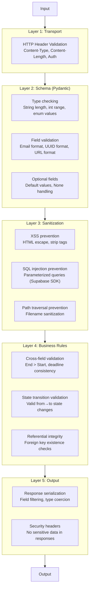
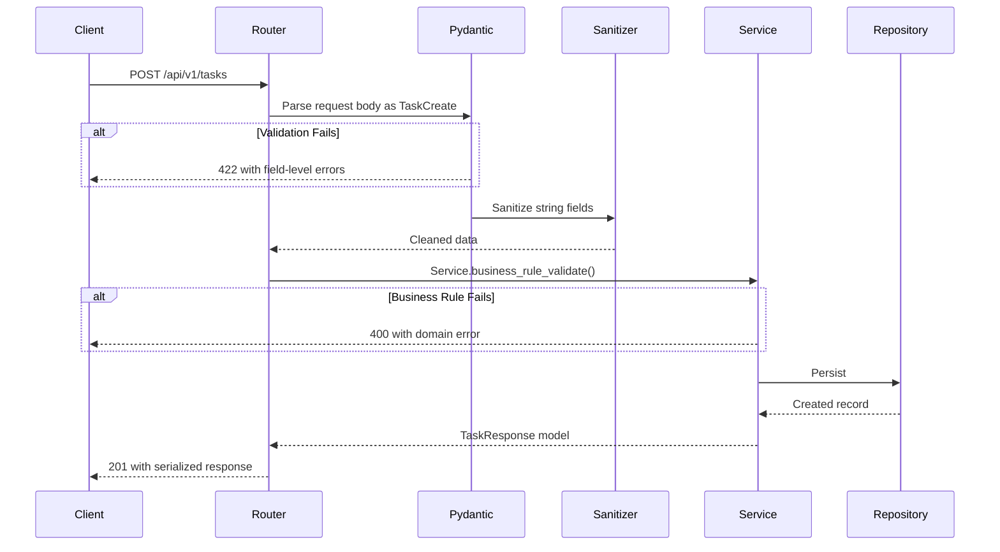
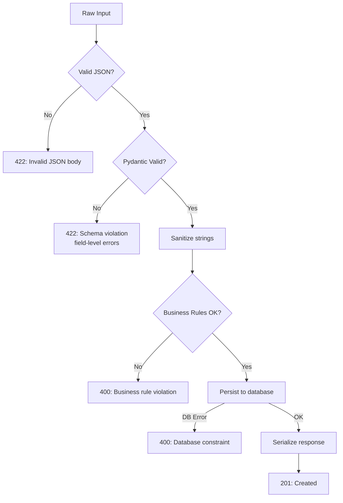

# Validation Architecture

## Document Control

| Field | Value |
|---|---|
| **Document ID** | ENG-VAL-004 |
| **Version** | 1.0.0 |
| **Status** | Approved |
| **Date** | 2026-07-10 |
| **Classification** | Internal |
| **Owner** | Developer |

---

## 1. Executive Summary

Validation is enforced at multiple layers of Second Brain OS: Pydantic schema validation at the API boundary, input sanitization for XSS/SQL injection prevention, cross-field business rule validation in the service layer, and output serialization validation for response consistency. This document defines the validation architecture, layer responsibilities, sanitization rules, error message standardization, and performance considerations for each validation tier.

---

## 2. Purpose

Define a defense-in-depth validation strategy that catches invalid data at every layer, provides consistent error messages to clients, prevents injection attacks, and performs validation efficiently without duplicating rules across layers.

---

## 3. Scope

This document covers:
- Pydantic schema validation on all API endpoints
- Input sanitization (XSS, SQL injection, path traversal)
- Cross-field validation (business rules spanning multiple fields)
- Business rule validation in the service layer
- Error message standardization
- Validation performance and caching
- Output serialization validation

Out of scope: Authentication/authorization (see [BackendArchitecture.md](BackendArchitecture.md)), database-level constraints (see [Schema.md](Schema.md)).

---

## 4. Business Context

Second Brain OS accepts user input across 31+ API endpoints and multiple AI agent prompts. Input may come from forms, file uploads, natural language chat, and automated cron jobs. Each source requires validation at the appropriate layer. Malformed or malicious input must be caught before reaching business logic or the database.

---

## 5. Functional Specification

### 5.1 Validation Layers



### 5.2 Pydantic Schema Validation

```python
from pydantic import BaseModel, Field, model_validator
from datetime import datetime
from typing import Optional

class TaskCreate(BaseModel):
    title: str = Field(..., min_length=1, max_length=200)
    description: Optional[str] = Field(None, max_length=2000)
    priority: str = Field(default="medium", pattern=r"^(low|medium|high|urgent)$")
    estimated_minutes: Optional[int] = Field(None, ge=5, le=480)
    due_date: Optional[datetime] = None

    @model_validator(mode="after")
    def check_recurring_has_frequency(self):
        if self.is_recurring and not self.recurring_frequency:
            raise ValueError("Recurring tasks must specify frequency")
        return self

class TaskUpdate(BaseModel):
    title: Optional[str] = Field(None, min_length=1, max_length=200)
    status: Optional[str] = Field(None, pattern=r"^(pending|in_progress|completed|cancelled)$")
```

### 5.3 Input Sanitization

```python
# packages/shared/utils/sanitizer.py
import html
import re

def sanitize_string(value: str) -> str:
    """Strip HTML tags and trim whitespace."""
    return html.escape(value.strip())

def sanitize_filename(filename: str) -> str:
    """Remove path traversal characters."""
    return re.sub(r'[^\w\-_\. ]', '', filename)

def sanitize_for_llm(value: str) -> str:
    """Sanitize user input before passing to LLM prompts."""
    # Remove control characters, normalize whitespace
    cleaned = re.sub(r'[\x00-\x08\x0B\x0C\x0E-\x1F]', '', value)
    return cleaned.strip()[:10000]  # Cap length for token budget
```

---

## 6. Non-Functional Requirements

| Requirement | Target | Measurement |
|---|---|---|
| Pydantic model parse (simple) | < 5ms | Model parse timing |
| Pydantic model parse (complex) | < 50ms | Model parse timing |
| Input sanitization overhead | < 2ms per string | Sanitizer timing |
| Validation error response | < 10ms total | End-to-end timing |
| False positive rate (sanitization) | 0% | Manual audit |

---

## 7. Architecture

### 7.1 Validation Pipeline



### 7.2 Error Message Standardization

```json
{
  "detail": "Human-readable error message",
  "error_code": "VALIDATION_ERROR",
  "field_errors": [
    {
      "field": "title",
      "message": "String should have at least 1 character",
      "code": "string_min_length"
    },
    {
      "field": "due_date",
      "message": "Due date must be in the future",
      "code": "date_must_be_future"
    }
  ],
  "request_id": "uuid-string",
  "timestamp": "2026-07-10T12:00:00Z"
}
```

---

## 8. Diagrams

### 8.1 Validation Decision Tree



---

## 9. Data Models

| Model | Layer | Validation Rules |
|---|---|---|
| `{Entity}Create` | Schema | Required fields, types, lengths, enums |
| `{Entity}Update` | Schema | All optional, partial update support |
| `{Entity}Response` | Output | Field filtering, computed fields |
| `ErrorResponse` | Output | Standard error envelope |

---

## 10. APIs

### 10.1 Validation Rule Reference

| Rule Type | Pydantic Validator | Example |
|---|---|---|
| String length | `Field(min_length=1, max_length=200)` | Task title |
| Numeric range | `Field(ge=5, le=480)` | Estimated minutes |
| Enum values | `Field(pattern=r"^(a\|b\|c)$")` | Priority, status |
| Date range | `@field_validator` | Due date in future |
| Cross-field | `@model_validator` | Recurring → frequency required |
| Regex pattern | `Field(pattern=r"^...$")` | UUID, email, URL |
| Optional with default | `Field(default=None)` | Description |

### 10.2 Validation by Module

| Module | Create Validations | Update Validations |
|---|---|---|
| Tasks | title required, priority enum, due_date optional | All fields optional |
| Courses | name required, deadline required, platform enum | Progress 0-100 |
| Habits | title required, frequency enum | All fields optional |
| Goals | title required, target_date optional | Progress 0-100 |
| Sleep | sleep_start required, quality 1-5 | Rating only |

---

## 11. Security

| Concern | Implementation |
|---|---|
| XSS prevention | `html.escape()` on all string inputs |
| SQL injection | Supabase SDK parameterized queries (no raw SQL) |
| Path traversal | `sanitize_filename()` strips path separators |
| HTML in rich text | Stripped by default; allowlist if needed |
| LLM prompt injection | `sanitize_for_llm()` limits length, strips control chars |
| Batch size limits | Pydantic `Field(le=100)` on limit parameters |

---

## 12. Performance Targets

| Metric | Target |
|---|---|
| Simple field validation | < 1ms per field |
| Complex model validation | < 50ms per model |
| String sanitization | < 2ms per field |
| Response serialization | < 10ms per response |
| Validation failure response | < 10ms total |

---

## 13. Edge Cases

| Edge Case | Handling |
|---|---|
| Empty string vs null | Empty string rejected (min_length=1); null allowed on optional |
| Extra unknown fields | Pydantic ignores by default; configurable to reject |
| Unicode characters | Pydantic handles full UTF-8 range |
| Extremely long input | Truncated by max_length on fields; capped at 10K for LLM |
| Emoji in text | Allowed (UTF-8); stripped for LLM safety |
| Negative numbers in positive fields | Rejected by `ge=0` constraint |
| SQL in search queries | Parameterized queries prevent injection |

---

## 14. Failure Scenarios

| Scenario | Impact | Recovery |
|---|---|---|
| Pydantic model crashes | 422 with parsing error | Log stack trace; return sanitized error |
| Sanitizer removes legitimate content | Data loss | Conservative sanitizer rules; allowlist approach |
| Business rule false positive | Valid data rejected | Log; client resubmits with corrected data |
| Validation bypass via different endpoint | Data integrity risk | Defense in depth (DB constraints) |

---

## 15. Risks & Mitigations

| Risk | Likelihood | Impact | Mitigation |
|---|---|---|---|
| Validation rules duplicated across layers | Medium | Medium | Centralized schema definitions in `database/schemas/` |
| Overly permissive sanitizer | Low | High | Regular security audit of sanitizer rules |
| Business rules in Pydantic (leaking layer) | Medium | Low | Keep Pydantic for schema only; business rules in services |
| Missing validation on new field | Medium | Medium | Code review checklist includes validation requirements |

---

## 16. Acceptance Criteria

- [ ] Every POST/PUT endpoint has a corresponding Pydantic `Create`/`Update` schema
- [ ] Every schema has appropriate `min_length`, `max_length`, `ge`, `le` constraints
- [ ] Every string input is sanitized before reaching business logic
- [ ] Cross-field validations use Pydantic `@model_validator`
- [ ] Error responses include field-level error details
- [ ] Sanitization is idempotent (multiple passes produce same result)
- [ ] Validation tests exist for every schema (valid, invalid, boundary)

---

## 17. Traceability

| Requirement ID | Source | Implementation |
|---|---|---|
| VAL-01 | SEC-004 (Input validation) | Pydantic + Sanitizer at API boundary |
| VAL-02 | SEC-005 (XSS prevention) | `html.escape()` in sanitizer |
| VAL-03 | ARCH-003 (Defense in depth) | 5-layer validation pipeline |
| VAL-04 | AI-003 (Prompt injection) | `sanitize_for_llm()` before AI calls |

---

## 18. Implementation Notes

1. Always use `model_dump()` not `dict()` for Pydantic serialization
2. Prefer `@field_validator` for single-field rules, `@model_validator` for cross-field
3. Validation performance: compile regex patterns once at module level
4. Sanitize at the controller layer before passing to services
5. Never trust client-side validation — always re-validate server-side
6. Use `Annotated` types for reusable validation patterns (Pydantic v2)

---

## 19. Testing Strategy

| Test Type | Coverage | Tools |
|---|---|---|
| Schema validation tests | Every field: valid, invalid, boundary | pytest + parametrize |
| Cross-field validation tests | Every `@model_validator` rule | pytest |
| Sanitizer tests | XSS, SQL injection, path traversal payloads | pytest |
| Integration tests | Full validation pipeline with mocked services | pytest + TestClient |

---

## 20. References

| Reference | Document |
|---|---|
| Controller Layer | [Controllers.md](Controllers.md) |
| Business Logic Layer | [BusinessLogic.md](BusinessLogic.md) |
| Error Codes | [ErrorCodes.md](ErrorCodes.md) |
| Security Architecture | [Security](../security/24_Security.md) |

---

## Revision History

| Version | Date | Author | Changes |
|---|---|---|---|
| 1.0.0 | 2026-07-10 | Developer | Initial validation architecture documentation |
