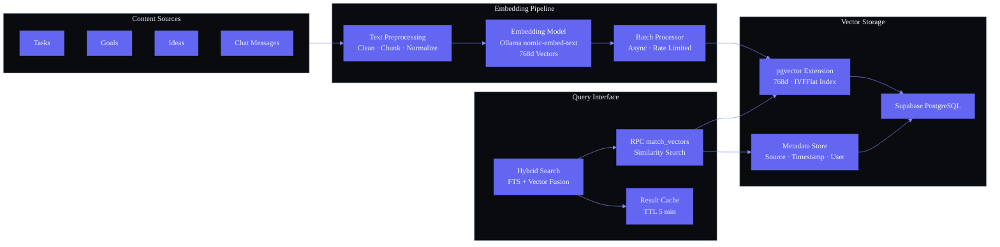
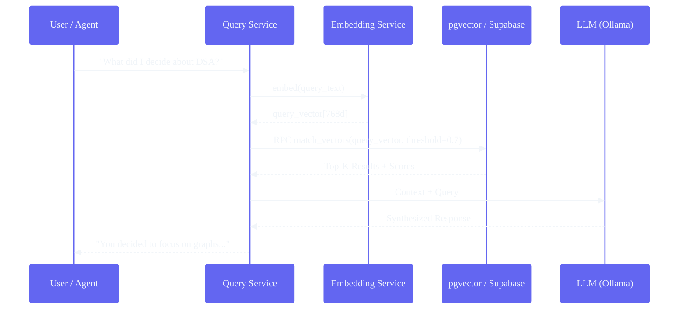

# Vector Database Strategy

## Document Control

| Property | Value |
|---|---|
| **Document ID** | DOC-ENG-009 |
| **Version** | 1.0.0 |
| **Status** | Draft |
| **Author** | AI Engineering Team |
| **Last Updated** | 2026-06-11 |
| **Approved By** | — |
| **Supersedes** | — |

---

### Architecture Diagram — Vector DB Architecture & Embedding Pipeline



### Architecture Diagram — Vector Search Flow



---

## 1. Executive Summary

Vector embeddings are the foundation of semantic understanding in Second Brain OS. They enable ARIA to go beyond keyword matching and understand the meaning and intent behind user queries. Every piece of content — tasks, goals, ideas, chat messages, learning materials, opportunities — is represented as a vector embedding that captures its semantic content.

**Why a vector database strategy matters:**

- **Semantic search**: When a user asks "What did I decide about my DSA study plan?", ARIA must find the relevant memory by meaning, not by exact keyword match.
- **Memory retrieval**: The Memory Agent uses vector similarity to retrieve relevant past interactions, preferences, and facts when assembling context for a response.
- **Knowledge graph embeddings**: Entities in the knowledge graph are vectorized to enable graph-aware similarity search (finding related concepts across domains).
- **Content recommendations**: Similar tasks, goals, and learning materials can be surfaced based on semantic similarity.

This document evaluates vector database options, defines the recommended solution (pgvector on Supabase PostgreSQL), specifies the embedding strategy, storage schema, index configuration, query pipeline, and maintenance procedures.

---

## 2. Use Cases

### 2.1 Semantic Search

The primary use case. Every user query is embedded and compared against all stored content vectors to find semantically relevant results.

| Source | Content Type | Vectors | Query Example |
|---|---|---|---|
| `chat_messages` | User messages and ARIA responses | ~50,000 | "What did I say about my internship plans?" |
| `tasks` | Task titles and descriptions | ~2,000 | "Show me tasks related to machine learning" |
| `goals` | Goal names and descriptions | ~100 | "What goals do I have for career growth?" |
| `ideas` | Idea titles and descriptions | ~500 | "Find my ideas about productivity tools" |
| `courses` | Course names, notes, concepts | ~500 | "What did I learn about React hooks?" |
| `opportunities` | Opportunity descriptions | ~1,000 | "Find internships matching my skills" |
| `resources` | Saved links and summaries | ~500 | "Find that article about system design" |

### 2.2 Memory Retrieval

The Memory Agent performs vector search against episodic memory (chat summaries) to find relevant past interactions for context assembly.

```python
# In Memory Agent
async def retrieve_relevant_memories(self, query: str, user_id: str, limit: int = 5):
    query_embedding = await self.embed(query)
    results = await self.supabase.rpc(
        "match_vectors",
        {
            "query_embedding": query_embedding,
            "match_threshold": 0.7,
            "match_count": limit,
            "filter_user_id": user_id,
            "filter_content_type": "memory_summary",
        },
    ).execute()
    return results.data
```

### 2.3 Knowledge Graph Embeddings

Entities and relationships in the knowledge graph (DOC-AI-005) are vectorized. This enables queries like "Find concepts related to what I just learned" across the graph.

### 2.4 Similar Task/Goal Matching

When a user creates a new task or goal, the system can find similar existing items to suggest grouping, deduplication, or linking.

### 2.5 Content Recommendations

Based on semantic similarity to the user's current focus, the system can recommend relevant resources, courses, and opportunities.

---

## 3. Requirements

| Requirement | Value | Rationale |
|---|---|---|
| **Scale** | < 10,000 vectors | Single-user system. Even with 3 years of daily use, the total vector count for a user is estimated at 50K chat messages + 5K other content. At 384 dims, 100K vectors = ~150 MB. |
| **Dimensions** | ≤ 384 | Using nomic-embed-text (768 dims) or all-MiniLM-L6-v2 (384 dims). Lower dimensions mean faster search, smaller storage, and lower memory. |
| **Query latency** | < 100ms P95 | User-facing semantic search must feel instant. Background search (memory consolidation) can tolerate up to 500ms. |
| **Accuracy** | Recall@10 > 0.85 | At least 85% of relevant results should appear in the top 10 for typical queries. |
| **Filtering** | Required | Every query must filter by `user_id`. Additional filters by `content_type`, date range, and JSONB metadata. |
| **Hybrid search** | Required | Vector similarity + keyword relevance (BM25/TSVECTOR) for best results. |
| **Self-hosted** | Preferred | No external service dependencies. Should run on existing Supabase PostgreSQL instance. |

---

## 4. Options Analysis

### 4.1 pgvector (PostgreSQL extension)

| Factor | Assessment |
|---|---|
| **Infrastructure** | Runs on existing Supabase PostgreSQL. Zero additional services. |
| **Dimensions** | Supports up to 2,000 dims (384 or 768 is trivially supported). |
| **Index types** | IVFFlat (builds fast, approximate), HNSW (faster query, more memory). |
| **Index build** | IVFFlat: minutes for 100K vectors. HNSW: longer build time, better query perf. |
| **Filtering** | SQL-level WHERE clauses. Supports arbitrary metadata filters via JSONB. |
| **Hybrid search** | Combine with PostgreSQL full-text search (`tsvector` + `ts_query`). |
| **Maturity** | Production-ready. Supabase has built-in pgvector support since 2023. |
| **Maintenance** | Manual or scheduled `REINDEX`. Requires monitoring of index build times. |
| **License** | PostgreSQL license (permissive). |

**Verdict**: ✅ Recommended

### 4.2 Pinecone

| Factor | Assessment |
|---|---|
| **Infrastructure** | External SaaS. Additional API key, network dependency, potential downtime. |
| **Dimensions** | Up to 20,000. Overkill for 384 dims. |
| **Pricing** | Free tier: 100K vectors. Paid: $70+/month for production. |
| **Latency** | ~30ms from nearest region. Network hop adds ~20ms compared to local. |
| **Filtering** | Metadata filtering supported but less expressive than SQL. |
| **Hybrid search** | Sparse-dense hybrid requires Pinecone's paid tier. |
| **Maturity** | Very mature. Used in production at scale. |

**Verdict**: ❌ Unnecessary for < 10K vectors on a single-user system.

### 4.3 Weaviate

| Factor | Assessment |
|---|---|
| **Infrastructure** | Self-hosted Docker container or SaaS. Additional service to manage. |
| **Dimensions** | Up to 4096. |
| **Hybrid search** | Built-in hybrid (vector + keyword). Strong differentiator. |
| **Filtering** | GraphQL-based filtering with full type system. |
| **Maturity** | Mature. 10K+ stars on GitHub. |
| **Operational overhead** | Requires Docker Compose, persistent volume, backup strategy. |

**Verdict**: ❌ Over-engineered for the scale. Additional operational burden vs. pgvector.

### 4.4 Qdrant

| Factor | Assessment |
|---|---|
| **Infrastructure** | Self-hosted Docker container or SaaS. |
| **Dimensions** | Up to 65536. |
| **Filtering** | Payload-based filtering (similar to JSONB). |
| **Performance** | Very fast. Rust-based. |
| **Operational overhead** | Another service to deploy, monitor, and back up. |

**Verdict**: ❌ Same issue as Weaviate — unnecessary complexity for sub-10K vectors.

### 4.5 Chroma

| Factor | Assessment |
|---|---|
| **Infrastructure** | Lightweight, can run in-process or as a separate service. |
| **Ease of use** | Very simple API. Good for prototyping. |
| **Persistence** | File-based. Not designed for production multi-user. |
| **Filtering** | Limited metadata filtering. |
| **Maturity** | Alpha/beta. Not recommended for production. |

**Verdict**: ❌ Not production-grade. Suitable for prototyping only.

### Decision Matrix

| Criteria | pgvector | Pinecone | Weaviate | Qdrant | Chroma |
|---|---|---|---|---|---|
| No new infrastructure | ✅ | ❌ | ❌ | ❌ | ✅ |
| Production-ready | ✅ | ✅ | ✅ | ✅ | ❌ |
| Supabase integration | ✅ | ❌ | ❌ | ❌ | ❌ |
| Hybrid search | ✅ | ⚠️ (paid) | ✅ | ⚠️ (newer) | ❌ |
| Arbitrary metadata filter | ✅ | ⚠️ (limited) | ✅ | ✅ | ❌ |
| Operational overhead | Low | Low | Medium | Medium | Low |
| Cost | $0 (existing DB) | $70+/mo | Variable | Variable | $0 |

**Winner: pgvector**

---

## 5. Recommended Solution: pgvector on Supabase

**pgvector** is the recommended vector database for Second Brain OS. It runs as a PostgreSQL extension on the existing Supabase instance, requiring zero additional infrastructure.

### Why pgvector?

1. **No additional infrastructure**: The data already lives in Supabase PostgreSQL. Adding pgvector means adding one SQL extension and a few tables — no new service deployment, no new API keys, no new backup procedures.
2. **Single source of truth**: Content (tasks, messages, etc.) and their embeddings live in the same database. No dual-write problem, no consistency issues, no sync lag.
3. **Supabase-native**: Supabase has pgvector pre-installed and documented. Vector operations use the same PostgREST API as the rest of the system.
4. **SQL filtering**: Full power of PostgreSQL WHERE clauses for metadata filtering. Combine `content_type = 'task' AND user_id = '...'` with vector search in a single query.
5. **Hybrid search**: PostgreSQL's built-in full-text search (`tsvector`) can be combined with vector search for best results.
6. **Mature and proven**: pgvector is used in production by thousands of applications. The project has 12K+ GitHub stars and is actively maintained.

### Enabling pgvector

```sql
-- Run once per database
CREATE EXTENSION IF NOT EXISTS vector;
```

Supabase projects have pgvector pre-installed. Verification:

```sql
SELECT extname, extversion FROM pg_extension WHERE extname = 'vector';
-- Returns: vector | 0.7.0+
```

---

## 6. Embedding Strategy

### 6.1 Embedding Models

Two models are available locally via Ollama. Both run on the user's machine with no API calls needed.

| Model | Dimensions | Speed | Quality | Use Case |
|---|---|---|---|---|
| `nomic-embed-text` | 768 | Fast | High | Default for all embeddings. Best quality-to-speed ratio for local models. |
| `all-MiniLM-L6-v2` | 384 | Very fast | Good | Lighter alternative for mobile or resource-constrained environments. |

**Recommendation**: Use `nomic-embed-text` (768 dims) by default. Fall back to `all-MiniLM-L6-v2` (384 dims) on low-RAM systems.

### 6.2 Batch vs. Real-Time Embedding

| Strategy | When | Mechanism |
|---|---|---|
| **Real-time** | On content creation/update | New task created → embed immediately → store in vectors table. Latency: 200-500ms. |
| **Batch** | On scheduled intervals | Every 6 hours, collect un-embedded content, batch embed, bulk insert. Efficient for large backfills. |
| **Lazy** | On first query | Embed at query time if not already embedded. Trade-off: first query is slow. |

**Recommendation**: **Real-time for interactive content** (tasks, messages, ideas). **Batch for background content** (chat history consolidation, resource summaries).

### 6.3 Embedding Caching

Avoid re-embedding the same content. If a task title hasn't changed, its embedding is still valid.

```python
class EmbeddingCache:
    def __init__(self, supabase):
        self.supabase = supabase

    async def get_embedding(self, content_hash: str) -> list[float] | None:
        result = await self.supabase.from_("vector_cache") \
            .select("embedding") \
            .eq("content_hash", content_hash) \
            .single() \
            .execute()
        return result.data["embedding"] if result.data else None

    async def set_embedding(self, content_hash: str, embedding: list[float]):
        await self.supabase.from_("vector_cache") \
            .upsert({"content_hash": content_hash, "embedding": embedding}) \
            .execute()
```

### 6.4 Chunking Strategy

For long-form content (chat messages, resource summaries), embeddings work best on chunks rather than the full text.

| Content Type | Chunk Strategy | Max Chunk Size |
|---|---|---|
| Chat message | Whole message (usually < 512 tokens) | 512 tokens |
| Task description | Whole description | 256 tokens |
| Resource summary | Sliding window with 10% overlap | 512 tokens |
| Course notes | Per-section split | 512 tokens |
| Idea description | Whole description | 256 tokens |

```python
from langchain.text_splitter import RecursiveCharacterTextSplitter

text_splitter = RecursiveCharacterTextSplitter(
    chunk_size=512,
    chunk_overlap=50,
    separators=["\n\n", "\n", ".", " ", ""],
)

chunks = text_splitter.split_text(long_text)
embeddings = [await embed(chunk) for chunk in chunks]
```

---

## 7. Vector Storage Schema

### 7.1 Vectors Table

```sql
CREATE TABLE vectors (
    id UUID PRIMARY KEY DEFAULT gen_random_uuid(),
    user_id UUID NOT NULL REFERENCES users(id) ON DELETE CASCADE,
    content_type VARCHAR(64) NOT NULL,
    content_id UUID NOT NULL,
    -- ^^^ (user_id, content_type, content_id) is a unique triple
    chunk_index INTEGER DEFAULT 0,  -- For chunked content: 0, 1, 2...
    embedding VECTOR(768) NOT NULL,  -- nomic-embed-text: 768 dims
    content_text TEXT,  -- Original text that was embedded (for debugging)
    metadata JSONB DEFAULT '{}',  -- Arbitrary metadata for filtering
    token_count INTEGER,
    created_at TIMESTAMPTZ DEFAULT NOW(),
    updated_at TIMESTAMPTZ DEFAULT NOW(),

    -- Indexes
    CONSTRAINT unique_vector_per_chunk UNIQUE (user_id, content_type, content_id, chunk_index)
);

-- Index for user_id + content_type lookups
CREATE INDEX idx_vectors_user_content ON vectors (user_id, content_type);

-- Vector index (IVFFlat)
CREATE INDEX idx_vectors_embedding ON vectors
    USING ivfflat (embedding vector_cosine_ops)
    WITH (lists = 100);

-- Metadata GIN index for JSONB queries
CREATE INDEX idx_vectors_metadata ON vectors USING gin (metadata);

-- Foreign key index
CREATE INDEX idx_vectors_content ON vectors (content_type, content_id);
```

### 7.2 Vector Cache Table (for deduplication)

```sql
CREATE TABLE vector_cache (
    content_hash VARCHAR(64) PRIMARY KEY,  -- SHA-256 of the original text
    embedding VECTOR(768) NOT NULL,
    model VARCHAR(64) NOT NULL,
    created_at TIMESTAMPTZ DEFAULT NOW()
);

-- Cleanup old entries (older than 30 days)
-- Run via scheduler: DELETE FROM vector_cache WHERE created_at < NOW() - INTERVAL '30 days';
```

### 7.3 Chat Embeddings (separate for volume isolation)

Chat messages are the largest source of vectors. A separate table isolates them from structured content:

```sql
CREATE TABLE chat_embeddings (
    id UUID PRIMARY KEY DEFAULT gen_random_uuid(),
    user_id UUID NOT NULL REFERENCES users(id) ON DELETE CASCADE,
    message_id UUID NOT NULL REFERENCES chat_messages(id) ON DELETE CASCADE,
    embedding VECTOR(768) NOT NULL,
    message_text TEXT,
    created_at TIMESTAMPTZ DEFAULT NOW(),

    CONSTRAINT unique_chat_embedding UNIQUE (message_id)
);

CREATE INDEX idx_chat_embeddings_user ON chat_embeddings (user_id);
CREATE INDEX idx_chat_embeddings_embedding ON chat_embeddings
    USING ivfflat (embedding vector_cosine_ops)
    WITH (lists = 100);
```

---

## 8. Index Strategy

### 8.1 Index Types in pgvector

| Index Type | Build Speed | Query Speed | Memory | Accuracy |
|---|---|---|---|---|
| **IVFFlat** | Fast (O(n)) | Good | Low | Good with enough lists |
| **HNSW** | Slow (O(n log n)) | Excellent | High (in memory) | Excellent |

### 8.2 Recommended: IVFFlat for Now

For the current scale (< 10K vectors), IVFFlat is sufficient and simpler to manage:

```sql
CREATE INDEX idx_vectors_embedding ON vectors
    USING ivfflat (embedding vector_cosine_ops)
    WITH (lists = 100);
```

**List count formula**: `lists = sqrt(rows)` rounded up. For 10K rows: `lists = 100`. For 100K: `lists = 316`.

**Probe count at query time**: Higher probes = more accurate, slower.

```sql
-- Query with probe adjustment
SET ivfflat.probes = 10;  -- Default: 1. Increase for better accuracy (slower).
```

### 8.3 Future: HNSW for Production

When the vector count exceeds 50K, switch to HNSW:

```sql
-- Drop IVFFlat
DROP INDEX idx_vectors_embedding;

-- Create HNSW
CREATE INDEX idx_vectors_embedding ON vectors
    USING hnsw (embedding vector_cosine_ops)
    WITH (m = 16, ef_construction = 200);
```

HNSW parameters:
- `m`: Maximum number of connections per layer (default: 16). Higher = more memory + better recall.
- `ef_construction`: Build time vs. quality trade-off (default: 200). Higher = better recall.

**HNSW at query time**:

```sql
SET hnsw.ef_search = 100;  -- Higher = more accurate, slower
```

### 8.4 Index Build Schedule

| Operation | Frequency | Condition |
|---|---|---|
| IVFFlat index build | After creation or after bulk insert | New table or after 10K+ new vectors |
| HNSW index build | After bulk insert or weekly schedule | Production deployment |
| REINDEX | Monthly | If query performance degrades > 20% |

```python
# Via APScheduler in services/scheduler/main.py
async def reindex_vectors():
    await supabase.rpc("reindex_vectors").execute()
    logger.info("Vector index rebuilt")

# SQL function
"""
CREATE OR REPLACE FUNCTION reindex_vectors()
RETURNS void AS $$
BEGIN
    REINDEX INDEX idx_vectors_embedding;
    REINDEX INDEX idx_chat_embeddings_embedding;
END;
$$ LANGUAGE plpgsql;
"""
```

---

## 9. Query Pipeline

### 9.1 Full Pipeline

```
User Query → 1. Embed Query → 2. Vector Search → 3. Metadata Filter → 4. Hybrid Re-rank → 5. Return Results
```

### Step 1: Embed Query

```python
async def embed_query(text: str) -> list[float]:
    """Embed the user's search query using Ollama."""
    response = await ollama_client.embed(
        model="nomic-embed-text",
        input=text,
    )
    return response["embeddings"][0]
```

### Step 2: Vector Search (pgvector)

```python
async def vector_search(
    embedding: list[float],
    user_id: str,
    content_type: str | None = None,
    limit: int = 10,
    threshold: float = 0.7,
) -> list[dict]:
    """
    Search vectors by cosine similarity.
    Returns results with similarity score.
    """
    query = """
        SELECT
            v.id,
            v.content_type,
            v.content_id,
            v.content_text,
            v.metadata,
            v.token_count,
            1 - (v.embedding <=> $1::vector) AS similarity
        FROM vectors v
        WHERE v.user_id = $2
            AND ($3::text IS NULL OR v.content_type = $3)
            AND 1 - (v.embedding <=> $1::vector) > $4
        ORDER BY v.embedding <=> $1::vector
        LIMIT $5
    """
    results = await supabase.rpc("execute_sql", {
        "query": query,
        "params": [embedding, user_id, content_type, threshold, limit],
    }).execute()
    return results.data
```

### Step 3: Metadata Filter

Filters are applied in the SQL WHERE clause. Common filter patterns:

```sql
-- Filter by content type + date range
WHERE v.user_id = '...'
  AND v.content_type = 'task'
  AND (v.metadata->>'due_date')::date >= '2026-06-01'
  AND (v.metadata->>'due_date')::date <= '2026-06-30'

-- Filter by status
WHERE v.metadata @> '{"status": "active"}'
```

### Step 4: Hybrid Re-ranking

Combine vector similarity with PostgreSQL full-text search for better relevance:

```python
async def hybrid_search(
    query_text: str,
    embedding: list[float],
    user_id: str,
    limit: int = 10,
) -> list[dict]:
    """
    Hybrid search: vector similarity + text keyword matching.
    Re-ranks results using a weighted combination.
    """
    results = await supabase.rpc("hybrid_search", {
        "query_text": query_text,
        "query_embedding": embedding,
        "filter_user_id": user_id,
        "match_count": limit * 2,  -- Fetch double, then re-rank
        "vector_weight": 0.7,       -- Vector similarity weight
        "keyword_weight": 0.3,      -- Keyword relevance weight
    }).execute()
    return results.data[:limit]
```

The `hybrid_search` SQL function:

```sql
CREATE OR REPLACE FUNCTION hybrid_search(
    query_text TEXT,
    query_embedding VECTOR(768),
    filter_user_id UUID,
    match_count INT,
    vector_weight FLOAT DEFAULT 0.7,
    keyword_weight FLOAT DEFAULT 0.3
)
RETURNS TABLE(
    id UUID,
    content_type VARCHAR,
    content_id UUID,
    content_text TEXT,
    metadata JSONB,
    similarity FLOAT
) AS $$
BEGIN
    RETURN QUERY
    SELECT
        v.id,
        v.content_type,
        v.content_id,
        v.content_text,
        v.metadata,
        (vector_weight * (1 - (v.embedding <=> query_embedding))
         + keyword_weight * ts_rank(
             to_tsvector('english', COALESCE(v.content_text, '')),
             to_tsquery('english', query_text)
         )) AS similarity
    FROM vectors v
    WHERE v.user_id = filter_user_id
        AND (1 - (v.embedding <=> query_embedding)) > 0.5
    ORDER BY similarity DESC
    LIMIT match_count;
END;
$$ LANGUAGE plpgsql;
```

### Step 5: Return Results

```python
class SearchResult(BaseModel):
    id: str
    content_type: str
    content_id: str
    content_text: str | None
    metadata: dict
    similarity: float

class SearchResponse(BaseModel):
    results: list[SearchResult]
    total: int
    query_time_ms: int
```

---

## 10. Hybrid Search

### 10.1 Why Hybrid?

Pure vector search is excellent at capturing semantic similarity but can miss exact keyword matches. A user searching for "Python decorator" who has a task titled "Learn Python decorators" will find it via vector search, but a search for "decorator" might rank "Python function tools" too low because it's semantically similar but not identical.

Hybrid search combines:
- **Vector similarity**: Captures meaning, handles typos, synonyms, and related concepts.
- **Keyword relevance (BM25/TSVECTOR)**: Ensures exact and partial matches are ranked highly.

### 10.2 PostgreSQL Full-Text Search Setup

```sql
-- Add tsvector column for full-text search
ALTER TABLE vectors ADD COLUMN fts tsvector
    GENERATED ALWAYS AS (
        to_tsvector('english', COALESCE(content_text, ''))
    ) STORED;

-- GIN index on tsvector
CREATE INDEX idx_vectors_fts ON vectors USING gin (fts);

-- Full-text search query
SELECT id, content_type, content_text,
       ts_rank(fts, to_tsquery('english', 'python & decorator')) AS relevance
FROM vectors
WHERE fts @@ to_tsquery('english', 'python & decorator')
ORDER BY relevance DESC;
```

### 10.3 Weight Configuration

The optimal hybrid weight depends on the use case:

| Use Case | Vector Weight | Keyword Weight |
|---|---|---|
| Memory retrieval | 0.8 | 0.2 |
| Task search | 0.6 | 0.4 |
| Idea search | 0.7 | 0.3 |
| Resource search | 0.5 | 0.5 |
| Chat search | 0.9 | 0.1 |

```python
HYBRID_WEIGHTS = {
    "memory": (0.8, 0.2),
    "task": (0.6, 0.4),
    "idea": (0.7, 0.3),
    "resource": (0.5, 0.5),
    "chat": (0.9, 0.1),
}
```

---

## 11. Maintenance

### 11.1 Re-indexing Schedule

| Task | Frequency | Description |
|---|---|---|
| REINDEX vectors index | Monthly | After significant insert/update activity |
| Analyze pgvector stats | Weekly | `ANALYZE vectors` to update query planner statistics |
| Monitor index bloat | Monthly | Check index size vs. table size ratio |
| Rebuild HNSW | Quarterly | Drop and recreate HNSW index for optimal performance |

### 11.2 Orphan Vector Cleanup

Vectors for deleted content must be cleaned up. This happens in two ways:

**1. CASCADE DELETE (automatic)**:

```sql
-- When a task is deleted, its vectors are automatically deleted
ALTER TABLE vectors
    ADD CONSTRAINT fk_content
    FOREIGN KEY (content_id)
    REFERENCES tasks(id)
    ON DELETE CASCADE;
```

Note: CASCADE delete only works for tables with direct FK references. For polymorphic content, use a scheduled cleanup:

**2. Scheduled cleanup**:

```python
# services/scheduler/main.py
async def cleanup_orphan_vectors():
    """Remove vectors whose source content no longer exists."""
    queries = [
        "DELETE FROM vectors v WHERE v.content_type = 'task' AND NOT EXISTS (SELECT 1 FROM tasks t WHERE t.id = v.content_id)",
        "DELETE FROM vectors v WHERE v.content_type = 'goal' AND NOT EXISTS (SELECT 1 FROM goals g WHERE g.id = v.content_id)",
        "DELETE FROM vectors v WHERE v.content_type = 'idea' AND NOT EXISTS (SELECT 1 FROM ideas i WHERE i.id = v.content_id)",
        "DELETE FROM vectors v WHERE v.content_type = 'resource' AND NOT EXISTS (SELECT 1 FROM resources r WHERE r.id = v.content_id)",
        "DELETE FROM vectors v WHERE v.content_type = 'opportunity' AND NOT EXISTS (SELECT 1 FROM opportunities o WHERE o.id = v.content_id)",
    ]
    for query in queries:
        await supabase.rpc("execute_sql", {"query": query}).execute()

    logger.info("Orphan vectors cleaned up")
```

### 11.3 Embedding Model Upgrades

When upgrading the embedding model (e.g., from `all-MiniLM-L6-v2` (384d) to `nomic-embed-text` (768d)), all existing embeddings must be re-generated:

```python
async def migrate_embedding_model(old_model: str, new_model: str, new_dim: int):
    """Migrate all embeddings to a new model."""
    # 1. Create new column for new embeddings
    await supabase.rpc("execute_sql", {
        "query": f"ALTER TABLE vectors ADD COLUMN embedding_{new_model} VECTOR({new_dim})"
    })

    # 2. Batch re-embed all content
    batch_size = 100
    offset = 0
    while True:
        rows = await supabase.from_("vectors") \
            .select("id, content_text") \
            .range(offset, offset + batch_size - 1) \
            .execute()

        if not rows.data:
            break

        for row in rows.data:
            new_embedding = await embed(row["content_text"], model=new_model)
            await supabase.from_("vectors") \
                .update({f"embedding_{new_model}": new_embedding}) \
                .eq("id", row["id"]) \
                .execute()

        offset += batch_size

    # 3. Drop old column, rename new
    await supabase.rpc("execute_sql", {
        "query": "ALTER TABLE vectors DROP COLUMN embedding"
    })
    await supabase.rpc("execute_sql", {
        "query": f"ALTER TABLE vectors RENAME COLUMN embedding_{new_model} TO embedding"
    })

    # 4. Rebuild index
    await supabase.rpc("execute_sql", {
        "query": "CREATE INDEX idx_vectors_embedding ON vectors USING ivfflat (embedding vector_cosine_ops) WITH (lists = 100)"
    })
```

---

## 12. Appendices

### Appendix A: Schema SQL (Complete)

```sql
-- Enable pgvector
CREATE EXTENSION IF NOT EXISTS vector;

-- Core vectors table
CREATE TABLE vectors (
    id UUID PRIMARY KEY DEFAULT gen_random_uuid(),
    user_id UUID NOT NULL,
    content_type VARCHAR(64) NOT NULL,
    content_id UUID NOT NULL,
    chunk_index INTEGER DEFAULT 0,
    embedding VECTOR(768) NOT NULL,
    content_text TEXT,
    metadata JSONB DEFAULT '{}',
    token_count INTEGER,
    created_at TIMESTAMPTZ DEFAULT NOW(),
    updated_at TIMESTAMPTZ DEFAULT NOW(),

    CONSTRAINT unique_vector_per_chunk UNIQUE (user_id, content_type, content_id, chunk_index)
);

-- Chat embeddings (separate for volume isolation)
CREATE TABLE chat_embeddings (
    id UUID PRIMARY KEY DEFAULT gen_random_uuid(),
    user_id UUID NOT NULL,
    message_id UUID NOT NULL,
    embedding VECTOR(768) NOT NULL,
    message_text TEXT,
    created_at TIMESTAMPTZ DEFAULT NOW(),
    CONSTRAINT unique_chat_embedding UNIQUE (message_id)
);

-- Vector cache for deduplication
CREATE TABLE vector_cache (
    content_hash VARCHAR(64) PRIMARY KEY,
    embedding VECTOR(768) NOT NULL,
    model VARCHAR(64) NOT NULL,
    created_at TIMESTAMPTZ DEFAULT NOW()
);
```

### Appendix B: Index SQL

```sql
-- B-tree indexes for filtering
CREATE INDEX idx_vectors_user_content ON vectors (user_id, content_type);
CREATE INDEX idx_vectors_content ON vectors (content_type, content_id);
CREATE INDEX idx_vectors_metadata ON vectors USING gin (metadata);
CREATE INDEX idx_chat_embeddings_user ON chat_embeddings (user_id);

-- Vector indexes (IVFFlat — for < 50K vectors)
CREATE INDEX idx_vectors_embedding ON vectors
    USING ivfflat (embedding vector_cosine_ops)
    WITH (lists = 100);

CREATE INDEX idx_chat_embeddings_embedding ON chat_embeddings
    USING ivfflat (embedding vector_cosine_ops)
    WITH (lists = 100);

-- Full-text search
ALTER TABLE vectors ADD COLUMN fts tsvector
    GENERATED ALWAYS AS (
        to_tsvector('english', COALESCE(content_text, ''))
    ) STORED;

CREATE INDEX idx_vectors_fts ON vectors USING gin (fts);
```

### Appendix C: Sample Queries

```sql
-- 1. Basic vector search (find top 10 similar tasks)
SELECT
    v.id, v.content_type, v.content_text,
    1 - (v.embedding <=> '[0.1, 0.2, ...]'::vector) AS similarity
FROM vectors v
WHERE v.user_id = 'user-uuid'
    AND v.content_type = 'task'
    AND 1 - (v.embedding <=> '[0.1, 0.2, ...]'::vector) > 0.7
ORDER BY v.embedding <=> '[0.1, 0.2, ...]'::vector
LIMIT 10;

-- 2. Hybrid search (vector + keyword)
SELECT
    v.id, v.content_type, v.content_text,
    (0.7 * (1 - (v.embedding <=> '[0.1, 0.2, ...]'::vector))
     + 0.3 * ts_rank(v.fts, to_tsquery('english', 'python & decorator'))) AS score
FROM vectors v
WHERE v.user_id = 'user-uuid'
    AND v.fts @@ to_tsquery('english', 'python & decorator')
ORDER BY score DESC
LIMIT 10;

-- 3. Search with metadata filter
SELECT v.id, v.content_type, v.content_text, v.metadata,
       1 - (v.embedding <=> '[0.1, 0.2, ...]'::vector) AS similarity
FROM vectors v
WHERE v.user_id = 'user-uuid'
    AND v.content_type = 'idea'
    AND v.metadata @> '{"status": "active"}'
    AND 1 - (v.embedding <=> '[0.1, 0.2, ...]'::vector) > 0.6
ORDER BY v.embedding <=> '[0.1, 0.2, ...]'::vector
LIMIT 5;

-- 4. Count vectors per content type
SELECT content_type, COUNT(*) AS vector_count
FROM vectors
WHERE user_id = 'user-uuid'
GROUP BY content_type
ORDER BY vector_count DESC;
```

### Appendix D: Revision History

| Version | Date | Author | Changes |
|---|---|---|---|
| 1.0.0 | 2026-06-11 | AI Engineering | Initial document |
