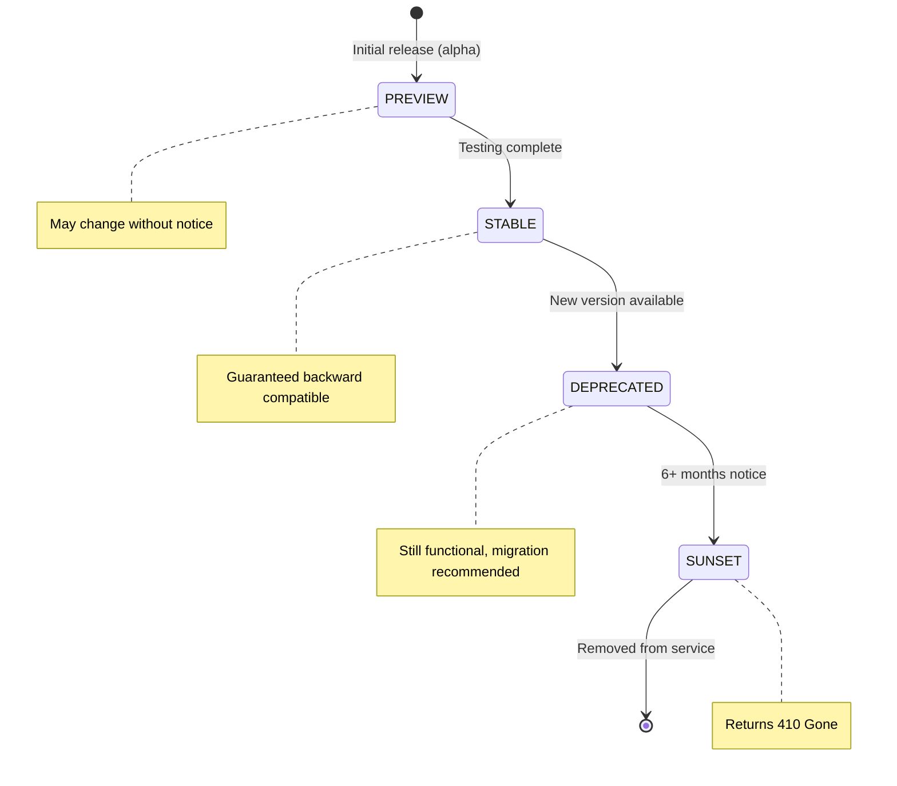
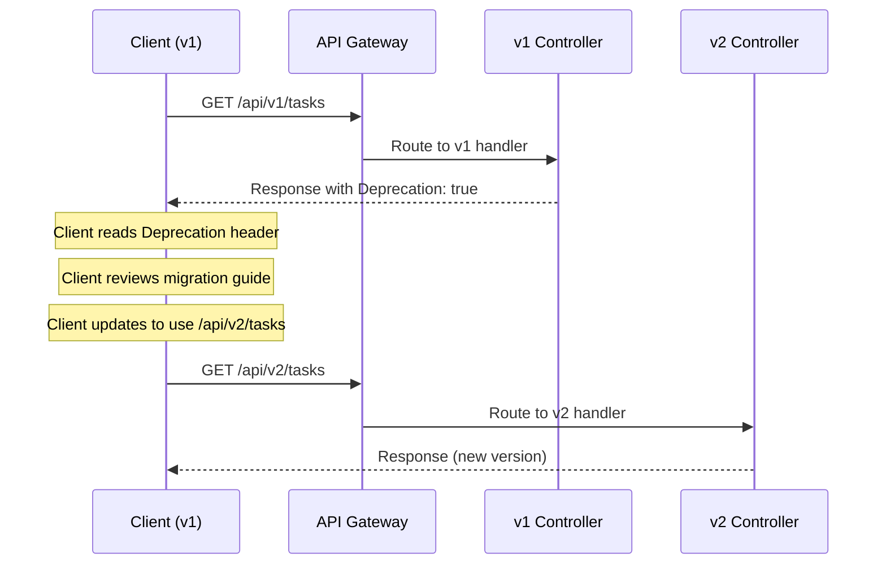

# API Versioning Strategy

## Document Control

| Field | Value |
|---|---|
| **Document ID** | ENG-VER-012 |
| **Version** | 1.0.0 |
| **Status** | Approved |
| **Date** | 2026-07-10 |
| **Classification** | Internal |
| **Owner** | Developer |

---

## 1. Executive Summary

Second Brain OS uses **URL-based versioning** for its REST API, with all endpoints under `/api/v1/`. This strategy provides explicit version selection for API consumers, enables backward-compatible additions within a version, and supports a clear lifecycle for introducing breaking changes under new versions. This document defines the versioning scheme, deprecation header conventions, backward compatibility rules, version lifecycle, and migration procedures.

---

## 2. Purpose

Define a predictable API versioning strategy that allows the API to evolve with breaking changes while minimizing disruption for existing consumers (frontend, mobile, AI agents, third-party integrations).

---

## 3. Scope

This document covers:
- URL-based versioning scheme (`/api/v1/`, `/api/v2/`)
- Deprecation headers (`Deprecation`, `Sunset`)
- Backward compatibility rules within a version
- Version lifecycle (preview → stable → deprecated → sunset)
- Migration guide between versions
- Current version status table
- Version communication to developers

Out of scope: REST conventions (see [REST.md](REST.md)), controller implementation (see [Controllers.md](Controllers.md)).

---

## 4. Business Context

The API currently has a single version (v1) with 31+ routers and ~80 endpoints. As Second Brain OS grows, breaking changes may be necessary for new features, database schema changes, or architectural improvements. The versioning strategy ensures existing clients continue to work while new clients can adopt improved APIs.

---

## 5. Functional Specification

### 5.1 URL-Based Versioning

```
/api/v1/tasks          # Current stable version
/api/v1/courses        # Current stable version
/api/v2/tasks          # Future breaking changes
```

**Rules:**
- Version is a single integer (`v1`, `v2`, `v3`), never decimal (`v1.1`)
- Version is the first path segment after `/api/`
- All endpoints within a version share the same prefix
- No unversioned endpoints (except `/health`)

### 5.2 Backward Compatibility Rules

Within a version (`v1`), the following changes are allowed:
- Adding new endpoints
- Adding optional request fields (with defaults)
- Adding optional response fields (clients must ignore unknown fields)
- Changing response field order
- Relaxing validation constraints

Breaking changes require a new version:
- Removing or renaming endpoints
- Removing or renaming request/response fields
- Making optional fields required
- Changing response types or formats
- Changing error codes or status code semantics
- Changing authentication requirements

### 5.3 Deprecation Headers

When an endpoint is moved to a deprecated version, all responses include:

```http
Deprecation: true
Sunset: Sat, 01 Jan 2027 00:00:00 GMT
```

| Header | Description | Example |
|---|---|---|
| `Deprecation` | Indicates this version is deprecated | `true` |
| `Sunset` | Date when this version will be removed | `Sat, 01 Jan 2027 00:00:00 GMT` |
| `Link` | Link to migration guide | `<https://docs.api.com/migration/v1-to-v2>; rel="deprecation"` |

---

## 6. Non-Functional Requirements

| Requirement | Target | Measurement |
|---|---|---|
| Deprecation notice period | Minimum 6 months | Date between Deprecation and Sunset |
| Backward-compatible releases | No breaking changes within version | CI validates response schema |
| Migration documentation | Published at Deprecation date | Doc existence check |
| Old version removal | Only after Sunset date | Calendar check |

---

## 7. Architecture

### 7.1 Version Lifecycle



### 5.2 Version Lifecycle Details

| Phase | Description | Behavior | Duration |
|---|---|---|---|
| **Preview** | Initial release for testing | May change without notice, `X-Version-Status: preview` header | 1-2 months |
| **Stable** | Fully supported | Guaranteed backward compatible, no breaking changes | Indefinite |
| **Deprecated** | Replacement available | Still functional, `Deprecation` + `Sunset` headers added | Min 6 months |
| **Sunset** | Removal completed | Returns `410 Gone` with link to replacement | N/A |

### 5.3 Router Registration with Version

```python
# apps/api/main.py
from app.api import tasks_v1, tasks_v2

app.include_router(tasks_v1.router, prefix="/api/v1/tasks", tags=["tasks"])
app.include_router(tasks_v2.router, prefix="/api/v2/tasks", tags=["tasks"])
```

---

## 8. Diagrams

### 8.1 Version Status Table

| Version | Status | Release Date | Sunset Date | Notes |
|---|---|---|---|---|
| `v1` | ✅ Active | 2026-06-01 | TBD | Current stable version |
| `v2` | 📋 Planned | TBD | TBD | Next major version (no date set) |

### 8.2 Migration Flow



---

## 9. Data Models

### 9.1 Version Status Response

```json
// GET /api/v1/version
{
  "current_version": "v1",
  "status": "active",
  "release_date": "2026-06-01",
  "sunset_date": null,
  "latest_version": "v1",
  "versions": [
    {
      "version": "v1",
      "status": "active",
      "release_date": "2026-06-01"
    }
  ],
  "deprecation_notice": null
}
```

---

## 10. APIs

### 10.1 Version Information Endpoint

| Method | Endpoint | Description |
|---|---|---|
| `GET` | `/api/v1/version` | Current version status and available versions |

---

## 11. Security

| Concern | Implementation |
|---|---|
| Old version vulnerabilities | Security patches backported to deprecated versions |
| Unversioned endpoint usage | Only `/health` is unversioned |
| Version sniffing | Version header not required (URL-based) |

---

## 12. Performance Targets

| Metric | Target |
|---|---|
| Version routing overhead | < 1ms |
| Migration guide page load | < 2s |
| No performance regression between versions | Within 5% of v1 baseline |

---

## 13. Edge Cases

| Edge Case | Handling |
|---|---|
| Client still uses deprecated version | Works; `Deprecation` header warns |
| Client uses future version number | 404 Not Found (no such route) |
| Client uses version without prefix | 404 (unversioned endpoints blocked) |
| Multiple active versions | Both serve concurrently during deprecation period |
| Security fix needed for deprecated version | Backport fix; release patch under old version |

---

## 14. Failure Scenarios

| Scenario | Impact | Recovery |
|---|---|---|
| Breaking change accidentally deployed to v1 | Client breakage | Immediate rollback; audit CI to prevent recurrence |
| Sunset version clients still calling | 410 Gone | Client reads response and migrates |
| Migration guide out of date | Client confusion | CI validates migration guide on release |

---

## 15. Risks & Mitigations

| Risk | Likelihood | Impact | Mitigation |
|---|---|---|---|
| Maintaining multiple versions adds complexity | Medium | Medium | Limit to 2 active versions at a time |
| Clients never migrate from deprecated version | Low | Medium | Enforce sunset date; communicate clearly |
| Breaking changes accidentally introduced in patch | Low | High | Strict CI: response schema diff between versions |

---

## 16. Acceptance Criteria

- [ ] All API endpoints are under `/api/v{number}/` prefix
- [ ] `/health` is the only unversioned endpoint
- [ ] Deprecated versions return `Deprecation` and `Sunset` headers
- [ ] `GET /api/v1/version` returns version status
- [ ] Migration guide published before Sunset date
- [ ] Max 2 concurrent versions (current + previous)
- [ ] Sunset version returns `410 Gone` after sunset date

---

## 17. Traceability

| Requirement ID | Source | Implementation |
|---|---|---|
| VER-01 | ADR-001 (API versioning) | URL-based `/api/v1/` prefix |
| VER-02 | ARCH-007 (Backward compatibility) | Non-breaking changes only within version |
| VER-03 | DEV-002 (Migration support) | Deprecation headers + migration guide |

---

## 18. Implementation Notes

1. Version is part of the URL path, never a query parameter or header
2. Router files can be named `tasks_v1.py`, `tasks_v2.py` for different versions
3. Shared logic between versions lives in service layer (never duplicated)
4. Migration guide published as markdown in `docs/engineering/migrations/`
5. CI validates that no breaking changes exist within a version by comparing OpenAPI specs

---

## 19. Testing Strategy

| Test Type | Coverage | Tools |
|---|---|---|
| Version routing tests | Both v1 and v2 routes work | TestClient |
| Deprecation header tests | `Deprecation` + `Sunset` present on deprecated versions | pytest |
| Migration guide tests | Guide exists for every deprecated version | CI file existence check |
| Breaking change detection | CI fails if v1 OpenAPI spec changes incompatibly | `openapi-diff` tool |

---

## 20. References

| Reference | Document |
|---|---|
| REST API Conventions | [REST.md](REST.md) |
| Controller Layer | [Controllers.md](Controllers.md) |
| Error Codes | [ErrorCodes.md](ErrorCodes.md) |
| Rate Limiting | [RateLimiting.md](RateLimiting.md) |

---

## Revision History

| Version | Date | Author | Changes |
|---|---|---|---|
| 1.0.0 | 2026-07-10 | Developer | Initial API versioning strategy documentation |
