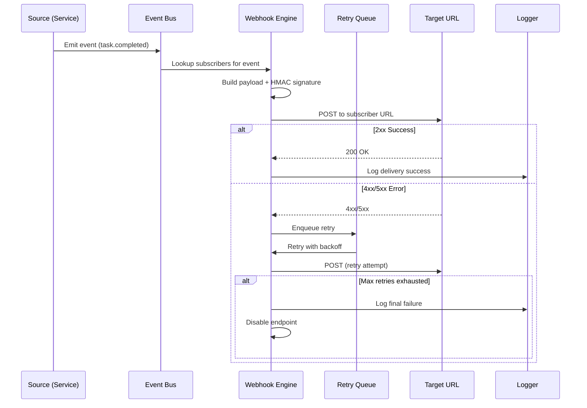
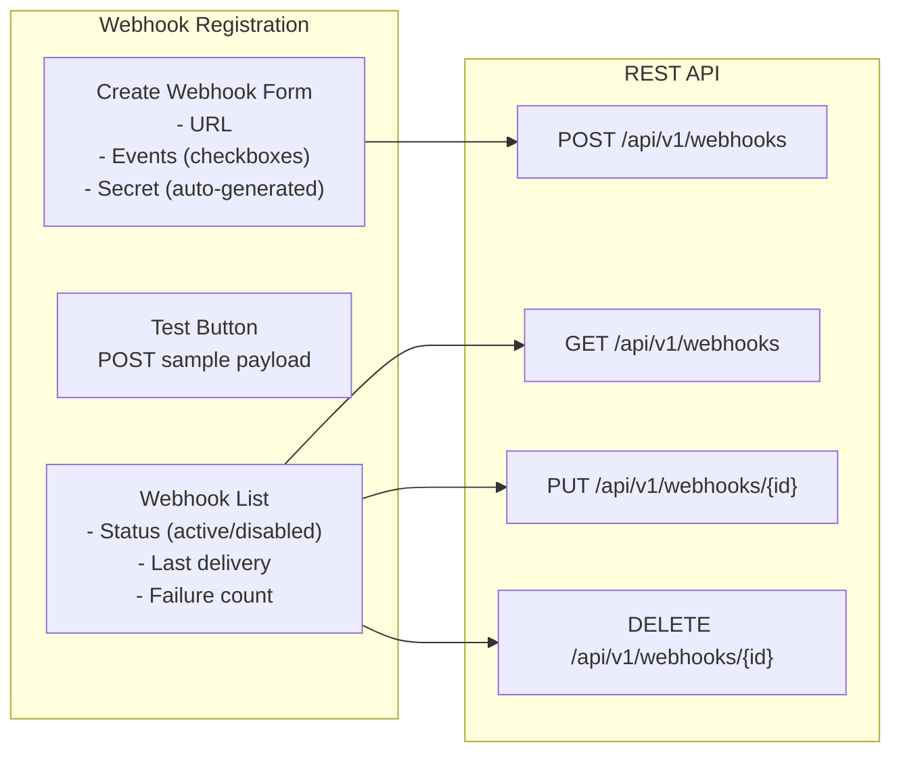

# Webhook System (Future)

## Document Control

| Field | Value |
|---|---|
| **Document ID** | ENG-WHK-009 |
| **Version** | 1.0.0 |
| **Status** | Approved |
| **Date** | 2026-07-10 |
| **Classification** | Internal |
| **Owner** | Developer |

---

## 1. Executive Summary

Second Brain OS does not currently implement a webhook system. This document defines the **future webhook architecture** for notifying external services when events occur (task completed, briefing generated, opportunity found). When implemented, the webhook system will enable integrations with Slack, Discord, Notion, Zapier, and custom endpoints — pushing real-time event notifications to subscribed URLs.

---

## 2. Purpose

Define a webhook architecture blueprint for future implementation, including event types, delivery mechanism, retry logic, payload format, signature verification, registration API, rate limiting, and observability.

---

## 3. Scope

This document covers:
- Webhook event types and payload schemas
- Webhook delivery mechanism (HTTP POST)
- Retry logic with exponential backoff
- Payload format and versioning
- HMAC signature verification
- Webhook registration CRUD API
- Rate limiting on delivery
- Webhook delivery logging and monitoring

Out of scope: REST API conventions (see [REST.md](REST.md)), queue architecture (see [QueueArchitecture.md](QueueArchitecture.md)), notification system.

---

## 4. Business Context

As Second Brain OS matures, users will want to pipe events to external services: post completed tasks to Notion, send daily briefings to Slack, or trigger Zapier workflows when opportunities are found. A webhook system provides a standardized push mechanism without requiring polling or custom integrations.

---

## 5. Functional Specification

### 5.1 Supported Event Types

| Event | Trigger | Payload | Priority |
|---|---|---|---|
| `task.completed` | Task marked complete | Task ID, title, category, completed_at | HIGH |
| `task.overdue` | Task becomes overdue | Task ID, title, due_date, missed_count | HIGH |
| `briefing.ready` | Daily briefing generated | Briefing ID, date, summary | MEDIUM |
| `opportunity.found` | New matching opportunity | Opportunity ID, title, match_score, deadline | MEDIUM |
| `habit.missed` | Habit not completed by 8 PM | Habit ID, title, current_streak | LOW |
| `weekly_review.ready` | Weekly review generated | Review ID, week_start, week_end | LOW |
| `goal.milestone_reached` | Goal progress milestone | Goal ID, title, progress_percent | MEDIUM |

### 5.2 Delivery Mechanism

```http
POST <subscriber_url> HTTP/1.1
Content-Type: application/json
X-Webhook-ID: wh_abc123
X-Webhook-Event: task.completed
X-Webhook-Signature: sha256=<hmac_hex>
X-Webhook-Timestamp: 2026-07-10T12:00:00Z

{
  "event": "task.completed",
  "event_id": "evt_abc123",
  "created_at": "2026-07-10T12:00:00Z",
  "data": {
    "task_id": "uuid",
    "title": "Finish React module",
    "category": "study",
    "completed_at": "2026-07-10T12:00:00Z"
  }
}
```

### 5.3 Retry Policy

| Attempt | Delay | Total Wait |
|---|---|---|
| 1 | 0s (immediate) | 0s |
| 2 | 10s | 10s |
| 3 | 30s | 40s |
| 4 | 60s | 100s |
| 5 | 300s (5 min) | 400s |
| 6+ | 600s (10 min) | Capped at 24h max |

After 24 hours of failures → webhook endpoint is **disabled** and owner notified.

---

## 6. Non-Functional Requirements

| Requirement | Target | Measurement |
|---|---|---|
| Delivery latency (first attempt) | < 5s | Enqueue → first POST |
| Retry total duration | < 24h | First attempt → disable |
| Signature verification | 100% of deliveries signed | Audit log |
| Delivery success rate | > 95% | Success / total deliveries |
| Max payload size | 64KB | Payload JSON size limit |

---

## 7. Architecture

### 7.1 Webhook Delivery Flow



### 7.2 Signature Verification

```python
import hmac
import hashlib

def generate_signature(secret: str, payload: dict, timestamp: str) -> str:
    message = f"{timestamp}.{json.dumps(payload, separators=(',', ':'))}"
    signature = hmac.new(
        secret.encode(),
        message.encode(),
        hashlib.sha256,
    ).hexdigest()
    return signature

def verify_signature(
    secret: str, payload: dict, timestamp: str, signature: str
) -> bool:
    expected = generate_signature(secret, payload, timestamp)
    return hmac.compare_digest(expected, signature)
```

---

## 8. Diagrams

### 8.1 Webhook Registration UI



---

## 9. Data Models

### 9.1 Webhook Registration Schema

```sql
CREATE TABLE webhook_registrations (
    id              UUID PRIMARY KEY DEFAULT gen_random_uuid(),
    user_id         UUID NOT NULL REFERENCES users(id),
    url             TEXT NOT NULL,
    secret          TEXT NOT NULL,  -- HMAC secret
    events          TEXT[] NOT NULL,  -- Array of event types
    status          TEXT NOT NULL DEFAULT 'active',  -- active | disabled
    retry_count     INTEGER DEFAULT 0,
    last_delivery   TIMESTAMPTZ,
    last_failure    TIMESTAMPTZ,
    failure_reason  TEXT,
    created_at      TIMESTAMPTZ DEFAULT NOW(),
    updated_at      TIMESTAMPTZ DEFAULT NOW()
);

CREATE TABLE webhook_deliveries (
    id              UUID PRIMARY KEY DEFAULT gen_random_uuid(),
    webhook_id      UUID NOT NULL REFERENCES webhook_registrations(id),
    event_id        TEXT NOT NULL,
    event_type      TEXT NOT NULL,
    payload         JSONB NOT NULL,
    status          TEXT NOT NULL DEFAULT 'pending',  -- pending | success | failed
    status_code     INTEGER,
    response_body   TEXT,
    attempt         INTEGER NOT NULL DEFAULT 1,
    next_retry_at   TIMESTAMPTZ,
    completed_at    TIMESTAMPTZ,
    created_at      TIMESTAMPTZ DEFAULT NOW()
);
```

### 9.2 Payload Schema

```json
{
  "event": "task.completed",
  "event_id": "evt_abc123",
  "created_at": "2026-07-10T12:00:00Z",
  "webhook_version": "1.0",
  "data": {
    "task_id": "uuid",
    "title": "Finish React module",
    "category": "study",
    "status": "completed",
    "completed_at": "2026-07-10T12:00:00Z"
  }
}
```

---

## 10. APIs

### 10.1 Webhook CRUD Endpoints

| Method | Endpoint | Description |
|---|---|---|
| `GET` | `/api/v1/webhooks` | List user's webhooks |
| `POST` | `/api/v1/webhooks` | Register webhook |
| `GET` | `/api/v1/webhooks/{id}` | Get webhook details |
| `PUT` | `/api/v1/webhooks/{id}` | Update webhook |
| `DELETE` | `/api/v1/webhooks/{id}` | Delete webhook |
| `POST` | `/api/v1/webhooks/{id}/test` | Send test payload |
| `GET` | `/api/v1/webhooks/{id}/deliveries` | Delivery history |

---

## 11. Security

| Concern | Implementation |
|---|---|
| Payload tampering | HMAC-SHA256 signature per delivery |
| Replay attacks | Timestamp in signature; reject > 5min old |
| Secret storage | Hashed before storage; never returned |
| URL validation | Reject internal IPs, localhost, private ranges |
| Rate limiting | Max 10 deliveries/min per webhook |
| Disable on abuse | Auto-disable after 10 consecutive failures |

---

## 12. Performance Targets

| Metric | Target |
|---|---|
| Delivery latency (first attempt) | < 5s |
| Payload generation overhead | < 50ms |
| Retry queue throughput | 100 retries/min |
| Signature generation | < 10ms |

---

## 13. Edge Cases

| Edge Case | Handling |
|---|---|
| Target URL unreachable | Retry with backoff; disable after 24h |
| Target returns 4xx | Log; disable on repeated 4xx (client error) |
| Target returns 5xx | Retry (server error may be transient) |
| Payload exceeds size limit | Truncate large fields; log warning |
| Duplicate event delivery | Include `event_id` for idempotency |
| Webhook deleted mid-delivery | Skip delivery gracefully |

---

## 14. Failure Scenarios

| Scenario | Impact | Recovery |
|---|---|---|
| All retries exhausted | Webhook disabled | Notify owner via email |
| HMAC secret leaked | Rotate secret via UI | Re-sign all subsequent deliveries |
| Target URL becomes malicious | User can disable via UI | Rate limiting prevents abuse |
| Webhook engine crashes | Deliveries queued in `webhook_deliveries` | Resume on restart |

---

## 15. Risks & Mitigations

| Risk | Likelihood | Impact | Mitigation |
|---|---|---|---|
| Webhook system adds complexity | Medium | Low | Implement only when demand exists |
| External service dependency | Low | Medium | Graceful degradation if webhook delivery fails |
| Security breach via webhook | Low | High | URL validation, signature verification, rate limiting |

---

## 16. Acceptance Criteria

- [ ] Webhook registration CRUD API is implemented
- [ ] Events are properly classified and emitted
- [ ] Payloads are HMAC-signed with timestamp
- [ ] Retry policy implements exponential backoff
- [ ] Auto-disable after 24 hours of failure
- [ ] Delivery history is stored for audit
- [ ] Admin endpoint for monitoring webhook health

---

## 17. Traceability

| Requirement ID | Source | Implementation |
|---|---|---|
| WHK-01 | INT-001 (External integration) | Webhook delivery to external URLs |
| WHK-02 | SEC-006 (Payload signing) | HMAC-SHA256 signature |
| WHK-03 | REL-003 (Delivery reliability) | Retry with backoff |

---

## 18. Implementation Notes

1. Webhook delivery uses the queue architecture (see [QueueArchitecture.md](QueueArchitecture.md))
2. Events are emitted synchronously; delivery is async
3. Secret is auto-generated on webhook creation (32-byte random hex)
4. Never expose the secret in GET responses (masked)
5. Test endpoint sends a sample `ping` event for validation

---

## 19. Testing Strategy

| Test Type | Coverage | Tools |
|---|---|---|
| Signature tests | HMAC generation + verification | pytest |
| Delivery tests | Success, 4xx, 5xx, timeout scenarios | pytest + httpx mock |
| Retry tests | Exponential backoff timing | pytest |
| Registration tests | CRUD operations | pytest + TestClient |
| Security tests | URL injection, secret exposure | pytest |

---

## 20. References

| Reference | Document |
|---|---|
| Queue Architecture | [QueueArchitecture.md](QueueArchitecture.md) |
| REST API Conventions | [REST.md](REST.md) |
| Error Codes | [ErrorCodes.md](ErrorCodes.md) |
| Security Architecture | [Security](../security/24_Security.md) |

---

## Revision History

| Version | Date | Author | Changes |
|---|---|---|---|
| 1.0.0 | 2026-07-10 | Developer | Initial webhook architecture documentation |
