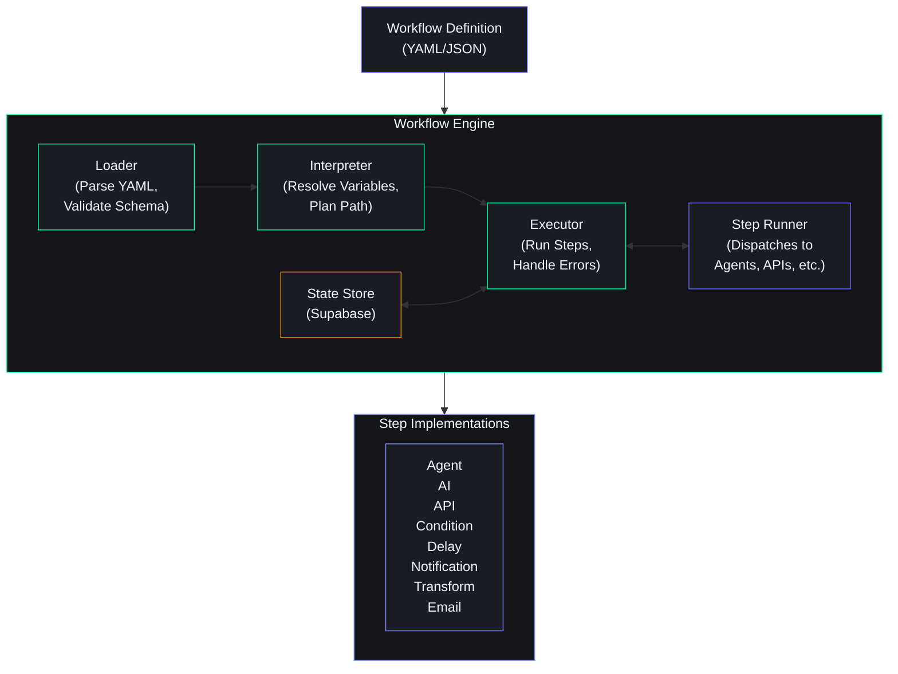
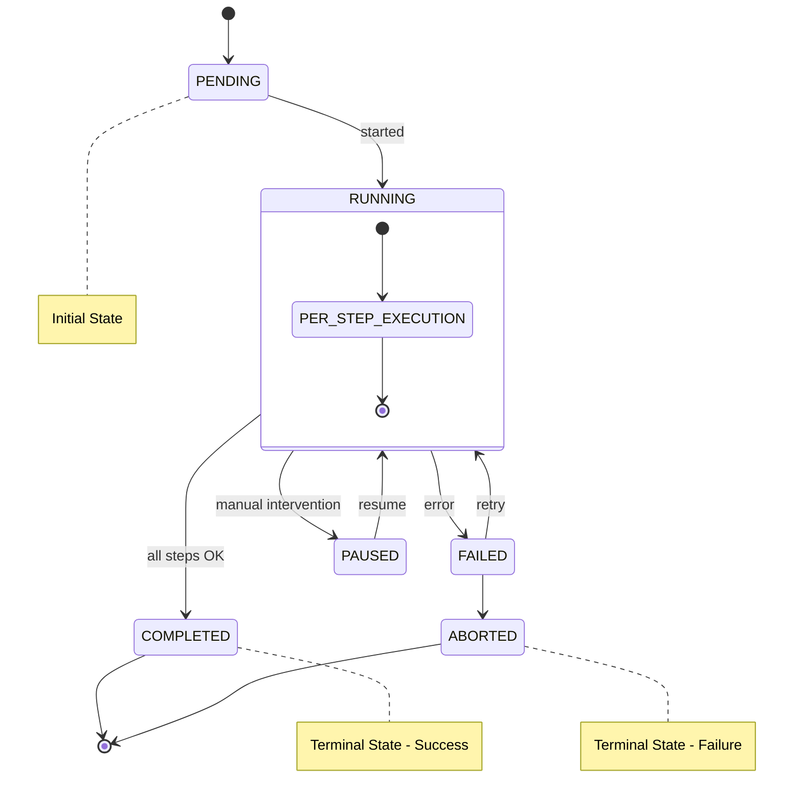
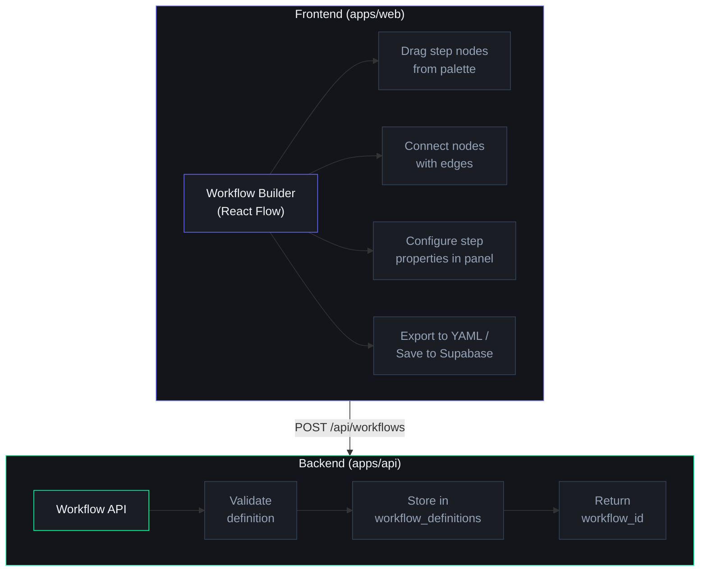

# Workflow Engine

## Document Control

| Property | Value |
|---|---|
| **Document ID** | ENG-WFE-001 |
| **Version** | 1.0.0 |
| **Status** | Draft |
| **Author** | AI Engineering Team |
| **Last Updated** | 2026-07-11 |
| **Approved By** | — |
| **Supersedes** | — |

---

## 1. Executive Summary

A workflow engine is the runtime that executes multi-step, stateful sequences of operations — called workflows — on behalf of the user or the system. In Second Brain OS, workflows power every automated process: the daily briefing, habit checks, weekly reviews, opportunity scanning, memory consolidation, and agent-to-agent coordination.

**Why a workflow engine matters:**

- **From hard-coded to declarative**: Currently, every automated sequence is hard-coded in Python (e.g., the Briefing Agent hard-codes check tasks → check sleep → check learning → compose). This is brittle — changing a sequence requires code changes, redeployment, and risk of breaking unrelated logic.
- **Observability**: A workflow engine provides built-in tracing, timing, and failure tracking for every step. Currently, if a step fails, the entire sequence fails silently or raises an unhandled exception.
- **Retry and recovery**: A workflow engine handles retries, backoff, and state persistence automatically. Currently, if the Briefing Agent crashes mid-way, there is no resume — the user gets nothing.
- **User-facing workflows**: Beyond system automation, the workflow engine powers user-facing flows like Onboard new user (5 steps across 3 agents) or Weekly review (7 steps across 4 agents).

This document defines the workflow types, the current state (no engine), the workflow definition format, engine architecture, step catalog, state management, error handling, observability, and the future vision for a visual workflow builder.

---

## 2. Workflow Types

The system supports four categories of workflows:

### 2.1 User Workflows

Triggered by user action. Run synchronously (blocking) or asynchronously (acknowledged, then continues in background).

| Workflow | Trigger | Steps | Duration |
|---|---|---|---|
| Onboarding | New user signs up | 5 | ~2 minutes |
| Daily check-in | User says Good morning | 3 | ~5 seconds |
| Weekly review | User requests review | 7 | ~30 seconds |
| Goal creation | User creates a goal | 4 | ~3 seconds |
| Opportunity apply | User applies to opportunity | 3 | ~1 second |

### 2.2 System Workflows

Triggered by system events or schedules. Run asynchronously in background.

| Workflow | Trigger | Steps | Frequency |
|---|---|---|---|
| Daily briefing generation | APScheduler (6 AM) | 5 | Daily |
| Memory consolidation | After user session ends | 3 | Per session |
| Data health check | APScheduler (daily) | 2 | Daily |
| Content backfill | On embedding model upgrade | 2 | On demand |

### 2.3 Agent Workflows

Triggered by agent-to-agent coordination. An agent may invoke a workflow as part of its processing.

| Workflow | Trigger | Steps | Use Case |
|---|---|---|---|
| Learning progress check | Learning Agent detects lagging course | 3 | Notify + reschedule |
| Opportunity match | Radar Agent finds new opportunity | 4 | Score → notify → store |
| Task escalation | Task Agent detects overdue task | 3 | Check → move → notify |

### 2.4 Scheduled Workflows

Recurring workflows managed by APScheduler (per ADR-006).

| Workflow | Schedule | Steps | Purpose |
|---|---|---|---|
| Daily briefing | Every day at 6:00 AM | 5 | Generate and deliver morning briefing |
| Habit check | Every day at 9:00 PM | 3 | Check habits, send summary |
| Opportunity scan | Every 6 hours | 4 | Scan external sources for new matches |
| Radar scan | Every 6 hours | 3 | Aggregate signals from GitHub, news, job boards |
| Memory consolidation | Every 12 hours | 2 | Summarize recent chat history |
| Vector reindex | Weekly on Sunday 3 AM | 1 | Rebuild vector indexes |
| Orphan cleanup | Weekly on Sunday 4 AM | 1 | Clean up orphan vectors |

---

## 3. Current State: No Workflow Engine

Currently, Second Brain OS has **no workflow engine**. Automated sequences are implemented as hard-coded Python functions with sequential agent calls, inline error handling, and no state persistence.

### Current Implementation (Anti-Pattern)

```python
# apps/api/app/services/daily_briefing.py
# Hard-coded workflow — no engine, no state, no resume

async def generate_daily_briefing(user_id: str):
    """Generates the daily briefing. One big function."""
    try:
        tasks = await task_agent.get_tasks_due_today(user_id)
        if not tasks:
            tasks = []

        sleep = await sleep_agent.get_sleep_score(user_id)
        if not sleep:
            sleep = {"score": None}

        progress = await learning_agent.get_progress(user_id)
        opportunities = await opportunity_agent.get_recent_matches(user_id)

        prompt = load_prompt("briefing-daily", "==1.0.0")
        briefing = await claude_client.generate(
            prompt.format(
                user_name=user_name,
                tasks_today=tasks,
                sleep_score=sleep["score"],
                goal_progress=progress,
                opportunities=opportunities,
            )
        )

        await store_briefing(user_id, briefing)
        await deliver_notification(user_id, briefing)
        return briefing

    except Exception as e:
        logger.error(f"Daily briefing failed: {e}")
        return None  # User gets nothing
```

### Problems

1. **No observability**: If step 3 fails, we know the briefing failed, but not which step, or how long each step took.
2. **No retry**: If step 2's LLM call times out, the entire workflow fails. No retry mechanism.
3. **No state persistence**: If the process crashes mid-way, there is no record of partial completion. State is lost.
4. **No reuse**: The patterns in this function (sequential agent calls, error handling) are duplicated across every workflow.
5. **Monolithic**: Adding a step requires editing this function, risking regression on unrelated steps.

---

## 4. Workflow Definition Format

Workflows are defined declaratively in YAML or JSON. A workflow definition specifies the sequence of steps, their inputs/outputs, transitions, conditions, and error handling.

### Workflow Definition Example

```yaml
# workflows/briefing-daily.yaml
id: briefing-daily
name: Daily Briefing
description: Generates and delivers the personalized daily briefing
version: 1.0.0
author: AI Engineering
trigger:
  type: schedule
  cron: "0 6 * * *"
  timezone: Asia/Kolkata
max_retries: 2
timeout_minutes: 5

steps:
  - id: collect-tasks
    name: Collect tasks due today
    type: agent
    agent_id: task
    input:
      action: get_tasks_due_today
      include_overdue: true
    output: tasks

  - id: collect-sleep
    name: Get sleep score
    type: agent
    agent_id: sleep
    input:
      action: get_latest_score
    output: sleep
    timeout_seconds: 5

  - id: collect-learning
    name: Get learning progress
    type: agent
    agent_id: learning
    input:
      action: get_progress_summary
    output: learning

  - id: generate-briefing
    name: Generate briefing text
    type: ai
    prompt_id: briefing-daily
    prompt_version: "==1.1.0"
    input:
      user_name: "${context.user_name}"
      tasks_today: "${steps.collect-tasks.output}"
      sleep_score: "${steps.collect-sleep.output.score}"
      goal_progress: "${steps.collect-learning.output}"
    output: briefing_text
    timeout_seconds: 30

  - id: store-briefing
    name: Store briefing in database
    type: api
    method: POST
    endpoint: /api/briefings
    body:
      user_id: "${context.user_id}"
      briefing_text: "${steps.generate-briefing.output}"
    output: stored_briefing

  - id: deliver-notification
    name: Send push notification
    type: notification
    channel: push
    title: "Your Daily Briefing"
    body: "${steps.generate-briefing.output.summary}"
    target_user: "${context.user_id}"
    condition:
      - step: generate-briefing
        output_exists: true
```

### Formal Schema

```yaml
# Top-level fields
id: string (required, unique)
name: string (required)
description: string
version: semver (required)
author: string

# Trigger
trigger:
  type: enum [manual, schedule, event, agent]
  cron: string (required if type=schedule)
  event: string (required if type=event)
  agent_id: string (required if type=agent)
  timezone: string

# Execution settings
max_retries: integer (default: 0)
timeout_minutes: integer (default: 10)
concurrency: integer (default: 1)

# Steps (ordered array)
steps:
  - id: string (required, unique within workflow)
    name: string
    type: enum [agent, ai, api, condition, delay, notification, transform, email, subworkflow]

    # Agent-specific
    agent_id: string (required if type=agent)
    input: object (required if type=agent)

    # AI-specific
    prompt_id: string (required if type=ai)
    prompt_version: string
    model: string
    temperature: float
    max_tokens: integer

    # API-specific
    method: enum [GET, POST, PUT, PATCH, DELETE] (required if type=api)
    endpoint: string (required if type=api)
    headers: object
    body: object

    # Condition-specific
    condition: object (required if type=condition)
    if_true: string (step id to jump to)
    if_false: string (step id to jump to)

    # Notification-specific
    channel: enum [push, email, in_app] (required if type=notification)
    title: string
    body: string
    target_user: string

    # Transform-specific
    transform: string (JavaScript expression or JSONata expression)

    # Common fields
    output: string (variable name to store result)
    timeout_seconds: integer (default: 30)
    retry_count: integer (default: 0)
    retry_delay_seconds: integer (default: 5)
    on_failure: enum [abort, skip, retry, jump]
    jump_to: string (step id, required if on_failure=jump)
```

---

## 5. Workflow Engine Architecture

The Workflow Engine reads a workflow definition, interprets the steps, executes them in order (with support for branching, conditions, and parallel execution), persists state at each step, and handles errors according to the definition.

### Architecture Diagram



### Engine Components

#### 5.1 Workflow Loader

Parses and validates the YAML/JSON definition against a JSON Schema. Returns a validated `WorkflowDefinition` object.

```python
# packages/workflow/loader.py
import yaml
import json
from jsonschema import validate, ValidationError

class WorkflowLoader:
    def __init__(self, schema_path: str = "workflows/workflow.schema.json"):
        with open(schema_path) as f:
            self.schema = json.load(f)

    def load(self, path: str) -> WorkflowDefinition:
        with open(path) as f:
            data = yaml.safe_load(f)
        try:
            validate(instance=data, schema=self.schema)
        except ValidationError as e:
            raise WorkflowValidationError(f"Invalid workflow definition: {e}")
        return WorkflowDefinition(**data)

    def load_from_db(self, workflow_id: str) -> WorkflowDefinition:
        result = await supabase.from_("workflow_definitions") \
            .select("*") \
            .eq("id", workflow_id) \
            .single() \
            .execute()
        return WorkflowDefinition(**result.data["definition"])
```

#### 5.2 Workflow Interpreter

Resolves variable references (`${steps.step_id.output}`), evaluates conditions, and determines the execution path.

```python
# packages/workflow/interpreter.py
class WorkflowInterpreter:
    def __init__(self, definition: WorkflowDefinition, context: dict):
        self.definition = definition
        self.context = context
        self.step_results = {}

    def resolve_variables(self, template: str | dict | list) -> any:
        if isinstance(template, str):
            return self._resolve_string(template)
        if isinstance(template, dict):
            return {k: self.resolve_variables(v) for k, v in template.items()}
        if isinstance(template, list):
            return [self.resolve_variables(item) for item in template]
        return template

    def _resolve_string(self, value: str) -> str:
        import re
        def replace_var(match):
            path = match.group(1)
            parts = path.split(".")
            current = self.context if parts[0] == "context" else self.step_results
            for part in parts[1:]:
                current = current.get(part, "")
            return str(current)
        return re.sub(r"\$\{([^}]+)\}", replace_var, value)

    def get_next_step(self, current_step_id: str, condition_result: bool | None = None) -> str | None:
        steps = self.definition.steps
        current_index = next(i for i, s in enumerate(steps) if s.id == current_step_id)
        current_step = steps[current_index]

        if current_step.type == "condition":
            if condition_result and current_step.if_true:
                return current_step.if_true
            elif not condition_result and current_step.if_false:
                return current_step.if_false

        if current_index + 1 < len(steps):
            return steps[current_index + 1].id
        return None
```

#### 5.3 Workflow Executor

The runtime loop that executes steps, handles errors, persists state, and reports progress.

```python
# packages/workflow/executor.py
class WorkflowExecutor:
    def __init__(self, loader, interpreter, state_store, step_runner):
        self.loader = loader
        self.interpreter = interpreter
        self.state_store = state_store
        self.step_runner = step_runner

    async def execute(self, workflow_id: str, user_id: str, context: dict | None = None):
        definition = await self.loader.load_from_db(workflow_id)

        instance = WorkflowInstance(
            id=str(uuid.uuid4()),
            workflow_id=workflow_id,
            user_id=user_id,
            status="running",
            context=context or {},
            current_step=definition.steps[0].id if definition.steps else None,
            step_results={},
            created_at=datetime.utcnow(),
        )
        await self.state_store.create_instance(instance)

        interpreter = WorkflowInterpreter(definition, context)
        current_step = definition.steps[0] if definition.steps else None

        while current_step:
            try:
                resolved_input = interpreter.resolve_variables(current_step.input or {})
                result = await self.step_runner.run(current_step, resolved_input, instance)
                instance.step_results[current_step.id] = result
                await self.state_store.update_step_result(instance.id, current_step.id, result)

                next_id = interpreter.get_next_step(current_step.id)
                instance.current_step = next_id
                await self.state_store.update_current_step(instance.id, next_id)
                current_step = next((s for s in definition.steps if s.id == next_id), None)

            except WorkflowError as e:
                action = await self._handle_error(instance, current_step, e)
                if action == "abort":
                    instance.status = "failed"
                    instance.error = str(e)
                    await self.state_store.update_status(instance.id, "failed", str(e))
                    return
                elif action == "skip":
                    current_step = next((s for s in definition.steps if s.id != current_step.id), None)
                elif action == "retry":
                    pass

        instance.status = "completed"
        instance.completed_at = datetime.utcnow()
        await self.state_store.update_status(instance.id, "completed")
```

#### 5.4 Step Runner

Dispatches each step to the appropriate handler based on step type.

```python
# packages/workflow/step_runner.py
class StepRunner:
    def __init__(self, agent_registry, ai_client, api_client, notification_service):
        self.agent_registry = agent_registry
        self.ai_client = ai_client
        self.api_client = api_client
        self.notification_service = notification_service

    async def run(self, step, resolved_input, instance) -> dict:
        start = time.monotonic()

        match step.type:
            case "agent":
                agent = self.agent_registry.get(step.agent_id)
                result = await agent.execute(instance.user_id, resolved_input)
            case "ai":
                prompt = load_prompt(step.prompt_id, step.prompt_version)
                resolved_prompt = prompt.format(**resolved_input)
                result = await self.ai_client.generate(
                    model=step.model or "ollama/llama3",
                    prompt=resolved_prompt,
                    max_tokens=step.max_tokens or 1024,
                    temperature=step.temperature or 0.7,
                )
            case "api":
                result = await self.api_client.request(
                    method=step.method,
                    url=step.endpoint,
                    headers=step.headers or {},
                    json=resolved_input,
                )
            case "notification":
                result = await self.notification_service.send(
                    channel=step.channel,
                    title=step.title,
                    body=step.body,
                    user_id=step.target_user,
                )
            case "delay":
                await asyncio.sleep(step.duration_seconds or 10)
                result = {"slept": step.duration_seconds}
            case "transform":
                result = self._execute_transform(step.transform, resolved_input)
            case _:
                raise WorkflowError(f"Unknown step type: {step.type}")

        elapsed = int((time.monotonic() - start) * 1000)
        return {"output": result, "latency_ms": elapsed, "timestamp": datetime.utcnow().isoformat()}
```

---

## 6. Workflow Steps Catalog

### 6.1 Available Step Types

| Step Type | ID | Description | Dependencies |
|---|---|---|---|
| **Agent** | `agent` | Calls an ARIA sub-agent | Agent Registry |
| **AI** | `ai` | Makes an LLM call with a specific prompt | Ollama/Claude client |
| **API** | `api` | Makes an HTTP request to an internal or external API | HTTP client |
| **Condition** | `condition` | Evaluates a conditional expression | Expression evaluator |
| **Delay** | `delay` | Pauses execution for a specified duration | asyncio |
| **Notification** | `notification` | Sends a push/email/in-app notification | Notification Service |
| **Transform** | `transform` | Transforms data using JSONata or JS expressions | Expression engine |
| **Email** | `email` | Sends an email | Email service (SMTP/SendGrid) |
| **Subworkflow** | `subworkflow` | Calls another workflow as a step | Workflow Engine |

### 6.2 Step Definitions (Detailed)

#### Agent Step

```yaml
- id: check-habits
  type: agent
  agent_id: habit
  input:
    action: check_streaks
    date: "${context.current_date}"
  output: habit_status
  timeout_seconds: 10
  retry_count: 1
  on_failure: skip
```

#### AI Step

```yaml
- id: generate-summary
  type: ai
  prompt_id: memory-summarizer
  prompt_version: "==1.1.0"
  model: claude-haiku-3.5
  temperature: 0.3
  max_tokens: 1024
  input:
    messages: "${steps.collect-messages.output}"
  output: summary
  timeout_seconds: 15
```

#### API Step

```yaml
- id: call-supabase
  type: api
  method: POST
  endpoint: "${env.SUPABASE_URL}/rest/v1/rpc/some_function"
  headers:
    Content-Type: application/json
    apikey: "${env.SUPABASE_KEY}"
  body:
    user_id: "${context.user_id}"
  output: api_result
```

#### Condition Step

```yaml
- id: check-overdue
  type: condition
  condition: "${steps.collect-tasks.output.overdue_count > 0}"
  if_true: send-overdue-notification
  if_false: check-learning
```

#### Delay Step

```yaml
- id: wait-for-processing
  type: delay
  duration_seconds: 30
```

#### Notification Step

```yaml
- id: send-push
  type: notification
  channel: push
  title: "Study Reminder"
  body: "Time for your daily DSA practice!"
  target_user: "${context.user_id}"
```

#### Transform Step

```yaml
- id: format-results
  type: transform
  transform: |
    {
      "summary": steps.collect-learning.output.summary,
      "courses": steps.collect-learning.output.courses.map(c => ({
        name: c.name,
        progress: c.progress_pct + "%"
      }))
    }
  output: formatted
```

---

## 7. State Management

Every workflow execution creates a **workflow instance** that persists its state in Supabase. This enables resume after crash, observability, and manual intervention.

### Database Schema

```sql
CREATE TABLE workflow_instances (
    id UUID PRIMARY KEY DEFAULT gen_random_uuid(),
    workflow_id VARCHAR(128) NOT NULL,
    workflow_version VARCHAR(16) NOT NULL,
    user_id UUID NOT NULL REFERENCES users(id) ON DELETE CASCADE,
    status VARCHAR(16) NOT NULL DEFAULT 'pending',
    -- status: pending | running | paused | completed | failed | aborted
    current_step VARCHAR(128),
    context JSONB DEFAULT '{}',
    step_results JSONB DEFAULT '{}',
    error TEXT,
    retry_count INTEGER DEFAULT 0,
    created_at TIMESTAMPTZ DEFAULT NOW(),
    started_at TIMESTAMPTZ,
    completed_at TIMESTAMPTZ,
    updated_at TIMESTAMPTZ DEFAULT NOW()
);

CREATE INDEX idx_workflow_instances_user ON workflow_instances (user_id);
CREATE INDEX idx_workflow_instances_status ON workflow_instances (status);
CREATE INDEX idx_workflow_instances_workflow ON workflow_instances (workflow_id);

CREATE TABLE workflow_step_logs (
    id UUID PRIMARY KEY DEFAULT gen_random_uuid(),
    instance_id UUID NOT NULL REFERENCES workflow_instances(id) ON DELETE CASCADE,
    step_id VARCHAR(128) NOT NULL,
    step_type VARCHAR(32) NOT NULL,
    status VARCHAR(16) NOT NULL,
    input JSONB,
    output JSONB,
    error TEXT,
    latency_ms INTEGER,
    retry_attempt INTEGER DEFAULT 0,
    started_at TIMESTAMPTZ,
    completed_at TIMESTAMPTZ
);

CREATE INDEX idx_workflow_step_logs_instance ON workflow_step_logs (instance_id);
```

### State Transitions



### State Store Implementation

```python
# packages/workflow/state_store.py
class WorkflowStateStore:
    def __init__(self, supabase):
        self.supabase = supabase

    async def create_instance(self, instance):
        await self.supabase.from_("workflow_instances") \
            .insert(instance.dict()) \
            .execute()

    async def update_status(self, instance_id, status, error=None):
        update = {"status": status, "updated_at": datetime.utcnow().isoformat()}
        if status in ("running",):
            update["started_at"] = datetime.utcnow().isoformat()
        if status in ("completed", "failed", "aborted"):
            update["completed_at"] = datetime.utcnow().isoformat()
        if error:
            update["error"] = error
        await self.supabase.from_("workflow_instances") \
            .update(update) \
            .eq("id", instance_id) \
            .execute()

    async def update_current_step(self, instance_id, step_id):
        await self.supabase.from_("workflow_instances") \
            .update({"current_step": step_id, "updated_at": datetime.utcnow().isoformat()}) \
            .eq("id", instance_id) \
            .execute()

    async def update_step_result(self, instance_id, step_id, result):
        await self.supabase.from_("workflow_instances") \
            .update({
                "step_results": self.supabase.raw(
                    f"step_results || '{{\\\"{step_id}\\\": {json.dumps(result)}}}'::jsonb"
                ),
                "updated_at": datetime.utcnow().isoformat(),
            }) \
            .eq("id", instance_id) \
            .execute()

    async def get_instance(self, instance_id):
        result = await self.supabase.from_("workflow_instances") \
            .select("*") \
            .eq("id", instance_id) \
            .single() \
            .execute()
        return WorkflowInstance(**result.data) if result.data else None

    async def get_active_instances(self, user_id):
        result = await self.supabase.from_("workflow_instances") \
            .select("*") \
            .eq("user_id", user_id) \
            .in_("status", ["pending", "running", "paused"]) \
            .execute()
        return [WorkflowInstance(**row) for row in result.data]

    async def log_step(self, instance_id, log):
        await self.supabase.from_("workflow_step_logs") \
            .insert(log.dict()) \
            .execute()
```

---

## 8. Error Handling

Each step can define its failure behavior. The engine supports four error handling strategies:

### 8.1 Retry with Backoff

```yaml
- id: call-external-api
  type: api
  method: GET
  endpoint: https://api.example.com/data
  retry_count: 3
  retry_delay_seconds: 5
  retry_backoff: exponential
  on_failure: retry
```

Implementation:

```python
async def run_with_retry(self, step, resolved_input, instance):
    last_error = None
    for attempt in range(step.retry_count + 1):
        try:
            return await self.run(step, resolved_input, instance)
        except (TimeoutError, HTTPError, AgentError) as e:
            last_error = e
            if attempt < step.retry_count:
                delay = step.retry_delay_seconds * (2 ** attempt)
                logger.warning(f"Step {step.id} failed (attempt {attempt+1}), retrying in {delay}s")
                await asyncio.sleep(delay)
    raise WorkflowStepError(f"Step {step.id} failed after {step.retry_count + 1} attempts: {last_error}")
```

### 8.2 Skip Step

```yaml
- id: optional-step
  type: agent
  agent_id: opportunity
  on_failure: skip  # Continue workflow, skip this step
```

### 8.3 Abort Workflow

```yaml
- id: critical-step
  type: ai
  prompt_id: essential-processing
  on_failure: abort  # Stop the entire workflow
```

### 8.4 Jump to Step

```yaml
- id: validate-input
  type: condition
  condition: "${steps.validate-input.output.valid == true}"
  if_true: continue-processing
  if_false: abort-early
  on_failure: jump
  jump_to: handle-validation-error
```

### 8.5 Circuit Breaker

Same circuit breaker pattern as the Agent Orchestration layer wraps workflow execution:

```python
# In services/scheduler/main.py
circuit_breaker = CircuitBreaker(threshold=3, recovery_time=300)

async def run_scheduled_workflow(workflow_id, user_id):
    if circuit_breaker.is_open(workflow_id):
        logger.warning(f"Workflow {workflow_id} circuit breaker open, skipping")
        return
    try:
        await workflow_engine.execute(workflow_id, user_id)
        circuit_breaker.record_success(workflow_id)
    except Exception as e:
        circuit_breaker.record_failure(workflow_id)
        logger.error(f"Workflow {workflow_id} failed: {e}")
```

### 8.6 Manual Intervention

If a workflow enters a `failed` or `paused` state, an admin or the user can intervene:

```python
@router.post("/workflows/{instance_id}/retry")
async def retry_workflow(instance_id, from_step = None):
    instance = await state_store.get_instance(instance_id)
    instance.status = "running"
    instance.error = None
    instance.current_step = from_step or instance.current_step
    await state_store.update_status(instance_id, "running")

@router.post("/workflows/{instance_id}/abort")
async def abort_workflow(instance_id):
    await state_store.update_status(instance_id, "aborted")

@router.post("/workflows/{instance_id}/pause")
async def pause_workflow(instance_id):
    await state_store.update_status(instance_id, "paused")
```

---

## 9. Workflow Examples

### Example 1: Daily Briefing Workflow

```yaml
id: briefing-daily
name: Daily Briefing
version: 1.0.0
trigger:
  type: schedule
  cron: "0 6 * * *"
steps:
  - id: collect-tasks
    type: agent
    agent_id: task
    input:
      action: get_tasks_due_today
      include_overdue: true

  - id: collect-sleep
    type: agent
    agent_id: sleep
    input:
      action: get_latest_score

  - id: collect-learning
    type: agent
    agent_id: learning
    input:
      action: get_progress_summary

  - id: generate-briefing
    type: ai
    prompt_id: briefing-daily
    prompt_version: "==1.1.0"
    input:
      user_name: "${context.user_name}"
      tasks_today: "${steps.collect-tasks.output}"
      sleep_score: "${steps.collect-sleep.output.score}"
      goal_progress: "${steps.collect-learning.output}"

  - id: store-briefing
    type: api
    method: POST
    endpoint: /api/briefings
    body:
      user_id: "${context.user_id}"
      briefing_text: "${steps.generate-briefing.output}"

  - id: send-notification
    type: notification
    channel: push
    title: "Daily Briefing Ready"
    body: "Your briefing for today is ready"
    target_user: "${context.user_id}"
```

### Example 2: Habit Check Workflow

```yaml
id: habit-check
name: Evening Habit Check
version: 1.0.0
trigger:
  type: schedule
  cron: "0 21 * * *"
steps:
  - id: collect-habits
    type: agent
    agent_id: habit
    input:
      action: check_all_habits

  - id: check-streaks
    type: agent
    agent_id: habit
    input:
      action: get_streak_status

  - id: generate-summary
    type: ai
    prompt_id: habit-summarizer
    input:
      habits: "${steps.collect-habits.output}"
      streaks: "${steps.check-streaks.output}"

  - id: check-broken-streak
    type: condition
    condition: "${steps.check-streaks.output.broken_streaks.length > 0}"
    if_true: send-encouragement
    if_false: send-summary

  - id: send-encouragement
    type: notification
    channel: push
    title: "Dont Break Your Streak!"
    body: "${steps.check-streaks.output.broken_streaks[0].name} streak is at risk!"
    target_user: "${context.user_id}"

  - id: send-summary
    type: notification
    channel: push
    title: "Daily Habit Summary"
    body: "${steps.generate-summary.output}"
    target_user: "${context.user_id}"
```

### Example 3: Weekly Review Workflow

```yaml
id: weekly-review
name: Weekly Review
version: 1.0.0
trigger:
  type: schedule
  cron: "0 10 * * 0"
steps:
  - id: collect-weekly-tasks
    type: agent
    agent_id: task
    input:
      action: get_tasks_completed_this_week

  - id: collect-weekly-habits
    type: agent
    agent_id: habit
    input:
      action: get_weekly_summary

  - id: collect-weekly-learning
    type: agent
    agent_id: learning
    input:
      action: get_weekly_activity

  - id: collect-weekly-sleep
    type: agent
    agent_id: sleep
    input:
      action: get_weekly_averages

  - id: generate-report
    type: ai
    prompt_id: weekly-review
    input:
      tasks: "${steps.collect-weekly-tasks.output}"
      habits: "${steps.collect-weekly-habits.output}"
      learning: "${steps.collect-weekly-learning.output}"
      sleep: "${steps.collect-weekly-sleep.output}"

  - id: store-report
    type: api
    method: POST
    endpoint: /api/reports/weekly
    body:
      user_id: "${context.user_id}"
      report: "${steps.generate-report.output}"

  - id: send-report
    type: notification
    channel: in_app
    title: "Your Weekly Review"
    body: "Your weekly review is ready"
    target_user: "${context.user_id}"
```

---

## 10. Observability

### 10.1 Workflow Execution Trace

Every workflow execution produces a structured trace logged to `workflow_step_logs`:

```json
{
  "instance_id": "uuid",
  "workflow_id": "briefing-daily",
  "user_id": "user-uuid",
  "status": "completed",
  "total_latency_ms": 12450,
  "steps": [
    { "step_id": "collect-tasks", "type": "agent", "status": "completed", "latency_ms": 340, "retry_attempt": 0 },
    { "step_id": "collect-sleep", "type": "agent", "status": "completed", "latency_ms": 210, "retry_attempt": 0 },
    { "step_id": "collect-learning", "type": "agent", "status": "completed", "latency_ms": 450, "retry_attempt": 1 },
    { "step_id": "generate-briefing", "type": "ai", "status": "completed", "latency_ms": 11300, "retry_attempt": 0 },
    { "step_id": "store-briefing", "type": "api", "status": "completed", "latency_ms": 120, "retry_attempt": 0 },
    { "step_id": "send-notification", "type": "notification", "status": "completed", "latency_ms": 30, "retry_attempt": 0 }
  ]
}
```

### 10.2 Key Metrics

| Metric | Source | Alert Threshold |
|---|---|---|
| Workflow completion rate | `workflow_instances` | < 95% |
| Per-step P95 latency | `workflow_step_logs` | Varies by step type |
| Failed step rate | `workflow_step_logs` | > 5% |
| Retry rate | `workflow_step_logs` (retry_attempt > 0) | > 10% |
| Workflow total duration P95 | `workflow_instances` | > 2x expected |
| Stuck workflows (running > 1hr) | `workflow_instances` | Any |

### 10.3 Observability Dashboard (Supabase)

```sql
-- Completion rate over last 7 days
SELECT
    workflow_id,
    COUNT(*) AS total,
    COUNT(*) FILTER (WHERE status = 'completed') AS completed,
    ROUND(100.0 * COUNT(*) FILTER (WHERE status = 'completed') / COUNT(*), 1) AS completion_pct
FROM workflow_instances
WHERE created_at >= NOW() - INTERVAL '7 days'
GROUP BY workflow_id
ORDER BY completion_pct;

-- Slowest steps (P95 latency)
SELECT
    step_id,
    step_type,
    PERCENTILE_CONT(0.95) WITHIN GROUP (ORDER BY latency_ms) AS p95_latency_ms,
    COUNT(*) AS executions
FROM workflow_step_logs
WHERE created_at >= NOW() - INTERVAL '7 days'
GROUP BY step_id, step_type
ORDER BY p95_latency_ms DESC;

-- Most frequently failed steps
SELECT
    step_id,
    status,
    COUNT(*) AS count
FROM workflow_step_logs
WHERE status IN ('failed', 'skipped')
    AND created_at >= NOW() - INTERVAL '7 days'
GROUP BY step_id, status
ORDER BY count DESC;
```

### 10.4 Logging Integration

All workflow events feed into the structured JSON logger (`packages/shared/utils/logger.py`):

```python
logger.log_workflow_event(
    event_type="step_completed",
    workflow_id="briefing-daily",
    instance_id=instance.id,
    step_id="collect-tasks",
    latency_ms=340,
    retry_attempt=0,
    trace_id=trace_id,
)
```

---

## 11. Future: Visual Workflow Builder

### 11.1 Vision

A drag-and-drop visual workflow builder built with **React Flow** (`reactflow`) that allows users and developers to define workflows without writing YAML.

### 11.2 Architecture



### 11.3 UI Components

| Component | Description |
|---|---|
| **Step Palette** | Sidebar with draggable step types (Agent, AI, API, Condition, Delay, Notification, Transform) |
| **Canvas** | React Flow canvas with zoom, pan, snap-to-grid |
| **Node** | Visual representation of a workflow step with icon, label, status indicator |
| **Edge** | Visual connection between steps with conditional labels (if true, if false) |
| **Properties Panel** | Side panel to configure selected step: input fields, retry settings, timeouts |
| **Validation** | Real-time YAML schema validation, node connection validation |
| **Export** | Export button to save as YAML to registry |
| **Test Run** | Dry-run the workflow with mock data to preview execution |

### 11.4 React Flow Integration

```tsx
// apps/web/components/WorkflowBuilder.tsx (future)
import { useCallback } from 'react'
import {
  ReactFlow,
  Background,
  Controls,
  MiniMap,
  addEdge,
  useNodesState,
  useEdgesState,
} from 'reactflow'
import 'reactflow/dist/style.css'

import { AgentNode } from './nodes/AgentNode'
import { AINode } from './nodes/AINode'
import { ConditionNode } from './nodes/ConditionNode'
import { NotificationNode } from './nodes/NotificationNode'

const nodeTypes = {
  agent: AgentNode,
  ai: AINode,
  condition: ConditionNode,
  notification: NotificationNode,
}

export function WorkflowBuilder() {
  const [nodes, setNodes, onNodesChange] = useNodesState([])
  const [edges, setEdges, onEdgesChange] = useEdgesState([])

  const onConnect = useCallback(
    (params) => setEdges((eds) => addEdge(params, eds)),
    [setEdges],
  )

  const onDragOver = useCallback((event) => {
    event.preventDefault()
    event.dataTransfer.dropEffect = 'move'
  }, [])

  const onDrop = useCallback((event) => {
    event.preventDefault()
    const type = event.dataTransfer.getData('application/reactflow')
    const position = screenToFlowPosition({
      x: event.clientX,
      y: event.clientY,
    })
    const newNode = {
      id: `${type}-${Date.now()}`,
      type,
      position,
      data: { label: `New ${type} step` },
    }
    setNodes((nds) => nds.concat(newNode))
  }, [screenToFlowPosition])

  return (
    <div className="w-full h-[600px]">
      <ReactFlow
        nodes={nodes}
        edges={edges}
        onNodesChange={onNodesChange}
        onEdgesChange={onEdgesChange}
        onConnect={onConnect}
        onDragOver={onDragOver}
        onDrop={onDrop}
        nodeTypes={nodeTypes}
        fitView
      >
        <Background />
        <Controls />
        <MiniMap />
      </ReactFlow>
    </div>
  )
}
```

### 11.5 Migration Path

| Phase | Scope | Timeline |
|---|---|---|
| **Phase 1** | Backend engine + YAML definitions | Current |
| **Phase 2** | Workflow CRUD API + Supabase schema | Next sprint |
| **Phase 3** | Visual builder (React Flow) with read-only view | Q3 |
| **Phase 4** | Drag-drop builder with full edit capabilities | Q4 |
| **Phase 5** | Workflow templates library + sharing | Future |

---

## 12. Appendices

### Appendix A: Workflow Definition Example (Complete)

```yaml
# Full daily briefing workflow
id: briefing-daily
name: Daily Briefing
version: 1.0.0
author: AI Engineering
trigger:
  type: schedule
  cron: "0 6 * * *"
  timezone: Asia/Kolkata
max_retries: 2
timeout_minutes: 10
steps:
  - id: collect-tasks
    type: agent
    agent_id: task
    input:
      action: get_tasks_due_today
      include_overdue: true
    output: tasks
    timeout_seconds: 5
    on_failure: skip

  - id: collect-sleep
    type: agent
    agent_id: sleep
    input:
      action: get_latest_score
    output: sleep
    timeout_seconds: 5
    on_failure: skip

  - id: collect-learning
    type: agent
    agent_id: learning
    input:
      action: get_progress_summary
    output: learning
    timeout_seconds: 5
    on_failure: skip

  - id: generate-briefing
    type: ai
    prompt_id: briefing-daily
    prompt_version: "==1.1.0"
    model: claude-sonnet-4
    temperature: 0.7
    max_tokens: 2048
    input:
      user_name: "${context.user_name}"
      tasks_today: "${steps.collect-tasks.output}"
      sleep_score: "${steps.collect-sleep.output.score}"
      goal_progress: "${steps.collect-learning.output}"
    output: briefing_text
    timeout_seconds: 30
    retry_count: 1
    on_failure: abort

  - id: store-briefing
    type: api
    method: POST
    endpoint: /api/briefings
    body:
      user_id: "${context.user_id}"
      briefing_text: "${steps.generate-briefing.output}"
    output: stored_briefing
    on_failure: skip

  - id: send-notification
    type: notification
    channel: push
    title: "Your Daily Briefing"
    body: "${steps.generate-briefing.output.summary}"
    target_user: "${context.user_id}"
    on_failure: skip
```

### Appendix B: Database Schema

```sql
-- Workflow definitions (stored once, referenced by instances)
CREATE TABLE workflow_definitions (
    id VARCHAR(128) PRIMARY KEY,
    name VARCHAR(256) NOT NULL,
    description TEXT,
    version VARCHAR(16) NOT NULL,
    author VARCHAR(128),
    definition JSONB NOT NULL,  -- Full workflow YAML as JSON
    trigger_type VARCHAR(16),
    trigger_config JSONB,
    created_at TIMESTAMPTZ DEFAULT NOW(),
    updated_at TIMESTAMPTZ DEFAULT NOW()
);

-- Workflow execution instances
CREATE TABLE workflow_instances (
    id UUID PRIMARY KEY DEFAULT gen_random_uuid(),
    workflow_id VARCHAR(128) NOT NULL REFERENCES workflow_definitions(id),
    workflow_version VARCHAR(16) NOT NULL,
    user_id UUID NOT NULL REFERENCES users(id) ON DELETE CASCADE,
    status VARCHAR(16) NOT NULL DEFAULT 'pending',
    current_step VARCHAR(128),
    context JSONB DEFAULT '{}',
    step_results JSONB DEFAULT '{}',
    error TEXT,
    retry_count INTEGER DEFAULT 0,
    created_at TIMESTAMPTZ DEFAULT NOW(),
    started_at TIMESTAMPTZ,
    completed_at TIMESTAMPTZ,
    updated_at TIMESTAMPTZ DEFAULT NOW()
);

-- Per-step execution logs
CREATE TABLE workflow_step_logs (
    id UUID PRIMARY KEY DEFAULT gen_random_uuid(),
    instance_id UUID NOT NULL REFERENCES workflow_instances(id) ON DELETE CASCADE,
    step_id VARCHAR(128) NOT NULL,
    step_type VARCHAR(32) NOT NULL,
    status VARCHAR(16) NOT NULL,
    input JSONB,
    output JSONB,
    error TEXT,
    latency_ms INTEGER,
    retry_attempt INTEGER DEFAULT 0,
    started_at TIMESTAMPTZ,
    completed_at TIMESTAMPTZ
);

-- Indexes
CREATE INDEX idx_workflow_instances_user ON workflow_instances (user_id);
CREATE INDEX idx_workflow_instances_status ON workflow_instances (status);
CREATE INDEX idx_workflow_instances_workflow ON workflow_instances (workflow_id);
CREATE INDEX idx_workflow_step_logs_instance ON workflow_step_logs (instance_id);
CREATE INDEX idx_workflow_step_logs_status ON workflow_step_logs (status);
```

### Appendix C: Revision History

| Version | Date | Author | Changes |
|---|---|---|---|
| 1.0.0 | 2026-06-11 | AI Engineering | Initial document |
