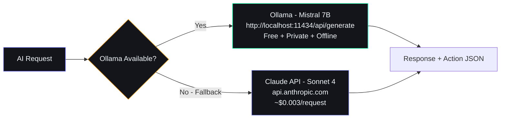

# ADR-003: Ollama Primary, Claude Fallback

## Status
Accepted

## Date
2024-06-01

## Context
AI features are central to the product: daily briefings, opportunity radar scans, idea generation, chat-based interaction with the knowledge base, and habit coaching. Two categories of AI provider were considered: local models (Ollama with Mistral 7B) and cloud APIs (Anthropic Claude, OpenAI GPT-4). The trade-off is cost/privacy/availability vs. capability/latency.

## Decision

Run Ollama locally with Mistral 7B as the default AI provider for all agent calls. The FastAPI backend makes HTTP requests to `http://localhost:11434/api/generate`. When Ollama is unavailable (process not running, GPU memory exhausted, or timeout), fall back to Anthropic Claude (claude-sonnet-4-20250514) via API key. The fallback logic is implemented as a `with_fallback` decorator in `packages/ai/agents/`.

## Consequences

### Positive
- Zero cost for daily use — all routine AI operations run locally on the developer's machine
- Full privacy — sensitive data (tasks, habits, journal entries) never leaves the local network
- Works without internet — briefings, radar scans, and chat function offline
- Claude fallback provides a safety net for complex queries that Mistral 7B cannot handle well

### Negative
- Mistral 7B is significantly slower than cloud APIs (5-15s per response vs. 1-3s for Claude)
- Smaller model means lower quality for complex reasoning, structured output parsing, and multi-step instructions
- Requires the developer's laptop to be on with Ollama running — sleeping the laptop disables all AI features
- GPU requirement for acceptable inference speed (Apple Silicon M-series or NVIDIA CUDA)

### Neutral
- The fallback threshold can be tuned per agent (e.g., Radar uses Claude by default, Briefing uses Ollama by default)
- Switching the primary model only requires changing the Ollama model tag (e.g., `mistral:7b` → `llama3:8b`)
- Cloud API costs are effectively zero during local development and minimal in production (fallback only)
