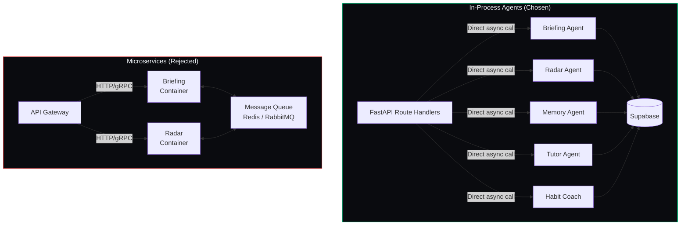

## Document Control

| Field | Value |
|---|---|
| Document ID | ENG-ADR04-001 |
| Version | 1.0.0 |
| Status | Accepted |
| Last Updated | 2026-07-11 |

# ADR-004: In-Process Agents over Microservices

## Status
Accepted

## Date
2024-06-01

## Context
The system has multiple AI agents: Briefing Agent (generates daily briefings), Radar Agent (scans for opportunities), Memory Agent (summarizes and embeds), Tutor Agent (explains concepts), and Habit Coach Agent. The options were to deploy each as a separate microservice (containerized, independently scaled) or run them as in-process async functions within the FastAPI application.

## Decision

All agents are implemented as standalone Python async functions in `packages/ai/agents/` and called directly from the FastAPI route handlers in `apps/api/app/api/`. Each agent receives a typed `AgentContext` (user_id, user preferences, tool references) and returns a typed response model. No inter-service communication or message queue is involved.

## Consequences

### Positive
- Single `uvicorn` process to deploy — no Docker Compose, no Kubernetes, no service mesh
- Zero inter-service communication overhead — no serialization, no network calls, no latency from HTTP/gRPC between agents
- Adding a new agent is as simple as creating a new file in `packages/ai/agents/` and registering its endpoint
- Shared dependencies (Ollama client, Supabase client, logger, cache) are imported directly — no duplication

### Negative
- If the FastAPI process crashes or is restarted, all agents go down simultaneously — no fault isolation
- A long-running agent (e.g., Radar scanning multiple sources) blocks the event loop for other requests unless explicitly delegated to `asyncio.create_task` or `BackgroundTasks`
- All agents share the same memory space — a memory leak in one agent affects all others
- No independent scaling — CPU-heavy agent work competes with API request handling

### Neutral
- The `asyncio` event loop naturally handles concurrency — I/O-bound agent work (Ollama HTTP calls, Supabase queries) does not block
- CPU-bound agent work (embedding, text processing) can be offloaded to a thread pool executor if needed
- If scale requires it later, individual agents can be extracted into their own FastAPI apps behind a gateway without changing the agent interface
