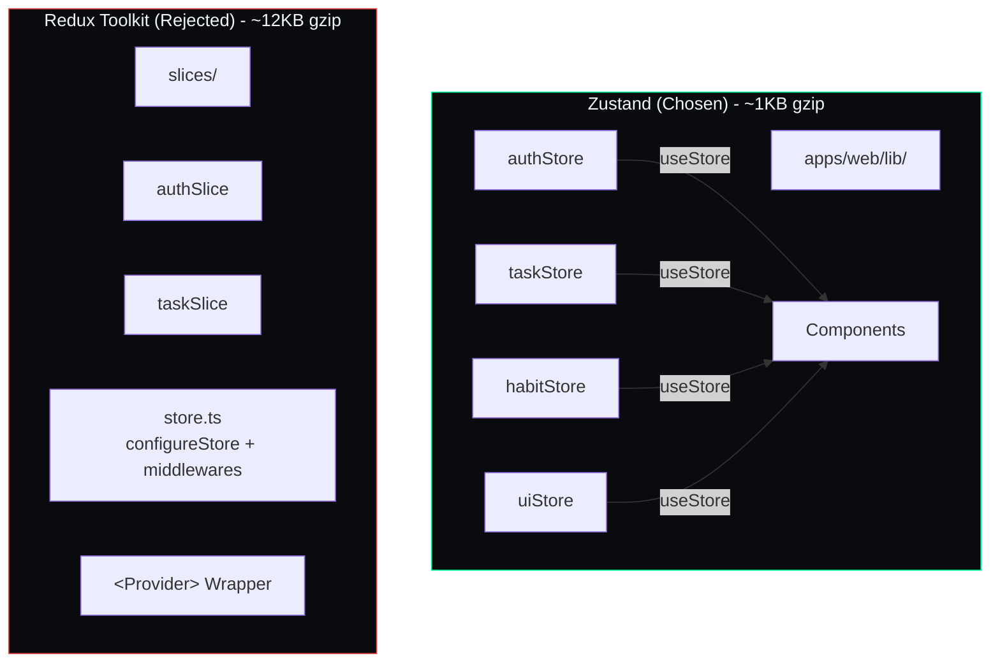

## Document Control

| Field | Value |
|---|---|
| Document ID | ENG-ADR-005 |
| Version | 1.0.0 |
| Status | Accepted |
| Last Updated | 2026-07-11 |
| Author | Developer |

# ADR-005: Zustand over Redux

## Status
Accepted

## Date
2024-06-01

## Context
The Next.js frontend requires client-side state management for: auth session, sidebar navigation state, active module, task filters, UI preferences (theme, layout), and transient data. Options considered: Zustand, Redux Toolkit, React Context API, and Jotai. The app is single-user with moderate state complexity — no multi-user collaboration, no undo/redo, no complex state middleware pipelines.

## Decision

Use Zustand for all global state, organized into modular stores under `apps/web/lib/`. Each feature area (auth, tasks, habits, UI, etc.) gets its own store file. Component-local state uses React `useState`. No Redux, no Context API for global state. Zustand devtools middleware is enabled in development only.

## Consequences

### Positive
- Minimal boilerplate — a store is a single function call (`create()`), no reducers, no actions, no dispatch types
- Intuitive API — reads are `useStore(state => state.value)`, writes are `store.setValue(newVal)` or `store.updateValue(fn)`
- TypeScript integration is first-class — stores are fully typed without extra ceremony
- Tiny bundle size (~1KB gzipped) vs. Redux Toolkit (~12KB) — meaningful for a PWA with offline-first goals
- No provider wrapping — stores are importable and usable outside React (e.g., in API utility functions)

### Negative
- Smaller ecosystem — fewer community middleware packages, less documented patterns for complex scenarios
- No built-in devtools (must manually add `devtools` middleware from `zustand/middleware`)
- No normalized entity cache pattern like Redux Toolkit's `createEntityAdapter` — manual normalization needed for task/goal collections

### Neutral
- Zustand can be swapped for Redux Toolkit later if complexity grows; both follow the immutable update pattern
- Stores can be composed (store A imports store B) for cross-cutting concerns without a global combineReducers
- The `persist` middleware handles localStorage hydration for auth tokens and UI preferences
