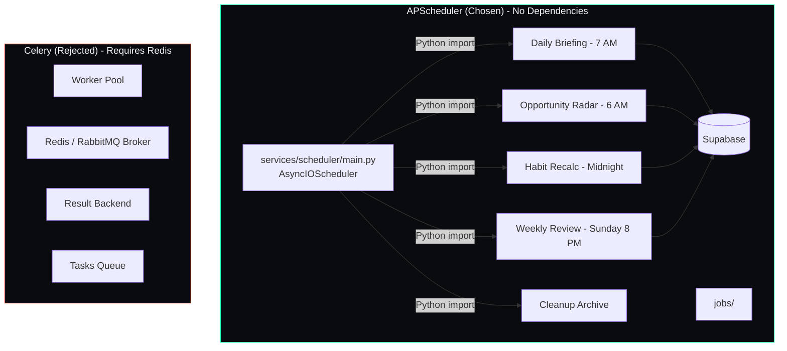

## Document Control

| Field | Value |
|---|---|
| Document ID | ENG-ADR06-001 |
| Version | 1.0.0 |
| Status | Accepted |
| Last Updated | 2026-07-11 |

# ADR-006: APScheduler over Celery

## Status
Accepted

## Date
2024-06-01

## Context
The system requires scheduled background jobs: daily briefing generation at 7:00 AM, opportunity radar scan at 6:00 AM, habit streak recalculation at midnight, weekly review digest on Sundays, and periodic cleanup (archive completed tasks, prune old logs). Options considered: APScheduler (in-process scheduler), Celery (distributed task queue), and OS-level cron.

## Decision

Run APScheduler's `AsyncIOScheduler` as a standalone Python service at `services/scheduler/main.py`. The scheduler reads job configurations from a YAML/JSON config file and executes agent functions directly via Python imports. Jobs are defined as async functions in `services/scheduler/jobs/`. The scheduler runs as a separate systemd service (or Windows Task Scheduler task) alongside the FastAPI application.

## Consequences

### Positive
- No Redis or RabbitMQ dependency — the scheduler embeds its own trigger store in memory
- Simple setup — one file (`services/scheduler/main.py`), two imports (`AsyncIOScheduler`, `CronTrigger`)
- Async-native — jobs are `async def` functions that call agents directly without wrapping sync code
- Python-only stack — no Docker dependency for the scheduler service
- Fine-grained cron expressions via `CronTrigger` (e.g., `CronTrigger(hour=7, minute=0, day_of_week='mon-fri')`)

### Negative
- No built-in retry with exponential backoff — a failed job is simply logged and skipped (must implement retry manually)
- No distributed execution — the scheduler runs on a single machine; if it goes down, no jobs run until it's restarted
- In-memory job store by default — scheduled jobs are lost on restart unless a persistent job store (SQLAlchemy/SQLite) is configured
- No built-in deduplication — if the scheduler starts twice, jobs run twice

### Neutral
- APScheduler supports persistent job stores (SQLite, PostgreSQL via SQLAlchemy) if needed later
- The scheduler can be embedded in the FastAPI process using `startup` events, but is kept separate to avoid blocking the API event loop
- Job execution history is tracked via the existing logger in `packages/shared/utils/logger.py`
