## Document Control

| Field | Value |
|---|---|
| Document ID | ENG-ADR10-001 |
| Version | 1.0.0 |
| Status | Accepted |
| Last Updated | 2026-07-11 |

# ADR-010: AI Provider Failover Chain

## Document Control

| Field | Value |
|---|---|
| ADR Number | 010 |
| Status | Accepted |
| Date | 2026-07-10 |
| Deciders | Developer |
| Replaces | None |
| Superseded By | None |
| Category | AI Infrastructure |

---

## 1. Title

AI Provider Failover Chain — Multi-Provider Resilience with Circuit Breaker Pattern

---

## 2. Context

Second Brain OS relies on AI for 11 agent functions (plus 8 skill sub-agents). A single AI provider creates a single point of failure. When the primary provider (Ollama, local) is unavailable — due to model not loaded, system resource exhaustion, or process crash — all AI agents become non-functional.

**Requirements:**
- AI must work even when the local LLM is unavailable
- AI must work within budget constraints (free/prefer locally)
- Failures must not cascade or block the application
- Degradation should be graceful, providing algorithmic fallback

**Provider Options Available:**
1. Ollama (local, free, Mistral 7B)
2. Claude API (cloud, ~$0.015/request)
3. Groq API (cloud, free tier available)
4. Algorithmic fallback (no AI, always works)

---

## 3. Decision

Implement a **failover chain** with **circuit breaker** pattern:

```
Primary:   Ollama (local, free)
Fallback 1: Claude API (cloud, low cost)
Fallback 2: Groq API (cloud, free tier)
Emergency: Algorithmic fallback (always works)
```

Each provider is wrapped with:
- **Circuit breaker** — Opens after 5 consecutive failures, 60s cooldown
- **Exponential backoff retry** — 3 attempts (2s, 4s, 8s)
- **Timeout** — 30s per request
- **Health check** — Periodic ping to verify availability

---

## 4. Detailed Design

### 4.1 Failover Chain Flow

```mermaid
graph TD
    Request["🤖 AI Request"] --> CB_Ollama{"Ollama<br/>Circuit Breaker?"}
    CB_Ollama -- "Closed" --> Ollama["🔄 Try Ollama<br/>timeout: 30s"]
    Ollama -- "Success" --> Return["✅ Return Response"]
    Ollama -- "Failure" --> Fail_Ollama["❌ Ollama Failed<br/>+1 failure count"]
    Fail_Ollama --> CB_Ollama2{"Failures >= 5?"}
    CB_Ollama2 -- "Yes" --> Open_Ollama["🔓 Open Ollama CB<br/>cooldown: 60s"]
    CB_Ollama2 -- "No" --> Retry_Ollama{"Retry < 3?"}
    Retry_Ollama -- "Yes" --> Wait_Ollama["⏱️ Backoff: 2s, 4s, 8s"]
    Wait_Ollama --> Ollama
    Retry_Ollama -- "No" --> CB_Claude
    
    Open_Ollama --> CB_Claude{"Claude<br/>Circuit Breaker?"}
    
    subgraph Fallback_Chain["Fallback Chain"]
        CB_Claude -- "Closed" --> Claude["🔄 Try Claude API"]
        Claude -- "Success" --> Return
        Claude -- "Failure" --> CB_Groq
        CB_Groq -- "Closed" --> Groq["🔄 Try Groq API"]
        Groq -- "Success" --> Return
        Groq -- "Failure" --> Algorithmic["📉 Algorithmic Fallback"]
    end
    
    Algorithmic --> Return

    style Ollama fill:#13151A,stroke:#34D399,color:#F1F5F9
    style Claude fill:#13151A,stroke:#818CF8,color:#F1F5F9
    style Groq fill:#13151A,stroke:#F59E0B,color:#F1F5F9
    style Algorithmic fill:#13151A,stroke:#EF4444,color:#F1F5F9
```



### 4.2 Circuit Breaker States

| State | Behavior | Transition |
|---|---|---|
| **CLOSED** | Normal operation, requests pass through | Opens after 5 consecutive failures |
| **OPEN** | Requests blocked, immediate fallback | Closes after 60s cooldown → half-open |
| **HALF_OPEN** | Test request allowed | Success → closed, Failure → open |
| **DISABLED** | Circuit breaker bypassed | Manual override via feature flag |

### 4.3 Implementation

```python
# packages/ai/client.py

class LLMClient:
    def __init__(self):
        self.providers = [
            OllamaProvider("mistral:7b"),
            ClaudeProvider("claude-3-haiku"),
            GroqProvider("mixtral-8x7b"),
        ]
        self.fallback = AlgorithmicFallback()
    
    async def generate_json(self, prompt: str, system: str = "") -> dict:
        last_error = None
        
        for provider in self.providers:
            if provider.circuit_breaker.state == CircuitBreaker.OPEN:
                logger.warning(f"CB open for {provider.name}, skipping")
                continue
            
            for attempt in range(3):
                try:
                    response = await asyncio.wait_for(
                        provider.generate(prompt, system),
                        timeout=30
                    )
                    provider.circuit_breaker.record_success()
                    return self._parse_json_response(response)
                    
                except Exception as e:
                    last_error = e
                    provider.circuit_breaker.record_failure()
                    
                    if attempt < 2:
                        wait = 2 ** (attempt + 1)  # 2s, 4s
                        await asyncio.sleep(wait)
                        continue
                    break  # Out of retries for this provider
        
        # All providers exhausted — use algorithmic fallback
        logger.warning(f"All providers failed. Using algorithmic fallback. Last error: {last_error}")
        return self.fallback.generate(prompt)
```

### 4.4 Circuit Breaker State Machine

```python
class CircuitBreaker:
    def __init__(self, name: str, failure_threshold: int = 5, cooldown: int = 60):
        self.name = name
        self.failure_threshold = failure_threshold
        self.cooldown = cooldown
        self.failure_count = 0
        self.state = CircuitState.CLOSED
        self.last_failure_time = None
    
    def record_failure(self):
        self.failure_count += 1
        self.last_failure_time = time.time()
        
        if self.failure_count >= self.failure_threshold:
            self.state = CircuitState.OPEN
            logger.warning(f"CB {self.name}: CLOSED → OPEN (failures: {self.failure_count})")
    
    def record_success(self):
        if self.state == CircuitState.HALF_OPEN:
            self.state = CircuitState.CLOSED
            self.failure_count = 0
            logger.info(f"CB {self.name}: HALF_OPEN → CLOSED (recovered)")
    
    @property
    def state(self) -> CircuitState:
        if self._state == CircuitState.OPEN:
            elapsed = time.time() - self.last_failure_time
            if elapsed >= self.cooldown:
                self._state = CircuitState.HALF_OPEN
                logger.info(f"CB {self.name}: OPEN → HALF_OPEN (cooldown expired)")
        return self._state
```

---

## 5. Alternatives Considered

### Alternative 1: Retry Only (No Circuit Breaker)

**Approach:** Keep retrying the same provider with backoff.

**Pros:** Simple to implement
**Cons:** Can hammer a failing provider, waste time, no recovery
**Decision:** Rejected — circuit breaker prevents cascading failures

### Alternative 2: Single Cloud Provider Only

**Approach:** Use only Claude API, no local AI.

**Pros:** Consistent quality, simpler code
**Cons:** Cost (~$1.50/month), dependency on internet, privacy concerns
**Decision:** Rejected — local-first is preferred for privacy and cost

### Alternative 3: Queue-Based Retry

**Approach:** Failed requests go to a retry queue, processed later.

**Pros:** Eventual consistency, no lost requests
**Cons:** Complex infrastructure, async overhead, not suitable for real-time chat
**Decision:** Rejected — AI responses are synchronous user-facing operations

---

## 6. Consequences

### Positive

| Benefit | Description |
|---|---|
| **High availability** | AI works even if 2 providers fail |
| **Cost controlled** | Local/cheap providers tried first |
| **Graceful degradation** | Algorithmic fallback never blocks |
| **Self-healing** | Circuit breakers auto-recover |
| **Observability** | Provider health tracked and logged |

### Negative

| Cost | Mitigation |
|---|---|
| **Increased latency on failover** | ~2-8s additional per failover step |
| **Code complexity** | Provider abstraction layer, CB state management |
| **API key management** | Multiple provider keys to maintain |
| **Cost tracking complexity** | Track usage per provider |

---

## 7. Provider Configurations

| Provider | Default Model | Cost | Priority | Circuit Breaker |
|---|---|---|---|---|
| **Ollama** | mistral:7b | Free | 1st | 5 failures → 60s cooldown |
| **Claude API** | claude-3-haiku | ~$0.003/req | 2nd | 3 failures → 120s cooldown |
| **Groq API** | mixtral-8x7b | Free tier | 3rd | 3 failures → 60s cooldown |
| **Algorithmic** | N/A | Free | Last | Always works |

---

## 8. Performance Targets

| Metric | Target |
|---|---|
| Primary provider response time | < 10s |
| Failover latency penalty | < 15s total |
| Circuit breaker recovery | < 60s |
| Algorithmic fallback response | < 2s |

---

## 9. Risks

| Risk | Likelihood | Impact | Mitigation |
|---|---|---|---|
| All cloud APIs fail simultaneously | Low | Medium | Algorithmic fallback always works |
| Circuit breaker thundering herd | Low | Low | Jitter on cooldown expiry |
| Token cost from retries | Medium | Low | Cache failures, cap retries at 3 |
| Provider API changes | Low | Medium | Abstract provider interface |

---

## 10. Related Decisions

| ADR/RFC | Relation |
|---|---|
| ADR-004: Agent as In-Process Functions | Agents use LLMClient for AI |
| ADR-009: Prompt Loader Architecture | Prompts define model and params |
| RFC: Caching Strategy | Response caching reduces failover load |

---

## 11. References

| Reference | Link |
|---|---|
| Circuit Breaker Pattern | https://martinfowler.com/bliki/CircuitBreaker.html |
| LLMClient Implementation | `packages/ai/client.py` |
| Provider Config | Environment variables in `.env.example` |
| Tests | `tests/test_llm_client.py` (51 tests) |

---

## 12. Appendices

### 12.1 Provider Health Check

```python
async def health_check_all():
    results = {}
    for provider in llm.providers:
        results[provider.name] = {
            "circuit_breaker": provider.circuit_breaker.state.value,
            "last_success": provider.last_success_time,
            "last_failure": provider.last_failure_time,
        }
    return results
```

### 12.2 Environment Variables

```bash
# Provider configuration
USE_LOCAL_AI=True
OLLAMA_BASE_URL=http://localhost:11434
CLAUDE_API_KEY=sk-ant-...
GROQ_API_KEY=gsk-...
```
