## Document Control

| Field | Value |
|---|---|
| Document ID | ENG-ADR11-001 |
| Version | 1.0.0 |
| Status | Accepted |
| Last Updated | 2026-07-11 |

# ADR-011: Graceful Degradation Architecture

## Document Control

| Field | Value |
|---|---|
| ADR Number | 011 |
| Status | Accepted |
| Date | 2026-07-10 |
| Deciders | Developer |
| Replaces | None |
| Superseded By | None |
| Category | System Architecture |

---

## 1. Title

Graceful Degradation Architecture — Every Feature Works Without AI

---

## 2. Context

Second Brain OS is an AI-first personal productivity system. However, AI is inherently unreliable — LLMs can be unavailable, slow, expensive, or produce incorrect results. The system must not fail when AI is unavailable.

**Requirements:**
- Every feature must work without AI (no hard dependency)
- Users should never see an error because AI is unavailable
- Degradation should be transparent (user gets a less intelligent, but functional, result)
- AI enhancement should be a bonus, not a requirement

**Current pain points before this ADR:**
- Some features would crash if AI was unavailable
- No clear pattern for implementing fallbacks
- Developers had to remember to add fallback logic

---

## 3. Decision

Adopt a **three-tier degradation architecture**:

```mermaid
graph TD
    Feature["🎯 Feature Request"] --> AI_Tier["🤖 Tier 1: AI-Powered<br/>Best quality, may be slow"]
    AI_Tier -- "Success" --> Return["✅ Return AI Result"]
    AI_Tier -- "Failure" --> Rule_Tier["📋 Tier 2: Rule-Based<br/>Good quality, fast, reliable"]
    Rule_Tier -- "Success" --> Return
    Rule_Tier -- "Failure" --> Default_Tier["📄 Tier 3: Default Data<br/>Basic but functional"]
    Default_Tier --> Return

    style AI_Tier fill:#13151A,stroke:#34D399,color:#F1F5F9
    style Rule_Tier fill:#13151A,stroke:#F59E0B,color:#F1F5F9
    style Default_Tier fill:#13151A,stroke:#94A3B8,color:#F1F5F9
```



Every feature function follows this signature:

```python
async def feature_function(input_data) -> dict:
    """
    Tries AI first, falls back to algorithm, then defaults.
    Never raises an exception to the caller.
    """
    result = await try_ai_solution(input_data)
    if result:
        return result | {"_quality": "ai"}
    
    result = algorithmic_solution(input_data)
    if result:
        return result | {"_quality": "algorithmic"}
    
    return default_solution() | {"_quality": "default"}
```

---

## 4. Detailed Design

### 4.1 Degradation Tiers

| Tier | Quality | Speed | Reliability | Implementation |
|---|---|---|---|---|
| **AI-Powered** | Best | Slow (1-30s) | 90% | LLM with prompt |
| **Rule-Based** | Good | Fast (< 100ms) | 100% | Python logic |
| **Default Data** | Basic | Instant (< 1ms) | 100% | Static defaults |

### 4.2 Pattern for All Agents

```python
# packages/ai/agents/briefing_agent.py

async def generate_briefing(user_id: str) -> dict:
    """
    Generate a daily briefing.
    Tier 1: AI generates personalized briefing
    Tier 2: Algorithmic summary from recent data
    Tier 3: Default message with links
    """
    # Tier 1: AI
    try:
        prompt = construct_briefing_prompt(user_id)
        result = await llm.generate_json(prompt, system=BRIEFING_SYSTEM)
        if validate_briefing(result):
            return BriefingResponse(quality="ai", **result)
    except Exception as e:
        logger.warning(f"AI briefing failed: {e}")
    
    # Tier 2: Algorithmic
    try:
        tasks = await get_tasks_for_today(user_id)
        habits = await get_habits_for_today(user_id)
        goals = await get_active_goals(user_id)
        
        summary = {
            "tasks": tasks[:5],
            "task_count": len(tasks),
            "habits": habits[:3],
            "goals": goals[:3],
            "generated_at": datetime.now().isoformat(),
        }
        return BriefingResponse(quality="algorithmic", **summary)
    except Exception as e:
        logger.error(f"Algorithmic briefing failed: {e}")
    
    # Tier 3: Default
    return BriefingResponse(
        quality="default",
        message="Good morning! Check your tasks and goals for today.",
        tasks=[],
        habits=[],
        goals=[],
    )
```

### 4.3 Quality Tagging

Every response includes a `_quality` field to indicate the tier used:

| Quality Tag | Meaning |
|---|---|
| `"ai"` | Full AI-powered result |
| `"algorithmic"` | Rule-based fallback |
| `"default"` | Static fallback |
| `"cached"` | Served from cache (with staleness info) |

This enables:
- **Client-side display** — Optionally show a subtle indicator
- **Monitoring** — Track fallback rates
- **Debugging** — Understand which path was taken

### 4.4 Frontend Handling

```typescript
// packages/web/components/QualityIndicator.tsx
function QualityBadge({ quality }: { quality: string }) {
  if (quality === 'ai') return null; // Don't show for normal case
  
  return (
    <span className="quality-badge" data-quality={quality}>
      {quality === 'algorithmic' ? '⚡ Standard' : '📄 Basic'}
    </span>
  );
}
```

---

## 5. Alternatives Considered

### Alternative 1: Fail Fast

**Approach:** If AI fails, show error to user.

**Pros:** Honest, simple implementation
**Cons:** Terrible user experience, violates "always work" principle
**Decision:** Rejected — users should never see AI errors

### Alternative 2: Retry Only

**Approach:** Keep retrying AI until it works.

**Pros:** Eventually consistent quality
**Cons:** Unbounded latency, bad UX while waiting, may never succeed
**Decision:** Rejected — bounded latency is more important than perfect quality

### Alternative 3: Graceful Degradation via Feature Flags

**Approach:** Disable AI features globally when provider is down.

**Pros:** Simple, centralized control
**Cons:** All-or-nothing, cannot degrade per-feature
**Decision:** Rejected — per-feature degradation is more granular

---

## 6. Consequences

### Positive

| Benefit | Description |
|---|---|
| **Zero-downtime AI** | No feature breaks when AI is unavailable |
| **Predictable quality** | Users always get something useful |
| **Observable fallback rate** | Track AI effectiveness over time |
| **Progressive enhancement** | AI is a bonus layer, not a requirement |
| **Testing simplified** | Test all three tiers independently |

### Negative

| Cost | Mitigation |
|---|---|
| **More code per feature** | ~30% more lines for fallback logic |
| **Algorithmic fallback quality** | Must maintain both AI and algorithmic paths |
| **Two code paths to test** | Test both AI success and failure paths |
| **False sense of AI value** | Track quality metrics to assess AI impact |

---

## 7. Which Features Have Graceful Degradation

| Feature | AI Tier | Algorithmic Tier | Default Tier |
|---|---|---|---|
| Daily Briefing | Personalized narrative | Data summary | Generic greeting |
| Weekly Review | Insightful analysis | Statistics aggregation | "Check your progress" |
| Task Breakdown | Smart subtask generation | Priority-based sort | Flat list |
| Sleep Analysis | Personalized advice | Score from duration/quality | "Sleep well" |
| Opportunity Radar | Contextual matching | Category matching | Recent listings |
| Memory Consolidation | Smart retention | Recency-based retention | Keep everything |
| Learning Insights | Pattern detection | Simple metrics | Basic stats |
| Nudge Generator | Contextual nudges | Overdue reminders | "Check tasks" |

---

## 8. Performance Targets

| Metric | AI Tier | Algorithmic Tier | Default Tier |
|---|---|---|---|
| Response time | < 15s | < 500ms | < 10ms |
| Success rate | > 90% | 100% | 100% |
| User satisfaction | Best | Good | Acceptable |
| Fallback acceptable | — | Always | Rarely needed |

---

## 9. Risks

| Risk | Likelihood | Impact | Mitigation |
|---|---|---|---|
| Algorithmic fallback quality gap | High | Medium | Invest in algorithmic fallback quality |
| Developer forgets fallback | Medium | High | Linter rule, code review checklist |
| Two code paths diverge | Medium | Medium | Shared interfaces, integration tests |
| Users don't notice AI missing | Low | Low | Acceptable — silent degradation is fine |

---

## 10. Related Decisions

| ADR | Relation |
|---|---|
| ADR-004: Agent as In-Process Functions | All agents follow degradation pattern |
| ADR-010: AI Provider Failover Chain | Provider failover before degradation |
| ADR-009: Prompt Loader Architecture | Prompt fallback (inline vs file) |
| ADR-006: Error Handling | Standardized error responses |

---

## 11. Implementation Checklist

- [ ] Every agent function has 3 tiers (AI → Algorithmic → Default)
- [ ] Every response includes `_quality` tag
- [ ] No exception propagates to caller (caught at tier boundary)
- [ ] Algorithmic fallback is implemented before AI (fail-safe design)
- [ ] Default data is always valid and useful
- [ ] Frontend handles all quality levels gracefully
- [ ] Tests cover all three tiers

---

## 12. References

| Reference | Link |
|---|---|
| Graceful Degradation Pattern | https://en.wikipedia.org/wiki/Graceful_degradation |
| Implementation Examples | `packages/ai/agents/*.py` |
| Quality Tags | `packages/shared/utils/quality.py` |
| Tests | `tests/test_agents.py` (86 tests) |
