## Document Control

| Field | Value |
|---|---|
| Document ID | ENG-ADR14-001 |
| Version | 1.0.0 |
| Status | Accepted |
| Last Updated | 2026-07-11 |

# ADR-014: Testing Philosophy

## Document Control

| Field | Value |
|---|---|
| ADR Number | 014 |
| Status | Accepted |
| Date | 2026-07-10 |
| Deciders | Developer |
| Replaces | None |
| Superseded By | None |
| Category | Quality Assurance |

---

## 1. Title

Testing Philosophy — Pragmatic Test-Driven Development for Single-Developer Project

---

## 2. Context

Second Brain OS has 2795+ passing Python tests across 58 test files, plus ~1900+ frontend tests. Testing at this scale requires a clear philosophy to guide what to test, how to test it, and where to invest effort.

**Questions addressed:**
- What should we test vs. what can we skip?
- How much coverage is enough?
- How do we test AI outputs that are non-deterministic?
- What's the balance between unit, integration, and E2E tests?
- How do we maintain tests without slowing development?

---

## 3. Decision

Adopt **Pragmatic Test-Driven Development (TDD)** principles:

1. **Test behavior, not implementation** — Focus on what the code does, not how
2. **Test at the right level** — Prefer fast unit tests, use integration/E2E sparingly
3. **Test non-deterministic code structurally** — AI outputs checked for shape, not content
4. **Coverage as a signal, not a target** — 80% minimum, but meaningful tests matter more
5. **Tests are code** — Maintained with the same standards as production code
6. **Critical paths first** — Auth, core CRUD, data integrity over edge cases

---

## 4. Detailed Design

### 4.1 Test Pyramid

```mermaid
graph TD
    subgraph Pyramid["Test Pyramid — Second Brain OS"]
        E2E["🔍 E2E Tests (21 specs)<br/>Critical user journeys<br/>Slow, expensive<br/>Run: pre-release"]
        Integration["🔗 Integration Tests (5 files)<br/>Cross-module flows<br/>Medium speed<br/>Run: per PR"]
        Unit["âš¡ Unit Tests (2795+ tests)<br/>Functions, schemas, agents<br/>Fast, cheap<br/>Run: per commit"]
        Static["📐 Static Analysis<br/>Lint, type-check, format<br/>Fastest<br/>Run: per file save"]
    end

    note["💡 Strategy:<br/>95% of bugs found in unit tests<br/>3% in integration<br/>2% in E2E"]

    style E2E fill:#13151A,stroke:#EF4444,color:#F1F5F9
    style Integration fill:#13151A,stroke:#F59E0B,color:#F1F5F9
    style Unit fill:#13151A,stroke:#34D399,color:#F1F5F9
    style Static fill:#13151A,stroke:#94A3B8,color:#F1F5F9
```



### 4.2 What to Test

| Category | Test Priority | Example |
|---|---|---|
| **Business logic** | ✅ Always | Task completion flow, goal progress calculation |
| **Data validation** | ✅ Always | Pydantic model constraints, input sanitization |
| **Error handling** | ✅ Always | 404, 400, 500 responses, circuit breaker states |
| **AI agent logic** | ✅ Always | Structure validation, fallback behavior |
| **Prompt loading** | ✅ Always | Frontmatter parsing, rendering, fallback |
| **Authentication** | ✅ Always | JWT validation, session management, RLS |
| **Database queries** | ✅ Always | Filtering, pagination, user isolation |
| **Cron jobs** | ✅ Mostly | Registration, trigger validation |
| **Middleware** | ✅ Mostly | CORS headers, request IDs, rate limiting |
| **UI components** | ✅ Mostly | Rendering, state changes, edge cases |
| **AI prompt content** | ✅ Sprinkled | Keyword presence, minimum size |
| **Configuration** | ⚠️ Selectively | Default values, env var loading |
| **Migration scripts** | ⚠️ Selectively | Forward/backward compatibility |
| **Documentation code snippets** | ❌ Not directly | Reviewed manually |
| **Third-party API behavior** | ❌ Mocked | Mock Supabase, mock AI providers |

### 4.3 Testing Non-Deterministic AI Outputs

```python
# BAD: Testing exact AI output (fragile, always fails)
def test_ai_response():
    result = agent.generate("Hello")
    assert result["message"] == "Hello! How can I help you today?"

# GOOD: Testing structure and constraints (stable)
def test_ai_response_structure():
    result = agent.generate("Hello")
    assert "message" in result
    assert isinstance(result["message"], str)
    assert len(result["message"]) > 10
    assert result["_quality"] in ("ai", "algorithmic", "default")

# GOOD: Testing with known test data
def test_ai_response_with_test_prompt():
    result = agent.generate("Summarize this: Complete project report")
    # AI should produce at least some steps
    assert len(result.get("steps", [])) >= 1
```

### 4.4 Mock Strategy

| External Dependency | Mock Strategy | Test Fixture |
|---|---|---|
| Supabase (reads) | Mock `supabase.table().select().eq().execute()` | Return test data |
| Supabase (writes) | Mock `supabase.table().insert().execute()` | Return success |
| AI providers | Mock `LLMClient.generate_json()` | Return structured test data |
| HTTP requests | Mock `httpx.AsyncClient` | Return expected responses |
| Time (datetime) | Freeze with `freezegun` | Fixed timestamps |

```python
# tests/conftest.py
@pytest.fixture
def mock_supabase():
    """Mock Supabase client for all tests."""
    with patch('apps.api.app.api.tasks.supabase') as mock:
        yield mock

@pytest.fixture
def mock_llm_success():
    """Mock LLM returning successful structured response."""
    async def _generate(*args, **kwargs):
        return {"summary": "AI generated text", "items": []}
    
    with patch('ai.client.llm.generate_json', side_effect=_generate):
        yield

@pytest.fixture
def mock_llm_failure():
    """Mock LLM raising an error (triggers fallback)."""
    with patch('ai.client.llm.generate_json',
               side_effect=LLMProviderUnavailableError("Ollama down")):
        yield
```

---

## 5. Alternatives Considered

### Alternative 1: Pure TDD (Test First)

**Approach:** Write tests before any production code.

**Pros:** Forces design thinking, 100% intentional test coverage
**Cons:** Slows initial development, can over-specify, refactoring-heavy
**Decision:** Rejected for most features; used selectively for critical logic

### Alternative 2: No Tests (Trust the Developer)

**Approach:** Manual testing only, no automated tests.

**Pros:** Fastest initial development
**Cons:** Regression bugs, no safety net, cannot CI, unsustainable
**Decision:** Rejected — 2795+ tests prove the value of automated testing

### Alternative 3: 100% Coverage Mandate

**Approach:** Every line of code must be tested.

**Pros:** No untested code, high confidence
**Cons:** Diminishing returns, test maintenance burden, tests for getters/setters
**Decision:** Rejected — 80% coverage target with focus on critical paths

---

## 6. Test Organization

### 6.1 Directory Structure

```
tests/
├── conftest.py                       # Shared fixtures
├── test_prompt_loader.py             # 31 tests: PromptLoader
├── test_agent_prompts.py             # 42 tests: Agent content
├── test_api_endpoints.py             # 132 tests: API basic
├── test_api_routes_advanced.py       # 380 tests: API advanced
├── test_api_endpoints_expanded.py    # 80 tests: API expanded
├── test_skills_api.py                # 160 tests: Skills CRUD
├── test_agents.py                    # 86 tests: Agent logic
├── test_ai_modules.py                # 55 tests: Orchestrator
├── test_llm_client.py                # 51 tests: LLM client
├── test_scheduler.py                 # 57 tests: Cron jobs
├── test_schemas.py                   # 97 tests: Pydantic models
├── test_shared_utils.py              # 244 tests: Utilities
├── test_config_core.py               # 28 tests: Configuration
├── test_database_schemas.py          # 196 tests: DB schemas
├── test_main_routes.py               # 28 tests: Main routes
├── test_validate_script.py           # 23 tests: Validation script
├── test_scripts.py                   # 48 tests: Utility scripts
└── test_integration.py               # 5 tests: Cross-module
```

### 6.2 Naming Conventions

| Pattern | Example |
|---|---|
| `test_<module>.py` | `test_prompt_loader.py` |
| `test_<function>_<scenario>` | `test_load_prompt_not_found_returns_none` |
| `test_<endpoint>_<status>` | `test_create_task_returns_201` |

---

## 7. Test Coverage Thresholds

| Module | Minimum | Current | Trend |
|---|---|---|---|
| `packages/ai/` | 80% | 100% | ✅ |
| `packages/config/` | 80% | 100% | ✅ |
| `packages/shared/` | 70% | 100% | ✅ |
| `apps/api/` | 60% | 100% | ✅ |
| `services/scheduler/` | 70% | 100% | ✅ |
| `scripts/` | 80% | 100% | ✅ |
| **Overall** | **85%** | **96%** | ✅ |

---

## 8. Performance Targets

| Metric | Target |
|---|---|
| Full test suite duration | < 5 minutes |
| Unit test duration (Python) | < 90 seconds |
| Frontend test duration | < 2 minutes |
| E2E test duration | < 5 minutes |
| Test flakiness rate | < 1% |

---

## 9. Risks

| Risk | Likelihood | Impact | Mitigation |
|---|---|---|---|
| Test maintenance overhead | Medium | Medium | Shared fixtures, clean test architecture |
| Flaky tests reduce trust | Medium | High | Mark flaky tests, fix within 1 week |
| Coverage blind spots | Low | Medium | Regular coverage review, mutation testing |
| Over-mocking hides real bugs | Low | Medium | Integration tests catch mock gaps |

---

## 10. Related Decisions

| ADR | Relation |
|---|---|
| ADR-009: Prompt Loader Architecture | Prompts tested via frontmatter/content tests |
| ADR-010: AI Provider Failover | Mocked AI provider tests |
| ADR-011: Graceful Degradation | Test all three degradation tiers |

---

## 11. References

| Reference | Link |
|---|---|
| Test files | `tests/` directory (42 files) |
| Coverage config | `pytest.ini` |
| CI Pipeline | `.github/workflows/ci.yml` |
| Testing Standards | AGENTS.md Section 16 |
