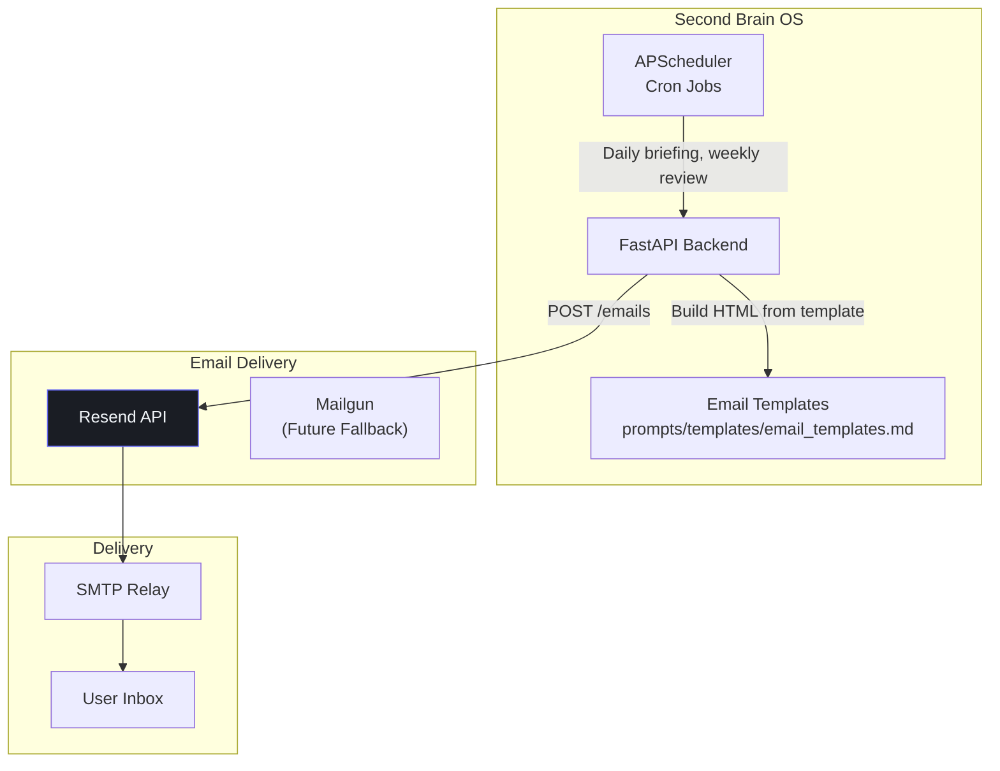

# Email Integration

## Document Control

| Field | Value |
|---|---|
| Document ID | INT-EML-009 |
| Version | 1.0.0 |
| Status | Approved |
| Date | 2026-07-10 |
| Classification | Internal |
| Owner | Developer |

---

## Table of Contents

1. [Executive Summary](#1-executive-summary)
2. [Integration Overview](#2-integration-overview)
3. [Architecture Diagram](#3-architecture-diagram)
4. [Transactional Emails](#4-transactional-emails)
5. [Email Templates](#5-email-templates)
6. [API Configuration](#6-api-configuration)
7. [Request/Response Format](#7-requestresponse-format)
8. [Rate Limits & Quotas](#8-rate-limits--quotas)
9. [Email Scheduling](#9-email-scheduling)
10. [Error Handling](#10-error-handling)
11. [Security Considerations](#11-security-considerations)
12. [Monitoring & Observability](#12-monitoring--observability)
13. [Cost Tracking](#13-cost-tracking)
14. [Testing Strategy](#14-testing-strategy)
15. [Edge Cases](#15-edge-cases)
16. [Failure Scenarios](#16-failure-scenarios)
17. [Configuration Reference](#17-configuration-reference)
18. [References](#18-references)

---

## 1. Executive Summary

The Email integration powers all outbound email communications for Second Brain OS using Resend as the email delivery provider. It handles daily briefings, weekly reviews, missed task escalations, opportunity alerts, and critical system notifications. Emails are sent from the FastAPI backend and scheduled cron jobs via APScheduler.

---

## 2. Integration Overview

| Property | Value |
|---|---|
| Provider | Resend |
| API Endpoint | `https://api.resend.com/emails` |
| Primary SDK | `resend` Python SDK |
| Auth Method | Bearer token (API Key) |
| Free Tier | 3,000 emails/month |
| Sender Domain | `secondbrainos.app` |
| Status | Active |

---

## 3. Architecture Diagram



---

## 4. Transactional Emails

### Email Inventory

| Email Type | Frequency | Trigger | Priority | Template |
|---|---|---|---|---|
| Daily Briefing | Daily (7 AM) | Cron job A09 | High | `briefing_email` |
| Weekly Review | Weekly (Sun 8 PM) | Cron job A10 | Medium | `review_email` |
| Missed Task Alert | Per missed task | Cron job A11 (15 min) | High | `missed_task` |
| Critical Opportunity | Per opportunity | Agent A06 | Low | `opportunity` |
| Welcome Email | One-time | User signup | High | `welcome` |
| Password Reset | On-demand | Auth event | High | `password_reset` |
| System Notification | As needed | Admin trigger | Medium | `notification` |

---

## 5. Email Templates

All email templates are defined in `prompts/templates/email_templates.md`. Templates use plain HTML with inline CSS for maximum email client compatibility.

### Example: Daily Briefing

```html
<!DOCTYPE html>
<html>
<head>
  <meta charset="utf-8">
  <meta name="viewport" content="width=device-width, initial-scale=1.0">
</head>
<body style="font-family: 'DM Sans', sans-serif; background: #0A0B0F; color: #F1F5F9; padding: 24px;">
  <div style="max-width: 600px; margin: 0 auto;">
    <h1 style="font-family: 'Syne', sans-serif; color: #6366F1;">Good Morning</h1>
    <p style="color: #94A3B8;">Your briefing for {date}</p>
    <div style="background: #13151A; border-radius: 8px; padding: 16px; margin: 16px 0;">
      <h2 style="color: #00FFA3;">Top 3 Tasks</h2>
      {tasks_html}
    </div>
  </div>
</body>
</html>
```

---

## 6. API Configuration

```python
import os
import resend

resend.api_key = os.getenv("RESEND_API_KEY")

EMAIL_FROM = os.getenv("EMAIL_FROM", "ARIA <aria@secondbrainos.app>")
EMAIL_REPLY_TO = os.getenv("EMAIL_REPLY_TO", "support@secondbrainos.app")
```

---

## 7. Request/Response Format

### Send Email

```python
def send_email(to: str, subject: str, html: str) -> dict:
    params = {
        "from": EMAIL_FROM,
        "to": [to],
        "subject": subject,
        "html": html,
        "reply_to": EMAIL_REPLY_TO,
    }
    try:
        response = resend.Emails.send(params)
        return {"id": response["id"], "status": "sent"}
    except Exception as e:
        logger.error(f"Email send failed: {e}")
        return {"id": None, "status": "failed", "error": str(e)}
```

### Response

```json
{
  "id": "49a3999c-0ce1-4ea6-ab68-afcedc3e0c2a",
  "from": "ARIA <aria@secondbrainos.app>",
  "to": ["user@example.com"],
  "created_at": "2026-07-10T06:00:00.000Z"
}
```

---

## 8. Rate Limits & Quotas

| Tier | Emails/Day | Emails/Month | Rate |
|---|---|---|---|
| Free | 100 | 3,000 | 10 req/sec |
| Growth ($20/mo) | 1,000 | 50,000 | 50 req/sec |
| Pro ($100/mo) | 5,000 | 500,000 | 100 req/sec |

**Monthly estimate:** ~41 emails/month (30 briefings + 4 reviews + 5 alerts + 2 opportunities) — well within free tier.

---

## 9. Email Scheduling

Emails are sent via APScheduler cron jobs (no queue backend needed for single-user use):

```python
# services/scheduler/crons/email_digest.py

async def send_daily_briefing_email(user_id: str):
    briefing = await generate_briefing(user_id)
    user = await get_user_profile(user_id)
    if not user.get("email_enabled", True):
        return {"skipped": True, "reason": "email_disabled"}

    html = render_briefing_template(briefing)
    result = send_email(
        to=user["email"],
        subject=f"Your Morning Briefing — {datetime.now():%B %d, %Y}",
        html=html,
    )
    return result
```

---

## 10. Error Handling

| Error | Cause | Action |
|---|---|---|
| Invalid recipient | Bad email address | Log, skip, notify user |
| Rate limit exceeded | Too many requests | Queue + retry after 60s |
| Bounced email | Invalid or full inbox | Mark user as undeliverable |
| API key invalid | Configuration error | Alert developer |
| Template rendering error | Malformed HTML | Fall back to plain text |

---

## 11. Security Considerations

- API key stored server-side only
- Email content generated from templates — no raw user input in HTML
- User email preferences respected (opt-out per type)
- SPF, DKIM, DMARC configured for sending domain
- Bounce handling: auto-disable delivery after 3 consecutive bounces

---

## 12. Monitoring & Observability

| Metric | Source | Alert |
|---|---|---|
| Delivery rate | Resend dashboard | < 95% |
| Bounce rate | Resend webhooks | > 2% |
| Open rate | Resend analytics | Monitor trend |
| Error rate | Backend logs | > 5% |
| Daily volume | Usage counter | > 100/day (free tier limit) |

---

## 13. Cost Tracking

| Tier | Monthly Cost | Emails/Month | Sufficient For |
|---|---|---|---|
| Free | $0 | 3,000 | Single user (~41/mo) |
| Growth | $20 | 50,000 | Multiple users |
| **Current** | **$0** | **~41** | **Yes** |

---

## 14. Testing Strategy

| Test Type | Scope |
|---|---|
| Unit | Template rendering, email building |
| Mock | Resend API with `responses` |
| Integration | Send test email to developer address |
| Bounce handling | Verify auto-disable after 3 bounces |

---

## 15. Edge Cases

- User has no email address → Skip email delivery
- HTML email rejected → Fall back to plain text version
- Email contains special characters → Properly encode subject/body
- Multiple emails sent simultaneously → Queue sequentially within rate limit
- User unsubscribes via link → Update preferences, stop delivery

---

## 16. Failure Scenarios

| Scenario | Impact | Mitigation |
|---|---|---|
| Resend API outage | No email delivery | Queue emails, retry on recovery |
| API key revoked | All emails fail | Rotate key immediately |
| Domain reputation drops | Emails marked as spam | Monitor deliverability, warm up domain |
| Free tier exceeded | Emails rejected | Upgrade to Growth tier |

---

## 17. Configuration Reference

```env
RESEND_API_KEY=re_...
EMAIL_FROM=ARIA <aria@secondbrainos.app>
EMAIL_REPLY_TO=support@secondbrainos.app
EMAIL_ENABLED=true
```

---

## 18. References

| Resource | URL |
|---|---|
| Resend API Docs | https://resend.com/docs |
| Resend Python SDK | https://github.com/resendlabs/resend-python |
| Email Template Guide | `prompts/templates/email_templates.md` |
| Integration Architecture | `docs/engineering/37_IntegrationArchitecture.md` |
