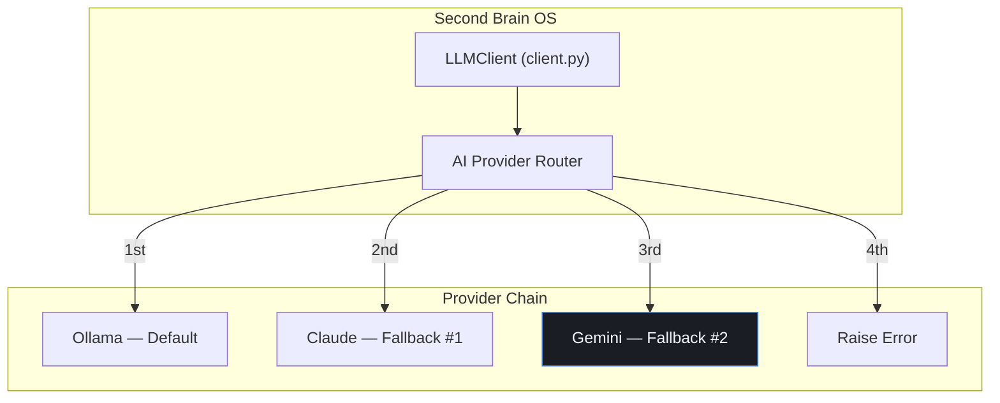

# Gemini Integration

## Document Control

| Field | Value |
|---|---|
| Document ID | INT-GEM-006 |
| Version | 1.0.0 |
| Status | Draft |
| Date | 2026-07-10 |
| Classification | Internal |
| Owner | Developer |

---

## Table of Contents

1. [Executive Summary](#1-executive-summary)
2. [Integration Overview](#2-integration-overview)
3. [API Configuration](#3-api-configuration)
4. [Supported Models](#4-supported-models)
5. [Architecture Diagram](#5-architecture-diagram)
6. [Request/Response Format](#6-requestresponse-format)
7. [Use Cases](#7-use-cases)
8. [Cost Per Request](#8-cost-per-request)
9. [Rate Limits & Quotas](#9-rate-limits--quotas)
10. [Fallback Chain Position](#10-fallback-chain-position)
11. [API Key Management](#11-api-key-management)
12. [Error Handling](#12-error-handling)
13. [Security Considerations](#13-security-considerations)
14. [Monitoring & Observability](#14-monitoring--observability)
15. [Testing Strategy](#15-testing-strategy)
16. [Edge Cases](#16-edge-cases)
17. [Failure Scenarios](#17-failure-scenarios)
18. [Configuration Reference](#18-configuration-reference)
19. [References](#19-references)

---

## 1. Executive Summary

Google Gemini is a tertiary AI provider option for Second Brain OS, positioned as the third fallback after Ollama (default) and Claude (primary fallback). Gemini provides a cost-effective alternative for text generation, summarization, and structured data extraction tasks, particularly for users who prefer Google's ecosystem.

---

## 2. Integration Overview

| Property | Value |
|---|---|
| Provider | Google AI |
| API Endpoint | `https://generativelanguage.googleapis.com/v1beta/models/{model}:generateContent` |
| Auth Method | API Key (`x-goog-api-key` header) |
| Default Model | `gemini-2.0-flash` |
| SDK | `google-genai` Python SDK |
| Free Tier | 60 requests/minute (free tier) |
| Status | Optional — not enabled by default |

---

## 3. API Configuration

```python
import httpx
import os

GEMINI_API_KEY = os.getenv("GEMINI_API_KEY", "")
GEMINI_MODEL = os.getenv("GEMINI_MODEL", "gemini-2.0-flash")
GEMINI_TIMEOUT = int(os.getenv("GEMINI_TIMEOUT", "60"))

GEMINI_BASE_URL = "https://generativelanguage.googleapis.com/v1beta"
```

---

## 4. Supported Models

| Model | Use Case | Context Window | Free Tier Limit |
|---|---|---|---|
| `gemini-2.0-flash` | General tasks, fast responses | 1M tokens | 60 req/min |
| `gemini-2.0-flash-lite` | Simple tasks, lowest cost | 1M tokens | 30 req/min |
| `gemini-1.5-pro` | Complex reasoning | 2M tokens | 10 req/min |
| `gemini-2.5-pro` | Advanced analysis (future) | 1M tokens | 5 req/min |

---

## 5. Architecture Diagram



---

## 6. Request/Response Format

### Request

```json
{
  "contents": [
    {
      "parts": [
        {"text": "Generate a daily briefing based on my tasks."}
      ]
    }
  ],
  "systemInstruction": {
    "parts": [{"text": "You are ARIA, the AI core of Second Brain OS."}]
  },
  "generationConfig": {
    "temperature": 0.5,
    "maxOutputTokens": 4096
  }
}
```

### Response

```json
{
  "candidates": [
    {
      "content": {
        "parts": [
          {"text": "Good morning! Here is your briefing..."}
        ]
      },
      "finishReason": "STOP"
    }
  ],
  "usageMetadata": {
    "promptTokenCount": 850,
    "candidatesTokenCount": 420,
    "totalTokenCount": 1270
  }
}
```

---

## 7. Use Cases

| Task | Model | Priority |
|---|---|---|
| Video transcript summarization | `gemini-2.0-flash` | Medium |
| Resource tagging | `gemini-2.0-flash-lite` | Low |
| Habit report generation | `gemini-2.0-flash` | Low |
| Content categorization | `gemini-2.0-flash` | Medium |

---

## 8. Cost Per Request

| Model | Input Cost/1M tokens | Output Cost/1M tokens | Est. Cost/Req |
|---|---|---|---|
| `gemini-2.0-flash` | $0.10 | $0.40 | ~$0.0003 |
| `gemini-1.5-pro` | $1.25 | $5.00 | ~$0.003 |

Gemini is significantly cheaper than Claude (~$0.003 vs ~$0.015 per request).

---

## 9. Rate Limits & Quotas

| Tier | Requests/Minute | Tokens/Minute |
|---|---|---|
| Free | 60 | 1,000,000 |
| Pay-as-you-go (first 30 req/min) | 30 | 2,000,000 |
| Pay-as-you-go (beyond) | 2,000 | 4,000,000 |

---

## 10. Fallback Chain Position

Gemini is the **third position** in the provider chain:

| Position | Provider | Condition | Circuit Breaker | Timeout |
|---|---|---|---|---|
| 1 | Ollama | `USE_LOCAL_AI=True` | 5 failures → 60s | 60s |
| 2 | Claude | `CLAUDE_API_KEY` set | 3 failures → 120s | 120s |
| **3** | **Gemini** | **`GEMINI_API_KEY` set** | **3 failures → 60s** | **60s** |
| 4 | Raise error | All providers exhausted | — | — |

---

## 11. API Key Management

| Practice | Implementation |
|---|---|
| Storage | Railway env var `GEMINI_API_KEY` (encrypted) |
| Validation | Key prefix check (`AIzaSy...`) on startup |
| Restriction | IP-restricted in Google Cloud Console |

---

## 12. Error Handling

| Status | Error | Action |
|---|---|---|
| 400 | Invalid request | Log, don't retry |
| 401 | Invalid API key | Skip provider, alert |
| 403 | Quota/blocked | Fall back to next provider |
| 429 | Rate limit | Exponential backoff (2s, 4s, 8s) |
| 500 | Server error | Retry 2x, then circuit breaker |

---

## 13. Security Considerations

- API key stored server-side only
- Key restricted to Generative Language API in GCP
- No user data sent in system prompts
- Google does not train on API requests by default

---

## 14. Monitoring & Observability

| Metric | Source | Alert |
|---|---|---|
| Error rate | Backend logs | > 5% |
| Latency p95 | Request timing | > 15s |
| Circuit breaker state | Health endpoint | OPEN state |
| Fallback activations | LLM client logs | > 5/day |

---

## 15. Testing Strategy

| Test Type | Scope |
|---|---|
| Unit | Request formatting, response parsing |
| Mock | Gemini API responses with `responses` |
| Integration | Full fallback chain (Ollama → Claude → Gemini → error) |

---

## 16. Edge Cases

- Blocked content (safety filters) → Check `finishReason` = `SAFETY`, retry with adjusted prompt
- Empty response → Verify `candidates[0].content.parts` is non-empty
- Context window exceeded (1M tokens) → Truncate conversation history

---

## 17. Failure Scenarios

| Scenario | Impact | Mitigation |
|---|---|---|
| API key not configured | Provider skipped gracefully | Log warning, proceed to error |
| Safety filter blocks output | No response | Rephrase prompt, reduce temperature |
| Quota exhausted | Requests fail | Fall back to error state |
| Regional availability | Service degraded | Geo-routing via GCP |

---

## 18. Configuration Reference

```env
GEMINI_API_KEY=AIzaSy...
GEMINI_MODEL=gemini-2.0-flash
GEMINI_TIMEOUT=60
```

---

## 19. References

| Resource | URL |
|---|---|
| Gemini API Reference | https://ai.google.dev/api |
| Gemini Models | https://ai.google.dev/models |
| Gemini Pricing | https://ai.google.dev/pricing |
| Safety Settings | https://ai.google.dev/safety |
| Integration Architecture | `docs/engineering/37_IntegrationArchitecture.md` |
