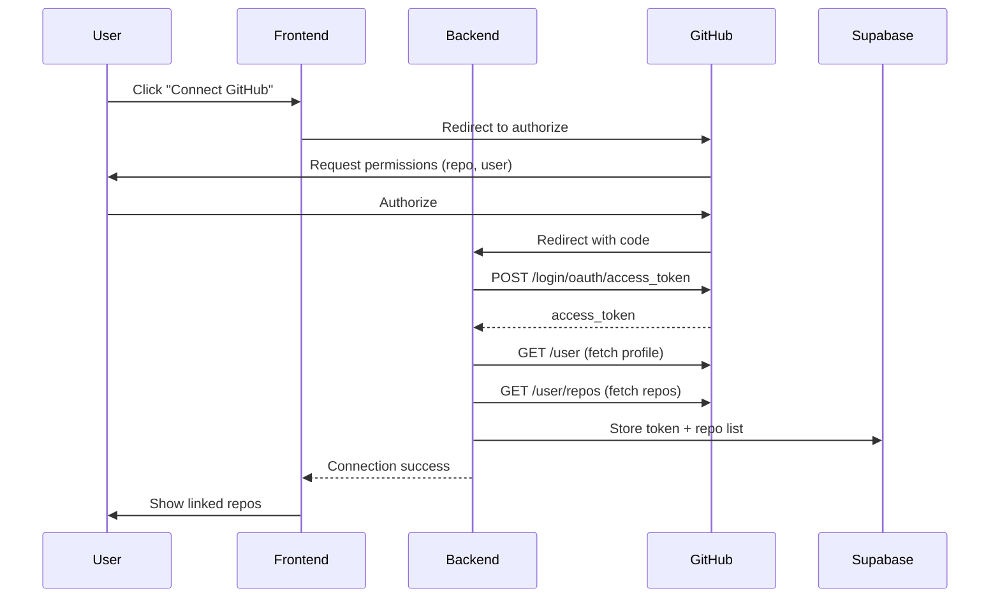

# GitHub Integration

## Document Control

| Field | Value |
|---|---|
| Document ID | INT-GIT-002 |
| Version | 1.0.0 |
| Status | Approved |
| Date | 2026-07-10 |
| Classification | Internal |
| Owner | Developer |

---

## Table of Contents

1. [Executive Summary](#1-executive-summary)
2. [Integration Overview](#2-integration-overview)
3. [GitHub OAuth Flow](#3-github-oauth-flow)
4. [Repo Linking](#4-repo-linking)
5. [CI/CD via GitHub Actions](#5-cicd-via-github-actions)
6. [Code Reference Tracking](#6-code-reference-tracking)
7. [API Endpoints Used](#7-api-endpoints-used)
8. [Rate Limits & Quotas](#8-rate-limits--quotas)
9. [Data Flow & Processing](#9-data-flow--processing)
10. [Webhook Integration](#10-webhook-integration)
11. [Error Handling](#11-error-handling)
12. [Security Considerations](#12-security-considerations)
13. [Monitoring & Observability](#13-monitoring--observability)
14. [Testing Strategy](#14-testing-strategy)
15. [Edge Cases](#15-edge-cases)
16. [Failure Scenarios](#16-failure-scenarios)
17. [Configuration Reference](#17-configuration-reference)
18. [Data Retention](#18-data-retention)
19. [Troubleshooting](#19-troubleshooting)
20. [References](#20-references)

---

## 1. Executive Summary

The GitHub integration provides OAuth-based authentication, repo linking for skill development tracking, CI/CD pipeline integration, and code reference management. It enables the Opportunity Radar agent to scan GitHub for open-source opportunities and the Learning Agent to track coding progress.

---

## 2. Integration Overview

| Property | Value |
|---|---|
| Provider | GitHub |
| APIs Used | REST API v3, GraphQL API v4 (planned) |
| Auth Method | OAuth 2.0 (Device Authorization Grant for CLI) |
| Client Library | `httpx` (direct REST calls) |
| Primary Endpoint | `https://api.github.com` |
| Rate Limit | 60/hr (unauthenticated), 5,000/hr (authenticated) |

---

## 3. GitHub OAuth Flow



### 3.1 OAuth Configuration

| Setting | Value |
|---|---|
| Client ID | From GitHub OAuth App settings |
| Client Secret | Stored in Railway env vars |
| Authorization URL | `https://github.com/login/oauth/authorize` |
| Token URL | `https://github.com/login/oauth/access_token` |
| Redirect URI | `https://api.secondbrainos.com/api/v1/auth/github/callback` |
| Scopes | `read:user`, `repo`, `public_repo` |

---

## 4. Repo Linking

### 4.1 Linked Repo Schema

```sql
CREATE TABLE linked_repos (
    id UUID PRIMARY KEY DEFAULT gen_random_uuid(),
    user_id UUID NOT NULL REFERENCES users(id) ON DELETE CASCADE,
    repo_owner VARCHAR(255) NOT NULL,
    repo_name VARCHAR(255) NOT NULL,
    full_name VARCHAR(512) NOT NULL,
    github_url TEXT NOT NULL,
    description TEXT,
    language VARCHAR(64),
    topics TEXT[],
    stars INT DEFAULT 0,
    last_push_at TIMESTAMPTZ,
    is_private BOOLEAN DEFAULT FALSE,
    skills_inferred TEXT[],
    linked_at TIMESTAMPTZ NOT NULL DEFAULT NOW(),
    last_synced_at TIMESTAMPTZ NOT NULL DEFAULT NOW(),
    UNIQUE(user_id, full_name)
);
```

### 4.2 Auto-Discovery

The system periodically discovers new repos and checks for activity:

| Trigger | Frequency | Action |
|---|---|---|
| Initial OAuth | Once | Import all public repos |
| Daily cron | Daily at 4 AM | Check new repos, update stats |
| Manual refresh | On-demand | Full re-sync of all linked repos |

---

## 5. CI/CD via GitHub Actions

GitHub Actions is the CI/CD engine for Second Brain OS. See `docs/devops/CI.md` and `docs/devops/GitHubActions.md` for full pipeline details.

| Workflow | Trigger | Jobs |
|---|---|---|
| `ci.yml` | Push/PR to main | Lint, test, security, docker build |
| `deploy.yml` | Push to main | Deploy frontend, backend, scheduler |
| `lighthouse.yml` | Push to main | Lighthouse audit |
| `canary.yml` | Release published | Canary deployment |

---

## 6. Code Reference Tracking

The Learning Agent uses GitHub to track coding progress:

```python
async def get_repo_languages(owner: str, repo: str, token: str) -> dict:
    headers = {"Authorization": f"Bearer {token}"} if token else {}
    async with httpx.AsyncClient() as client:
        resp = await client.get(
            f"https://api.github.com/repos/{owner}/{repo}/languages",
            headers=headers,
        )
        resp.raise_for_status()
        return resp.json()  # {"Python": 45000, "TypeScript": 23000}

async def get_recent_commits(owner: str, repo: str, token: str, since: str) -> list:
    headers = {"Authorization": f"Bearer {token}"} if token else {}
    async with httpx.AsyncClient() as client:
        resp = await client.get(
            f"https://api.github.com/repos/{owner}/{repo}/commits",
            params={"since": since, "per_page": 10},
            headers=headers,
        )
        resp.raise_for_status()
        return resp.json()
```

---

## 7. API Endpoints Used

| Endpoint | Method | Purpose | Auth Required |
|---|---|---|---|
| `/user` | GET | Fetch authenticated user profile | Yes |
| `/user/repos` | GET | List user repositories | Yes |
| `/repos/{owner}/{repo}` | GET | Get repo details | Optional |
| `/repos/{owner}/{repo}/languages` | GET | Get language breakdown | Optional |
| `/repos/{owner}/{repo}/commits` | GET | Get recent commits | Optional |
| `/repos/{owner}/{repo}/contributors` | GET | Get contributor stats | Optional |
| `/search/issues` | GET | Search for open-source issues | Yes |
| `/user/events` | GET | Get recent user activity | Yes |
| `/rate_limit` | GET | Check current rate limit status | Optional |

---

## 8. Rate Limits & Quotas

| Auth Type | Limit | Window | Used By |
|---|---|---|---|
| Unauthenticated | 60 requests/hr | Rolling hour | Public repo data |
| Authenticated (OAuth) | 5,000 requests/hr | Rolling hour | User-linked actions |
| Search (authenticated) | 30 requests/min | Per minute | Opportunity scanning |

---

## 9. Data Flow & Processing

```
OAuth → Token stored → Daily cron fetches commits/languages
                                    ↓
                          Learning Agent analyzes patterns
                                    ↓
                          Skill recommendations generated
                                    ↓
                          Stored in learning_progress table
```

---

## 10. Webhook Integration

| Webhook Event | Action | Status |
|---|---|---|
| `push` | Trigger CI pipeline | Active |
| `pull_request` | Trigger preview deploy | Active |
| `create` (tag) | Trigger production deploy | Active |
| `issues` | Update opportunity radar | Planned |

---

## 11. Error Handling

| Status | Error | Action |
|---|---|---|
| 401 | Bad/expired credentials | Prompt user to re-authenticate |
| 403 | Rate limit exceeded | Queue requests, resume when available |
| 404 | Repo not found | Remove from linked list |
| 422 | Validation error | Log, retry with corrected payload |

---

## 12. Security Considerations

- OAuth tokens stored encrypted at rest in Supabase
- Tokens never exposed to client-side code
- All API calls proxied through FastAPI backend
- Token can be revoked by user via GitHub Settings → Applications
- Minimum required scopes requested

---

## 13. Monitoring & Observability

| Metric | Source | Alert |
|---|---|---|
| OAuth failure rate | Auth logs | > 5% |
| API error rate | Backend logs | > 10% |
| Rate limit hits | Rate limit check | > 80% of limit |
| Sync freshness | `last_synced_at` | > 48 hours stale |

---

## 14. Testing Strategy

| Test Type | Scope |
|---|---|
| Unit | OAuth callback parsing, repo data transformation |
| Mock | GitHub API responses with `responses` library |
| Integration | Full OAuth flow with test GitHub app |

---

## 15. Edge Cases

- User has zero public repos → Graceful message, prompt to create one
- Token revoked via GitHub UI → Next API call fails, re-auth prompt
- Private repo access removed → Next sync gracefully removes restricted repos
- Network partition during sync → Partial results stored, retry on next cycle

---

## 16. Failure Scenarios

| Scenario | Impact | Mitigation |
|---|---|---|
| GitHub API outage | Skill tracking paused | Cache last known data for 24h |
| OAuth token expired | Cannot sync repos | Email user to re-connect |
| Rate limit exceeded | Opportunitiy scan delayed | Delay scan, resume at next window |

---

## 17. Configuration Reference

```env
GITHUB_CLIENT_ID=your_client_id
GITHUB_CLIENT_SECRET=your_client_secret
GITHUB_REDIRECT_URI=https://api.secondbrainos.com/api/v1/auth/github/callback
GITHUB_SCOPE=read:user,public_repo
```

---

## 18. Data Retention

| Data | Retention | Cleanup |
|---|---|---|
| OAuth tokens | Until revoked | User can disconnect anytime |
| Repo list | 90 days without push | Auto-remove stale repos |
| Commit data | 30 days | Rolling window |

---

## 19. Troubleshooting

| Issue | Check | Resolution |
|---|---|---|
| "Bad credentials" error | Token validity | Re-authenticate via GitHub |
| Repos not showing | Rate limit | Wait 1 hour or authenticate |
| CI not triggering | Webhook config | Verify webhook URL in GitHub repo settings |

---

## 20. References

| Resource | URL |
|---|---|
| GitHub REST API | https://docs.github.com/en/rest |
| GitHub OAuth | https://docs.github.com/en/apps/oauth-apps |
| GitHub Actions Docs | https://docs.github.com/en/actions |
| Integration Architecture | `docs/engineering/37_IntegrationArchitecture.md` |
