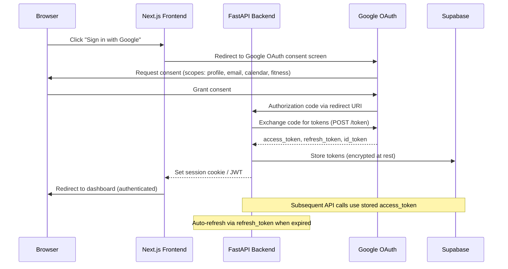
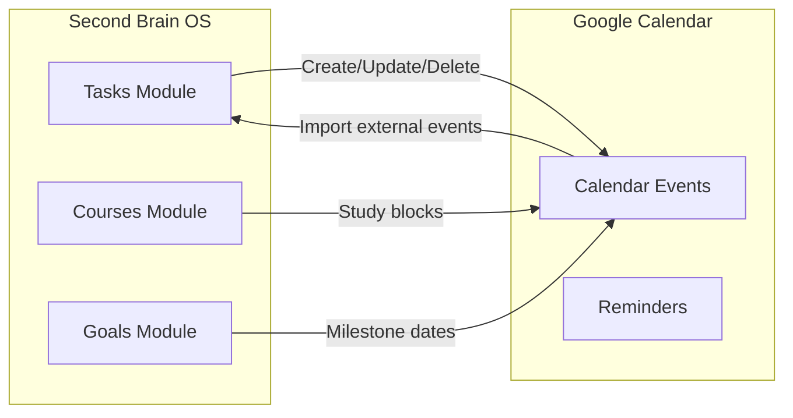

# Google Integration

## Document Control

| Field | Value |
|---|---|
| Document ID | INT-GGL-001 |
| Version | 1.0.0 |
| Status | Approved |
| Date | 2026-07-10 |
| Classification | Internal |
| Owner | Developer |

---

## Table of Contents

1. [Executive Summary](#1-executive-summary)
2. [Integration Overview](#2-integration-overview)
3. [OAuth 2.0 Authentication Flow](#3-oauth-20-authentication-flow)
4. [Google Calendar Sync](#4-google-calendar-sync)
5. [Google Fit Sleep Import](#5-google-fit-sleep-import)
6. [Google Drive (Future)](#6-google-drive-future)
7. [Gmail Integration (Future)](#7-gmail-integration-future)
8. [API Configuration](#8-api-configuration)
9. [Scopes & Permissions](#9-scopes--permissions)
10. [Rate Limits & Quotas](#10-rate-limits--quotas)
11. [Data Flow & Processing](#11-data-flow--processing)
12. [Error Handling](#12-error-handling)
13. [Token Refresh & Lifecycle](#13-token-refresh--lifecycle)
14. [Security Considerations](#14-security-considerations)
15. [Monitoring & Observability](#15-monitoring--observability)
16. [Cost Tracking](#16-cost-tracking)
17. [Testing Strategy](#17-testing-strategy)
18. [Edge Cases](#18-edge-cases)
19. [Failure Scenarios](#19-failure-scenarios)
20. [References](#20-references)

---

## 1. Executive Summary

The Google integration provides authentication via Google OAuth, two-way calendar sync for tasks and study blocks, and sleep data import from Google Fit. It follows a server-side OAuth flow where tokens are stored in Supabase and never exposed to the client.

---

## 2. Integration Overview

| Property | Value |
|---|---|
| Provider | Google Cloud Console |
| APIs Used | Calendar v3, Fitness v1, OAuth 2.0, People API (profile) |
| Auth Method | OAuth 2.0 (Authorization Code + PKCE) |
| Client Library | `google-api-python-client` (backend), `@react-oauth/google` (frontend) |
| Primary Endpoint | `https://www.googleapis.com` |
| Cost | Free (standard API quotas) |

---

## 3. OAuth 2.0 Authentication Flow



### 3.1 OAuth Configuration

```python
GOOGLE_CLIENT_ID = os.getenv("GOOGLE_CLIENT_ID")
GOOGLE_CLIENT_SECRET = os.getenv("GOOGLE_CLIENT_SECRET")
GOOGLE_REDIRECT_URI = os.getenv("GOOGLE_REDIRECT_URI", "https://api.secondbrainos.com/api/v1/auth/google/callback")
```

### 3.2 Token Exchange

```python
async def exchange_auth_code(code: str) -> dict:
    async with httpx.AsyncClient() as client:
        resp = await client.post(
            "https://oauth2.googleapis.com/token",
            data={
                "code": code,
                "client_id": GOOGLE_CLIENT_ID,
                "client_secret": GOOGLE_CLIENT_SECRET,
                "redirect_uri": GOOGLE_REDIRECT_URI,
                "grant_type": "authorization_code",
            },
        )
        resp.raise_for_status()
        return resp.json()
```

---

## 4. Google Calendar Sync

### 4.1 Sync Architecture



### 4.2 Sync Direction

| Direction | Trigger | Frequency | Conflict Resolution |
|---|---|---|---|
| OS → Google Calendar | Task CRUD, course schedule change | Real-time (via API) | OS is source of truth for tasks |
| Google Calendar → OS | External event detected | Every 15 min (cron) | Keep external events as read-only references |
| Bi-directional | Manual sync request | On-demand | Last-write-wins with timestamp comparison |

### 4.3 Event Mapping

| OS Entity | Google Calendar Event | Fields Mapped |
|---|---|---|
| Task (with due_date) | Event (start=due_date, end=due_date+30min) | summary=title, description, colorId=priority |
| Course (study block) | Recurring event | summary=course_name, recurrence=schedule |
| Goal milestone | Event with 24hr duration | summary=milestone_name, description=goal |

---

## 5. Google Fit Sleep Import

### 5.1 Data Flow

1. User grants `fitness.sleep.read` scope during OAuth
2. Daily cron job calls Fitness API for last 24h sleep sessions
3. Raw data mapped to `sleep_logs` schema (bedtime, wake time, duration, quality)
4. User can manually trigger import from UI

### 5.2 API Request

```python
async def import_sleep_data(access_token: str) -> list[dict]:
    headers = {"Authorization": f"Bearer {access_token}"}
    end_time = int(datetime.now(timezone.utc).timestamp() * 1e9)
    start_time = end_time - (24 * 60 * 60 * 1e9)

    async with httpx.AsyncClient() as client:
        resp = await client.post(
            "https://www.googleapis.com/fitness/v1/users/me/sessions:search",
            headers=headers,
            json={
                "startTime": start_time,
                "endTime": end_time,
                "activityType": 72,  # SLEEP
            },
        )
        resp.raise_for_status()
        return resp.json().get("session", [])
```

---

## 6. Google Drive (Future)

| Feature | Status | Scope Required | Complexity |
|---|---|---|---|
| Import course materials from Drive | Planned | `drive.readonly` | Medium |
| Export weekly reviews as Docs | Vision | `drive.file` | High |
| Backup exports to Drive | Vision | `drive.file` | Medium |

---

## 7. Gmail Integration (Future)

| Feature | Status | Scope Required | Complexity |
|---|---|---|---|
| Import college emails as tasks | Planned | `gmail.readonly` | Medium |
| Send briefings/reviews via Gmail (fallback) | Vision | `gmail.send` | Low |

---

## 8. API Configuration

### 8.1 Google Cloud Project

| Setting | Value |
|---|---|
| Project Name | Second Brain OS |
| OAuth Consent Screen | External (testing mode) |
| Authorized Domains | `secondbrainos.com`, `vercel.app` |
| Application Type | Web application |

### 8.2 Redirect URIs

| Environment | URI |
|---|---|
| Local | `http://localhost:8000/api/v1/auth/google/callback` |
| Staging | `https://staging-api.secondbrainos.com/api/v1/auth/google/callback` |
| Production | `https://api.secondbrainos.com/api/v1/auth/google/callback` |

---

## 9. Scopes & Permissions

| Scope | Permission | Used By | Justification |
|---|---|---|---|
| `openid` | OpenID Connect identity | Auth | Required for sign-in |
| `email` | User email address | Auth | Profile display |
| `profile` | User profile info | Auth | Display name, avatar |
| `calendar` | Read/write calendar events | Calendar sync | Two-way task sync |
| `fitness.sleep.read` | Read sleep data | Sleep import | Auto-import sleep logs |

---

## 10. Rate Limits & Quotas

| API | Limit | Quota Unit | Reset |
|---|---|---|---|
| Calendar v3 | 1,000,000 requests/day | Per project | Daily |
| Fitness v1 | 10,000 requests/day | Per project | Daily |
| OAuth 2.0 | 10,000 requests/hour | Per project | Hourly |
| People API | 10,000 requests/day | Per project | Daily |

---

## 11. Data Flow & Processing

```
Google API Response → Validate schema → Transform to internal format → Store in Supabase → Return to client
```

---

## 12. Error Handling

| HTTP Status | Error Type | Action |
|---|---|---|
| 401 | Unauthorized (token expired) | Auto-refresh token, retry once |
| 403 | Insufficient permissions | Prompt user to re-consent |
| 429 | Rate limit exceeded | Exponential backoff (2s, 4s, 8s), queue |
| 5xx | Server error | Retry 3x, then degrade gracefully |
| 400 | Bad request | Log error, alert developer |

---

## 13. Token Refresh & Lifecycle

| Token | Lifetime | Storage | Refresh Mechanism |
|---|---|---|---|
| Access Token | 1 hour | In-memory + encrypted DB | Auto-refresh via refresh_token |
| Refresh Token | Permanent (until revoked) | Encrypted in `users_profile` | Used when access token expires |
| ID Token | 1 hour | Session cookie | Re-authenticate on expiry |

**Token Refresh Logic:**
```python
async def get_valid_credentials(user_id: str) -> dict:
    profile = await supabase.table("users_profile").select("*").eq("user_id", user_id).single().execute()
    tokens = decrypt_tokens(profile.data["google_tokens"])

    if datetime.fromisoformat(tokens["expiry"]) < datetime.now(timezone.utc):
        async with httpx.AsyncClient() as client:
            resp = await client.post(
                "https://oauth2.googleapis.com/token",
                data={
                    "client_id": GOOGLE_CLIENT_ID,
                    "client_secret": GOOGLE_CLIENT_SECRET,
                    "refresh_token": tokens["refresh_token"],
                    "grant_type": "refresh_token",
                },
            )
            new_tokens = resp.json()
            tokens["access_token"] = new_tokens["access_token"]
            tokens["expiry"] = (datetime.now(timezone.utc) + timedelta(seconds=new_tokens.get("expires_in", 3600))).isoformat()
            # Update stored tokens
            await supabase.table("users_profile").update({
                "google_tokens": encrypt_tokens(tokens)
            }).eq("user_id", user_id).execute()

    return tokens
```

---

## 14. Security Considerations

- Client secret stored server-side only, never in browser
- Tokens encrypted at rest using AES-256-GCM
- Refresh tokens can be revoked via Google Security Settings
- OAuth state parameter prevents CSRF on callback
- Scope minimization: only request what is needed
- Token rotation: refresh tokens rotated on security events

---

## 15. Monitoring & Observability

| Metric | Alert Threshold | Action |
|---|---|---|
| Calendar sync failure rate | > 5% | Alert developer |
| Token refresh failures | > 2 consecutive | Alert developer (user needs re-auth) |
| Sync latency | > 60s | Investigate Google API latency |
| Sleep import failure | > 3 days for active user | Alert user to re-connect |

---

## 16. Cost Tracking

| Service | Cost | Free Tier Limit |
|---|---|---|
| Google APIs | Free | Standard quotas suffice for single user |

---

## 17. Testing Strategy

| Test Type | Scope | Tool |
|---|---|---|
| Unit | Token refresh logic, event mapping | pytest |
| Mock | OAuth flow (mocked Google endpoint) | pytest + httpx mock |
| Integration | End-to-end calendar sync | Test Supabase + mocked API |

---

## 18. Edge Cases

- User revokes Google access → Graceful degradation (show static data)
- Token refresh fails multiple times → Prompt user to re-authenticate
- Calendar event deleted externally → Next sync pass detects and updates OS
- Network timeout during sync → Queue for next sync cycle

---

## 19. Failure Scenarios

| Scenario | Impact | Mitigation |
|---|---|---|
| Google OAuth down | Login unavailable | Fallback to email/password auth |
| Calendar API outage | Sync paused | Queue events, resume on recovery |
| Refresh token expired (90d inactivity) | Full re-auth needed | Send email notification to user |

---

## 20. References

| Resource | URL |
|---|---|
| Google Identity Platform | https://developers.google.com/identity |
| Calendar API v3 | https://developers.google.com/calendar/api/v3/reference |
| Fitness API | https://developers.google.com/fit/rest/v1/reference |
| OAuth 2.0 for Web Apps | https://developers.google.com/identity/protocols/oauth2/web-server |
| Integration Architecture | `docs/engineering/37_IntegrationArchitecture.md` |
