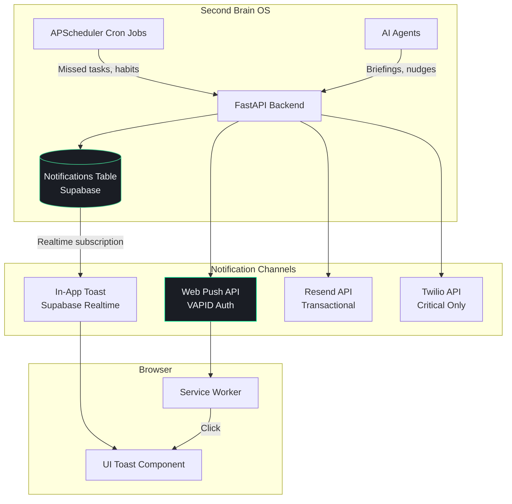

# Notifications Integration

## Document Control

| Field | Value |
|---|---|
| Document ID | INT-NTF-010 |
| Version | 1.0.0 |
| Status | Approved |
| Date | 2026-07-10 |
| Classification | Internal |
| Owner | Developer |

---

## Table of Contents

1. [Executive Summary](#1-executive-summary)
2. [Integration Overview](#2-integration-overview)
3. [Architecture Diagram](#3-architecture-diagram)
4. [Notification Channels](#4-notification-channels)
5. [Web Push (Browser) Notifications](#5-web-push-browser-notifications)
6. [In-App Notifications](#6-in-app-notifications)
7. [Email Notifications](#7-email-notifications)
8. [SMS Notifications (Twilio)](#8-sms-notifications-twilio)
9. [Priority Tiers & Escalation](#9-priority-tiers--escalation)
10. [VAPID Key Setup](#10-vapid-key-setup)
11. [Push Subscription Flow](#11-push-subscription-flow)
12. [Error Handling](#12-error-handling)
13. [Rate Limits & Quotas](#13-rate-limits--quotas)
14. [Security Considerations](#14-security-considerations)
15. [Monitoring & Observability](#15-monitoring--observability)
16. [Cost Tracking](#16-cost-tracking)
17. [Testing Strategy](#17-testing-strategy)
18. [Edge Cases](#18-edge-cases)
19. [Failure Scenarios](#19-failure-scenarios)
20. [Configuration Reference](#20-configuration-reference)

---

## 1. Executive Summary

The Notifications system delivers real-time alerts to users across multiple channels — browser push, in-app, email, and SMS — based on priority levels. It powers task reminders, habit nudges, opportunity alerts, sleep wind-down messages, and critical system notifications. The system follows an escalation model: low-priority items stay in-app, while critical items escalate through push → email → SMS.

---

## 2. Integration Overview

| Property | Value |
|---|---|
| Push Protocol | Web Push (RFC 8030) |
| Push Library | `web-push` (Python) |
| Email Provider | Resend |
| SMS Provider | Twilio |
| Auth (Push) | VAPID keys |
| Database | `notifications` table in Supabase |
| Status | Active (push + email), SMS (planned) |

---

## 3. Architecture Diagram



---

## 4. Notification Channels

| Channel | Latency | Cost | Offline? | Best For |
|---|---|---|---|---|
| In-App (Realtime) | Instant | Free | No | All non-critical notifications |
| Web Push | < 5s | Free | Yes (browser closed) | Task reminders, habit nudges |
| Email | < 30s | Free tier | Yes | Daily briefings, weekly reviews |
| SMS | < 10s | ~$0.0079/sms | Yes | Critical missed tasks (escalation) |

---

## 5. Web Push (Browser) Notifications

### 5.1 Service Worker Registration

```typescript
// apps/web/public/sw.js
self.addEventListener('push', (event) => {
  const data = event.data?.json() ?? { title: 'ARIA', body: 'New update' }
  const options = {
    body: data.body,
    icon: '/icon-192.png',
    badge: '/badge-72.png',
    data: { url: data.url },
  }
  event.waitUntil(
    self.registration.showNotification(data.title, options)
  )
})

self.addEventListener('notificationclick', (event) => {
  event.notification.close()
  const url = event.notification.data?.url ?? '/'
  event.waitUntil(clients.openWindow(url))
})
```

### 5.2 Frontend Subscription

```typescript
// apps/web/hooks/usePushNotifications.ts
export async function subscribeToPush() {
  const registration = await navigator.serviceWorker.ready
  const subscription = await registration.pushManager.subscribe({
    userVisibleOnly: true,
    applicationServerKey: urlBase64ToUint8Array(
      process.env.NEXT_PUBLIC_VAPID_PUBLIC_KEY!
    ),
  })

  await fetch('/api/v1/notifications/subscribe', {
    method: 'POST',
    body: JSON.stringify(subscription),
  })
}
```

### 5.3 Server-Side Send

```python
from shared.utils.logger import logger
import webpush
import json

webpush.config({
    "VAPID_PUBLIC_KEY": os.getenv("VAPID_PUBLIC_KEY"),
    "VAPID_PRIVATE_KEY": os.getenv("VAPID_PRIVATE_KEY"),
    "VAPID_CLAIMS": {"sub": "mailto:admin@secondbrainos.com"},
})

async def send_push_notification(subscription: dict, title: str, body: str, url: str = "/"):
    try:
        webpush.send(
            subscription=subscription,
            payload=json.dumps({"title": title, "body": body, "url": url}),
            ttl=86400,  # 24 hours
        )
    except webpush.errors.ExpiredSubscriptionError:
        await remove_expired_subscription(subscription["endpoint"])
```

---

## 6. In-App Notifications

### 6.1 Notifications Table Schema

```sql
CREATE TABLE notifications (
    id UUID PRIMARY KEY DEFAULT gen_random_uuid(),
    user_id UUID NOT NULL REFERENCES users(id) ON DELETE CASCADE,
    type VARCHAR(64) NOT NULL,        -- task_reminder, habit_nudge, briefing, etc.
    title VARCHAR(255) NOT NULL,
    body TEXT,
    priority VARCHAR(16) DEFAULT 'normal',  -- low, normal, high, critical
    channel VARCHAR(32) DEFAULT 'in_app',   -- in_app, push, email, sms
    is_read BOOLEAN DEFAULT FALSE,
    read_at TIMESTAMPTZ,
    action_url TEXT,
    metadata JSONB DEFAULT '{}',
    created_at TIMESTAMPTZ NOT NULL DEFAULT NOW()
);

CREATE INDEX idx_notifications_user ON notifications(user_id, created_at DESC);
CREATE INDEX idx_notifications_unread ON notifications(user_id) WHERE is_read = FALSE;
```

### 6.2 Realtime Delivery

```typescript
// Client subscribes to new notifications
const channel = supabase
  .channel(`notifications:${user.id}`)
  .on('postgres_changes', {
    event: 'INSERT',
    schema: 'public',
    table: 'notifications',
    filter: `user_id=eq.${user.id}`,
  }, (payload) => {
    showToast(payload.new)
  })
  .subscribe()
```

---

## 7. Email Notifications

See `docs/engineering/integrations/Email.md` for full email configuration. Email is used for:

| Notification Type | Route | Frequency |
|---|---|---|
| Daily Briefing | Scheduler → Email | Daily |
| Weekly Review | Scheduler → Email | Weekly |
| Missed Task Alert | Scheduler → Email | As needed |
| Critical Opportunity | Agent A06 → Email | As needed |

---

## 8. SMS Notifications (Twilio)

SMS is reserved for **critical escalations only**:

```python
from twilio.rest import Client

TWILIO_SID = os.getenv("TWILIO_ACCOUNT_SID")
TWILIO_TOKEN = os.getenv("TWILIO_AUTH_TOKEN")
TWILIO_PHONE = os.getenv("TWILIO_PHONE_NUMBER")

async def send_sms_alert(to: str, message: str):
    """Send critical SMS notification via Twilio."""
    client = Client(TWILIO_SID, TWILIO_TOKEN)
    try:
        msg = client.messages.create(
            body=message,
            from_=TWILIO_PHONE,
            to=to,
        )
        return {"sid": msg.sid, "status": "sent"}
    except Exception as e:
        logger.error(f"SMS send failed: {e}")
        return {"status": "failed", "error": str(e)}
```

---

## 9. Priority Tiers & Escalation

| Priority | Icon | In-App | Push | Email | SMS | Example |
|---|---|---|---|---|---|---|
| **Critical** | 🔴 | Instant | Instant | Instant | 3rd escalation | Task overdue 2h (missed_count >= 3, priority=high) |
| **High** | 🟠 | Instant | Instant | Yes | No | Missed task (missed_count=1), opportunity alert |
| **Normal** | 🔵 | Instant | Yes | Daily digest | No | Habit reminder, course nudge |
| **Low** | ⚪ | Yes (badge) | No | Weekly digest | No | System tip, non-critical update |

### Escalation Flow

```python
async def send_notification(user_id: str, title: str, body: str, priority: str = "normal"):
    # 1. Always store in-app
    notification = await store_notification(user_id, title, body, priority)

    # 2. Push for normal+
    if priority in ("normal", "high", "critical"):
        await send_push(user_id, title, body)

    # 3. Email for high+
    if priority in ("high", "critical"):
        await send_email(user_id, title, body)

    # 4. SMS for critical (3rd escalation)
    if priority == "critical":
        await send_sms(user_id, f"CRITICAL: {title} - {body}")
```

---

## 10. VAPID Key Setup

```bash
# Generate VAPID keys (one-time)
npx web-push generate-vapid-keys

# Output:
# Public Key: BAdQX6R...
# Private Key: _9P9j9...

# Set environment variables:
# NEXT_PUBLIC_VAPID_PUBLIC_KEY=BAdQX6R...
# VAPID_PUBLIC_KEY=BAdQX6R...
# VAPID_PRIVATE_KEY=_9P9j9...
```

---

## 11. Push Subscription Flow

```
1. Page loads → Register service worker (sw.js)
2. Check for existing subscription → If none, request
3. navigator.serviceWorker.ready → pushManager.subscribe()
4. POST subscription object to /api/v1/notifications/subscribe
5. Backend stores in users_profile.push_subscription
6. When notification needed → Backend sends via webpush library
7. Service worker receives push → Shows notification
8. User clicks → Opens URL or focuses app
```

---

## 12. Error Handling

| Error | Cause | Action |
|---|---|---|
| PushSubscriptionExpired | User cleared browser data | Remove old subscription |
| Notification permission denied | User blocked | Degrade to in-app only |
| Rate limit exceeded | Too many pushes | Queue + batch notifications |
| SMS failed | Invalid number | Log, escalate manually |
| Email bounced | Invalid address | Disable email for user |

---

## 13. Rate Limits & Quotas

| Channel | Limit | Window |
|---|---|---|
| Web Push | 100 notifications/user/min | Per minute |
| Email (Resend free) | 100/day | Per day |
| SMS (Twilio) | 1/second | Per second |
| In-App | Unlimited | Real-time |

---

## 14. Security Considerations

- VAPID private key stored server-side only
- Push subscriptions tied to authenticated user
- No PII in push notification payload (title/body only)
- Users can opt out per channel (email, push, SMS)
- Twilio credentials never exposed to client
- Notification payloads limited to 4 KB

---

## 15. Monitoring & Observability

| Metric | Source | Alert |
|---|---|---|
| Push delivery rate | Backend logs | < 90% |
| Email delivery rate | Resend dashboard | < 95% |
| SMS failure rate | Twilio logs | > 5% |
| Notification volume | Notification table | Spike detection |
| Subscription expiry count | Cleanup job | > 10/day |

---

## 16. Cost Tracking

| Channel | Cost | Monthly Volume | Total/Month |
|---|---|---|---|
| Web Push | Free | ~200 pushes | $0 |
| In-App | Free | Unlimited | $0 |
| Email (Resend free) | $0 | ~41 emails | $0 |
| SMS (Twilio) | ~$0.0079/msg | ~5 SMS | ~$0.04 |
| **Total** | | | **~$0.04** |

---

## 17. Testing Strategy

| Test Type | Scope |
|---|---|
| Unit | Notification creation, priority routing, channel selection |
| Mock | Web Push API, Resend API, Twilio API |
| Integration | Full notification flow from trigger to delivery |
| Service worker | Push event handling, click handling |
| Permission | Denied/granted/blocked browser permission states |

---

## 18. Edge Cases

- Browser notifications blocked → Fall back to in-app only, show UI prompt
- Multiple tabs open → Service worker handles deduplication
- User offline → Server-side TTL ensures delivery when back online
- Subscription expired → Clean up on send failure
- Rapid-fire notifications → Batch into summary notification
- User clears browser data → New subscription created on next visit

---

## 19. Failure Scenarios

| Scenario | Impact | Mitigation |
|---|---|---|
| Push subscription expired | No push delivery | Auto-cleanup on send failure |
| Twilio API outage | No SMS for critical items | Email escalation as fallback |
| Resend API outage | No email delivery | Queue for retry, in-app as fallback |
| Service worker unregistered | No push at all | Re-register on page load |
| All channels fail | User sees nothing | Log failure, retry with backoff |

---

## 20. Configuration Reference

```env
# VAPID Keys (Web Push)
NEXT_PUBLIC_VAPID_PUBLIC_KEY=BA...
VAPID_PUBLIC_KEY=BA...
VAPID_PRIVATE_KEY=_9...

# Twilio (SMS — Critical only)
TWILIO_ACCOUNT_SID=AC...
TWILIO_AUTH_TOKEN=...
TWILIO_PHONE_NUMBER=+1...

# Email (Resend)
RESEND_API_KEY=re_...
```
