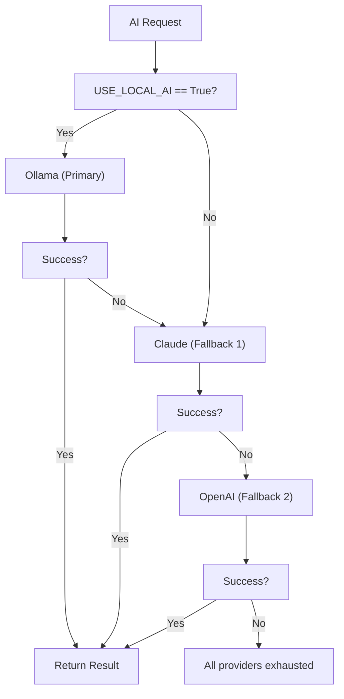

# OpenAI Integration

## Document Control

| Field | Value |
|---|---|
| Document ID | INT-OPN-004 |
| Version | 1.0.0 |
| Status | Approved |
| Date | 2026-07-10 |
| Classification | Internal |
| Owner | Developer |

---

## Table of Contents

1. [Executive Summary](#1-executive-summary)
2. [Integration Overview](#2-integration-overview)
3. [API Configuration](#3-api-configuration)
4. [Supported Models](#4-supported-models)
5. [Provider Selection Flow](#5-provider-selection-flow)
6. [API Key Management](#6-api-key-management)
7. [Rate Limits & Quotas](#7-rate-limits--quotas)
8. [Fallback Integration](#8-fallback-integration)
9. [Cost Tracking](#9-cost-tracking)
10. [Request/Response Format](#10-requestresponse-format)
11. [Error Handling](#11-error-handling)
12. [Streaming Support](#12-streaming-support)
13. [Security Considerations](#13-security-considerations)
14. [Monitoring & Observability](#14-monitoring--observability)
15. [Testing Strategy](#15-testing-strategy)
16. [Edge Cases](#16-edge-cases)
17. [Failure Scenarios](#17-failure-scenarios)
18. [Configuration Reference](#18-configuration-reference)
19. [Troubleshooting](#19-troubleshooting)
20. [References](#20-references)

---

## 1. Executive Summary

OpenAI is available as an alternative AI provider for Second Brain OS. Though not the default (Ollama is primary, Claude is fallback), OpenAI provides a familiar API surface for development, testing, and as an additional fallback option. Integration follows the same provider pattern as Claude and Ollama.

---

## 2. Integration Overview

| Property | Value |
|---|---|
| Provider | OpenAI |
| API Endpoint | `https://api.openai.com/v1` |
| Auth Method | Bearer token (`Authorization: Bearer sk-...`) |
| Default Model | `gpt-4o` (chat completions) |
| Fallback Model | `gpt-4o-mini` (cost-optimized) |
| Status | Planned / Available for development |

---

## 3. API Configuration

```python
import httpx

OPENAI_API_KEY = os.getenv("OPENAI_API_KEY", "")
OPENAI_BASE_URL = os.getenv("OPENAI_BASE_URL", "https://api.openai.com/v1")
OPENAI_MODEL = os.getenv("OPENAI_MODEL", "gpt-4o")
OPENAI_TIMEOUT = int(os.getenv("OPENAI_TIMEOUT", "60"))

class OpenAIClient:
    def __init__(self):
        self.api_key = OPENAI_API_KEY
        self.base_url = OPENAI_BASE_URL
        self.model = OPENAI_MODEL

    async def generate(self, prompt: str, system: str = "", max_tokens: int = 1024, temperature: float = 0.5) -> str:
        async with httpx.AsyncClient(timeout=OPENAI_TIMEOUT) as client:
            resp = await client.post(
                f"{self.base_url}/chat/completions",
                headers={
                    "Authorization": f"Bearer {self.api_key}",
                    "Content-Type": "application/json",
                },
                json={
                    "model": self.model,
                    "messages": [
                        {"role": "system", "content": system},
                        {"role": "user", "content": prompt},
                    ],
                    "max_tokens": max_tokens,
                    "temperature": temperature,
                },
            )
            resp.raise_for_status()
            data = resp.json()
            return data["choices"][0]["message"]["content"]
```

---

## 4. Supported Models

| Model | Use Case | Cost (Input) | Cost (Output) | Context Window |
|---|---|---|---|---|
| `gpt-4o` | Complex reasoning, agent orchestration | $2.50/1M tokens | $10.00/1M tokens | 128K |
| `gpt-4o-mini` | Simple tasks, cost-sensitive | $0.15/1M tokens | $0.60/1M tokens | 128K |
| `gpt-4-turbo` | Legacy (high quality) | $10.00/1M tokens | $30.00/1M tokens | 128K |
| `gpt-3.5-turbo` | Legacy (fast, cheap) | $0.50/1M tokens | $1.50/1M tokens | 16K |

---

## 5. Provider Selection Flow



---

## 6. API Key Management

| Practice | Implementation |
|---|---|
| Storage | Railway env vars (encrypted) |
| Rotation | Every 90 days |
| Validation | Key format check (`sk-...`) on startup |
| Monitoring | Cost alerts via OpenAI Usage API |

---

## 7. Rate Limits & Quotas

| Tier | Requests/Min | Tokens/Min | RPM (GPT-4o) |
|---|---|---|---|
| Free | 20 | 40,000 | 10 |
| Tier 1 ($5 paid) | 500 | 200,000 | 100 |
| Tier 2 ($50 paid) | 5,000 | 10,000,000 | 500 |

---

## 8. Fallback Integration

OpenAI is configured as the **third-tier fallback** in the LLM client fallback chain. It activates only when both Ollama and Claude are unavailable.

| Position | Provider | Circuit Breaker | Timeout |
|---|---|---|---|
| 1st | Ollama | 5 failures → 60s cooldown | 60s |
| 2nd | Claude | 3 failures → 120s cooldown | 120s |
| 3rd | OpenAI | 3 failures → 120s cooldown | 60s |

---

## 9. Cost Tracking

```python
OPENAI_COST_PER_TOKEN = {
    "gpt-4o": {"input": 2.50 / 1_000_000, "output": 10.00 / 1_000_000},
    "gpt-4o-mini": {"input": 0.15 / 1_000_000, "output": 0.60 / 1_000_000},
}

def estimate_openai_cost(model: str, input_tokens: int, output_tokens: int) -> float:
    rates = OPENAI_COST_PER_TOKEN.get(model, OPENAI_COST_PER_TOKEN["gpt-4o-mini"])
    return (input_tokens * rates["input"]) + (output_tokens * rates["output"])
```

---

## 10. Request/Response Format

```json
// Request
{
  "model": "gpt-4o",
  "messages": [
    {"role": "system", "content": "You are ARIA..."},
    {"role": "user", "content": "Generate my daily briefing"}
  ],
  "temperature": 0.5,
  "max_tokens": 2048
}

// Response
{
  "id": "chatcmpl-123",
  "choices": [{"message": {"content": "Here is your briefing...", "role": "assistant"}}],
  "usage": {"prompt_tokens": 850, "completion_tokens": 320, "total_tokens": 1170}
}
```

---

## 11. Error Handling

| HTTP Status | Error | Action |
|---|---|---|
| 401 | Invalid API key | Alert developer, skip provider |
| 429 | Rate limit exceeded | Backoff + retry (exponential: 2s, 4s, 8s) |
| 500 | Server error | Retry 3x, then fail over to next provider |
| 400 | Bad request (context length) | Reduce max_tokens, retry |

---

## 12. Streaming Support

```python
async def stream_openai(prompt: str, system: str = ""):
    async with httpx.AsyncClient(timeout=120) as client:
        async with client.stream(
            "POST",
            f"{OPENAI_BASE_URL}/chat/completions",
            json={
                "model": OPENAI_MODEL,
                "messages": [
                    {"role": "system", "content": system},
                    {"role": "user", "content": prompt},
                ],
                "stream": True,
            },
            headers={"Authorization": f"Bearer {OPENAI_API_KEY}"},
        ) as resp:
            async for line in resp.aiter_lines():
                if line.startswith("data: ") and line != "data: [DONE]":
                    yield json.loads(line[6:])["choices"][0]["delta"].get("content", "")
```

---

## 13. Security Considerations

- API key stored server-side only
- All requests proxied through FastAPI backend
- Usage monitored for anomalies (unusual spikes)
- Key can be rotated without downtime (environment variable update + restart)

---

## 14. Monitoring & Observability

| Metric | Source | Alert |
|---|---|---|
| API call cost | OpenAI Usage API | > $10/day |
| Error rate | Backend logs | > 5% |
| Latency | Request timing | > 30s p95 |
| Fallback activations | Provider chain | > 10/day (indicates Ollama/Claude issue) |

---

## 15. Testing Strategy

| Test Type | Scope |
|---|---|
| Unit | Request formatting, cost calculation |
| Mock | OpenAI API responses |
| Integration | Full provider fallback chain |

---

## 16. Edge Cases

- Context length exceeded → Truncate prompt and retry
- Empty response → Check for finish_reason = `length` (truncated)
- Streaming timeout → Fall back to non-streaming request

---

## 17. Failure Scenarios

| Scenario | Impact | Mitigation |
|---|---|---|
| OpenAI outage | No OpenAI fallback | Use Ollama + Claude only |
| API key expired | Provider unavailable | Rotate key, deploy new env var |
| Cost spike > budget | Unexpected bill | Hard budget cap, alert on 80% threshold |

---

## 18. Configuration Reference

```env
OPENAI_API_KEY=sk-proj-...
OPENAI_MODEL=gpt-4o
OPENAI_BASE_URL=https://api.openai.com/v1
OPENAI_TIMEOUT=60
OPENAI_MAX_RETRIES=3
```

---

## 19. Troubleshooting

| Issue | Check | Solution |
|---|---|---|
| 401 error | API key validity | Verify key in OpenAI dashboard |
| 429 error | Rate limit status | Wait or upgrade tier |
| Context length error | Prompt tokens | Reduce prompt or increase max_tokens |

---

## 20. References

| Resource | URL |
|---|---|
| OpenAI API Reference | https://platform.openai.com/docs/api-reference |
| OpenAI Models | https://platform.openai.com/docs/models |
| OpenAI Pricing | https://openai.com/pricing |
| Rate Limits | https://platform.openai.com/docs/guides/rate-limits |
| Integration Architecture | `docs/engineering/37_IntegrationArchitecture.md` |
