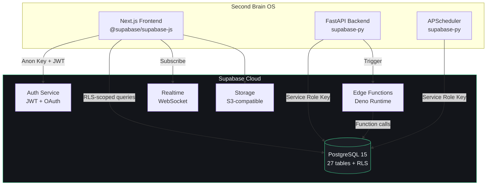

# Supabase Integration

## Document Control

| Field | Value |
|---|---|
| Document ID | INT-SUP-008 |
| Version | 1.0.0 |
| Status | Approved |
| Date | 2026-07-10 |
| Classification | Internal |
| Owner | Developer |

---

## Table of Contents

1. [Executive Summary](#1-executive-summary)
2. [Integration Overview](#2-integration-overview)
3. [Architecture Diagram](#3-architecture-diagram)
4. [Authentication & Auth](#4-authentication--auth)
5. [Database Access](#5-database-access)
6. [Row Level Security](#6-row-level-security)
7. [Realtime Subscriptions](#7-realtime-subscriptions)
8. [Edge Functions](#8-edge-functions)
9. [Storage & Files](#9-storage--files)
10. [API Endpoints Used](#10-api-endpoints-used)
11. [Client Configuration](#11-client-configuration)
12. [Data Flow & Processing](#12-data-flow--processing)
13. [Migration Strategy](#13-migration-strategy)
14. [Error Handling](#14-error-handling)
15. [Rate Limits & Quotas](#15-rate-limits--quotas)
16. [Security Considerations](#16-security-considerations)
17. [Monitoring & Observability](#17-monitoring--observability)
18. [Testing Strategy](#18-testing-strategy)
19. [Edge Cases](#19-edge-cases)
20. [Failure Scenarios](#20-failure-scenarios)

---

## 1. Executive Summary

Supabase is the **core backend platform** for Second Brain OS, providing PostgreSQL database, authentication, realtime subscriptions, edge functions, and file storage. All user data — tasks, goals, habits, sleep logs, memory, and chat history — is stored and managed through Supabase. It is the single source of truth for all persistence.

---

## 2. Integration Overview

| Property | Value |
|---|---|
| Provider | Supabase (managed) |
| Components | PostgreSQL, Auth, Realtime, Edge Functions, Storage |
| SDK (Python) | `supabase-py` |
| SDK (TypeScript) | `@supabase/supabase-js`, `@supabase/auth-helpers-nextjs` |
| Primary Endpoint | Project-specific URL (e.g., `https://{project}.supabase.co`) |
| Tier | Free (dev), Pro $25/mo (prod) |
| Status | **Core dependency** — required for all features |

### Services Used

| Service | Version | Purpose |
|---|---|---|
| PostgreSQL | 15.1 | Primary database (all CRUD) |
| Auth | Built-in | JWT-based authentication, Google OAuth |
| Realtime | WebSocket | Live updates for tasks, chat |
| Edge Functions | Deno 2 | Serverless AI proxy, webhook handlers |
| Storage | S3-compatible | File uploads (avatars, exports) |

---

## 3. Architecture Diagram



---

## 4. Authentication & Auth

### 4.1 Auth Providers

| Provider | Type | Status | Configuration |
|---|---|---|---|
| Email/Password | Built-in | Active | Supabase Auth dashboard |
| Google OAuth | OAuth 2.0 | Active | Client ID + Secret from GCP |
| GitHub OAuth | OAuth 2.0 | Active | Client ID + Secret from GitHub |
| Magic Link | Email | Planned | Resend integration |

### 4.2 JWT Token Structure

```json
{
  "sub": "user-uuid",
  "email": "user@example.com",
  "app_metadata": {
    "provider": "google"
  },
  "user_metadata": {
    "full_name": "User Name",
    "avatar_url": "https://..."
  },
  "exp": 1718000000,
  "iat": 1717913600
}
```

### 4.3 Auth Flow

```
1. User clicks "Sign in with Google"
2. Redirect to Google OAuth consent screen
3. User grants consent → callback to /api/v1/auth/google/callback
4. Backend exchanges code for tokens
5. Supabase Auth creates/updates user
6. JWT issued to client (stored in cookie/localStorage)
7. All subsequent requests include JWT in Authorization header
8. Backend validates JWT via Supabase Admin API
```

---

## 5. Database Access

### 5.1 Client Configuration

**TypeScript (Frontend):**
```typescript
import { createClient } from '@supabase/supabase-js'

const supabase = createClient(
  process.env.NEXT_PUBLIC_SUPABASE_URL!,
  process.env.NEXT_PUBLIC_SUPABASE_ANON_KEY!,
  {
    auth: {
      persistSession: true,
      autoRefreshToken: true,
    },
  }
)
```

**Python (Backend):**
```python
from supabase import create_client
import os

supabase = create_client(
    os.getenv("SUPABASE_URL"),
    os.getenv("SUPABASE_SERVICE_KEY"),
)
```

### 5.2 Query Patterns

```python
# SELECT with user isolation
data = supabase.table("tasks").select(
    "id, title, status, priority, due_date"
).eq("user_id", user_id).order("created_at", desc=True).execute()

# INSERT
result = supabase.table("tasks").insert({
    "title": "Complete assignment",
    "status": "pending",
    "user_id": user_id,
}).execute()

# UPDATE
result = supabase.table("tasks").update({
    "status": "completed",
}).eq("id", task_id).eq("user_id", user_id).execute()

# DELETE
result = supabase.table("tasks").delete().eq(
    "id", task_id
).eq("user_id", user_id).execute()
```

### 5.3 All Tables

| Table | Primary Purpose | Indexed Columns |
|---|---|---|
| `users` | User profiles, preferences | `id`, `email` |
| `tasks` | Task CRUD | `user_id`, `status`, `due_date` |
| `courses` | Course tracking | `user_id`, `status` |
| `goals` | Goal management | `user_id`, `status` |
| `habits` | Habit definitions | `user_id` |
| `habit_logs` | Daily habit completion | `user_id`, `date` |
| `sleep_logs` | Sleep tracking | `user_id`, `date` |
| `income_entries` | Income tracking | `user_id`, `date` |
| `projects` | Project phases | `user_id` |
| `ideas` | Idea pipeline | `user_id`, `stage` |
| `resources` | Resource library | `user_id` |
| `opportunities` | Opportunity radar | `user_id`, `match_score` |
| `time_entries` | Time tracking | `user_id`, `date` |
| `chat_messages` | ARIA chat history | `user_id` |
| `daily_briefings` | Morning briefings | `user_id`, `date` |
| `weekly_reviews` | Weekly reviews | `user_id` |
| `memory` | AI persistent memory | `user_id` |
| `learning_progress` | Learning metrics | `user_id`, `date` |

---

## 6. Row Level Security

### 6.1 RLS Policy Template

```sql
-- Every table follows this pattern:
CREATE POLICY user_isolation_{table_name} ON {table_name}
    FOR ALL USING (user_id = auth.uid())
    WITH CHECK (user_id = auth.uid());

ALTER TABLE {table_name} ENABLE ROW LEVEL SECURITY;
```

### 6.2 RLS Enforcement

- **Frontend queries**: Use `anon key` + JWT — RLS enforces user isolation automatically
- **Backend queries**: Use `service_role key` — RLS bypassed; **must** filter by `user_id` explicitly
- **Edge Functions**: Use `service_role key` — explicit `user_id` filtering required

```python
# Backend: MUST filter explicitly (service_role bypasses RLS)
data = supabase.table("tasks").select("*").eq("user_id", user_id).execute()
```

---

## 7. Realtime Subscriptions

### 7.1 Active Channels

| Channel | Table | Event | Purpose |
|---|---|---|---|
| `tasks:{user_id}` | `tasks` | INSERT, UPDATE, DELETE | Live task updates |
| `chat:{user_id}` | `chat_messages` | INSERT | Real-time chat |
| `briefings:{user_id}` | `daily_briefings` | INSERT | New briefing notification |

### 7.2 Client Subscription

```typescript
const subscription = supabase
  .channel(`tasks:${user.id}`)
  .on(
    'postgres_changes',
    { event: '*', schema: 'public', table: 'tasks', filter: `user_id=eq.${user.id}` },
    (payload) => {
      // Handle insert/update/delete
      queryClient.invalidateQueries({ queryKey: ['tasks'] })
    }
  )
  .subscribe()
```

---

## 8. Edge Functions

### 8.1 Function Inventory

| Function | Trigger | Purpose |
|---|---|---|
| `brave-search` | HTTP call | Proxy Brave Search API calls |
| `ai-proxy` | HTTP call | Route AI requests to Ollama/Claude |
| `webhook-handler` | GitHub webhook | Process push/PR events |
| `email-notify` | Database change | Send email notifications via Resend |

### 8.2 Function Template

```typescript
// supabase/functions/brave-search/index.ts
import { serve } from 'https://deno.land/std@0.177.0/http/server.ts'

serve(async (req) => {
  const { query } = await req.json()
  const BRAVE_API_KEY = Deno.env.get('BRAVE_API_KEY')

  const response = await fetch(
    `https://api.search.brave.com/res/v1/web/search?q=${encodeURIComponent(query)}`,
    { headers: { 'X-Subscription-Token': BRAVE_API_KEY } }
  )

  const data = await response.json()
  return new Response(JSON.stringify(data), {
    headers: { 'Content-Type': 'application/json' },
  })
})
```

---

## 9. Storage & Files

| Bucket | Purpose | Public | Allowed Types | Max Size |
|---|---|---|---|---|
| `avatars` | User profile pictures | Yes | image/* | 2 MB |
| `exports` | GDPR data exports | No (signed URL) | application/json | 50 MB |
| `backups` | Manual database exports | No (admin only) | .sql, .dump | 500 MB |

---

## 10. API Endpoints Used

| Endpoint | Method | Purpose |
|---|---|---|
| `/auth/v1/token?grant_type=password` | POST | Email/password login |
| `/auth/v1/token?grant_type=refresh_token` | POST | Token refresh |
| `/rest/v1/{table}` | GET/POST/PATCH/DELETE | CRUD operations |
| `/rest/v1/rpc/{function}` | POST | Call stored procedures |
| `/realtime/v1/websocket` | WS | Realtime subscriptions |
| `/storage/v1/object/{bucket}/{path}` | GET/POST/DELETE | File operations |
| `/functions/v1/{name}` | POST | Invoke edge functions |

---

## 11. Client Configuration

```env
# Frontend (public, safe to expose)
NEXT_PUBLIC_SUPABASE_URL=https://{project}.supabase.co
NEXT_PUBLIC_SUPABASE_ANON_KEY=eyJhbGciOiJ...

# Backend (secret, never expose)
SUPABASE_URL=https://{project}.supabase.co
SUPABASE_KEY=eyJhbGciOiJ...       # anon key (role-limited)
SUPABASE_SERVICE_KEY=eyJhbGciOiJ...  # service_role key (admin)
JWT_SECRET=your-jwt-secret
```

---

## 12. Data Flow & Processing

```
Client Request → JWT Validation (Backend) → Supabase Query → RLS Check → Response
                         ↓
                Structured Logging (duration, rows, status)
                         ↓
                Cache (in-memory TTL, 5 min default)
```

---

## 13. Migration Strategy

All schema changes follow a migration-based workflow:

```
migrations/
├── 001_initial_schema.sql
├── 002_add_habit_logs.sql
├── 003_add_income_entries.sql
└── revert/
    ├── 001_revert_initial_schema.sql
    └── 002_revert_habit_logs.sql
```

**Rules:**
- Every migration has a revert script
- Migrations are sequential and idempotent
- Additive changes (new columns/tables) preferred over destructive
- Column drops happen in a separate release after deprecation notice

---

## 14. Error Handling

| Code | Error | Action |
|---|---|---|
| 200 | Success | Return data |
| 204 | No content (DELETE) | Return OK |
| 400 | Bad request | Log + return validation error |
| 401 | Unauthenticated | Prompt login |
| 403 | RLS violation | Log security event |
| 404 | Not found | Return 404 |
| 406 | Not acceptable | Fix request headers |
| 409 | Conflict | Retry with fresh data |
| 429 | Rate limited | Backoff + retry |
| 5xx | Server error | Retry 3x with exponential backoff |

---

## 15. Rate Limits & Quotas

| Tier | Database | Auth Users | Edge Functions | Realtime | Storage |
|---|---|---|---|---|---|
| **Free** | 500 MB | 50,000 | 500k calls/mo | 50 concurrent | 1 GB |
| **Pro** ($25/mo) | 8 GB | 100,000 | 2M calls/mo | 500 concurrent | 100 GB |
| **Team** ($599/mo) | 32 GB | Unlimited | 10M calls/mo | 1000 concurrent | 500 GB |

---

## 16. Security Considerations

- Service role key stored server-side only — never in client bundle
- Anon key is safe to expose — RLS prevents unauthorized access
- JWT validation on every API request
- All queries filtered by `user_id` in backend (defense-in-depth beyond RLS)
- Database encrypted at rest (Supabase managed) and in transit (TLS)
- Secrets rotated every 90 days
- No SQL injection risk — Supabase SDK uses parameterized queries
- Point-in-Time Recovery (Pro) protects against data loss

---

## 17. Monitoring & Observability

| Metric | Source | Alert |
|---|---|---|
| Query performance (>100ms) | Supabase Logs | Investigate missing indexes |
| Connection pool > 80% | Dashboard | Upgrade tier or optimize |
| Auth error rate > 5% | Auth logs | Investigate OAuth provider |
| Edge function failures | Function logs | > 5% → alert developer |
| Storage usage | Dashboard | > 80% of limit |

---

## 18. Testing Strategy

| Test Type | Scope |
|---|---|
| Unit | Query building, response parsing |
| Mock | Supabase client with `unittest.mock` |
| Integration | Test Supabase with local or staging project |
| Migration | Apply/revert all migrations on test DB |
| RLS | Verify user isolation with multiple test users |

---

## 19. Edge Cases

- Service key rate limit exceeded → Switch to anon key + JWT for non-admin queries
- Project paused (free tier inactivity) → Supabase auto-pauses after 7 days; wake via dashboard
- Connection pool exhaustion → Queue requests, retry with backoff
- Schema cache staleness → Execute `NOTIFY pgrst, 'reload schema'` after migration
- Network partition → Retry with exponential backoff (2s, 4s, 8s max)

---

## 20. Failure Scenarios

| Scenario | Impact | Mitigation |
|---|---|---|
| Supabase region outage | Complete service down | Monitor status page, wait for resolution |
| Database corruption | Data loss risk | Point-in-Time Recovery restore |
| Auth provider down | Login failures | Email/password fallback (if configured) |
| Rate limit exceeded | Slow responses | Cache aggressively, upgrade tier |
| Connection pool full | Queries fail | Increase pool size or add PgBouncer |
| Storage unavailable | File uploads fail | Queue uploads, retry on recovery |
