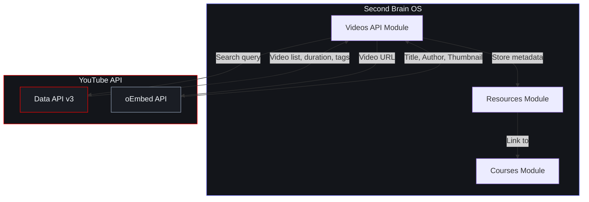
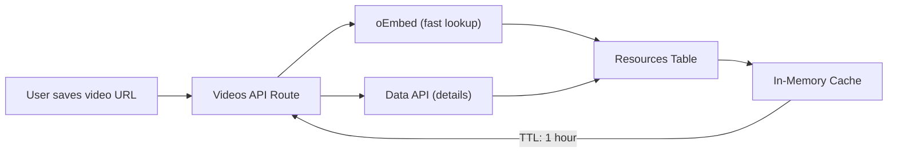

# YouTube Integration

## Document Control

| Field | Value |
|---|---|
| Document ID | INT-YTB-003 |
| Version | 1.0.0 |
| Status | Approved |
| Date | 2026-07-10 |
| Classification | Internal |
| Owner | Developer |

---

## Table of Contents

1. [Executive Summary](#1-executive-summary)
2. [Integration Overview](#2-integration-overview)
3. [YouTube Data API v3](#3-youtube-data-api-v3)
4. [Video Metadata Fetch](#4-video-metadata-fetch)
5. [Educational Video Catalog](#5-educational-video-catalog)
6. [OAuth Scopes](#6-oauth-scopes)
7. [Quota Management](#7-quota-management)
8. [Architecture Diagram](#8-architecture-diagram)
9. [Data Flow & Processing](#9-data-flow--processing)
10. [API Endpoints Used](#10-api-endpoints-used)
11. [Video Categorization](#11-video-categorization)
12. [Error Handling](#12-error-handling)
13. [Rate Limits & Quotas](#13-rate-limits--quotas)
14. [Security Considerations](#14-security-considerations)
15. [Monitoring & Observability](#15-monitoring--observability)
16. [Testing Strategy](#16-testing-strategy)
17. [Edge Cases](#17-edge-cases)
18. [Failure Scenarios](#18-failure-scenarios)
19. [Configuration Reference](#19-configuration-reference)
20. [References](#20-references)

---

## 1. Executive Summary

The YouTube integration enables users to save educational videos as resources, automatically fetch metadata via the YouTube Data API v3, and build a searchable educational video catalog linked to courses. It uses the public oEmbed endpoint for quick lookups and the Data API for detailed metadata.

---

## 2. Integration Overview

| Property | Value |
|---|---|
| Provider | Google (YouTube) |
| Primary API | YouTube Data API v3 |
| Fallback API | YouTube oEmbed (no auth required) |
| Auth Method | API Key (server-side) |
| Client Library | `httpx` (direct REST) |
| Cost | Free ($300 credit / quota) |

---

## 3. YouTube Data API v3



### 3.1 API Key Setup

```bash
# 1. Go to Google Cloud Console
# 2. Enable YouTube Data API v3
# 3. Create API Key (restricted to YouTube API)
# 4. Set environment variable:
YOUTUBE_API_KEY=AIzaSy...
```

---

## 4. Video Metadata Fetch

### 4.1 oEmbed (Quick Lookup)

```python
async def get_video_metadata_oembed(url: str) -> dict:
    """Fetch basic video metadata via oEmbed (no API key needed)."""
    async with httpx.AsyncClient() as client:
        resp = await client.get(
            "https://www.youtube.com/oembed",
            params={"url": url, "format": "json"},
        )
        resp.raise_for_status()
        data = resp.json()
        return {
            "title": data["title"],
            "author": data["author_name"],
            "author_url": data["author_url"],
            "thumbnail_url": data["thumbnail_url"],
            "html": data.get("html", ""),
        }
```

### 4.2 Data API v3 (Detailed Metadata)

```python
async def get_video_details(video_id: str, api_key: str) -> dict:
    """Fetch detailed video metadata including duration, tags, statistics."""
    async with httpx.AsyncClient() as client:
        resp = await client.get(
            "https://www.googleapis.com/youtube/v3/videos",
            params={
                "part": "snippet,contentDetails,statistics",
                "id": video_id,
                "key": api_key,
            },
        )
        resp.raise_for_status()
        items = resp.json().get("items", [])
        if not items:
            return {}
        item = items[0]
        return {
            "video_id": video_id,
            "title": item["snippet"]["title"],
            "description": item["snippet"]["description"],
            "channel": item["snippet"]["channelTitle"],
            "published_at": item["snippet"]["publishedAt"],
            "duration": parse_iso8601_duration(item["contentDetails"]["duration"]),
            "tags": item["snippet"].get("tags", []),
            "view_count": item["statistics"].get("viewCount", 0),
            "like_count": item["statistics"].get("likeCount", 0),
            "category": item["snippet"].get("categoryId", ""),
            "thumbnail_url": item["snippet"]["thumbnails"]["high"]["url"],
        }
```

---

## 5. Educational Video Catalog

### 5.1 Schema

```sql
CREATE TABLE saved_videos (
    id UUID PRIMARY KEY DEFAULT gen_random_uuid(),
    user_id UUID NOT NULL REFERENCES users(id) ON DELETE CASCADE,
    video_id VARCHAR(32) NOT NULL,
    title VARCHAR(512),
    channel VARCHAR(255),
    duration_seconds INT,
    thumbnail_url TEXT,
    tags TEXT[],
    course_id UUID REFERENCES courses(id) ON DELETE SET NULL,
    notes TEXT,
    watched BOOLEAN DEFAULT FALSE,
    watch_later BOOLEAN DEFAULT FALSE,
    rating INT CHECK (rating >= 1 AND rating <= 5),
    saved_at TIMESTAMPTZ NOT NULL DEFAULT NOW(),
    UNIQUE(user_id, video_id)
);
```

### 5.2 Course Linking

Users can link videos to courses for structured learning:

```python
async def link_video_to_course(video_id: str, course_id: str, user_id: str):
    result = supabase.table("saved_videos").update({
        "course_id": course_id,
    }).eq("id", video_id).eq("user_id", user_id).execute()
    return result.data[0] if result.data else None
```

---

## 6. OAuth Scopes

| Scope | Purpose | Status |
|---|---|---|
| (none) | Public video metadata (oEmbed) | Active |
| `youtube.readonly` | User's playlists and watch history | Planned |
| `youtube.upload` | Upload generated video content | Future |

---

## 7. Quota Management

The YouTube Data API v3 enforces a daily quota of 10,000 units for the free tier:

| Operation | Cost (quota units) |
|---|---|
| `videos.list` (basic) | 1 unit per 50 videos |
| `videos.list` (with contentDetails) | 2 units per 50 videos |
| `search.list` | 100 units per request |
| `channels.list` | 1 unit per 50 channels |

```python
class YouTubeQuotaManager:
    def __init__(self, daily_limit: int = 10000):
        self.daily_limit = daily_limit
        self.used_today = 0

    async def search_videos(self, query: str, max_results: int = 10) -> list:
        if self.used_today + 100 >= self.daily_limit:
            logger.warn("YouTube quota nearly exhausted, using cache")
            return self.get_cached_results(query)
        # ... perform API call
        self.used_today += 100
```

---

## 8. Architecture Diagram



---

## 9. Data Flow & Processing

```
User submits YouTube URL → Extract video_id → Call oEmbed (title, thumbnail)
                                              → Call Data API (duration, tags)
                                              → Store in saved_videos table
                                              → Return metadata to frontend
```

---

## 10. API Endpoints Used

| Endpoint | Method | Purpose | Auth |
|---|---|---|---|
| `oembed?url={url}` | GET | Quick title/thumbnail lookup | None |
| `videos?part=snippet,contentDetails` | GET | Detailed metadata | API Key |
| `search?q={query}&type=video` | GET | Search educational content | API Key |

---

## 11. Video Categorization

Educational videos are auto-tagged based on channel and metadata:

| Category | Channels | Tags |
|---|---|---|
| Programming | freeCodeCamp, The Net Ninja, Fireship | `python`, `javascript`, `react` |
| Computer Science | MIT OCW, Stanford Online, CS50 | `algorithms`, `data-structures` |
| Mathematics | 3Blue1Brown, Professor Leonard | `calculus`, `linear-algebra` |

---

## 12. Error Handling

| Error | Cause | Action |
|---|---|---|
| `quotaExceeded` | Daily API quota exhausted | Fall back to oEmbed only, cache aggressively |
| `videoNotFound` | Invalid or deleted video | Return error, prompt user to verify URL |
| `keyInvalid` | API key misconfigured | Alert developer, degrade gracefully |

---

## 13. Rate Limits & Quotas

| API | Limit | Used For |
|---|---|---|
| oEmbed | Effectively unlimited | Initial metadata fetch |
| Data API v3 | 10,000 quota units/day | Detailed metadata + search |
| Search | 100 units/request | Educational video discovery |

---

## 14. Security Considerations

- API key stored server-side only (not in browser)
- API key restricted to YouTube Data API v3 in Google Cloud Console
- No user OAuth tokens stored (read-only public data)

---

## 15. Monitoring & Observability

| Metric | Source | Alert |
|---|---|---|
| Quota usage | Daily quota check | > 80% used |
| API error rate | Backend logs | > 5% error rate |
| Cache hit ratio | Cache middleware | < 50% hit rate |

---

## 16. Testing Strategy

| Test Type | Scope |
|---|---|
| Unit | URL parsing (extract video_id from various URL formats) |
| Mock | Data API responses for video metadata |
| Integration | oEmbed endpoint with real URLs |

---

## 17. Edge Cases

- URL formats: `youtube.com/watch?v=`, `youtu.be/`, `youtube.com/embed/`, shorts URLs
- Deleted/privated videos: Return graceful error
- Live streams: Handle `contentDetails.duration` = `P0D` (zero duration)
- Playlist URLs: Extract first video or show playlist info

---

## 18. Failure Scenarios

| Scenario | Impact | Mitigation |
|---|---|---|
| Data API quota exhausted | No detailed metadata | Use oEmbed fallback, cached data |
| API key compromised | Unauthorized usage | Rotate key, restrict in Cloud Console |
| YouTube outage | Cannot fetch new videos | Show cached metadata, queue retry |

---

## 19. Configuration Reference

```env
YOUTUBE_API_KEY=AIzaSy...
YOUTUBE_DAILY_QUOTA=10000
```

---

## 20. References

| Resource | URL |
|---|---|
| YouTube Data API v3 | https://developers.google.com/youtube/v3 |
| YouTube oEmbed | https://developers.google.com/youtube/oembed |
| Quota Calculator | https://developers.google.com/youtube/v3/determine_quota_cost |
| Integration Architecture | `docs/engineering/37_IntegrationArchitecture.md` |
