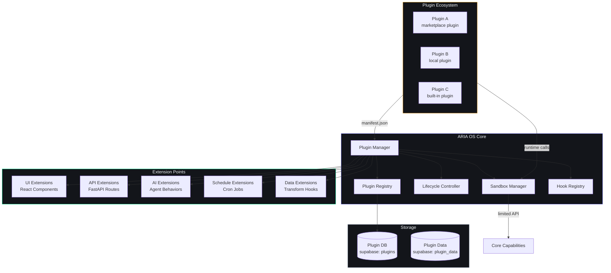
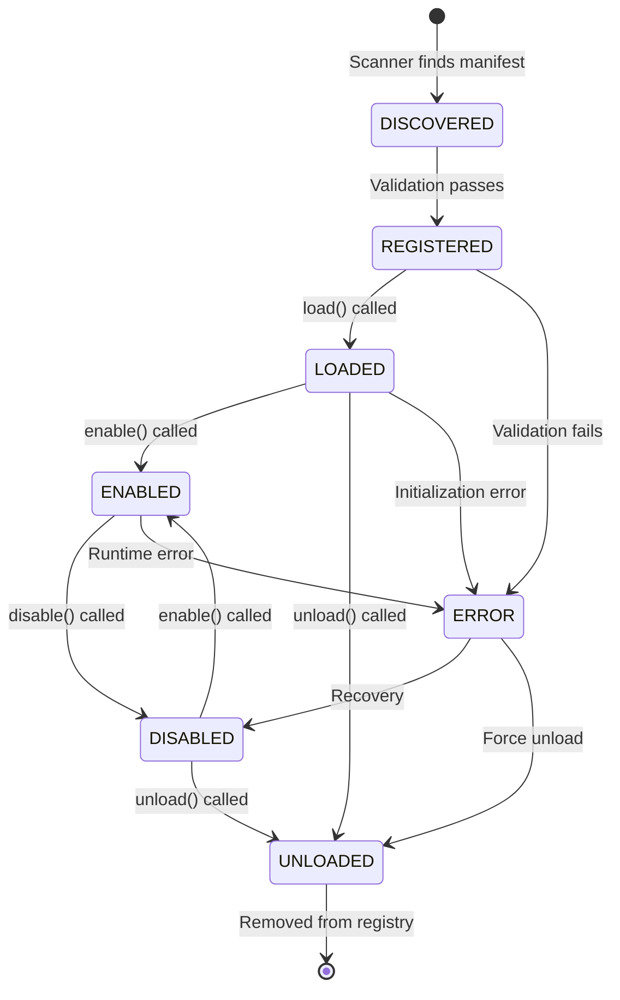
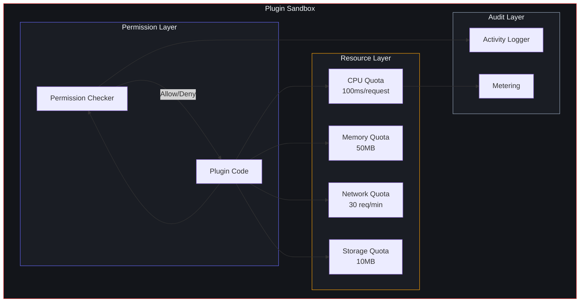
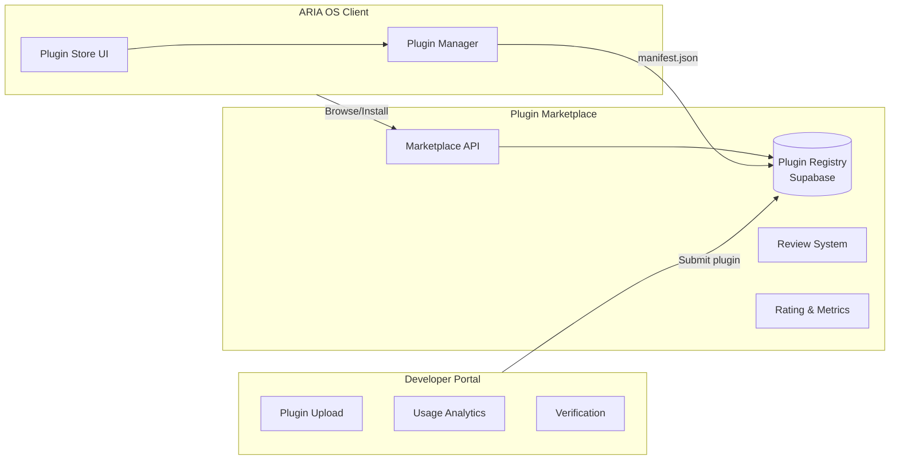

# Plugin System Architecture

## Document Control

| Field | Value |
|---|---|
| Document ID | ENG-PLUG-001 |
| Version | 1.0.0 |
| Status | Active |
| Last Updated | 2026-07-14 |
| Classification | Internal - Engineering |
| Owner | Developer |
| Review Cycle | Monthly |
| Related Docs | [Architecture](12_Architecture.md), [ADR-004](../engineering/adr/ADR-004.md), [AGENTS.md Section 9](../../AGENTS.md), [AI Agent Architecture](../ai/20_Agent.md) |

---

## Table of Contents

1. [Overview](#overview)
2. [Design Goals](#design-goals)
3. [Plugin Architecture](#plugin-architecture)
4. [Plugin Lifecycle](#plugin-lifecycle)
5. [Plugin Manifest Format](#plugin-manifest-format)
6. [Extension Points](#extension-points)
7. [Plugin API Reference](#plugin-api-reference)
8. [Hook System](#hook-system)
9. [Security Sandbox Model](#security-sandbox-model)
10. [Plugin Marketplace Concept](#plugin-marketplace-concept)
11. [Building a Simple Plugin](#building-a-simple-plugin)
12. [Dependencies](#dependencies)
13. [Performance Considerations](#performance-considerations)
14. [Future Considerations](#future-considerations)
15. [Related Documents](#related-documents)

---

## Overview

The ARIA OS Plugin System is an extension framework that allows third-party developers and users to extend the core functionality of Second Brain OS without modifying the main codebase. It provides a standardized way to add new UI components, API endpoints, AI agent behaviors, scheduler jobs, and data transformations through a sandboxed plugin architecture.

The plugin system is built on the principle that the core OS should remain lean and stable while the ecosystem grows through community-contributed plugins. This separation ensures that new features can be developed, tested, and distributed independently of the core release cycle.

## Design Goals

- **Extensibility without modification**: Plugins extend the OS without editing core files or forking the repository.
- **Sandboxed execution**: Plugins run in isolated environments with controlled access to system resources.
- **Graceful degradation**: If a plugin fails, the core OS continues operating normally.
- **Versioned compatibility**: Plugin manifests declare which API versions they target, preventing breakage on upgrades.
- **Discoverable ecosystem**: Plugins can be installed from a marketplace or loaded from local directories.
- **Lifecycle management**: Plugins can be registered, loaded, enabled, disabled, and unloaded at runtime without server restart.
- **Cross-cutting extension points**: Plugins can hook into UI, API, AI agents, scheduler, and data layers.

## Plugin Architecture



### Plugin Manager

The Plugin Manager is the central orchestrator for all plugin-related operations. It is implemented as a singleton service in `packages/plugin/plugin_manager.py` on the backend and as a Zustand store (`lib/stores/plugin-store.ts`) on the frontend.

**Responsibilities:**
- Scanning plugin directories and the marketplace registry for available plugins
- Validating plugin manifests against the current API version
- Managing plugin lifecycle states
- Registering extension points with the appropriate subsystems
- Providing plugin status and health information

### Plugin Registry

All installed and available plugins are tracked in the `plugins` database table:

```sql
CREATE TABLE plugins (
    id UUID PRIMARY KEY DEFAULT gen_random_uuid(),
    name VARCHAR(255) UNIQUE NOT NULL,
    display_name VARCHAR(255) NOT NULL,
    version VARCHAR(50) NOT NULL,
    description TEXT,
    author VARCHAR(255),
    homepage VARCHAR(500),
    manifest JSONB NOT NULL,
    status VARCHAR(20) DEFAULT 'registered',
    enabled BOOLEAN DEFAULT false,
    source VARCHAR(50) DEFAULT 'local',
    created_at TIMESTAMPTZ DEFAULT now(),
    updated_at TIMESTAMPTZ DEFAULT now(),
    last_error TEXT,
    user_id UUID REFERENCES auth.users(id)
);

ALTER TABLE plugins ENABLE ROW LEVEL SECURITY;
CREATE POLICY user_plugins ON plugins FOR ALL USING (user_id = auth.uid());
```

## Plugin Lifecycle

Plugins transition through a well-defined lifecycle managed by the Lifecycle Controller.



### Lifecycle Stages

| Stage | Description | Actions Performed |
|---|---|---|
| **DISCOVERED** | Plugin manifest found in scan directory or marketplace | Parse manifest, check API compatibility |
| **REGISTERED** | Manifest validated, plugin added to registry | Store in database, register metadata |
| **LOADED** | Plugin binary or source loaded into memory | Import modules, execute `onLoad()` hook, establish sandbox |
| **ENABLED** | Plugin activated and connected to extension points | Register hooks, mount UI components, register API routes |
| **DISABLED** | Plugin deactivated but not unloaded | Unregister hooks, unmount UI, deregister API routes |
| **UNLOADED** | Plugin fully removed from memory | Clean up resources, release sandbox, remove from registry |
| **ERROR** | Plugin encountered a failure | Log error, attempt recovery, report status |

### Lifecycle API

```typescript
// Frontend Plugin Lifecycle Methods (TypeScript)
interface PluginLifecycle {
  onLoad?: (api: PluginAPI) => Promise<void>
  onEnable?: () => Promise<void>
  onDisable?: () => Promise<void>
  onUnload?: () => Promise<void>
  onError?: (error: Error) => Promise<void>
}
```

```python
# Backend Plugin Lifecycle Methods (Python)
class PluginLifecycle:
    async def on_load(self, api: PluginAPI) -> None: ...
    async def on_enable(self) -> None: ...
    async def on_disable(self) -> None: ...
    async def on_unload(self) -> None: ...
    async def on_error(self, error: Exception) -> None: ...
```

## Plugin Manifest Format

Every plugin requires a `manifest.json` file at its root. This declarative manifest defines all metadata, permissions, and extension points.

```json
{
  "schema_version": "1.0",
  "id": "aria-plugin-habit-stats",
  "name": "Habit Statistics Advanced",
  "version": "1.2.0",
  "min_api_version": "1.0.0",
  "max_api_version": "2.0.0",
  "description": "Advanced habit analytics and visualization plugin.",
  "author": {
    "name": "Developer",
    "email": "dev@example.com",
    "url": "https://github.com/example/habit-stats"
  },
  "license": "MIT",
  "permissions": [
    "ui:component",
    "data:habits:read",
    "data:habits:write",
    "api:route",
    "ai:agent:extend"
  ],
  "extension_points": {
    "ui": [
      {
        "type": "dashboard_widget",
        "slot": "analytics_extra",
        "component": "src/HabitAnalyticsWidget.tsx",
        "size": "medium"
      },
      {
        "type": "page_tab",
        "target": "habits",
        "component": "src/AdvancedStatsTab.tsx",
        "label": "Advanced Stats"
      }
    ],
    "api": [
      {
        "path": "/api/v1/plugins/habit-stats/aggregations",
        "methods": ["GET"],
        "handler": "src/api/handlers.py::get_aggregations"
      }
    ],
    "ai_agents": [
      {
        "agent_id": "habit_analyst",
        "prompt_extension": "prompts/habit_analysis.md",
        "hooks": ["after.briefing_generated"]
      }
    ],
    "scheduler": [
      {
        "cron": "0 20 * * *",
        "handler": "src/cron/daily_summary.py::generate_summary"
      }
    ]
  },
  "dependencies": {
    "recharts": "^2.12.0",
    "date-fns": "^3.0.0"
  },
  "settings": {
    "default_time_range": {
      "type": "string",
      "default": "30d",
      "enum": ["7d", "30d", "90d", "1y"]
    },
    "show_trendline": {
      "type": "boolean",
      "default": true
    }
  },
  "icon": "assets/icon.svg",
  "screenshots": ["assets/screenshot1.png"],
  "tags": ["analytics", "habits", "visualization"],
  "repository": {
    "type": "git",
    "url": "https://github.com/example/habit-stats"
  }
}
```

### Manifest Field Reference

| Field | Type | Required | Description |
|---|---|---|---|
| `schema_version` | string | Yes | Plugin manifest schema version |
| `id` | string | Yes | Unique plugin identifier (reverse-domain format) |
| `name` | string | Yes | Human-readable display name |
| `version` | string | Yes | Semantic version of the plugin |
| `min_api_version` | string | Yes | Minimum ARIA OS API version required |
| `max_api_version` | string | No | Maximum compatible API version |
| `description` | string | Yes | Short description of plugin functionality |
| `author` | object | Yes | Author information (name, email, url) |
| `license` | string | Yes | SPDX license identifier |
| `permissions` | string[] | Yes | List of required permissions |
| `extension_points` | object | Yes | Declared extension points |
| `dependencies` | object | No | NPM/Python package dependencies |
| `settings` | object | No | User-configurable settings schema |
| `icon` | string | No | Path to plugin icon (relative to manifest) |
| `tags` | string[] | No | Categorization tags for marketplace |

## Extension Points

The plugin system provides five categories of extension points.

### UI Extension Points

| Extension Type | Slot / Target | Description | Loading Mechanism |
|---|---|---|---|
| `dashboard_widget` | `analytics_extra`, `focus_tools`, `quick_actions` | Add a widget card to the dashboard | Dynamic import, React.lazy |
| `page_tab` | `tasks`, `habits`, `courses`, `sleep`, `income` | Add a new tab to an existing module page | Router-level lazy component |
| `sidebar_item` | `nav_primary`, `nav_secondary` | Add a navigation link in the sidebar | PluginManager registration |
| `modal_content` | `new_task`, `task_detail`, `habit_detail` | Add content to existing modal dialogs | Slot injection via React Portal |
| `settings_page` | `plugin_settings` | Add a settings section for plugin configuration | Dynamic route registration |
| `chart_extension` | `recharts`, `chart.js` | Add custom chart types or themes | Adapter registration |
| `command_palette_action` | `command_palette` | Register Cmd+K command palette actions | Command registry |

### API Extension Points

| Extension Type | Description | Registration |
|---|---|---|
| `api:route` | Register new REST API endpoints under `/api/v1/plugins/<plugin-id>/` | FastAPI APIRouter inclusion |
| `api:middleware` | Add middleware to the request processing pipeline | Middleware stack registration |
| `api:webhook` | Register webhook receivers for external services | Webhook router |
| `api:data_transform` | Hook into CRUD operations to transform data before/after | Event-based hook system |

### AI Agent Extension Points

| Extension Type | Description | Example |
|---|---|---|
| `ai:agent` | Register a new AI sub-agent with custom prompts | Custom interview prep agent |
| `ai:prompt_extension` | Extend an existing agent's prompt with additional context | Add habit data to briefing |
| `ai:post_process` | Post-process AI output before returning to user | Format, filter, or enrich responses |
| `ai:action_handler` | Register a new action type that ARIA can execute | Custom database mutations |

### Scheduler Extension Points

| Extension Type | Description |
|---|---|
| `scheduler:cron` | Register a cron job with a standard cron expression |
| `scheduler:interval` | Register a recurring job with interval in minutes |
| `scheduler:event` | Register a job that triggers on system events (data changes, time-based) |

### Data Extension Points

| Extension Type | Description |
|---|---|
| `data:before_create` | Transform data before insert |
| `data:after_create` | Trigger actions after insert |
| `data:before_update` | Transform data before update |
| `data:after_update` | Trigger actions after update |
| `data:before_delete` | Validate or block deletion |
| `data:after_delete` | Cleanup after deletion |
| `data:query_filter` | Modify query parameters before execution |

## Plugin API Reference

The Plugin API provides controlled access to ARIA OS capabilities. Every plugin receives an instance of `PluginAPI` during its lifecycle hooks.

### Frontend Plugin API

```typescript
interface PluginAPI {
  // Core
  id: string
  manifest: PluginManifest
  
  // Storage & State
  storage: {
    get<T>(key: string): Promise<T | null>
    set<T>(key: string, value: T): Promise<void>
    delete(key: string): Promise<void>
    clear(): Promise<void>
  }
  
  // Supabase access (scoped by permissions)
  supabase: {
    from(table: string): SupabaseQueryBuilder
    rpc(fn: string, params?: any): Promise<any>
    channel(name: string): RealtimeChannel
  }
  
  // UI Registration
  ui: {
    registerWidget(slot: string, component: React.ComponentType): void
    unregisterWidget(slot: string, id: string): void
    registerTab(page: string, tab: TabConfig): void
    registerCommand(command: CommandConfig): void
    addNavItem(item: NavItem): void
  }
  
  // Hook Registration
  hooks: {
    register(hook: string, handler: HookHandler): void
    unregister(hook: string, id: string): void
  }
  
  // Notifications
  notifications: {
    show(message: string, options?: NotificationOptions): void
    toast(message: string, variant?: 'success' | 'error' | 'info' | 'warning'): void
  }
  
  // I18n (if a plugin provides translations)
  i18n: {
    t(key: string, params?: Record<string, string>): string
    locale: string
  }
  
  // Plugin Settings
  settings: {
    get<T>(key: string): T | undefined
    set<T>(key: string, value: T): void
    getAll(): Record<string, any>
    onChanged(callback: (key: string, value: any) => void): () => void
  }
}
```

### Backend Plugin API

```python
class PluginAPI:
    def __init__(self, plugin_id: str, permissions: list[str]):
        self.id = plugin_id
        self._permissions = permissions
    
    # Database access (scoped by permissions)
    @property
    def db(self) -> DatabaseAccess:
        """Access to supabase with plugin-scoped credentials."""
        ...
    
    # HTTP client for external API calls
    @property
    def http(self) -> AsyncClient:
        """HTTPX client with configurable timeout and retry."""
        ...
    
    # Register API routes
    def register_router(self, router: APIRouter) -> None: ...
    
    # Register hooks
    def register_hook(self, hook_name: str, handler: Callable) -> str: ...
    def unregister_hook(self, hook_name: str, handler_id: str) -> None: ...
    
    # Plugin data storage
    async def get_data(self, key: str) -> Any: ...
    async def set_data(self, key: str, value: Any) -> None: ...
    async def delete_data(self, key: str) -> None: ...
    
    # Logging
    def log(self, level: str, message: str, **extra) -> None: ...
    
    # Cache access
    @property
    def cache(self) -> CacheAccess: ...
    
    # Event emitter
    def emit(self, event: str, data: Any) -> None: ...
    def on(self, event: str, handler: Callable) -> None: ...
```

## Hook System

The hook system allows plugins to intercept and modify behavior at various points in the application lifecycle. Hooks follow a publisher-subscriber pattern.

### Available Hooks

| Hook Name | Trigger Point | Payload | Async |
|---|---|---|---|
| `app.bootstrap` | Application startup | `{app_version}` | Yes |
| `app.shutdown` | Application shutdown | `{}` | Yes |
| `user.login` | User authenticated | `{user_id, session}` | Yes |
| `user.logout` | User session ended | `{user_id}` | Yes |
| `data.before_create` | Before any DB insert | `{table, data}` | Yes |
| `data.after_create` | After successful insert | `{table, data, id}` | Yes |
| `data.before_update` | Before any DB update | `{table, data, id}` | Yes |
| `data.after_update` | After successful update | `{table, data, id}` | Yes |
| `data.before_delete` | Before any DB delete | `{table, id}` | Yes |
| `data.after_delete` | After successful delete | `{table, id}` | Yes |
| `agent.before_generate` | Before AI agent generates output | `{agent_id, prompt, context}` | Yes |
| `agent.after_generate` | After AI agent generates output | `{agent_id, output}` | Yes |
| `briefing.before_send` | Before daily briefing is delivered | `{briefing_data}` | Yes |
| `briefing.after_send` | After daily briefing is delivered | `{briefing_id}` | Yes |
| `notification.before_send` | Before any notification | `{type, recipient, content}` | Yes |
| `navigation.before_route` | Before route change | `{from, to}` | No |

### Hook Registration Example

```typescript
// Frontend — register a hook that enriches the briefing
pluginAPI.hooks.register('briefing.before_send', async (payload) => {
  const extraData = await pluginAPI.storage.get('extra_metrics')
  return {
    ...payload,
    briefing_data: {
      ...payload.briefing_data,
      custom_section: extraData
    }
  }
})
```

```python
# Backend — register a hook that logs task creation
api.register_hook('data.after_create', async (payload):
    if payload['table'] == 'tasks':
        api.log('info', f"Task created: {payload['data']['title']}")
        await api.http.post('https://webhook.example.com/task-created', json=payload)
)
```

## Security Sandbox Model

Plugins operate within a security sandbox that restricts access to sensitive system resources.

### Sandbox Layers



### Permission Model

| Permission | Description | Risk Level |
|---|---|---|
| `ui:component` | Register UI components in designated slots | Low |
| `data:tasks:read` | Read task data | Medium |
| `data:tasks:write` | Create/update/delete tasks | Medium |
| `data:habits:read` | Read habit data | Medium |
| `data:all:read` | Read all user data | High |
| `data:all:write` | Write to any data table | Critical |
| `api:route` | Register API routes under plugin prefix | Medium |
| `api:webhook` | Register webhook receivers | Medium |
| `api:middleware` | Add request/response middleware | High |
| `ai:agent` | Register new AI agent | Medium |
| `ai:prompt_extend` | Extend existing agent prompts | Low |
| `scheduler:cron` | Register cron jobs | Medium |
| `network:http` | Make HTTP requests to external services | High |
| `storage:plugin` | Use plugin-scoped key-value storage | Low |
| `filesystem:read` | Read plugin directory files | Low |

### Resource Limits

| Resource | Hard Limit | Behavior When Exceeded |
|---|---|---|
| CPU time per request | 100ms | Plugin call rejected, error logged |
| Memory | 50MB | Plugin terminated, error reported |
| API calls to Supabase | 60/min | Rate limited with 429 response |
| External HTTP requests | 30/min | Queue delayed with backoff |
| Plugin data storage | 10MB | Write rejected with 413 error |
| Concurrent execution | 1 | Queued sequentially |

### Security Rules

1. Plugins cannot access `SUPABASE_SERVICE_ROLE_KEY` or any server-side secrets.
2. Plugins cannot read files outside their installation directory.
3. Plugins cannot spawn child processes or fork.
4. All network requests go through a proxy that enforces HTTPS and blocks internal IPs.
5. Plugin code is scanned for malicious patterns before installation.
6. User must explicitly grant each permission during plugin installation.
7. Permissions can be revoked at any time, forcing the plugin to degrade gracefully.
8. All plugin actions are logged in the audit trail with `source: 'plugin:<plugin_id>'`.

## Plugin Marketplace Concept

The plugin marketplace is a centralized registry where users can discover, install, and manage plugins.

### Marketplace Architecture



### Marketplace Features (Phase 2)

- **Plugin listing**: Browse with search, filter by category, tags, and rating
- **One-click install**: Install from marketplace with automatic dependency resolution
- **Version management**: Update to latest compatible version with rollback support
- **Rating and reviews**: Community feedback system with verified reviews
- **Usage metrics**: Install count, active users, error rate display
- **Plugin bundles**: Curated collections of plugins for specific use cases
- **Developer dashboard**: Upload, version, analytics, and monetization

## Building a Simple Plugin

### Example: Custom Task Counter Widget

This example demonstrates a plugin that adds a dashboard widget showing task completion statistics.

**Directory structure:**
```
aria-plugin-task-stats/
├── manifest.json
├── src/
│   ├── index.tsx              # Plugin entry point
│   ├── TaskStatsWidget.tsx     # Widget component
│   └── api/
│       └── handlers.py         # Backend API handler
├── prompts/
│   └── task_stats_extension.md # AI prompt extension
├── assets/
│   └── icon.svg
└── README.md
```

**manifest.json:**
```json
{
  "schema_version": "1.0",
  "id": "aria-plugin-task-stats",
  "name": "Task Statistics Widget",
  "version": "1.0.0",
  "min_api_version": "1.0.0",
  "description": "Dashboard widget showing task completion analytics with trend charts.",
  "author": {
    "name": "Developer",
    "url": "https://github.com/example/task-stats"
  },
  "license": "MIT",
  "permissions": ["ui:component", "data:tasks:read"],
  "extension_points": {
    "ui": [
      {
        "type": "dashboard_widget",
        "slot": "analytics_extra",
        "component": "src/TaskStatsWidget.tsx",
        "size": "small"
      }
    ]
  },
  "dependencies": {},
  "settings": {
    "show_chart": { "type": "boolean", "default": true },
    "days_back": { "type": "number", "default": 7, "min": 1, "max": 90 }
  }
}
```

**src/index.tsx:**
```typescript
import { PluginAPI } from '@aria-os/plugin-api'
import { TaskStatsWidget } from './TaskStatsWidget'

export default {
  onLoad: async (api: PluginAPI) => {
    console.log(`[${api.id}] Loading Task Stats plugin`)
  },
  
  onEnable: async (api: PluginAPI) => {
    api.ui.registerWidget('analytics_extra', TaskStatsWidget)
    
    api.hooks.register('data.after_create', async (payload) => {
      if (payload.table === 'tasks') {
        api.notifications.toast('Task created! Stats will update.')
      }
    })
  },
  
  onDisable: async (api: PluginAPI) => {
    api.ui.unregisterWidget('analytics_extra', 'task-stats-widget')
  },
  
  onUnload: async () => {
    console.log('[task-stats] Unloaded')
  }
}
```

**src/TaskStatsWidget.tsx:**
```typescript
import { useEffect, useState } from 'react'
import { Card } from '@/components/ui/card'
import { supabase } from '@/lib/supabase'

export function TaskStatsWidget() {
  const [stats, setStats] = useState({ total: 0, completed: 0, pending: 0 })
  
  useEffect(() => {
    supabase.from('tasks').select('status').then(({ data }) => {
      if (!data) return
      setStats({
        total: data.length,
        completed: data.filter(t => t.status === 'completed').length,
        pending: data.filter(t => t.status === 'pending').length,
      })
    })
  }, [])
  
  return (
    <Card className="p-4">
      <h3 className="card-title">Task Stats</h3>
      <div className="grid grid-cols-3 gap-4 mt-2">
        <div>
          <div className="text-2xl font-bold text-accent-primary">{stats.total}</div>
          <div className="text-xs text-text-secondary">Total</div>
        </div>
        <div>
          <div className="text-2xl font-bold text-accent-neon">{stats.completed}</div>
          <div className="text-xs text-text-secondary">Done</div>
        </div>
        <div>
          <div className="text-2xl font-bold text-accent-warning">{stats.pending}</div>
          <div className="text-xs text-text-secondary">Pending</div>
        </div>
      </div>
    </Card>
  )
}
```

## Dependencies

### Internal Dependencies

| Dependency | Type | Purpose |
|---|---|---|
| `packages/plugin/plugin_manager.py` | Service | Core plugin lifecycle management |
| `lib/stores/plugin-store.ts` | Store | Frontend plugin state management |
| `lib/api/plugin-api.ts` | API | Frontend Plugin API client |
| `supabase: plugins` | Database | Plugin metadata and state storage |
| `supabase: plugin_data` | Database | Plugin-scoped key-value data storage |

### External Dependencies

| Dependency | Version | Purpose | Fallback |
|---|---|---|---|
| None (core plugin system is self-contained) | -- | -- | -- |

### Plugin Dependencies

Plugins may declare npm (`dependencies` in manifest) or pip (`requirements.txt` in plugin directory) dependencies. These are installed on plugin load and scoped to the plugin's environment.

## Performance Considerations

| Scenario | Expected Performance | Degradation |
|---|---|---|
| 10 plugins installed | < 50ms overhead per request | Graceful — plugins queue if busy |
| 50 plugins installed | < 200ms overhead | Some plugins may be deferred |
| Plugin crash | 0ms (sandbox isolated) | Plugin auto-disabled, user notified |
| Marketplace sync | < 5s initial load, cached for 1h | Stale cache shown during failure |
| Hook chain (10 hooks) | < 100ms total | Hooks execute sequentially |

## Future Considerations

- **Plugin hot-reload**: Reload plugins without page refresh during development.
- **Plugin dependency graph**: Allow plugins to depend on other plugins with version resolution.
- **Plugin storefront**: Full marketplace with ratings, screenshots, and monetization.
- **Visual plugin builder**: No-code plugin creation for simple customizations.
- **Plugin testing framework**: Standardized test harness for plugin developers.
- **Plugin analytics**: Usage tracking, error reporting, and performance monitoring per plugin.

## Related Documents

| Document | Description |
|---|---|
| [Architecture](12_Architecture.md) | Overall system architecture and data flow |
| [ADR-004](../engineering/adr/ADR-004.md) | Decision record for in-process agent architecture |
| [AGENTS.md Section 9](../../AGENTS.md) | AI agent architecture and agent registry |
| [AI Agent Architecture](../ai/20_Agent.md) | Detailed AI agent system documentation |
| [API Reference](17_API.md) | REST API endpoint documentation |
| [Security Architecture](24_Security.md) | Security model and permissions framework |
| [Frontend Component Library](../frontend/ComponentLibrary.md) | UI component extension points |

---

## Revision History

| Version | Date | Author | Changes |
|---|---|---|---|
| 1.0.0 | 2026-07-14 | Developer | Initial plugin system architecture documentation |
