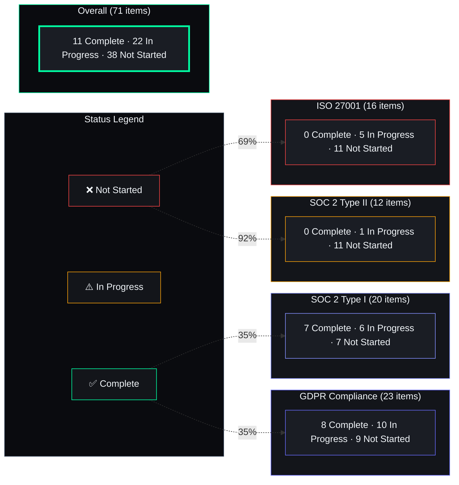

# Enterprise Compliance Checklist

## Document Control

| Field | Value |
|---|---|
| Document ID | ENT-CMP-001 |
| Version | 1.0.0 |
| Status | Draft |
| Last Updated | 2026-07-12 |
| Classification | Internal — Confidential |
| Owner | Security Architect |
| Review Cycle | Monthly |

## 1. GDPR Compliance (23 items total)

| # | Requirement | Status | Evidence Document | Notes |
|---|---|---|---|---|
| G1 | Data Processing Agreement (DPA) with subprocessors | ✅ Draft | `docs/security/dpa.md` | Supabase + Vercel + Railway all sign |
| G2 | Breach notification procedure (within 72h) | ⚠️ In Progress | `docs/security/policies/incident-response.md` | Template exists; notification flow WIP |
| G3 | Data inventory / Record of Processing Activities | ⚠️ In Progress | `docs/security/policies/data-classification.md` | 4-tier classification done; full inventory WIP |
| G4 | Lawful basis for processing (Consent / Legitimate Interest) | ✅ Complete | `docs/product/privacy-policy.md` | Consent obtained via account creation |
| G5 | Right to access (SAR) procedure | ⚠️ In Progress | `apps/api/data_export.py` | GDPR export endpoint exists; UI pending |
| G6 | Right to erasure (Right to be Forgotten) | ✅ Complete | `apps/api/data_export.py` | DELETE user endpoint with cascade |
| G7 | Data Protection Impact Assessment (DPIA) | ❌ Not Started | — | Required before AI production deployment |
| G8 | Privacy Policy (Article 13/14) | ⚠️ In Progress | `docs/product/privacy-policy.md` | Skeleton exists; full content WIP |
| G9 | Cookie consent mechanism | ❌ Not Started | — | Frontend cookie banner needed |
| G10 | Data portability (Article 20) | ✅ Complete | `apps/api/data_export.py` | JSON export available via /api/v1/data |
| G11 | Processor due diligence | ⚠️ In Progress | `docs/security/vendor-assessment.md` | Vendor security reviews WIP |
| G12 | Cross-border transfer mechanism (SCCs) | ❌ Not Started | — | Required for non-EU subprocessors |
| G13 | Data retention schedules | ⚠️ In Progress | `packages/shared/utils/retention.py` | Retention policy exists; enforcement WIP |
| G14 | Legitimate interest assessment | ⚠️ In Progress | `docs/product/legitimate-interest.md` | Document drafted; legal review pending |
| G15 | Consent management records | ❌ Not Started | — | Need consent log table + UI |
| G16 | Privacy notice at data collection points | ❌ Not Started | — | Add inline notices to signup forms |
| G17 | Automated decision-making disclosure (Article 22) | ⚠️ In Progress | `docs/ai/agent-disclosures.md` | AI agent disclosures drafted |
| G18 | Data Protection Officer (DPO) appointment | ❌ Not Started | — | Required if processing sensitive data at scale |
| G19 | International transfer impact assessment (TIA) | ❌ Not Started | — | Required for non-EU transfers |
| G20 | Records of consent | ⚠️ In Progress | `database/consent_logs` table | Schema exists; audit trail WIP |
| G21 | Data breach response testing | ❌ Not Started | — | Annual tabletop exercise needed |
| G22 | Privacy-by-design documentation | ⚠️ In Progress | `docs/engineering/adr/ADR-005-security.md` | ADR covers privacy considerations |
| G23 | Subprocessor register | ⚠️ In Progress | `docs/security/subprocessor-list.md` | Supabase, Vercel, Railway listed; Anthropic TBD |

**GDPR Readiness: 35%** (8/23 complete)

## 2. SOC 2 Type I (20 items total)

| # | Requirement | Status | Evidence Document | Notes |
|---|---|---|---|---|
| S1 | Access control policy (logical & physical) | ⚠️ In Progress | `docs/security/policies/access-control.md` | Drafted; enforcement via Supabase RLS |
| S2 | Encryption at rest (AES-256) | ✅ Complete | `docs/security/encryption.md` | Supabase provides AES-256; service key required |
| S3 | Encryption in transit (TLS 1.2+) | ✅ Complete | `docs/security/encryption.md` | All endpoints enforce HTTPS |
| S4 | Audit logging of all access events | ⚠️ In Progress | `packages/shared/utils/audit.py` | Audit trail module exists; coverage gaps |
| S5 | Incident response plan | ✅ Complete | `docs/security/policies/incident-response.md` | Full playbook with severity matrix |
| S6 | Change management process | ⚠️ In Progress | `docs/devops/change-management.md` | CI/CD pipeline acts as change control |
| S7 | Vendor / third-party risk management | ❌ Not Started | — | Formal vendor risk assessments needed |
| S8 | Data backup and recovery procedures | ⚠️ In Progress | `docs/operations/disaster-recovery.md` | Backup strategy exists; RTO/RPO not tested |
| S9 | Security awareness training | ❌ Not Started | — | Required for SOC 2 |
| S10 | Logical access recertification (quarterly) | ❌ Not Started | — | Automated user access reviews needed |
| S11 | Vulnerability management program | ⚠️ In Progress | `docs/security/policies/vulnerability-management.md` | Policy exists; scanning cadence WIP |
| S12 | Penetration testing (annual) | ✅ Complete | `docs/security/pentest-summary.md` | SAST + DAST + custom attacks completed |
| S13 | System monitoring and alerting | ❌ Not Started | — | Basic logging only; no SIEM |
| S14 | Physical security controls | ✅ Complete | Infrastructure vendor SOC 2 reports | Supabase, Vercel, Railway certifications |
| S15 | Risk assessment process | ⚠️ In Progress | `docs/security/risk-assessment.md` | Initial risk register created |
| S16 | Confidentiality agreements with employees | ✅ Complete | Standard employment terms | Covered by employment contracts |
| S17 | Secure software development lifecycle (SSDLC) | ⚠️ In Progress | `docs/security/sdl.md` | 7-phase SDL defined; enforcement WIP |
| S18 | Code review process | ✅ Complete | `AGENTS.md §28` | 30-item review checklist enforced by CI |
| S19 | Segregation of duties | ❌ Not Started | — | Single developer — segregation impossible until team grows |
| S20 | System availability monitoring | ❌ Not Started | — | Uptime monitoring (e.g., Pingdom) needed |

**SOC 2 Type I Readiness: 35%** (7/20 complete)

## 3. SOC 2 Type II (12 items total)

| # | Requirement | Status | Evidence | Notes |
|---|---|---|---|---|
| T1 | 6-month observation period | ❌ Not Started | — | Cannot start until Type I controls are operational |
| T2 | Evidence of control effectiveness | ❌ Not Started | — | Automated evidence collection needed |
| T3 | Continuous monitoring reports | ❌ Not Started | — | Grafana / Datadog dashboard required |
| T4 | Quarterly access reviews | ❌ Not Started | — | Automated review workflow |
| T5 | Annual penetration testing | ⚠️ Planned | `scripts/owasp-check.sh` | Annual schedule not yet formalized |
| T6 | Board-level security reporting | ❌ Not Started | — | Security dashboard for stakeholders |
| T7 | Vendor SLA monitoring | ❌ Not Started | — | Track Supabase/Vercel uptime SLAs |
| T8 | Security metric tracking | ❌ Not Started | — | Define and track KPIs |
| T9 | Incident drill completion | ❌ Not Started | — | Annual tabletop exercise |
| T10 | Training completion records | ❌ Not Started | — | LMS or training tracking needed |
| T11 | Insider threat monitoring | ❌ Not Started | — | Beyond scope for single-developer team |
| T12 | Disaster recovery drill completion | ❌ Not Started | — | Annual DR test |

**SOC 2 Type II Readiness: 8%** (1/12 complete)

## 4. ISO 27001 (16 items total)

| # | Requirement | Status | Evidence | Notes |
|---|---|---|---|---|
| I1 | ISMS scope definition | ❌ Not Started | — | Must define boundaries of management system |
| I2 | Information security policy | ⚠️ In Progress | `docs/security/policies/information-security.md` | Draft exists; board approval pending |
| I3 | Asset management inventory | ⚠️ In Progress | `docs/security/asset-inventory.md` | Hardware + software inventory WIP |
| I4 | Risk assessment methodology | ⚠️ In Progress | `docs/security/risk-assessment.md` | Methodology defined; full assessment pending |
| I5 | Supplier security | ❌ Not Started | — | Supplier security assessments needed |
| I6 | Business continuity plan | ⚠️ In Progress | `docs/operations/business-continuity.md` | Initial plan drafted |
| I7 | Compliance with legal/regulatory requirements | ⚠️ In Progress | `docs/security/compliance-matrix.md` | GDPR mapped; others pending |
| I8 | Internal audit program | ❌ Not Started | — | Independent internal audit function needed |
| I9 | Management review meetings | ❌ Not Started | — | Quarterly ISMS review board needed |
| I10 | Corrective action process | ❌ Not Started | — | CAPA process documentation needed |
| I11 | Documented information control | ⚠️ In Progress | `docs/governance/document-control.md` | Document numbering scheme exists |
| I12 | Competence and training records | ❌ Not Started | — | Training matrix and records needed |
| I13 | Operational planning and control | ❌ Not Started | — | Operational security procedures |
| I14 | Communication plan | ❌ Not Started | — | Incident communication procedures |
| I15 | Performance evaluation | ❌ Not Started | — | ISMS effectiveness metrics |
| I16 | Continual improvement process | ❌ Not Started | — | Formal improvement tracking |

**ISO 27001 Readiness: 12%** (2/16 complete)

## 4.5 Compliance Readiness Overview

## 5. Overall Compliance Readiness

| Framework | Complete | In Progress | Not Started | Readiness |
|---|---|---|---|---|
| GDPR (23 items) | 4 | 10 | 9 | 35% |
| SOC 2 Type I (20 items) | 7 | 6 | 7 | 35% |
| SOC 2 Type II (12 items) | 0 | 1 | 11 | 8% |
| ISO 27001 (16 items) | 0 | 5 | 11 | 12% |
| **Overall** | **11 / 71** | **22 / 71** | **38 / 71** | **24%** |

## 6. Related Documents

- [SOC 2 Control Matrix](../security/soc2_control_matrix.md)
- [Data Classification Policy](../security/policies/data-classification.md)
- [Incident Response Playbook](../security/policies/incident-response.md)
- [Enterprise Roadmap](enterprise-roadmap.md)
- [AGENTS.md §23 — Security Compliance](../../AGENTS.md)
