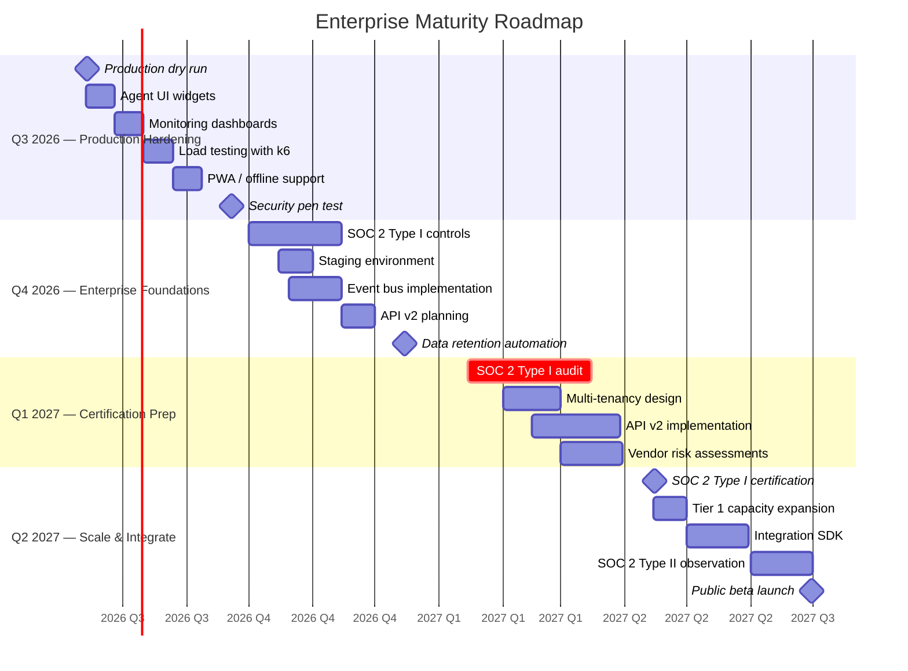

# Enterprise Maturity Roadmap

## Document Control

| Field | Value |
|---|---|
| Document ID | ENT-RDM-001 |
| Version | 1.0.0 |
| Status | Draft |
| Last Updated | 2026-07-12 |
| Classification | Internal |
| Owner | Developer |
| Review Cycle | Monthly (re-prioritized at sprint planning) |

## 1. Current State Assessment

| Dimension | Score | Notes |
|---|---|---|
| Architecture Maturity | L3.5 / L5 | Monorepo, modular agents, API-first. Missing: event bus, staging env |
| Security Readiness | 24% | See [Compliance Checklist](compliance-checklist.md) |
| Test Coverage | 96% (Python) | Frontend coverage not yet measured |
| Observability | L2 / L5 | Structured logging exists; no metrics dashboard |
| SDL Integration | L2 / L5 | 7-phase SDL defined; enforcement partial |
| **Overall** | **L3.5 / L5** | Feature-complete prototype; production hardening underway |

### 1.1 Enterprise Maturity Timeline

## 2. Q3 2026 — Production Hardening (Jul–Sep 2026)

| Milestone | Target Date | Owner | Dependencies |
|---|---|---|---|
| Production dry run + deployment to Vercel + Railway | Jul 14 | Developer | Supabase Pro project, env config |
| Agent UI widgets (briefing, radar, sleep, nudges) | Jul 28 | Developer | Frontend components for 5 agents |
| Monitoring dashboards (RED metrics) | Aug 11 | Developer | Logging pipeline, Grafana or Datadog |
| Load testing with k6 (full suite) | Aug 25 | Developer | Load test scripts in `tests/performance/` |
| PWA / offline support | Sep 8 | Developer | Service worker and cache strategy |
| Security pen test (annual) | Sep 22 | Developer | SAST + DAST + custom attack scenarios |

**Q3 Exit Criteria:** Production live with all 11 agents integrated, monitoring dashboard operational, Lighthouse ≥ 90.

## 3. Q4 2026 — Enterprise Foundations (Oct–Dec 2026)

| Milestone | Target Date | Owner | Dependencies |
|---|---|---|---|
| SOC 2 Type I preparatory controls | Oct 15 | Developer | Access control, audit logging, vulnerability program |
| Staging environment (Railway) | Nov 1 | DevOps | Second Railway project; DB snapshot pipeline |
| Event bus implementation (ADR-008) | Nov 15 | Chief Architect | Redis / RabbitMQ; decouples cron → agent |
| API v2 planning + migration guide | Dec 1 | API Team | Breaking changes inventory; deprecation schedule |
| Data retention enforcement (automated) | Dec 15 | DB Arch | Retention cron job; archival pipeline |

**Q4 Exit Criteria:** All SOC 2 Type I controls documented, staging environment operational, event bus MVP.

## 4. Q1 2027 — Certification Preparation (Jan–Mar 2027)

| Milestone | Target Date | Owner | Dependencies |
|---|---|---|---|
| SOC 2 Type I audit engagement | Jan 15 | Security Architect | All 20 Type I controls operational |
| Multi-tenancy data isolation design | Feb 1 | DB Arch | Row-level tenant isolation; migration plan |
| API v2 breaking changes implementation | Feb 15 | API Team | v2 endpoints behind `/api/v2/` prefix |
| Vendor risk assessments (full) | Mar 1 | Security | Supabase, Vercel, Railway SOC 2 reports |
| SOC 2 Type I evidence collection | Mar 15 | Security | Automated evidence pipeline |

**Q1 Exit Criteria:** SOC 2 Type I audit underway, multi-tenant schema designed, API v2 in preview.

## 5. Q2 2027 — Scale & Integrate (Apr–Jun 2027)

| Milestone | Target Date | Owner | Dependencies |
|---|---|---|---|
| SOC 2 Type I certification | Apr 15 | Security | Audit completion + remediation |
| Tier 1 capacity expansion | May 1 | DevOps | Vercel Pro, Railway Scale, Supabase Pro |
| Third-party integration SDK (REST + webhooks) | May 15 | API Team | Public API documentation; rate limits |
| SOC 2 Type II observation start | Jun 1 | Security | 6-month observation period begins |
| Post-Q3 planning + public beta | Jun 30 | Developer | Marketing site; college ambassador program |

**Q2 Exit Criteria:** SOC 2 Type I certified, capacity at Tier 1, public API available.

## 6. Key Risk Factors

| Risk | Likelihood | Impact | Mitigation |
|---|---|---|---|
| SOC 2 audit reveals critical gaps | Medium | High | Gap analysis in Q3; remediate before engagement |
| Single-developer bottleneck | High | High | Automate everything; document knowledge in AGENTS.md |
| Supabase Free → Pro migration | Low | Medium | Test migration path in Q3 dry run |
| Ollama local insufficient for production | High | Medium | Claude fallback already implemented; dedicated GPU budget in Tier 2 |
| Breaking API changes affect frontend | Medium | Medium | Coexist v1 + v2 during transition; thorough migration guide |

## 7. Related Documents

- [Enterprise Compliance Checklist](compliance-checklist.md)
- [Technical Debt Register](technical-debt-register.md)
- [AGENTS.md §29 — Q3 Intelligence Phase](../../AGENTS.md)
- [AGENTS.md §20 — Deployment Guide](../../AGENTS.md)
- [AGENTS.md §22 — Incident Response](../../AGENTS.md)
