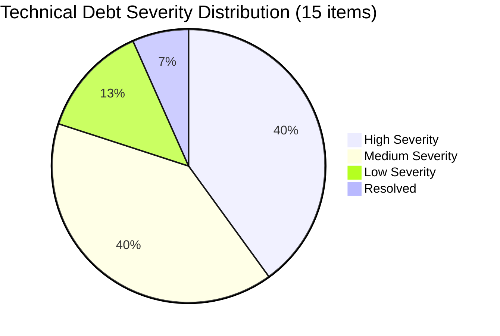
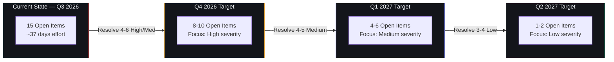

# Technical Debt Register

## Document Control

| Field | Value |
|---|---|
| Document ID | TEC-DEBT-001 |
| Version | 1.0.0 |
| Status | Active |
| Last Updated | 2026-07-12 |
| Classification | Internal |
| Owner | Developer |
| Review Cycle | Bi-weekly (at sprint planning) |

## 1. Living Register

| ID | Item | Category | Severity | Effort | Detected | Status | Owner | Notes |
|---|---|---|---|---|---|---|---|---|
| TD-001 | `sys.path` package loading in `conftest.py` | Infrastructure | High | 2 days | 2026-03-15 | 🔴 Open | Platform Eng | Replace with `pyproject.toml` project.install + `-e` install |
| TD-002 | No database migration framework | Database | High | 3 days | 2026-04-01 | 🔴 Open | DB Arch | Add Alembic; create initial migration from current schema |
| TD-003 | Python 3.10 EOL Oct 2026 | Platform | Medium | 1 day | 2026-05-01 | 🔴 Open | DevOps | Upgrade to 3.12; check all deps for compatibility |
| TD-004 | Next.js 14 → 15 upgrade pending | Frontend | Medium | 2 days | 2026-06-01 | 🔴 Open | Frontend | React 19, Turbopack stable; wait for critical deps to catch up |
| TD-005 | No staging environment | Infrastructure | High | 1 week | 2026-04-15 | 🔴 Open | DevOps | Railway staging project; DB snapshot + restore pipeline Q4 2026 |
| TD-006 | No event bus (cron → agent coupling) | Architecture | High | 2 weeks | 2026-04-20 | 🔵 Design | Chief Arch | Per ADR-008; Redis/RabbitMQ; target Q4 2026 |
| TD-007 | No API gateway / edge throttling | Security | Medium | 3 days | 2026-05-10 | 🔴 Open | Security | Rate limiting at edge (Vercel WAF or Cloudflare); not just app-level |
| TD-008 | Frontend vitest config needs Node v24 fix | QA | Medium | 1 day | 2026-06-15 | 🔴 Open | QA | Node 24 removed legacy API; `vitest.config.ts` needs update |
| TD-009 | Skills → agent prompt consolidation | AI | Low | 1 day | 2026-05-20 | 🔴 Open | AI Arch | Merge `opportunity_agent` + `opportunity_matching_agent` into one module |
| TD-010 | Duplicate `test_skills_api.py` coverage | QA | Low | 2 hours | 2026-06-10 | 🟢 Resolved | QA | Consolidated into `test_api_endpoints.py` — resolved 2026-06-18 |
| TD-011 | Inline Pydantic models in route files | Backend | High | 3 days | 2026-03-20 | 🟡 In Progress | API Team | Migrating to `database/schemas/`; 12/31 routes complete |
| TD-012 | No CI caching for `npm ci` / `pip install` | CI/CD | Medium | 1 day | 2026-05-05 | 🔴 Open | DevOps | Cache `~/.npm` and `~/.cache/pip` in GitHub Actions; reduces CI from 8m→3m |
| TD-013 | Scheduler single point of failure | Architecture | High | 1 week | 2026-04-25 | 🔵 Design | Chief Arch | APScheduler in single Railway container; need HA scheduler cluster |
| TD-014 | User-facing error messages not standardized | UX | Low | 2 days | 2026-05-15 | 🔴 Open | Frontend | Error catalog exists (`docs/engineering/api/error-catalog.md`); UI not consuming it |
| TD-015 | Test flakiness in `test_llm_client.py` (circuit breaker timing) | QA | Medium | 1 day | 2026-06-12 | 🟡 In Progress | QA | `time.sleep` in tests causes CI flakes; inject mock clock |
| TD-016 | AGENTS.md documentation drift (numerous count inaccuracies vs actual codebase — agent count 8→11, cron jobs 6→15, doc count 340→383) | Documentation | High | 1 day | 2026-07-14 | 🔴 Open | Developer | AGENTS.md counts outdated across sections 1,3,6,7,9; IMPLEMENTATION_STATUS.md, audit report, and index need coordinated update |

## 2. Severity Legend

| Severity | Definition | SLA |
|---|---|---|
| 🔴 Critical | Blocks production deployment or causes data loss | Resolve within 2 weeks |
| 🔴 High | Significant performance, security, or reliability risk | Resolve within 1 month |
| 🟡 Medium | Moderate impact; developer friction or edge case bugs | Resolve within 1 quarter |
| 🟢 Low | Cosmetic, nice-to-have, or minor optimization | Resolve when convenient |

## 3. Status Legend

| Status | Meaning |
|---|---|
| 🔴 Open | Not yet started |
| 🔵 Design | Solution being designed (ADR or RFC) |
| 🟡 In Progress | Active development underway |
| 🟢 Resolved | Fixed and verified |

## 3.5 Visual Overview

### 3.5.1 Severity Distribution

### 3.5.2 Resolution Trajectory

## 4. Cumulative Debt Overview

| Severity | Count | Estimated Effort |
|---|---|---|
| Critical | 0 | — |
| High | 6 | ~25 days |
| Medium | 6 | ~9 days |
| Low | 2 | ~3 days |
| Resolved | 1 | — |
| **Total Open** | **14** | ~37 days |

## 5. Related Documents

- [Enterprise Roadmap](enterprise-roadmap.md)
- [AGENTS.md — Code Style & Architecture Principles](../../AGENTS.md)
- [Architecture Decision Records](../engineering/adr/)
- [AGENTS.md §16 — Testing Standards](../../AGENTS.md)
