# Component Library Architecture

## Document Control

| Field | Value |
|---|---|
| Document ID | FE-CL-001 |
| Version | 1.0.0 |
| Status | Active |
| Last Updated | 2026-07-14 |
| Classification | Internal - Engineering |
| Target Audience | Frontend Developers |
| Cross-References | `AGENTS.md Section 5`, `FolderStructure.md`, `StateManagement.md`, `Design System` |

---

## Table of Contents

1. [Overview](#overview)
2. [Atomic Design Hierarchy](#atomic-design-hierarchy)
3. [Component Categories](#component-categories)
4. [UI Primitives Library](#ui-primitives-library)
5. [Layout Components](#layout-components)
6. [Shared Composites](#shared-composites)
7. [Feature Components](#feature-components)
8. [AI Components](#ai-components)
9. [Component API Patterns](#component-api-patterns)
10. [Storybook Integration](#storybook-integration)
11. [Composition Guidelines](#composition-guidelines)
12. [Performance Considerations](#performance-considerations)
13. [Related Documents](#related-documents)

---

## Overview

The ARIA OS component library follows the **Atomic Design** methodology, organizing components from primitive atoms (Button, Input, Card) through complex organisms (DataTable, KanbanBoard) to full page templates. The library consists of **40+ UI primitives** in `components/ui/`, **10+ layout components** in `components/layout/`, **10+ shared composites** in `components/shared/`, and **100+ feature components** across module-specific directories.

**Technology stack:**
- React 18 with TypeScript 5 (strict mode)
- Tailwind CSS 3 with design tokens from `tailwind.config.js`
- Framer Motion for animations
- shadcn/ui conventions for component API design
- Storybook 7 for component development and documentation

## Atomic Design Hierarchy

```mermaid
graph TD
    subgraph Level1["Level 1 — Atoms"]
        BTN[Button]
        INP[Input]
        CARD[Card]
        BADGE[Badge]
        DIALOG[Dialog]
        SELECT[Select]
        TOGGLE[Toggle]
        SPINNER[Spinner]
    end

    subgraph Level2["Level 2 — Molecules"]
        FF[FormField]
        BG[ButtonGroup]
        PG[Pagination]
        TB[TabBar]
        BC[Breadcrumbs]
        SB[SearchBar]
        DRP[DropdownMenu]
        SC[StatCard]
    end

    subgraph Level3["Level 3 — Organisms"]
        DT[DataTable]
        KB[KanbanBoard]
        RC[RoadmapCanvas]
        HM[Heatmap]
        ML[MessageList]
        CP[CommandPalette]
        CL[Calendar]
        AF[ActivityFeed]
    end

    subgraph Level4["Level 4 — Templates"]
        DL[Dashboard Layout]
        TL[Task List Layout]
        CL2[Course Layout]
        GL[Goal Layout]
    end

    subgraph Level5["Level 5 — Pages"]
        DP[Dashboard Page]
        TP[Tasks Page]
        CP2[Courses Page]
        HP[Habits Page]
    end

    Level1 --> Level2
    Level2 --> Level3
    Level3 --> Level4
    Level4 --> Level5

    style Level1 fill:#13151A,stroke:#6366F1,color:#F1F5F9
    style Level2 fill:#13151A,stroke:#818CF8,color:#F1F5F9
    style Level3 fill:#13151A,stroke:#00FFA3,color:#F1F5F9
    style Level4 fill:#13151A,stroke:#F59E0B,color:#F1F5F9
    style Level5 fill:#13151A,stroke:#EF4444,color:#F1F5F9
```



### Layer Dependency Rules

| Rule | Description | Enforcement |
|---|---|---|
| Atoms import nothing from molecules/organisms | Primitives depend only on `lib/utils/cn.ts` | ESLint import rule |
| Molecules import only from atoms | Composite components combine primitives | Code review |
| Organisms import from molecules + atoms | Complex composites use both lower layers | Code review |
| Templates import from organisms | Layout composition only | Architecture review |
| Pages orchestrate templates + local components | Thinnest layer, < 50 lines | FolderStructure.md |

## Component Categories

### Directory Structure

```
components/
├── ui/           # Level 1 — Atomic primitives (40+)
├── layout/       # Level 1-2 — App shell components
├── shared/       # Level 2-3 — Cross-module composites
├── ai/           # Level 3 — AI-specific components
├── motion/       # Level 1-2 — Animation components
├── analytics/    # Level 3 — Chart and data components
├── tasks/        # Level 3-4 — Task feature components
├── courses/      # Level 3-4 — Course feature components
├── habits/       # Level 3-4 — Habit feature components
├── sleep/        # Level 3-4 — Sleep feature components
├── goals/        # Level 3-4 — Goal feature components
├── income/       # Level 3-4 — Income feature components
├── projects/     # Level 3-4 — Project feature components
├── ideas/        # Level 3-4 — Idea feature components
├── resources/    # Level 3-4 — Resource feature components
├── opportunities/ # Level 3-4 — Opportunity feature components
├── dashboard/    # Level 3-4 — Dashboard widget components
├── chat/         # Level 3-4 — Chat components
├── feedback/     # Level 2-3 — Feedback form components
├── notifications/ # Level 2-3 — Notification components
├── settings/     # Level 3-4 — Settings page components
├── pwa/          # Level 2 — PWA install/update components
├── theme/        # Level 2 — Theme switcher components
├── memory/       # Level 3 — Memory consolidation UI
├── flags/        # Level 3 — Feature flag UI
├── focus/        # Level 3 — Focus mode components
├── knowledge/    # Level 3 — Knowledge graph components
├── shell/        # Level 3 — Responsive shell selection
└── command-center/ # Level 3 — Command palette components
```

## UI Primitives Library

The `components/ui/` directory contains all atomic UI primitives following shadcn/ui conventions.

### Complete Primitive Inventory

| Component | Variants | States | Dependencies | Storybook |
|---|---|---|---|---|
| `Button` | 5 (primary, secondary, ghost, danger, link) | 4 (default, hover, active, disabled, loading) | `cn.ts`, `framer-motion` | Button.stories.tsx |
| `Card` | 6 (default, interactive, compact, highlight, glass, gradient) | 3 (default, hover, active) | `cn.ts`, `framer-motion` | Card.stories.tsx |
| `Input` | 9 types (text, email, password, number, date, search, url, tel, file) | 7 (default, focus, error, disabled, readOnly, filled, hover) | `cn.ts` | Input.stories.tsx |
| `Textarea` | 2 (default, code) | 5 (default, focus, error, disabled, filled) | `cn.ts` | Textarea.stories.tsx |
| `Select` | 2 (default, searchable) | 5 (default, focus, open, disabled, error) | `cn.ts`, `@radix-ui/react-select` | Select.stories.tsx |
| `Checkbox` | 1 | 4 (unchecked, checked, indeterminate, disabled) | `cn.ts`, `@radix-ui/react-checkbox` | Checkbox.stories.tsx |
| `Radio` | 1 | 4 (unselected, selected, disabled, group) | `cn.ts`, `@radix-ui/react-radio-group` | Radio.stories.tsx |
| `Toggle` | 2 (default, labeled) | 4 (off, on, disabled, loading) | `cn.ts`, `framer-motion` | Toggle.stories.tsx |
| `Badge` | 3 (solid, outline, subtle) | 7 color variants (primary, success, warning, danger, info, neutral, neon) + status indicator | `cn.ts` | Badge.stories.tsx |
| `Dialog` | 5 sizes (sm, md, lg, xl, full) | 3 (closed, open, closing) | `cn.ts`, `@radix-ui/react-dialog`, `framer-motion` | Dialog.stories.tsx |
| `Modal` | (Legacy, replaced by Dialog) | -- | -- | -- |
| `Sheet` | 4 sides (left, right, top, bottom) | 2 (closed, open) | `cn.ts`, `@radix-ui/react-dialog`, `framer-motion` | Sheet.stories.tsx |
| `Drawer` | 2 (bottom-sheet, pull-down) | 3 (collapsed, partial, full) | `cn.ts`, `framer-motion`, `vaul` | Drawer.stories.tsx |
| `Popover` | 12 positions | 2 (closed, open) | `cn.ts`, `@radix-ui/react-popover` | Popover.stories.tsx |
| `Tooltip` | 4 positions (top, right, bottom, left) | 2 (hidden, shown) | `cn.ts`, `@radix-ui/react-tooltip` | Tooltip.stories.tsx |
| `DropdownMenu` | 2 (click, hover) | 2 (closed, open) | `cn.ts`, `@radix-ui/react-dropdown-menu` | DropdownMenu.stories.tsx |
| `Tabs` | 2 (underline, pill) | 3 (inactive, active, hover) | `cn.ts`, `@radix-ui/react-tabs` | Tabs.stories.tsx |
| `Skeleton` | 5 (text, circle, card, chart, table-row) | N/A (always loading) | `cn.ts` | Skeleton.stories.tsx |
| `Spinner` | 3 sizes (sm, md, lg) | -- | `cn.ts` | Spinner.stories.tsx |
| `Progress` | 2 (bar, ring) | 3 (empty, partial, complete) | `cn.ts` | Progress.stories.tsx |
| `Avatar` | 3 sizes (sm, md, lg) | 3 (image, initials, fallback) | `cn.ts`, `@radix-ui/react-avatar` | Avatar.stories.tsx |
| `Switch` | 1 | 3 (off, on, disabled) | `cn.ts`, `@radix-ui/react-switch` | Switch.stories.tsx |
| `Slider` | 1 | 4 (default, hover, dragging, disabled) | `cn.ts`, `@radix-ui/react-slider` | Slider.stories.tsx |
| `Command` | 1 | 2 (closed, open) | `cmdk`, `cn.ts` | Command.stories.tsx |
| `Separator` | 2 (horizontal, vertical) | -- | `cn.ts` | Separator.stories.tsx |
| `Table` | 2 (default, compact) | -- | `cn.ts` | Table.stories.tsx |
| `DataTable` | 2 (static, server-paginated) | 3 (loading, empty, populated) | `@tanstack/react-table`, `cn.ts` | DataTable.stories.tsx |
| `Calendar` | 2 (single, range) | -- | `react-day-picker`, `cn.ts` | Calendar.stories.tsx |
| `DatePicker` | 1 | -- | Calendar, Popover | DatePicker.stories.tsx |
| `Alert` | 4 (info, success, warning, error) | 2 (dismissable, persistent) | `cn.ts` | Alert.stories.tsx |
| `Toast` | 4 (success, error, warning, info) | 3 (entering, visible, exiting) | `sonner`, `cn.ts` | Toast.stories.tsx |
| `AspectRatio` | 1 | -- | `@radix-ui/react-aspect-ratio` | AspectRatio.stories.tsx |
| `ScrollArea` | 1 | -- | `@radix-ui/react-scroll-area` | ScrollArea.stories.tsx |
| `HoverCard` | 1 | 2 (hidden, shown) | `@radix-ui/react-hover-card` | HoverCard.stories.tsx |
| `ContextMenu` | 1 | 2 (closed, open) | `@radix-ui/react-context-menu` | ContextMenu.stories.tsx |
| `Collapsible` | 1 | 2 (collapsed, expanded) | `@radix-ui/react-collapsible` | Collapsible.stories.tsx |
| `Resizable` | 2 (horizontal, vertical) | -- | `react-resizable-panels` | Resizable.stories.tsx |

## Layout Components

Layout components define the app shell and are used exclusively in `app/(dashboard)/layout.tsx`.

| Component | Description | Responsive Behavior |
|---|---|---|
| `Sidebar` | Primary navigation panel (240px) | Collapses to icon bar (56px) on tablet, hidden on mobile |
| `Navbar` | Top navigation with breadcrumbs, search, user menu | Sticky, glass morphism, adjusts height on mobile |
| `MobileNav` | Bottom navigation tab bar (5 tabs + FAB) | Shown only on mobile (< 768px) |
| `ShellSelector` | Renders correct shell for current breakpoint | Reads `useResponsive()` hook |
| `DesktopShellLayout` | Sidebar + main area flex layout | Desktop only (>= 1024px) |
| `TabletShellLayout` | Collapsed sidebar + drawer | Tablet only (768-1199px) |
| `MobileShellLayout` | Top bar + content + bottom nav | Mobile only (< 768px) |
| `Breadcrumbs` | Hierarchical navigation trail | Max 3 levels, collapses on smaller screens |

## Shared Composites

Cross-module components used by two or more feature modules.

| Component | Used By | Purpose |
|---|---|---|
| `ErrorBoundary` | All modules | Catches React errors, shows fallback UI |
| `ModuleError` | All modules | Context-aware error display per status code |
| `ModuleLoading` | All modules | Skeleton matching page content structure |
| `LiveRegion` | AI chat, notifications | ARIA live region for screen reader announcements |
| `EmptyCanvas` | Tasks, courses, habits, etc. | Illustrated empty state with CTA |
| `OfflineBanner` | Root layout | Animated offline indicator with retry |
| `PostHogProvider` | Root layout | Analytics provider wrapper |
| `BentoGrid` | Dashboard | CSS grid with dense auto-placement |
| `KPIStrip` | Dashboard, analytics | Horizontal metric cards with sparklines |
| `ActivityHeatmap` | Dashboard, habits | GitHub-style contribution grid |
| `Timeline` | Goals, projects | Vertical timeline with milestone nodes |
| `ProgressRing` | Courses, habits | SVG circular progress indicator |
| `ProgressWithLabel` | All forms | Progress bar with percentage label |
| `SearchBar` | Resources, opportunities | Input + search icon + result counter |
| `ToastNotification` | All modules | Variant + message + optional action |

### Component API Pattern

Every component follows a consistent API design to ensure predictability.

```typescript
// Standard component template
interface ComponentProps {
  // Required props
  // ...

  // Optional props with defaults
  variant?: 'default' | 'primary' | 'secondary'
  size?: 'sm' | 'md' | 'lg'
  className?: string  // Always accept className for composition
  children?: React.ReactNode

  // Event handlers
  onClick?: (event: React.MouseEvent<HTMLButtonElement>) => void
  onChange?: (value: string) => void
}

export function Component({
  variant = 'default',
  size = 'md',
  className,
  children,
  ...props
}: ComponentProps) {
  return (
    <div className={cn('base-styles', variantStyles[variant], sizeStyles[size], className)} {...props}>
      {children}
    </div>
  )
}
```

### ForwardRef and Polymorphism

Interactive components use `forwardRef` and support `asChild` (as-known from Radix):

```typescript
import { forwardRef } from 'react'
import { Slot } from '@radix-ui/react-slot'

export const Button = forwardRef<HTMLButtonElement, ButtonProps>(
  ({ asChild = false, className, variant, size, ...props }, ref) => {
    const Comp = asChild ? Slot : 'button'
    return (
      <Comp
        ref={ref}
        className={cn(buttonVariants({ variant, size }), className)}
        {...props}
      />
    )
  }
)
Button.displayName = 'Button'
```

## Feature Components

Feature components live in module-named directories (`components/tasks/`, `components/courses/`, etc.) and are scoped to their module.

### Task Module Components

| Component | Description | Dependencies |
|---|---|---|
| `TaskCard` | Compact task display with priority bar, status, due date | Card, Badge, Checkbox |
| `TaskList` | Virtualized list with sorting, filtering | DataTable, ScrollArea |
| `TaskForm` | Create/edit task form with all fields | FormField, Input, Select, DatePicker |
| `TaskDetail` | Full task view with subtasks, activity, notes | Card, Tabs, Timeline |
| `KanbanBoard` | Drag-and-drop 4-column layout | @dnd-kit, ScrollArea |
| `KanbanCard` | Compact task card for kanban column | Badge, Avatar |
| `TaskCalendarView` | Calendar view with task dots | Calendar, Badge |

### Course Module Components

| Component | Description |
|---|---|
| `CourseCard` | Course progress card with ring + status |
| `CourseForm` | Create/edit course form |
| `CourseDetail` | Full course view with video list, progress |
| `CourseProgressBar` | Animated progress bar with percentage |
| `PlatformBadge` | Icon badge for Udemy/Coursera/NPTEL/YouTube |

### Habit Module Components

| Component | Description |
|---|---|
| `HabitCard` | Habit display with streak counter |
| `HabitCalendar` | Monthly calendar with completion dots |
| `HabitCheckin` | Daily check-in toggle |
| `HabitStats` | Consistency percentage, best streak, current streak |

### Dashboard Widgets

| Component | Description |
|---|---|
| `MorningBriefing` | AI-generated morning summary banner |
| `TodayFocus` | Today's priority tasks with checkboxes |
| `CourseProgress` | Active course progress rings (3 cards) |
| `OpportunityFeed` | Top 2 opportunity matches with scores |
| `ActiveProjects` | Project cards with progress bars |
| `WeeklyVelocity` | 7-day bar chart of task completions |
| `MilestoneTimeline` | Goal milestone progress visualization |

## AI Components

Specialized components for AI interaction, located in `components/ai/`:

| Component | States | Description |
|---|---|---|
| `StreamingText` | idle, streaming, complete, error | Token-by-token reveal with blur transition |
| `ThinkingIndicator` | idle, thinking, complete, error, cancelled | Pulsing glow with bounce dots |
| `GhostHint` | hidden, visible, filled, dismissed | Muted italic suggestion below input |
| `SuggestionChips` | default, hover, selected, disabled | Horizontal chips with gradient effect |
| `ConfidenceBadge` | high (85+), medium (60-84), low (< 60) | Color-coded confidence indicator |
| `AIInsightCard` | recommendation, insight, alert | Gradient background by type |
| `AIUndo` | visible, expiring, expired | 10s countdown toast with undo |
| `AIDock` | idle, open, thinking, streaming | Fixed bottom-right chat trigger |

## Storybook Integration

Storybook is configured at `.storybook/` and provides component development, documentation, and visual testing.

### Storybook Configuration

```typescript
// .storybook/main.ts
const config: StorybookConfig = {
  stories: [
    '../components/**/*.stories.@(ts|tsx)',
    '../stories/**/*.stories.@(ts|tsx)',
  ],
  addons: [
    '@storybook/addon-links',
    '@storybook/addon-essentials',
    '@storybook/addon-interactions',
    '@storybook/addon-a11y',
    'storybook-dark-mode',
  ],
  framework: '@storybook/nextjs',
}
```

### Story Coverage Requirements

| Component Category | Stories Required | Minimum Coverage |
|---|---|---|
| UI Primitives (atoms) | All variants + all states | 100% |
| Layout components | All responsive states | 100% |
| Shared composites | All variants | 80% |
| Feature components | Primary state + loading + empty + error | 80% |
| AI components | All states (5+) | 100% |

### Story Template

```typescript
// components/ui/Button.stories.tsx
import type { Meta, StoryObj } from '@storybook/react'
import { Button } from './Button'

const meta: Meta<typeof Button> = {
  title: 'UI/Button',
  component: Button,
  argTypes: {
    variant: { control: 'select', options: ['primary', 'secondary', 'ghost', 'danger', 'link'] },
    size: { control: 'select', options: ['sm', 'md', 'lg'] },
    disabled: { control: 'boolean' },
    loading: { control: 'boolean' },
  },
}

export default meta
type Story = StoryObj<typeof Button>

export const Primary: Story = {
  args: { variant: 'primary', children: 'Primary Button' },
}

export const AllVariants: Story = {
  render: () => (
    <div className="flex gap-4">
      <Button variant="primary">Primary</Button>
      <Button variant="secondary">Secondary</Button>
      <Button variant="ghost">Ghost</Button>
      <Button variant="danger">Danger</Button>
      <Button variant="link">Link</Button>
    </div>
  ),
}

export const Loading: Story = {
  args: { loading: true, children: 'Loading...' },
}
```

## Composition Guidelines

### Component Composition Patterns

1. **Compound Components** for complex, interconnected UIs:

```typescript
<Card>
  <CardHeader>
    <CardTitle>Section Title</CardTitle>
    <CardDescription>Optional description</CardDescription>
  </CardHeader>
  <CardContent>
    <p>Main content here</p>
  </CardContent>
  <CardFooter>
    <Button>Action</Button>
  </CardFooter>
</Card>
```

2. **Polymorphism via asChild** for flexible element types:

```typescript
<Button asChild>
  <Link href="/tasks">Go to Tasks</Link>
</Button>
```

3. **Controlled + Uncontrolled** for form components:

```typescript
// Controlled
<Input value={name} onChange={(e) => setName(e.target.value)} />

// Uncontrolled
<Input defaultValue="Default" />
```

4. **Render Props** for data-display components:

```typescript
<DataTable
  columns={columns}
  data={tasks}
  renderRow={(row) => <TaskRow task={row} />}
/>
```

### Composition Anti-Patterns

| Anti-Pattern | Why | Preferred Approach |
|---|---|---|
| Prop drilling (5+ levels) | Hard to maintain, fragile | Context provider or Zustand store |
| Boolean prop explosion | Components become hard to reason about | Compound components or variant system |
| Large component files (>300 lines) | Impossible to test and maintain | Split into smaller sub-components |
| Mixing data fetching with rendering | Violates separation of concerns | Use data hooks in containers, pass props to presentational components |
| CSS-in-JS mixing with Tailwind | Conflicting styling approaches | Use Tailwind exclusively with cn() utility |

## Performance Considerations

| Technique | Impact | Applied To |
|---|---|---|
| React.memo | Prevents unnecessary re-renders | Card, Badge, TaskCard (leaf components) |
| useMemo on expensive computations | Cache computed values | Filter/sort operations, chart data |
| useCallback for event handlers | Stable references for child components | All components with child callbacks |
| Dynamic imports for heavy components | Code splitting, smaller bundles | RoadmapEditor, ThreeBackground, KnowledgeGraph |
| Virtual scrolling for long lists | DOM size management | TaskList, DataTable, MessageList |
| Image lazy loading | Reduce initial payload | Resource library, course thumbnails |
| CSS containment (content-visibility) | Skip off-screen renders | Long lists, cards |

## Related Documents

| Document | Description |
|---|---|
| [FolderStructure.md](FolderStructure.md) | Directory organization and naming conventions |
| [StateManagement.md](StateManagement.md) | State management architecture and patterns |
| [RenderingStrategy.md](RenderingStrategy.md) | SSR, CSR, ISR rendering approach |
| [SEO.md](SEO.md) | Frontend SEO strategy |
| [Design System](../../docs/design/10_DesignSystem.md) | Design tokens, color system, typography |
| [IMPLEMENTATION_BACKLOG.md](IMPLEMENTATION_BACKLOG.md) | Frontend implementation tracking |
| [AGENTS.md Section 5](../../AGENTS.md) | UI/UX design system guidelines |

---

## Revision History

| Version | Date | Author | Changes |
|---|---|---|---|
| 1.0.0 | 2026-07-14 | Developer | Initial component library documentation |
